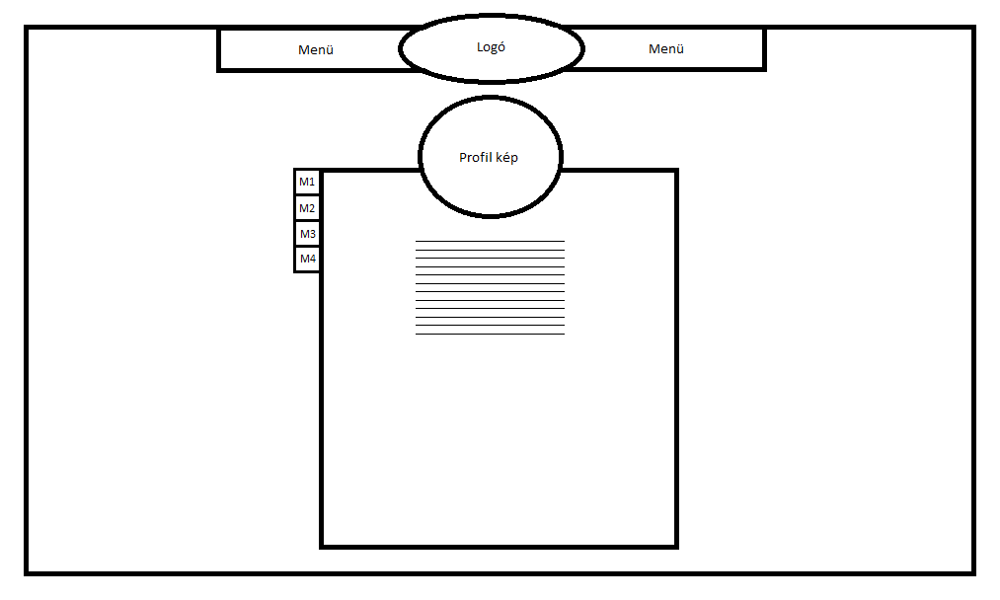

# GameRanks - dokumentáció

Készítette: Kovács Dávid

## 1. Követelményanalízis

### 1.1 A program célja

A GameRanks egy játékosoknak szánt webes alkalmazás, ahol lehetőség nyílik arra, hogy megosszuk egymással véleményünket, kedvenc játékainkkal kapcsolatban. Legyen szó PC -s, vagy konzolos játékról, itt lehetőséged nyílik, hogy te magad alkoss véleményt, kiemeld mi jó, vagy rossz a játékban és hogy megadd azt a pontszámot, amennyit szerinted ér a játék. A pontszámok összesítésre kerülnek, így mindeki nyomonkövetheti, hogy melyek is azon játékok, amik leginkább elnyerték a játékosok tetszését.

#### 1.1.1 Funkcionális követelmények

- Regisztráció
- Bejelentkezés
- Az oldalon található játékok értékeléseinek böngészése
- Csak bejelentkezett felhasználóknak elérhető funkciók
  - Profil szerkesztése
    - Avatar módosítása
    - Saját értékelések megtekintése, módosítása, törlése
    - Alap adatok megtekintése és módosítása
  - Értékelések írása
  - Más értékelések véleményezése

#### 1.1.2 Nem funkcionális követelmények

- A játékok gyors közvetlen elérése
  - A játékokat úgy kell megjeleníteni, hogy a felhasználó minnél gyorsabban elérhesse azt, amelyiket szeretné
    - Kategóriákba osztás
    - Vizuális elkülönítés
    - Átlátható listázás
- Lényegretörő értékelési módszer
  - Az értékelések legfontosabb részeinek (Pro/Kontra/Pontszám) kiemelése
- A felület könnyű áttekinthetősége
  - Letisztult, rendezett, lényegretörő felület, a minnél hatékonyabb és gyorsabb használat érdekében
- Felhasználóbarát működés
  - Hibák, gondok, információk jelzése a felhasználónak
    - Rosszul kitöltött mezők jelzése
    - Módosítások eredményének jelzése
  - Megerősítés kérése, módosítások, vagy törlések esetén
- Bővíthetőség, karbantarthatóság
  - A programnak úgy kell felépülnie, hogy azt a későbbiekben is könnyen lehessen bővíteni és az esetleges hibákat könnyen lehessen javítani

### 1.2 Szakterületi fogalomjegyzék

#### 1.2.1 Játék kategóriák
- **Action**: akció játékok
- **Adventure**: kaland játékok
- **Casual**: alkalmi játékok
- **Indie**: indie játékok
- **MMO**: online többjátékos játékok
- **Racing**: versenyzős játékok
- **RPG**: szerepjátékok
- **Simulation**: szimulátor játékok
- **Sports**: sport játékok
- **Strategy**: stratégiai játékok

### 1.3 Használatieset-modell

#### 1.3.1 Szerepkörök
**Látogató**: Azon funkciókat érheti el, melyek nem igényelnek bejelentkezést
  - Regisztráció
  - Bejelentkezés
  - Játékok listázása
  - Kiválasztott játék adatlapjának és mások értékeléseinek megtekintése

**Tag**: Regisztrált felhasználó, aki a bejelentkezést igénylő funkciókhoz is hozzáfér
  - Profil megtekintése és szerkesztése
  - Saját értékelések szerkesztése
  - Játékok értékelése
  - Mások értékeléseinek véleményezése
  
#### 1.3.2 Használati eset diagramok
**Látogató**

**Tag**

#### 1.3.3 Példa folyamat jellemzése
**Új értékelés írása**
  1. A felhasználó megkeresi az értékelni kívánt játékot, a játékok listájából
  2. Ha még nem tette meg, akkor belép a felhasználó
  3. A játékot kiválasztva, ha még nem írt értékelést, akkor lehetősége nyílik azt megtenni
  4. Az értékelés megírása után, azt véglegesíti, így az meg is jelenik a játék és a saját értékelései közt
  
  

## 2. Tervezés

### 2.1 Architektúra terv
#### 2.1.1 Oldaltérkép

#### 2.1.2 Végpontok
  - /api

      | Útvonal | Metódus | Leírás |
      | ------- | :----: | ------ |
      | /                | GET  | Főoldalon megjelenő adatok lekérése |
      | /login           | POST | Bejelentkezéshez szükséges adatok elküldése |
      | /logout          | POST | Kilépéshez szükséges adatok elküldése |
      | /register        | POST | Regisztráláshoz szükséges adatok elküldése |
    
  - /api/user
  
      | Útvonal | Metódus | Leírás |
      | ------- | :----: | ------ |
      | /                | GET | A belépett felhasználó adatainak lekérése |
      | /changeAvatar     | PUT | Avatar változtatás |
      | /changePassword   | PUT | Jelszó változtatás |
      | /changeEmail      | PUT | Email változtatás |
    
  - /api/game

      | Útvonal | Metódus | Leírás |
      | ------- | :----: | ------ |
      | /                | GET    | Játékok listájának lekérése |
      | /list            | GET    | További játékok lekérése a listába |
      | /{id}            | GET    | Egy konkrét játék adatainak lekérése |
      | /{id}            | POST   | Értékelés küldése egy játékhoz |
      | /{id}            | PUT    | Meglévő értékelés megváltoztatása |
      | /{id}            | DELETE | Értékelés törlése |
    
  - /api/publisher
  
      | Útvonal | Metódus | Leírás |
      | ------- | :----: | ------ |
      | /                | GET | Kiadók listájának lekérése |
      | /list            | GET | További kiadók lekérése a listába |
      | /{id}            | GET | Egy konkrét kiadó adatainak lekérése |
      | /list/{id}       | GET | További játékok lekérése a kiadó játékainak listájába |
    
  - /api/developer
  
      | Útvonal | Metódus | Leírás |
      | ------- | :----: | ------ |
      | /                | GET | Fejlesztők listájának lekérése |
      | /list            | GET | További fejlesztők lekérése a listába |
      | /{id}            | GET | Egy konkrét fejlesztő adatainak lekérése |
      | /list/{id}       | GET | További játékok lekérése a fejlesztő játékainak listájába |

### 2.2 Felhasználóifelület-modell
#### 2.2.1 Oldalvázlatok
##### Kezdő oldal

##### Játékok/Kiadók/Fejlesztők oldala

##### Játékok kezdő oldala

##### Egy játék oldala

##### Játék értékelései

##### Egy kiadó/fejlesztő oldala

##### Felhasználó oldala

#### 2.2.2 Megjelenés
##### Kezdő oldal 1.

##### Kezdő oldal 2.

##### Játékok oldala 1.

##### Játékok oldala 2.

##### Játék oldala 1.

##### Játék oldala 2.

##### Kiadók oldala 1.

##### Kiadók oldala 2.

##### Kiadó oldala 1.

##### Kiadó oldala 2.

##### Kiadó oldala 3.

##### Fejlesztők oldala 1.

##### Fejlesztők oldala 2.

##### Fejlesztő oldala 1.

##### Fejlesztő oldala 2.

##### Fejlesztő oldala 3.

##### Felhasználó oldala 1.

##### Felhasználó oldala 2.

### 2.3 Osztálymodell
#### 2.3.1 Adatbázisterv

### 2.4 Dinamikus működés
#### 2.4.1 Szekvenciadiagram
A **/api/game/{id}** végpont, POST metódusának működése:

## 3. Implementáció

### 3.1 Fejlesztői környezet

#### 3.1.1 Szerver oldal
A szerver megvalósításához a JAVA Spring keretrendszerét használtam, az alábbi technológiákkal kiegészítve:
  - H2
  - JPA
  - Lombok
  - Thymeleaf
  - DevTools

A szervert futtatás után, a localhost:8080 címen érhetjük el.

#### 3.1.2 Kliens oldal
Kliens oldalon az AngularJS framework -öt használtam, az SPA megalkotására.

### 3.2 Könyvtárstruktúra
#### 3.2.1 Szerver oldal

Click to expand

<pre>
GameRanks
│   .gitignore
│   mvnw
│   mvnw.cmd
│   pom.xml
│   
├───.mvn
│   └───wrapper
│           maven-wrapper.jar
│           maven-wrapper.properties
│           
├───src
│   ├───main
│   │   ├───java
│   │   │   └───GameRanks
│   │   │       └───GameRanks
│   │   │           │   GameRanksApplication.java
│   │   │           │   
│   │   │           ├───annotation
│   │   │           │       AccessBy.java
│   │   │           │       
│   │   │           ├───api
│   │   │           │       DeveloperApiController.java
│   │   │           │       GameApiController.java
│   │   │           │       GeneralApiController.java
│   │   │           │       PublisherApiController.java
│   │   │           │       UserApiController.java
│   │   │           │       
│   │   │           ├───clientStruct
│   │   │           │   ├───element
│   │   │           │   │       DeveloperStruct.java
│   │   │           │   │       GameStruct.java
│   │   │           │   │       Message.java
│   │   │           │   │       NewReviewStruct.java
│   │   │           │   │       PublisherStruct.java
│   │   │           │   │       UserPageReviewStruct.java
│   │   │           │   │       UserStruct.java
│   │   │           │   │       
│   │   │           │   └───page
│   │   │           │           DeveloperPageStruct.java
│   │   │           │           MainPageStruct.java
│   │   │           │           PublisherPageStruct.java
│   │   │           │           UserPageStruct.java
│   │   │           │           
│   │   │           ├───config
│   │   │           │       WebMvcConfig.java
│   │   │           │       
│   │   │           ├───controller
│   │   │           │       DeveloperController.java
│   │   │           │       GameController.java
│   │   │           │       GeneralController.java
│   │   │           │       PublisherController.java
│   │   │           │       UserController.java
│   │   │           │       
│   │   │           ├───exception
│   │   │           │       EmailInUseException.java
│   │   │           │       UserNotValidException.java
│   │   │           │       
│   │   │           ├───interceptor
│   │   │           │       AuthInterceptor.java
│   │   │           │       
│   │   │           ├───model
│   │   │           │       BaseModel.java
│   │   │           │       Developer.java
│   │   │           │       Game.java
│   │   │           │       Publisher.java
│   │   │           │       Review.java
│   │   │           │       User.java
│   │   │           │       
│   │   │           ├───repository
│   │   │           │       DeveloperRepository.java
│   │   │           │       GameRepository.java
│   │   │           │       PublisherRepository.java
│   │   │           │       ReviewRepository.java
│   │   │           │       UserRepository.java
│   │   │           │       
│   │   │           ├───serverStruct
│   │   │           │       ScoreStruct.java
│   │   │           │       StatisticStruct.java
│   │   │           │       
│   │   │           └───service
│   │   │                   DeveloperService.java
│   │   │                   GameService.java
│   │   │                   PublisherService.java
│   │   │                   ReviewService.java
│   │   │                   SteamService.java
│   │   │                   UserService.java
│   │   │                   
│   │   └───resources
│   │       │   application.properties
│   │       │   import.sql
│   │       │   
│   │       ├───static
│   │       └───templates
│   │               developer.html
│   │               developerList.html
│   │               game.html
│   │               gameList.html
│   │               login.html
│   │               main.html
│   │               notFound.html
│   │               publisher.html
│   │               publisherList.html
│   │               register.html
│   │               user.html
│   │               
│   └───test
│       └───java
│           └───GameRanks
│               └───GameRanks
│                       GameRanksApplicationTests.java
│                       
└───target
    │   GameRanks-0.0.1-SNAPSHOT.jar
    │   GameRanks-0.0.1-SNAPSHOT.jar.original
    │   
    ├───classes
    │   │   .netbeans_automatic_build
    │   │   application.properties
    │   │   import.sql
    │   │   
    │   ├───GameRanks
    │   │   └───GameRanks
    │   │       │   GameRanksApplication.class
    │   │       │   
    │   │       ├───annotation
    │   │       │       AccessBy.class
    │   │       │       
    │   │       ├───api
    │   │       │       DeveloperApiController.class
    │   │       │       GameApiController.class
    │   │       │       GeneralApiController.class
    │   │       │       PublisherApiController.class
    │   │       │       UserApiController.class
    │   │       │       
    │   │       ├───clientStruct
    │   │       │   ├───element
    │   │       │   │       DeveloperStruct.class
    │   │       │   │       GameStruct.class
    │   │       │   │       Message.class
    │   │       │   │       NewReviewStruct.class
    │   │       │   │       PublisherStruct.class
    │   │       │   │       UserPageReviewStruct.class
    │   │       │   │       UserStruct.class
    │   │       │   │       
    │   │       │   └───page
    │   │       │           DeveloperPageStruct.class
    │   │       │           MainPageStruct.class
    │   │       │           PublisherPageStruct.class
    │   │       │           UserPageStruct.class
    │   │       │           
    │   │       ├───config
    │   │       │       WebMvcConfig$1.class
    │   │       │       WebMvcConfig.class
    │   │       │       
    │   │       ├───controller
    │   │       │       DeveloperController.class
    │   │       │       GameController.class
    │   │       │       GeneralController.class
    │   │       │       PublisherController.class
    │   │       │       UserController.class
    │   │       │       
    │   │       ├───exception
    │   │       │       EmailInUseException.class
    │   │       │       UserNotValidException.class
    │   │       │       
    │   │       ├───handler
    │   │       ├───interceptor
    │   │       │       AuthInterceptor.class
    │   │       │       
    │   │       ├───model
    │   │       │       BaseModel.class
    │   │       │       Developer.class
    │   │       │       Game$Genre.class
    │   │       │       Game$Platform.class
    │   │       │       Game.class
    │   │       │       Publisher.class
    │   │       │       Review.class
    │   │       │       User$AccessLevel.class
    │   │       │       User.class
    │   │       │       
    │   │       ├───repository
    │   │       │       DeveloperRepository.class
    │   │       │       GameRepository.class
    │   │       │       PublisherRepository.class
    │   │       │       ReviewRepository.class
    │   │       │       UserRepository.class
    │   │       │       
    │   │       ├───responseStruct
    │   │       ├───serverStruct
    │   │       │       ScoreStruct.class
    │   │       │       StatisticStruct.class
    │   │       │       
    │   │       └───service
    │   │               DeveloperService.class
    │   │               GameService.class
    │   │               PublisherService.class
    │   │               ReviewService.class
    │   │               SteamService.class
    │   │               UserService.class
    │   │               
    │   └───templates
    │           developer.html
    │           developerList.html
    │           game.html
    │           gameList.html
    │           login.html
    │           main.html
    │           notFound.html
    │           publisher.html
    │           publisherList.html
    │           register.html
    │           user.html
    │           
    ├───generated-sources
    │   └───annotations
    ├───generated-test-sources
    │   └───test-annotations
    ├───maven-archiver
    │       pom.properties
    │       
    ├───maven-status
    │   └───maven-compiler-plugin
    │       ├───compile
    │       │   └───default-compile
    │       │           createdFiles.lst
    │       │           inputFiles.lst
    │       │           
    │       └───testCompile
    │           └───default-testCompile
    │                   createdFiles.lst
    │                   inputFiles.lst
    │                   
    ├───surefire-reports
    │       GameRanks.GameRanks.GameRanksApplicationTests.txt
    │       TEST-GameRanks.GameRanks.GameRanksApplicationTests.xml
    │       
    └───test-classes
        │   .netbeans_automatic_build
        │   
        └───GameRanks
            └───GameRanks
                    GameRanksApplicationTests.class
</pre>

### 3.3 Kapcsolat a szerverrel
- A kliens a szerverrel a DAL (Data Access Layer) modulon keresztül kommunikál. A modul két részből áll, a DALForReads -ből, mellyel adatlekéréseket, illetve a DALForWrites -ból, amivel adat módosításokat végzünk. Mindkét esetben a szerver megfelelő /api végpontját hívjuk, az Angular HttpClient modulja segítségével.

- A DALForReads különböző metódusokra oszlik, a lekért információktól függően. Ezen metódusok az alkalmazás egyik oldala meglátogatása, vagy egy funkció (lista szűrése, új játékok kérése stb.) használata esetén kerülnek meghívásra.

- A DALForWrites szintén különböző metódusokra osztható, a modosítani kívánt adatoktól függően. Ilyen például egy új értékelés felvétele, adataink módosítása stb.

- A szerver a végpontjainak hívására, egy objektummal/struktúrával válaszol (végpontonként eltérő, de vannak megegyezők). A struktúra általában a kért információkat, vagy probléma esetén, a probléma okát tartalmazza, melyet ha szükséges, meg is jelenítünk a felhasználónak.

## 4. Felhasználói dokumentáció
### 4.1 A futtatáshoz ajánlott hardver és szoftver konfiguráció
A program használatához a szervert és a kliens kiszolgálóját egyszerre kell futtatni, melyhez egy hagyományos konfigurációval rendelkezők számítógép szükséges, valamint egy tetszés szerinti böngésző, ahol megnyitjuk az alkalmazást.

### 4.2 Letöltés, futtatás
- A programot két részben kell letölteni. Elsőként a szervert, mely a GameRanks mappában található, majd ezt követően a GameRanksClient mappában lévő klienst. Ezt megtehetjük a git clone paranccsal, vagy egyszerűen letöltjük .zip formátumban a mappákat.

- Letöltést követően a szervert (GameRanks) egy általunk választott IDE -ben, vagy parancssorból futtathatjuk. Ezt követően a localhost:8080 címen lesz elérhető.

- A kliens (GameRanksClient) esetében elsőként ki kell adnunk az npm install parancsot, a gyökér mappában, hogy települjenek a szükséges függőségek. Ezután ugyan itt adjuk ki az npm start parancsot a futtatáshoz. Az elindulást követően, az alkalmazás a localhost:4200 -as címen lesz elérhető.

### 4.3 Kliensoldali szolgáltatások
- Folyamatosan frissülő ranglista
A GameRanks oldala a játésosok véleméynén alapszik. Minden egyes új értékelés befolyásolja, hogy mely játék, milyen pontszámmal rendelkezik, ezáltal meghatározva rangsorbeli pozícióját. Mivel a játékokat fejlesztők készítették és kiadók adták ki, minden egyes módosítás kiahat az ő értékelésükre is, ezzel létrehozva egy dinamikusan változó ranglistát.
Az rangsor játékokra, kiadókra és fejlesztőkre oszlik, az egyszerűbb eligazodás érdekében.

- Kedvenceink
Minden egyes játékról megannyi információ áll rendelkezésünkre, ha meglátogatjuk a játék oldalát. Itt megtekinthetjük az alapvető adatokat (műfaj, platform, kiadó, fejlesztő) a játék pontszámát, sőt, aki többre vágyik az megcsodálhatja a játékhoz kapcsolódó galériát és belemerülhet a játék szöveges ismertetésébe.
A játékoknál megtaláljuk azok értékeléseit is, így teljessé téve a listát.

- Az alkotók
Az oldalon nem csak a játékok kapják a főszerepet, így a kiadókat és fejlesztőket böngészve, statisztikákat találhatunk, melyek bővebb információt adnak arról, hogy mely műfajban érdekelt az aktuális cég, hogyan oszlik meg platformonként az értékelések aránya és még sorolhatnám.
Az egyszerűséget követve, az adott kiadó/fejlesztő esetében, megtalálhatjuk az általa kiadott/fejlesztett játékok listáját is.

- Én, az értékelő
Regisztráció és belépés után, feltárulnak előttünk az eddig rejtett funkciók. Többek között testreszabhatjuk profilunkat, valamint saját értékeléseket írhatunk, melyeket aztán kedvünk szerint módosíthatunk, vagy törölhetünk.

### 4.4 A program használata
- A localhost:4200 cím meglátogatását követően, a menü segítségével juthatunk el a különböző oldalakra.

- A játékok/kiadók/fejlesztők oldalán, lehetőségünk van a lista tartalmát szűrni, a nagyító ikonra kattintva. Itt különbőző szempontok állíthatunk be, majd a "Filter" gombra kattintva szűrhetünk. A lista aljára érve, autómatikusan újabb elemek kerülnek betöltésre, ha még vannak.

- Regisztrálni a jobb fölső sarokban a kulcs, majd azon belül a "Register" gombra kattintva lehet.

- Bejelentkezni a jobb fölső sarokban, a kulcs ikonra kattintás után lehet, a név és jelszó megadásával.

- Belépés után lehetőségünk van saját profilunk megtekintésére, a jobb fölül megjelenő avatar ikon által. Itt a fogaskerék ikonra kattintva modosíthatjuk adatainkat, lentebb pedig megtekinthetjük és módosíthatjuk saját értékeléseinket.

- Belépés után lehetőségünk van új értékelés írására. Ehhez meg kell látogatnunk az értékelni kívánt játék oldalát, majd ott a ceruza ikonra kattintva, kitölthetjük az értékelési szempontokat. Egy felhasználó, egy játékhoz, csak egy értékelést írhat.