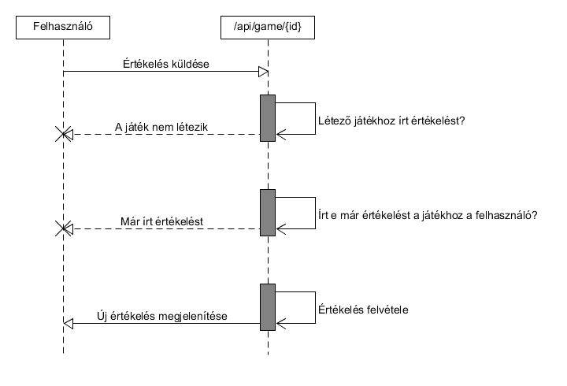

# GameRanks - dokumentáció

Készítette: Kovács Dávid

## 1. Követelményanalízis

### 1.1 A program célja

A GameRanks egy játékosoknak szánt webes alkalmazás, ahol lehetőség nyílik arra, hogy megosszuk egymással véleményünket, kedvenc játékainkkal kapcsolatban. Legyen szó PC -s, vagy konzolos játékról, itt lehetőséged nyílik, hogy te magad alkoss véleményt, kiemeld mi jó, vagy rossz a játékban és hogy megadd azt a pontszámot, amennyit szerinted ér a játék. A pontszámok összesítésre kerülnek, így mindeki nyomonkövetheti, hogy melyek is azon játékok, amik leginkább elnyerték a játékosok tetszését.

#### 1.1.1 Funkcionális követelmények

- Regisztráció
- Bejelentkezés
- Az oldalon található játékok értékeléseinek böngészése
- Csak bejelentkezett felhasználóknak elérhető funkciók
  - Profil szerkesztése
    - Avatar módosítása
    - Saját értékelések megtekintése, módosítása, törlése
    - Alap adatok megtekintése és módosítása
  - Értékelések írása
  - Más értékelések véleményezése

#### 1.1.2 Nem funkcionális követelmények

- A játékok gyors közvetlen elérése
  - A játékokat úgy kell megjeleníteni, hogy a felhasználó minnél gyorsabban elérhesse azt, amelyiket szeretné
    - Kategóriákba osztás
    - Vizuális elkülönítés
    - Átlátható listázás
- Lényegretörő értékelési módszer
  - Az értékelések legfontosabb részeinek (Pro/Kontra/Pontszám) kiemelése
- A felület könnyű áttekinthetősége
  - Letisztult, rendezett, lényegretörő felület, a minnél hatékonyabb és gyorsabb használat érdekében
- Felhasználóbarát működés
  - Hibák, gondok, információk jelzése a felhasználónak
    - Rosszul kitöltött mezők jelzése
    - Módosítások eredményének jelzése
  - Megerősítés kérése, módosítások, vagy törlések esetén
- Bővíthetőség, karbantarthatóság
  - A programnak úgy kell felépülnie, hogy azt a későbbiekben is könnyen lehessen bővíteni és az esetleges hibákat könnyen lehessen javítani

### 1.2 Szakterületi fogalomjegyzék

#### 1.2.1 Játék kategóriák
- **Action**: akció játékok
- **Adventure**: kaland játékok
- **Casual**: alkalmi játékok
- **Indie**: indie játékok
- **MMO**: online többjátékos játékok
- **Racing**: versenyzős játékok
- **RPG**: szerepjátékok
- **Simulation**: szimulátor játékok
- **Sports**: sport játékok
- **Strategy**: stratégiai játékok

### 1.3 Használatieset-modell

#### 1.3.1 Szerepkörök
**Látogató**: Azon funkciókat érheti el, melyek nem igényelnek bejelentkezést
  - Regisztráció
  - Bejelentkezés
  - Játékok listázása
  - Kiválasztott játék adatlapjának és mások értékeléseinek megtekintése

**Tag**: Regisztrált felhasználó, aki a bejelentkezést igénylő funkciókhoz is hozzáfér
  - Profil megtekintése és szerkesztése
  - Saját értékelések szerkesztése
  - Játékok értékelése
  - Mások értékeléseinek véleményezése
  
#### 1.3.2 Használati eset diagramok
**Látogató**

**Tag**

#### 1.3.3 Példa folyamat jellemzése
**Új értékelés írása**
  1. A felhasználó megkeresi az értékelni kívánt játékot, a játékok listájából
  2. Ha még nem tette meg, akkor belép a felhasználó
  3. A játékot kiválasztva, ha még nem írt értékelést, akkor lehetősége nyílik azt megtenni
  4. Az értékelés megírása után, azt véglegesíti, így az meg is jelenik a játék és a saját értékelései közt
  
  

## 2. Tervezés

### 2.1 Architektúra terv
#### 2.1.1 Oldaltérkép

#### 2.1.2 Végpontok
  - /api

      | Útvonal | Metódus | Leírás |
      | ------- | :----: | ------ |
      | /                | GET  | Főoldalon megjelenő adatok lekérése |
      | /login           | POST | Bejelentkezéshez szükséges adatok elküldése |
      | /logout          | POST | Kilépéshez szükséges adatok elküldése |
      | /register        | POST | Regisztráláshoz szükséges adatok elküldése |
    
  - /api/user
  
      | Útvonal | Metódus | Leírás |
      | ------- | :----: | ------ |
      | /                | GET | A belépett felhasználó adatainak lekérése |
      | /changeAvatar     | PUT | Avatar változtatás |
      | /changePassword   | PUT | Jelszó változtatás |
      | /changeEmail      | PUT | Email változtatás |
    
  - /api/game

      | Útvonal | Metódus | Leírás |
      | ------- | :----: | ------ |
      | /                | GET    | Játékok listájának lekérése |
      | /list            | GET    | További játékok lekérése a listába |
      | /{id}            | GET    | Egy konkrét játék adatainak lekérése |
      | /{id}            | POST   | Értékelés küldése egy játékhoz |
      | /{id}            | PUT    | Meglévő értékelés megváltoztatása |
      | /{id}            | DELETE | Értékelés törlése |
    
  - /api/publisher
  
      | Útvonal | Metódus | Leírás |
      | ------- | :----: | ------ |
      | /                | GET | Kiadók listájának lekérése |
      | /list            | GET | További kiadók lekérése a listába |
      | /{id}            | GET | Egy konkrét kiadó adatainak lekérése |
      | /list/{id}       | GET | További játékok lekérése a kiadó játékainak listájába |
    
  - /api/developer
  
      | Útvonal | Metódus | Leírás |
      | ------- | :----: | ------ |
      | /                | GET | Fejlesztők listájának lekérése |
      | /list            | GET | További fejlesztők lekérése a listába |
      | /{id}            | GET | Egy konkrét fejlesztő adatainak lekérése |
      | /list/{id}       | GET | További játékok lekérése a fejlesztő játékainak listájába |

### 2.2 Felhasználóifelület-modell
#### 2.2.1 Oldalvázlatok
##### Kezdő oldal

##### Játékok/Kiadók/Fejlesztők oldala

##### Játékok kezdő oldala

##### Egy játék oldala

##### Játék értékelései

##### Egy kiadó/fejlesztő oldala

##### Felhasználó oldala

#### 2.2.2 Megjelenés
##### Kezdő oldal 1.

##### Kezdő oldal 2.

##### Játékok oldala 1.

##### Játékok oldala 2.

##### Játék oldala 1.

##### Játék oldala 2.

##### Kiadók oldala 1.

##### Kiadók oldala 2.

##### Kiadó oldala 1.

##### Kiadó oldala 2.

##### Kiadó oldala 3.

##### Fejlesztők oldala 1.

##### Fejlesztők oldala 2.

##### Fejlesztő oldala 1.

##### Fejlesztő oldala 2.

##### Fejlesztő oldala 3.

##### Felhasználó oldala 1.

##### Felhasználó oldala 2.

### 2.3 Osztálymodell
#### 2.3.1 Adatbázisterv

### 2.4 Dinamikus működés
#### 2.4.1 Szekvenciadiagram
A **/api/game/{id}** végpont, POST metódusának működése:

## 3. Implementáció

### 3.1 Fejlesztői környezet

#### 3.1.1 Szerver oldal
A szerver megvalósításához a JAVA Spring keretrendszerét használtam, az alábbi technológiákkal kiegészítve:
  - H2
  - JPA
  - Lombok
  - Thymeleaf
  - DevTools

A szervert futtatás után, a localhost:8080 címen érhetjük el.

#### 3.1.2 Kliens oldal
Kliens oldalon az AngularJS framework -öt használtam, az SPA megalkotására.

### 3.2 Könyvtárstruktúra
#### 3.2.1 Szerver oldal

Click to expand

<pre>
GameRanks
│   .gitignore
│   mvnw
│   mvnw.cmd
│   pom.xml
│   
├───.mvn
│   └───wrapper
│           maven-wrapper.jar
│           maven-wrapper.properties
│           
├───src
│   ├───main
│   │   ├───java
│   │   │   └───GameRanks
│   │   │       └───GameRanks
│   │   │           │   GameRanksApplication.java
│   │   │           │   
│   │   │           ├───annotation
│   │   │           │       AccessBy.java
│   │   │           │       
│   │   │           ├───api
│   │   │           │       DeveloperApiController.java
│   │   │           │       GameApiController.java
│   │   │           │       GeneralApiController.java
│   │   │           │       PublisherApiController.java
│   │   │           │       UserApiController.java
│   │   │           │       
│   │   │           ├───clientStruct
│   │   │           │   ├───element
│   │   │           │   │       DeveloperStruct.java
│   │   │           │   │       GameStruct.java
│   │   │           │   │       Message.java
│   │   │           │   │       NewReviewStruct.java
│   │   │           │   │       PublisherStruct.java
│   │   │           │   │       UserPageReviewStruct.java
│   │   │           │   │       UserStruct.java
│   │   │           │   │       
│   │   │           │   └───page
│   │   │           │           DeveloperPageStruct.java
│   │   │           │           MainPageStruct.java
│   │   │           │           PublisherPageStruct.java
│   │   │           │           UserPageStruct.java
│   │   │           │           
│   │   │           ├───config
│   │   │           │       WebMvcConfig.java
│   │   │           │       
│   │   │           ├───controller
│   │   │           │       DeveloperController.java
│   │   │           │       GameController.java
│   │   │           │       GeneralController.java
│   │   │           │       PublisherController.java
│   │   │           │       UserController.java
│   │   │           │       
│   │   │           ├───exception
│   │   │           │       EmailInUseException.java
│   │   │           │       UserNotValidException.java
│   │   │           │       
│   │   │           ├───interceptor
│   │   │           │       AuthInterceptor.java
│   │   │           │       
│   │   │           ├───model
│   │   │           │       BaseModel.java
│   │   │           │       Developer.java
│   │   │           │       Game.java
│   │   │           │       Publisher.java
│   │   │           │       Review.java
│   │   │           │       User.java
│   │   │           │       
│   │   │           ├───repository
│   │   │           │       DeveloperRepository.java
│   │   │           │       GameRepository.java
│   │   │           │       PublisherRepository.java
│   │   │           │       ReviewRepository.java
│   │   │           │       UserRepository.java
│   │   │           │       
│   │   │           ├───serverStruct
│   │   │           │       ScoreStruct.java
│   │   │           │       StatisticStruct.java
│   │   │           │       
│   │   │           └───service
│   │   │                   DeveloperService.java
│   │   │                   GameService.java
│   │   │                   PublisherService.java
│   │   │                   ReviewService.java
│   │   │                   SteamService.java
│   │   │                   UserService.java
│   │   │                   
│   │   └───resources
│   │       │   application.properties
│   │       │   import.sql
│   │       │   
│   │       ├───static
│   │       └───templates
│   │               developer.html
│   │               developerList.html
│   │               game.html
│   │               gameList.html
│   │               login.html
│   │               main.html
│   │               notFound.html
│   │               publisher.html
│   │               publisherList.html
│   │               register.html
│   │               user.html
│   │               
│   └───test
│       └───java
│           └───GameRanks
│               └───GameRanks
│                       GameRanksApplicationTests.java
│                       
└───target
    │   GameRanks-0.0.1-SNAPSHOT.jar
    │   GameRanks-0.0.1-SNAPSHOT.jar.original
    │   
    ├───classes
    │   │   .netbeans_automatic_build
    │   │   application.properties
    │   │   import.sql
    │   │   
    │   ├───GameRanks
    │   │   └───GameRanks
    │   │       │   GameRanksApplication.class
    │   │       │   
    │   │       ├───annotation
    │   │       │       AccessBy.class
    │   │       │       
    │   │       ├───api
    │   │       │       DeveloperApiController.class
    │   │       │       GameApiController.class
    │   │       │       GeneralApiController.class
    │   │       │       PublisherApiController.class
    │   │       │       UserApiController.class
    │   │       │       
    │   │       ├───clientStruct
    │   │       │   ├───element
    │   │       │   │       DeveloperStruct.class
    │   │       │   │       GameStruct.class
    │   │       │   │       Message.class
    │   │       │   │       NewReviewStruct.class
    │   │       │   │       PublisherStruct.class
    │   │       │   │       UserPageReviewStruct.class
    │   │       │   │       UserStruct.class
    │   │       │   │       
    │   │       │   └───page
    │   │       │           DeveloperPageStruct.class
    │   │       │           MainPageStruct.class
    │   │       │           PublisherPageStruct.class
    │   │       │           UserPageStruct.class
    │   │       │           
    │   │       ├───config
    │   │       │       WebMvcConfig$1.class
    │   │       │       WebMvcConfig.class
    │   │       │       
    │   │       ├───controller
    │   │       │       DeveloperController.class
    │   │       │       GameController.class
    │   │       │       GeneralController.class
    │   │       │       PublisherController.class
    │   │       │       UserController.class
    │   │       │       
    │   │       ├───exception
    │   │       │       EmailInUseException.class
    │   │       │       UserNotValidException.class
    │   │       │       
    │   │       ├───handler
    │   │       ├───interceptor
    │   │       │       AuthInterceptor.class
    │   │       │       
    │   │       ├───model
    │   │       │       BaseModel.class
    │   │       │       Developer.class
    │   │       │       Game$Genre.class
    │   │       │       Game$Platform.class
    │   │       │       Game.class
    │   │       │       Publisher.class
    │   │       │       Review.class
    │   │       │       User$AccessLevel.class
    │   │       │       User.class
    │   │       │       
    │   │       ├───repository
    │   │       │       DeveloperRepository.class
    │   │       │       GameRepository.class
    │   │       │       PublisherRepository.class
    │   │       │       ReviewRepository.class
    │   │       │       UserRepository.class
    │   │       │       
    │   │       ├───responseStruct
    │   │       ├───serverStruct
    │   │       │       ScoreStruct.class
    │   │       │       StatisticStruct.class
    │   │       │       
    │   │       └───service
    │   │               DeveloperService.class
    │   │               GameService.class
    │   │               PublisherService.class
    │   │               ReviewService.class
    │   │               SteamService.class
    │   │               UserService.class
    │   │               
    │   └───templates
    │           developer.html
    │           developerList.html
    │           game.html
    │           gameList.html
    │           login.html
    │           main.html
    │           notFound.html
    │           publisher.html
    │           publisherList.html
    │           register.html
    │           user.html
    │           
    ├───generated-sources
    │   └───annotations
    ├───generated-test-sources
    │   └───test-annotations
    ├───maven-archiver
    │       pom.properties
    │       
    ├───maven-status
    │   └───maven-compiler-plugin
    │       ├───compile
    │       │   └───default-compile
    │       │           createdFiles.lst
    │       │           inputFiles.lst
    │       │           
    │       └───testCompile
    │           └───default-testCompile
    │                   createdFiles.lst
    │                   inputFiles.lst
    │                   
    ├───surefire-reports
    │       GameRanks.GameRanks.GameRanksApplicationTests.txt
    │       TEST-GameRanks.GameRanks.GameRanksApplicationTests.xml
    │       
    └───test-classes
        │   .netbeans_automatic_build
        │   
        └───GameRanks
            └───GameRanks
                    GameRanksApplicationTests.class
</pre>

#### 3.2.2 Kliens oldal

Click to expand

<pre>
GameRanksClient
│   .angular-cli.json
│   .editorconfig
│   .gitignore
│   karma.conf.js
│   package.json
│   protractor.conf.js
│   proxy.config.json
│   README.md
│   tsconfig.json
│   tslint.json
│   
├───.idea
│   │   codeStyleSettings.xml
│   │   GameRanksClient.iml
│   │   jsLibraryMappings.xml
│   │   modules.xml
│   │   workspace.xml
│   │   
│   └───libraries
│           GameRanksClient_node_modules.xml
│           
├───e2e
│       app.e2e-spec.ts
│       app.po.ts
│       tsconfig.e2e.json
│       
├───node_modules
│   ├───.bin
│   │       acorn
│   │       acorn.cmd
│   │       ansi-html
│   │       ansi-html.cmd
│   │       babylon
│   │       babylon.cmd
│   │       browserslist
│   │       browserslist.cmd
│   │       build-optimizer
│   │       build-optimizer.cmd
│   │       cssesc
│   │       cssesc.cmd
│   │       csso
│   │       csso.cmd
│   │       errno
│   │       errno.cmd
│   │       esparse
│   │       esparse.cmd
│   │       esvalidate
│   │       esvalidate.cmd
│   │       handlebars
│   │       handlebars.cmd
│   │       he
│   │       he.cmd
│   │       html-minifier
│   │       html-minifier.cmd
│   │       image-size
│   │       image-size.cmd
│   │       import-local-fixture
│   │       import-local-fixture.cmd
│   │       in-install
│   │       in-install.cmd
│   │       in-publish
│   │       in-publish.cmd
│   │       internal-ip
│   │       internal-ip.cmd
│   │       jasmine
│   │       jasmine.cmd
│   │       js-yaml
│   │       js-yaml.cmd
│   │       jsesc
│   │       jsesc.cmd
│   │       json5
│   │       json5.cmd
│   │       karma
│   │       karma.cmd
│   │       lessc
│   │       lessc.cmd
│   │       loose-envify
│   │       loose-envify.cmd
│   │       miller-rabin
│   │       miller-rabin.cmd
│   │       mime
│   │       mime.cmd
│   │       mkdirp
│   │       mkdirp.cmd
│   │       multicast-dns
│   │       multicast-dns.cmd
│   │       ng
│   │       ng-xi18n
│   │       ng-xi18n.cmd
│   │       ng.cmd
│   │       ngc
│   │       ngc.cmd
│   │       node-gyp
│   │       node-gyp.cmd
│   │       node-sass
│   │       node-sass.cmd
│   │       nopt
│   │       nopt.cmd
│   │       not-in-install
│   │       not-in-install.cmd
│   │       not-in-publish
│   │       not-in-publish.cmd
│   │       protractor
│   │       protractor.cmd
│   │       purify
│   │       purify.cmd
│   │       regjsparser
│   │       regjsparser.cmd
│   │       rimraf
│   │       rimraf.cmd
│   │       sassgraph
│   │       sassgraph.cmd
│   │       schematics
│   │       schematics.cmd
│   │       semver
│   │       semver.cmd
│   │       sha.js
│   │       sha.js.cmd
│   │       sshpk-conv
│   │       sshpk-conv.cmd
│   │       sshpk-sign
│   │       sshpk-sign.cmd
│   │       sshpk-verify
│   │       sshpk-verify.cmd
│   │       strip-indent
│   │       strip-indent.cmd
│   │       stylus
│   │       stylus.cmd
│   │       svgo
│   │       svgo.cmd
│   │       tree-kill
│   │       tree-kill.cmd
│   │       ts-node
│   │       ts-node.cmd
│   │       tsc
│   │       tsc.cmd
│   │       tsickle
│   │       tsickle.cmd
│   │       tslint
│   │       tslint.cmd
│   │       tsserver
│   │       tsserver.cmd
│   │       uglifyjs
│   │       uglifyjs.cmd
│   │       uuid
│   │       uuid.cmd
│   │       webdriver-manager
│   │       webdriver-manager.cmd
│   │       webpack
│   │       webpack-dev-server
│   │       webpack-dev-server.cmd
│   │       webpack.cmd
│   │       which
│   │       which.cmd
│   │       _ts-node
│   │       _ts-node.cmd
│   │       
│   ├───@angular
│   │   ├───animations
│   │   │   │   animations.d.ts
│   │   │   │   animations.metadata.json
│   │   │   │   browser.d.ts
│   │   │   │   browser.metadata.json
│   │   │   │   package.json
│   │   │   │   public_api.d.ts
│   │   │   │   README.md
│   │   │   │   
│   │   │   ├───browser
│   │   │   │   │   browser.d.ts
│   │   │   │   │   browser.metadata.json
│   │   │   │   │   package.json
│   │   │   │   │   public_api.d.ts
│   │   │   │   │   testing.d.ts
│   │   │   │   │   testing.metadata.json
│   │   │   │   │   
│   │   │   │   ├───src
│   │   │   │   │   │   browser.d.ts
│   │   │   │   │   │   private_export.d.ts
│   │   │   │   │   │   util.d.ts
│   │   │   │   │   │   
│   │   │   │   │   ├───dsl
│   │   │   │   │   │   │   animation.d.ts
│   │   │   │   │   │   │   animation_ast.d.ts
│   │   │   │   │   │   │   animation_ast_builder.d.ts
│   │   │   │   │   │   │   animation_dsl_visitor.d.ts
│   │   │   │   │   │   │   animation_timeline_builder.d.ts
│   │   │   │   │   │   │   animation_timeline_instruction.d.ts
│   │   │   │   │   │   │   animation_transition_expr.d.ts
│   │   │   │   │   │   │   animation_transition_factory.d.ts
│   │   │   │   │   │   │   animation_transition_instruction.d.ts
│   │   │   │   │   │   │   animation_trigger.d.ts
│   │   │   │   │   │   │   element_instruction_map.d.ts
│   │   │   │   │   │   │   
│   │   │   │   │   │   └───style_normalization
│   │   │   │   │   │           animation_style_normalizer.d.ts
│   │   │   │   │   │           web_animations_style_normalizer.d.ts
│   │   │   │   │   │           
│   │   │   │   │   └───render
│   │   │   │   │       │   animation_driver.d.ts
│   │   │   │   │       │   animation_engine_instruction.d.ts
│   │   │   │   │       │   animation_engine_next.d.ts
│   │   │   │   │       │   shared.d.ts
│   │   │   │   │       │   timeline_animation_engine.d.ts
│   │   │   │   │       │   transition_animation_engine.d.ts
│   │   │   │   │       │   
│   │   │   │   │       └───web_animations
│   │   │   │   │               dom_animation.d.ts
│   │   │   │   │               web_animations_driver.d.ts
│   │   │   │   │               web_animations_player.d.ts
│   │   │   │   │               
│   │   │   │   └───testing
│   │   │   │       │   package.json
│   │   │   │       │   public_api.d.ts
│   │   │   │       │   testing.d.ts
│   │   │   │       │   testing.metadata.json
│   │   │   │       │   
│   │   │   │       └───src
│   │   │   │               mock_animation_driver.d.ts
│   │   │   │               testing.d.ts
│   │   │   │               
│   │   │   ├───bundles
│   │   │   │       animations-browser-testing.umd.js
│   │   │   │       animations-browser-testing.umd.js.map
│   │   │   │       animations-browser-testing.umd.min.js
│   │   │   │       animations-browser-testing.umd.min.js.map
│   │   │   │       animations-browser.umd.js
│   │   │   │       animations-browser.umd.js.map
│   │   │   │       animations-browser.umd.min.js
│   │   │   │       animations-browser.umd.min.js.map
│   │   │   │       animations.umd.js
│   │   │   │       animations.umd.js.map
│   │   │   │       animations.umd.min.js
│   │   │   │       animations.umd.min.js.map
│   │   │   │       
│   │   │   ├───esm2015
│   │   │   │   │   animations.js
│   │   │   │   │   animations.js.map
│   │   │   │   │   browser.js
│   │   │   │   │   browser.js.map
│   │   │   │   │   
│   │   │   │   └───browser
│   │   │   │           testing.js
│   │   │   │           testing.js.map
│   │   │   │           
│   │   │   ├───esm5
│   │   │   │   │   animations.js
│   │   │   │   │   animations.js.map
│   │   │   │   │   browser.js
│   │   │   │   │   browser.js.map
│   │   │   │   │   
│   │   │   │   └───browser
│   │   │   │           testing.js
│   │   │   │           testing.js.map
│   │   │   │           
│   │   │   └───src
│   │   │       │   animations.d.ts
│   │   │       │   animation_builder.d.ts
│   │   │       │   animation_event.d.ts
│   │   │       │   animation_metadata.d.ts
│   │   │       │   private_export.d.ts
│   │   │       │   util.d.ts
│   │   │       │   
│   │   │       └───players
│   │   │               animation_group_player.d.ts
│   │   │               animation_player.d.ts
│   │   │               
│   │   ├───cli
│   │   │   │   CONTRIBUTING.md
│   │   │   │   LICENSE
│   │   │   │   package.json
│   │   │   │   README.md
│   │   │   │   
│   │   │   ├───bin
│   │   │   │       ng
│   │   │   │       
│   │   │   ├───commands
│   │   │   │       build.d.ts
│   │   │   │       build.js
│   │   │   │       build.js.map
│   │   │   │       completion.d.ts
│   │   │   │       completion.js
│   │   │   │       completion.js.map
│   │   │   │       destroy.d.ts
│   │   │   │       destroy.js
│   │   │   │       destroy.js.map
│   │   │   │       doc.d.ts
│   │   │   │       doc.js
│   │   │   │       doc.js.map
│   │   │   │       e2e.d.ts
│   │   │   │       e2e.js
│   │   │   │       e2e.js.map
│   │   │   │       easter-egg.d.ts
│   │   │   │       easter-egg.js
│   │   │   │       easter-egg.js.map
│   │   │   │       eject.d.ts
│   │   │   │       eject.js
│   │   │   │       eject.js.map
│   │   │   │       generate.d.ts
│   │   │   │       generate.js
│   │   │   │       generate.js.map
│   │   │   │       get.d.ts
│   │   │   │       get.js
│   │   │   │       get.js.map
│   │   │   │       help.d.ts
│   │   │   │       help.js
│   │   │   │       help.js.map
│   │   │   │       lint.d.ts
│   │   │   │       lint.js
│   │   │   │       lint.js.map
│   │   │   │       new.d.ts
│   │   │   │       new.js
│   │   │   │       new.js.map
│   │   │   │       serve.d.ts
│   │   │   │       serve.js
│   │   │   │       serve.js.map
│   │   │   │       set.d.ts
│   │   │   │       set.js
│   │   │   │       set.js.map
│   │   │   │       test.d.ts
│   │   │   │       test.js
│   │   │   │       test.js.map
│   │   │   │       version.d.ts
│   │   │   │       version.js
│   │   │   │       version.js.map
│   │   │   │       xi18n.d.ts
│   │   │   │       xi18n.js
│   │   │   │       xi18n.js.map
│   │   │   │       
│   │   │   ├───ember-cli
│   │   │   │   │   LICENSE.md
│   │   │   │   │   
│   │   │   │   └───lib
│   │   │   │       ├───cli
│   │   │   │       │       cli.js
│   │   │   │       │       index.js
│   │   │   │       │       lookup-command.js
│   │   │   │       │       
│   │   │   │       ├───commands
│   │   │   │       │       unknown.js
│   │   │   │       │       
│   │   │   │       ├───models
│   │   │   │       │       command.js
│   │   │   │       │       installation-checker.js
│   │   │   │       │       project.js
│   │   │   │       │       task.js
│   │   │   │       │       
│   │   │   │       ├───ui
│   │   │   │       │       index.js
│   │   │   │       │       write-error.js
│   │   │   │       │       
│   │   │   │       └───utilities
│   │   │   │               get-option-args.js
│   │   │   │               get-package-base-name.js
│   │   │   │               print-command.js
│   │   │   │               
│   │   │   ├───lib
│   │   │   │   ├───base-href-webpack
│   │   │   │   │       base-href-webpack-plugin.d.ts
│   │   │   │   │       base-href-webpack-plugin.js
│   │   │   │   │       base-href-webpack-plugin.js.map
│   │   │   │   │       index.d.ts
│   │   │   │   │       index.js
│   │   │   │   │       index.js.map
│   │   │   │   │       
│   │   │   │   ├───cli
│   │   │   │   │       index.d.ts
│   │   │   │   │       index.js
│   │   │   │   │       index.js.map
│   │   │   │   │       
│   │   │   │   └───config
│   │   │   │           schema.json
│   │   │   │           
│   │   │   ├───models
│   │   │   │   │   build-options.d.ts
│   │   │   │   │   build-options.js
│   │   │   │   │   build-options.js.map
│   │   │   │   │   config.d.ts
│   │   │   │   │   config.js
│   │   │   │   │   config.js.map
│   │   │   │   │   error.d.ts
│   │   │   │   │   error.js
│   │   │   │   │   error.js.map
│   │   │   │   │   webpack-config.d.ts
│   │   │   │   │   webpack-config.js
│   │   │   │   │   webpack-config.js.map
│   │   │   │   │   webpack-test-config.d.ts
│   │   │   │   │   webpack-test-config.js
│   │   │   │   │   webpack-test-config.js.map
│   │   │   │   │   webpack-xi18n-config.d.ts
│   │   │   │   │   webpack-xi18n-config.js
│   │   │   │   │   webpack-xi18n-config.js.map
│   │   │   │   │   
│   │   │   │   ├───config
│   │   │   │   │       config.d.ts
│   │   │   │   │       config.js
│   │   │   │   │       config.js.map
│   │   │   │   │       spec-schema.json
│   │   │   │   │       
│   │   │   │   └───webpack-configs
│   │   │   │           browser.d.ts
│   │   │   │           browser.js
│   │   │   │           browser.js.map
│   │   │   │           common.d.ts
│   │   │   │           common.js
│   │   │   │           common.js.map
│   │   │   │           development.d.ts
│   │   │   │           development.js
│   │   │   │           development.js.map
│   │   │   │           index.d.ts
│   │   │   │           index.js
│   │   │   │           index.js.map
│   │   │   │           production.d.ts
│   │   │   │           production.js
│   │   │   │           production.js.map
│   │   │   │           server.d.ts
│   │   │   │           server.js
│   │   │   │           server.js.map
│   │   │   │           styles.d.ts
│   │   │   │           styles.js
│   │   │   │           styles.js.map
│   │   │   │           test.d.ts
│   │   │   │           test.js
│   │   │   │           test.js.map
│   │   │   │           typescript.d.ts
│   │   │   │           typescript.js
│   │   │   │           typescript.js.map
│   │   │   │           utils.d.ts
│   │   │   │           utils.js
│   │   │   │           utils.js.map
│   │   │   │           xi18n.d.ts
│   │   │   │           xi18n.js
│   │   │   │           xi18n.js.map
│   │   │   │           
│   │   │   ├───plugins
│   │   │   │       glob-copy-webpack-plugin.d.ts
│   │   │   │       glob-copy-webpack-plugin.js
│   │   │   │       glob-copy-webpack-plugin.js.map
│   │   │   │       insert-concat-assets-webpack-plugin.d.ts
│   │   │   │       insert-concat-assets-webpack-plugin.js
│   │   │   │       insert-concat-assets-webpack-plugin.js.map
│   │   │   │       karma-context.html
│   │   │   │       karma-debug.html
│   │   │   │       karma-webpack-throw-error.d.ts
│   │   │   │       karma-webpack-throw-error.js
│   │   │   │       karma-webpack-throw-error.js.map
│   │   │   │       karma.d.ts
│   │   │   │       karma.js
│   │   │   │       karma.js.map
│   │   │   │       named-lazy-chunks-webpack-plugin.d.ts
│   │   │   │       named-lazy-chunks-webpack-plugin.js
│   │   │   │       named-lazy-chunks-webpack-plugin.js.map
│   │   │   │       static-asset.d.ts
│   │   │   │       static-asset.js
│   │   │   │       static-asset.js.map
│   │   │   │       suppress-entry-chunks-webpack-plugin.d.ts
│   │   │   │       suppress-entry-chunks-webpack-plugin.js
│   │   │   │       suppress-entry-chunks-webpack-plugin.js.map
│   │   │   │       webpack.d.ts
│   │   │   │       webpack.js
│   │   │   │       webpack.js.map
│   │   │   │       
│   │   │   ├───tasks
│   │   │   │       build.d.ts
│   │   │   │       build.js
│   │   │   │       build.js.map
│   │   │   │       doc.d.ts
│   │   │   │       doc.js
│   │   │   │       doc.js.map
│   │   │   │       e2e.d.ts
│   │   │   │       e2e.js
│   │   │   │       e2e.js.map
│   │   │   │       eject.d.ts
│   │   │   │       eject.js
│   │   │   │       eject.js.map
│   │   │   │       extract-i18n.d.ts
│   │   │   │       extract-i18n.js
│   │   │   │       extract-i18n.js.map
│   │   │   │       git-init.d.ts
│   │   │   │       git-init.js
│   │   │   │       git-init.js.map
│   │   │   │       init.d.ts
│   │   │   │       init.js
│   │   │   │       init.js.map
│   │   │   │       link-cli.d.ts
│   │   │   │       link-cli.js
│   │   │   │       link-cli.js.map
│   │   │   │       lint.d.ts
│   │   │   │       lint.js
│   │   │   │       lint.js.map
│   │   │   │       npm-install.d.ts
│   │   │   │       npm-install.js
│   │   │   │       npm-install.js.map
│   │   │   │       schematic-get-help-output.d.ts
│   │   │   │       schematic-get-help-output.js
│   │   │   │       schematic-get-help-output.js.map
│   │   │   │       schematic-get-options.d.ts
│   │   │   │       schematic-get-options.js
│   │   │   │       schematic-get-options.js.map
│   │   │   │       schematic-run.d.ts
│   │   │   │       schematic-run.js
│   │   │   │       schematic-run.js.map
│   │   │   │       serve.d.ts
│   │   │   │       serve.js
│   │   │   │       serve.js.map
│   │   │   │       test.d.ts
│   │   │   │       test.js
│   │   │   │       test.js.map
│   │   │   │       
│   │   │   ├───upgrade
│   │   │   │       version.d.ts
│   │   │   │       version.js
│   │   │   │       version.js.map
│   │   │   │       
│   │   │   └───utilities
│   │   │           app-utils.d.ts
│   │   │           app-utils.js
│   │   │           app-utils.js.map
│   │   │           check-package-manager.d.ts
│   │   │           check-package-manager.js
│   │   │           check-package-manager.js.map
│   │   │           check-port.d.ts
│   │   │           check-port.js
│   │   │           check-port.js.map
│   │   │           dynamic-path-parser.d.ts
│   │   │           dynamic-path-parser.js
│   │   │           dynamic-path-parser.js.map
│   │   │           find-up.d.ts
│   │   │           find-up.js
│   │   │           find-up.js.map
│   │   │           INITIAL_COMMIT_MESSAGE.txt
│   │   │           is-directory.d.ts
│   │   │           is-directory.js
│   │   │           is-directory.js.map
│   │   │           override-options.d.ts
│   │   │           override-options.js
│   │   │           override-options.js.map
│   │   │           package-chunk-sort.d.ts
│   │   │           package-chunk-sort.js
│   │   │           package-chunk-sort.js.map
│   │   │           read-tsconfig.d.ts
│   │   │           read-tsconfig.js
│   │   │           read-tsconfig.js.map
│   │   │           require-project-module.d.ts
│   │   │           require-project-module.js
│   │   │           require-project-module.js.map
│   │   │           schematics.d.ts
│   │   │           schematics.js
│   │   │           schematics.js.map
│   │   │           stats.d.ts
│   │   │           stats.js
│   │   │           stats.js.map
│   │   │           strip-bom.d.ts
│   │   │           strip-bom.js
│   │   │           strip-bom.js.map
│   │   │           validate-project-name.d.ts
│   │   │           validate-project-name.js
│   │   │           validate-project-name.js.map
│   │   │           
│   │   ├───common
│   │   │   │   common.d.ts
│   │   │   │   common.metadata.json
│   │   │   │   http.d.ts
│   │   │   │   http.metadata.json
│   │   │   │   package.json
│   │   │   │   public_api.d.ts
│   │   │   │   README.md
│   │   │   │   testing.d.ts
│   │   │   │   testing.metadata.json
│   │   │   │   
│   │   │   ├───bundles
│   │   │   │       common-http-testing.umd.js
│   │   │   │       common-http-testing.umd.js.map
│   │   │   │       common-http-testing.umd.min.js
│   │   │   │       common-http-testing.umd.min.js.map
│   │   │   │       common-http.umd.js
│   │   │   │       common-http.umd.js.map
│   │   │   │       common-http.umd.min.js
│   │   │   │       common-http.umd.min.js.map
│   │   │   │       common-testing.umd.js
│   │   │   │       common-testing.umd.js.map
│   │   │   │       common-testing.umd.min.js
│   │   │   │       common-testing.umd.min.js.map
│   │   │   │       common.umd.js
│   │   │   │       common.umd.js.map
│   │   │   │       common.umd.min.js
│   │   │   │       common.umd.min.js.map
│   │   │   │       
│   │   │   ├───esm2015
│   │   │   │   │   common.js
│   │   │   │   │   common.js.map
│   │   │   │   │   http.js
│   │   │   │   │   http.js.map
│   │   │   │   │   testing.js
│   │   │   │   │   testing.js.map
│   │   │   │   │   
│   │   │   │   └───http
│   │   │   │           testing.js
│   │   │   │           testing.js.map
│   │   │   │           
│   │   │   ├───esm5
│   │   │   │   │   common.js
│   │   │   │   │   common.js.map
│   │   │   │   │   http.js
│   │   │   │   │   http.js.map
│   │   │   │   │   testing.js
│   │   │   │   │   testing.js.map
│   │   │   │   │   
│   │   │   │   └───http
│   │   │   │           testing.js
│   │   │   │           testing.js.map
│   │   │   │           
│   │   │   ├───http
│   │   │   │   │   http.d.ts
│   │   │   │   │   http.metadata.json
│   │   │   │   │   package.json
│   │   │   │   │   public_api.d.ts
│   │   │   │   │   testing.d.ts
│   │   │   │   │   testing.metadata.json
│   │   │   │   │   
│   │   │   │   ├───src
│   │   │   │   │       backend.d.ts
│   │   │   │   │       client.d.ts
│   │   │   │   │       headers.d.ts
│   │   │   │   │       interceptor.d.ts
│   │   │   │   │       jsonp.d.ts
│   │   │   │   │       module.d.ts
│   │   │   │   │       params.d.ts
│   │   │   │   │       request.d.ts
│   │   │   │   │       response.d.ts
│   │   │   │   │       xhr.d.ts
│   │   │   │   │       xsrf.d.ts
│   │   │   │   │       
│   │   │   │   └───testing
│   │   │   │       │   package.json
│   │   │   │       │   public_api.d.ts
│   │   │   │       │   testing.d.ts
│   │   │   │       │   testing.metadata.json
│   │   │   │       │   
│   │   │   │       └───src
│   │   │   │               api.d.ts
│   │   │   │               backend.d.ts
│   │   │   │               module.d.ts
│   │   │   │               request.d.ts
│   │   │   │               
│   │   │   ├───locales
│   │   │   │   │   af-NA.d.ts
│   │   │   │   │   af-NA.js
│   │   │   │   │   af-NA.js.map
│   │   │   │   │   af-NA.metadata.json
│   │   │   │   │   af.d.ts
│   │   │   │   │   af.js
│   │   │   │   │   af.js.map
│   │   │   │   │   af.metadata.json
│   │   │   │   │   agq.d.ts
│   │   │   │   │   agq.js
│   │   │   │   │   agq.js.map
│   │   │   │   │   agq.metadata.json
│   │   │   │   │   ak.d.ts
│   │   │   │   │   ak.js
│   │   │   │   │   ak.js.map
│   │   │   │   │   ak.metadata.json
│   │   │   │   │   am.d.ts
│   │   │   │   │   am.js
│   │   │   │   │   am.js.map
│   │   │   │   │   am.metadata.json
│   │   │   │   │   ar-AE.d.ts
│   │   │   │   │   ar-AE.js
│   │   │   │   │   ar-AE.js.map
│   │   │   │   │   ar-AE.metadata.json
│   │   │   │   │   ar-BH.d.ts
│   │   │   │   │   ar-BH.js
│   │   │   │   │   ar-BH.js.map
│   │   │   │   │   ar-BH.metadata.json
│   │   │   │   │   ar-DJ.d.ts
│   │   │   │   │   ar-DJ.js
│   │   │   │   │   ar-DJ.js.map
│   │   │   │   │   ar-DJ.metadata.json
│   │   │   │   │   ar-DZ.d.ts
│   │   │   │   │   ar-DZ.js
│   │   │   │   │   ar-DZ.js.map
│   │   │   │   │   ar-DZ.metadata.json
│   │   │   │   │   ar-EG.d.ts
│   │   │   │   │   ar-EG.js
│   │   │   │   │   ar-EG.js.map
│   │   │   │   │   ar-EG.metadata.json
│   │   │   │   │   ar-EH.d.ts
│   │   │   │   │   ar-EH.js
│   │   │   │   │   ar-EH.js.map
│   │   │   │   │   ar-EH.metadata.json
│   │   │   │   │   ar-ER.d.ts
│   │   │   │   │   ar-ER.js
│   │   │   │   │   ar-ER.js.map
│   │   │   │   │   ar-ER.metadata.json
│   │   │   │   │   ar-IL.d.ts
│   │   │   │   │   ar-IL.js
│   │   │   │   │   ar-IL.js.map
│   │   │   │   │   ar-IL.metadata.json
│   │   │   │   │   ar-IQ.d.ts
│   │   │   │   │   ar-IQ.js
│   │   │   │   │   ar-IQ.js.map
│   │   │   │   │   ar-IQ.metadata.json
│   │   │   │   │   ar-JO.d.ts
│   │   │   │   │   ar-JO.js
│   │   │   │   │   ar-JO.js.map
│   │   │   │   │   ar-JO.metadata.json
│   │   │   │   │   ar-KM.d.ts
│   │   │   │   │   ar-KM.js
│   │   │   │   │   ar-KM.js.map
│   │   │   │   │   ar-KM.metadata.json
│   │   │   │   │   ar-KW.d.ts
│   │   │   │   │   ar-KW.js
│   │   │   │   │   ar-KW.js.map
│   │   │   │   │   ar-KW.metadata.json
│   │   │   │   │   ar-LB.d.ts
│   │   │   │   │   ar-LB.js
│   │   │   │   │   ar-LB.js.map
│   │   │   │   │   ar-LB.metadata.json
│   │   │   │   │   ar-LY.d.ts
│   │   │   │   │   ar-LY.js
│   │   │   │   │   ar-LY.js.map
│   │   │   │   │   ar-LY.metadata.json
│   │   │   │   │   ar-MA.d.ts
│   │   │   │   │   ar-MA.js
│   │   │   │   │   ar-MA.js.map
│   │   │   │   │   ar-MA.metadata.json
│   │   │   │   │   ar-MR.d.ts
│   │   │   │   │   ar-MR.js
│   │   │   │   │   ar-MR.js.map
│   │   │   │   │   ar-MR.metadata.json
│   │   │   │   │   ar-OM.d.ts
│   │   │   │   │   ar-OM.js
│   │   │   │   │   ar-OM.js.map
│   │   │   │   │   ar-OM.metadata.json
│   │   │   │   │   ar-PS.d.ts
│   │   │   │   │   ar-PS.js
│   │   │   │   │   ar-PS.js.map
│   │   │   │   │   ar-PS.metadata.json
│   │   │   │   │   ar-QA.d.ts
│   │   │   │   │   ar-QA.js
│   │   │   │   │   ar-QA.js.map
│   │   │   │   │   ar-QA.metadata.json
│   │   │   │   │   ar-SA.d.ts
│   │   │   │   │   ar-SA.js
│   │   │   │   │   ar-SA.js.map
│   │   │   │   │   ar-SA.metadata.json
│   │   │   │   │   ar-SD.d.ts
│   │   │   │   │   ar-SD.js
│   │   │   │   │   ar-SD.js.map
│   │   │   │   │   ar-SD.metadata.json
│   │   │   │   │   ar-SO.d.ts
│   │   │   │   │   ar-SO.js
│   │   │   │   │   ar-SO.js.map
│   │   │   │   │   ar-SO.metadata.json
│   │   │   │   │   ar-SS.d.ts
│   │   │   │   │   ar-SS.js
│   │   │   │   │   ar-SS.js.map
│   │   │   │   │   ar-SS.metadata.json
│   │   │   │   │   ar-SY.d.ts
│   │   │   │   │   ar-SY.js
│   │   │   │   │   ar-SY.js.map
│   │   │   │   │   ar-SY.metadata.json
│   │   │   │   │   ar-TD.d.ts
│   │   │   │   │   ar-TD.js
│   │   │   │   │   ar-TD.js.map
│   │   │   │   │   ar-TD.metadata.json
│   │   │   │   │   ar-TN.d.ts
│   │   │   │   │   ar-TN.js
│   │   │   │   │   ar-TN.js.map
│   │   │   │   │   ar-TN.metadata.json
│   │   │   │   │   ar-YE.d.ts
│   │   │   │   │   ar-YE.js
│   │   │   │   │   ar-YE.js.map
│   │   │   │   │   ar-YE.metadata.json
│   │   │   │   │   ar.d.ts
│   │   │   │   │   ar.js
│   │   │   │   │   ar.js.map
│   │   │   │   │   ar.metadata.json
│   │   │   │   │   as.d.ts
│   │   │   │   │   as.js
│   │   │   │   │   as.js.map
│   │   │   │   │   as.metadata.json
│   │   │   │   │   asa.d.ts
│   │   │   │   │   asa.js
│   │   │   │   │   asa.js.map
│   │   │   │   │   asa.metadata.json
│   │   │   │   │   ast.d.ts
│   │   │   │   │   ast.js
│   │   │   │   │   ast.js.map
│   │   │   │   │   ast.metadata.json
│   │   │   │   │   az-Cyrl.d.ts
│   │   │   │   │   az-Cyrl.js
│   │   │   │   │   az-Cyrl.js.map
│   │   │   │   │   az-Cyrl.metadata.json
│   │   │   │   │   az-Latn.d.ts
│   │   │   │   │   az-Latn.js
│   │   │   │   │   az-Latn.js.map
│   │   │   │   │   az-Latn.metadata.json
│   │   │   │   │   az.d.ts
│   │   │   │   │   az.js
│   │   │   │   │   az.js.map
│   │   │   │   │   az.metadata.json
│   │   │   │   │   bas.d.ts
│   │   │   │   │   bas.js
│   │   │   │   │   bas.js.map
│   │   │   │   │   bas.metadata.json
│   │   │   │   │   be.d.ts
│   │   │   │   │   be.js
│   │   │   │   │   be.js.map
│   │   │   │   │   be.metadata.json
│   │   │   │   │   bem.d.ts
│   │   │   │   │   bem.js
│   │   │   │   │   bem.js.map
│   │   │   │   │   bem.metadata.json
│   │   │   │   │   bez.d.ts
│   │   │   │   │   bez.js
│   │   │   │   │   bez.js.map
│   │   │   │   │   bez.metadata.json
│   │   │   │   │   bg.d.ts
│   │   │   │   │   bg.js
│   │   │   │   │   bg.js.map
│   │   │   │   │   bg.metadata.json
│   │   │   │   │   bm.d.ts
│   │   │   │   │   bm.js
│   │   │   │   │   bm.js.map
│   │   │   │   │   bm.metadata.json
│   │   │   │   │   bn-IN.d.ts
│   │   │   │   │   bn-IN.js
│   │   │   │   │   bn-IN.js.map
│   │   │   │   │   bn-IN.metadata.json
│   │   │   │   │   bn.d.ts
│   │   │   │   │   bn.js
│   │   │   │   │   bn.js.map
│   │   │   │   │   bn.metadata.json
│   │   │   │   │   bo-IN.d.ts
│   │   │   │   │   bo-IN.js
│   │   │   │   │   bo-IN.js.map
│   │   │   │   │   bo-IN.metadata.json
│   │   │   │   │   bo.d.ts
│   │   │   │   │   bo.js
│   │   │   │   │   bo.js.map
│   │   │   │   │   bo.metadata.json
│   │   │   │   │   br.d.ts
│   │   │   │   │   br.js
│   │   │   │   │   br.js.map
│   │   │   │   │   br.metadata.json
│   │   │   │   │   brx.d.ts
│   │   │   │   │   brx.js
│   │   │   │   │   brx.js.map
│   │   │   │   │   brx.metadata.json
│   │   │   │   │   bs-Cyrl.d.ts
│   │   │   │   │   bs-Cyrl.js
│   │   │   │   │   bs-Cyrl.js.map
│   │   │   │   │   bs-Cyrl.metadata.json
│   │   │   │   │   bs-Latn.d.ts
│   │   │   │   │   bs-Latn.js
│   │   │   │   │   bs-Latn.js.map
│   │   │   │   │   bs-Latn.metadata.json
│   │   │   │   │   bs.d.ts
│   │   │   │   │   bs.js
│   │   │   │   │   bs.js.map
│   │   │   │   │   bs.metadata.json
│   │   │   │   │   ca-AD.d.ts
│   │   │   │   │   ca-AD.js
│   │   │   │   │   ca-AD.js.map
│   │   │   │   │   ca-AD.metadata.json
│   │   │   │   │   ca-ES-VALENCIA.d.ts
│   │   │   │   │   ca-ES-VALENCIA.js
│   │   │   │   │   ca-ES-VALENCIA.js.map
│   │   │   │   │   ca-ES-VALENCIA.metadata.json
│   │   │   │   │   ca-FR.d.ts
│   │   │   │   │   ca-FR.js
│   │   │   │   │   ca-FR.js.map
│   │   │   │   │   ca-FR.metadata.json
│   │   │   │   │   ca-IT.d.ts
│   │   │   │   │   ca-IT.js
│   │   │   │   │   ca-IT.js.map
│   │   │   │   │   ca-IT.metadata.json
│   │   │   │   │   ca.d.ts
│   │   │   │   │   ca.js
│   │   │   │   │   ca.js.map
│   │   │   │   │   ca.metadata.json
│   │   │   │   │   ce.d.ts
│   │   │   │   │   ce.js
│   │   │   │   │   ce.js.map
│   │   │   │   │   ce.metadata.json
│   │   │   │   │   cgg.d.ts
│   │   │   │   │   cgg.js
│   │   │   │   │   cgg.js.map
│   │   │   │   │   cgg.metadata.json
│   │   │   │   │   chr.d.ts
│   │   │   │   │   chr.js
│   │   │   │   │   chr.js.map
│   │   │   │   │   chr.metadata.json
│   │   │   │   │   ckb-IR.d.ts
│   │   │   │   │   ckb-IR.js
│   │   │   │   │   ckb-IR.js.map
│   │   │   │   │   ckb-IR.metadata.json
│   │   │   │   │   ckb.d.ts
│   │   │   │   │   ckb.js
│   │   │   │   │   ckb.js.map
│   │   │   │   │   ckb.metadata.json
│   │   │   │   │   cs.d.ts
│   │   │   │   │   cs.js
│   │   │   │   │   cs.js.map
│   │   │   │   │   cs.metadata.json
│   │   │   │   │   cu.d.ts
│   │   │   │   │   cu.js
│   │   │   │   │   cu.js.map
│   │   │   │   │   cu.metadata.json
│   │   │   │   │   cy.d.ts
│   │   │   │   │   cy.js
│   │   │   │   │   cy.js.map
│   │   │   │   │   cy.metadata.json
│   │   │   │   │   da-GL.d.ts
│   │   │   │   │   da-GL.js
│   │   │   │   │   da-GL.js.map
│   │   │   │   │   da-GL.metadata.json
│   │   │   │   │   da.d.ts
│   │   │   │   │   da.js
│   │   │   │   │   da.js.map
│   │   │   │   │   da.metadata.json
│   │   │   │   │   dav.d.ts
│   │   │   │   │   dav.js
│   │   │   │   │   dav.js.map
│   │   │   │   │   dav.metadata.json
│   │   │   │   │   de-AT.d.ts
│   │   │   │   │   de-AT.js
│   │   │   │   │   de-AT.js.map
│   │   │   │   │   de-AT.metadata.json
│   │   │   │   │   de-BE.d.ts
│   │   │   │   │   de-BE.js
│   │   │   │   │   de-BE.js.map
│   │   │   │   │   de-BE.metadata.json
│   │   │   │   │   de-CH.d.ts
│   │   │   │   │   de-CH.js
│   │   │   │   │   de-CH.js.map
│   │   │   │   │   de-CH.metadata.json
│   │   │   │   │   de-IT.d.ts
│   │   │   │   │   de-IT.js
│   │   │   │   │   de-IT.js.map
│   │   │   │   │   de-IT.metadata.json
│   │   │   │   │   de-LI.d.ts
│   │   │   │   │   de-LI.js
│   │   │   │   │   de-LI.js.map
│   │   │   │   │   de-LI.metadata.json
│   │   │   │   │   de-LU.d.ts
│   │   │   │   │   de-LU.js
│   │   │   │   │   de-LU.js.map
│   │   │   │   │   de-LU.metadata.json
│   │   │   │   │   de.d.ts
│   │   │   │   │   de.js
│   │   │   │   │   de.js.map
│   │   │   │   │   de.metadata.json
│   │   │   │   │   dje.d.ts
│   │   │   │   │   dje.js
│   │   │   │   │   dje.js.map
│   │   │   │   │   dje.metadata.json
│   │   │   │   │   dsb.d.ts
│   │   │   │   │   dsb.js
│   │   │   │   │   dsb.js.map
│   │   │   │   │   dsb.metadata.json
│   │   │   │   │   dua.d.ts
│   │   │   │   │   dua.js
│   │   │   │   │   dua.js.map
│   │   │   │   │   dua.metadata.json
│   │   │   │   │   dyo.d.ts
│   │   │   │   │   dyo.js
│   │   │   │   │   dyo.js.map
│   │   │   │   │   dyo.metadata.json
│   │   │   │   │   dz.d.ts
│   │   │   │   │   dz.js
│   │   │   │   │   dz.js.map
│   │   │   │   │   dz.metadata.json
│   │   │   │   │   ebu.d.ts
│   │   │   │   │   ebu.js
│   │   │   │   │   ebu.js.map
│   │   │   │   │   ebu.metadata.json
│   │   │   │   │   ee-TG.d.ts
│   │   │   │   │   ee-TG.js
│   │   │   │   │   ee-TG.js.map
│   │   │   │   │   ee-TG.metadata.json
│   │   │   │   │   ee.d.ts
│   │   │   │   │   ee.js
│   │   │   │   │   ee.js.map
│   │   │   │   │   ee.metadata.json
│   │   │   │   │   el-CY.d.ts
│   │   │   │   │   el-CY.js
│   │   │   │   │   el-CY.js.map
│   │   │   │   │   el-CY.metadata.json
│   │   │   │   │   el.d.ts
│   │   │   │   │   el.js
│   │   │   │   │   el.js.map
│   │   │   │   │   el.metadata.json
│   │   │   │   │   en-001.d.ts
│   │   │   │   │   en-001.js
│   │   │   │   │   en-001.js.map
│   │   │   │   │   en-001.metadata.json
│   │   │   │   │   en-150.d.ts
│   │   │   │   │   en-150.js
│   │   │   │   │   en-150.js.map
│   │   │   │   │   en-150.metadata.json
│   │   │   │   │   en-AG.d.ts
│   │   │   │   │   en-AG.js
│   │   │   │   │   en-AG.js.map
│   │   │   │   │   en-AG.metadata.json
│   │   │   │   │   en-AI.d.ts
│   │   │   │   │   en-AI.js
│   │   │   │   │   en-AI.js.map
│   │   │   │   │   en-AI.metadata.json
│   │   │   │   │   en-AS.d.ts
│   │   │   │   │   en-AS.js
│   │   │   │   │   en-AS.js.map
│   │   │   │   │   en-AS.metadata.json
│   │   │   │   │   en-AT.d.ts
│   │   │   │   │   en-AT.js
│   │   │   │   │   en-AT.js.map
│   │   │   │   │   en-AT.metadata.json
│   │   │   │   │   en-AU.d.ts
│   │   │   │   │   en-AU.js
│   │   │   │   │   en-AU.js.map
│   │   │   │   │   en-AU.metadata.json
│   │   │   │   │   en-BB.d.ts
│   │   │   │   │   en-BB.js
│   │   │   │   │   en-BB.js.map
│   │   │   │   │   en-BB.metadata.json
│   │   │   │   │   en-BE.d.ts
│   │   │   │   │   en-BE.js
│   │   │   │   │   en-BE.js.map
│   │   │   │   │   en-BE.metadata.json
│   │   │   │   │   en-BI.d.ts
│   │   │   │   │   en-BI.js
│   │   │   │   │   en-BI.js.map
│   │   │   │   │   en-BI.metadata.json
│   │   │   │   │   en-BM.d.ts
│   │   │   │   │   en-BM.js
│   │   │   │   │   en-BM.js.map
│   │   │   │   │   en-BM.metadata.json
│   │   │   │   │   en-BS.d.ts
│   │   │   │   │   en-BS.js
│   │   │   │   │   en-BS.js.map
│   │   │   │   │   en-BS.metadata.json
│   │   │   │   │   en-BW.d.ts
│   │   │   │   │   en-BW.js
│   │   │   │   │   en-BW.js.map
│   │   │   │   │   en-BW.metadata.json
│   │   │   │   │   en-BZ.d.ts
│   │   │   │   │   en-BZ.js
│   │   │   │   │   en-BZ.js.map
│   │   │   │   │   en-BZ.metadata.json
│   │   │   │   │   en-CA.d.ts
│   │   │   │   │   en-CA.js
│   │   │   │   │   en-CA.js.map
│   │   │   │   │   en-CA.metadata.json
│   │   │   │   │   en-CC.d.ts
│   │   │   │   │   en-CC.js
│   │   │   │   │   en-CC.js.map
│   │   │   │   │   en-CC.metadata.json
│   │   │   │   │   en-CH.d.ts
│   │   │   │   │   en-CH.js
│   │   │   │   │   en-CH.js.map
│   │   │   │   │   en-CH.metadata.json
│   │   │   │   │   en-CK.d.ts
│   │   │   │   │   en-CK.js
│   │   │   │   │   en-CK.js.map
│   │   │   │   │   en-CK.metadata.json
│   │   │   │   │   en-CM.d.ts
│   │   │   │   │   en-CM.js
│   │   │   │   │   en-CM.js.map
│   │   │   │   │   en-CM.metadata.json
│   │   │   │   │   en-CX.d.ts
│   │   │   │   │   en-CX.js
│   │   │   │   │   en-CX.js.map
│   │   │   │   │   en-CX.metadata.json
│   │   │   │   │   en-CY.d.ts
│   │   │   │   │   en-CY.js
│   │   │   │   │   en-CY.js.map
│   │   │   │   │   en-CY.metadata.json
│   │   │   │   │   en-DE.d.ts
│   │   │   │   │   en-DE.js
│   │   │   │   │   en-DE.js.map
│   │   │   │   │   en-DE.metadata.json
│   │   │   │   │   en-DG.d.ts
│   │   │   │   │   en-DG.js
│   │   │   │   │   en-DG.js.map
│   │   │   │   │   en-DG.metadata.json
│   │   │   │   │   en-DK.d.ts
│   │   │   │   │   en-DK.js
│   │   │   │   │   en-DK.js.map
│   │   │   │   │   en-DK.metadata.json
│   │   │   │   │   en-DM.d.ts
│   │   │   │   │   en-DM.js
│   │   │   │   │   en-DM.js.map
│   │   │   │   │   en-DM.metadata.json
│   │   │   │   │   en-ER.d.ts
│   │   │   │   │   en-ER.js
│   │   │   │   │   en-ER.js.map
│   │   │   │   │   en-ER.metadata.json
│   │   │   │   │   en-FI.d.ts
│   │   │   │   │   en-FI.js
│   │   │   │   │   en-FI.js.map
│   │   │   │   │   en-FI.metadata.json
│   │   │   │   │   en-FJ.d.ts
│   │   │   │   │   en-FJ.js
│   │   │   │   │   en-FJ.js.map
│   │   │   │   │   en-FJ.metadata.json
│   │   │   │   │   en-FK.d.ts
│   │   │   │   │   en-FK.js
│   │   │   │   │   en-FK.js.map
│   │   │   │   │   en-FK.metadata.json
│   │   │   │   │   en-FM.d.ts
│   │   │   │   │   en-FM.js
│   │   │   │   │   en-FM.js.map
│   │   │   │   │   en-FM.metadata.json
│   │   │   │   │   en-GB.d.ts
│   │   │   │   │   en-GB.js
│   │   │   │   │   en-GB.js.map
│   │   │   │   │   en-GB.metadata.json
│   │   │   │   │   en-GD.d.ts
│   │   │   │   │   en-GD.js
│   │   │   │   │   en-GD.js.map
│   │   │   │   │   en-GD.metadata.json
│   │   │   │   │   en-GG.d.ts
│   │   │   │   │   en-GG.js
│   │   │   │   │   en-GG.js.map
│   │   │   │   │   en-GG.metadata.json
│   │   │   │   │   en-GH.d.ts
│   │   │   │   │   en-GH.js
│   │   │   │   │   en-GH.js.map
│   │   │   │   │   en-GH.metadata.json
│   │   │   │   │   en-GI.d.ts
│   │   │   │   │   en-GI.js
│   │   │   │   │   en-GI.js.map
│   │   │   │   │   en-GI.metadata.json
│   │   │   │   │   en-GM.d.ts
│   │   │   │   │   en-GM.js
│   │   │   │   │   en-GM.js.map
│   │   │   │   │   en-GM.metadata.json
│   │   │   │   │   en-GU.d.ts
│   │   │   │   │   en-GU.js
│   │   │   │   │   en-GU.js.map
│   │   │   │   │   en-GU.metadata.json
│   │   │   │   │   en-GY.d.ts
│   │   │   │   │   en-GY.js
│   │   │   │   │   en-GY.js.map
│   │   │   │   │   en-GY.metadata.json
│   │   │   │   │   en-HK.d.ts
│   │   │   │   │   en-HK.js
│   │   │   │   │   en-HK.js.map
│   │   │   │   │   en-HK.metadata.json
│   │   │   │   │   en-IE.d.ts
│   │   │   │   │   en-IE.js
│   │   │   │   │   en-IE.js.map
│   │   │   │   │   en-IE.metadata.json
│   │   │   │   │   en-IL.d.ts
│   │   │   │   │   en-IL.js
│   │   │   │   │   en-IL.js.map
│   │   │   │   │   en-IL.metadata.json
│   │   │   │   │   en-IM.d.ts
│   │   │   │   │   en-IM.js
│   │   │   │   │   en-IM.js.map
│   │   │   │   │   en-IM.metadata.json
│   │   │   │   │   en-IN.d.ts
│   │   │   │   │   en-IN.js
│   │   │   │   │   en-IN.js.map
│   │   │   │   │   en-IN.metadata.json
│   │   │   │   │   en-IO.d.ts
│   │   │   │   │   en-IO.js
│   │   │   │   │   en-IO.js.map
│   │   │   │   │   en-IO.metadata.json
│   │   │   │   │   en-JE.d.ts
│   │   │   │   │   en-JE.js
│   │   │   │   │   en-JE.js.map
│   │   │   │   │   en-JE.metadata.json
│   │   │   │   │   en-JM.d.ts
│   │   │   │   │   en-JM.js
│   │   │   │   │   en-JM.js.map
│   │   │   │   │   en-JM.metadata.json
│   │   │   │   │   en-KE.d.ts
│   │   │   │   │   en-KE.js
│   │   │   │   │   en-KE.js.map
│   │   │   │   │   en-KE.metadata.json
│   │   │   │   │   en-KI.d.ts
│   │   │   │   │   en-KI.js
│   │   │   │   │   en-KI.js.map
│   │   │   │   │   en-KI.metadata.json
│   │   │   │   │   en-KN.d.ts
│   │   │   │   │   en-KN.js
│   │   │   │   │   en-KN.js.map
│   │   │   │   │   en-KN.metadata.json
│   │   │   │   │   en-KY.d.ts
│   │   │   │   │   en-KY.js
│   │   │   │   │   en-KY.js.map
│   │   │   │   │   en-KY.metadata.json
│   │   │   │   │   en-LC.d.ts
│   │   │   │   │   en-LC.js
│   │   │   │   │   en-LC.js.map
│   │   │   │   │   en-LC.metadata.json
│   │   │   │   │   en-LR.d.ts
│   │   │   │   │   en-LR.js
│   │   │   │   │   en-LR.js.map
│   │   │   │   │   en-LR.metadata.json
│   │   │   │   │   en-LS.d.ts
│   │   │   │   │   en-LS.js
│   │   │   │   │   en-LS.js.map
│   │   │   │   │   en-LS.metadata.json
│   │   │   │   │   en-MG.d.ts
│   │   │   │   │   en-MG.js
│   │   │   │   │   en-MG.js.map
│   │   │   │   │   en-MG.metadata.json
│   │   │   │   │   en-MH.d.ts
│   │   │   │   │   en-MH.js
│   │   │   │   │   en-MH.js.map
│   │   │   │   │   en-MH.metadata.json
│   │   │   │   │   en-MO.d.ts
│   │   │   │   │   en-MO.js
│   │   │   │   │   en-MO.js.map
│   │   │   │   │   en-MO.metadata.json
│   │   │   │   │   en-MP.d.ts
│   │   │   │   │   en-MP.js
│   │   │   │   │   en-MP.js.map
│   │   │   │   │   en-MP.metadata.json
│   │   │   │   │   en-MS.d.ts
│   │   │   │   │   en-MS.js
│   │   │   │   │   en-MS.js.map
│   │   │   │   │   en-MS.metadata.json
│   │   │   │   │   en-MT.d.ts
│   │   │   │   │   en-MT.js
│   │   │   │   │   en-MT.js.map
│   │   │   │   │   en-MT.metadata.json
│   │   │   │   │   en-MU.d.ts
│   │   │   │   │   en-MU.js
│   │   │   │   │   en-MU.js.map
│   │   │   │   │   en-MU.metadata.json
│   │   │   │   │   en-MW.d.ts
│   │   │   │   │   en-MW.js
│   │   │   │   │   en-MW.js.map
│   │   │   │   │   en-MW.metadata.json
│   │   │   │   │   en-MY.d.ts
│   │   │   │   │   en-MY.js
│   │   │   │   │   en-MY.js.map
│   │   │   │   │   en-MY.metadata.json
│   │   │   │   │   en-NA.d.ts
│   │   │   │   │   en-NA.js
│   │   │   │   │   en-NA.js.map
│   │   │   │   │   en-NA.metadata.json
│   │   │   │   │   en-NF.d.ts
│   │   │   │   │   en-NF.js
│   │   │   │   │   en-NF.js.map
│   │   │   │   │   en-NF.metadata.json
│   │   │   │   │   en-NG.d.ts
│   │   │   │   │   en-NG.js
│   │   │   │   │   en-NG.js.map
│   │   │   │   │   en-NG.metadata.json
│   │   │   │   │   en-NL.d.ts
│   │   │   │   │   en-NL.js
│   │   │   │   │   en-NL.js.map
│   │   │   │   │   en-NL.metadata.json
│   │   │   │   │   en-NR.d.ts
│   │   │   │   │   en-NR.js
│   │   │   │   │   en-NR.js.map
│   │   │   │   │   en-NR.metadata.json
│   │   │   │   │   en-NU.d.ts
│   │   │   │   │   en-NU.js
│   │   │   │   │   en-NU.js.map
│   │   │   │   │   en-NU.metadata.json
│   │   │   │   │   en-NZ.d.ts
│   │   │   │   │   en-NZ.js
│   │   │   │   │   en-NZ.js.map
│   │   │   │   │   en-NZ.metadata.json
│   │   │   │   │   en-PG.d.ts
│   │   │   │   │   en-PG.js
│   │   │   │   │   en-PG.js.map
│   │   │   │   │   en-PG.metadata.json
│   │   │   │   │   en-PH.d.ts
│   │   │   │   │   en-PH.js
│   │   │   │   │   en-PH.js.map
│   │   │   │   │   en-PH.metadata.json
│   │   │   │   │   en-PK.d.ts
│   │   │   │   │   en-PK.js
│   │   │   │   │   en-PK.js.map
│   │   │   │   │   en-PK.metadata.json
│   │   │   │   │   en-PN.d.ts
│   │   │   │   │   en-PN.js
│   │   │   │   │   en-PN.js.map
│   │   │   │   │   en-PN.metadata.json
│   │   │   │   │   en-PR.d.ts
│   │   │   │   │   en-PR.js
│   │   │   │   │   en-PR.js.map
│   │   │   │   │   en-PR.metadata.json
│   │   │   │   │   en-PW.d.ts
│   │   │   │   │   en-PW.js
│   │   │   │   │   en-PW.js.map
│   │   │   │   │   en-PW.metadata.json
│   │   │   │   │   en-RW.d.ts
│   │   │   │   │   en-RW.js
│   │   │   │   │   en-RW.js.map
│   │   │   │   │   en-RW.metadata.json
│   │   │   │   │   en-SB.d.ts
│   │   │   │   │   en-SB.js
│   │   │   │   │   en-SB.js.map
│   │   │   │   │   en-SB.metadata.json
│   │   │   │   │   en-SC.d.ts
│   │   │   │   │   en-SC.js
│   │   │   │   │   en-SC.js.map
│   │   │   │   │   en-SC.metadata.json
│   │   │   │   │   en-SD.d.ts
│   │   │   │   │   en-SD.js
│   │   │   │   │   en-SD.js.map
│   │   │   │   │   en-SD.metadata.json
│   │   │   │   │   en-SE.d.ts
│   │   │   │   │   en-SE.js
│   │   │   │   │   en-SE.js.map
│   │   │   │   │   en-SE.metadata.json
│   │   │   │   │   en-SG.d.ts
│   │   │   │   │   en-SG.js
│   │   │   │   │   en-SG.js.map
│   │   │   │   │   en-SG.metadata.json
│   │   │   │   │   en-SH.d.ts
│   │   │   │   │   en-SH.js
│   │   │   │   │   en-SH.js.map
│   │   │   │   │   en-SH.metadata.json
│   │   │   │   │   en-SI.d.ts
│   │   │   │   │   en-SI.js
│   │   │   │   │   en-SI.js.map
│   │   │   │   │   en-SI.metadata.json
│   │   │   │   │   en-SL.d.ts
│   │   │   │   │   en-SL.js
│   │   │   │   │   en-SL.js.map
│   │   │   │   │   en-SL.metadata.json
│   │   │   │   │   en-SS.d.ts
│   │   │   │   │   en-SS.js
│   │   │   │   │   en-SS.js.map
│   │   │   │   │   en-SS.metadata.json
│   │   │   │   │   en-SX.d.ts
│   │   │   │   │   en-SX.js
│   │   │   │   │   en-SX.js.map
│   │   │   │   │   en-SX.metadata.json
│   │   │   │   │   en-SZ.d.ts
│   │   │   │   │   en-SZ.js
│   │   │   │   │   en-SZ.js.map
│   │   │   │   │   en-SZ.metadata.json
│   │   │   │   │   en-TC.d.ts
│   │   │   │   │   en-TC.js
│   │   │   │   │   en-TC.js.map
│   │   │   │   │   en-TC.metadata.json
│   │   │   │   │   en-TK.d.ts
│   │   │   │   │   en-TK.js
│   │   │   │   │   en-TK.js.map
│   │   │   │   │   en-TK.metadata.json
│   │   │   │   │   en-TO.d.ts
│   │   │   │   │   en-TO.js
│   │   │   │   │   en-TO.js.map
│   │   │   │   │   en-TO.metadata.json
│   │   │   │   │   en-TT.d.ts
│   │   │   │   │   en-TT.js
│   │   │   │   │   en-TT.js.map
│   │   │   │   │   en-TT.metadata.json
│   │   │   │   │   en-TV.d.ts
│   │   │   │   │   en-TV.js
│   │   │   │   │   en-TV.js.map
│   │   │   │   │   en-TV.metadata.json
│   │   │   │   │   en-TZ.d.ts
│   │   │   │   │   en-TZ.js
│   │   │   │   │   en-TZ.js.map
│   │   │   │   │   en-TZ.metadata.json
│   │   │   │   │   en-UG.d.ts
│   │   │   │   │   en-UG.js
│   │   │   │   │   en-UG.js.map
│   │   │   │   │   en-UG.metadata.json
│   │   │   │   │   en-UM.d.ts
│   │   │   │   │   en-UM.js
│   │   │   │   │   en-UM.js.map
│   │   │   │   │   en-UM.metadata.json
│   │   │   │   │   en-US-POSIX.d.ts
│   │   │   │   │   en-US-POSIX.js
│   │   │   │   │   en-US-POSIX.js.map
│   │   │   │   │   en-US-POSIX.metadata.json
│   │   │   │   │   en-VC.d.ts
│   │   │   │   │   en-VC.js
│   │   │   │   │   en-VC.js.map
│   │   │   │   │   en-VC.metadata.json
│   │   │   │   │   en-VG.d.ts
│   │   │   │   │   en-VG.js
│   │   │   │   │   en-VG.js.map
│   │   │   │   │   en-VG.metadata.json
│   │   │   │   │   en-VI.d.ts
│   │   │   │   │   en-VI.js
│   │   │   │   │   en-VI.js.map
│   │   │   │   │   en-VI.metadata.json
│   │   │   │   │   en-VU.d.ts
│   │   │   │   │   en-VU.js
│   │   │   │   │   en-VU.js.map
│   │   │   │   │   en-VU.metadata.json
│   │   │   │   │   en-WS.d.ts
│   │   │   │   │   en-WS.js
│   │   │   │   │   en-WS.js.map
│   │   │   │   │   en-WS.metadata.json
│   │   │   │   │   en-ZA.d.ts
│   │   │   │   │   en-ZA.js
│   │   │   │   │   en-ZA.js.map
│   │   │   │   │   en-ZA.metadata.json
│   │   │   │   │   en-ZM.d.ts
│   │   │   │   │   en-ZM.js
│   │   │   │   │   en-ZM.js.map
│   │   │   │   │   en-ZM.metadata.json
│   │   │   │   │   en-ZW.d.ts
│   │   │   │   │   en-ZW.js
│   │   │   │   │   en-ZW.js.map
│   │   │   │   │   en-ZW.metadata.json
│   │   │   │   │   en.d.ts
│   │   │   │   │   en.js
│   │   │   │   │   en.js.map
│   │   │   │   │   en.metadata.json
│   │   │   │   │   eo.d.ts
│   │   │   │   │   eo.js
│   │   │   │   │   eo.js.map
│   │   │   │   │   eo.metadata.json
│   │   │   │   │   es-419.d.ts
│   │   │   │   │   es-419.js
│   │   │   │   │   es-419.js.map
│   │   │   │   │   es-419.metadata.json
│   │   │   │   │   es-AR.d.ts
│   │   │   │   │   es-AR.js
│   │   │   │   │   es-AR.js.map
│   │   │   │   │   es-AR.metadata.json
│   │   │   │   │   es-BO.d.ts
│   │   │   │   │   es-BO.js
│   │   │   │   │   es-BO.js.map
│   │   │   │   │   es-BO.metadata.json
│   │   │   │   │   es-BR.d.ts
│   │   │   │   │   es-BR.js
│   │   │   │   │   es-BR.js.map
│   │   │   │   │   es-BR.metadata.json
│   │   │   │   │   es-BZ.d.ts
│   │   │   │   │   es-BZ.js
│   │   │   │   │   es-BZ.js.map
│   │   │   │   │   es-BZ.metadata.json
│   │   │   │   │   es-CL.d.ts
│   │   │   │   │   es-CL.js
│   │   │   │   │   es-CL.js.map
│   │   │   │   │   es-CL.metadata.json
│   │   │   │   │   es-CO.d.ts
│   │   │   │   │   es-CO.js
│   │   │   │   │   es-CO.js.map
│   │   │   │   │   es-CO.metadata.json
│   │   │   │   │   es-CR.d.ts
│   │   │   │   │   es-CR.js
│   │   │   │   │   es-CR.js.map
│   │   │   │   │   es-CR.metadata.json
│   │   │   │   │   es-CU.d.ts
│   │   │   │   │   es-CU.js
│   │   │   │   │   es-CU.js.map
│   │   │   │   │   es-CU.metadata.json
│   │   │   │   │   es-DO.d.ts
│   │   │   │   │   es-DO.js
│   │   │   │   │   es-DO.js.map
│   │   │   │   │   es-DO.metadata.json
│   │   │   │   │   es-EA.d.ts
│   │   │   │   │   es-EA.js
│   │   │   │   │   es-EA.js.map
│   │   │   │   │   es-EA.metadata.json
│   │   │   │   │   es-EC.d.ts
│   │   │   │   │   es-EC.js
│   │   │   │   │   es-EC.js.map
│   │   │   │   │   es-EC.metadata.json
│   │   │   │   │   es-GQ.d.ts
│   │   │   │   │   es-GQ.js
│   │   │   │   │   es-GQ.js.map
│   │   │   │   │   es-GQ.metadata.json
│   │   │   │   │   es-GT.d.ts
│   │   │   │   │   es-GT.js
│   │   │   │   │   es-GT.js.map
│   │   │   │   │   es-GT.metadata.json
│   │   │   │   │   es-HN.d.ts
│   │   │   │   │   es-HN.js
│   │   │   │   │   es-HN.js.map
│   │   │   │   │   es-HN.metadata.json
│   │   │   │   │   es-IC.d.ts
│   │   │   │   │   es-IC.js
│   │   │   │   │   es-IC.js.map
│   │   │   │   │   es-IC.metadata.json
│   │   │   │   │   es-MX.d.ts
│   │   │   │   │   es-MX.js
│   │   │   │   │   es-MX.js.map
│   │   │   │   │   es-MX.metadata.json
│   │   │   │   │   es-NI.d.ts
│   │   │   │   │   es-NI.js
│   │   │   │   │   es-NI.js.map
│   │   │   │   │   es-NI.metadata.json
│   │   │   │   │   es-PA.d.ts
│   │   │   │   │   es-PA.js
│   │   │   │   │   es-PA.js.map
│   │   │   │   │   es-PA.metadata.json
│   │   │   │   │   es-PE.d.ts
│   │   │   │   │   es-PE.js
│   │   │   │   │   es-PE.js.map
│   │   │   │   │   es-PE.metadata.json
│   │   │   │   │   es-PH.d.ts
│   │   │   │   │   es-PH.js
│   │   │   │   │   es-PH.js.map
│   │   │   │   │   es-PH.metadata.json
│   │   │   │   │   es-PR.d.ts
│   │   │   │   │   es-PR.js
│   │   │   │   │   es-PR.js.map
│   │   │   │   │   es-PR.metadata.json
│   │   │   │   │   es-PY.d.ts
│   │   │   │   │   es-PY.js
│   │   │   │   │   es-PY.js.map
│   │   │   │   │   es-PY.metadata.json
│   │   │   │   │   es-SV.d.ts
│   │   │   │   │   es-SV.js
│   │   │   │   │   es-SV.js.map
│   │   │   │   │   es-SV.metadata.json
│   │   │   │   │   es-US.d.ts
│   │   │   │   │   es-US.js
│   │   │   │   │   es-US.js.map
│   │   │   │   │   es-US.metadata.json
│   │   │   │   │   es-UY.d.ts
│   │   │   │   │   es-UY.js
│   │   │   │   │   es-UY.js.map
│   │   │   │   │   es-UY.metadata.json
│   │   │   │   │   es-VE.d.ts
│   │   │   │   │   es-VE.js
│   │   │   │   │   es-VE.js.map
│   │   │   │   │   es-VE.metadata.json
│   │   │   │   │   es.d.ts
│   │   │   │   │   es.js
│   │   │   │   │   es.js.map
│   │   │   │   │   es.metadata.json
│   │   │   │   │   et.d.ts
│   │   │   │   │   et.js
│   │   │   │   │   et.js.map
│   │   │   │   │   et.metadata.json
│   │   │   │   │   eu.d.ts
│   │   │   │   │   eu.js
│   │   │   │   │   eu.js.map
│   │   │   │   │   eu.metadata.json
│   │   │   │   │   ewo.d.ts
│   │   │   │   │   ewo.js
│   │   │   │   │   ewo.js.map
│   │   │   │   │   ewo.metadata.json
│   │   │   │   │   fa-AF.d.ts
│   │   │   │   │   fa-AF.js
│   │   │   │   │   fa-AF.js.map
│   │   │   │   │   fa-AF.metadata.json
│   │   │   │   │   fa.d.ts
│   │   │   │   │   fa.js
│   │   │   │   │   fa.js.map
│   │   │   │   │   fa.metadata.json
│   │   │   │   │   ff-CM.d.ts
│   │   │   │   │   ff-CM.js
│   │   │   │   │   ff-CM.js.map
│   │   │   │   │   ff-CM.metadata.json
│   │   │   │   │   ff-GN.d.ts
│   │   │   │   │   ff-GN.js
│   │   │   │   │   ff-GN.js.map
│   │   │   │   │   ff-GN.metadata.json
│   │   │   │   │   ff-MR.d.ts
│   │   │   │   │   ff-MR.js
│   │   │   │   │   ff-MR.js.map
│   │   │   │   │   ff-MR.metadata.json
│   │   │   │   │   ff.d.ts
│   │   │   │   │   ff.js
│   │   │   │   │   ff.js.map
│   │   │   │   │   ff.metadata.json
│   │   │   │   │   fi.d.ts
│   │   │   │   │   fi.js
│   │   │   │   │   fi.js.map
│   │   │   │   │   fi.metadata.json
│   │   │   │   │   fil.d.ts
│   │   │   │   │   fil.js
│   │   │   │   │   fil.js.map
│   │   │   │   │   fil.metadata.json
│   │   │   │   │   fo-DK.d.ts
│   │   │   │   │   fo-DK.js
│   │   │   │   │   fo-DK.js.map
│   │   │   │   │   fo-DK.metadata.json
│   │   │   │   │   fo.d.ts
│   │   │   │   │   fo.js
│   │   │   │   │   fo.js.map
│   │   │   │   │   fo.metadata.json
│   │   │   │   │   fr-BE.d.ts
│   │   │   │   │   fr-BE.js
│   │   │   │   │   fr-BE.js.map
│   │   │   │   │   fr-BE.metadata.json
│   │   │   │   │   fr-BF.d.ts
│   │   │   │   │   fr-BF.js
│   │   │   │   │   fr-BF.js.map
│   │   │   │   │   fr-BF.metadata.json
│   │   │   │   │   fr-BI.d.ts
│   │   │   │   │   fr-BI.js
│   │   │   │   │   fr-BI.js.map
│   │   │   │   │   fr-BI.metadata.json
│   │   │   │   │   fr-BJ.d.ts
│   │   │   │   │   fr-BJ.js
│   │   │   │   │   fr-BJ.js.map
│   │   │   │   │   fr-BJ.metadata.json
│   │   │   │   │   fr-BL.d.ts
│   │   │   │   │   fr-BL.js
│   │   │   │   │   fr-BL.js.map
│   │   │   │   │   fr-BL.metadata.json
│   │   │   │   │   fr-CA.d.ts
│   │   │   │   │   fr-CA.js
│   │   │   │   │   fr-CA.js.map
│   │   │   │   │   fr-CA.metadata.json
│   │   │   │   │   fr-CD.d.ts
│   │   │   │   │   fr-CD.js
│   │   │   │   │   fr-CD.js.map
│   │   │   │   │   fr-CD.metadata.json
│   │   │   │   │   fr-CF.d.ts
│   │   │   │   │   fr-CF.js
│   │   │   │   │   fr-CF.js.map
│   │   │   │   │   fr-CF.metadata.json
│   │   │   │   │   fr-CG.d.ts
│   │   │   │   │   fr-CG.js
│   │   │   │   │   fr-CG.js.map
│   │   │   │   │   fr-CG.metadata.json
│   │   │   │   │   fr-CH.d.ts
│   │   │   │   │   fr-CH.js
│   │   │   │   │   fr-CH.js.map
│   │   │   │   │   fr-CH.metadata.json
│   │   │   │   │   fr-CI.d.ts
│   │   │   │   │   fr-CI.js
│   │   │   │   │   fr-CI.js.map
│   │   │   │   │   fr-CI.metadata.json
│   │   │   │   │   fr-CM.d.ts
│   │   │   │   │   fr-CM.js
│   │   │   │   │   fr-CM.js.map
│   │   │   │   │   fr-CM.metadata.json
│   │   │   │   │   fr-DJ.d.ts
│   │   │   │   │   fr-DJ.js
│   │   │   │   │   fr-DJ.js.map
│   │   │   │   │   fr-DJ.metadata.json
│   │   │   │   │   fr-DZ.d.ts
│   │   │   │   │   fr-DZ.js
│   │   │   │   │   fr-DZ.js.map
│   │   │   │   │   fr-DZ.metadata.json
│   │   │   │   │   fr-GA.d.ts
│   │   │   │   │   fr-GA.js
│   │   │   │   │   fr-GA.js.map
│   │   │   │   │   fr-GA.metadata.json
│   │   │   │   │   fr-GF.d.ts
│   │   │   │   │   fr-GF.js
│   │   │   │   │   fr-GF.js.map
│   │   │   │   │   fr-GF.metadata.json
│   │   │   │   │   fr-GN.d.ts
│   │   │   │   │   fr-GN.js
│   │   │   │   │   fr-GN.js.map
│   │   │   │   │   fr-GN.metadata.json
│   │   │   │   │   fr-GP.d.ts
│   │   │   │   │   fr-GP.js
│   │   │   │   │   fr-GP.js.map
│   │   │   │   │   fr-GP.metadata.json
│   │   │   │   │   fr-GQ.d.ts
│   │   │   │   │   fr-GQ.js
│   │   │   │   │   fr-GQ.js.map
│   │   │   │   │   fr-GQ.metadata.json
│   │   │   │   │   fr-HT.d.ts
│   │   │   │   │   fr-HT.js
│   │   │   │   │   fr-HT.js.map
│   │   │   │   │   fr-HT.metadata.json
│   │   │   │   │   fr-KM.d.ts
│   │   │   │   │   fr-KM.js
│   │   │   │   │   fr-KM.js.map
│   │   │   │   │   fr-KM.metadata.json
│   │   │   │   │   fr-LU.d.ts
│   │   │   │   │   fr-LU.js
│   │   │   │   │   fr-LU.js.map
│   │   │   │   │   fr-LU.metadata.json
│   │   │   │   │   fr-MA.d.ts
│   │   │   │   │   fr-MA.js
│   │   │   │   │   fr-MA.js.map
│   │   │   │   │   fr-MA.metadata.json
│   │   │   │   │   fr-MC.d.ts
│   │   │   │   │   fr-MC.js
│   │   │   │   │   fr-MC.js.map
│   │   │   │   │   fr-MC.metadata.json
│   │   │   │   │   fr-MF.d.ts
│   │   │   │   │   fr-MF.js
│   │   │   │   │   fr-MF.js.map
│   │   │   │   │   fr-MF.metadata.json
│   │   │   │   │   fr-MG.d.ts
│   │   │   │   │   fr-MG.js
│   │   │   │   │   fr-MG.js.map
│   │   │   │   │   fr-MG.metadata.json
│   │   │   │   │   fr-ML.d.ts
│   │   │   │   │   fr-ML.js
│   │   │   │   │   fr-ML.js.map
│   │   │   │   │   fr-ML.metadata.json
│   │   │   │   │   fr-MQ.d.ts
│   │   │   │   │   fr-MQ.js
│   │   │   │   │   fr-MQ.js.map
│   │   │   │   │   fr-MQ.metadata.json
│   │   │   │   │   fr-MR.d.ts
│   │   │   │   │   fr-MR.js
│   │   │   │   │   fr-MR.js.map
│   │   │   │   │   fr-MR.metadata.json
│   │   │   │   │   fr-MU.d.ts
│   │   │   │   │   fr-MU.js
│   │   │   │   │   fr-MU.js.map
│   │   │   │   │   fr-MU.metadata.json
│   │   │   │   │   fr-NC.d.ts
│   │   │   │   │   fr-NC.js
│   │   │   │   │   fr-NC.js.map
│   │   │   │   │   fr-NC.metadata.json
│   │   │   │   │   fr-NE.d.ts
│   │   │   │   │   fr-NE.js
│   │   │   │   │   fr-NE.js.map
│   │   │   │   │   fr-NE.metadata.json
│   │   │   │   │   fr-PF.d.ts
│   │   │   │   │   fr-PF.js
│   │   │   │   │   fr-PF.js.map
│   │   │   │   │   fr-PF.metadata.json
│   │   │   │   │   fr-PM.d.ts
│   │   │   │   │   fr-PM.js
│   │   │   │   │   fr-PM.js.map
│   │   │   │   │   fr-PM.metadata.json
│   │   │   │   │   fr-RE.d.ts
│   │   │   │   │   fr-RE.js
│   │   │   │   │   fr-RE.js.map
│   │   │   │   │   fr-RE.metadata.json
│   │   │   │   │   fr-RW.d.ts
│   │   │   │   │   fr-RW.js
│   │   │   │   │   fr-RW.js.map
│   │   │   │   │   fr-RW.metadata.json
│   │   │   │   │   fr-SC.d.ts
│   │   │   │   │   fr-SC.js
│   │   │   │   │   fr-SC.js.map
│   │   │   │   │   fr-SC.metadata.json
│   │   │   │   │   fr-SN.d.ts
│   │   │   │   │   fr-SN.js
│   │   │   │   │   fr-SN.js.map
│   │   │   │   │   fr-SN.metadata.json
│   │   │   │   │   fr-SY.d.ts
│   │   │   │   │   fr-SY.js
│   │   │   │   │   fr-SY.js.map
│   │   │   │   │   fr-SY.metadata.json
│   │   │   │   │   fr-TD.d.ts
│   │   │   │   │   fr-TD.js
│   │   │   │   │   fr-TD.js.map
│   │   │   │   │   fr-TD.metadata.json
│   │   │   │   │   fr-TG.d.ts
│   │   │   │   │   fr-TG.js
│   │   │   │   │   fr-TG.js.map
│   │   │   │   │   fr-TG.metadata.json
│   │   │   │   │   fr-TN.d.ts
│   │   │   │   │   fr-TN.js
│   │   │   │   │   fr-TN.js.map
│   │   │   │   │   fr-TN.metadata.json
│   │   │   │   │   fr-VU.d.ts
│   │   │   │   │   fr-VU.js
│   │   │   │   │   fr-VU.js.map
│   │   │   │   │   fr-VU.metadata.json
│   │   │   │   │   fr-WF.d.ts
│   │   │   │   │   fr-WF.js
│   │   │   │   │   fr-WF.js.map
│   │   │   │   │   fr-WF.metadata.json
│   │   │   │   │   fr-YT.d.ts
│   │   │   │   │   fr-YT.js
│   │   │   │   │   fr-YT.js.map
│   │   │   │   │   fr-YT.metadata.json
│   │   │   │   │   fr.d.ts
│   │   │   │   │   fr.js
│   │   │   │   │   fr.js.map
│   │   │   │   │   fr.metadata.json
│   │   │   │   │   fur.d.ts
│   │   │   │   │   fur.js
│   │   │   │   │   fur.js.map
│   │   │   │   │   fur.metadata.json
│   │   │   │   │   fy.d.ts
│   │   │   │   │   fy.js
│   │   │   │   │   fy.js.map
│   │   │   │   │   fy.metadata.json
│   │   │   │   │   ga.d.ts
│   │   │   │   │   ga.js
│   │   │   │   │   ga.js.map
│   │   │   │   │   ga.metadata.json
│   │   │   │   │   gd.d.ts
│   │   │   │   │   gd.js
│   │   │   │   │   gd.js.map
│   │   │   │   │   gd.metadata.json
│   │   │   │   │   gl.d.ts
│   │   │   │   │   gl.js
│   │   │   │   │   gl.js.map
│   │   │   │   │   gl.metadata.json
│   │   │   │   │   gsw-FR.d.ts
│   │   │   │   │   gsw-FR.js
│   │   │   │   │   gsw-FR.js.map
│   │   │   │   │   gsw-FR.metadata.json
│   │   │   │   │   gsw-LI.d.ts
│   │   │   │   │   gsw-LI.js
│   │   │   │   │   gsw-LI.js.map
│   │   │   │   │   gsw-LI.metadata.json
│   │   │   │   │   gsw.d.ts
│   │   │   │   │   gsw.js
│   │   │   │   │   gsw.js.map
│   │   │   │   │   gsw.metadata.json
│   │   │   │   │   gu.d.ts
│   │   │   │   │   gu.js
│   │   │   │   │   gu.js.map
│   │   │   │   │   gu.metadata.json
│   │   │   │   │   guz.d.ts
│   │   │   │   │   guz.js
│   │   │   │   │   guz.js.map
│   │   │   │   │   guz.metadata.json
│   │   │   │   │   gv.d.ts
│   │   │   │   │   gv.js
│   │   │   │   │   gv.js.map
│   │   │   │   │   gv.metadata.json
│   │   │   │   │   ha-GH.d.ts
│   │   │   │   │   ha-GH.js
│   │   │   │   │   ha-GH.js.map
│   │   │   │   │   ha-GH.metadata.json
│   │   │   │   │   ha-NE.d.ts
│   │   │   │   │   ha-NE.js
│   │   │   │   │   ha-NE.js.map
│   │   │   │   │   ha-NE.metadata.json
│   │   │   │   │   ha.d.ts
│   │   │   │   │   ha.js
│   │   │   │   │   ha.js.map
│   │   │   │   │   ha.metadata.json
│   │   │   │   │   haw.d.ts
│   │   │   │   │   haw.js
│   │   │   │   │   haw.js.map
│   │   │   │   │   haw.metadata.json
│   │   │   │   │   he.d.ts
│   │   │   │   │   he.js
│   │   │   │   │   he.js.map
│   │   │   │   │   he.metadata.json
│   │   │   │   │   hi.d.ts
│   │   │   │   │   hi.js
│   │   │   │   │   hi.js.map
│   │   │   │   │   hi.metadata.json
│   │   │   │   │   hr-BA.d.ts
│   │   │   │   │   hr-BA.js
│   │   │   │   │   hr-BA.js.map
│   │   │   │   │   hr-BA.metadata.json
│   │   │   │   │   hr.d.ts
│   │   │   │   │   hr.js
│   │   │   │   │   hr.js.map
│   │   │   │   │   hr.metadata.json
│   │   │   │   │   hsb.d.ts
│   │   │   │   │   hsb.js
│   │   │   │   │   hsb.js.map
│   │   │   │   │   hsb.metadata.json
│   │   │   │   │   hu.d.ts
│   │   │   │   │   hu.js
│   │   │   │   │   hu.js.map
│   │   │   │   │   hu.metadata.json
│   │   │   │   │   hy.d.ts
│   │   │   │   │   hy.js
│   │   │   │   │   hy.js.map
│   │   │   │   │   hy.metadata.json
│   │   │   │   │   id.d.ts
│   │   │   │   │   id.js
│   │   │   │   │   id.js.map
│   │   │   │   │   id.metadata.json
│   │   │   │   │   ig.d.ts
│   │   │   │   │   ig.js
│   │   │   │   │   ig.js.map
│   │   │   │   │   ig.metadata.json
│   │   │   │   │   ii.d.ts
│   │   │   │   │   ii.js
│   │   │   │   │   ii.js.map
│   │   │   │   │   ii.metadata.json
│   │   │   │   │   is.d.ts
│   │   │   │   │   is.js
│   │   │   │   │   is.js.map
│   │   │   │   │   is.metadata.json
│   │   │   │   │   it-CH.d.ts
│   │   │   │   │   it-CH.js
│   │   │   │   │   it-CH.js.map
│   │   │   │   │   it-CH.metadata.json
│   │   │   │   │   it-SM.d.ts
│   │   │   │   │   it-SM.js
│   │   │   │   │   it-SM.js.map
│   │   │   │   │   it-SM.metadata.json
│   │   │   │   │   it-VA.d.ts
│   │   │   │   │   it-VA.js
│   │   │   │   │   it-VA.js.map
│   │   │   │   │   it-VA.metadata.json
│   │   │   │   │   it.d.ts
│   │   │   │   │   it.js
│   │   │   │   │   it.js.map
│   │   │   │   │   it.metadata.json
│   │   │   │   │   ja.d.ts
│   │   │   │   │   ja.js
│   │   │   │   │   ja.js.map
│   │   │   │   │   ja.metadata.json
│   │   │   │   │   jgo.d.ts
│   │   │   │   │   jgo.js
│   │   │   │   │   jgo.js.map
│   │   │   │   │   jgo.metadata.json
│   │   │   │   │   jmc.d.ts
│   │   │   │   │   jmc.js
│   │   │   │   │   jmc.js.map
│   │   │   │   │   jmc.metadata.json
│   │   │   │   │   ka.d.ts
│   │   │   │   │   ka.js
│   │   │   │   │   ka.js.map
│   │   │   │   │   ka.metadata.json
│   │   │   │   │   kab.d.ts
│   │   │   │   │   kab.js
│   │   │   │   │   kab.js.map
│   │   │   │   │   kab.metadata.json
│   │   │   │   │   kam.d.ts
│   │   │   │   │   kam.js
│   │   │   │   │   kam.js.map
│   │   │   │   │   kam.metadata.json
│   │   │   │   │   kde.d.ts
│   │   │   │   │   kde.js
│   │   │   │   │   kde.js.map
│   │   │   │   │   kde.metadata.json
│   │   │   │   │   kea.d.ts
│   │   │   │   │   kea.js
│   │   │   │   │   kea.js.map
│   │   │   │   │   kea.metadata.json
│   │   │   │   │   khq.d.ts
│   │   │   │   │   khq.js
│   │   │   │   │   khq.js.map
│   │   │   │   │   khq.metadata.json
│   │   │   │   │   ki.d.ts
│   │   │   │   │   ki.js
│   │   │   │   │   ki.js.map
│   │   │   │   │   ki.metadata.json
│   │   │   │   │   kk.d.ts
│   │   │   │   │   kk.js
│   │   │   │   │   kk.js.map
│   │   │   │   │   kk.metadata.json
│   │   │   │   │   kkj.d.ts
│   │   │   │   │   kkj.js
│   │   │   │   │   kkj.js.map
│   │   │   │   │   kkj.metadata.json
│   │   │   │   │   kl.d.ts
│   │   │   │   │   kl.js
│   │   │   │   │   kl.js.map
│   │   │   │   │   kl.metadata.json
│   │   │   │   │   kln.d.ts
│   │   │   │   │   kln.js
│   │   │   │   │   kln.js.map
│   │   │   │   │   kln.metadata.json
│   │   │   │   │   km.d.ts
│   │   │   │   │   km.js
│   │   │   │   │   km.js.map
│   │   │   │   │   km.metadata.json
│   │   │   │   │   kn.d.ts
│   │   │   │   │   kn.js
│   │   │   │   │   kn.js.map
│   │   │   │   │   kn.metadata.json
│   │   │   │   │   ko-KP.d.ts
│   │   │   │   │   ko-KP.js
│   │   │   │   │   ko-KP.js.map
│   │   │   │   │   ko-KP.metadata.json
│   │   │   │   │   ko.d.ts
│   │   │   │   │   ko.js
│   │   │   │   │   ko.js.map
│   │   │   │   │   ko.metadata.json
│   │   │   │   │   kok.d.ts
│   │   │   │   │   kok.js
│   │   │   │   │   kok.js.map
│   │   │   │   │   kok.metadata.json
│   │   │   │   │   ks.d.ts
│   │   │   │   │   ks.js
│   │   │   │   │   ks.js.map
│   │   │   │   │   ks.metadata.json
│   │   │   │   │   ksb.d.ts
│   │   │   │   │   ksb.js
│   │   │   │   │   ksb.js.map
│   │   │   │   │   ksb.metadata.json
│   │   │   │   │   ksf.d.ts
│   │   │   │   │   ksf.js
│   │   │   │   │   ksf.js.map
│   │   │   │   │   ksf.metadata.json
│   │   │   │   │   ksh.d.ts
│   │   │   │   │   ksh.js
│   │   │   │   │   ksh.js.map
│   │   │   │   │   ksh.metadata.json
│   │   │   │   │   kw.d.ts
│   │   │   │   │   kw.js
│   │   │   │   │   kw.js.map
│   │   │   │   │   kw.metadata.json
│   │   │   │   │   ky.d.ts
│   │   │   │   │   ky.js
│   │   │   │   │   ky.js.map
│   │   │   │   │   ky.metadata.json
│   │   │   │   │   lag.d.ts
│   │   │   │   │   lag.js
│   │   │   │   │   lag.js.map
│   │   │   │   │   lag.metadata.json
│   │   │   │   │   lb.d.ts
│   │   │   │   │   lb.js
│   │   │   │   │   lb.js.map
│   │   │   │   │   lb.metadata.json
│   │   │   │   │   lg.d.ts
│   │   │   │   │   lg.js
│   │   │   │   │   lg.js.map
│   │   │   │   │   lg.metadata.json
│   │   │   │   │   lkt.d.ts
│   │   │   │   │   lkt.js
│   │   │   │   │   lkt.js.map
│   │   │   │   │   lkt.metadata.json
│   │   │   │   │   ln-AO.d.ts
│   │   │   │   │   ln-AO.js
│   │   │   │   │   ln-AO.js.map
│   │   │   │   │   ln-AO.metadata.json
│   │   │   │   │   ln-CF.d.ts
│   │   │   │   │   ln-CF.js
│   │   │   │   │   ln-CF.js.map
│   │   │   │   │   ln-CF.metadata.json
│   │   │   │   │   ln-CG.d.ts
│   │   │   │   │   ln-CG.js
│   │   │   │   │   ln-CG.js.map
│   │   │   │   │   ln-CG.metadata.json
│   │   │   │   │   ln.d.ts
│   │   │   │   │   ln.js
│   │   │   │   │   ln.js.map
│   │   │   │   │   ln.metadata.json
│   │   │   │   │   lo.d.ts
│   │   │   │   │   lo.js
│   │   │   │   │   lo.js.map
│   │   │   │   │   lo.metadata.json
│   │   │   │   │   lrc-IQ.d.ts
│   │   │   │   │   lrc-IQ.js
│   │   │   │   │   lrc-IQ.js.map
│   │   │   │   │   lrc-IQ.metadata.json
│   │   │   │   │   lrc.d.ts
│   │   │   │   │   lrc.js
│   │   │   │   │   lrc.js.map
│   │   │   │   │   lrc.metadata.json
│   │   │   │   │   lt.d.ts
│   │   │   │   │   lt.js
│   │   │   │   │   lt.js.map
│   │   │   │   │   lt.metadata.json
│   │   │   │   │   lu.d.ts
│   │   │   │   │   lu.js
│   │   │   │   │   lu.js.map
│   │   │   │   │   lu.metadata.json
│   │   │   │   │   luo.d.ts
│   │   │   │   │   luo.js
│   │   │   │   │   luo.js.map
│   │   │   │   │   luo.metadata.json
│   │   │   │   │   luy.d.ts
│   │   │   │   │   luy.js
│   │   │   │   │   luy.js.map
│   │   │   │   │   luy.metadata.json
│   │   │   │   │   lv.d.ts
│   │   │   │   │   lv.js
│   │   │   │   │   lv.js.map
│   │   │   │   │   lv.metadata.json
│   │   │   │   │   mas-TZ.d.ts
│   │   │   │   │   mas-TZ.js
│   │   │   │   │   mas-TZ.js.map
│   │   │   │   │   mas-TZ.metadata.json
│   │   │   │   │   mas.d.ts
│   │   │   │   │   mas.js
│   │   │   │   │   mas.js.map
│   │   │   │   │   mas.metadata.json
│   │   │   │   │   mer.d.ts
│   │   │   │   │   mer.js
│   │   │   │   │   mer.js.map
│   │   │   │   │   mer.metadata.json
│   │   │   │   │   mfe.d.ts
│   │   │   │   │   mfe.js
│   │   │   │   │   mfe.js.map
│   │   │   │   │   mfe.metadata.json
│   │   │   │   │   mg.d.ts
│   │   │   │   │   mg.js
│   │   │   │   │   mg.js.map
│   │   │   │   │   mg.metadata.json
│   │   │   │   │   mgh.d.ts
│   │   │   │   │   mgh.js
│   │   │   │   │   mgh.js.map
│   │   │   │   │   mgh.metadata.json
│   │   │   │   │   mgo.d.ts
│   │   │   │   │   mgo.js
│   │   │   │   │   mgo.js.map
│   │   │   │   │   mgo.metadata.json
│   │   │   │   │   mk.d.ts
│   │   │   │   │   mk.js
│   │   │   │   │   mk.js.map
│   │   │   │   │   mk.metadata.json
│   │   │   │   │   ml.d.ts
│   │   │   │   │   ml.js
│   │   │   │   │   ml.js.map
│   │   │   │   │   ml.metadata.json
│   │   │   │   │   mn.d.ts
│   │   │   │   │   mn.js
│   │   │   │   │   mn.js.map
│   │   │   │   │   mn.metadata.json
│   │   │   │   │   mr.d.ts
│   │   │   │   │   mr.js
│   │   │   │   │   mr.js.map
│   │   │   │   │   mr.metadata.json
│   │   │   │   │   ms-BN.d.ts
│   │   │   │   │   ms-BN.js
│   │   │   │   │   ms-BN.js.map
│   │   │   │   │   ms-BN.metadata.json
│   │   │   │   │   ms-SG.d.ts
│   │   │   │   │   ms-SG.js
│   │   │   │   │   ms-SG.js.map
│   │   │   │   │   ms-SG.metadata.json
│   │   │   │   │   ms.d.ts
│   │   │   │   │   ms.js
│   │   │   │   │   ms.js.map
│   │   │   │   │   ms.metadata.json
│   │   │   │   │   mt.d.ts
│   │   │   │   │   mt.js
│   │   │   │   │   mt.js.map
│   │   │   │   │   mt.metadata.json
│   │   │   │   │   mua.d.ts
│   │   │   │   │   mua.js
│   │   │   │   │   mua.js.map
│   │   │   │   │   mua.metadata.json
│   │   │   │   │   my.d.ts
│   │   │   │   │   my.js
│   │   │   │   │   my.js.map
│   │   │   │   │   my.metadata.json
│   │   │   │   │   mzn.d.ts
│   │   │   │   │   mzn.js
│   │   │   │   │   mzn.js.map
│   │   │   │   │   mzn.metadata.json
│   │   │   │   │   naq.d.ts
│   │   │   │   │   naq.js
│   │   │   │   │   naq.js.map
│   │   │   │   │   naq.metadata.json
│   │   │   │   │   nb-SJ.d.ts
│   │   │   │   │   nb-SJ.js
│   │   │   │   │   nb-SJ.js.map
│   │   │   │   │   nb-SJ.metadata.json
│   │   │   │   │   nb.d.ts
│   │   │   │   │   nb.js
│   │   │   │   │   nb.js.map
│   │   │   │   │   nb.metadata.json
│   │   │   │   │   nd.d.ts
│   │   │   │   │   nd.js
│   │   │   │   │   nd.js.map
│   │   │   │   │   nd.metadata.json
│   │   │   │   │   nds-NL.d.ts
│   │   │   │   │   nds-NL.js
│   │   │   │   │   nds-NL.js.map
│   │   │   │   │   nds-NL.metadata.json
│   │   │   │   │   nds.d.ts
│   │   │   │   │   nds.js
│   │   │   │   │   nds.js.map
│   │   │   │   │   nds.metadata.json
│   │   │   │   │   ne-IN.d.ts
│   │   │   │   │   ne-IN.js
│   │   │   │   │   ne-IN.js.map
│   │   │   │   │   ne-IN.metadata.json
│   │   │   │   │   ne.d.ts
│   │   │   │   │   ne.js
│   │   │   │   │   ne.js.map
│   │   │   │   │   ne.metadata.json
│   │   │   │   │   nl-AW.d.ts
│   │   │   │   │   nl-AW.js
│   │   │   │   │   nl-AW.js.map
│   │   │   │   │   nl-AW.metadata.json
│   │   │   │   │   nl-BE.d.ts
│   │   │   │   │   nl-BE.js
│   │   │   │   │   nl-BE.js.map
│   │   │   │   │   nl-BE.metadata.json
│   │   │   │   │   nl-BQ.d.ts
│   │   │   │   │   nl-BQ.js
│   │   │   │   │   nl-BQ.js.map
│   │   │   │   │   nl-BQ.metadata.json
│   │   │   │   │   nl-CW.d.ts
│   │   │   │   │   nl-CW.js
│   │   │   │   │   nl-CW.js.map
│   │   │   │   │   nl-CW.metadata.json
│   │   │   │   │   nl-SR.d.ts
│   │   │   │   │   nl-SR.js
│   │   │   │   │   nl-SR.js.map
│   │   │   │   │   nl-SR.metadata.json
│   │   │   │   │   nl-SX.d.ts
│   │   │   │   │   nl-SX.js
│   │   │   │   │   nl-SX.js.map
│   │   │   │   │   nl-SX.metadata.json
│   │   │   │   │   nl.d.ts
│   │   │   │   │   nl.js
│   │   │   │   │   nl.js.map
│   │   │   │   │   nl.metadata.json
│   │   │   │   │   nmg.d.ts
│   │   │   │   │   nmg.js
│   │   │   │   │   nmg.js.map
│   │   │   │   │   nmg.metadata.json
│   │   │   │   │   nn.d.ts
│   │   │   │   │   nn.js
│   │   │   │   │   nn.js.map
│   │   │   │   │   nn.metadata.json
│   │   │   │   │   nnh.d.ts
│   │   │   │   │   nnh.js
│   │   │   │   │   nnh.js.map
│   │   │   │   │   nnh.metadata.json
│   │   │   │   │   nus.d.ts
│   │   │   │   │   nus.js
│   │   │   │   │   nus.js.map
│   │   │   │   │   nus.metadata.json
│   │   │   │   │   nyn.d.ts
│   │   │   │   │   nyn.js
│   │   │   │   │   nyn.js.map
│   │   │   │   │   nyn.metadata.json
│   │   │   │   │   om-KE.d.ts
│   │   │   │   │   om-KE.js
│   │   │   │   │   om-KE.js.map
│   │   │   │   │   om-KE.metadata.json
│   │   │   │   │   om.d.ts
│   │   │   │   │   om.js
│   │   │   │   │   om.js.map
│   │   │   │   │   om.metadata.json
│   │   │   │   │   or.d.ts
│   │   │   │   │   or.js
│   │   │   │   │   or.js.map
│   │   │   │   │   or.metadata.json
│   │   │   │   │   os-RU.d.ts
│   │   │   │   │   os-RU.js
│   │   │   │   │   os-RU.js.map
│   │   │   │   │   os-RU.metadata.json
│   │   │   │   │   os.d.ts
│   │   │   │   │   os.js
│   │   │   │   │   os.js.map
│   │   │   │   │   os.metadata.json
│   │   │   │   │   pa-Arab.d.ts
│   │   │   │   │   pa-Arab.js
│   │   │   │   │   pa-Arab.js.map
│   │   │   │   │   pa-Arab.metadata.json
│   │   │   │   │   pa-Guru.d.ts
│   │   │   │   │   pa-Guru.js
│   │   │   │   │   pa-Guru.js.map
│   │   │   │   │   pa-Guru.metadata.json
│   │   │   │   │   pa.d.ts
│   │   │   │   │   pa.js
│   │   │   │   │   pa.js.map
│   │   │   │   │   pa.metadata.json
│   │   │   │   │   pl.d.ts
│   │   │   │   │   pl.js
│   │   │   │   │   pl.js.map
│   │   │   │   │   pl.metadata.json
│   │   │   │   │   prg.d.ts
│   │   │   │   │   prg.js
│   │   │   │   │   prg.js.map
│   │   │   │   │   prg.metadata.json
│   │   │   │   │   ps.d.ts
│   │   │   │   │   ps.js
│   │   │   │   │   ps.js.map
│   │   │   │   │   ps.metadata.json
│   │   │   │   │   pt-AO.d.ts
│   │   │   │   │   pt-AO.js
│   │   │   │   │   pt-AO.js.map
│   │   │   │   │   pt-AO.metadata.json
│   │   │   │   │   pt-CH.d.ts
│   │   │   │   │   pt-CH.js
│   │   │   │   │   pt-CH.js.map
│   │   │   │   │   pt-CH.metadata.json
│   │   │   │   │   pt-CV.d.ts
│   │   │   │   │   pt-CV.js
│   │   │   │   │   pt-CV.js.map
│   │   │   │   │   pt-CV.metadata.json
│   │   │   │   │   pt-GQ.d.ts
│   │   │   │   │   pt-GQ.js
│   │   │   │   │   pt-GQ.js.map
│   │   │   │   │   pt-GQ.metadata.json
│   │   │   │   │   pt-GW.d.ts
│   │   │   │   │   pt-GW.js
│   │   │   │   │   pt-GW.js.map
│   │   │   │   │   pt-GW.metadata.json
│   │   │   │   │   pt-LU.d.ts
│   │   │   │   │   pt-LU.js
│   │   │   │   │   pt-LU.js.map
│   │   │   │   │   pt-LU.metadata.json
│   │   │   │   │   pt-MO.d.ts
│   │   │   │   │   pt-MO.js
│   │   │   │   │   pt-MO.js.map
│   │   │   │   │   pt-MO.metadata.json
│   │   │   │   │   pt-MZ.d.ts
│   │   │   │   │   pt-MZ.js
│   │   │   │   │   pt-MZ.js.map
│   │   │   │   │   pt-MZ.metadata.json
│   │   │   │   │   pt-PT.d.ts
│   │   │   │   │   pt-PT.js
│   │   │   │   │   pt-PT.js.map
│   │   │   │   │   pt-PT.metadata.json
│   │   │   │   │   pt-ST.d.ts
│   │   │   │   │   pt-ST.js
│   │   │   │   │   pt-ST.js.map
│   │   │   │   │   pt-ST.metadata.json
│   │   │   │   │   pt-TL.d.ts
│   │   │   │   │   pt-TL.js
│   │   │   │   │   pt-TL.js.map
│   │   │   │   │   pt-TL.metadata.json
│   │   │   │   │   pt.d.ts
│   │   │   │   │   pt.js
│   │   │   │   │   pt.js.map
│   │   │   │   │   pt.metadata.json
│   │   │   │   │   qu-BO.d.ts
│   │   │   │   │   qu-BO.js
│   │   │   │   │   qu-BO.js.map
│   │   │   │   │   qu-BO.metadata.json
│   │   │   │   │   qu-EC.d.ts
│   │   │   │   │   qu-EC.js
│   │   │   │   │   qu-EC.js.map
│   │   │   │   │   qu-EC.metadata.json
│   │   │   │   │   qu.d.ts
│   │   │   │   │   qu.js
│   │   │   │   │   qu.js.map
│   │   │   │   │   qu.metadata.json
│   │   │   │   │   rm.d.ts
│   │   │   │   │   rm.js
│   │   │   │   │   rm.js.map
│   │   │   │   │   rm.metadata.json
│   │   │   │   │   rn.d.ts
│   │   │   │   │   rn.js
│   │   │   │   │   rn.js.map
│   │   │   │   │   rn.metadata.json
│   │   │   │   │   ro-MD.d.ts
│   │   │   │   │   ro-MD.js
│   │   │   │   │   ro-MD.js.map
│   │   │   │   │   ro-MD.metadata.json
│   │   │   │   │   ro.d.ts
│   │   │   │   │   ro.js
│   │   │   │   │   ro.js.map
│   │   │   │   │   ro.metadata.json
│   │   │   │   │   rof.d.ts
│   │   │   │   │   rof.js
│   │   │   │   │   rof.js.map
│   │   │   │   │   rof.metadata.json
│   │   │   │   │   root.d.ts
│   │   │   │   │   root.js
│   │   │   │   │   root.js.map
│   │   │   │   │   root.metadata.json
│   │   │   │   │   ru-BY.d.ts
│   │   │   │   │   ru-BY.js
│   │   │   │   │   ru-BY.js.map
│   │   │   │   │   ru-BY.metadata.json
│   │   │   │   │   ru-KG.d.ts
│   │   │   │   │   ru-KG.js
│   │   │   │   │   ru-KG.js.map
│   │   │   │   │   ru-KG.metadata.json
│   │   │   │   │   ru-KZ.d.ts
│   │   │   │   │   ru-KZ.js
│   │   │   │   │   ru-KZ.js.map
│   │   │   │   │   ru-KZ.metadata.json
│   │   │   │   │   ru-MD.d.ts
│   │   │   │   │   ru-MD.js
│   │   │   │   │   ru-MD.js.map
│   │   │   │   │   ru-MD.metadata.json
│   │   │   │   │   ru-UA.d.ts
│   │   │   │   │   ru-UA.js
│   │   │   │   │   ru-UA.js.map
│   │   │   │   │   ru-UA.metadata.json
│   │   │   │   │   ru.d.ts
│   │   │   │   │   ru.js
│   │   │   │   │   ru.js.map
│   │   │   │   │   ru.metadata.json
│   │   │   │   │   rw.d.ts
│   │   │   │   │   rw.js
│   │   │   │   │   rw.js.map
│   │   │   │   │   rw.metadata.json
│   │   │   │   │   rwk.d.ts
│   │   │   │   │   rwk.js
│   │   │   │   │   rwk.js.map
│   │   │   │   │   rwk.metadata.json
│   │   │   │   │   sah.d.ts
│   │   │   │   │   sah.js
│   │   │   │   │   sah.js.map
│   │   │   │   │   sah.metadata.json
│   │   │   │   │   saq.d.ts
│   │   │   │   │   saq.js
│   │   │   │   │   saq.js.map
│   │   │   │   │   saq.metadata.json
│   │   │   │   │   sbp.d.ts
│   │   │   │   │   sbp.js
│   │   │   │   │   sbp.js.map
│   │   │   │   │   sbp.metadata.json
│   │   │   │   │   se-FI.d.ts
│   │   │   │   │   se-FI.js
│   │   │   │   │   se-FI.js.map
│   │   │   │   │   se-FI.metadata.json
│   │   │   │   │   se-SE.d.ts
│   │   │   │   │   se-SE.js
│   │   │   │   │   se-SE.js.map
│   │   │   │   │   se-SE.metadata.json
│   │   │   │   │   se.d.ts
│   │   │   │   │   se.js
│   │   │   │   │   se.js.map
│   │   │   │   │   se.metadata.json
│   │   │   │   │   seh.d.ts
│   │   │   │   │   seh.js
│   │   │   │   │   seh.js.map
│   │   │   │   │   seh.metadata.json
│   │   │   │   │   ses.d.ts
│   │   │   │   │   ses.js
│   │   │   │   │   ses.js.map
│   │   │   │   │   ses.metadata.json
│   │   │   │   │   sg.d.ts
│   │   │   │   │   sg.js
│   │   │   │   │   sg.js.map
│   │   │   │   │   sg.metadata.json
│   │   │   │   │   shi-Latn.d.ts
│   │   │   │   │   shi-Latn.js
│   │   │   │   │   shi-Latn.js.map
│   │   │   │   │   shi-Latn.metadata.json
│   │   │   │   │   shi-Tfng.d.ts
│   │   │   │   │   shi-Tfng.js
│   │   │   │   │   shi-Tfng.js.map
│   │   │   │   │   shi-Tfng.metadata.json
│   │   │   │   │   shi.d.ts
│   │   │   │   │   shi.js
│   │   │   │   │   shi.js.map
│   │   │   │   │   shi.metadata.json
│   │   │   │   │   si.d.ts
│   │   │   │   │   si.js
│   │   │   │   │   si.js.map
│   │   │   │   │   si.metadata.json
│   │   │   │   │   sk.d.ts
│   │   │   │   │   sk.js
│   │   │   │   │   sk.js.map
│   │   │   │   │   sk.metadata.json
│   │   │   │   │   sl.d.ts
│   │   │   │   │   sl.js
│   │   │   │   │   sl.js.map
│   │   │   │   │   sl.metadata.json
│   │   │   │   │   smn.d.ts
│   │   │   │   │   smn.js
│   │   │   │   │   smn.js.map
│   │   │   │   │   smn.metadata.json
│   │   │   │   │   sn.d.ts
│   │   │   │   │   sn.js
│   │   │   │   │   sn.js.map
│   │   │   │   │   sn.metadata.json
│   │   │   │   │   so-DJ.d.ts
│   │   │   │   │   so-DJ.js
│   │   │   │   │   so-DJ.js.map
│   │   │   │   │   so-DJ.metadata.json
│   │   │   │   │   so-ET.d.ts
│   │   │   │   │   so-ET.js
│   │   │   │   │   so-ET.js.map
│   │   │   │   │   so-ET.metadata.json
│   │   │   │   │   so-KE.d.ts
│   │   │   │   │   so-KE.js
│   │   │   │   │   so-KE.js.map
│   │   │   │   │   so-KE.metadata.json
│   │   │   │   │   so.d.ts
│   │   │   │   │   so.js
│   │   │   │   │   so.js.map
│   │   │   │   │   so.metadata.json
│   │   │   │   │   sq-MK.d.ts
│   │   │   │   │   sq-MK.js
│   │   │   │   │   sq-MK.js.map
│   │   │   │   │   sq-MK.metadata.json
│   │   │   │   │   sq-XK.d.ts
│   │   │   │   │   sq-XK.js
│   │   │   │   │   sq-XK.js.map
│   │   │   │   │   sq-XK.metadata.json
│   │   │   │   │   sq.d.ts
│   │   │   │   │   sq.js
│   │   │   │   │   sq.js.map
│   │   │   │   │   sq.metadata.json
│   │   │   │   │   sr-Cyrl-BA.d.ts
│   │   │   │   │   sr-Cyrl-BA.js
│   │   │   │   │   sr-Cyrl-BA.js.map
│   │   │   │   │   sr-Cyrl-BA.metadata.json
│   │   │   │   │   sr-Cyrl-ME.d.ts
│   │   │   │   │   sr-Cyrl-ME.js
│   │   │   │   │   sr-Cyrl-ME.js.map
│   │   │   │   │   sr-Cyrl-ME.metadata.json
│   │   │   │   │   sr-Cyrl-XK.d.ts
│   │   │   │   │   sr-Cyrl-XK.js
│   │   │   │   │   sr-Cyrl-XK.js.map
│   │   │   │   │   sr-Cyrl-XK.metadata.json
│   │   │   │   │   sr-Cyrl.d.ts
│   │   │   │   │   sr-Cyrl.js
│   │   │   │   │   sr-Cyrl.js.map
│   │   │   │   │   sr-Cyrl.metadata.json
│   │   │   │   │   sr-Latn-BA.d.ts
│   │   │   │   │   sr-Latn-BA.js
│   │   │   │   │   sr-Latn-BA.js.map
│   │   │   │   │   sr-Latn-BA.metadata.json
│   │   │   │   │   sr-Latn-ME.d.ts
│   │   │   │   │   sr-Latn-ME.js
│   │   │   │   │   sr-Latn-ME.js.map
│   │   │   │   │   sr-Latn-ME.metadata.json
│   │   │   │   │   sr-Latn-XK.d.ts
│   │   │   │   │   sr-Latn-XK.js
│   │   │   │   │   sr-Latn-XK.js.map
│   │   │   │   │   sr-Latn-XK.metadata.json
│   │   │   │   │   sr-Latn.d.ts
│   │   │   │   │   sr-Latn.js
│   │   │   │   │   sr-Latn.js.map
│   │   │   │   │   sr-Latn.metadata.json
│   │   │   │   │   sr.d.ts
│   │   │   │   │   sr.js
│   │   │   │   │   sr.js.map
│   │   │   │   │   sr.metadata.json
│   │   │   │   │   sv-AX.d.ts
│   │   │   │   │   sv-AX.js
│   │   │   │   │   sv-AX.js.map
│   │   │   │   │   sv-AX.metadata.json
│   │   │   │   │   sv-FI.d.ts
│   │   │   │   │   sv-FI.js
│   │   │   │   │   sv-FI.js.map
│   │   │   │   │   sv-FI.metadata.json
│   │   │   │   │   sv.d.ts
│   │   │   │   │   sv.js
│   │   │   │   │   sv.js.map
│   │   │   │   │   sv.metadata.json
│   │   │   │   │   sw-CD.d.ts
│   │   │   │   │   sw-CD.js
│   │   │   │   │   sw-CD.js.map
│   │   │   │   │   sw-CD.metadata.json
│   │   │   │   │   sw-KE.d.ts
│   │   │   │   │   sw-KE.js
│   │   │   │   │   sw-KE.js.map
│   │   │   │   │   sw-KE.metadata.json
│   │   │   │   │   sw-UG.d.ts
│   │   │   │   │   sw-UG.js
│   │   │   │   │   sw-UG.js.map
│   │   │   │   │   sw-UG.metadata.json
│   │   │   │   │   sw.d.ts
│   │   │   │   │   sw.js
│   │   │   │   │   sw.js.map
│   │   │   │   │   sw.metadata.json
│   │   │   │   │   ta-LK.d.ts
│   │   │   │   │   ta-LK.js
│   │   │   │   │   ta-LK.js.map
│   │   │   │   │   ta-LK.metadata.json
│   │   │   │   │   ta-MY.d.ts
│   │   │   │   │   ta-MY.js
│   │   │   │   │   ta-MY.js.map
│   │   │   │   │   ta-MY.metadata.json
│   │   │   │   │   ta-SG.d.ts
│   │   │   │   │   ta-SG.js
│   │   │   │   │   ta-SG.js.map
│   │   │   │   │   ta-SG.metadata.json
│   │   │   │   │   ta.d.ts
│   │   │   │   │   ta.js
│   │   │   │   │   ta.js.map
│   │   │   │   │   ta.metadata.json
│   │   │   │   │   te.d.ts
│   │   │   │   │   te.js
│   │   │   │   │   te.js.map
│   │   │   │   │   te.metadata.json
│   │   │   │   │   teo-KE.d.ts
│   │   │   │   │   teo-KE.js
│   │   │   │   │   teo-KE.js.map
│   │   │   │   │   teo-KE.metadata.json
│   │   │   │   │   teo.d.ts
│   │   │   │   │   teo.js
│   │   │   │   │   teo.js.map
│   │   │   │   │   teo.metadata.json
│   │   │   │   │   th.d.ts
│   │   │   │   │   th.js
│   │   │   │   │   th.js.map
│   │   │   │   │   th.metadata.json
│   │   │   │   │   ti-ER.d.ts
│   │   │   │   │   ti-ER.js
│   │   │   │   │   ti-ER.js.map
│   │   │   │   │   ti-ER.metadata.json
│   │   │   │   │   ti.d.ts
│   │   │   │   │   ti.js
│   │   │   │   │   ti.js.map
│   │   │   │   │   ti.metadata.json
│   │   │   │   │   tk.d.ts
│   │   │   │   │   tk.js
│   │   │   │   │   tk.js.map
│   │   │   │   │   tk.metadata.json
│   │   │   │   │   to.d.ts
│   │   │   │   │   to.js
│   │   │   │   │   to.js.map
│   │   │   │   │   to.metadata.json
│   │   │   │   │   tr-CY.d.ts
│   │   │   │   │   tr-CY.js
│   │   │   │   │   tr-CY.js.map
│   │   │   │   │   tr-CY.metadata.json
│   │   │   │   │   tr.d.ts
│   │   │   │   │   tr.js
│   │   │   │   │   tr.js.map
│   │   │   │   │   tr.metadata.json
│   │   │   │   │   twq.d.ts
│   │   │   │   │   twq.js
│   │   │   │   │   twq.js.map
│   │   │   │   │   twq.metadata.json
│   │   │   │   │   tzm.d.ts
│   │   │   │   │   tzm.js
│   │   │   │   │   tzm.js.map
│   │   │   │   │   tzm.metadata.json
│   │   │   │   │   ug.d.ts
│   │   │   │   │   ug.js
│   │   │   │   │   ug.js.map
│   │   │   │   │   ug.metadata.json
│   │   │   │   │   uk.d.ts
│   │   │   │   │   uk.js
│   │   │   │   │   uk.js.map
│   │   │   │   │   uk.metadata.json
│   │   │   │   │   ur-IN.d.ts
│   │   │   │   │   ur-IN.js
│   │   │   │   │   ur-IN.js.map
│   │   │   │   │   ur-IN.metadata.json
│   │   │   │   │   ur.d.ts
│   │   │   │   │   ur.js
│   │   │   │   │   ur.js.map
│   │   │   │   │   ur.metadata.json
│   │   │   │   │   uz-Arab.d.ts
│   │   │   │   │   uz-Arab.js
│   │   │   │   │   uz-Arab.js.map
│   │   │   │   │   uz-Arab.metadata.json
│   │   │   │   │   uz-Cyrl.d.ts
│   │   │   │   │   uz-Cyrl.js
│   │   │   │   │   uz-Cyrl.js.map
│   │   │   │   │   uz-Cyrl.metadata.json
│   │   │   │   │   uz-Latn.d.ts
│   │   │   │   │   uz-Latn.js
│   │   │   │   │   uz-Latn.js.map
│   │   │   │   │   uz-Latn.metadata.json
│   │   │   │   │   uz.d.ts
│   │   │   │   │   uz.js
│   │   │   │   │   uz.js.map
│   │   │   │   │   uz.metadata.json
│   │   │   │   │   vai-Latn.d.ts
│   │   │   │   │   vai-Latn.js
│   │   │   │   │   vai-Latn.js.map
│   │   │   │   │   vai-Latn.metadata.json
│   │   │   │   │   vai-Vaii.d.ts
│   │   │   │   │   vai-Vaii.js
│   │   │   │   │   vai-Vaii.js.map
│   │   │   │   │   vai-Vaii.metadata.json
│   │   │   │   │   vai.d.ts
│   │   │   │   │   vai.js
│   │   │   │   │   vai.js.map
│   │   │   │   │   vai.metadata.json
│   │   │   │   │   vi.d.ts
│   │   │   │   │   vi.js
│   │   │   │   │   vi.js.map
│   │   │   │   │   vi.metadata.json
│   │   │   │   │   vo.d.ts
│   │   │   │   │   vo.js
│   │   │   │   │   vo.js.map
│   │   │   │   │   vo.metadata.json
│   │   │   │   │   vun.d.ts
│   │   │   │   │   vun.js
│   │   │   │   │   vun.js.map
│   │   │   │   │   vun.metadata.json
│   │   │   │   │   wae.d.ts
│   │   │   │   │   wae.js
│   │   │   │   │   wae.js.map
│   │   │   │   │   wae.metadata.json
│   │   │   │   │   xog.d.ts
│   │   │   │   │   xog.js
│   │   │   │   │   xog.js.map
│   │   │   │   │   xog.metadata.json
│   │   │   │   │   yav.d.ts
│   │   │   │   │   yav.js
│   │   │   │   │   yav.js.map
│   │   │   │   │   yav.metadata.json
│   │   │   │   │   yi.d.ts
│   │   │   │   │   yi.js
│   │   │   │   │   yi.js.map
│   │   │   │   │   yi.metadata.json
│   │   │   │   │   yo-BJ.d.ts
│   │   │   │   │   yo-BJ.js
│   │   │   │   │   yo-BJ.js.map
│   │   │   │   │   yo-BJ.metadata.json
│   │   │   │   │   yo.d.ts
│   │   │   │   │   yo.js
│   │   │   │   │   yo.js.map
│   │   │   │   │   yo.metadata.json
│   │   │   │   │   yue.d.ts
│   │   │   │   │   yue.js
│   │   │   │   │   yue.js.map
│   │   │   │   │   yue.metadata.json
│   │   │   │   │   zgh.d.ts
│   │   │   │   │   zgh.js
│   │   │   │   │   zgh.js.map
│   │   │   │   │   zgh.metadata.json
│   │   │   │   │   zh-Hans-HK.d.ts
│   │   │   │   │   zh-Hans-HK.js
│   │   │   │   │   zh-Hans-HK.js.map
│   │   │   │   │   zh-Hans-HK.metadata.json
│   │   │   │   │   zh-Hans-MO.d.ts
│   │   │   │   │   zh-Hans-MO.js
│   │   │   │   │   zh-Hans-MO.js.map
│   │   │   │   │   zh-Hans-MO.metadata.json
│   │   │   │   │   zh-Hans-SG.d.ts
│   │   │   │   │   zh-Hans-SG.js
│   │   │   │   │   zh-Hans-SG.js.map
│   │   │   │   │   zh-Hans-SG.metadata.json
│   │   │   │   │   zh-Hans.d.ts
│   │   │   │   │   zh-Hans.js
│   │   │   │   │   zh-Hans.js.map
│   │   │   │   │   zh-Hans.metadata.json
│   │   │   │   │   zh-Hant-HK.d.ts
│   │   │   │   │   zh-Hant-HK.js
│   │   │   │   │   zh-Hant-HK.js.map
│   │   │   │   │   zh-Hant-HK.metadata.json
│   │   │   │   │   zh-Hant-MO.d.ts
│   │   │   │   │   zh-Hant-MO.js
│   │   │   │   │   zh-Hant-MO.js.map
│   │   │   │   │   zh-Hant-MO.metadata.json
│   │   │   │   │   zh-Hant.d.ts
│   │   │   │   │   zh-Hant.js
│   │   │   │   │   zh-Hant.js.map
│   │   │   │   │   zh-Hant.metadata.json
│   │   │   │   │   zh.d.ts
│   │   │   │   │   zh.js
│   │   │   │   │   zh.js.map
│   │   │   │   │   zh.metadata.json
│   │   │   │   │   zu.d.ts
│   │   │   │   │   zu.js
│   │   │   │   │   zu.js.map
│   │   │   │   │   zu.metadata.json
│   │   │   │   │   
│   │   │   │   └───extra
│   │   │   │           af-NA.d.ts
│   │   │   │           af-NA.js
│   │   │   │           af-NA.js.map
│   │   │   │           af-NA.metadata.json
│   │   │   │           af.d.ts
│   │   │   │           af.js
│   │   │   │           af.js.map
│   │   │   │           af.metadata.json
│   │   │   │           agq.d.ts
│   │   │   │           agq.js
│   │   │   │           agq.js.map
│   │   │   │           agq.metadata.json
│   │   │   │           ak.d.ts
│   │   │   │           ak.js
│   │   │   │           ak.js.map
│   │   │   │           ak.metadata.json
│   │   │   │           am.d.ts
│   │   │   │           am.js
│   │   │   │           am.js.map
│   │   │   │           am.metadata.json
│   │   │   │           ar-AE.d.ts
│   │   │   │           ar-AE.js
│   │   │   │           ar-AE.js.map
│   │   │   │           ar-AE.metadata.json
│   │   │   │           ar-BH.d.ts
│   │   │   │           ar-BH.js
│   │   │   │           ar-BH.js.map
│   │   │   │           ar-BH.metadata.json
│   │   │   │           ar-DJ.d.ts
│   │   │   │           ar-DJ.js
│   │   │   │           ar-DJ.js.map
│   │   │   │           ar-DJ.metadata.json
│   │   │   │           ar-DZ.d.ts
│   │   │   │           ar-DZ.js
│   │   │   │           ar-DZ.js.map
│   │   │   │           ar-DZ.metadata.json
│   │   │   │           ar-EG.d.ts
│   │   │   │           ar-EG.js
│   │   │   │           ar-EG.js.map
│   │   │   │           ar-EG.metadata.json
│   │   │   │           ar-EH.d.ts
│   │   │   │           ar-EH.js
│   │   │   │           ar-EH.js.map
│   │   │   │           ar-EH.metadata.json
│   │   │   │           ar-ER.d.ts
│   │   │   │           ar-ER.js
│   │   │   │           ar-ER.js.map
│   │   │   │           ar-ER.metadata.json
│   │   │   │           ar-IL.d.ts
│   │   │   │           ar-IL.js
│   │   │   │           ar-IL.js.map
│   │   │   │           ar-IL.metadata.json
│   │   │   │           ar-IQ.d.ts
│   │   │   │           ar-IQ.js
│   │   │   │           ar-IQ.js.map
│   │   │   │           ar-IQ.metadata.json
│   │   │   │           ar-JO.d.ts
│   │   │   │           ar-JO.js
│   │   │   │           ar-JO.js.map
│   │   │   │           ar-JO.metadata.json
│   │   │   │           ar-KM.d.ts
│   │   │   │           ar-KM.js
│   │   │   │           ar-KM.js.map
│   │   │   │           ar-KM.metadata.json
│   │   │   │           ar-KW.d.ts
│   │   │   │           ar-KW.js
│   │   │   │           ar-KW.js.map
│   │   │   │           ar-KW.metadata.json
│   │   │   │           ar-LB.d.ts
│   │   │   │           ar-LB.js
│   │   │   │           ar-LB.js.map
│   │   │   │           ar-LB.metadata.json
│   │   │   │           ar-LY.d.ts
│   │   │   │           ar-LY.js
│   │   │   │           ar-LY.js.map
│   │   │   │           ar-LY.metadata.json
│   │   │   │           ar-MA.d.ts
│   │   │   │           ar-MA.js
│   │   │   │           ar-MA.js.map
│   │   │   │           ar-MA.metadata.json
│   │   │   │           ar-MR.d.ts
│   │   │   │           ar-MR.js
│   │   │   │           ar-MR.js.map
│   │   │   │           ar-MR.metadata.json
│   │   │   │           ar-OM.d.ts
│   │   │   │           ar-OM.js
│   │   │   │           ar-OM.js.map
│   │   │   │           ar-OM.metadata.json
│   │   │   │           ar-PS.d.ts
│   │   │   │           ar-PS.js
│   │   │   │           ar-PS.js.map
│   │   │   │           ar-PS.metadata.json
│   │   │   │           ar-QA.d.ts
│   │   │   │           ar-QA.js
│   │   │   │           ar-QA.js.map
│   │   │   │           ar-QA.metadata.json
│   │   │   │           ar-SA.d.ts
│   │   │   │           ar-SA.js
│   │   │   │           ar-SA.js.map
│   │   │   │           ar-SA.metadata.json
│   │   │   │           ar-SD.d.ts
│   │   │   │           ar-SD.js
│   │   │   │           ar-SD.js.map
│   │   │   │           ar-SD.metadata.json
│   │   │   │           ar-SO.d.ts
│   │   │   │           ar-SO.js
│   │   │   │           ar-SO.js.map
│   │   │   │           ar-SO.metadata.json
│   │   │   │           ar-SS.d.ts
│   │   │   │           ar-SS.js
│   │   │   │           ar-SS.js.map
│   │   │   │           ar-SS.metadata.json
│   │   │   │           ar-SY.d.ts
│   │   │   │           ar-SY.js
│   │   │   │           ar-SY.js.map
│   │   │   │           ar-SY.metadata.json
│   │   │   │           ar-TD.d.ts
│   │   │   │           ar-TD.js
│   │   │   │           ar-TD.js.map
│   │   │   │           ar-TD.metadata.json
│   │   │   │           ar-TN.d.ts
│   │   │   │           ar-TN.js
│   │   │   │           ar-TN.js.map
│   │   │   │           ar-TN.metadata.json
│   │   │   │           ar-YE.d.ts
│   │   │   │           ar-YE.js
│   │   │   │           ar-YE.js.map
│   │   │   │           ar-YE.metadata.json
│   │   │   │           ar.d.ts
│   │   │   │           ar.js
│   │   │   │           ar.js.map
│   │   │   │           ar.metadata.json
│   │   │   │           as.d.ts
│   │   │   │           as.js
│   │   │   │           as.js.map
│   │   │   │           as.metadata.json
│   │   │   │           asa.d.ts
│   │   │   │           asa.js
│   │   │   │           asa.js.map
│   │   │   │           asa.metadata.json
│   │   │   │           ast.d.ts
│   │   │   │           ast.js
│   │   │   │           ast.js.map
│   │   │   │           ast.metadata.json
│   │   │   │           az-Cyrl.d.ts
│   │   │   │           az-Cyrl.js
│   │   │   │           az-Cyrl.js.map
│   │   │   │           az-Cyrl.metadata.json
│   │   │   │           az-Latn.d.ts
│   │   │   │           az-Latn.js
│   │   │   │           az-Latn.js.map
│   │   │   │           az-Latn.metadata.json
│   │   │   │           az.d.ts
│   │   │   │           az.js
│   │   │   │           az.js.map
│   │   │   │           az.metadata.json
│   │   │   │           bas.d.ts
│   │   │   │           bas.js
│   │   │   │           bas.js.map
│   │   │   │           bas.metadata.json
│   │   │   │           be.d.ts
│   │   │   │           be.js
│   │   │   │           be.js.map
│   │   │   │           be.metadata.json
│   │   │   │           bem.d.ts
│   │   │   │           bem.js
│   │   │   │           bem.js.map
│   │   │   │           bem.metadata.json
│   │   │   │           bez.d.ts
│   │   │   │           bez.js
│   │   │   │           bez.js.map
│   │   │   │           bez.metadata.json
│   │   │   │           bg.d.ts
│   │   │   │           bg.js
│   │   │   │           bg.js.map
│   │   │   │           bg.metadata.json
│   │   │   │           bm.d.ts
│   │   │   │           bm.js
│   │   │   │           bm.js.map
│   │   │   │           bm.metadata.json
│   │   │   │           bn-IN.d.ts
│   │   │   │           bn-IN.js
│   │   │   │           bn-IN.js.map
│   │   │   │           bn-IN.metadata.json
│   │   │   │           bn.d.ts
│   │   │   │           bn.js
│   │   │   │           bn.js.map
│   │   │   │           bn.metadata.json
│   │   │   │           bo-IN.d.ts
│   │   │   │           bo-IN.js
│   │   │   │           bo-IN.js.map
│   │   │   │           bo-IN.metadata.json
│   │   │   │           bo.d.ts
│   │   │   │           bo.js
│   │   │   │           bo.js.map
│   │   │   │           bo.metadata.json
│   │   │   │           br.d.ts
│   │   │   │           br.js
│   │   │   │           br.js.map
│   │   │   │           br.metadata.json
│   │   │   │           brx.d.ts
│   │   │   │           brx.js
│   │   │   │           brx.js.map
│   │   │   │           brx.metadata.json
│   │   │   │           bs-Cyrl.d.ts
│   │   │   │           bs-Cyrl.js
│   │   │   │           bs-Cyrl.js.map
│   │   │   │           bs-Cyrl.metadata.json
│   │   │   │           bs-Latn.d.ts
│   │   │   │           bs-Latn.js
│   │   │   │           bs-Latn.js.map
│   │   │   │           bs-Latn.metadata.json
│   │   │   │           bs.d.ts
│   │   │   │           bs.js
│   │   │   │           bs.js.map
│   │   │   │           bs.metadata.json
│   │   │   │           ca-AD.d.ts
│   │   │   │           ca-AD.js
│   │   │   │           ca-AD.js.map
│   │   │   │           ca-AD.metadata.json
│   │   │   │           ca-ES-VALENCIA.d.ts
│   │   │   │           ca-ES-VALENCIA.js
│   │   │   │           ca-ES-VALENCIA.js.map
│   │   │   │           ca-ES-VALENCIA.metadata.json
│   │   │   │           ca-FR.d.ts
│   │   │   │           ca-FR.js
│   │   │   │           ca-FR.js.map
│   │   │   │           ca-FR.metadata.json
│   │   │   │           ca-IT.d.ts
│   │   │   │           ca-IT.js
│   │   │   │           ca-IT.js.map
│   │   │   │           ca-IT.metadata.json
│   │   │   │           ca.d.ts
│   │   │   │           ca.js
│   │   │   │           ca.js.map
│   │   │   │           ca.metadata.json
│   │   │   │           ce.d.ts
│   │   │   │           ce.js
│   │   │   │           ce.js.map
│   │   │   │           ce.metadata.json
│   │   │   │           cgg.d.ts
│   │   │   │           cgg.js
│   │   │   │           cgg.js.map
│   │   │   │           cgg.metadata.json
│   │   │   │           chr.d.ts
│   │   │   │           chr.js
│   │   │   │           chr.js.map
│   │   │   │           chr.metadata.json
│   │   │   │           ckb-IR.d.ts
│   │   │   │           ckb-IR.js
│   │   │   │           ckb-IR.js.map
│   │   │   │           ckb-IR.metadata.json
│   │   │   │           ckb.d.ts
│   │   │   │           ckb.js
│   │   │   │           ckb.js.map
│   │   │   │           ckb.metadata.json
│   │   │   │           cs.d.ts
│   │   │   │           cs.js
│   │   │   │           cs.js.map
│   │   │   │           cs.metadata.json
│   │   │   │           cu.d.ts
│   │   │   │           cu.js
│   │   │   │           cu.js.map
│   │   │   │           cu.metadata.json
│   │   │   │           cy.d.ts
│   │   │   │           cy.js
│   │   │   │           cy.js.map
│   │   │   │           cy.metadata.json
│   │   │   │           da-GL.d.ts
│   │   │   │           da-GL.js
│   │   │   │           da-GL.js.map
│   │   │   │           da-GL.metadata.json
│   │   │   │           da.d.ts
│   │   │   │           da.js
│   │   │   │           da.js.map
│   │   │   │           da.metadata.json
│   │   │   │           dav.d.ts
│   │   │   │           dav.js
│   │   │   │           dav.js.map
│   │   │   │           dav.metadata.json
│   │   │   │           de-AT.d.ts
│   │   │   │           de-AT.js
│   │   │   │           de-AT.js.map
│   │   │   │           de-AT.metadata.json
│   │   │   │           de-BE.d.ts
│   │   │   │           de-BE.js
│   │   │   │           de-BE.js.map
│   │   │   │           de-BE.metadata.json
│   │   │   │           de-CH.d.ts
│   │   │   │           de-CH.js
│   │   │   │           de-CH.js.map
│   │   │   │           de-CH.metadata.json
│   │   │   │           de-IT.d.ts
│   │   │   │           de-IT.js
│   │   │   │           de-IT.js.map
│   │   │   │           de-IT.metadata.json
│   │   │   │           de-LI.d.ts
│   │   │   │           de-LI.js
│   │   │   │           de-LI.js.map
│   │   │   │           de-LI.metadata.json
│   │   │   │           de-LU.d.ts
│   │   │   │           de-LU.js
│   │   │   │           de-LU.js.map
│   │   │   │           de-LU.metadata.json
│   │   │   │           de.d.ts
│   │   │   │           de.js
│   │   │   │           de.js.map
│   │   │   │           de.metadata.json
│   │   │   │           dje.d.ts
│   │   │   │           dje.js
│   │   │   │           dje.js.map
│   │   │   │           dje.metadata.json
│   │   │   │           dsb.d.ts
│   │   │   │           dsb.js
│   │   │   │           dsb.js.map
│   │   │   │           dsb.metadata.json
│   │   │   │           dua.d.ts
│   │   │   │           dua.js
│   │   │   │           dua.js.map
│   │   │   │           dua.metadata.json
│   │   │   │           dyo.d.ts
│   │   │   │           dyo.js
│   │   │   │           dyo.js.map
│   │   │   │           dyo.metadata.json
│   │   │   │           dz.d.ts
│   │   │   │           dz.js
│   │   │   │           dz.js.map
│   │   │   │           dz.metadata.json
│   │   │   │           ebu.d.ts
│   │   │   │           ebu.js
│   │   │   │           ebu.js.map
│   │   │   │           ebu.metadata.json
│   │   │   │           ee-TG.d.ts
│   │   │   │           ee-TG.js
│   │   │   │           ee-TG.js.map
│   │   │   │           ee-TG.metadata.json
│   │   │   │           ee.d.ts
│   │   │   │           ee.js
│   │   │   │           ee.js.map
│   │   │   │           ee.metadata.json
│   │   │   │           el-CY.d.ts
│   │   │   │           el-CY.js
│   │   │   │           el-CY.js.map
│   │   │   │           el-CY.metadata.json
│   │   │   │           el.d.ts
│   │   │   │           el.js
│   │   │   │           el.js.map
│   │   │   │           el.metadata.json
│   │   │   │           en-001.d.ts
│   │   │   │           en-001.js
│   │   │   │           en-001.js.map
│   │   │   │           en-001.metadata.json
│   │   │   │           en-150.d.ts
│   │   │   │           en-150.js
│   │   │   │           en-150.js.map
│   │   │   │           en-150.metadata.json
│   │   │   │           en-AG.d.ts
│   │   │   │           en-AG.js
│   │   │   │           en-AG.js.map
│   │   │   │           en-AG.metadata.json
│   │   │   │           en-AI.d.ts
│   │   │   │           en-AI.js
│   │   │   │           en-AI.js.map
│   │   │   │           en-AI.metadata.json
│   │   │   │           en-AS.d.ts
│   │   │   │           en-AS.js
│   │   │   │           en-AS.js.map
│   │   │   │           en-AS.metadata.json
│   │   │   │           en-AT.d.ts
│   │   │   │           en-AT.js
│   │   │   │           en-AT.js.map
│   │   │   │           en-AT.metadata.json
│   │   │   │           en-AU.d.ts
│   │   │   │           en-AU.js
│   │   │   │           en-AU.js.map
│   │   │   │           en-AU.metadata.json
│   │   │   │           en-BB.d.ts
│   │   │   │           en-BB.js
│   │   │   │           en-BB.js.map
│   │   │   │           en-BB.metadata.json
│   │   │   │           en-BE.d.ts
│   │   │   │           en-BE.js
│   │   │   │           en-BE.js.map
│   │   │   │           en-BE.metadata.json
│   │   │   │           en-BI.d.ts
│   │   │   │           en-BI.js
│   │   │   │           en-BI.js.map
│   │   │   │           en-BI.metadata.json
│   │   │   │           en-BM.d.ts
│   │   │   │           en-BM.js
│   │   │   │           en-BM.js.map
│   │   │   │           en-BM.metadata.json
│   │   │   │           en-BS.d.ts
│   │   │   │           en-BS.js
│   │   │   │           en-BS.js.map
│   │   │   │           en-BS.metadata.json
│   │   │   │           en-BW.d.ts
│   │   │   │           en-BW.js
│   │   │   │           en-BW.js.map
│   │   │   │           en-BW.metadata.json
│   │   │   │           en-BZ.d.ts
│   │   │   │           en-BZ.js
│   │   │   │           en-BZ.js.map
│   │   │   │           en-BZ.metadata.json
│   │   │   │           en-CA.d.ts
│   │   │   │           en-CA.js
│   │   │   │           en-CA.js.map
│   │   │   │           en-CA.metadata.json
│   │   │   │           en-CC.d.ts
│   │   │   │           en-CC.js
│   │   │   │           en-CC.js.map
│   │   │   │           en-CC.metadata.json
│   │   │   │           en-CH.d.ts
│   │   │   │           en-CH.js
│   │   │   │           en-CH.js.map
│   │   │   │           en-CH.metadata.json
│   │   │   │           en-CK.d.ts
│   │   │   │           en-CK.js
│   │   │   │           en-CK.js.map
│   │   │   │           en-CK.metadata.json
│   │   │   │           en-CM.d.ts
│   │   │   │           en-CM.js
│   │   │   │           en-CM.js.map
│   │   │   │           en-CM.metadata.json
│   │   │   │           en-CX.d.ts
│   │   │   │           en-CX.js
│   │   │   │           en-CX.js.map
│   │   │   │           en-CX.metadata.json
│   │   │   │           en-CY.d.ts
│   │   │   │           en-CY.js
│   │   │   │           en-CY.js.map
│   │   │   │           en-CY.metadata.json
│   │   │   │           en-DE.d.ts
│   │   │   │           en-DE.js
│   │   │   │           en-DE.js.map
│   │   │   │           en-DE.metadata.json
│   │   │   │           en-DG.d.ts
│   │   │   │           en-DG.js
│   │   │   │           en-DG.js.map
│   │   │   │           en-DG.metadata.json
│   │   │   │           en-DK.d.ts
│   │   │   │           en-DK.js
│   │   │   │           en-DK.js.map
│   │   │   │           en-DK.metadata.json
│   │   │   │           en-DM.d.ts
│   │   │   │           en-DM.js
│   │   │   │           en-DM.js.map
│   │   │   │           en-DM.metadata.json
│   │   │   │           en-ER.d.ts
│   │   │   │           en-ER.js
│   │   │   │           en-ER.js.map
│   │   │   │           en-ER.metadata.json
│   │   │   │           en-FI.d.ts
│   │   │   │           en-FI.js
│   │   │   │           en-FI.js.map
│   │   │   │           en-FI.metadata.json
│   │   │   │           en-FJ.d.ts
│   │   │   │           en-FJ.js
│   │   │   │           en-FJ.js.map
│   │   │   │           en-FJ.metadata.json
│   │   │   │           en-FK.d.ts
│   │   │   │           en-FK.js
│   │   │   │           en-FK.js.map
│   │   │   │           en-FK.metadata.json
│   │   │   │           en-FM.d.ts
│   │   │   │           en-FM.js
│   │   │   │           en-FM.js.map
│   │   │   │           en-FM.metadata.json
│   │   │   │           en-GB.d.ts
│   │   │   │           en-GB.js
│   │   │   │           en-GB.js.map
│   │   │   │           en-GB.metadata.json
│   │   │   │           en-GD.d.ts
│   │   │   │           en-GD.js
│   │   │   │           en-GD.js.map
│   │   │   │           en-GD.metadata.json
│   │   │   │           en-GG.d.ts
│   │   │   │           en-GG.js
│   │   │   │           en-GG.js.map
│   │   │   │           en-GG.metadata.json
│   │   │   │           en-GH.d.ts
│   │   │   │           en-GH.js
│   │   │   │           en-GH.js.map
│   │   │   │           en-GH.metadata.json
│   │   │   │           en-GI.d.ts
│   │   │   │           en-GI.js
│   │   │   │           en-GI.js.map
│   │   │   │           en-GI.metadata.json
│   │   │   │           en-GM.d.ts
│   │   │   │           en-GM.js
│   │   │   │           en-GM.js.map
│   │   │   │           en-GM.metadata.json
│   │   │   │           en-GU.d.ts
│   │   │   │           en-GU.js
│   │   │   │           en-GU.js.map
│   │   │   │           en-GU.metadata.json
│   │   │   │           en-GY.d.ts
│   │   │   │           en-GY.js
│   │   │   │           en-GY.js.map
│   │   │   │           en-GY.metadata.json
│   │   │   │           en-HK.d.ts
│   │   │   │           en-HK.js
│   │   │   │           en-HK.js.map
│   │   │   │           en-HK.metadata.json
│   │   │   │           en-IE.d.ts
│   │   │   │           en-IE.js
│   │   │   │           en-IE.js.map
│   │   │   │           en-IE.metadata.json
│   │   │   │           en-IL.d.ts
│   │   │   │           en-IL.js
│   │   │   │           en-IL.js.map
│   │   │   │           en-IL.metadata.json
│   │   │   │           en-IM.d.ts
│   │   │   │           en-IM.js
│   │   │   │           en-IM.js.map
│   │   │   │           en-IM.metadata.json
│   │   │   │           en-IN.d.ts
│   │   │   │           en-IN.js
│   │   │   │           en-IN.js.map
│   │   │   │           en-IN.metadata.json
│   │   │   │           en-IO.d.ts
│   │   │   │           en-IO.js
│   │   │   │           en-IO.js.map
│   │   │   │           en-IO.metadata.json
│   │   │   │           en-JE.d.ts
│   │   │   │           en-JE.js
│   │   │   │           en-JE.js.map
│   │   │   │           en-JE.metadata.json
│   │   │   │           en-JM.d.ts
│   │   │   │           en-JM.js
│   │   │   │           en-JM.js.map
│   │   │   │           en-JM.metadata.json
│   │   │   │           en-KE.d.ts
│   │   │   │           en-KE.js
│   │   │   │           en-KE.js.map
│   │   │   │           en-KE.metadata.json
│   │   │   │           en-KI.d.ts
│   │   │   │           en-KI.js
│   │   │   │           en-KI.js.map
│   │   │   │           en-KI.metadata.json
│   │   │   │           en-KN.d.ts
│   │   │   │           en-KN.js
│   │   │   │           en-KN.js.map
│   │   │   │           en-KN.metadata.json
│   │   │   │           en-KY.d.ts
│   │   │   │           en-KY.js
│   │   │   │           en-KY.js.map
│   │   │   │           en-KY.metadata.json
│   │   │   │           en-LC.d.ts
│   │   │   │           en-LC.js
│   │   │   │           en-LC.js.map
│   │   │   │           en-LC.metadata.json
│   │   │   │           en-LR.d.ts
│   │   │   │           en-LR.js
│   │   │   │           en-LR.js.map
│   │   │   │           en-LR.metadata.json
│   │   │   │           en-LS.d.ts
│   │   │   │           en-LS.js
│   │   │   │           en-LS.js.map
│   │   │   │           en-LS.metadata.json
│   │   │   │           en-MG.d.ts
│   │   │   │           en-MG.js
│   │   │   │           en-MG.js.map
│   │   │   │           en-MG.metadata.json
│   │   │   │           en-MH.d.ts
│   │   │   │           en-MH.js
│   │   │   │           en-MH.js.map
│   │   │   │           en-MH.metadata.json
│   │   │   │           en-MO.d.ts
│   │   │   │           en-MO.js
│   │   │   │           en-MO.js.map
│   │   │   │           en-MO.metadata.json
│   │   │   │           en-MP.d.ts
│   │   │   │           en-MP.js
│   │   │   │           en-MP.js.map
│   │   │   │           en-MP.metadata.json
│   │   │   │           en-MS.d.ts
│   │   │   │           en-MS.js
│   │   │   │           en-MS.js.map
│   │   │   │           en-MS.metadata.json
│   │   │   │           en-MT.d.ts
│   │   │   │           en-MT.js
│   │   │   │           en-MT.js.map
│   │   │   │           en-MT.metadata.json
│   │   │   │           en-MU.d.ts
│   │   │   │           en-MU.js
│   │   │   │           en-MU.js.map
│   │   │   │           en-MU.metadata.json
│   │   │   │           en-MW.d.ts
│   │   │   │           en-MW.js
│   │   │   │           en-MW.js.map
│   │   │   │           en-MW.metadata.json
│   │   │   │           en-MY.d.ts
│   │   │   │           en-MY.js
│   │   │   │           en-MY.js.map
│   │   │   │           en-MY.metadata.json
│   │   │   │           en-NA.d.ts
│   │   │   │           en-NA.js
│   │   │   │           en-NA.js.map
│   │   │   │           en-NA.metadata.json
│   │   │   │           en-NF.d.ts
│   │   │   │           en-NF.js
│   │   │   │           en-NF.js.map
│   │   │   │           en-NF.metadata.json
│   │   │   │           en-NG.d.ts
│   │   │   │           en-NG.js
│   │   │   │           en-NG.js.map
│   │   │   │           en-NG.metadata.json
│   │   │   │           en-NL.d.ts
│   │   │   │           en-NL.js
│   │   │   │           en-NL.js.map
│   │   │   │           en-NL.metadata.json
│   │   │   │           en-NR.d.ts
│   │   │   │           en-NR.js
│   │   │   │           en-NR.js.map
│   │   │   │           en-NR.metadata.json
│   │   │   │           en-NU.d.ts
│   │   │   │           en-NU.js
│   │   │   │           en-NU.js.map
│   │   │   │           en-NU.metadata.json
│   │   │   │           en-NZ.d.ts
│   │   │   │           en-NZ.js
│   │   │   │           en-NZ.js.map
│   │   │   │           en-NZ.metadata.json
│   │   │   │           en-PG.d.ts
│   │   │   │           en-PG.js
│   │   │   │           en-PG.js.map
│   │   │   │           en-PG.metadata.json
│   │   │   │           en-PH.d.ts
│   │   │   │           en-PH.js
│   │   │   │           en-PH.js.map
│   │   │   │           en-PH.metadata.json
│   │   │   │           en-PK.d.ts
│   │   │   │           en-PK.js
│   │   │   │           en-PK.js.map
│   │   │   │           en-PK.metadata.json
│   │   │   │           en-PN.d.ts
│   │   │   │           en-PN.js
│   │   │   │           en-PN.js.map
│   │   │   │           en-PN.metadata.json
│   │   │   │           en-PR.d.ts
│   │   │   │           en-PR.js
│   │   │   │           en-PR.js.map
│   │   │   │           en-PR.metadata.json
│   │   │   │           en-PW.d.ts
│   │   │   │           en-PW.js
│   │   │   │           en-PW.js.map
│   │   │   │           en-PW.metadata.json
│   │   │   │           en-RW.d.ts
│   │   │   │           en-RW.js
│   │   │   │           en-RW.js.map
│   │   │   │           en-RW.metadata.json
│   │   │   │           en-SB.d.ts
│   │   │   │           en-SB.js
│   │   │   │           en-SB.js.map
│   │   │   │           en-SB.metadata.json
│   │   │   │           en-SC.d.ts
│   │   │   │           en-SC.js
│   │   │   │           en-SC.js.map
│   │   │   │           en-SC.metadata.json
│   │   │   │           en-SD.d.ts
│   │   │   │           en-SD.js
│   │   │   │           en-SD.js.map
│   │   │   │           en-SD.metadata.json
│   │   │   │           en-SE.d.ts
│   │   │   │           en-SE.js
│   │   │   │           en-SE.js.map
│   │   │   │           en-SE.metadata.json
│   │   │   │           en-SG.d.ts
│   │   │   │           en-SG.js
│   │   │   │           en-SG.js.map
│   │   │   │           en-SG.metadata.json
│   │   │   │           en-SH.d.ts
│   │   │   │           en-SH.js
│   │   │   │           en-SH.js.map
│   │   │   │           en-SH.metadata.json
│   │   │   │           en-SI.d.ts
│   │   │   │           en-SI.js
│   │   │   │           en-SI.js.map
│   │   │   │           en-SI.metadata.json
│   │   │   │           en-SL.d.ts
│   │   │   │           en-SL.js
│   │   │   │           en-SL.js.map
│   │   │   │           en-SL.metadata.json
│   │   │   │           en-SS.d.ts
│   │   │   │           en-SS.js
│   │   │   │           en-SS.js.map
│   │   │   │           en-SS.metadata.json
│   │   │   │           en-SX.d.ts
│   │   │   │           en-SX.js
│   │   │   │           en-SX.js.map
│   │   │   │           en-SX.metadata.json
│   │   │   │           en-SZ.d.ts
│   │   │   │           en-SZ.js
│   │   │   │           en-SZ.js.map
│   │   │   │           en-SZ.metadata.json
│   │   │   │           en-TC.d.ts
│   │   │   │           en-TC.js
│   │   │   │           en-TC.js.map
│   │   │   │           en-TC.metadata.json
│   │   │   │           en-TK.d.ts
│   │   │   │           en-TK.js
│   │   │   │           en-TK.js.map
│   │   │   │           en-TK.metadata.json
│   │   │   │           en-TO.d.ts
│   │   │   │           en-TO.js
│   │   │   │           en-TO.js.map
│   │   │   │           en-TO.metadata.json
│   │   │   │           en-TT.d.ts
│   │   │   │           en-TT.js
│   │   │   │           en-TT.js.map
│   │   │   │           en-TT.metadata.json
│   │   │   │           en-TV.d.ts
│   │   │   │           en-TV.js
│   │   │   │           en-TV.js.map
│   │   │   │           en-TV.metadata.json
│   │   │   │           en-TZ.d.ts
│   │   │   │           en-TZ.js
│   │   │   │           en-TZ.js.map
│   │   │   │           en-TZ.metadata.json
│   │   │   │           en-UG.d.ts
│   │   │   │           en-UG.js
│   │   │   │           en-UG.js.map
│   │   │   │           en-UG.metadata.json
│   │   │   │           en-UM.d.ts
│   │   │   │           en-UM.js
│   │   │   │           en-UM.js.map
│   │   │   │           en-UM.metadata.json
│   │   │   │           en-US-POSIX.d.ts
│   │   │   │           en-US-POSIX.js
│   │   │   │           en-US-POSIX.js.map
│   │   │   │           en-US-POSIX.metadata.json
│   │   │   │           en-VC.d.ts
│   │   │   │           en-VC.js
│   │   │   │           en-VC.js.map
│   │   │   │           en-VC.metadata.json
│   │   │   │           en-VG.d.ts
│   │   │   │           en-VG.js
│   │   │   │           en-VG.js.map
│   │   │   │           en-VG.metadata.json
│   │   │   │           en-VI.d.ts
│   │   │   │           en-VI.js
│   │   │   │           en-VI.js.map
│   │   │   │           en-VI.metadata.json
│   │   │   │           en-VU.d.ts
│   │   │   │           en-VU.js
│   │   │   │           en-VU.js.map
│   │   │   │           en-VU.metadata.json
│   │   │   │           en-WS.d.ts
│   │   │   │           en-WS.js
│   │   │   │           en-WS.js.map
│   │   │   │           en-WS.metadata.json
│   │   │   │           en-ZA.d.ts
│   │   │   │           en-ZA.js
│   │   │   │           en-ZA.js.map
│   │   │   │           en-ZA.metadata.json
│   │   │   │           en-ZM.d.ts
│   │   │   │           en-ZM.js
│   │   │   │           en-ZM.js.map
│   │   │   │           en-ZM.metadata.json
│   │   │   │           en-ZW.d.ts
│   │   │   │           en-ZW.js
│   │   │   │           en-ZW.js.map
│   │   │   │           en-ZW.metadata.json
│   │   │   │           en.d.ts
│   │   │   │           en.js
│   │   │   │           en.js.map
│   │   │   │           en.metadata.json
│   │   │   │           eo.d.ts
│   │   │   │           eo.js
│   │   │   │           eo.js.map
│   │   │   │           eo.metadata.json
│   │   │   │           es-419.d.ts
│   │   │   │           es-419.js
│   │   │   │           es-419.js.map
│   │   │   │           es-419.metadata.json
│   │   │   │           es-AR.d.ts
│   │   │   │           es-AR.js
│   │   │   │           es-AR.js.map
│   │   │   │           es-AR.metadata.json
│   │   │   │           es-BO.d.ts
│   │   │   │           es-BO.js
│   │   │   │           es-BO.js.map
│   │   │   │           es-BO.metadata.json
│   │   │   │           es-BR.d.ts
│   │   │   │           es-BR.js
│   │   │   │           es-BR.js.map
│   │   │   │           es-BR.metadata.json
│   │   │   │           es-BZ.d.ts
│   │   │   │           es-BZ.js
│   │   │   │           es-BZ.js.map
│   │   │   │           es-BZ.metadata.json
│   │   │   │           es-CL.d.ts
│   │   │   │           es-CL.js
│   │   │   │           es-CL.js.map
│   │   │   │           es-CL.metadata.json
│   │   │   │           es-CO.d.ts
│   │   │   │           es-CO.js
│   │   │   │           es-CO.js.map
│   │   │   │           es-CO.metadata.json
│   │   │   │           es-CR.d.ts
│   │   │   │           es-CR.js
│   │   │   │           es-CR.js.map
│   │   │   │           es-CR.metadata.json
│   │   │   │           es-CU.d.ts
│   │   │   │           es-CU.js
│   │   │   │           es-CU.js.map
│   │   │   │           es-CU.metadata.json
│   │   │   │           es-DO.d.ts
│   │   │   │           es-DO.js
│   │   │   │           es-DO.js.map
│   │   │   │           es-DO.metadata.json
│   │   │   │           es-EA.d.ts
│   │   │   │           es-EA.js
│   │   │   │           es-EA.js.map
│   │   │   │           es-EA.metadata.json
│   │   │   │           es-EC.d.ts
│   │   │   │           es-EC.js
│   │   │   │           es-EC.js.map
│   │   │   │           es-EC.metadata.json
│   │   │   │           es-GQ.d.ts
│   │   │   │           es-GQ.js
│   │   │   │           es-GQ.js.map
│   │   │   │           es-GQ.metadata.json
│   │   │   │           es-GT.d.ts
│   │   │   │           es-GT.js
│   │   │   │           es-GT.js.map
│   │   │   │           es-GT.metadata.json
│   │   │   │           es-HN.d.ts
│   │   │   │           es-HN.js
│   │   │   │           es-HN.js.map
│   │   │   │           es-HN.metadata.json
│   │   │   │           es-IC.d.ts
│   │   │   │           es-IC.js
│   │   │   │           es-IC.js.map
│   │   │   │           es-IC.metadata.json
│   │   │   │           es-MX.d.ts
│   │   │   │           es-MX.js
│   │   │   │           es-MX.js.map
│   │   │   │           es-MX.metadata.json
│   │   │   │           es-NI.d.ts
│   │   │   │           es-NI.js
│   │   │   │           es-NI.js.map
│   │   │   │           es-NI.metadata.json
│   │   │   │           es-PA.d.ts
│   │   │   │           es-PA.js
│   │   │   │           es-PA.js.map
│   │   │   │           es-PA.metadata.json
│   │   │   │           es-PE.d.ts
│   │   │   │           es-PE.js
│   │   │   │           es-PE.js.map
│   │   │   │           es-PE.metadata.json
│   │   │   │           es-PH.d.ts
│   │   │   │           es-PH.js
│   │   │   │           es-PH.js.map
│   │   │   │           es-PH.metadata.json
│   │   │   │           es-PR.d.ts
│   │   │   │           es-PR.js
│   │   │   │           es-PR.js.map
│   │   │   │           es-PR.metadata.json
│   │   │   │           es-PY.d.ts
│   │   │   │           es-PY.js
│   │   │   │           es-PY.js.map
│   │   │   │           es-PY.metadata.json
│   │   │   │           es-SV.d.ts
│   │   │   │           es-SV.js
│   │   │   │           es-SV.js.map
│   │   │   │           es-SV.metadata.json
│   │   │   │           es-US.d.ts
│   │   │   │           es-US.js
│   │   │   │           es-US.js.map
│   │   │   │           es-US.metadata.json
│   │   │   │           es-UY.d.ts
│   │   │   │           es-UY.js
│   │   │   │           es-UY.js.map
│   │   │   │           es-UY.metadata.json
│   │   │   │           es-VE.d.ts
│   │   │   │           es-VE.js
│   │   │   │           es-VE.js.map
│   │   │   │           es-VE.metadata.json
│   │   │   │           es.d.ts
│   │   │   │           es.js
│   │   │   │           es.js.map
│   │   │   │           es.metadata.json
│   │   │   │           et.d.ts
│   │   │   │           et.js
│   │   │   │           et.js.map
│   │   │   │           et.metadata.json
│   │   │   │           eu.d.ts
│   │   │   │           eu.js
│   │   │   │           eu.js.map
│   │   │   │           eu.metadata.json
│   │   │   │           ewo.d.ts
│   │   │   │           ewo.js
│   │   │   │           ewo.js.map
│   │   │   │           ewo.metadata.json
│   │   │   │           fa-AF.d.ts
│   │   │   │           fa-AF.js
│   │   │   │           fa-AF.js.map
│   │   │   │           fa-AF.metadata.json
│   │   │   │           fa.d.ts
│   │   │   │           fa.js
│   │   │   │           fa.js.map
│   │   │   │           fa.metadata.json
│   │   │   │           ff-CM.d.ts
│   │   │   │           ff-CM.js
│   │   │   │           ff-CM.js.map
│   │   │   │           ff-CM.metadata.json
│   │   │   │           ff-GN.d.ts
│   │   │   │           ff-GN.js
│   │   │   │           ff-GN.js.map
│   │   │   │           ff-GN.metadata.json
│   │   │   │           ff-MR.d.ts
│   │   │   │           ff-MR.js
│   │   │   │           ff-MR.js.map
│   │   │   │           ff-MR.metadata.json
│   │   │   │           ff.d.ts
│   │   │   │           ff.js
│   │   │   │           ff.js.map
│   │   │   │           ff.metadata.json
│   │   │   │           fi.d.ts
│   │   │   │           fi.js
│   │   │   │           fi.js.map
│   │   │   │           fi.metadata.json
│   │   │   │           fil.d.ts
│   │   │   │           fil.js
│   │   │   │           fil.js.map
│   │   │   │           fil.metadata.json
│   │   │   │           fo-DK.d.ts
│   │   │   │           fo-DK.js
│   │   │   │           fo-DK.js.map
│   │   │   │           fo-DK.metadata.json
│   │   │   │           fo.d.ts
│   │   │   │           fo.js
│   │   │   │           fo.js.map
│   │   │   │           fo.metadata.json
│   │   │   │           fr-BE.d.ts
│   │   │   │           fr-BE.js
│   │   │   │           fr-BE.js.map
│   │   │   │           fr-BE.metadata.json
│   │   │   │           fr-BF.d.ts
│   │   │   │           fr-BF.js
│   │   │   │           fr-BF.js.map
│   │   │   │           fr-BF.metadata.json
│   │   │   │           fr-BI.d.ts
│   │   │   │           fr-BI.js
│   │   │   │           fr-BI.js.map
│   │   │   │           fr-BI.metadata.json
│   │   │   │           fr-BJ.d.ts
│   │   │   │           fr-BJ.js
│   │   │   │           fr-BJ.js.map
│   │   │   │           fr-BJ.metadata.json
│   │   │   │           fr-BL.d.ts
│   │   │   │           fr-BL.js
│   │   │   │           fr-BL.js.map
│   │   │   │           fr-BL.metadata.json
│   │   │   │           fr-CA.d.ts
│   │   │   │           fr-CA.js
│   │   │   │           fr-CA.js.map
│   │   │   │           fr-CA.metadata.json
│   │   │   │           fr-CD.d.ts
│   │   │   │           fr-CD.js
│   │   │   │           fr-CD.js.map
│   │   │   │           fr-CD.metadata.json
│   │   │   │           fr-CF.d.ts
│   │   │   │           fr-CF.js
│   │   │   │           fr-CF.js.map
│   │   │   │           fr-CF.metadata.json
│   │   │   │           fr-CG.d.ts
│   │   │   │           fr-CG.js
│   │   │   │           fr-CG.js.map
│   │   │   │           fr-CG.metadata.json
│   │   │   │           fr-CH.d.ts
│   │   │   │           fr-CH.js
│   │   │   │           fr-CH.js.map
│   │   │   │           fr-CH.metadata.json
│   │   │   │           fr-CI.d.ts
│   │   │   │           fr-CI.js
│   │   │   │           fr-CI.js.map
│   │   │   │           fr-CI.metadata.json
│   │   │   │           fr-CM.d.ts
│   │   │   │           fr-CM.js
│   │   │   │           fr-CM.js.map
│   │   │   │           fr-CM.metadata.json
│   │   │   │           fr-DJ.d.ts
│   │   │   │           fr-DJ.js
│   │   │   │           fr-DJ.js.map
│   │   │   │           fr-DJ.metadata.json
│   │   │   │           fr-DZ.d.ts
│   │   │   │           fr-DZ.js
│   │   │   │           fr-DZ.js.map
│   │   │   │           fr-DZ.metadata.json
│   │   │   │           fr-GA.d.ts
│   │   │   │           fr-GA.js
│   │   │   │           fr-GA.js.map
│   │   │   │           fr-GA.metadata.json
│   │   │   │           fr-GF.d.ts
│   │   │   │           fr-GF.js
│   │   │   │           fr-GF.js.map
│   │   │   │           fr-GF.metadata.json
│   │   │   │           fr-GN.d.ts
│   │   │   │           fr-GN.js
│   │   │   │           fr-GN.js.map
│   │   │   │           fr-GN.metadata.json
│   │   │   │           fr-GP.d.ts
│   │   │   │           fr-GP.js
│   │   │   │           fr-GP.js.map
│   │   │   │           fr-GP.metadata.json
│   │   │   │           fr-GQ.d.ts
│   │   │   │           fr-GQ.js
│   │   │   │           fr-GQ.js.map
│   │   │   │           fr-GQ.metadata.json
│   │   │   │           fr-HT.d.ts
│   │   │   │           fr-HT.js
│   │   │   │           fr-HT.js.map
│   │   │   │           fr-HT.metadata.json
│   │   │   │           fr-KM.d.ts
│   │   │   │           fr-KM.js
│   │   │   │           fr-KM.js.map
│   │   │   │           fr-KM.metadata.json
│   │   │   │           fr-LU.d.ts
│   │   │   │           fr-LU.js
│   │   │   │           fr-LU.js.map
│   │   │   │           fr-LU.metadata.json
│   │   │   │           fr-MA.d.ts
│   │   │   │           fr-MA.js
│   │   │   │           fr-MA.js.map
│   │   │   │           fr-MA.metadata.json
│   │   │   │           fr-MC.d.ts
│   │   │   │           fr-MC.js
│   │   │   │           fr-MC.js.map
│   │   │   │           fr-MC.metadata.json
│   │   │   │           fr-MF.d.ts
│   │   │   │           fr-MF.js
│   │   │   │           fr-MF.js.map
│   │   │   │           fr-MF.metadata.json
│   │   │   │           fr-MG.d.ts
│   │   │   │           fr-MG.js
│   │   │   │           fr-MG.js.map
│   │   │   │           fr-MG.metadata.json
│   │   │   │           fr-ML.d.ts
│   │   │   │           fr-ML.js
│   │   │   │           fr-ML.js.map
│   │   │   │           fr-ML.metadata.json
│   │   │   │           fr-MQ.d.ts
│   │   │   │           fr-MQ.js
│   │   │   │           fr-MQ.js.map
│   │   │   │           fr-MQ.metadata.json
│   │   │   │           fr-MR.d.ts
│   │   │   │           fr-MR.js
│   │   │   │           fr-MR.js.map
│   │   │   │           fr-MR.metadata.json
│   │   │   │           fr-MU.d.ts
│   │   │   │           fr-MU.js
│   │   │   │           fr-MU.js.map
│   │   │   │           fr-MU.metadata.json
│   │   │   │           fr-NC.d.ts
│   │   │   │           fr-NC.js
│   │   │   │           fr-NC.js.map
│   │   │   │           fr-NC.metadata.json
│   │   │   │           fr-NE.d.ts
│   │   │   │           fr-NE.js
│   │   │   │           fr-NE.js.map
│   │   │   │           fr-NE.metadata.json
│   │   │   │           fr-PF.d.ts
│   │   │   │           fr-PF.js
│   │   │   │           fr-PF.js.map
│   │   │   │           fr-PF.metadata.json
│   │   │   │           fr-PM.d.ts
│   │   │   │           fr-PM.js
│   │   │   │           fr-PM.js.map
│   │   │   │           fr-PM.metadata.json
│   │   │   │           fr-RE.d.ts
│   │   │   │           fr-RE.js
│   │   │   │           fr-RE.js.map
│   │   │   │           fr-RE.metadata.json
│   │   │   │           fr-RW.d.ts
│   │   │   │           fr-RW.js
│   │   │   │           fr-RW.js.map
│   │   │   │           fr-RW.metadata.json
│   │   │   │           fr-SC.d.ts
│   │   │   │           fr-SC.js
│   │   │   │           fr-SC.js.map
│   │   │   │           fr-SC.metadata.json
│   │   │   │           fr-SN.d.ts
│   │   │   │           fr-SN.js
│   │   │   │           fr-SN.js.map
│   │   │   │           fr-SN.metadata.json
│   │   │   │           fr-SY.d.ts
│   │   │   │           fr-SY.js
│   │   │   │           fr-SY.js.map
│   │   │   │           fr-SY.metadata.json
│   │   │   │           fr-TD.d.ts
│   │   │   │           fr-TD.js
│   │   │   │           fr-TD.js.map
│   │   │   │           fr-TD.metadata.json
│   │   │   │           fr-TG.d.ts
│   │   │   │           fr-TG.js
│   │   │   │           fr-TG.js.map
│   │   │   │           fr-TG.metadata.json
│   │   │   │           fr-TN.d.ts
│   │   │   │           fr-TN.js
│   │   │   │           fr-TN.js.map
│   │   │   │           fr-TN.metadata.json
│   │   │   │           fr-VU.d.ts
│   │   │   │           fr-VU.js
│   │   │   │           fr-VU.js.map
│   │   │   │           fr-VU.metadata.json
│   │   │   │           fr-WF.d.ts
│   │   │   │           fr-WF.js
│   │   │   │           fr-WF.js.map
│   │   │   │           fr-WF.metadata.json
│   │   │   │           fr-YT.d.ts
│   │   │   │           fr-YT.js
│   │   │   │           fr-YT.js.map
│   │   │   │           fr-YT.metadata.json
│   │   │   │           fr.d.ts
│   │   │   │           fr.js
│   │   │   │           fr.js.map
│   │   │   │           fr.metadata.json
│   │   │   │           fur.d.ts
│   │   │   │           fur.js
│   │   │   │           fur.js.map
│   │   │   │           fur.metadata.json
│   │   │   │           fy.d.ts
│   │   │   │           fy.js
│   │   │   │           fy.js.map
│   │   │   │           fy.metadata.json
│   │   │   │           ga.d.ts
│   │   │   │           ga.js
│   │   │   │           ga.js.map
│   │   │   │           ga.metadata.json
│   │   │   │           gd.d.ts
│   │   │   │           gd.js
│   │   │   │           gd.js.map
│   │   │   │           gd.metadata.json
│   │   │   │           gl.d.ts
│   │   │   │           gl.js
│   │   │   │           gl.js.map
│   │   │   │           gl.metadata.json
│   │   │   │           gsw-FR.d.ts
│   │   │   │           gsw-FR.js
│   │   │   │           gsw-FR.js.map
│   │   │   │           gsw-FR.metadata.json
│   │   │   │           gsw-LI.d.ts
│   │   │   │           gsw-LI.js
│   │   │   │           gsw-LI.js.map
│   │   │   │           gsw-LI.metadata.json
│   │   │   │           gsw.d.ts
│   │   │   │           gsw.js
│   │   │   │           gsw.js.map
│   │   │   │           gsw.metadata.json
│   │   │   │           gu.d.ts
│   │   │   │           gu.js
│   │   │   │           gu.js.map
│   │   │   │           gu.metadata.json
│   │   │   │           guz.d.ts
│   │   │   │           guz.js
│   │   │   │           guz.js.map
│   │   │   │           guz.metadata.json
│   │   │   │           gv.d.ts
│   │   │   │           gv.js
│   │   │   │           gv.js.map
│   │   │   │           gv.metadata.json
│   │   │   │           ha-GH.d.ts
│   │   │   │           ha-GH.js
│   │   │   │           ha-GH.js.map
│   │   │   │           ha-GH.metadata.json
│   │   │   │           ha-NE.d.ts
│   │   │   │           ha-NE.js
│   │   │   │           ha-NE.js.map
│   │   │   │           ha-NE.metadata.json
│   │   │   │           ha.d.ts
│   │   │   │           ha.js
│   │   │   │           ha.js.map
│   │   │   │           ha.metadata.json
│   │   │   │           haw.d.ts
│   │   │   │           haw.js
│   │   │   │           haw.js.map
│   │   │   │           haw.metadata.json
│   │   │   │           he.d.ts
│   │   │   │           he.js
│   │   │   │           he.js.map
│   │   │   │           he.metadata.json
│   │   │   │           hi.d.ts
│   │   │   │           hi.js
│   │   │   │           hi.js.map
│   │   │   │           hi.metadata.json
│   │   │   │           hr-BA.d.ts
│   │   │   │           hr-BA.js
│   │   │   │           hr-BA.js.map
│   │   │   │           hr-BA.metadata.json
│   │   │   │           hr.d.ts
│   │   │   │           hr.js
│   │   │   │           hr.js.map
│   │   │   │           hr.metadata.json
│   │   │   │           hsb.d.ts
│   │   │   │           hsb.js
│   │   │   │           hsb.js.map
│   │   │   │           hsb.metadata.json
│   │   │   │           hu.d.ts
│   │   │   │           hu.js
│   │   │   │           hu.js.map
│   │   │   │           hu.metadata.json
│   │   │   │           hy.d.ts
│   │   │   │           hy.js
│   │   │   │           hy.js.map
│   │   │   │           hy.metadata.json
│   │   │   │           id.d.ts
│   │   │   │           id.js
│   │   │   │           id.js.map
│   │   │   │           id.metadata.json
│   │   │   │           ig.d.ts
│   │   │   │           ig.js
│   │   │   │           ig.js.map
│   │   │   │           ig.metadata.json
│   │   │   │           ii.d.ts
│   │   │   │           ii.js
│   │   │   │           ii.js.map
│   │   │   │           ii.metadata.json
│   │   │   │           is.d.ts
│   │   │   │           is.js
│   │   │   │           is.js.map
│   │   │   │           is.metadata.json
│   │   │   │           it-CH.d.ts
│   │   │   │           it-CH.js
│   │   │   │           it-CH.js.map
│   │   │   │           it-CH.metadata.json
│   │   │   │           it-SM.d.ts
│   │   │   │           it-SM.js
│   │   │   │           it-SM.js.map
│   │   │   │           it-SM.metadata.json
│   │   │   │           it-VA.d.ts
│   │   │   │           it-VA.js
│   │   │   │           it-VA.js.map
│   │   │   │           it-VA.metadata.json
│   │   │   │           it.d.ts
│   │   │   │           it.js
│   │   │   │           it.js.map
│   │   │   │           it.metadata.json
│   │   │   │           ja.d.ts
│   │   │   │           ja.js
│   │   │   │           ja.js.map
│   │   │   │           ja.metadata.json
│   │   │   │           jgo.d.ts
│   │   │   │           jgo.js
│   │   │   │           jgo.js.map
│   │   │   │           jgo.metadata.json
│   │   │   │           jmc.d.ts
│   │   │   │           jmc.js
│   │   │   │           jmc.js.map
│   │   │   │           jmc.metadata.json
│   │   │   │           ka.d.ts
│   │   │   │           ka.js
│   │   │   │           ka.js.map
│   │   │   │           ka.metadata.json
│   │   │   │           kab.d.ts
│   │   │   │           kab.js
│   │   │   │           kab.js.map
│   │   │   │           kab.metadata.json
│   │   │   │           kam.d.ts
│   │   │   │           kam.js
│   │   │   │           kam.js.map
│   │   │   │           kam.metadata.json
│   │   │   │           kde.d.ts
│   │   │   │           kde.js
│   │   │   │           kde.js.map
│   │   │   │           kde.metadata.json
│   │   │   │           kea.d.ts
│   │   │   │           kea.js
│   │   │   │           kea.js.map
│   │   │   │           kea.metadata.json
│   │   │   │           khq.d.ts
│   │   │   │           khq.js
│   │   │   │           khq.js.map
│   │   │   │           khq.metadata.json
│   │   │   │           ki.d.ts
│   │   │   │           ki.js
│   │   │   │           ki.js.map
│   │   │   │           ki.metadata.json
│   │   │   │           kk.d.ts
│   │   │   │           kk.js
│   │   │   │           kk.js.map
│   │   │   │           kk.metadata.json
│   │   │   │           kkj.d.ts
│   │   │   │           kkj.js
│   │   │   │           kkj.js.map
│   │   │   │           kkj.metadata.json
│   │   │   │           kl.d.ts
│   │   │   │           kl.js
│   │   │   │           kl.js.map
│   │   │   │           kl.metadata.json
│   │   │   │           kln.d.ts
│   │   │   │           kln.js
│   │   │   │           kln.js.map
│   │   │   │           kln.metadata.json
│   │   │   │           km.d.ts
│   │   │   │           km.js
│   │   │   │           km.js.map
│   │   │   │           km.metadata.json
│   │   │   │           kn.d.ts
│   │   │   │           kn.js
│   │   │   │           kn.js.map
│   │   │   │           kn.metadata.json
│   │   │   │           ko-KP.d.ts
│   │   │   │           ko-KP.js
│   │   │   │           ko-KP.js.map
│   │   │   │           ko-KP.metadata.json
│   │   │   │           ko.d.ts
│   │   │   │           ko.js
│   │   │   │           ko.js.map
│   │   │   │           ko.metadata.json
│   │   │   │           kok.d.ts
│   │   │   │           kok.js
│   │   │   │           kok.js.map
│   │   │   │           kok.metadata.json
│   │   │   │           ks.d.ts
│   │   │   │           ks.js
│   │   │   │           ks.js.map
│   │   │   │           ks.metadata.json
│   │   │   │           ksb.d.ts
│   │   │   │           ksb.js
│   │   │   │           ksb.js.map
│   │   │   │           ksb.metadata.json
│   │   │   │           ksf.d.ts
│   │   │   │           ksf.js
│   │   │   │           ksf.js.map
│   │   │   │           ksf.metadata.json
│   │   │   │           ksh.d.ts
│   │   │   │           ksh.js
│   │   │   │           ksh.js.map
│   │   │   │           ksh.metadata.json
│   │   │   │           kw.d.ts
│   │   │   │           kw.js
│   │   │   │           kw.js.map
│   │   │   │           kw.metadata.json
│   │   │   │           ky.d.ts
│   │   │   │           ky.js
│   │   │   │           ky.js.map
│   │   │   │           ky.metadata.json
│   │   │   │           lag.d.ts
│   │   │   │           lag.js
│   │   │   │           lag.js.map
│   │   │   │           lag.metadata.json
│   │   │   │           lb.d.ts
│   │   │   │           lb.js
│   │   │   │           lb.js.map
│   │   │   │           lb.metadata.json
│   │   │   │           lg.d.ts
│   │   │   │           lg.js
│   │   │   │           lg.js.map
│   │   │   │           lg.metadata.json
│   │   │   │           lkt.d.ts
│   │   │   │           lkt.js
│   │   │   │           lkt.js.map
│   │   │   │           lkt.metadata.json
│   │   │   │           ln-AO.d.ts
│   │   │   │           ln-AO.js
│   │   │   │           ln-AO.js.map
│   │   │   │           ln-AO.metadata.json
│   │   │   │           ln-CF.d.ts
│   │   │   │           ln-CF.js
│   │   │   │           ln-CF.js.map
│   │   │   │           ln-CF.metadata.json
│   │   │   │           ln-CG.d.ts
│   │   │   │           ln-CG.js
│   │   │   │           ln-CG.js.map
│   │   │   │           ln-CG.metadata.json
│   │   │   │           ln.d.ts
│   │   │   │           ln.js
│   │   │   │           ln.js.map
│   │   │   │           ln.metadata.json
│   │   │   │           lo.d.ts
│   │   │   │           lo.js
│   │   │   │           lo.js.map
│   │   │   │           lo.metadata.json
│   │   │   │           lrc-IQ.d.ts
│   │   │   │           lrc-IQ.js
│   │   │   │           lrc-IQ.js.map
│   │   │   │           lrc-IQ.metadata.json
│   │   │   │           lrc.d.ts
│   │   │   │           lrc.js
│   │   │   │           lrc.js.map
│   │   │   │           lrc.metadata.json
│   │   │   │           lt.d.ts
│   │   │   │           lt.js
│   │   │   │           lt.js.map
│   │   │   │           lt.metadata.json
│   │   │   │           lu.d.ts
│   │   │   │           lu.js
│   │   │   │           lu.js.map
│   │   │   │           lu.metadata.json
│   │   │   │           luo.d.ts
│   │   │   │           luo.js
│   │   │   │           luo.js.map
│   │   │   │           luo.metadata.json
│   │   │   │           luy.d.ts
│   │   │   │           luy.js
│   │   │   │           luy.js.map
│   │   │   │           luy.metadata.json
│   │   │   │           lv.d.ts
│   │   │   │           lv.js
│   │   │   │           lv.js.map
│   │   │   │           lv.metadata.json
│   │   │   │           mas-TZ.d.ts
│   │   │   │           mas-TZ.js
│   │   │   │           mas-TZ.js.map
│   │   │   │           mas-TZ.metadata.json
│   │   │   │           mas.d.ts
│   │   │   │           mas.js
│   │   │   │           mas.js.map
│   │   │   │           mas.metadata.json
│   │   │   │           mer.d.ts
│   │   │   │           mer.js
│   │   │   │           mer.js.map
│   │   │   │           mer.metadata.json
│   │   │   │           mfe.d.ts
│   │   │   │           mfe.js
│   │   │   │           mfe.js.map
│   │   │   │           mfe.metadata.json
│   │   │   │           mg.d.ts
│   │   │   │           mg.js
│   │   │   │           mg.js.map
│   │   │   │           mg.metadata.json
│   │   │   │           mgh.d.ts
│   │   │   │           mgh.js
│   │   │   │           mgh.js.map
│   │   │   │           mgh.metadata.json
│   │   │   │           mgo.d.ts
│   │   │   │           mgo.js
│   │   │   │           mgo.js.map
│   │   │   │           mgo.metadata.json
│   │   │   │           mk.d.ts
│   │   │   │           mk.js
│   │   │   │           mk.js.map
│   │   │   │           mk.metadata.json
│   │   │   │           ml.d.ts
│   │   │   │           ml.js
│   │   │   │           ml.js.map
│   │   │   │           ml.metadata.json
│   │   │   │           mn.d.ts
│   │   │   │           mn.js
│   │   │   │           mn.js.map
│   │   │   │           mn.metadata.json
│   │   │   │           mr.d.ts
│   │   │   │           mr.js
│   │   │   │           mr.js.map
│   │   │   │           mr.metadata.json
│   │   │   │           ms-BN.d.ts
│   │   │   │           ms-BN.js
│   │   │   │           ms-BN.js.map
│   │   │   │           ms-BN.metadata.json
│   │   │   │           ms-SG.d.ts
│   │   │   │           ms-SG.js
│   │   │   │           ms-SG.js.map
│   │   │   │           ms-SG.metadata.json
│   │   │   │           ms.d.ts
│   │   │   │           ms.js
│   │   │   │           ms.js.map
│   │   │   │           ms.metadata.json
│   │   │   │           mt.d.ts
│   │   │   │           mt.js
│   │   │   │           mt.js.map
│   │   │   │           mt.metadata.json
│   │   │   │           mua.d.ts
│   │   │   │           mua.js
│   │   │   │           mua.js.map
│   │   │   │           mua.metadata.json
│   │   │   │           my.d.ts
│   │   │   │           my.js
│   │   │   │           my.js.map
│   │   │   │           my.metadata.json
│   │   │   │           mzn.d.ts
│   │   │   │           mzn.js
│   │   │   │           mzn.js.map
│   │   │   │           mzn.metadata.json
│   │   │   │           naq.d.ts
│   │   │   │           naq.js
│   │   │   │           naq.js.map
│   │   │   │           naq.metadata.json
│   │   │   │           nb-SJ.d.ts
│   │   │   │           nb-SJ.js
│   │   │   │           nb-SJ.js.map
│   │   │   │           nb-SJ.metadata.json
│   │   │   │           nb.d.ts
│   │   │   │           nb.js
│   │   │   │           nb.js.map
│   │   │   │           nb.metadata.json
│   │   │   │           nd.d.ts
│   │   │   │           nd.js
│   │   │   │           nd.js.map
│   │   │   │           nd.metadata.json
│   │   │   │           nds-NL.d.ts
│   │   │   │           nds-NL.js
│   │   │   │           nds-NL.js.map
│   │   │   │           nds-NL.metadata.json
│   │   │   │           nds.d.ts
│   │   │   │           nds.js
│   │   │   │           nds.js.map
│   │   │   │           nds.metadata.json
│   │   │   │           ne-IN.d.ts
│   │   │   │           ne-IN.js
│   │   │   │           ne-IN.js.map
│   │   │   │           ne-IN.metadata.json
│   │   │   │           ne.d.ts
│   │   │   │           ne.js
│   │   │   │           ne.js.map
│   │   │   │           ne.metadata.json
│   │   │   │           nl-AW.d.ts
│   │   │   │           nl-AW.js
│   │   │   │           nl-AW.js.map
│   │   │   │           nl-AW.metadata.json
│   │   │   │           nl-BE.d.ts
│   │   │   │           nl-BE.js
│   │   │   │           nl-BE.js.map
│   │   │   │           nl-BE.metadata.json
│   │   │   │           nl-BQ.d.ts
│   │   │   │           nl-BQ.js
│   │   │   │           nl-BQ.js.map
│   │   │   │           nl-BQ.metadata.json
│   │   │   │           nl-CW.d.ts
│   │   │   │           nl-CW.js
│   │   │   │           nl-CW.js.map
│   │   │   │           nl-CW.metadata.json
│   │   │   │           nl-SR.d.ts
│   │   │   │           nl-SR.js
│   │   │   │           nl-SR.js.map
│   │   │   │           nl-SR.metadata.json
│   │   │   │           nl-SX.d.ts
│   │   │   │           nl-SX.js
│   │   │   │           nl-SX.js.map
│   │   │   │           nl-SX.metadata.json
│   │   │   │           nl.d.ts
│   │   │   │           nl.js
│   │   │   │           nl.js.map
│   │   │   │           nl.metadata.json
│   │   │   │           nmg.d.ts
│   │   │   │           nmg.js
│   │   │   │           nmg.js.map
│   │   │   │           nmg.metadata.json
│   │   │   │           nn.d.ts
│   │   │   │           nn.js
│   │   │   │           nn.js.map
│   │   │   │           nn.metadata.json
│   │   │   │           nnh.d.ts
│   │   │   │           nnh.js
│   │   │   │           nnh.js.map
│   │   │   │           nnh.metadata.json
│   │   │   │           nus.d.ts
│   │   │   │           nus.js
│   │   │   │           nus.js.map
│   │   │   │           nus.metadata.json
│   │   │   │           nyn.d.ts
│   │   │   │           nyn.js
│   │   │   │           nyn.js.map
│   │   │   │           nyn.metadata.json
│   │   │   │           om-KE.d.ts
│   │   │   │           om-KE.js
│   │   │   │           om-KE.js.map
│   │   │   │           om-KE.metadata.json
│   │   │   │           om.d.ts
│   │   │   │           om.js
│   │   │   │           om.js.map
│   │   │   │           om.metadata.json
│   │   │   │           or.d.ts
│   │   │   │           or.js
│   │   │   │           or.js.map
│   │   │   │           or.metadata.json
│   │   │   │           os-RU.d.ts
│   │   │   │           os-RU.js
│   │   │   │           os-RU.js.map
│   │   │   │           os-RU.metadata.json
│   │   │   │           os.d.ts
│   │   │   │           os.js
│   │   │   │           os.js.map
│   │   │   │           os.metadata.json
│   │   │   │           pa-Arab.d.ts
│   │   │   │           pa-Arab.js
│   │   │   │           pa-Arab.js.map
│   │   │   │           pa-Arab.metadata.json
│   │   │   │           pa-Guru.d.ts
│   │   │   │           pa-Guru.js
│   │   │   │           pa-Guru.js.map
│   │   │   │           pa-Guru.metadata.json
│   │   │   │           pa.d.ts
│   │   │   │           pa.js
│   │   │   │           pa.js.map
│   │   │   │           pa.metadata.json
│   │   │   │           pl.d.ts
│   │   │   │           pl.js
│   │   │   │           pl.js.map
│   │   │   │           pl.metadata.json
│   │   │   │           prg.d.ts
│   │   │   │           prg.js
│   │   │   │           prg.js.map
│   │   │   │           prg.metadata.json
│   │   │   │           ps.d.ts
│   │   │   │           ps.js
│   │   │   │           ps.js.map
│   │   │   │           ps.metadata.json
│   │   │   │           pt-AO.d.ts
│   │   │   │           pt-AO.js
│   │   │   │           pt-AO.js.map
│   │   │   │           pt-AO.metadata.json
│   │   │   │           pt-CH.d.ts
│   │   │   │           pt-CH.js
│   │   │   │           pt-CH.js.map
│   │   │   │           pt-CH.metadata.json
│   │   │   │           pt-CV.d.ts
│   │   │   │           pt-CV.js
│   │   │   │           pt-CV.js.map
│   │   │   │           pt-CV.metadata.json
│   │   │   │           pt-GQ.d.ts
│   │   │   │           pt-GQ.js
│   │   │   │           pt-GQ.js.map
│   │   │   │           pt-GQ.metadata.json
│   │   │   │           pt-GW.d.ts
│   │   │   │           pt-GW.js
│   │   │   │           pt-GW.js.map
│   │   │   │           pt-GW.metadata.json
│   │   │   │           pt-LU.d.ts
│   │   │   │           pt-LU.js
│   │   │   │           pt-LU.js.map
│   │   │   │           pt-LU.metadata.json
│   │   │   │           pt-MO.d.ts
│   │   │   │           pt-MO.js
│   │   │   │           pt-MO.js.map
│   │   │   │           pt-MO.metadata.json
│   │   │   │           pt-MZ.d.ts
│   │   │   │           pt-MZ.js
│   │   │   │           pt-MZ.js.map
│   │   │   │           pt-MZ.metadata.json
│   │   │   │           pt-PT.d.ts
│   │   │   │           pt-PT.js
│   │   │   │           pt-PT.js.map
│   │   │   │           pt-PT.metadata.json
│   │   │   │           pt-ST.d.ts
│   │   │   │           pt-ST.js
│   │   │   │           pt-ST.js.map
│   │   │   │           pt-ST.metadata.json
│   │   │   │           pt-TL.d.ts
│   │   │   │           pt-TL.js
│   │   │   │           pt-TL.js.map
│   │   │   │           pt-TL.metadata.json
│   │   │   │           pt.d.ts
│   │   │   │           pt.js
│   │   │   │           pt.js.map
│   │   │   │           pt.metadata.json
│   │   │   │           qu-BO.d.ts
│   │   │   │           qu-BO.js
│   │   │   │           qu-BO.js.map
│   │   │   │           qu-BO.metadata.json
│   │   │   │           qu-EC.d.ts
│   │   │   │           qu-EC.js
│   │   │   │           qu-EC.js.map
│   │   │   │           qu-EC.metadata.json
│   │   │   │           qu.d.ts
│   │   │   │           qu.js
│   │   │   │           qu.js.map
│   │   │   │           qu.metadata.json
│   │   │   │           rm.d.ts
│   │   │   │           rm.js
│   │   │   │           rm.js.map
│   │   │   │           rm.metadata.json
│   │   │   │           rn.d.ts
│   │   │   │           rn.js
│   │   │   │           rn.js.map
│   │   │   │           rn.metadata.json
│   │   │   │           ro-MD.d.ts
│   │   │   │           ro-MD.js
│   │   │   │           ro-MD.js.map
│   │   │   │           ro-MD.metadata.json
│   │   │   │           ro.d.ts
│   │   │   │           ro.js
│   │   │   │           ro.js.map
│   │   │   │           ro.metadata.json
│   │   │   │           rof.d.ts
│   │   │   │           rof.js
│   │   │   │           rof.js.map
│   │   │   │           rof.metadata.json
│   │   │   │           root.d.ts
│   │   │   │           root.js
│   │   │   │           root.js.map
│   │   │   │           root.metadata.json
│   │   │   │           ru-BY.d.ts
│   │   │   │           ru-BY.js
│   │   │   │           ru-BY.js.map
│   │   │   │           ru-BY.metadata.json
│   │   │   │           ru-KG.d.ts
│   │   │   │           ru-KG.js
│   │   │   │           ru-KG.js.map
│   │   │   │           ru-KG.metadata.json
│   │   │   │           ru-KZ.d.ts
│   │   │   │           ru-KZ.js
│   │   │   │           ru-KZ.js.map
│   │   │   │           ru-KZ.metadata.json
│   │   │   │           ru-MD.d.ts
│   │   │   │           ru-MD.js
│   │   │   │           ru-MD.js.map
│   │   │   │           ru-MD.metadata.json
│   │   │   │           ru-UA.d.ts
│   │   │   │           ru-UA.js
│   │   │   │           ru-UA.js.map
│   │   │   │           ru-UA.metadata.json
│   │   │   │           ru.d.ts
│   │   │   │           ru.js
│   │   │   │           ru.js.map
│   │   │   │           ru.metadata.json
│   │   │   │           rw.d.ts
│   │   │   │           rw.js
│   │   │   │           rw.js.map
│   │   │   │           rw.metadata.json
│   │   │   │           rwk.d.ts
│   │   │   │           rwk.js
│   │   │   │           rwk.js.map
│   │   │   │           rwk.metadata.json
│   │   │   │           sah.d.ts
│   │   │   │           sah.js
│   │   │   │           sah.js.map
│   │   │   │           sah.metadata.json
│   │   │   │           saq.d.ts
│   │   │   │           saq.js
│   │   │   │           saq.js.map
│   │   │   │           saq.metadata.json
│   │   │   │           sbp.d.ts
│   │   │   │           sbp.js
│   │   │   │           sbp.js.map
│   │   │   │           sbp.metadata.json
│   │   │   │           se-FI.d.ts
│   │   │   │           se-FI.js
│   │   │   │           se-FI.js.map
│   │   │   │           se-FI.metadata.json
│   │   │   │           se-SE.d.ts
│   │   │   │           se-SE.js
│   │   │   │           se-SE.js.map
│   │   │   │           se-SE.metadata.json
│   │   │   │           se.d.ts
│   │   │   │           se.js
│   │   │   │           se.js.map
│   │   │   │           se.metadata.json
│   │   │   │           seh.d.ts
│   │   │   │           seh.js
│   │   │   │           seh.js.map
│   │   │   │           seh.metadata.json
│   │   │   │           ses.d.ts
│   │   │   │           ses.js
│   │   │   │           ses.js.map
│   │   │   │           ses.metadata.json
│   │   │   │           sg.d.ts
│   │   │   │           sg.js
│   │   │   │           sg.js.map
│   │   │   │           sg.metadata.json
│   │   │   │           shi-Latn.d.ts
│   │   │   │           shi-Latn.js
│   │   │   │           shi-Latn.js.map
│   │   │   │           shi-Latn.metadata.json
│   │   │   │           shi-Tfng.d.ts
│   │   │   │           shi-Tfng.js
│   │   │   │           shi-Tfng.js.map
│   │   │   │           shi-Tfng.metadata.json
│   │   │   │           shi.d.ts
│   │   │   │           shi.js
│   │   │   │           shi.js.map
│   │   │   │           shi.metadata.json
│   │   │   │           si.d.ts
│   │   │   │           si.js
│   │   │   │           si.js.map
│   │   │   │           si.metadata.json
│   │   │   │           sk.d.ts
│   │   │   │           sk.js
│   │   │   │           sk.js.map
│   │   │   │           sk.metadata.json
│   │   │   │           sl.d.ts
│   │   │   │           sl.js
│   │   │   │           sl.js.map
│   │   │   │           sl.metadata.json
│   │   │   │           smn.d.ts
│   │   │   │           smn.js
│   │   │   │           smn.js.map
│   │   │   │           smn.metadata.json
│   │   │   │           sn.d.ts
│   │   │   │           sn.js
│   │   │   │           sn.js.map
│   │   │   │           sn.metadata.json
│   │   │   │           so-DJ.d.ts
│   │   │   │           so-DJ.js
│   │   │   │           so-DJ.js.map
│   │   │   │           so-DJ.metadata.json
│   │   │   │           so-ET.d.ts
│   │   │   │           so-ET.js
│   │   │   │           so-ET.js.map
│   │   │   │           so-ET.metadata.json
│   │   │   │           so-KE.d.ts
│   │   │   │           so-KE.js
│   │   │   │           so-KE.js.map
│   │   │   │           so-KE.metadata.json
│   │   │   │           so.d.ts
│   │   │   │           so.js
│   │   │   │           so.js.map
│   │   │   │           so.metadata.json
│   │   │   │           sq-MK.d.ts
│   │   │   │           sq-MK.js
│   │   │   │           sq-MK.js.map
│   │   │   │           sq-MK.metadata.json
│   │   │   │           sq-XK.d.ts
│   │   │   │           sq-XK.js
│   │   │   │           sq-XK.js.map
│   │   │   │           sq-XK.metadata.json
│   │   │   │           sq.d.ts
│   │   │   │           sq.js
│   │   │   │           sq.js.map
│   │   │   │           sq.metadata.json
│   │   │   │           sr-Cyrl-BA.d.ts
│   │   │   │           sr-Cyrl-BA.js
│   │   │   │           sr-Cyrl-BA.js.map
│   │   │   │           sr-Cyrl-BA.metadata.json
│   │   │   │           sr-Cyrl-ME.d.ts
│   │   │   │           sr-Cyrl-ME.js
│   │   │   │           sr-Cyrl-ME.js.map
│   │   │   │           sr-Cyrl-ME.metadata.json
│   │   │   │           sr-Cyrl-XK.d.ts
│   │   │   │           sr-Cyrl-XK.js
│   │   │   │           sr-Cyrl-XK.js.map
│   │   │   │           sr-Cyrl-XK.metadata.json
│   │   │   │           sr-Cyrl.d.ts
│   │   │   │           sr-Cyrl.js
│   │   │   │           sr-Cyrl.js.map
│   │   │   │           sr-Cyrl.metadata.json
│   │   │   │           sr-Latn-BA.d.ts
│   │   │   │           sr-Latn-BA.js
│   │   │   │           sr-Latn-BA.js.map
│   │   │   │           sr-Latn-BA.metadata.json
│   │   │   │           sr-Latn-ME.d.ts
│   │   │   │           sr-Latn-ME.js
│   │   │   │           sr-Latn-ME.js.map
│   │   │   │           sr-Latn-ME.metadata.json
│   │   │   │           sr-Latn-XK.d.ts
│   │   │   │           sr-Latn-XK.js
│   │   │   │           sr-Latn-XK.js.map
│   │   │   │           sr-Latn-XK.metadata.json
│   │   │   │           sr-Latn.d.ts
│   │   │   │           sr-Latn.js
│   │   │   │           sr-Latn.js.map
│   │   │   │           sr-Latn.metadata.json
│   │   │   │           sr.d.ts
│   │   │   │           sr.js
│   │   │   │           sr.js.map
│   │   │   │           sr.metadata.json
│   │   │   │           sv-AX.d.ts
│   │   │   │           sv-AX.js
│   │   │   │           sv-AX.js.map
│   │   │   │           sv-AX.metadata.json
│   │   │   │           sv-FI.d.ts
│   │   │   │           sv-FI.js
│   │   │   │           sv-FI.js.map
│   │   │   │           sv-FI.metadata.json
│   │   │   │           sv.d.ts
│   │   │   │           sv.js
│   │   │   │           sv.js.map
│   │   │   │           sv.metadata.json
│   │   │   │           sw-CD.d.ts
│   │   │   │           sw-CD.js
│   │   │   │           sw-CD.js.map
│   │   │   │           sw-CD.metadata.json
│   │   │   │           sw-KE.d.ts
│   │   │   │           sw-KE.js
│   │   │   │           sw-KE.js.map
│   │   │   │           sw-KE.metadata.json
│   │   │   │           sw-UG.d.ts
│   │   │   │           sw-UG.js
│   │   │   │           sw-UG.js.map
│   │   │   │           sw-UG.metadata.json
│   │   │   │           sw.d.ts
│   │   │   │           sw.js
│   │   │   │           sw.js.map
│   │   │   │           sw.metadata.json
│   │   │   │           ta-LK.d.ts
│   │   │   │           ta-LK.js
│   │   │   │           ta-LK.js.map
│   │   │   │           ta-LK.metadata.json
│   │   │   │           ta-MY.d.ts
│   │   │   │           ta-MY.js
│   │   │   │           ta-MY.js.map
│   │   │   │           ta-MY.metadata.json
│   │   │   │           ta-SG.d.ts
│   │   │   │           ta-SG.js
│   │   │   │           ta-SG.js.map
│   │   │   │           ta-SG.metadata.json
│   │   │   │           ta.d.ts
│   │   │   │           ta.js
│   │   │   │           ta.js.map
│   │   │   │           ta.metadata.json
│   │   │   │           te.d.ts
│   │   │   │           te.js
│   │   │   │           te.js.map
│   │   │   │           te.metadata.json
│   │   │   │           teo-KE.d.ts
│   │   │   │           teo-KE.js
│   │   │   │           teo-KE.js.map
│   │   │   │           teo-KE.metadata.json
│   │   │   │           teo.d.ts
│   │   │   │           teo.js
│   │   │   │           teo.js.map
│   │   │   │           teo.metadata.json
│   │   │   │           th.d.ts
│   │   │   │           th.js
│   │   │   │           th.js.map
│   │   │   │           th.metadata.json
│   │   │   │           ti-ER.d.ts
│   │   │   │           ti-ER.js
│   │   │   │           ti-ER.js.map
│   │   │   │           ti-ER.metadata.json
│   │   │   │           ti.d.ts
│   │   │   │           ti.js
│   │   │   │           ti.js.map
│   │   │   │           ti.metadata.json
│   │   │   │           tk.d.ts
│   │   │   │           tk.js
│   │   │   │           tk.js.map
│   │   │   │           tk.metadata.json
│   │   │   │           to.d.ts
│   │   │   │           to.js
│   │   │   │           to.js.map
│   │   │   │           to.metadata.json
│   │   │   │           tr-CY.d.ts
│   │   │   │           tr-CY.js
│   │   │   │           tr-CY.js.map
│   │   │   │           tr-CY.metadata.json
│   │   │   │           tr.d.ts
│   │   │   │           tr.js
│   │   │   │           tr.js.map
│   │   │   │           tr.metadata.json
│   │   │   │           twq.d.ts
│   │   │   │           twq.js
│   │   │   │           twq.js.map
│   │   │   │           twq.metadata.json
│   │   │   │           tzm.d.ts
│   │   │   │           tzm.js
│   │   │   │           tzm.js.map
│   │   │   │           tzm.metadata.json
│   │   │   │           ug.d.ts
│   │   │   │           ug.js
│   │   │   │           ug.js.map
│   │   │   │           ug.metadata.json
│   │   │   │           uk.d.ts
│   │   │   │           uk.js
│   │   │   │           uk.js.map
│   │   │   │           uk.metadata.json
│   │   │   │           ur-IN.d.ts
│   │   │   │           ur-IN.js
│   │   │   │           ur-IN.js.map
│   │   │   │           ur-IN.metadata.json
│   │   │   │           ur.d.ts
│   │   │   │           ur.js
│   │   │   │           ur.js.map
│   │   │   │           ur.metadata.json
│   │   │   │           uz-Arab.d.ts
│   │   │   │           uz-Arab.js
│   │   │   │           uz-Arab.js.map
│   │   │   │           uz-Arab.metadata.json
│   │   │   │           uz-Cyrl.d.ts
│   │   │   │           uz-Cyrl.js
│   │   │   │           uz-Cyrl.js.map
│   │   │   │           uz-Cyrl.metadata.json
│   │   │   │           uz-Latn.d.ts
│   │   │   │           uz-Latn.js
│   │   │   │           uz-Latn.js.map
│   │   │   │           uz-Latn.metadata.json
│   │   │   │           uz.d.ts
│   │   │   │           uz.js
│   │   │   │           uz.js.map
│   │   │   │           uz.metadata.json
│   │   │   │           vai-Latn.d.ts
│   │   │   │           vai-Latn.js
│   │   │   │           vai-Latn.js.map
│   │   │   │           vai-Latn.metadata.json
│   │   │   │           vai-Vaii.d.ts
│   │   │   │           vai-Vaii.js
│   │   │   │           vai-Vaii.js.map
│   │   │   │           vai-Vaii.metadata.json
│   │   │   │           vai.d.ts
│   │   │   │           vai.js
│   │   │   │           vai.js.map
│   │   │   │           vai.metadata.json
│   │   │   │           vi.d.ts
│   │   │   │           vi.js
│   │   │   │           vi.js.map
│   │   │   │           vi.metadata.json
│   │   │   │           vo.d.ts
│   │   │   │           vo.js
│   │   │   │           vo.js.map
│   │   │   │           vo.metadata.json
│   │   │   │           vun.d.ts
│   │   │   │           vun.js
│   │   │   │           vun.js.map
│   │   │   │           vun.metadata.json
│   │   │   │           wae.d.ts
│   │   │   │           wae.js
│   │   │   │           wae.js.map
│   │   │   │           wae.metadata.json
│   │   │   │           xog.d.ts
│   │   │   │           xog.js
│   │   │   │           xog.js.map
│   │   │   │           xog.metadata.json
│   │   │   │           yav.d.ts
│   │   │   │           yav.js
│   │   │   │           yav.js.map
│   │   │   │           yav.metadata.json
│   │   │   │           yi.d.ts
│   │   │   │           yi.js
│   │   │   │           yi.js.map
│   │   │   │           yi.metadata.json
│   │   │   │           yo-BJ.d.ts
│   │   │   │           yo-BJ.js
│   │   │   │           yo-BJ.js.map
│   │   │   │           yo-BJ.metadata.json
│   │   │   │           yo.d.ts
│   │   │   │           yo.js
│   │   │   │           yo.js.map
│   │   │   │           yo.metadata.json
│   │   │   │           yue.d.ts
│   │   │   │           yue.js
│   │   │   │           yue.js.map
│   │   │   │           yue.metadata.json
│   │   │   │           zgh.d.ts
│   │   │   │           zgh.js
│   │   │   │           zgh.js.map
│   │   │   │           zgh.metadata.json
│   │   │   │           zh-Hans-HK.d.ts
│   │   │   │           zh-Hans-HK.js
│   │   │   │           zh-Hans-HK.js.map
│   │   │   │           zh-Hans-HK.metadata.json
│   │   │   │           zh-Hans-MO.d.ts
│   │   │   │           zh-Hans-MO.js
│   │   │   │           zh-Hans-MO.js.map
│   │   │   │           zh-Hans-MO.metadata.json
│   │   │   │           zh-Hans-SG.d.ts
│   │   │   │           zh-Hans-SG.js
│   │   │   │           zh-Hans-SG.js.map
│   │   │   │           zh-Hans-SG.metadata.json
│   │   │   │           zh-Hans.d.ts
│   │   │   │           zh-Hans.js
│   │   │   │           zh-Hans.js.map
│   │   │   │           zh-Hans.metadata.json
│   │   │   │           zh-Hant-HK.d.ts
│   │   │   │           zh-Hant-HK.js
│   │   │   │           zh-Hant-HK.js.map
│   │   │   │           zh-Hant-HK.metadata.json
│   │   │   │           zh-Hant-MO.d.ts
│   │   │   │           zh-Hant-MO.js
│   │   │   │           zh-Hant-MO.js.map
│   │   │   │           zh-Hant-MO.metadata.json
│   │   │   │           zh-Hant.d.ts
│   │   │   │           zh-Hant.js
│   │   │   │           zh-Hant.js.map
│   │   │   │           zh-Hant.metadata.json
│   │   │   │           zh.d.ts
│   │   │   │           zh.js
│   │   │   │           zh.js.map
│   │   │   │           zh.metadata.json
│   │   │   │           zu.d.ts
│   │   │   │           zu.js
│   │   │   │           zu.js.map
│   │   │   │           zu.metadata.json
│   │   │   │           
│   │   │   ├───src
│   │   │   │   │   common.d.ts
│   │   │   │   │   common_module.d.ts
│   │   │   │   │   cookie.d.ts
│   │   │   │   │   dom_tokens.d.ts
│   │   │   │   │   platform_id.d.ts
│   │   │   │   │   version.d.ts
│   │   │   │   │   
│   │   │   │   ├───directives
│   │   │   │   │       index.d.ts
│   │   │   │   │       ng_class.d.ts
│   │   │   │   │       ng_component_outlet.d.ts
│   │   │   │   │       ng_for_of.d.ts
│   │   │   │   │       ng_if.d.ts
│   │   │   │   │       ng_plural.d.ts
│   │   │   │   │       ng_style.d.ts
│   │   │   │   │       ng_switch.d.ts
│   │   │   │   │       ng_template_outlet.d.ts
│   │   │   │   │       
│   │   │   │   ├───i18n
│   │   │   │   │       currencies.d.ts
│   │   │   │   │       format_date.d.ts
│   │   │   │   │       format_number.d.ts
│   │   │   │   │       locale_data.d.ts
│   │   │   │   │       locale_data_api.d.ts
│   │   │   │   │       locale_en.d.ts
│   │   │   │   │       localization.d.ts
│   │   │   │   │       
│   │   │   │   ├───location
│   │   │   │   │       hash_location_strategy.d.ts
│   │   │   │   │       index.d.ts
│   │   │   │   │       location.d.ts
│   │   │   │   │       location_strategy.d.ts
│   │   │   │   │       path_location_strategy.d.ts
│   │   │   │   │       platform_location.d.ts
│   │   │   │   │       
│   │   │   │   └───pipes
│   │   │   │       │   async_pipe.d.ts
│   │   │   │       │   case_conversion_pipes.d.ts
│   │   │   │       │   date_pipe.d.ts
│   │   │   │       │   i18n_plural_pipe.d.ts
│   │   │   │       │   i18n_select_pipe.d.ts
│   │   │   │       │   index.d.ts
│   │   │   │       │   invalid_pipe_argument_error.d.ts
│   │   │   │       │   json_pipe.d.ts
│   │   │   │       │   number_pipe.d.ts
│   │   │   │       │   slice_pipe.d.ts
│   │   │   │       │   
│   │   │   │       └───deprecated
│   │   │   │               date_pipe.d.ts
│   │   │   │               index.d.ts
│   │   │   │               intl.d.ts
│   │   │   │               number_pipe.d.ts
│   │   │   │               
│   │   │   └───testing
│   │   │       │   package.json
│   │   │       │   public_api.d.ts
│   │   │       │   testing.d.ts
│   │   │       │   testing.metadata.json
│   │   │       │   
│   │   │       └───src
│   │   │               location_mock.d.ts
│   │   │               mock_location_strategy.d.ts
│   │   │               testing.d.ts
│   │   │               
│   │   ├───compiler
│   │   │   │   compiler.d.ts
│   │   │   │   index.d.ts
│   │   │   │   package.json
│   │   │   │   public_api.d.ts
│   │   │   │   README.md
│   │   │   │   testing.d.ts
│   │   │   │   testing.metadata.json
│   │   │   │   
│   │   │   ├───bundles
│   │   │   │       compiler-testing.umd.js
│   │   │   │       compiler-testing.umd.js.map
│   │   │   │       compiler-testing.umd.min.js
│   │   │   │       compiler-testing.umd.min.js.map
│   │   │   │       compiler.umd.js
│   │   │   │       compiler.umd.js.map
│   │   │   │       compiler.umd.min.js
│   │   │   │       compiler.umd.min.js.map
│   │   │   │       
│   │   │   ├───esm2015
│   │   │   │       compiler.js
│   │   │   │       compiler.js.map
│   │   │   │       testing.js
│   │   │   │       testing.js.map
│   │   │   │       
│   │   │   ├───esm5
│   │   │   │       compiler.js
│   │   │   │       compiler.js.map
│   │   │   │       testing.js
│   │   │   │       testing.js.map
│   │   │   │       
│   │   │   ├───src
│   │   │   │   │   assertions.d.ts
│   │   │   │   │   ast_path.d.ts
│   │   │   │   │   chars.d.ts
│   │   │   │   │   compiler.d.ts
│   │   │   │   │   compile_metadata.d.ts
│   │   │   │   │   compile_reflector.d.ts
│   │   │   │   │   config.d.ts
│   │   │   │   │   core.d.ts
│   │   │   │   │   directive_normalizer.d.ts
│   │   │   │   │   directive_resolver.d.ts
│   │   │   │   │   identifiers.d.ts
│   │   │   │   │   lifecycle_reflector.d.ts
│   │   │   │   │   metadata_resolver.d.ts
│   │   │   │   │   ng_module_compiler.d.ts
│   │   │   │   │   ng_module_resolver.d.ts
│   │   │   │   │   parse_util.d.ts
│   │   │   │   │   pipe_resolver.d.ts
│   │   │   │   │   provider_analyzer.d.ts
│   │   │   │   │   resource_loader.d.ts
│   │   │   │   │   selector.d.ts
│   │   │   │   │   shadow_css.d.ts
│   │   │   │   │   style_compiler.d.ts
│   │   │   │   │   style_url_resolver.d.ts
│   │   │   │   │   summary_resolver.d.ts
│   │   │   │   │   url_resolver.d.ts
│   │   │   │   │   util.d.ts
│   │   │   │   │   version.d.ts
│   │   │   │   │   
│   │   │   │   ├───aot
│   │   │   │   │       compiler.d.ts
│   │   │   │   │       compiler_factory.d.ts
│   │   │   │   │       compiler_host.d.ts
│   │   │   │   │       compiler_options.d.ts
│   │   │   │   │       generated_file.d.ts
│   │   │   │   │       lazy_routes.d.ts
│   │   │   │   │       static_reflector.d.ts
│   │   │   │   │       static_symbol.d.ts
│   │   │   │   │       static_symbol_resolver.d.ts
│   │   │   │   │       summary_resolver.d.ts
│   │   │   │   │       summary_serializer.d.ts
│   │   │   │   │       util.d.ts
│   │   │   │   │       
│   │   │   │   ├───compiler_util
│   │   │   │   │       expression_converter.d.ts
│   │   │   │   │       
│   │   │   │   ├───expression_parser
│   │   │   │   │       ast.d.ts
│   │   │   │   │       lexer.d.ts
│   │   │   │   │       parser.d.ts
│   │   │   │   │       
│   │   │   │   ├───i18n
│   │   │   │   │   │   digest.d.ts
│   │   │   │   │   │   extractor.d.ts
│   │   │   │   │   │   extractor_merger.d.ts
│   │   │   │   │   │   i18n_ast.d.ts
│   │   │   │   │   │   i18n_html_parser.d.ts
│   │   │   │   │   │   i18n_parser.d.ts
│   │   │   │   │   │   index.d.ts
│   │   │   │   │   │   message_bundle.d.ts
│   │   │   │   │   │   parse_util.d.ts
│   │   │   │   │   │   translation_bundle.d.ts
│   │   │   │   │   │   
│   │   │   │   │   └───serializers
│   │   │   │   │           placeholder.d.ts
│   │   │   │   │           serializer.d.ts
│   │   │   │   │           xliff.d.ts
│   │   │   │   │           xliff2.d.ts
│   │   │   │   │           xmb.d.ts
│   │   │   │   │           xml_helper.d.ts
│   │   │   │   │           xtb.d.ts
│   │   │   │   │           
│   │   │   │   ├───jit
│   │   │   │   │       compiler.d.ts
│   │   │   │   │       
│   │   │   │   ├───ml_parser
│   │   │   │   │       ast.d.ts
│   │   │   │   │       html_parser.d.ts
│   │   │   │   │       html_tags.d.ts
│   │   │   │   │       html_whitespaces.d.ts
│   │   │   │   │       icu_ast_expander.d.ts
│   │   │   │   │       interpolation_config.d.ts
│   │   │   │   │       lexer.d.ts
│   │   │   │   │       parser.d.ts
│   │   │   │   │       tags.d.ts
│   │   │   │   │       xml_parser.d.ts
│   │   │   │   │       xml_tags.d.ts
│   │   │   │   │       
│   │   │   │   ├───output
│   │   │   │   │       abstract_emitter.d.ts
│   │   │   │   │       abstract_js_emitter.d.ts
│   │   │   │   │       output_ast.d.ts
│   │   │   │   │       output_interpreter.d.ts
│   │   │   │   │       output_jit.d.ts
│   │   │   │   │       source_map.d.ts
│   │   │   │   │       ts_emitter.d.ts
│   │   │   │   │       value_util.d.ts
│   │   │   │   │       
│   │   │   │   ├───schema
│   │   │   │   │       dom_element_schema_registry.d.ts
│   │   │   │   │       dom_security_schema.d.ts
│   │   │   │   │       element_schema_registry.d.ts
│   │   │   │   │       
│   │   │   │   ├───template_parser
│   │   │   │   │       binding_parser.d.ts
│   │   │   │   │       template_ast.d.ts
│   │   │   │   │       template_parser.d.ts
│   │   │   │   │       template_preparser.d.ts
│   │   │   │   │       
│   │   │   │   └───view_compiler
│   │   │   │           provider_compiler.d.ts
│   │   │   │           type_check_compiler.d.ts
│   │   │   │           view_compiler.d.ts
│   │   │   │           
│   │   │   └───testing
│   │   │       │   package.json
│   │   │       │   public_api.d.ts
│   │   │       │   testing.d.ts
│   │   │       │   
│   │   │       └───src
│   │   │               directive_resolver_mock.d.ts
│   │   │               ng_module_resolver_mock.d.ts
│   │   │               pipe_resolver_mock.d.ts
│   │   │               resource_loader_mock.d.ts
│   │   │               schema_registry_mock.d.ts
│   │   │               testing.d.ts
│   │   │               
│   │   ├───compiler-cli
│   │   │   │   index.d.ts
│   │   │   │   index.js
│   │   │   │   index.js.map
│   │   │   │   ngtools2.d.ts
│   │   │   │   ngtools2.js
│   │   │   │   ngtools2.js.map
│   │   │   │   package.json
│   │   │   │   README.md
│   │   │   │   
│   │   │   └───src
│   │   │       │   extract_i18n.d.ts
│   │   │       │   extract_i18n.js
│   │   │       │   extract_i18n.js.map
│   │   │       │   language_services.d.ts
│   │   │       │   language_services.js
│   │   │       │   language_services.js.map
│   │   │       │   main.d.ts
│   │   │       │   main.js
│   │   │       │   main.js.map
│   │   │       │   ngtools_api.d.ts
│   │   │       │   ngtools_api.js
│   │   │       │   ngtools_api.js.map
│   │   │       │   ngtools_api2.d.ts
│   │   │       │   ngtools_api2.js
│   │   │       │   ngtools_api2.js.map
│   │   │       │   perform_compile.d.ts
│   │   │       │   perform_compile.js
│   │   │       │   perform_compile.js.map
│   │   │       │   perform_watch.d.ts
│   │   │       │   perform_watch.js
│   │   │       │   perform_watch.js.map
│   │   │       │   version.d.ts
│   │   │       │   version.js
│   │   │       │   version.js.map
│   │   │       │   
│   │   │       ├───diagnostics
│   │   │       │       expression_diagnostics.d.ts
│   │   │       │       expression_diagnostics.js
│   │   │       │       expression_diagnostics.js.map
│   │   │       │       expression_type.d.ts
│   │   │       │       expression_type.js
│   │   │       │       expression_type.js.map
│   │   │       │       symbols.d.ts
│   │   │       │       symbols.js
│   │   │       │       symbols.js.map
│   │   │       │       translate_diagnostics.d.ts
│   │   │       │       translate_diagnostics.js
│   │   │       │       translate_diagnostics.js.map
│   │   │       │       typescript_symbols.d.ts
│   │   │       │       typescript_symbols.js
│   │   │       │       typescript_symbols.js.map
│   │   │       │       
│   │   │       ├───metadata
│   │   │       │       bundler.d.ts
│   │   │       │       bundler.js
│   │   │       │       bundler.js.map
│   │   │       │       bundle_index_host.d.ts
│   │   │       │       bundle_index_host.js
│   │   │       │       bundle_index_host.js.map
│   │   │       │       collector.d.ts
│   │   │       │       collector.js
│   │   │       │       collector.js.map
│   │   │       │       evaluator.d.ts
│   │   │       │       evaluator.js
│   │   │       │       evaluator.js.map
│   │   │       │       index.d.ts
│   │   │       │       index.js
│   │   │       │       index.js.map
│   │   │       │       index_writer.d.ts
│   │   │       │       index_writer.js
│   │   │       │       index_writer.js.map
│   │   │       │       schema.d.ts
│   │   │       │       schema.js
│   │   │       │       schema.js.map
│   │   │       │       symbols.d.ts
│   │   │       │       symbols.js
│   │   │       │       symbols.js.map
│   │   │       │       
│   │   │       └───transformers
│   │   │               api.d.ts
│   │   │               api.js
│   │   │               api.js.map
│   │   │               compiler_host.d.ts
│   │   │               compiler_host.js
│   │   │               compiler_host.js.map
│   │   │               entry_points.d.ts
│   │   │               entry_points.js
│   │   │               entry_points.js.map
│   │   │               lower_expressions.d.ts
│   │   │               lower_expressions.js
│   │   │               lower_expressions.js.map
│   │   │               metadata_reader.d.ts
│   │   │               metadata_reader.js
│   │   │               metadata_reader.js.map
│   │   │               node_emitter.d.ts
│   │   │               node_emitter.js
│   │   │               node_emitter.js.map
│   │   │               node_emitter_transform.d.ts
│   │   │               node_emitter_transform.js
│   │   │               node_emitter_transform.js.map
│   │   │               program.d.ts
│   │   │               program.js
│   │   │               program.js.map
│   │   │               util.d.ts
│   │   │               util.js
│   │   │               util.js.map
│   │   │               
│   │   ├───core
│   │   │   │   core.d.ts
│   │   │   │   core.metadata.json
│   │   │   │   package.json
│   │   │   │   public_api.d.ts
│   │   │   │   README.md
│   │   │   │   testing.d.ts
│   │   │   │   testing.metadata.json
│   │   │   │   
│   │   │   ├───bundles
│   │   │   │       core-testing.umd.js
│   │   │   │       core-testing.umd.js.map
│   │   │   │       core-testing.umd.min.js
│   │   │   │       core-testing.umd.min.js.map
│   │   │   │       core.umd.js
│   │   │   │       core.umd.js.map
│   │   │   │       core.umd.min.js
│   │   │   │       core.umd.min.js.map
│   │   │   │       
│   │   │   ├───esm2015
│   │   │   │       core.js
│   │   │   │       core.js.map
│   │   │   │       testing.js
│   │   │   │       testing.js.map
│   │   │   │       
│   │   │   ├───esm5
│   │   │   │       core.js
│   │   │   │       core.js.map
│   │   │   │       testing.js
│   │   │   │       testing.js.map
│   │   │   │       
│   │   │   ├───src
│   │   │   │   │   application_init.d.ts
│   │   │   │   │   application_module.d.ts
│   │   │   │   │   application_ref.d.ts
│   │   │   │   │   application_tokens.d.ts
│   │   │   │   │   change_detection.d.ts
│   │   │   │   │   codegen_private_exports.d.ts
│   │   │   │   │   console.d.ts
│   │   │   │   │   core.d.ts
│   │   │   │   │   core.externs.js
│   │   │   │   │   core_private_export.d.ts
│   │   │   │   │   di.d.ts
│   │   │   │   │   errors.d.ts
│   │   │   │   │   error_handler.d.ts
│   │   │   │   │   event_emitter.d.ts
│   │   │   │   │   linker.d.ts
│   │   │   │   │   metadata.d.ts
│   │   │   │   │   platform_core_providers.d.ts
│   │   │   │   │   render.d.ts
│   │   │   │   │   security.d.ts
│   │   │   │   │   type.d.ts
│   │   │   │   │   util.d.ts
│   │   │   │   │   version.d.ts
│   │   │   │   │   zone.d.ts
│   │   │   │   │   
│   │   │   │   ├───animation
│   │   │   │   │       animation_metadata_wrapped.d.ts
│   │   │   │   │       dsl.d.ts
│   │   │   │   │       
│   │   │   │   ├───change_detection
│   │   │   │   │   │   change_detection.d.ts
│   │   │   │   │   │   change_detection_util.d.ts
│   │   │   │   │   │   change_detector_ref.d.ts
│   │   │   │   │   │   constants.d.ts
│   │   │   │   │   │   pipe_transform.d.ts
│   │   │   │   │   │   
│   │   │   │   │   └───differs
│   │   │   │   │           default_iterable_differ.d.ts
│   │   │   │   │           default_keyvalue_differ.d.ts
│   │   │   │   │           iterable_differs.d.ts
│   │   │   │   │           keyvalue_differs.d.ts
│   │   │   │   │           
│   │   │   │   ├───debug
│   │   │   │   │       debug_node.d.ts
│   │   │   │   │       
│   │   │   │   ├───di
│   │   │   │   │       forward_ref.d.ts
│   │   │   │   │       injection_token.d.ts
│   │   │   │   │       injector.d.ts
│   │   │   │   │       metadata.d.ts
│   │   │   │   │       provider.d.ts
│   │   │   │   │       reflective_errors.d.ts
│   │   │   │   │       reflective_injector.d.ts
│   │   │   │   │       reflective_key.d.ts
│   │   │   │   │       reflective_provider.d.ts
│   │   │   │   │       
│   │   │   │   ├───i18n
│   │   │   │   │       tokens.d.ts
│   │   │   │   │       
│   │   │   │   ├───linker
│   │   │   │   │       compiler.d.ts
│   │   │   │   │       component_factory.d.ts
│   │   │   │   │       component_factory_resolver.d.ts
│   │   │   │   │       element_ref.d.ts
│   │   │   │   │       ng_module_factory.d.ts
│   │   │   │   │       ng_module_factory_loader.d.ts
│   │   │   │   │       query_list.d.ts
│   │   │   │   │       system_js_ng_module_factory_loader.d.ts
│   │   │   │   │       template_ref.d.ts
│   │   │   │   │       view_container_ref.d.ts
│   │   │   │   │       view_ref.d.ts
│   │   │   │   │       
│   │   │   │   ├───metadata
│   │   │   │   │       di.d.ts
│   │   │   │   │       directives.d.ts
│   │   │   │   │       lifecycle_hooks.d.ts
│   │   │   │   │       ng_module.d.ts
│   │   │   │   │       view.d.ts
│   │   │   │   │       
│   │   │   │   ├───profile
│   │   │   │   │       profile.d.ts
│   │   │   │   │       wtf_impl.d.ts
│   │   │   │   │       
│   │   │   │   ├───reflection
│   │   │   │   │       platform_reflection_capabilities.d.ts
│   │   │   │   │       reflection.d.ts
│   │   │   │   │       reflection_capabilities.d.ts
│   │   │   │   │       reflector.d.ts
│   │   │   │   │       types.d.ts
│   │   │   │   │       
│   │   │   │   ├───render
│   │   │   │   │       api.d.ts
│   │   │   │   │       
│   │   │   │   ├───testability
│   │   │   │   │       testability.d.ts
│   │   │   │   │       testability.externs.js
│   │   │   │   │       
│   │   │   │   ├───util
│   │   │   │   │       decorators.d.ts
│   │   │   │   │       lang.d.ts
│   │   │   │   │       
│   │   │   │   ├───view
│   │   │   │   │       element.d.ts
│   │   │   │   │       entrypoint.d.ts
│   │   │   │   │       errors.d.ts
│   │   │   │   │       index.d.ts
│   │   │   │   │       ng_content.d.ts
│   │   │   │   │       ng_module.d.ts
│   │   │   │   │       provider.d.ts
│   │   │   │   │       pure_expression.d.ts
│   │   │   │   │       query.d.ts
│   │   │   │   │       refs.d.ts
│   │   │   │   │       services.d.ts
│   │   │   │   │       text.d.ts
│   │   │   │   │       types.d.ts
│   │   │   │   │       util.d.ts
│   │   │   │   │       view.d.ts
│   │   │   │   │       view_attach.d.ts
│   │   │   │   │       
│   │   │   │   └───zone
│   │   │   │           ng_zone.d.ts
│   │   │   │           
│   │   │   └───testing
│   │   │       │   package.json
│   │   │       │   public_api.d.ts
│   │   │       │   testing.d.ts
│   │   │       │   testing.metadata.json
│   │   │       │   
│   │   │       └───src
│   │   │               async.d.ts
│   │   │               async_test_completer.d.ts
│   │   │               before_each.d.ts
│   │   │               component_fixture.d.ts
│   │   │               fake_async.d.ts
│   │   │               metadata_override.d.ts
│   │   │               private_export_testing.d.ts
│   │   │               testing.d.ts
│   │   │               test_bed.d.ts
│   │   │               test_compiler.d.ts
│   │   │               
│   │   ├───forms
│   │   │   │   forms.d.ts
│   │   │   │   forms.metadata.json
│   │   │   │   package.json
│   │   │   │   public_api.d.ts
│   │   │   │   README.md
│   │   │   │   
│   │   │   ├───bundles
│   │   │   │       forms.umd.js
│   │   │   │       forms.umd.js.map
│   │   │   │       forms.umd.min.js
│   │   │   │       forms.umd.min.js.map
│   │   │   │       
│   │   │   ├───esm2015
│   │   │   │       forms.js
│   │   │   │       forms.js.map
│   │   │   │       
│   │   │   ├───esm5
│   │   │   │       forms.js
│   │   │   │       forms.js.map
│   │   │   │       
│   │   │   └───src
│   │   │       │   directives.d.ts
│   │   │       │   forms.d.ts
│   │   │       │   form_builder.d.ts
│   │   │       │   form_providers.d.ts
│   │   │       │   model.d.ts
│   │   │       │   validators.d.ts
│   │   │       │   version.d.ts
│   │   │       │   
│   │   │       └───directives
│   │   │           │   abstract_control_directive.d.ts
│   │   │           │   abstract_form_group_directive.d.ts
│   │   │           │   checkbox_value_accessor.d.ts
│   │   │           │   control_container.d.ts
│   │   │           │   control_value_accessor.d.ts
│   │   │           │   default_value_accessor.d.ts
│   │   │           │   error_examples.d.ts
│   │   │           │   form_interface.d.ts
│   │   │           │   ng_control.d.ts
│   │   │           │   ng_control_status.d.ts
│   │   │           │   ng_form.d.ts
│   │   │           │   ng_model.d.ts
│   │   │           │   ng_model_group.d.ts
│   │   │           │   ng_no_validate_directive.d.ts
│   │   │           │   normalize_validator.d.ts
│   │   │           │   number_value_accessor.d.ts
│   │   │           │   radio_control_value_accessor.d.ts
│   │   │           │   range_value_accessor.d.ts
│   │   │           │   reactive_errors.d.ts
│   │   │           │   select_control_value_accessor.d.ts
│   │   │           │   select_multiple_control_value_accessor.d.ts
│   │   │           │   shared.d.ts
│   │   │           │   template_driven_errors.d.ts
│   │   │           │   validators.d.ts
│   │   │           │   
│   │   │           └───reactive_directives
│   │   │                   form_control_directive.d.ts
│   │   │                   form_control_name.d.ts
│   │   │                   form_group_directive.d.ts
│   │   │                   form_group_name.d.ts
│   │   │                   
│   │   ├───http
│   │   │   │   http.d.ts
│   │   │   │   http.metadata.json
│   │   │   │   package.json
│   │   │   │   public_api.d.ts
│   │   │   │   README.md
│   │   │   │   testing.d.ts
│   │   │   │   testing.metadata.json
│   │   │   │   
│   │   │   ├───bundles
│   │   │   │       http-testing.umd.js
│   │   │   │       http-testing.umd.js.map
│   │   │   │       http-testing.umd.min.js
│   │   │   │       http-testing.umd.min.js.map
│   │   │   │       http.umd.js
│   │   │   │       http.umd.js.map
│   │   │   │       http.umd.min.js
│   │   │   │       http.umd.min.js.map
│   │   │   │       
│   │   │   ├───esm2015
│   │   │   │       http.js
│   │   │   │       http.js.map
│   │   │   │       testing.js
│   │   │   │       testing.js.map
│   │   │   │       
│   │   │   ├───esm5
│   │   │   │       http.js
│   │   │   │       http.js.map
│   │   │   │       testing.js
│   │   │   │       testing.js.map
│   │   │   │       
│   │   │   ├───src
│   │   │   │   │   base_request_options.d.ts
│   │   │   │   │   base_response_options.d.ts
│   │   │   │   │   body.d.ts
│   │   │   │   │   enums.d.ts
│   │   │   │   │   headers.d.ts
│   │   │   │   │   http.d.ts
│   │   │   │   │   http_module.d.ts
│   │   │   │   │   http_utils.d.ts
│   │   │   │   │   index.d.ts
│   │   │   │   │   interfaces.d.ts
│   │   │   │   │   static_request.d.ts
│   │   │   │   │   static_response.d.ts
│   │   │   │   │   url_search_params.d.ts
│   │   │   │   │   version.d.ts
│   │   │   │   │   
│   │   │   │   └───backends
│   │   │   │           browser_jsonp.d.ts
│   │   │   │           browser_xhr.d.ts
│   │   │   │           jsonp_backend.d.ts
│   │   │   │           xhr_backend.d.ts
│   │   │   │           
│   │   │   └───testing
│   │   │       │   package.json
│   │   │       │   public_api.d.ts
│   │   │       │   testing.d.ts
│   │   │       │   testing.metadata.json
│   │   │       │   
│   │   │       └───src
│   │   │               mock_backend.d.ts
│   │   │               testing.d.ts
│   │   │               
│   │   ├───language-service
│   │   │   │   index.d.ts
│   │   │   │   language-service.d.ts
│   │   │   │   package.json
│   │   │   │   README.md
│   │   │   │   
│   │   │   ├───bundles
│   │   │   │       language-service.umd.js
│   │   │   │       language-service.umd.js.map
│   │   │   │       language-service.umd.min.js
│   │   │   │       language-service.umd.min.js.map
│   │   │   │       
│   │   │   ├───esm2015
│   │   │   │       language-service.js
│   │   │   │       language-service.js.map
│   │   │   │       
│   │   │   ├───esm5
│   │   │   │       language-service.js
│   │   │   │       language-service.js.map
│   │   │   │       
│   │   │   └───src
│   │   │           common.d.ts
│   │   │           completions.d.ts
│   │   │           definitions.d.ts
│   │   │           diagnostics.d.ts
│   │   │           expressions.d.ts
│   │   │           hover.d.ts
│   │   │           html_info.d.ts
│   │   │           language_service.d.ts
│   │   │           locate_symbol.d.ts
│   │   │           reflector_host.d.ts
│   │   │           ts_plugin.d.ts
│   │   │           types.d.ts
│   │   │           typescript_host.d.ts
│   │   │           utils.d.ts
│   │   │           version.d.ts
│   │   │           
│   │   ├───platform-browser
│   │   │   │   animations.d.ts
│   │   │   │   animations.metadata.json
│   │   │   │   package.json
│   │   │   │   platform-browser.d.ts
│   │   │   │   platform-browser.metadata.json
│   │   │   │   public_api.d.ts
│   │   │   │   README.md
│   │   │   │   testing.d.ts
│   │   │   │   testing.metadata.json
│   │   │   │   
│   │   │   ├───animations
│   │   │   │   │   animations.d.ts
│   │   │   │   │   animations.metadata.json
│   │   │   │   │   package.json
│   │   │   │   │   public_api.d.ts
│   │   │   │   │   
│   │   │   │   └───src
│   │   │   │           animations.d.ts
│   │   │   │           animation_builder.d.ts
│   │   │   │           animation_renderer.d.ts
│   │   │   │           module.d.ts
│   │   │   │           private_export.d.ts
│   │   │   │           providers.d.ts
│   │   │   │           
│   │   │   ├───bundles
│   │   │   │       platform-browser-animations.umd.js
│   │   │   │       platform-browser-animations.umd.js.map
│   │   │   │       platform-browser-animations.umd.min.js
│   │   │   │       platform-browser-animations.umd.min.js.map
│   │   │   │       platform-browser-testing.umd.js
│   │   │   │       platform-browser-testing.umd.js.map
│   │   │   │       platform-browser-testing.umd.min.js
│   │   │   │       platform-browser-testing.umd.min.js.map
│   │   │   │       platform-browser.umd.js
│   │   │   │       platform-browser.umd.js.map
│   │   │   │       platform-browser.umd.min.js
│   │   │   │       platform-browser.umd.min.js.map
│   │   │   │       
│   │   │   ├───esm2015
│   │   │   │       animations.js
│   │   │   │       animations.js.map
│   │   │   │       platform-browser.js
│   │   │   │       platform-browser.js.map
│   │   │   │       testing.js
│   │   │   │       testing.js.map
│   │   │   │       
│   │   │   ├───esm5
│   │   │   │       animations.js
│   │   │   │       animations.js.map
│   │   │   │       platform-browser.js
│   │   │   │       platform-browser.js.map
│   │   │   │       testing.js
│   │   │   │       testing.js.map
│   │   │   │       
│   │   │   ├───src
│   │   │   │   │   browser.d.ts
│   │   │   │   │   platform-browser.d.ts
│   │   │   │   │   platform-browser.externs.js
│   │   │   │   │   private_export.d.ts
│   │   │   │   │   version.d.ts
│   │   │   │   │   
│   │   │   │   ├───browser
│   │   │   │   │   │   browser_adapter.d.ts
│   │   │   │   │   │   generic_browser_adapter.d.ts
│   │   │   │   │   │   meta.d.ts
│   │   │   │   │   │   server-transition.d.ts
│   │   │   │   │   │   testability.d.ts
│   │   │   │   │   │   title.d.ts
│   │   │   │   │   │   transfer_state.d.ts
│   │   │   │   │   │   
│   │   │   │   │   ├───location
│   │   │   │   │   │       browser_platform_location.d.ts
│   │   │   │   │   │       history.d.ts
│   │   │   │   │   │       
│   │   │   │   │   └───tools
│   │   │   │   │           browser.d.ts
│   │   │   │   │           common_tools.d.ts
│   │   │   │   │           tools.d.ts
│   │   │   │   │           
│   │   │   │   ├───dom
│   │   │   │   │   │   dom_adapter.d.ts
│   │   │   │   │   │   dom_renderer.d.ts
│   │   │   │   │   │   dom_tokens.d.ts
│   │   │   │   │   │   shared_styles_host.d.ts
│   │   │   │   │   │   util.d.ts
│   │   │   │   │   │   
│   │   │   │   │   ├───debug
│   │   │   │   │   │       by.d.ts
│   │   │   │   │   │       ng_probe.d.ts
│   │   │   │   │   │       
│   │   │   │   │   └───events
│   │   │   │   │           dom_events.d.ts
│   │   │   │   │           event_manager.d.ts
│   │   │   │   │           hammer_gestures.d.ts
│   │   │   │   │           key_events.d.ts
│   │   │   │   │           
│   │   │   │   └───security
│   │   │   │           dom_sanitization_service.d.ts
│   │   │   │           html_sanitizer.d.ts
│   │   │   │           style_sanitizer.d.ts
│   │   │   │           url_sanitizer.d.ts
│   │   │   │           
│   │   │   └───testing
│   │   │       │   package.json
│   │   │       │   public_api.d.ts
│   │   │       │   testing.d.ts
│   │   │       │   testing.metadata.json
│   │   │       │   
│   │   │       └───src
│   │   │               browser.d.ts
│   │   │               browser_util.d.ts
│   │   │               testing.d.ts
│   │   │               
│   │   ├───platform-browser-dynamic
│   │   │   │   package.json
│   │   │   │   platform-browser-dynamic.d.ts
│   │   │   │   platform-browser-dynamic.metadata.json
│   │   │   │   public_api.d.ts
│   │   │   │   README.md
│   │   │   │   testing.d.ts
│   │   │   │   testing.metadata.json
│   │   │   │   
│   │   │   ├───bundles
│   │   │   │       platform-browser-dynamic-testing.umd.js
│   │   │   │       platform-browser-dynamic-testing.umd.js.map
│   │   │   │       platform-browser-dynamic-testing.umd.min.js
│   │   │   │       platform-browser-dynamic-testing.umd.min.js.map
│   │   │   │       platform-browser-dynamic.umd.js
│   │   │   │       platform-browser-dynamic.umd.js.map
│   │   │   │       platform-browser-dynamic.umd.min.js
│   │   │   │       platform-browser-dynamic.umd.min.js.map
│   │   │   │       
│   │   │   ├───esm2015
│   │   │   │       platform-browser-dynamic.js
│   │   │   │       platform-browser-dynamic.js.map
│   │   │   │       testing.js
│   │   │   │       testing.js.map
│   │   │   │       
│   │   │   ├───esm5
│   │   │   │       platform-browser-dynamic.js
│   │   │   │       platform-browser-dynamic.js.map
│   │   │   │       testing.js
│   │   │   │       testing.js.map
│   │   │   │       
│   │   │   ├───src
│   │   │   │   │   compiler_factory.d.ts
│   │   │   │   │   compiler_reflector.d.ts
│   │   │   │   │   platform-browser-dynamic.d.ts
│   │   │   │   │   platform_core_dynamic.d.ts
│   │   │   │   │   platform_providers.d.ts
│   │   │   │   │   private_export.d.ts
│   │   │   │   │   version.d.ts
│   │   │   │   │   
│   │   │   │   └───resource_loader
│   │   │   │           resource_loader_cache.d.ts
│   │   │   │           resource_loader_impl.d.ts
│   │   │   │           
│   │   │   └───testing
│   │   │       │   package.json
│   │   │       │   public_api.d.ts
│   │   │       │   testing.d.ts
│   │   │       │   testing.metadata.json
│   │   │       │   
│   │   │       └───src
│   │   │               compiler_factory.d.ts
│   │   │               dom_test_component_renderer.d.ts
│   │   │               metadata_overrider.d.ts
│   │   │               platform_core_dynamic_testing.d.ts
│   │   │               private_export_testing.d.ts
│   │   │               testing.d.ts
│   │   │               
│   │   └───router
│   │       │   package.json
│   │       │   public_api.d.ts
│   │       │   README.md
│   │       │   router.d.ts
│   │       │   router.metadata.json
│   │       │   testing.d.ts
│   │       │   testing.metadata.json
│   │       │   upgrade.d.ts
│   │       │   upgrade.metadata.json
│   │       │   
│   │       ├───bundles
│   │       │       router-testing.umd.js
│   │       │       router-testing.umd.js.map
│   │       │       router-testing.umd.min.js
│   │       │       router-testing.umd.min.js.map
│   │       │       router-upgrade.umd.js
│   │       │       router-upgrade.umd.js.map
│   │       │       router-upgrade.umd.min.js
│   │       │       router-upgrade.umd.min.js.map
│   │       │       router.umd.js
│   │       │       router.umd.js.map
│   │       │       router.umd.min.js
│   │       │       router.umd.min.js.map
│   │       │       
│   │       ├───esm2015
│   │       │       router.js
│   │       │       router.js.map
│   │       │       testing.js
│   │       │       testing.js.map
│   │       │       upgrade.js
│   │       │       upgrade.js.map
│   │       │       
│   │       ├───esm5
│   │       │       router.js
│   │       │       router.js.map
│   │       │       testing.js
│   │       │       testing.js.map
│   │       │       upgrade.js
│   │       │       upgrade.js.map
│   │       │       
│   │       ├───src
│   │       │   │   apply_redirects.d.ts
│   │       │   │   config.d.ts
│   │       │   │   create_router_state.d.ts
│   │       │   │   create_url_tree.d.ts
│   │       │   │   events.d.ts
│   │       │   │   index.d.ts
│   │       │   │   interfaces.d.ts
│   │       │   │   pre_activation.d.ts
│   │       │   │   private_export.d.ts
│   │       │   │   recognize.d.ts
│   │       │   │   router.d.ts
│   │       │   │   router_config_loader.d.ts
│   │       │   │   router_module.d.ts
│   │       │   │   router_outlet_context.d.ts
│   │       │   │   router_preloader.d.ts
│   │       │   │   router_state.d.ts
│   │       │   │   route_reuse_strategy.d.ts
│   │       │   │   shared.d.ts
│   │       │   │   url_handling_strategy.d.ts
│   │       │   │   url_tree.d.ts
│   │       │   │   version.d.ts
│   │       │   │   
│   │       │   ├───directives
│   │       │   │       router_link.d.ts
│   │       │   │       router_link_active.d.ts
│   │       │   │       router_outlet.d.ts
│   │       │   │       
│   │       │   └───utils
│   │       │           collection.d.ts
│   │       │           tree.d.ts
│   │       │           
│   │       ├───testing
│   │       │   │   package.json
│   │       │   │   public_api.d.ts
│   │       │   │   testing.d.ts
│   │       │   │   testing.metadata.json
│   │       │   │   
│   │       │   └───src
│   │       │           router_testing_module.d.ts
│   │       │           testing.d.ts
│   │       │           
│   │       └───upgrade
│   │           │   package.json
│   │           │   public_api.d.ts
│   │           │   upgrade.d.ts
│   │           │   upgrade.metadata.json
│   │           │   
│   │           └───src
│   │                   upgrade.d.ts
│   │                   
│   ├───@angular-devkit
│   │   ├───build-optimizer
│   │   │   │   LICENSE
│   │   │   │   package.json
│   │   │   │   README.md
│   │   │   │   
│   │   │   ├───src
│   │   │   │   │   index.d.ts
│   │   │   │   │   index.js
│   │   │   │   │   
│   │   │   │   ├───build-optimizer
│   │   │   │   │       build-optimizer.d.ts
│   │   │   │   │       build-optimizer.js
│   │   │   │   │       cli.d.ts
│   │   │   │   │       cli.js
│   │   │   │   │       webpack-loader.d.ts
│   │   │   │   │       webpack-loader.js
│   │   │   │   │       
│   │   │   │   ├───helpers
│   │   │   │   │       ast-utils.d.ts
│   │   │   │   │       ast-utils.js
│   │   │   │   │       transform-javascript.d.ts
│   │   │   │   │       transform-javascript.js
│   │   │   │   │       
│   │   │   │   ├───purify
│   │   │   │   │       cli.d.ts
│   │   │   │   │       cli.js
│   │   │   │   │       purify.d.ts
│   │   │   │   │       purify.js
│   │   │   │   │       webpack-plugin.d.ts
│   │   │   │   │       webpack-plugin.js
│   │   │   │   │       
│   │   │   │   └───transforms
│   │   │   │           class-fold.d.ts
│   │   │   │           class-fold.js
│   │   │   │           import-tslib.d.ts
│   │   │   │           import-tslib.js
│   │   │   │           prefix-classes.d.ts
│   │   │   │           prefix-classes.js
│   │   │   │           prefix-functions.d.ts
│   │   │   │           prefix-functions.js
│   │   │   │           scrub-file.d.ts
│   │   │   │           scrub-file.js
│   │   │   │           wrap-enums.d.ts
│   │   │   │           wrap-enums.js
│   │   │   │           
│   │   │   └───webpack-loader
│   │   │           package.json
│   │   │           
│   │   ├───core
│   │   │   │   LICENSE
│   │   │   │   package.json
│   │   │   │   
│   │   │   ├───node
│   │   │   │       cli-logger.d.ts
│   │   │   │       cli-logger.js
│   │   │   │       fs.d.ts
│   │   │   │       fs.js
│   │   │   │       index.d.ts
│   │   │   │       index.js
│   │   │   │       resolve.d.ts
│   │   │   │       resolve.js
│   │   │   │       
│   │   │   └───src
│   │   │       │   index.d.ts
│   │   │       │   index.js
│   │   │       │   
│   │   │       ├───exception
│   │   │       │       exception.d.ts
│   │   │       │       exception.js
│   │   │       │       
│   │   │       ├───json
│   │   │       │   │   index.d.ts
│   │   │       │   │   index.js
│   │   │       │   │   interface.d.ts
│   │   │       │   │   interface.js
│   │   │       │   │   parser.d.ts
│   │   │       │   │   parser.js
│   │   │       │   │   parser_benchmark.d.ts
│   │   │       │   │   parser_benchmark.js
│   │   │       │   │   
│   │   │       │   └───schema
│   │   │       │       │   index.d.ts
│   │   │       │       │   index.js
│   │   │       │       │   registry.d.ts
│   │   │       │       │   registry.js
│   │   │       │       │   schema.d.ts
│   │   │       │       │   schema.js
│   │   │       │       │   
│   │   │       │       └───serializers
│   │   │       │           │   interface.d.ts
│   │   │       │           │   interface.js
│   │   │       │           │   javascript.d.ts
│   │   │       │           │   javascript.js
│   │   │       │           │   javascript_benchmark.d.ts
│   │   │       │           │   javascript_benchmark.js
│   │   │       │           │   
│   │   │       │           └───templates
│   │   │       │               └───javascript
│   │   │       │                       index.d.ts
│   │   │       │                       index.js
│   │   │       │                       prop-any.js
│   │   │       │                       prop-array.js
│   │   │       │                       prop-boolean.js
│   │   │       │                       prop-number.js
│   │   │       │                       prop-object.js
│   │   │       │                       prop-string.js
│   │   │       │                       root.js
│   │   │       │                       subschema.js
│   │   │       │                       
│   │   │       ├───logger
│   │   │       │       indent.d.ts
│   │   │       │       indent.js
│   │   │       │       index.d.ts
│   │   │       │       index.js
│   │   │       │       logger.d.ts
│   │   │       │       logger.js
│   │   │       │       null-logger.d.ts
│   │   │       │       null-logger.js
│   │   │       │       transform-logger.d.ts
│   │   │       │       transform-logger.js
│   │   │       │       
│   │   │       ├───terminal
│   │   │       │       ansi.d.ts
│   │   │       │       ansi.js
│   │   │       │       index.d.ts
│   │   │       │       index.js
│   │   │       │       
│   │   │       ├───utils
│   │   │       │       index.d.ts
│   │   │       │       index.js
│   │   │       │       literals.d.ts
│   │   │       │       literals.js
│   │   │       │       object.d.ts
│   │   │       │       object.js
│   │   │       │       strings.d.ts
│   │   │       │       strings.js
│   │   │       │       template.d.ts
│   │   │       │       template.js
│   │   │       │       
│   │   │       └───virtual-fs
│   │   │               index.d.ts
│   │   │               index.js
│   │   │               path.d.ts
│   │   │               path.js
│   │   │               path_benchmark.d.ts
│   │   │               path_benchmark.js
│   │   │               
│   │   └───schematics
│   │       │   collection-schema.json
│   │       │   LICENSE
│   │       │   package.json
│   │       │   README.md
│   │       │   
│   │       ├───bin
│   │       │       schematics.d.ts
│   │       │       schematics.js
│   │       │       
│   │       ├───src
│   │       │   │   index.d.ts
│   │       │   │   index.js
│   │       │   │   
│   │       │   ├───engine
│   │       │   │       collection.d.ts
│   │       │   │       collection.js
│   │       │   │       engine.d.ts
│   │       │   │       engine.js
│   │       │   │       interface.d.ts
│   │       │   │       interface.js
│   │       │   │       schematic.d.ts
│   │       │   │       schematic.js
│   │       │   │       
│   │       │   ├───exception
│   │       │   │       exception.d.ts
│   │       │   │       exception.js
│   │       │   │       
│   │       │   ├───rules
│   │       │   │   │   base.d.ts
│   │       │   │   │   base.js
│   │       │   │   │   call.d.ts
│   │       │   │   │   call.js
│   │       │   │   │   move.d.ts
│   │       │   │   │   move.js
│   │       │   │   │   random.d.ts
│   │       │   │   │   random.js
│   │       │   │   │   schematic.d.ts
│   │       │   │   │   schematic.js
│   │       │   │   │   template.d.ts
│   │       │   │   │   template.js
│   │       │   │   │   url.d.ts
│   │       │   │   │   url.js
│   │       │   │   │   
│   │       │   │   └───utils
│   │       │   │           is-binary.d.ts
│   │       │   │           is-binary.js
│   │       │   │           
│   │       │   ├───sink
│   │       │   │       dryrun.d.ts
│   │       │   │       dryrun.js
│   │       │   │       filesystem.d.ts
│   │       │   │       filesystem.js
│   │       │   │       sink.d.ts
│   │       │   │       sink.js
│   │       │   │       virtual-filesystem.d.ts
│   │       │   │       virtual-filesystem.js
│   │       │   │       
│   │       │   ├───tree
│   │       │   │       action.d.ts
│   │       │   │       action.js
│   │       │   │       delegate.d.ts
│   │       │   │       delegate.js
│   │       │   │       empty.d.ts
│   │       │   │       empty.js
│   │       │   │       entry.d.ts
│   │       │   │       entry.js
│   │       │   │       filesystem.d.ts
│   │       │   │       filesystem.js
│   │       │   │       filtered.d.ts
│   │       │   │       filtered.js
│   │       │   │       interface.d.ts
│   │       │   │       interface.js
│   │       │   │       memory-host.d.ts
│   │       │   │       memory-host.js
│   │       │   │       node-host.d.ts
│   │       │   │       node-host.js
│   │       │   │       null.d.ts
│   │       │   │       null.js
│   │       │   │       recorder.d.ts
│   │       │   │       recorder.js
│   │       │   │       static.d.ts
│   │       │   │       static.js
│   │       │   │       virtual.d.ts
│   │       │   │       virtual.js
│   │       │   │       
│   │       │   └───utility
│   │       │           linked-list.d.ts
│   │       │           linked-list.js
│   │       │           update-buffer.d.ts
│   │       │           update-buffer.js
│   │       │           
│   │       ├───testing
│   │       │       index.d.ts
│   │       │       index.js
│   │       │       schematic-test-runner.d.ts
│   │       │       schematic-test-runner.js
│   │       │       
│   │       └───tools
│   │               description.d.ts
│   │               description.js
│   │               export-ref.d.ts
│   │               export-ref.js
│   │               fallback-engine-host.d.ts
│   │               fallback-engine-host.js
│   │               file-system-engine-host-base.d.ts
│   │               file-system-engine-host-base.js
│   │               file-system-engine-host.d.ts
│   │               file-system-engine-host.js
│   │               file-system-host.d.ts
│   │               file-system-host.js
│   │               file-system-utility.d.ts
│   │               file-system-utility.js
│   │               index.d.ts
│   │               index.js
│   │               node-module-engine-host.d.ts
│   │               node-module-engine-host.js
│   │               node-modules-test-engine-host.d.ts
│   │               node-modules-test-engine-host.js
│   │               
│   ├───@ngtools
│   │   ├───json-schema
│   │   │   │   LICENSE
│   │   │   │   package.json
│   │   │   │   
│   │   │   └───src
│   │   │       │   error.d.ts
│   │   │       │   error.js
│   │   │       │   error.js.map
│   │   │       │   index.d.ts
│   │   │       │   index.js
│   │   │       │   index.js.map
│   │   │       │   mimetypes.d.ts
│   │   │       │   mimetypes.js
│   │   │       │   mimetypes.js.map
│   │   │       │   node.d.ts
│   │   │       │   node.js
│   │   │       │   node.js.map
│   │   │       │   schema-class-factory.d.ts
│   │   │       │   schema-class-factory.js
│   │   │       │   schema-class-factory.js.map
│   │   │       │   schema-tree.d.ts
│   │   │       │   schema-tree.js
│   │   │       │   schema-tree.js.map
│   │   │       │   serializer.d.ts
│   │   │       │   serializer.js
│   │   │       │   serializer.js.map
│   │   │       │   
│   │   │       └───serializers
│   │   │               dts.d.ts
│   │   │               dts.js
│   │   │               dts.js.map
│   │   │               json.d.ts
│   │   │               json.js
│   │   │               json.js.map
│   │   │               
│   │   └───webpack
│   │       │   LICENSE
│   │       │   package.json
│   │       │   README.md
│   │       │   
│   │       └───src
│   │           │   angular_compiler_plugin.d.ts
│   │           │   angular_compiler_plugin.js
│   │           │   angular_compiler_plugin.js.map
│   │           │   benchmark.d.ts
│   │           │   benchmark.js
│   │           │   benchmark.js.map
│   │           │   compiler_host.d.ts
│   │           │   compiler_host.js
│   │           │   compiler_host.js.map
│   │           │   entry_resolver.d.ts
│   │           │   entry_resolver.js
│   │           │   entry_resolver.js.map
│   │           │   extract_i18n_plugin.d.ts
│   │           │   extract_i18n_plugin.js
│   │           │   extract_i18n_plugin.js.map
│   │           │   gather_diagnostics.d.ts
│   │           │   gather_diagnostics.js
│   │           │   gather_diagnostics.js.map
│   │           │   index.d.ts
│   │           │   index.js
│   │           │   index.js.map
│   │           │   lazy_routes.d.ts
│   │           │   lazy_routes.js
│   │           │   lazy_routes.js.map
│   │           │   loader.d.ts
│   │           │   loader.js
│   │           │   loader.js.map
│   │           │   ngtools_api.d.ts
│   │           │   ngtools_api.js
│   │           │   ngtools_api.js.map
│   │           │   paths-plugin.d.ts
│   │           │   paths-plugin.js
│   │           │   paths-plugin.js.map
│   │           │   plugin.d.ts
│   │           │   plugin.js
│   │           │   plugin.js.map
│   │           │   refactor.d.ts
│   │           │   refactor.js
│   │           │   refactor.js.map
│   │           │   resource_loader.d.ts
│   │           │   resource_loader.js
│   │           │   resource_loader.js.map
│   │           │   type_checker.d.ts
│   │           │   type_checker.js
│   │           │   type_checker.js.map
│   │           │   type_checker_bootstrap.js
│   │           │   virtual_file_system_decorator.d.ts
│   │           │   virtual_file_system_decorator.js
│   │           │   virtual_file_system_decorator.js.map
│   │           │   webpack.d.ts
│   │           │   webpack.js
│   │           │   webpack.js.map
│   │           │   
│   │           └───transformers
│   │                   ast_helpers.d.ts
│   │                   ast_helpers.js
│   │                   ast_helpers.js.map
│   │                   elide_imports.d.ts
│   │                   elide_imports.js
│   │                   elide_imports.js.map
│   │                   export_lazy_module_map.d.ts
│   │                   export_lazy_module_map.js
│   │                   export_lazy_module_map.js.map
│   │                   export_ngfactory.d.ts
│   │                   export_ngfactory.js
│   │                   export_ngfactory.js.map
│   │                   index.d.ts
│   │                   index.js
│   │                   index.js.map
│   │                   insert_import.d.ts
│   │                   insert_import.js
│   │                   insert_import.js.map
│   │                   interfaces.d.ts
│   │                   interfaces.js
│   │                   interfaces.js.map
│   │                   make_transform.d.ts
│   │                   make_transform.js
│   │                   make_transform.js.map
│   │                   register_locale_data.d.ts
│   │                   register_locale_data.js
│   │                   register_locale_data.js.map
│   │                   remove_decorators.d.ts
│   │                   remove_decorators.js
│   │                   remove_decorators.js.map
│   │                   replace_bootstrap.d.ts
│   │                   replace_bootstrap.js
│   │                   replace_bootstrap.js.map
│   │                   replace_resources.d.ts
│   │                   replace_resources.js
│   │                   replace_resources.js.map
│   │                   
│   ├───@schematics
│   │   └───angular
│   │       │   collection.json
│   │       │   LICENSE
│   │       │   package.json
│   │       │   strings.d.ts
│   │       │   strings.js
│   │       │   
│   │       ├───application
│   │       │   │   index.d.ts
│   │       │   │   index.js
│   │       │   │   schema.d.ts
│   │       │   │   schema.json
│   │       │   │   
│   │       │   ├───files
│   │       │   │   │   karma.conf.js
│   │       │   │   │   package.json
│   │       │   │   │   protractor.conf.js
│   │       │   │   │   README.md
│   │       │   │   │   tsconfig.json
│   │       │   │   │   tslint.json
│   │       │   │   │   __dot__angular-cli.json
│   │       │   │   │   __dot__editorconfig
│   │       │   │   │   __dot__gitignore
│   │       │   │   │   
│   │       │   │   ├───e2e
│   │       │   │   │       app.e2e-spec.ts
│   │       │   │   │       app.po.ts
│   │       │   │   │       tsconfig.e2e.json
│   │       │   │   │       
│   │       │   │   └───__path__
│   │       │   │       │   favicon.ico
│   │       │   │       │   index.html
│   │       │   │       │   main.ts
│   │       │   │       │   ngsw-config.json
│   │       │   │       │   polyfills.ts
│   │       │   │       │   styles.__style__
│   │       │   │       │   test.ts
│   │       │   │       │   tsconfig.app.json
│   │       │   │       │   tsconfig.spec.json
│   │       │   │       │   typings.d.ts
│   │       │   │       │   
│   │       │   │       ├───assets
│   │       │   │       │       __dot__gitkeep
│   │       │   │       │       
│   │       │   │       └───environments
│   │       │   │               environment.prod.ts
│   │       │   │               environment.ts
│   │       │   │               
│   │       │   └───other-files
│   │       │           app.component.html
│   │       │           app.component.spec.ts
│   │       │           app.component.ts
│   │       │           app.module.ts
│   │       │           
│   │       ├───class
│   │       │   │   index.d.ts
│   │       │   │   index.js
│   │       │   │   schema.d.ts
│   │       │   │   schema.json
│   │       │   │   
│   │       │   └───files
│   │       │       └───__path__
│   │       │               __name@dasherize____type__.spec.ts
│   │       │               __name@dasherize____type__.ts
│   │       │               
│   │       ├───component
│   │       │   │   index.d.ts
│   │       │   │   index.js
│   │       │   │   schema.d.ts
│   │       │   │   schema.json
│   │       │   │   
│   │       │   └───files
│   │       │       └───__path__
│   │       │           └───__name@dasherize@if-flat__
│   │       │                   __name@dasherize__.component.html
│   │       │                   __name@dasherize__.component.spec.ts
│   │       │                   __name@dasherize__.component.ts
│   │       │                   __name@dasherize__.component.__styleext__
│   │       │                   
│   │       ├───directive
│   │       │   │   index.d.ts
│   │       │   │   index.js
│   │       │   │   schema.d.ts
│   │       │   │   schema.json
│   │       │   │   
│   │       │   └───files
│   │       │       └───__path__
│   │       │           └───__name@dasherize@if-flat__
│   │       │                   __name@dasherize__.directive.spec.ts
│   │       │                   __name@dasherize__.directive.ts
│   │       │                   
│   │       ├───enum
│   │       │   │   index.d.ts
│   │       │   │   index.js
│   │       │   │   schema.d.ts
│   │       │   │   schema.json
│   │       │   │   
│   │       │   └───files
│   │       │       └───__path__
│   │       │               __name@dasherize__.enum.ts
│   │       │               
│   │       ├───guard
│   │       │   │   index.d.ts
│   │       │   │   index.js
│   │       │   │   schema.d.ts
│   │       │   │   schema.json
│   │       │   │   
│   │       │   └───files
│   │       │       └───__path__
│   │       │               __name@dasherize__.guard.spec.ts
│   │       │               __name@dasherize__.guard.ts
│   │       │               
│   │       ├───interface
│   │       │   │   index.d.ts
│   │       │   │   index.js
│   │       │   │   schema.d.ts
│   │       │   │   schema.json
│   │       │   │   
│   │       │   └───files
│   │       │       └───__path__
│   │       │               __name@dasherize____type__.ts
│   │       │               
│   │       ├───module
│   │       │   │   index.d.ts
│   │       │   │   index.js
│   │       │   │   schema.d.ts
│   │       │   │   schema.json
│   │       │   │   
│   │       │   └───files
│   │       │       └───__path__
│   │       │           └───__name@dasherize@if-flat__
│   │       │                   __name@dasherize__-routing.module.ts
│   │       │                   __name@dasherize__.module.spec.ts
│   │       │                   __name@dasherize__.module.ts
│   │       │                   
│   │       ├───pipe
│   │       │   │   index.d.ts
│   │       │   │   index.js
│   │       │   │   schema.d.ts
│   │       │   │   schema.json
│   │       │   │   
│   │       │   └───files
│   │       │       └───__path__
│   │       │           └───__name@dasherize@if-flat__
│   │       │                   __name@dasherize__.pipe.spec.ts
│   │       │                   __name@dasherize__.pipe.ts
│   │       │                   
│   │       ├───service
│   │       │   │   index.d.ts
│   │       │   │   index.js
│   │       │   │   schema.d.ts
│   │       │   │   schema.json
│   │       │   │   
│   │       │   └───files
│   │       │       └───__path__
│   │       │           └───__name@dasherize@if-flat__
│   │       │                   __name@dasherize__.service.spec.ts
│   │       │                   __name@dasherize__.service.ts
│   │       │                   
│   │       └───utility
│   │           │   ast-utils.d.ts
│   │           │   ast-utils.js
│   │           │   change.d.ts
│   │           │   change.js
│   │           │   find-module.d.ts
│   │           │   find-module.js
│   │           │   route-utils.d.ts
│   │           │   route-utils.js
│   │           │   
│   │           └───test
│   │                   create-app-module.d.ts
│   │                   create-app-module.js
│   │                   get-file-content.d.ts
│   │                   get-file-content.js
│   │                   index.d.ts
│   │                   index.js
│   │                   
│   ├───@types
│   │   ├───jasmine
│   │   │       index.d.ts
│   │   │       LICENSE
│   │   │       package.json
│   │   │       README.md
│   │   │       
│   │   ├───jasminewd2
│   │   │       index.d.ts
│   │   │       LICENSE
│   │   │       package.json
│   │   │       README.md
│   │   │       
│   │   ├───node
│   │   │       index.d.ts
│   │   │       LICENSE
│   │   │       package.json
│   │   │       README.md
│   │   │       
│   │   ├───q
│   │   │       index.d.ts
│   │   │       package.json
│   │   │       README.md
│   │   │       types-metadata.json
│   │   │       
│   │   └───selenium-webdriver
│   │           chrome.d.ts
│   │           edge.d.ts
│   │           executors.d.ts
│   │           firefox.d.ts
│   │           http.d.ts
│   │           ie.d.ts
│   │           index.d.ts
│   │           LICENSE
│   │           opera.d.ts
│   │           package.json
│   │           README.md
│   │           remote.d.ts
│   │           safari.d.ts
│   │           testing.d.ts
│   │           
│   ├───abbrev
│   │       abbrev.js
│   │       LICENSE
│   │       package.json
│   │       README.md
│   │       
│   ├───accepts
│   │       HISTORY.md
│   │       index.js
│   │       LICENSE
│   │       package.json
│   │       README.md
│   │       
│   ├───acorn
│   │   │   AUTHORS
│   │   │   CHANGELOG.md
│   │   │   LICENSE
│   │   │   package.json
│   │   │   README.md
│   │   │   
│   │   ├───bin
│   │   │       acorn
│   │   │       
│   │   └───dist
│   │           .keep
│   │           acorn.es.js
│   │           acorn.js
│   │           acorn_loose.es.js
│   │           acorn_loose.js
│   │           walk.es.js
│   │           walk.js
│   │           
│   ├───acorn-dynamic-import
│   │   │   CHANGELOG.md
│   │   │   LICENSE
│   │   │   package.json
│   │   │   README.md
│   │   │   
│   │   ├───lib
│   │   │       index.js
│   │   │       inject.js
│   │   │       
│   │   ├───node_modules
│   │   │   ├───.bin
│   │   │   │       acorn
│   │   │   │       acorn.cmd
│   │   │   │       
│   │   │   └───acorn
│   │   │       │   .npmignore
│   │   │       │   AUTHORS
│   │   │       │   CHANGELOG.md
│   │   │       │   LICENSE
│   │   │       │   package.json
│   │   │       │   README.md
│   │   │       │   
│   │   │       ├───bin
│   │   │       │       acorn
│   │   │       │       
│   │   │       ├───dist
│   │   │       │       .keep
│   │   │       │       acorn.es.js
│   │   │       │       acorn.js
│   │   │       │       acorn_loose.es.js
│   │   │       │       acorn_loose.js
│   │   │       │       walk.es.js
│   │   │       │       walk.js
│   │   │       │       
│   │   │       └───src
│   │   │           │   expression.js
│   │   │           │   identifier.js
│   │   │           │   index.js
│   │   │           │   location.js
│   │   │           │   locutil.js
│   │   │           │   lval.js
│   │   │           │   node.js
│   │   │           │   options.js
│   │   │           │   parseutil.js
│   │   │           │   state.js
│   │   │           │   statement.js
│   │   │           │   tokencontext.js
│   │   │           │   tokenize.js
│   │   │           │   tokentype.js
│   │   │           │   util.js
│   │   │           │   whitespace.js
│   │   │           │   
│   │   │           ├───bin
│   │   │           │       acorn.js
│   │   │           │       
│   │   │           ├───loose
│   │   │           │       expression.js
│   │   │           │       index.js
│   │   │           │       parseutil.js
│   │   │           │       state.js
│   │   │           │       statement.js
│   │   │           │       tokenize.js
│   │   │           │       
│   │   │           └───walk
│   │   │                   index.js
│   │   │                   
│   │   └───src
│   │           index.js
│   │           inject.js
│   │           
│   ├───adm-zip
│   │   │   adm-zip.js
│   │   │   package.json
│   │   │   README.md
│   │   │   zipEntry.js
│   │   │   zipFile.js
│   │   │   
│   │   ├───headers
│   │   │       entryHeader.js
│   │   │       index.js
│   │   │       mainHeader.js
│   │   │       
│   │   ├───methods
│   │   │       deflater.js
│   │   │       index.js
│   │   │       inflater.js
│   │   │       
│   │   └───util
│   │           constants.js
│   │           errors.js
│   │           fattr.js
│   │           index.js
│   │           utils.js
│   │           
│   ├───after
│   │   │   .npmignore
│   │   │   .travis.yml
│   │   │   index.js
│   │   │   LICENCE
│   │   │   package.json
│   │   │   README.md
│   │   │   
│   │   └───test
│   │           after-test.js
│   │           
│   ├───agent-base
│   │   │   .npmignore
│   │   │   .travis.yml
│   │   │   agent.js
│   │   │   History.md
│   │   │   package.json
│   │   │   patch-core.js
│   │   │   README.md
│   │   │   
│   │   ├───node_modules
│   │   │   ├───.bin
│   │   │   │       semver
│   │   │   │       semver.cmd
│   │   │   │       
│   │   │   └───semver
│   │   │       │   .npmignore
│   │   │       │   .travis.yml
│   │   │       │   LICENSE
│   │   │       │   package.json
│   │   │       │   README.md
│   │   │       │   semver.js
│   │   │       │   
│   │   │       ├───bin
│   │   │       │       semver
│   │   │       │       
│   │   │       └───test
│   │   │               big-numbers.js
│   │   │               clean.js
│   │   │               gtr.js
│   │   │               index.js
│   │   │               ltr.js
│   │   │               major-minor-patch.js
│   │   │               
│   │   └───test
│   │           ssl-cert-snakeoil.key
│   │           ssl-cert-snakeoil.pem
│   │           test.js
│   │           
│   ├───ajv
│   │   │   .tonic_example.js
│   │   │   LICENSE
│   │   │   package.json
│   │   │   README.md
│   │   │   
│   │   ├───dist
│   │   │       ajv.bundle.js
│   │   │       ajv.min.js
│   │   │       ajv.min.js.map
│   │   │       nodent.min.js
│   │   │       regenerator.min.js
│   │   │       
│   │   ├───lib
│   │   │   │   $data.js
│   │   │   │   ajv.d.ts
│   │   │   │   ajv.js
│   │   │   │   cache.js
│   │   │   │   keyword.js
│   │   │   │   patternGroups.js
│   │   │   │   
│   │   │   ├───compile
│   │   │   │       async.js
│   │   │   │       equal.js
│   │   │   │       error_classes.js
│   │   │   │       formats.js
│   │   │   │       index.js
│   │   │   │       resolve.js
│   │   │   │       rules.js
│   │   │   │       schema_obj.js
│   │   │   │       ucs2length.js
│   │   │   │       util.js
│   │   │   │       _rules.js
│   │   │   │       
│   │   │   ├───dot
│   │   │   │       allOf.jst
│   │   │   │       anyOf.jst
│   │   │   │       coerce.def
│   │   │   │       const.jst
│   │   │   │       contains.jst
│   │   │   │       custom.jst
│   │   │   │       defaults.def
│   │   │   │       definitions.def
│   │   │   │       dependencies.jst
│   │   │   │       enum.jst
│   │   │   │       errors.def
│   │   │   │       format.jst
│   │   │   │       items.jst
│   │   │   │       missing.def
│   │   │   │       multipleOf.jst
│   │   │   │       not.jst
│   │   │   │       oneOf.jst
│   │   │   │       pattern.jst
│   │   │   │       properties.jst
│   │   │   │       propertyNames.jst
│   │   │   │       ref.jst
│   │   │   │       required.jst
│   │   │   │       uniqueItems.jst
│   │   │   │       validate.jst
│   │   │   │       _limit.jst
│   │   │   │       _limitItems.jst
│   │   │   │       _limitLength.jst
│   │   │   │       _limitProperties.jst
│   │   │   │       
│   │   │   ├───dotjs
│   │   │   │       allOf.js
│   │   │   │       anyOf.js
│   │   │   │       const.js
│   │   │   │       contains.js
│   │   │   │       custom.js
│   │   │   │       dependencies.js
│   │   │   │       enum.js
│   │   │   │       format.js
│   │   │   │       items.js
│   │   │   │       multipleOf.js
│   │   │   │       not.js
│   │   │   │       oneOf.js
│   │   │   │       pattern.js
│   │   │   │       properties.js
│   │   │   │       propertyNames.js
│   │   │   │       README.md
│   │   │   │       ref.js
│   │   │   │       required.js
│   │   │   │       uniqueItems.js
│   │   │   │       validate.js
│   │   │   │       _limit.js
│   │   │   │       _limitItems.js
│   │   │   │       _limitLength.js
│   │   │   │       _limitProperties.js
│   │   │   │       
│   │   │   └───refs
│   │   │           $data.json
│   │   │           json-schema-draft-04.json
│   │   │           json-schema-draft-06.json
│   │   │           json-schema-v5.json
│   │   │           
│   │   └───scripts
│   │           .eslintrc.yml
│   │           bundle.js
│   │           compile-dots.js
│   │           info
│   │           prepare-tests
│   │           travis-gh-pages
│   │           
│   ├───ajv-keywords
│   │   │   index.js
│   │   │   LICENSE
│   │   │   package.json
│   │   │   README.md
│   │   │   
│   │   └───keywords
│   │       │   deepProperties.js
│   │       │   deepRequired.js
│   │       │   dynamicDefaults.js
│   │       │   formatMaximum.js
│   │       │   formatMinimum.js
│   │       │   if.js
│   │       │   index.js
│   │       │   instanceof.js
│   │       │   patternRequired.js
│   │       │   prohibited.js
│   │       │   range.js
│   │       │   regexp.js
│   │       │   select.js
│   │       │   switch.js
│   │       │   typeof.js
│   │       │   uniqueItemProperties.js
│   │       │   _formatLimit.js
│   │       │   _util.js
│   │       │   
│   │       ├───dot
│   │       │       patternRequired.jst
│   │       │       switch.jst
│   │       │       _formatLimit.jst
│   │       │       
│   │       └───dotjs
│   │               patternRequired.js
│   │               README.md
│   │               switch.js
│   │               _formatLimit.js
│   │               
│   ├───align-text
│   │       index.js
│   │       LICENSE
│   │       package.json
│   │       README.md
│   │       
│   ├───alphanum-sort
│   │   │   LICENSE
│   │   │   package.json
│   │   │   README.md
│   │   │   
│   │   └───lib
│   │           compare.js
│   │           index.js
│   │           
│   ├───amdefine
│   │       amdefine.js
│   │       intercept.js
│   │       LICENSE
│   │       package.json
│   │       README.md
│   │       
│   ├───ansi-html
│   │   │   .npmignore
│   │   │   index.js
│   │   │   LICENSE
│   │   │   package.json
│   │   │   README.md
│   │   │   
│   │   └───bin
│   │           ansi-html
│   │           
│   ├───ansi-regex
│   │       index.js
│   │       license
│   │       package.json
│   │       readme.md
│   │       
│   ├───ansi-styles
│   │       index.js
│   │       license
│   │       package.json
│   │       readme.md
│   │       
│   ├───anymatch
│   │       index.js
│   │       LICENSE
│   │       package.json
│   │       README.md
│   │       
│   ├───app-root-path
│   │   │   .npmignore
│   │   │   browser-shim.js
│   │   │   index.js
│   │   │   LICENSE
│   │   │   package.json
│   │   │   README.md
│   │   │   
│   │   ├───.idea
│   │   │   │   .name
│   │   │   │   encodings.xml
│   │   │   │   jsLibraryMappings.xml
│   │   │   │   modules.xml
│   │   │   │   node-app-root-path.iml
│   │   │   │   vcs.xml
│   │   │   │   workspace.xml
│   │   │   │   
│   │   │   ├───libraries
│   │   │   │       node_app_root_path_node_modules.xml
│   │   │   │       
│   │   │   └───scopes
│   │   │           scope_settings.xml
│   │   │           
│   │   ├───.nyc_output
│   │   │       6b63de8952d6c85b2bf0d5b3296cfe74.json
│   │   │       f4ff743841e70b589905a78b6b4ca4f3.json
│   │   │       
│   │   └───lib
│   │           app-root-path.js
│   │           resolve.js
│   │           
│   ├───append-transform
│   │       index.js
│   │       license
│   │       package.json
│   │       readme.md
│   │       
│   ├───aproba
│   │       index.js
│   │       LICENSE
│   │       package.json
│   │       README.md
│   │       
│   ├───are-we-there-yet
│   │       CHANGES.md
│   │       CHANGES.md~
│   │       index.js
│   │       LICENSE
│   │       package.json
│   │       README.md
│   │       tracker-base.js
│   │       tracker-group.js
│   │       tracker-stream.js
│   │       tracker.js
│   │       
│   ├───argparse
│   │   │   CHANGELOG.md
│   │   │   index.js
│   │   │   LICENSE
│   │   │   package.json
│   │   │   README.md
│   │   │   
│   │   └───lib
│   │       │   action.js
│   │       │   action_container.js
│   │       │   argparse.js
│   │       │   argument_parser.js
│   │       │   const.js
│   │       │   namespace.js
│   │       │   utils.js
│   │       │   
│   │       ├───action
│   │       │   │   append.js
│   │       │   │   count.js
│   │       │   │   help.js
│   │       │   │   store.js
│   │       │   │   subparsers.js
│   │       │   │   version.js
│   │       │   │   
│   │       │   ├───append
│   │       │   │       constant.js
│   │       │   │       
│   │       │   └───store
│   │       │           constant.js
│   │       │           false.js
│   │       │           true.js
│   │       │           
│   │       ├───argument
│   │       │       error.js
│   │       │       exclusive.js
│   │       │       group.js
│   │       │       
│   │       └───help
│   │               added_formatters.js
│   │               formatter.js
│   │               
│   ├───arr-diff
│   │       index.js
│   │       LICENSE
│   │       package.json
│   │       README.md
│   │       
│   ├───arr-flatten
│   │       index.js
│   │       LICENSE
│   │       package.json
│   │       README.md
│   │       
│   ├───array-find-index
│   │       index.js
│   │       license
│   │       package.json
│   │       readme.md
│   │       
│   ├───array-flatten
│   │       array-flatten.d.ts
│   │       array-flatten.js
│   │       LICENSE
│   │       package.json
│   │       README.md
│   │       
│   ├───array-includes
│   │   │   .editorconfig
│   │   │   .eslintrc
│   │   │   .jscs.json
│   │   │   .npmignore
│   │   │   .travis.yml
│   │   │   CHANGELOG.md
│   │   │   implementation.js
│   │   │   index.js
│   │   │   LICENSE
│   │   │   Makefile
│   │   │   package.json
│   │   │   polyfill.js
│   │   │   README.md
│   │   │   shim.js
│   │   │   
│   │   └───test
│   │           .eslintrc
│   │           index.js
│   │           shimmed.js
│   │           tests.js
│   │           
│   ├───array-slice
│   │       index.js
│   │       LICENSE
│   │       package.json
│   │       README.md
│   │       
│   ├───array-union
│   │       index.js
│   │       license
│   │       package.json
│   │       readme.md
│   │       
│   ├───array-uniq
│   │       index.js
│   │       license
│   │       package.json
│   │       readme.md
│   │       
│   ├───array-unique
│   │       index.js
│   │       LICENSE
│   │       package.json
│   │       README.md
│   │       
│   ├───arraybuffer.slice
│   │   │   .npmignore
│   │   │   index.js
│   │   │   Makefile
│   │   │   package.json
│   │   │   README.md
│   │   │   
│   │   └───test
│   │           slice-buffer.js
│   │           
│   ├───arrify
│   │       index.js
│   │       license
│   │       package.json
│   │       readme.md
│   │       
│   ├───asap
│   │       asap.js
│   │       browser-asap.js
│   │       browser-raw.js
│   │       CHANGES.md
│   │       LICENSE.md
│   │       package.json
│   │       raw.js
│   │       README.md
│   │       
│   ├───asn1
│   │   │   .npmignore
│   │   │   .travis.yml
│   │   │   LICENSE
│   │   │   package.json
│   │   │   README.md
│   │   │   
│   │   ├───lib
│   │   │   │   index.js
│   │   │   │   
│   │   │   └───ber
│   │   │           errors.js
│   │   │           index.js
│   │   │           reader.js
│   │   │           types.js
│   │   │           writer.js
│   │   │           
│   │   └───tst
│   │       └───ber
│   │               reader.test.js
│   │               writer.test.js
│   │               
│   ├───asn1.js
│   │   │   package.json
│   │   │   README.md
│   │   │   
│   │   └───lib
│   │       │   asn1.js
│   │       │   
│   │       └───asn1
│   │           │   api.js
│   │           │   
│   │           ├───base
│   │           │       buffer.js
│   │           │       index.js
│   │           │       node.js
│   │           │       reporter.js
│   │           │       
│   │           ├───constants
│   │           │       der.js
│   │           │       index.js
│   │           │       
│   │           ├───decoders
│   │           │       der.js
│   │           │       index.js
│   │           │       pem.js
│   │           │       
│   │           └───encoders
│   │                   der.js
│   │                   index.js
│   │                   pem.js
│   │                   
│   ├───assert
│   │       .npmignore
│   │       .travis.yml
│   │       .zuul.yml
│   │       assert.js
│   │       LICENSE
│   │       package.json
│   │       README.md
│   │       test.js
│   │       
│   ├───assert-plus
│   │       assert.js
│   │       AUTHORS
│   │       CHANGES.md
│   │       package.json
│   │       README.md
│   │       
│   ├───async
│   │   │   all.js
│   │   │   allLimit.js
│   │   │   allSeries.js
│   │   │   any.js
│   │   │   anyLimit.js
│   │   │   anySeries.js
│   │   │   apply.js
│   │   │   applyEach.js
│   │   │   applyEachSeries.js
│   │   │   asyncify.js
│   │   │   auto.js
│   │   │   autoInject.js
│   │   │   bower.json
│   │   │   cargo.js
│   │   │   CHANGELOG.md
│   │   │   compose.js
│   │   │   concat.js
│   │   │   concatLimit.js
│   │   │   concatSeries.js
│   │   │   constant.js
│   │   │   detect.js
│   │   │   detectLimit.js
│   │   │   detectSeries.js
│   │   │   dir.js
│   │   │   doDuring.js
│   │   │   doUntil.js
│   │   │   doWhilst.js
│   │   │   during.js
│   │   │   each.js
│   │   │   eachLimit.js
│   │   │   eachOf.js
│   │   │   eachOfLimit.js
│   │   │   eachOfSeries.js
│   │   │   eachSeries.js
│   │   │   ensureAsync.js
│   │   │   every.js
│   │   │   everyLimit.js
│   │   │   everySeries.js
│   │   │   filter.js
│   │   │   filterLimit.js
│   │   │   filterSeries.js
│   │   │   find.js
│   │   │   findLimit.js
│   │   │   findSeries.js
│   │   │   foldl.js
│   │   │   foldr.js
│   │   │   forEach.js
│   │   │   forEachLimit.js
│   │   │   forEachOf.js
│   │   │   forEachOfLimit.js
│   │   │   forEachOfSeries.js
│   │   │   forEachSeries.js
│   │   │   forever.js
│   │   │   groupBy.js
│   │   │   groupByLimit.js
│   │   │   groupBySeries.js
│   │   │   index.js
│   │   │   inject.js
│   │   │   LICENSE
│   │   │   log.js
│   │   │   map.js
│   │   │   mapLimit.js
│   │   │   mapSeries.js
│   │   │   mapValues.js
│   │   │   mapValuesLimit.js
│   │   │   mapValuesSeries.js
│   │   │   memoize.js
│   │   │   nextTick.js
│   │   │   package.json
│   │   │   parallel.js
│   │   │   parallelLimit.js
│   │   │   priorityQueue.js
│   │   │   queue.js
│   │   │   race.js
│   │   │   README.md
│   │   │   reduce.js
│   │   │   reduceRight.js
│   │   │   reflect.js
│   │   │   reflectAll.js
│   │   │   reject.js
│   │   │   rejectLimit.js
│   │   │   rejectSeries.js
│   │   │   retry.js
│   │   │   retryable.js
│   │   │   select.js
│   │   │   selectLimit.js
│   │   │   selectSeries.js
│   │   │   seq.js
│   │   │   series.js
│   │   │   setImmediate.js
│   │   │   some.js
│   │   │   someLimit.js
│   │   │   someSeries.js
│   │   │   sortBy.js
│   │   │   timeout.js
│   │   │   times.js
│   │   │   timesLimit.js
│   │   │   timesSeries.js
│   │   │   transform.js
│   │   │   tryEach.js
│   │   │   unmemoize.js
│   │   │   until.js
│   │   │   waterfall.js
│   │   │   whilst.js
│   │   │   wrapSync.js
│   │   │   
│   │   ├───dist
│   │   │       async.js
│   │   │       async.min.js
│   │   │       async.min.map
│   │   │       
│   │   └───internal
│   │           applyEach.js
│   │           breakLoop.js
│   │           consoleFunc.js
│   │           createTester.js
│   │           doLimit.js
│   │           doParallel.js
│   │           doParallelLimit.js
│   │           DoublyLinkedList.js
│   │           eachOfLimit.js
│   │           filter.js
│   │           findGetResult.js
│   │           getIterator.js
│   │           initialParams.js
│   │           iterator.js
│   │           map.js
│   │           notId.js
│   │           once.js
│   │           onlyOnce.js
│   │           parallel.js
│   │           queue.js
│   │           reject.js
│   │           setImmediate.js
│   │           slice.js
│   │           withoutIndex.js
│   │           wrapAsync.js
│   │           
│   ├───async-each
│   │       .npmignore
│   │       CHANGELOG.md
│   │       index.js
│   │       package.json
│   │       README.md
│   │       
│   ├───async-foreach
│   │   │   grunt.js
│   │   │   LICENSE-MIT
│   │   │   package.json
│   │   │   README.md
│   │   │   
│   │   ├───dist
│   │   │       ba-foreach.js
│   │   │       ba-foreach.min.js
│   │   │       
│   │   ├───lib
│   │   │       foreach.js
│   │   │       
│   │   └───test
│   │           foreach_test.js
│   │           
│   ├───asynckit
│   │   │   bench.js
│   │   │   index.js
│   │   │   LICENSE
│   │   │   package.json
│   │   │   parallel.js
│   │   │   README.md
│   │   │   serial.js
│   │   │   serialOrdered.js
│   │   │   stream.js
│   │   │   
│   │   └───lib
│   │           abort.js
│   │           async.js
│   │           defer.js
│   │           iterate.js
│   │           readable_asynckit.js
│   │           readable_parallel.js
│   │           readable_serial.js
│   │           readable_serial_ordered.js
│   │           state.js
│   │           streamify.js
│   │           terminator.js
│   │           
│   ├───autoprefixer
│   │   │   AUTHORS
│   │   │   CHANGELOG.md
│   │   │   LICENSE
│   │   │   package.json
│   │   │   README.md
│   │   │   
│   │   ├───data
│   │   │       prefixes.js
│   │   │       
│   │   └───lib
│   │       │   at-rule.js
│   │       │   autoprefixer.js
│   │       │   brackets.js
│   │       │   browsers.js
│   │       │   declaration.js
│   │       │   info.js
│   │       │   old-selector.js
│   │       │   old-value.js
│   │       │   prefixer.js
│   │       │   prefixes.js
│   │       │   processor.js
│   │       │   resolution.js
│   │       │   selector.js
│   │       │   supports.js
│   │       │   transition.js
│   │       │   utils.js
│   │       │   value.js
│   │       │   
│   │       └───hacks
│   │               align-content.js
│   │               align-items.js
│   │               align-self.js
│   │               background-size.js
│   │               block-logical.js
│   │               border-image.js
│   │               border-radius.js
│   │               break-props.js
│   │               cross-fade.js
│   │               display-flex.js
│   │               display-grid.js
│   │               filter-value.js
│   │               filter.js
│   │               flex-basis.js
│   │               flex-direction.js
│   │               flex-flow.js
│   │               flex-grow.js
│   │               flex-shrink.js
│   │               flex-spec.js
│   │               flex-values.js
│   │               flex-wrap.js
│   │               flex.js
│   │               fullscreen.js
│   │               gradient.js
│   │               grid-end.js
│   │               grid-row-align.js
│   │               grid-start.js
│   │               grid-template.js
│   │               image-rendering.js
│   │               image-set.js
│   │               inline-logical.js
│   │               justify-content.js
│   │               justify-items.js
│   │               mask-border.js
│   │               order.js
│   │               pixelated.js
│   │               placeholder.js
│   │               stretch.js
│   │               text-emphasis-position.js
│   │               transform-decl.js
│   │               writing-mode.js
│   │               
│   ├───aws-sign2
│   │       index.js
│   │       LICENSE
│   │       package.json
│   │       README.md
│   │       
│   ├───aws4
│   │       .npmignore
│   │       .tern-port
│   │       .travis.yml
│   │       aws4.js
│   │       LICENSE
│   │       lru.js
│   │       package.json
│   │       README.md
│   │       
│   ├───babel-code-frame
│   │   │   .npmignore
│   │   │   package-lock.json
│   │   │   package.json
│   │   │   README.md
│   │   │   
│   │   ├───lib
│   │   │       index.js
│   │   │       
│   │   └───node_modules
│   │       ├───ansi-styles
│   │       │       index.js
│   │       │       license
│   │       │       package.json
│   │       │       readme.md
│   │       │       
│   │       ├───chalk
│   │       │       index.js
│   │       │       license
│   │       │       package.json
│   │       │       readme.md
│   │       │       
│   │       └───supports-color
│   │               index.js
│   │               license
│   │               package.json
│   │               readme.md
│   │               
│   ├───babel-generator
│   │   │   package.json
│   │   │   README.md
│   │   │   
│   │   ├───lib
│   │   │   │   buffer.js
│   │   │   │   index.js
│   │   │   │   printer.js
│   │   │   │   source-map.js
│   │   │   │   whitespace.js
│   │   │   │   
│   │   │   ├───generators
│   │   │   │       base.js
│   │   │   │       classes.js
│   │   │   │       expressions.js
│   │   │   │       flow.js
│   │   │   │       jsx.js
│   │   │   │       methods.js
│   │   │   │       modules.js
│   │   │   │       statements.js
│   │   │   │       template-literals.js
│   │   │   │       types.js
│   │   │   │       
│   │   │   └───node
│   │   │           index.js
│   │   │           parentheses.js
│   │   │           whitespace.js
│   │   │           
│   │   └───node_modules
│   │       ├───.bin
│   │       │       jsesc
│   │       │       jsesc.cmd
│   │       │       
│   │       └───jsesc
│   │           │   jsesc.js
│   │           │   LICENSE-MIT.txt
│   │           │   package.json
│   │           │   
│   │           ├───bin
│   │           │       jsesc
│   │           │       
│   │           └───man
│   │                   jsesc.1
│   │                   
│   ├───babel-messages
│   │   │   .npmignore
│   │   │   package.json
│   │   │   README.md
│   │   │   
│   │   └───lib
│   │           index.js
│   │           
│   ├───babel-runtime
│   │   │   .npmignore
│   │   │   core-js.js
│   │   │   package-lock.json
│   │   │   package.json
│   │   │   README.md
│   │   │   
│   │   ├───core-js
│   │   │   │   asap.js
│   │   │   │   clear-immediate.js
│   │   │   │   get-iterator.js
│   │   │   │   is-iterable.js
│   │   │   │   map.js
│   │   │   │   observable.js
│   │   │   │   promise.js
│   │   │   │   set-immediate.js
│   │   │   │   set.js
│   │   │   │   symbol.js
│   │   │   │   weak-map.js
│   │   │   │   weak-set.js
│   │   │   │   
│   │   │   ├───array
│   │   │   │       concat.js
│   │   │   │       copy-within.js
│   │   │   │       entries.js
│   │   │   │       every.js
│   │   │   │       fill.js
│   │   │   │       filter.js
│   │   │   │       find-index.js
│   │   │   │       find.js
│   │   │   │       for-each.js
│   │   │   │       from.js
│   │   │   │       includes.js
│   │   │   │       index-of.js
│   │   │   │       join.js
│   │   │   │       keys.js
│   │   │   │       last-index-of.js
│   │   │   │       map.js
│   │   │   │       of.js
│   │   │   │       pop.js
│   │   │   │       push.js
│   │   │   │       reduce-right.js
│   │   │   │       reduce.js
│   │   │   │       reverse.js
│   │   │   │       shift.js
│   │   │   │       slice.js
│   │   │   │       some.js
│   │   │   │       sort.js
│   │   │   │       splice.js
│   │   │   │       unshift.js
│   │   │   │       values.js
│   │   │   │       
│   │   │   ├───error
│   │   │   │       is-error.js
│   │   │   │       
│   │   │   ├───json
│   │   │   │       stringify.js
│   │   │   │       
│   │   │   ├───math
│   │   │   │       acosh.js
│   │   │   │       asinh.js
│   │   │   │       atanh.js
│   │   │   │       cbrt.js
│   │   │   │       clz32.js
│   │   │   │       cosh.js
│   │   │   │       expm1.js
│   │   │   │       fround.js
│   │   │   │       hypot.js
│   │   │   │       iaddh.js
│   │   │   │       imul.js
│   │   │   │       imulh.js
│   │   │   │       isubh.js
│   │   │   │       log10.js
│   │   │   │       log1p.js
│   │   │   │       log2.js
│   │   │   │       sign.js
│   │   │   │       sinh.js
│   │   │   │       tanh.js
│   │   │   │       trunc.js
│   │   │   │       umulh.js
│   │   │   │       
│   │   │   ├───number
│   │   │   │       epsilon.js
│   │   │   │       is-finite.js
│   │   │   │       is-integer.js
│   │   │   │       is-nan.js
│   │   │   │       is-safe-integer.js
│   │   │   │       max-safe-integer.js
│   │   │   │       min-safe-integer.js
│   │   │   │       parse-float.js
│   │   │   │       parse-int.js
│   │   │   │       
│   │   │   ├───object
│   │   │   │       assign.js
│   │   │   │       create.js
│   │   │   │       define-properties.js
│   │   │   │       define-property.js
│   │   │   │       entries.js
│   │   │   │       freeze.js
│   │   │   │       get-own-property-descriptor.js
│   │   │   │       get-own-property-descriptors.js
│   │   │   │       get-own-property-names.js
│   │   │   │       get-own-property-symbols.js
│   │   │   │       get-prototype-of.js
│   │   │   │       is-extensible.js
│   │   │   │       is-frozen.js
│   │   │   │       is-sealed.js
│   │   │   │       is.js
│   │   │   │       keys.js
│   │   │   │       prevent-extensions.js
│   │   │   │       seal.js
│   │   │   │       set-prototype-of.js
│   │   │   │       values.js
│   │   │   │       
│   │   │   ├───reflect
│   │   │   │       apply.js
│   │   │   │       construct.js
│   │   │   │       define-metadata.js
│   │   │   │       define-property.js
│   │   │   │       delete-metadata.js
│   │   │   │       delete-property.js
│   │   │   │       enumerate.js
│   │   │   │       get-metadata-keys.js
│   │   │   │       get-metadata.js
│   │   │   │       get-own-metadata-keys.js
│   │   │   │       get-own-metadata.js
│   │   │   │       get-own-property-descriptor.js
│   │   │   │       get-prototype-of.js
│   │   │   │       get.js
│   │   │   │       has-metadata.js
│   │   │   │       has-own-metadata.js
│   │   │   │       has.js
│   │   │   │       is-extensible.js
│   │   │   │       metadata.js
│   │   │   │       own-keys.js
│   │   │   │       prevent-extensions.js
│   │   │   │       set-prototype-of.js
│   │   │   │       set.js
│   │   │   │       
│   │   │   ├───regexp
│   │   │   │       escape.js
│   │   │   │       
│   │   │   ├───string
│   │   │   │       at.js
│   │   │   │       code-point-at.js
│   │   │   │       ends-with.js
│   │   │   │       from-code-point.js
│   │   │   │       includes.js
│   │   │   │       match-all.js
│   │   │   │       pad-end.js
│   │   │   │       pad-left.js
│   │   │   │       pad-right.js
│   │   │   │       pad-start.js
│   │   │   │       raw.js
│   │   │   │       repeat.js
│   │   │   │       starts-with.js
│   │   │   │       trim-end.js
│   │   │   │       trim-left.js
│   │   │   │       trim-right.js
│   │   │   │       trim-start.js
│   │   │   │       trim.js
│   │   │   │       
│   │   │   ├───symbol
│   │   │   │       async-iterator.js
│   │   │   │       for.js
│   │   │   │       has-instance.js
│   │   │   │       is-concat-spreadable.js
│   │   │   │       iterator.js
│   │   │   │       key-for.js
│   │   │   │       match.js
│   │   │   │       observable.js
│   │   │   │       replace.js
│   │   │   │       search.js
│   │   │   │       species.js
│   │   │   │       split.js
│   │   │   │       to-primitive.js
│   │   │   │       to-string-tag.js
│   │   │   │       unscopables.js
│   │   │   │       
│   │   │   └───system
│   │   │           global.js
│   │   │           
│   │   ├───helpers
│   │   │       async-generator-delegate.js
│   │   │       async-generator.js
│   │   │       async-iterator.js
│   │   │       async-to-generator.js
│   │   │       asyncGenerator.js
│   │   │       asyncGeneratorDelegate.js
│   │   │       asyncIterator.js
│   │   │       asyncToGenerator.js
│   │   │       class-call-check.js
│   │   │       classCallCheck.js
│   │   │       create-class.js
│   │   │       createClass.js
│   │   │       defaults.js
│   │   │       define-enumerable-properties.js
│   │   │       define-property.js
│   │   │       defineEnumerableProperties.js
│   │   │       defineProperty.js
│   │   │       extends.js
│   │   │       get.js
│   │   │       inherits.js
│   │   │       instanceof.js
│   │   │       interop-require-default.js
│   │   │       interop-require-wildcard.js
│   │   │       interopRequireDefault.js
│   │   │       interopRequireWildcard.js
│   │   │       jsx.js
│   │   │       new-arrow-check.js
│   │   │       newArrowCheck.js
│   │   │       object-destructuring-empty.js
│   │   │       object-without-properties.js
│   │   │       objectDestructuringEmpty.js
│   │   │       objectWithoutProperties.js
│   │   │       possible-constructor-return.js
│   │   │       possibleConstructorReturn.js
│   │   │       self-global.js
│   │   │       selfGlobal.js
│   │   │       set.js
│   │   │       sliced-to-array-loose.js
│   │   │       sliced-to-array.js
│   │   │       slicedToArray.js
│   │   │       slicedToArrayLoose.js
│   │   │       tagged-template-literal-loose.js
│   │   │       tagged-template-literal.js
│   │   │       taggedTemplateLiteral.js
│   │   │       taggedTemplateLiteralLoose.js
│   │   │       temporal-ref.js
│   │   │       temporal-undefined.js
│   │   │       temporalRef.js
│   │   │       temporalUndefined.js
│   │   │       to-array.js
│   │   │       to-consumable-array.js
│   │   │       toArray.js
│   │   │       toConsumableArray.js
│   │   │       typeof.js
│   │   │       _async-generator-delegate.js
│   │   │       _async-generator.js
│   │   │       _async-iterator.js
│   │   │       _async-to-generator.js
│   │   │       _class-call-check.js
│   │   │       _create-class.js
│   │   │       _defaults.js
│   │   │       _define-enumerable-properties.js
│   │   │       _define-property.js
│   │   │       _extends.js
│   │   │       _get.js
│   │   │       _inherits.js
│   │   │       _instanceof.js
│   │   │       _interop-require-default.js
│   │   │       _interop-require-wildcard.js
│   │   │       _jsx.js
│   │   │       _new-arrow-check.js
│   │   │       _object-destructuring-empty.js
│   │   │       _object-without-properties.js
│   │   │       _possible-constructor-return.js
│   │   │       _self-global.js
│   │   │       _set.js
│   │   │       _sliced-to-array-loose.js
│   │   │       _sliced-to-array.js
│   │   │       _tagged-template-literal-loose.js
│   │   │       _tagged-template-literal.js
│   │   │       _temporal-ref.js
│   │   │       _temporal-undefined.js
│   │   │       _to-array.js
│   │   │       _to-consumable-array.js
│   │   │       _typeof.js
│   │   │       
│   │   └───regenerator
│   │           index.js
│   │           
│   ├───babel-template
│   │   │   .npmignore
│   │   │   package-lock.json
│   │   │   package.json
│   │   │   README.md
│   │   │   
│   │   └───lib
│   │           index.js
│   │           
│   ├───babel-traverse
│   │   │   .npmignore
│   │   │   package-lock.json
│   │   │   package.json
│   │   │   README.md
│   │   │   
│   │   └───lib
│   │       │   cache.js
│   │       │   context.js
│   │       │   hub.js
│   │       │   index.js
│   │       │   visitors.js
│   │       │   
│   │       ├───path
│   │       │   │   ancestry.js
│   │       │   │   comments.js
│   │       │   │   context.js
│   │       │   │   conversion.js
│   │       │   │   evaluation.js
│   │       │   │   family.js
│   │       │   │   index.js
│   │       │   │   introspection.js
│   │       │   │   modification.js
│   │       │   │   removal.js
│   │       │   │   replacement.js
│   │       │   │   
│   │       │   ├───inference
│   │       │   │       index.js
│   │       │   │       inferer-reference.js
│   │       │   │       inferers.js
│   │       │   │       
│   │       │   └───lib
│   │       │           hoister.js
│   │       │           removal-hooks.js
│   │       │           virtual-types.js
│   │       │           
│   │       └───scope
│   │           │   binding.js
│   │           │   index.js
│   │           │   
│   │           └───lib
│   │                   renamer.js
│   │                   
│   ├───babel-types
│   │   │   .npmignore
│   │   │   package-lock.json
│   │   │   package.json
│   │   │   README.md
│   │   │   
│   │   └───lib
│   │       │   constants.js
│   │       │   converters.js
│   │       │   flow.js
│   │       │   index.js
│   │       │   react.js
│   │       │   retrievers.js
│   │       │   validators.js
│   │       │   
│   │       └───definitions
│   │               core.js
│   │               es2015.js
│   │               experimental.js
│   │               flow.js
│   │               index.js
│   │               init.js
│   │               jsx.js
│   │               misc.js
│   │               
│   ├───babylon
│   │   │   CHANGELOG.md
│   │   │   LICENSE
│   │   │   package.json
│   │   │   README.md
│   │   │   
│   │   ├───bin
│   │   │       babylon.js
│   │   │       generate-identifier-regex.js
│   │   │       
│   │   └───lib
│   │           index.js
│   │           
│   ├───backo2
│   │   │   .npmignore
│   │   │   component.json
│   │   │   History.md
│   │   │   index.js
│   │   │   Makefile
│   │   │   package.json
│   │   │   Readme.md
│   │   │   
│   │   └───test
│   │           index.js
│   │           
│   ├───balanced-match
│   │       .npmignore
│   │       index.js
│   │       LICENSE.md
│   │       package.json
│   │       README.md
│   │       
│   ├───base64-arraybuffer
│   │   │   .npmignore
│   │   │   .travis.yml
│   │   │   LICENSE-MIT
│   │   │   package.json
│   │   │   README.md
│   │   │   
│   │   └───lib
│   │           base64-arraybuffer.js
│   │           
│   ├───base64-js
│   │   │   base64js.min.js
│   │   │   index.js
│   │   │   LICENSE
│   │   │   package.json
│   │   │   README.md
│   │   │   
│   │   └───test
│   │           big-data.js
│   │           convert.js
│   │           url-safe.js
│   │           
│   ├───base64id
│   │   │   .npmignore
│   │   │   LICENSE
│   │   │   package.json
│   │   │   README.md
│   │   │   
│   │   └───lib
│   │           base64id.js
│   │           
│   ├───batch
│   │       .npmignore
│   │       component.json
│   │       History.md
│   │       index.js
│   │       LICENSE
│   │       Makefile
│   │       package.json
│   │       Readme.md
│   │       
│   ├───bcrypt-pbkdf
│   │       index.js
│   │       package.json
│   │       README.md
│   │       
│   ├───better-assert
│   │       .npmignore
│   │       example.js
│   │       History.md
│   │       index.js
│   │       Makefile
│   │       package.json
│   │       Readme.md
│   │       
│   ├───big.js
│   │       big.js
│   │       big.min.js
│   │       LICENCE
│   │       package.json
│   │       README.md
│   │       
│   ├───binary-extensions
│   │       binary-extensions.json
│   │       license
│   │       package.json
│   │       readme.md
│   │       
│   ├───blob
│   │   │   .npmignore
│   │   │   .zuul.yml
│   │   │   index.js
│   │   │   Makefile
│   │   │   package.json
│   │   │   README.md
│   │   │   
│   │   └───test
│   │           index.js
│   │           
│   ├───block-stream
│   │       block-stream.js
│   │       LICENCE
│   │       LICENSE
│   │       package.json
│   │       README.md
│   │       
│   ├───blocking-proxy
│   │   │   .clang-format
│   │   │   .nvmrc
│   │   │   circle.yml
│   │   │   gulpfile.js
│   │   │   LICENSE
│   │   │   package.json
│   │   │   README.md
│   │   │   tsconfig.json
│   │   │   tslint.json
│   │   │   
│   │   ├───.idea
│   │   │   │   blockingproxy.iml
│   │   │   │   codeStyleSettings.xml
│   │   │   │   compiler.xml
│   │   │   │   jsLibraryMappings.xml
│   │   │   │   misc.xml
│   │   │   │   modules.xml
│   │   │   │   typescript-compiler.xml
│   │   │   │   vcs.xml
│   │   │   │   workspace.xml
│   │   │   │   
│   │   │   └───copyright
│   │   │           profiles_settings.xml
│   │   │           
│   │   └───built
│   │       └───lib
│   │           │   angular_wait_barrier.d.ts
│   │           │   angular_wait_barrier.js
│   │           │   angular_wait_barrier.js.map
│   │           │   bin.d.ts
│   │           │   bin.js
│   │           │   bin.js.map
│   │           │   blockingproxy.d.ts
│   │           │   blockingproxy.js
│   │           │   blockingproxy.js.map
│   │           │   client.d.ts
│   │           │   client.js
│   │           │   client.js.map
│   │           │   config.d.ts
│   │           │   config.js
│   │           │   config.js.map
│   │           │   highlight_delay_barrier.d.ts
│   │           │   highlight_delay_barrier.js
│   │           │   highlight_delay_barrier.js.map
│   │           │   index.d.ts
│   │           │   index.js
│   │           │   index.js.map
│   │           │   simple_webdriver_client.d.ts
│   │           │   simple_webdriver_client.js
│   │           │   simple_webdriver_client.js.map
│   │           │   webdriverCommands.d.ts
│   │           │   webdriverCommands.js
│   │           │   webdriverCommands.js.map
│   │           │   webdriverLogger.d.ts
│   │           │   webdriverLogger.js
│   │           │   webdriverLogger.js.map
│   │           │   webdriver_commands.d.ts
│   │           │   webdriver_commands.js
│   │           │   webdriver_commands.js.map
│   │           │   webdriver_logger.d.ts
│   │           │   webdriver_logger.js
│   │           │   webdriver_logger.js.map
│   │           │   webdriver_proxy.d.ts
│   │           │   webdriver_proxy.js
│   │           │   webdriver_proxy.js.map
│   │           │   
│   │           ├───angular
│   │           │       wait.js
│   │           │       
│   │           └───client_scripts
│   │                   highlight.js
│   │                   wait.js
│   │                   
│   ├───bluebird
│   │   │   changelog.md
│   │   │   LICENSE
│   │   │   package.json
│   │   │   README.md
│   │   │   
│   │   └───js
│   │       ├───browser
│   │       │       bluebird.core.js
│   │       │       bluebird.core.min.js
│   │       │       bluebird.js
│   │       │       bluebird.min.js
│   │       │       
│   │       └───release
│   │               any.js
│   │               assert.js
│   │               async.js
│   │               bind.js
│   │               bluebird.js
│   │               call_get.js
│   │               cancel.js
│   │               catch_filter.js
│   │               context.js
│   │               debuggability.js
│   │               direct_resolve.js
│   │               each.js
│   │               errors.js
│   │               es5.js
│   │               filter.js
│   │               finally.js
│   │               generators.js
│   │               join.js
│   │               map.js
│   │               method.js
│   │               nodeback.js
│   │               nodeify.js
│   │               promise.js
│   │               promise_array.js
│   │               promisify.js
│   │               props.js
│   │               queue.js
│   │               race.js
│   │               reduce.js
│   │               schedule.js
│   │               settle.js
│   │               some.js
│   │               synchronous_inspection.js
│   │               thenables.js
│   │               timers.js
│   │               using.js
│   │               util.js
│   │               
│   ├───bn.js
│   │   │   .npmignore
│   │   │   package.json
│   │   │   README.md
│   │   │   
│   │   ├───lib
│   │   │       bn.js
│   │   │       
│   │   └───util
│   │           genCombMulTo.js
│   │           genCombMulTo10.js
│   │           
│   ├───body-parser
│   │   │   HISTORY.md
│   │   │   index.js
│   │   │   LICENSE
│   │   │   package.json
│   │   │   README.md
│   │   │   
│   │   ├───lib
│   │   │   │   read.js
│   │   │   │   
│   │   │   └───types
│   │   │           json.js
│   │   │           raw.js
│   │   │           text.js
│   │   │           urlencoded.js
│   │   │           
│   │   └───node_modules
│   │       └───qs
│   │           │   .editorconfig
│   │           │   .eslintignore
│   │           │   .eslintrc
│   │           │   CHANGELOG.md
│   │           │   LICENSE
│   │           │   package.json
│   │           │   README.md
│   │           │   
│   │           ├───dist
│   │           │       qs.js
│   │           │       
│   │           ├───lib
│   │           │       formats.js
│   │           │       index.js
│   │           │       parse.js
│   │           │       stringify.js
│   │           │       utils.js
│   │           │       
│   │           └───test
│   │                   .eslintrc
│   │                   index.js
│   │                   parse.js
│   │                   stringify.js
│   │                   utils.js
│   │                   
│   ├───bonjour
│   │   │   .npmignore
│   │   │   .travis.yml
│   │   │   index.js
│   │   │   LICENSE
│   │   │   package.json
│   │   │   README.md
│   │   │   
│   │   ├───lib
│   │   │       browser.js
│   │   │       mdns-server.js
│   │   │       registry.js
│   │   │       service.js
│   │   │       
│   │   └───test
│   │           bonjour.js
│   │           service.js
│   │           
│   ├───boolbase
│   │       index.js
│   │       package.json
│   │       README.md
│   │       
│   ├───boom
│   │   │   .npmignore
│   │   │   .travis.yml
│   │   │   CONTRIBUTING.md
│   │   │   LICENSE
│   │   │   package.json
│   │   │   README.md
│   │   │   
│   │   ├───images
│   │   │       boom.png
│   │   │       
│   │   ├───lib
│   │   │       index.js
│   │   │       
│   │   └───test
│   │           index.js
│   │           
│   ├───brace-expansion
│   │       index.js
│   │       package.json
│   │       README.md
│   │       
│   ├───braces
│   │       index.js
│   │       LICENSE
│   │       package.json
│   │       README.md
│   │       
│   ├───brorand
│   │   │   .npmignore
│   │   │   index.js
│   │   │   package.json
│   │   │   README.md
│   │   │   
│   │   └───test
│   │           api-test.js
│   │           
│   ├───browserify-aes
│   │   │   .travis.yml
│   │   │   aes.js
│   │   │   authCipher.js
│   │   │   browser.js
│   │   │   decrypter.js
│   │   │   encrypter.js
│   │   │   ghash.js
│   │   │   incr32.js
│   │   │   index.js
│   │   │   LICENSE
│   │   │   package.json
│   │   │   README.md
│   │   │   streamCipher.js
│   │   │   
│   │   └───modes
│   │           cbc.js
│   │           cfb.js
│   │           cfb1.js
│   │           cfb8.js
│   │           ctr.js
│   │           ecb.js
│   │           index.js
│   │           list.json
│   │           ofb.js
│   │           
│   ├───browserify-cipher
│   │       .travis.yml
│   │       browser.js
│   │       index.js
│   │       package.json
│   │       readme.md
│   │       test.js
│   │       
│   ├───browserify-des
│   │       index.js
│   │       modes.js
│   │       package.json
│   │       readme.md
│   │       test.js
│   │       
│   ├───browserify-rsa
│   │       .travis.yml
│   │       index.js
│   │       LICENSE
│   │       package.json
│   │       readme.md
│   │       test.js
│   │       
│   ├───browserify-sign
│   │   │   algos.js
│   │   │   index.js
│   │   │   LICENSE
│   │   │   package.json
│   │   │   README.md
│   │   │   
│   │   └───browser
│   │           algorithms.json
│   │           curves.json
│   │           index.js
│   │           sign.js
│   │           verify.js
│   │           
│   ├───browserify-zlib
│   │   │   .npmignore
│   │   │   .travis.yml
│   │   │   karma.conf.js
│   │   │   LICENSE
│   │   │   package.json
│   │   │   README.md
│   │   │   yarn.lock
│   │   │   
│   │   ├───lib
│   │   │       binding.js
│   │   │       index.js
│   │   │       
│   │   └───src
│   │           binding.js
│   │           index.js
│   │           
│   ├───browserslist
│   │       CHANGELOG.md
│   │       cli.js
│   │       index.js
│   │       LICENSE
│   │       package.json
│   │       README.md
│   │       
│   ├───buffer
│   │   │   .npmignore
│   │   │   .travis.yml
│   │   │   AUTHORS.md
│   │   │   index.js
│   │   │   LICENSE
│   │   │   package.json
│   │   │   README.md
│   │   │   
│   │   ├───bin
│   │   │       download-node-tests.js
│   │   │       test.js
│   │   │       update-authors.sh
│   │   │       zuul-es5.yml
│   │   │       zuul-es6.yml
│   │   │       
│   │   └───test
│   │       │   base64.js
│   │       │   basic.js
│   │       │   compare.js
│   │       │   constructor.js
│   │       │   from-string.js
│   │       │   is-buffer.js
│   │       │   methods.js
│   │       │   slice.js
│   │       │   static.js
│   │       │   to-string.js
│   │       │   write.js
│   │       │   write_infinity.js
│   │       │   _polyfill.js
│   │       │   
│   │       └───node
│   │               test-buffer-alloc.js
│   │               test-buffer-arraybuffer.js
│   │               test-buffer-ascii.js
│   │               test-buffer-bad-overload.js
│   │               test-buffer-badhex.js
│   │               test-buffer-bytelength.js
│   │               test-buffer-compare-offset.js
│   │               test-buffer-concat.js
│   │               test-buffer-fill.js
│   │               test-buffer-includes.js
│   │               test-buffer-indexof.js
│   │               test-buffer-inheritance.js
│   │               test-buffer-inspect.js
│   │               test-buffer-iterator.js
│   │               test-buffer-safe-unsafe.js
│   │               test-buffer-slow.js
│   │               test-buffer-swap.js
│   │               test-buffer-zero-fill-cli.js
│   │               test-buffer-zero-fill-reset.js
│   │               test-buffer.js
│   │               
│   ├───buffer-indexof
│   │   │   .travis.yml
│   │   │   bm.js
│   │   │   index.js
│   │   │   LICENSE
│   │   │   package.json
│   │   │   README.md
│   │   │   
│   │   └───test
│   │           bm.js
│   │           multibyteneedle.js
│   │           partial-match.js
│   │           test-buffer-indexof.js
│   │           test.js
│   │           
│   ├───buffer-xor
│   │   │   .npmignore
│   │   │   .travis.yml
│   │   │   index.js
│   │   │   inline.js
│   │   │   inplace.js
│   │   │   LICENSE
│   │   │   package.json
│   │   │   README.md
│   │   │   
│   │   └───test
│   │           fixtures.json
│   │           index.js
│   │           
│   ├───builtin-modules
│   │       builtin-modules.json
│   │       index.js
│   │       license
│   │       package.json
│   │       readme.md
│   │       static.js
│   │       
│   ├───builtin-status-codes
│   │       browser.js
│   │       build.js
│   │       index.js
│   │       license
│   │       package.json
│   │       readme.md
│   │       
│   ├───bytes
│   │       History.md
│   │       index.js
│   │       LICENSE
│   │       package.json
│   │       Readme.md
│   │       
│   ├───cacache
│   │   │   CHANGELOG.md
│   │   │   en.js
│   │   │   es.js
│   │   │   get.js
│   │   │   index.js
│   │   │   LICENSE.md
│   │   │   ls.js
│   │   │   package.json
│   │   │   put.js
│   │   │   README.es.md
│   │   │   README.md
│   │   │   rm.js
│   │   │   verify.js
│   │   │   
│   │   ├───lib
│   │   │   │   entry-index.js
│   │   │   │   memoization.js
│   │   │   │   verify.js
│   │   │   │   
│   │   │   ├───content
│   │   │   │       path.js
│   │   │   │       read.js
│   │   │   │       rm.js
│   │   │   │       write.js
│   │   │   │       
│   │   │   └───util
│   │   │           fix-owner.js
│   │   │           hash-to-segments.js
│   │   │           move-file.js
│   │   │           tmp.js
│   │   │           y.js
│   │   │           
│   │   └───locales
│   │           en.js
│   │           en.json
│   │           es.js
│   │           es.json
│   │           
│   ├───callsite
│   │       .npmignore
│   │       History.md
│   │       index.js
│   │       Makefile
│   │       package.json
│   │       Readme.md
│   │       
│   ├───camel-case
│   │       camel-case.d.ts
│   │       camel-case.js
│   │       LICENSE
│   │       package.json
│   │       
│   ├───camelcase
│   │       index.js
│   │       license
│   │       package.json
│   │       readme.md
│   │       
│   ├───camelcase-keys
│   │       index.js
│   │       license
│   │       package.json
│   │       readme.md
│   │       
│   ├───caniuse-api
│   │   │   CHANGELOG.md
│   │   │   LICENSE
│   │   │   package.json
│   │   │   README.md
│   │   │   
│   │   └───dist
│   │           index.js
│   │           utils.js
│   │           
│   ├───caniuse-db
│   │   │   .editorconfig
│   │   │   .npmignore
│   │   │   CONTRIBUTING.md
│   │   │   data.json
│   │   │   LICENSE
│   │   │   package.json
│   │   │   README.md
│   │   │   
│   │   ├───features-json
│   │   │       aac.json
│   │   │       ac3-ec3.json
│   │   │       addeventlistener.json
│   │   │       alternate-stylesheet.json
│   │   │       ambient-light.json
│   │   │       apng.json
│   │   │       arrow-functions.json
│   │   │       asmjs.json
│   │   │       async-functions.json
│   │   │       atob-btoa.json
│   │   │       audio-api.json
│   │   │       audio.json
│   │   │       audiotracks.json
│   │   │       autofocus.json
│   │   │       aux-click.json
│   │   │       background-attachment.json
│   │   │       background-img-opts.json
│   │   │       background-position-x-y.json
│   │   │       background-repeat-round-space.json
│   │   │       battery-status.json
│   │   │       beacon.json
│   │   │       beforeafterprint.json
│   │   │       blobbuilder.json
│   │   │       bloburls.json
│   │   │       border-image.json
│   │   │       border-radius.json
│   │   │       broadcastchannel.json
│   │   │       brotli.json
│   │   │       calc.json
│   │   │       canvas-blending.json
│   │   │       canvas-text.json
│   │   │       canvas.json
│   │   │       ch-unit.json
│   │   │       chacha20-poly1305.json
│   │   │       channel-messaging.json
│   │   │       childnode-remove.json
│   │   │       classlist.json
│   │   │       client-hints-dpr-width-viewport.json
│   │   │       clipboard.json
│   │   │       comparedocumentposition.json
│   │   │       console-basic.json
│   │   │       console-time.json
│   │   │       const.json
│   │   │       constraint-validation.json
│   │   │       contenteditable.json
│   │   │       contentsecuritypolicy.json
│   │   │       contentsecuritypolicy2.json
│   │   │       cors.json
│   │   │       credential-management.json
│   │   │       cryptography.json
│   │   │       css-all.json
│   │   │       css-animation.json
│   │   │       css-any-link.json
│   │   │       css-appearance.json
│   │   │       css-apply-rule.json
│   │   │       css-at-counter-style.json
│   │   │       css-backdrop-filter.json
│   │   │       css-background-offsets.json
│   │   │       css-backgroundblendmode.json
│   │   │       css-boxdecorationbreak.json
│   │   │       css-boxshadow.json
│   │   │       css-canvas.json
│   │   │       css-caret-color.json
│   │   │       css-case-insensitive.json
│   │   │       css-clip-path.json
│   │   │       css-conic-gradients.json
│   │   │       css-containment.json
│   │   │       css-counters.json
│   │   │       css-crisp-edges.json
│   │   │       css-cross-fade.json
│   │   │       css-default-pseudo.json
│   │   │       css-descendant-gtgt.json
│   │   │       css-deviceadaptation.json
│   │   │       css-dir-pseudo.json
│   │   │       css-display-contents.json
│   │   │       css-element-function.json
│   │   │       css-exclusions.json
│   │   │       css-featurequeries.json
│   │   │       css-filter-function.json
│   │   │       css-filters.json
│   │   │       css-first-letter.json
│   │   │       css-first-line.json
│   │   │       css-fixed.json
│   │   │       css-focus-ring.json
│   │   │       css-focus-within.json
│   │   │       css-font-rendering-controls.json
│   │   │       css-font-stretch.json
│   │   │       css-gencontent.json
│   │   │       css-gradients.json
│   │   │       css-grid.json
│   │   │       css-hanging-punctuation.json
│   │   │       css-has.json
│   │   │       css-hyphenate.json
│   │   │       css-hyphens.json
│   │   │       css-image-orientation.json
│   │   │       css-image-set.json
│   │   │       css-in-out-of-range.json
│   │   │       css-indeterminate-pseudo.json
│   │   │       css-initial-letter.json
│   │   │       css-initial-value.json
│   │   │       css-letter-spacing.json
│   │   │       css-line-clamp.json
│   │   │       css-logical-props.json
│   │   │       css-marker-pseudo.json
│   │   │       css-masks.json
│   │   │       css-matches-pseudo.json
│   │   │       css-media-interaction.json
│   │   │       css-media-resolution.json
│   │   │       css-media-scripting.json
│   │   │       css-mediaqueries.json
│   │   │       css-mixblendmode.json
│   │   │       css-motion-paths.json
│   │   │       css-namespaces.json
│   │   │       css-not-sel-list.json
│   │   │       css-nth-child-of.json
│   │   │       css-opacity.json
│   │   │       css-optional-pseudo.json
│   │   │       css-overflow-anchor.json
│   │   │       css-page-break.json
│   │   │       css-paged-media.json
│   │   │       css-placeholder-shown.json
│   │   │       css-placeholder.json
│   │   │       css-read-only-write.json
│   │   │       css-rebeccapurple.json
│   │   │       css-reflections.json
│   │   │       css-regions.json
│   │   │       css-repeating-gradients.json
│   │   │       css-resize.json
│   │   │       css-revert-value.json
│   │   │       css-rrggbbaa.json
│   │   │       css-scroll-behavior.json
│   │   │       css-scrollbar.json
│   │   │       css-sel2.json
│   │   │       css-sel3.json
│   │   │       css-selection.json
│   │   │       css-shapes.json
│   │   │       css-snappoints.json
│   │   │       css-sticky.json
│   │   │       css-supports-api.json
│   │   │       css-table.json
│   │   │       css-text-align-last.json
│   │   │       css-text-indent.json
│   │   │       css-text-justify.json
│   │   │       css-text-orientation.json
│   │   │       css-text-spacing.json
│   │   │       css-textshadow.json
│   │   │       css-touch-action-2.json
│   │   │       css-touch-action.json
│   │   │       css-transitions.json
│   │   │       css-unicode-bidi.json
│   │   │       css-unset-value.json
│   │   │       css-variables.json
│   │   │       css-widows-orphans.json
│   │   │       css-writing-mode.json
│   │   │       css-zoom.json
│   │   │       css3-attr.json
│   │   │       css3-boxsizing.json
│   │   │       css3-colors.json
│   │   │       css3-cursors-grab.json
│   │   │       css3-cursors-newer.json
│   │   │       css3-cursors.json
│   │   │       css3-tabsize.json
│   │   │       currentcolor.json
│   │   │       custom-elements.json
│   │   │       custom-elementsv1.json
│   │   │       customevent.json
│   │   │       datalist.json
│   │   │       dataset.json
│   │   │       datauri.json
│   │   │       details.json
│   │   │       deviceorientation.json
│   │   │       devicepixelratio.json
│   │   │       dialog.json
│   │   │       dispatchevent.json
│   │   │       document-currentscript.json
│   │   │       document-evaluate-xpath.json
│   │   │       document-execcommand.json
│   │   │       documenthead.json
│   │   │       dom-manip-convenience.json
│   │   │       dom-range.json
│   │   │       domcontentloaded.json
│   │   │       domfocusin-domfocusout-events.json
│   │   │       dommatrix.json
│   │   │       download.json
│   │   │       dragndrop.json
│   │   │       element-closest.json
│   │   │       element-from-point.json
│   │   │       eme.json
│   │   │       eot.json
│   │   │       es5.json
│   │   │       es6-class.json
│   │   │       es6-generators.json
│   │   │       es6-module-dynamic-import.json
│   │   │       es6-module-nomodule.json
│   │   │       es6-module.json
│   │   │       es6-number.json
│   │   │       eventsource.json
│   │   │       fetch.json
│   │   │       fieldset-disabled.json
│   │   │       fileapi.json
│   │   │       filereader.json
│   │   │       filereadersync.json
│   │   │       filesystem.json
│   │   │       flac.json
│   │   │       flexbox.json
│   │   │       flow-root.json
│   │   │       focusin-focusout-events.json
│   │   │       font-feature.json
│   │   │       font-kerning.json
│   │   │       font-loading.json
│   │   │       font-size-adjust.json
│   │   │       font-smooth.json
│   │   │       font-unicode-range.json
│   │   │       font-variant-alternates.json
│   │   │       font-variant-east-asian.json
│   │   │       fontface.json
│   │   │       form-attribute.json
│   │   │       form-submit-attributes.json
│   │   │       form-validation.json
│   │   │       forms.json
│   │   │       fullscreen.json
│   │   │       gamepad.json
│   │   │       geolocation.json
│   │   │       getboundingclientrect.json
│   │   │       getcomputedstyle.json
│   │   │       getelementsbyclassname.json
│   │   │       getrandomvalues.json
│   │   │       hardwareconcurrency.json
│   │   │       hashchange.json
│   │   │       heif.json
│   │   │       hevc.json
│   │   │       hidden.json
│   │   │       high-resolution-time.json
│   │   │       history.json
│   │   │       html-media-capture.json
│   │   │       html5semantic.json
│   │   │       http-live-streaming.json
│   │   │       http2.json
│   │   │       iframe-sandbox.json
│   │   │       iframe-seamless.json
│   │   │       iframe-srcdoc.json
│   │   │       imagecapture.json
│   │   │       ime.json
│   │   │       img-naturalwidth-naturalheight.json
│   │   │       imports.json
│   │   │       indeterminate-checkbox.json
│   │   │       indexeddb.json
│   │   │       indexeddb2.json
│   │   │       inline-block.json
│   │   │       innertext.json
│   │   │       input-autocomplete-onoff.json
│   │   │       input-color.json
│   │   │       input-datetime.json
│   │   │       input-email-tel-url.json
│   │   │       input-event.json
│   │   │       input-file-accept.json
│   │   │       input-file-directory.json
│   │   │       input-file-multiple.json
│   │   │       input-inputmode.json
│   │   │       input-minlength.json
│   │   │       input-number.json
│   │   │       input-pattern.json
│   │   │       input-placeholder.json
│   │   │       input-range.json
│   │   │       input-search.json
│   │   │       input-selection.json
│   │   │       insert-adjacent.json
│   │   │       insertadjacenthtml.json
│   │   │       internationalization.json
│   │   │       intersectionobserver.json
│   │   │       intrinsic-width.json
│   │   │       jpeg2000.json
│   │   │       jpegxr.json
│   │   │       json.json
│   │   │       kerning-pairs-ligatures.json
│   │   │       keyboardevent-charcode.json
│   │   │       keyboardevent-code.json
│   │   │       keyboardevent-getmodifierstate.json
│   │   │       keyboardevent-key.json
│   │   │       keyboardevent-location.json
│   │   │       keyboardevent-which.json
│   │   │       lazyload.json
│   │   │       let.json
│   │   │       link-icon-png.json
│   │   │       link-icon-svg.json
│   │   │       link-rel-dns-prefetch.json
│   │   │       link-rel-preconnect.json
│   │   │       link-rel-prefetch.json
│   │   │       link-rel-preload.json
│   │   │       link-rel-prerender.json
│   │   │       localecompare.json
│   │   │       matchesselector.json
│   │   │       matchmedia.json
│   │   │       mathml.json
│   │   │       maxlength.json
│   │   │       media-attribute.json
│   │   │       media-fragments.json
│   │   │       media-session-api.json
│   │   │       mediacapture-fromelement.json
│   │   │       mediarecorder.json
│   │   │       mediasource.json
│   │   │       menu.json
│   │   │       meter.json
│   │   │       midi.json
│   │   │       minmaxwh.json
│   │   │       mp3.json
│   │   │       mpeg-dash.json
│   │   │       mpeg4.json
│   │   │       multibackgrounds.json
│   │   │       multicolumn.json
│   │   │       mutation-events.json
│   │   │       mutationobserver.json
│   │   │       namevalue-storage.json
│   │   │       nav-timing.json
│   │   │       netinfo.json
│   │   │       node-contains.json
│   │   │       node-parentelement.json
│   │   │       notifications.json
│   │   │       object-fit.json
│   │   │       object-observe.json
│   │   │       object-values.json
│   │   │       objectrtc.json
│   │   │       offline-apps.json
│   │   │       offscreencanvas.json
│   │   │       ogg-vorbis.json
│   │   │       ogv.json
│   │   │       ol-reversed.json
│   │   │       once-event-listener.json
│   │   │       online-status.json
│   │   │       opus.json
│   │   │       outline.json
│   │   │       pad-start-end.json
│   │   │       page-transition-events.json
│   │   │       pagevisibility.json
│   │   │       passive-event-listener.json
│   │   │       path2d.json
│   │   │       payment-request.json
│   │   │       permissions-api.json
│   │   │       picture.json
│   │   │       ping.json
│   │   │       png-alpha.json
│   │   │       pointer-events.json
│   │   │       pointer.json
│   │   │       pointerlock.json
│   │   │       progress.json
│   │   │       promises.json
│   │   │       proximity.json
│   │   │       proxy.json
│   │   │       publickeypinning.json
│   │   │       push-api.json
│   │   │       queryselector.json
│   │   │       readonly-attr.json
│   │   │       referrer-policy.json
│   │   │       registerprotocolhandler.json
│   │   │       rel-noopener.json
│   │   │       rel-noreferrer.json
│   │   │       rellist.json
│   │   │       rem.json
│   │   │       requestanimationframe.json
│   │   │       requestidlecallback.json
│   │   │       resizeobserver.json
│   │   │       resource-timing.json
│   │   │       rest-parameters.json
│   │   │       rtcpeerconnection.json
│   │   │       ruby.json
│   │   │       run-in.json
│   │   │       same-site-cookie-attribute.json
│   │   │       screen-orientation.json
│   │   │       script-async.json
│   │   │       script-defer.json
│   │   │       scrollintoview.json
│   │   │       scrollintoviewifneeded.json
│   │   │       sdch.json
│   │   │       selection-api.json
│   │   │       serviceworkers.json
│   │   │       setimmediate.json
│   │   │       sha-2.json
│   │   │       shadowdom.json
│   │   │       shadowdomv1.json
│   │   │       sharedworkers.json
│   │   │       sni.json
│   │   │       spdy.json
│   │   │       speech-recognition.json
│   │   │       speech-synthesis.json
│   │   │       spellcheck-attribute.json
│   │   │       sql-storage.json
│   │   │       srcset.json
│   │   │       stopimmediatepropagation.json
│   │   │       stream.json
│   │   │       streams.json
│   │   │       stricttransportsecurity.json
│   │   │       style-scoped.json
│   │   │       subresource-integrity.json
│   │   │       svg-css.json
│   │   │       svg-filters.json
│   │   │       svg-fonts.json
│   │   │       svg-fragment.json
│   │   │       svg-html.json
│   │   │       svg-html5.json
│   │   │       svg-img.json
│   │   │       svg-smil.json
│   │   │       svg.json
│   │   │       tabindex-attr.json
│   │   │       template-literals.json
│   │   │       template.json
│   │   │       testfeat.json
│   │   │       text-decoration.json
│   │   │       text-emphasis.json
│   │   │       text-overflow.json
│   │   │       text-size-adjust.json
│   │   │       text-stroke.json
│   │   │       textcontent.json
│   │   │       textencoder.json
│   │   │       tls1-1.json
│   │   │       tls1-2.json
│   │   │       tls1-3.json
│   │   │       token-binding.json
│   │   │       touch.json
│   │   │       transforms2d.json
│   │   │       transforms3d.json
│   │   │       ttf.json
│   │   │       typedarrays.json
│   │   │       u2f.json
│   │   │       unhandledrejection.json
│   │   │       upgradeinsecurerequests.json
│   │   │       url.json
│   │   │       urlsearchparams.json
│   │   │       use-strict.json
│   │   │       user-select-none.json
│   │   │       user-timing.json
│   │   │       variable-fonts.json
│   │   │       vibration.json
│   │   │       video.json
│   │   │       videotracks.json
│   │   │       viewport-units.json
│   │   │       wai-aria.json
│   │   │       wasm.json
│   │   │       wav.json
│   │   │       wbr-element.json
│   │   │       web-animation.json
│   │   │       web-app-manifest.json
│   │   │       web-bluetooth.json
│   │   │       web-share.json
│   │   │       webgl.json
│   │   │       webgl2.json
│   │   │       webm.json
│   │   │       webp.json
│   │   │       websockets.json
│   │   │       webusb.json
│   │   │       webvr.json
│   │   │       webvtt.json
│   │   │       webworkers.json
│   │   │       will-change.json
│   │   │       woff.json
│   │   │       woff2.json
│   │   │       word-break.json
│   │   │       wordwrap.json
│   │   │       x-doc-messaging.json
│   │   │       x-frame-options.json
│   │   │       xhr2.json
│   │   │       xhtml.json
│   │   │       xhtmlsmil.json
│   │   │       xml-serializer.json
│   │   │       
│   │   ├───fulldata-json
│   │   │       data-1.0.json
│   │   │       data-2.0.json
│   │   │       
│   │   └───region-usage-json
│   │           AD.json
│   │           AE.json
│   │           AF.json
│   │           AG.json
│   │           AI.json
│   │           AL.json
│   │           alt-af.json
│   │           alt-an.json
│   │           alt-as.json
│   │           alt-eu.json
│   │           alt-na.json
│   │           alt-oc.json
│   │           alt-sa.json
│   │           alt-ww.json
│   │           AM.json
│   │           AO.json
│   │           AR.json
│   │           AS.json
│   │           AT.json
│   │           AU.json
│   │           AW.json
│   │           AX.json
│   │           AZ.json
│   │           BA.json
│   │           BB.json
│   │           BD.json
│   │           BE.json
│   │           BF.json
│   │           BG.json
│   │           BH.json
│   │           BI.json
│   │           BJ.json
│   │           BM.json
│   │           BN.json
│   │           BO.json
│   │           BR.json
│   │           BS.json
│   │           BT.json
│   │           BW.json
│   │           BY.json
│   │           BZ.json
│   │           CA.json
│   │           CD.json
│   │           CF.json
│   │           CG.json
│   │           CH.json
│   │           CI.json
│   │           CK.json
│   │           CL.json
│   │           CM.json
│   │           CN.json
│   │           CO.json
│   │           CR.json
│   │           CU.json
│   │           CV.json
│   │           CX.json
│   │           CY.json
│   │           CZ.json
│   │           DE.json
│   │           DJ.json
│   │           DK.json
│   │           DM.json
│   │           DO.json
│   │           DZ.json
│   │           EC.json
│   │           EE.json
│   │           EG.json
│   │           ER.json
│   │           ES.json
│   │           ET.json
│   │           FI.json
│   │           FJ.json
│   │           FK.json
│   │           FM.json
│   │           FO.json
│   │           FR.json
│   │           GA.json
│   │           GB.json
│   │           GD.json
│   │           GE.json
│   │           GF.json
│   │           GG.json
│   │           GH.json
│   │           GI.json
│   │           GL.json
│   │           GM.json
│   │           GN.json
│   │           GP.json
│   │           GQ.json
│   │           GR.json
│   │           GT.json
│   │           GU.json
│   │           GW.json
│   │           GY.json
│   │           HK.json
│   │           HN.json
│   │           HR.json
│   │           HT.json
│   │           HU.json
│   │           ID.json
│   │           IE.json
│   │           IL.json
│   │           IM.json
│   │           IN.json
│   │           IQ.json
│   │           IR.json
│   │           IS.json
│   │           IT.json
│   │           JE.json
│   │           JM.json
│   │           JO.json
│   │           JP.json
│   │           KE.json
│   │           KG.json
│   │           KH.json
│   │           KI.json
│   │           KM.json
│   │           KN.json
│   │           KP.json
│   │           KR.json
│   │           KW.json
│   │           KY.json
│   │           KZ.json
│   │           LA.json
│   │           LB.json
│   │           LC.json
│   │           LI.json
│   │           LK.json
│   │           LR.json
│   │           LS.json
│   │           LT.json
│   │           LU.json
│   │           LV.json
│   │           LY.json
│   │           MA.json
│   │           MC.json
│   │           MD.json
│   │           ME.json
│   │           MG.json
│   │           MH.json
│   │           MK.json
│   │           ML.json
│   │           MM.json
│   │           MN.json
│   │           MO.json
│   │           MP.json
│   │           MQ.json
│   │           MR.json
│   │           MS.json
│   │           MT.json
│   │           MU.json
│   │           MV.json
│   │           MW.json
│   │           MX.json
│   │           MY.json
│   │           MZ.json
│   │           NA.json
│   │           NC.json
│   │           NE.json
│   │           NF.json
│   │           NG.json
│   │           NI.json
│   │           NL.json
│   │           NO.json
│   │           NP.json
│   │           NR.json
│   │           NU.json
│   │           NZ.json
│   │           OM.json
│   │           PA.json
│   │           PE.json
│   │           PF.json
│   │           PG.json
│   │           PH.json
│   │           PK.json
│   │           PL.json
│   │           PM.json
│   │           PN.json
│   │           PR.json
│   │           PS.json
│   │           PT.json
│   │           PW.json
│   │           PY.json
│   │           QA.json
│   │           RE.json
│   │           RO.json
│   │           RS.json
│   │           RU.json
│   │           RW.json
│   │           SA.json
│   │           SB.json
│   │           SC.json
│   │           SD.json
│   │           SE.json
│   │           SG.json
│   │           SH.json
│   │           SI.json
│   │           SK.json
│   │           SL.json
│   │           SM.json
│   │           SN.json
│   │           SO.json
│   │           SR.json
│   │           ST.json
│   │           SV.json
│   │           SY.json
│   │           SZ.json
│   │           TC.json
│   │           TD.json
│   │           TG.json
│   │           TH.json
│   │           TJ.json
│   │           TK.json
│   │           TL.json
│   │           TM.json
│   │           TN.json
│   │           TO.json
│   │           TR.json
│   │           TT.json
│   │           TV.json
│   │           TW.json
│   │           TZ.json
│   │           UA.json
│   │           UG.json
│   │           US.json
│   │           UY.json
│   │           UZ.json
│   │           VA.json
│   │           VC.json
│   │           VE.json
│   │           VG.json
│   │           VI.json
│   │           VN.json
│   │           VU.json
│   │           WF.json
│   │           WS.json
│   │           YE.json
│   │           YT.json
│   │           ZA.json
│   │           ZM.json
│   │           ZW.json
│   │           
│   ├───caseless
│   │       index.js
│   │       LICENSE
│   │       package.json
│   │       README.md
│   │       test.js
│   │       
│   ├───center-align
│   │   │   index.js
│   │   │   LICENSE
│   │   │   package.json
│   │   │   README.md
│   │   │   utils.js
│   │   │   
│   │   └───node_modules
│   │       └───lazy-cache
│   │               index.js
│   │               LICENSE
│   │               package.json
│   │               README.md
│   │               
│   ├───chalk
│   │   │   index.js
│   │   │   license
│   │   │   package.json
│   │   │   readme.md
│   │   │   templates.js
│   │   │   
│   │   └───types
│   │           index.d.ts
│   │           
│   ├───charenc
│   │       charenc.js
│   │       LICENSE.mkd
│   │       package.json
│   │       README.js
│   │       
│   ├───chokidar
│   │   │   CHANGELOG.md
│   │   │   index.js
│   │   │   package.json
│   │   │   README.md
│   │   │   
│   │   ├───lib
│   │   │       fsevents-handler.js
│   │   │       nodefs-handler.js
│   │   │       
│   │   └───node_modules
│   │       ├───is-extglob
│   │       │       index.js
│   │       │       LICENSE
│   │       │       package.json
│   │       │       README.md
│   │       │       
│   │       └───is-glob
│   │               index.js
│   │               LICENSE
│   │               package.json
│   │               README.md
│   │               
│   ├───chownr
│   │       chownr.js
│   │       LICENSE
│   │       package.json
│   │       README.md
│   │       
│   ├───cipher-base
│   │       .eslintrc
│   │       .npmignore
│   │       .travis.yml
│   │       index.js
│   │       LICENSE
│   │       package.json
│   │       README.md
│   │       test.js
│   │       
│   ├───circular-dependency-plugin
│   │   │   .npmignore
│   │   │   .travis.yml
│   │   │   index.js
│   │   │   LICENSE
│   │   │   package.json
│   │   │   README.md
│   │   │   
│   │   └───__tests__
│   │       │   index_test.js
│   │       │   
│   │       └───deps
│   │           │   a.js
│   │           │   b.js
│   │           │   c.js
│   │           │   d.js
│   │           │   e.js
│   │           │   f.js
│   │           │   g.js
│   │           │   h.js
│   │           │   i.js
│   │           │   
│   │           └───context
│   │                   a.js
│   │                   
│   ├───clap
│   │   │   HISTORY.md
│   │   │   index.js
│   │   │   LICENSE
│   │   │   package.json
│   │   │   README.md
│   │   │   
│   │   └───node_modules
│   │       ├───ansi-styles
│   │       │       index.js
│   │       │       license
│   │       │       package.json
│   │       │       readme.md
│   │       │       
│   │       ├───chalk
│   │       │       index.js
│   │       │       license
│   │       │       package.json
│   │       │       readme.md
│   │       │       
│   │       └───supports-color
│   │               index.js
│   │               license
│   │               package.json
│   │               readme.md
│   │               
│   ├───clean-css
│   │   │   History.md
│   │   │   index.js
│   │   │   LICENSE
│   │   │   package.json
│   │   │   README.md
│   │   │   
│   │   └───lib
│   │       │   clean.js
│   │       │   
│   │       ├───optimizer
│   │       │   │   hack.js
│   │       │   │   remove-unused.js
│   │       │   │   restore-from-optimizing.js
│   │       │   │   validator.js
│   │       │   │   wrap-for-optimizing.js
│   │       │   │   
│   │       │   ├───level-0
│   │       │   │       optimize.js
│   │       │   │       
│   │       │   ├───level-1
│   │       │   │       optimize.js
│   │       │   │       shorten-hex.js
│   │       │   │       shorten-hsl.js
│   │       │   │       shorten-rgb.js
│   │       │   │       sort-selectors.js
│   │       │   │       tidy-at-rule.js
│   │       │   │       tidy-block.js
│   │       │   │       tidy-rules.js
│   │       │   │       
│   │       │   └───level-2
│   │       │       │   break-up.js
│   │       │       │   can-override.js
│   │       │       │   clone.js
│   │       │       │   compactable.js
│   │       │       │   extract-properties.js
│   │       │       │   invalid-property-error.js
│   │       │       │   is-mergeable.js
│   │       │       │   merge-adjacent.js
│   │       │       │   merge-media-queries.js
│   │       │       │   merge-non-adjacent-by-body.js
│   │       │       │   merge-non-adjacent-by-selector.js
│   │       │       │   optimize.js
│   │       │       │   reduce-non-adjacent.js
│   │       │       │   remove-duplicate-font-at-rules.js
│   │       │       │   remove-duplicate-media-queries.js
│   │       │       │   remove-duplicates.js
│   │       │       │   remove-unused-at-rules.js
│   │       │       │   reorderable.js
│   │       │       │   restore-with-components.js
│   │       │       │   restore.js
│   │       │       │   restructure.js
│   │       │       │   rules-overlap.js
│   │       │       │   specificities-overlap.js
│   │       │       │   specificity.js
│   │       │       │   tidy-rule-duplicates.js
│   │       │       │   
│   │       │       └───properties
│   │       │               every-values-pair.js
│   │       │               find-component-in.js
│   │       │               has-inherit.js
│   │       │               is-component-of.js
│   │       │               is-mergeable-shorthand.js
│   │       │               merge-into-shorthands.js
│   │       │               optimize.js
│   │       │               override-properties.js
│   │       │               overrides-non-component-shorthand.js
│   │       │               populate-components.js
│   │       │               understandable.js
│   │       │               vendor-prefixes.js
│   │       │               
│   │       ├───options
│   │       │       compatibility.js
│   │       │       fetch.js
│   │       │       format.js
│   │       │       inline-request.js
│   │       │       inline-timeout.js
│   │       │       inline.js
│   │       │       optimization-level.js
│   │       │       rebase-to.js
│   │       │       rebase.js
│   │       │       rounding-precision.js
│   │       │       
│   │       ├───reader
│   │       │       apply-source-maps.js
│   │       │       extract-import-url-and-media.js
│   │       │       input-source-map-tracker.js
│   │       │       is-allowed-resource.js
│   │       │       load-original-sources.js
│   │       │       load-remote-resource.js
│   │       │       match-data-uri.js
│   │       │       normalize-path.js
│   │       │       read-sources.js
│   │       │       rebase-local-map.js
│   │       │       rebase-remote-map.js
│   │       │       rebase.js
│   │       │       restore-import.js
│   │       │       rewrite-url.js
│   │       │       
│   │       ├───tokenizer
│   │       │       marker.js
│   │       │       token.js
│   │       │       tokenize.js
│   │       │       
│   │       ├───utils
│   │       │       clone-array.js
│   │       │       format-position.js
│   │       │       has-protocol.js
│   │       │       is-data-uri-resource.js
│   │       │       is-http-resource.js
│   │       │       is-https-resource.js
│   │       │       is-import.js
│   │       │       is-remote-resource.js
│   │       │       natural-compare.js
│   │       │       override.js
│   │       │       split.js
│   │       │       
│   │       └───writer
│   │               helpers.js
│   │               one-time.js
│   │               simple.js
│   │               source-maps.js
│   │               
│   ├───cliui
│   │       CHANGELOG.md
│   │       index.js
│   │       LICENSE.txt
│   │       package.json
│   │       README.md
│   │       
│   ├───clone
│   │       .npmignore
│   │       clone.iml
│   │       clone.js
│   │       LICENSE
│   │       package.json
│   │       README.md
│   │       
│   ├───clone-deep
│   │       index.js
│   │       LICENSE
│   │       package.json
│   │       README.md
│   │       
│   ├───co
│   │       History.md
│   │       index.js
│   │       LICENSE
│   │       package.json
│   │       Readme.md
│   │       
│   ├───coa
│   │   │   .npmignore
│   │   │   .travis.yml
│   │   │   GNUmakefile
│   │   │   index.js
│   │   │   package.json
│   │   │   qq.js
│   │   │   README.md
│   │   │   README.ru.md
│   │   │   
│   │   ├───.nyc_output
│   │   │       1f2a0db5a6d6559149db56d397f47cfc.json
│   │   │       75b82d38f2186df930141082076e11c6.json
│   │   │       
│   │   ├───coverage
│   │   │   │   base.css
│   │   │   │   index.html
│   │   │   │   prettify.css
│   │   │   │   prettify.js
│   │   │   │   sort-arrow-sprite.png
│   │   │   │   sorter.js
│   │   │   │   
│   │   │   └───coa
│   │   │       │   index.html
│   │   │       │   index.js.html
│   │   │       │   
│   │   │       └───lib
│   │   │               arg.js.html
│   │   │               cmd.js.html
│   │   │               coaobject.js.html
│   │   │               coaparam.js.html
│   │   │               color.js.html
│   │   │               completion.js.html
│   │   │               index.html
│   │   │               index.js.html
│   │   │               opt.js.html
│   │   │               shell.js.html
│   │   │               
│   │   ├───lib
│   │   │       arg.js
│   │   │       cmd.js
│   │   │       color.js
│   │   │       completion.js
│   │   │       completion.sh
│   │   │       index.js
│   │   │       opt.js
│   │   │       shell.js
│   │   │       
│   │   ├───src
│   │   │       arg.coffee
│   │   │       cmd.coffee
│   │   │       color.coffee
│   │   │       completion.coffee
│   │   │       index.coffee
│   │   │       opt.coffee
│   │   │       shell.coffee
│   │   │       
│   │   ├───test
│   │   │       coa.js
│   │   │       mocha.opts
│   │   │       shell-test.js
│   │   │       
│   │   └───tests
│   │           api-h.js
│   │           h.js
│   │           
│   ├───code-point-at
│   │       index.js
│   │       license
│   │       package.json
│   │       readme.md
│   │       
│   ├───codelyzer
│   │   │   angularWhitespaceRule.d.ts
│   │   │   angularWhitespaceRule.js
│   │   │   bananaInBoxRule.d.ts
│   │   │   bananaInBoxRule.js
│   │   │   componentClassSuffixRule.d.ts
│   │   │   componentClassSuffixRule.js
│   │   │   componentSelectorRule.d.ts
│   │   │   componentSelectorRule.js
│   │   │   contextualLifeCycleRule.d.ts
│   │   │   contextualLifeCycleRule.js
│   │   │   decoratorNotAllowedRule.d.ts
│   │   │   decoratorNotAllowedRule.js
│   │   │   directiveClassSuffixRule.d.ts
│   │   │   directiveClassSuffixRule.js
│   │   │   directiveSelectorRule.d.ts
│   │   │   directiveSelectorRule.js
│   │   │   i18nRule.d.ts
│   │   │   i18nRule.js
│   │   │   importDestructuringSpacingRule.d.ts
│   │   │   importDestructuringSpacingRule.js
│   │   │   index.d.ts
│   │   │   index.js
│   │   │   invokeInjectableRule.d.ts
│   │   │   invokeInjectableRule.js
│   │   │   noAccessMissingMemberRule.d.ts
│   │   │   noAccessMissingMemberRule.js
│   │   │   noAttributeParameterDecoratorRule.d.ts
│   │   │   noAttributeParameterDecoratorRule.js
│   │   │   noForwardRefRule.d.ts
│   │   │   noForwardRefRule.js
│   │   │   noInputRenameRule.d.ts
│   │   │   noInputRenameRule.js
│   │   │   noOutputRenameRule.d.ts
│   │   │   noOutputRenameRule.js
│   │   │   noUnusedCssRule.d.ts
│   │   │   noUnusedCssRule.js
│   │   │   package.json
│   │   │   pipeImpureRule.d.ts
│   │   │   pipeImpureRule.js
│   │   │   pipeNamingRule.d.ts
│   │   │   pipeNamingRule.js
│   │   │   propertyDecoratorBase.d.ts
│   │   │   propertyDecoratorBase.js
│   │   │   README.md
│   │   │   selectorNameBase.d.ts
│   │   │   selectorNameBase.js
│   │   │   templatesNoNegatedAsyncRule.d.ts
│   │   │   templatesNoNegatedAsyncRule.js
│   │   │   templatesUsePublicRule.d.ts
│   │   │   templatesUsePublicRule.js
│   │   │   templateToNgTemplateRule.d.ts
│   │   │   templateToNgTemplateRule.js
│   │   │   useHostPropertyDecoratorRule.d.ts
│   │   │   useHostPropertyDecoratorRule.js
│   │   │   useInputPropertyDecoratorRule.d.ts
│   │   │   useInputPropertyDecoratorRule.js
│   │   │   useLifeCycleInterfaceRule.d.ts
│   │   │   useLifeCycleInterfaceRule.js
│   │   │   useOutputPropertyDecoratorRule.d.ts
│   │   │   useOutputPropertyDecoratorRule.js
│   │   │   usePipeDecoratorRule.d.ts
│   │   │   usePipeDecoratorRule.js
│   │   │   usePipeTransformInterfaceRule.d.ts
│   │   │   usePipeTransformInterfaceRule.js
│   │   │   useViewEncapsulationRule.d.ts
│   │   │   useViewEncapsulationRule.js
│   │   │   
│   │   ├───angular
│   │   │   │   config.d.ts
│   │   │   │   config.js
│   │   │   │   expressionTypes.d.ts
│   │   │   │   expressionTypes.js
│   │   │   │   metadata.d.ts
│   │   │   │   metadata.js
│   │   │   │   metadataReader.d.ts
│   │   │   │   metadataReader.js
│   │   │   │   ngWalker.d.ts
│   │   │   │   ngWalker.js
│   │   │   │   ngWalkerFactoryUtils.d.ts
│   │   │   │   ngWalkerFactoryUtils.js
│   │   │   │   sourceMappingVisitor.d.ts
│   │   │   │   sourceMappingVisitor.js
│   │   │   │   
│   │   │   ├───fileResolver
│   │   │   │       fileResolver.d.ts
│   │   │   │       fileResolver.js
│   │   │   │       fsFileResolver.d.ts
│   │   │   │       fsFileResolver.js
│   │   │   │       
│   │   │   ├───styles
│   │   │   │       basicCssAstVisitor.d.ts
│   │   │   │       basicCssAstVisitor.js
│   │   │   │       chars.d.ts
│   │   │   │       chars.js
│   │   │   │       cssAst.d.ts
│   │   │   │       cssAst.js
│   │   │   │       cssLexer.d.ts
│   │   │   │       cssLexer.js
│   │   │   │       cssParser.d.ts
│   │   │   │       cssParser.js
│   │   │   │       parseCss.d.ts
│   │   │   │       parseCss.js
│   │   │   │       parseUtil.d.ts
│   │   │   │       parseUtil.js
│   │   │   │       
│   │   │   ├───templates
│   │   │   │       basicTemplateAstVisitor.d.ts
│   │   │   │       basicTemplateAstVisitor.js
│   │   │   │       recursiveAngularExpressionVisitor.d.ts
│   │   │   │       recursiveAngularExpressionVisitor.js
│   │   │   │       referenceCollectorVisitor.d.ts
│   │   │   │       referenceCollectorVisitor.js
│   │   │   │       templateParser.d.ts
│   │   │   │       templateParser.js
│   │   │   │       
│   │   │   └───urlResolvers
│   │   │           abstractResolver.d.ts
│   │   │           abstractResolver.js
│   │   │           pathResolver.d.ts
│   │   │           pathResolver.js
│   │   │           urlResolver.d.ts
│   │   │           urlResolver.js
│   │   │           
│   │   ├───util
│   │   │       astQuery.d.ts
│   │   │       astQuery.js
│   │   │       classDeclarationUtils.d.ts
│   │   │       classDeclarationUtils.js
│   │   │       function.d.ts
│   │   │       function.js
│   │   │       logger.d.ts
│   │   │       logger.js
│   │   │       ngQuery.d.ts
│   │   │       ngQuery.js
│   │   │       ngVersion.d.ts
│   │   │       ngVersion.js
│   │   │       selectorValidator.d.ts
│   │   │       selectorValidator.js
│   │   │       syntaxKind.d.ts
│   │   │       syntaxKind.js
│   │   │       utils.d.ts
│   │   │       utils.js
│   │   │       
│   │   └───walkerFactory
│   │           walkerFactory.d.ts
│   │           walkerFactory.js
│   │           walkerFn.d.ts
│   │           walkerFn.js
│   │           
│   ├───color
│   │       index.js
│   │       LICENSE
│   │       package.json
│   │       README.md
│   │       
│   ├───color-convert
│   │       CHANGELOG.md
│   │       conversions.js
│   │       index.js
│   │       LICENSE
│   │       package.json
│   │       README.md
│   │       route.js
│   │       
│   ├───color-name
│   │       .eslintrc.json
│   │       .npmignore
│   │       index.js
│   │       LICENSE
│   │       package.json
│   │       README.md
│   │       test.js
│   │       
│   ├───color-string
│   │   │   CHANGELOG.md
│   │   │   color-string.js
│   │   │   LICENSE
│   │   │   package.json
│   │   │   README.md
│   │   │   
│   │   └───test
│   │           basic.js
│   │           
│   ├───colormin
│   │   │   CHANGELOG.md
│   │   │   LICENSE-MIT
│   │   │   package.json
│   │   │   README.md
│   │   │   
│   │   └───dist
│   │       │   index.js
│   │       │   
│   │       └───lib
│   │               colourNames.js
│   │               colourType.js
│   │               stripWhitespace.js
│   │               toLonghand.js
│   │               toShorthand.js
│   │               trimLeadingZero.js
│   │               
│   ├───colors
│   │   │   LICENSE
│   │   │   package.json
│   │   │   ReadMe.md
│   │   │   safe.js
│   │   │   
│   │   ├───examples
│   │   │       normal-usage.js
│   │   │       safe-string.js
│   │   │       
│   │   ├───lib
│   │   │   │   colors.js
│   │   │   │   extendStringPrototype.js
│   │   │   │   index.js
│   │   │   │   styles.js
│   │   │   │   
│   │   │   ├───custom
│   │   │   │       trap.js
│   │   │   │       zalgo.js
│   │   │   │       
│   │   │   ├───maps
│   │   │   │       america.js
│   │   │   │       rainbow.js
│   │   │   │       random.js
│   │   │   │       zebra.js
│   │   │   │       
│   │   │   └───system
│   │   │           supports-colors.js
│   │   │           
│   │   └───themes
│   │           generic-logging.js
│   │           
│   ├───combine-lists
│   │       .npmignore
│   │       index.js
│   │       LICENSE
│   │       package.json
│   │       README.md
│   │       
│   ├───combined-stream
│   │   │   License
│   │   │   package.json
│   │   │   Readme.md
│   │   │   
│   │   └───lib
│   │           combined_stream.js
│   │           
│   ├───commander
│   │       History.md
│   │       index.js
│   │       LICENSE
│   │       package.json
│   │       Readme.md
│   │       
│   ├───common-tags
│   │   │   .bithoundrc
│   │   │   .npmignore
│   │   │   appveyor.yml
│   │   │   license.md
│   │   │   package.json
│   │   │   readme.md
│   │   │   
│   │   ├───es
│   │   │   │   index.js
│   │   │   │   
│   │   │   ├───codeBlock
│   │   │   │       index.js
│   │   │   │       
│   │   │   ├───commaLists
│   │   │   │       commaLists.js
│   │   │   │       index.js
│   │   │   │       
│   │   │   ├───commaListsAnd
│   │   │   │       commaListsAnd.js
│   │   │   │       index.js
│   │   │   │       
│   │   │   ├───commaListsOr
│   │   │   │       commaListsOr.js
│   │   │   │       index.js
│   │   │   │       
│   │   │   ├───html
│   │   │   │       html.js
│   │   │   │       index.js
│   │   │   │       
│   │   │   ├───inlineArrayTransformer
│   │   │   │       index.js
│   │   │   │       inlineArrayTransformer.js
│   │   │   │       
│   │   │   ├───inlineLists
│   │   │   │       index.js
│   │   │   │       inlineLists.js
│   │   │   │       
│   │   │   ├───oneLine
│   │   │   │       index.js
│   │   │   │       oneLine.js
│   │   │   │       
│   │   │   ├───oneLineCommaLists
│   │   │   │       index.js
│   │   │   │       oneLineCommaLists.js
│   │   │   │       
│   │   │   ├───oneLineCommaListsAnd
│   │   │   │       index.js
│   │   │   │       oneLineCommaListsAnd.js
│   │   │   │       
│   │   │   ├───oneLineCommaListsOr
│   │   │   │       index.js
│   │   │   │       oneLineCommaListsOr.js
│   │   │   │       
│   │   │   ├───oneLineInlineLists
│   │   │   │       index.js
│   │   │   │       oneLineInlineLists.js
│   │   │   │       
│   │   │   ├───oneLineTrim
│   │   │   │       index.js
│   │   │   │       oneLineTrim.js
│   │   │   │       
│   │   │   ├───removeNonPrintingValuesTransformer
│   │   │   │       index.js
│   │   │   │       removeNonPrintingValuesTransformer.js
│   │   │   │       
│   │   │   ├───replaceResultTransformer
│   │   │   │       index.js
│   │   │   │       replaceResultTransformer.js
│   │   │   │       
│   │   │   ├───replaceSubstitutionTransformer
│   │   │   │       index.js
│   │   │   │       replaceSubstitutionTransformer.js
│   │   │   │       
│   │   │   ├───safeHtml
│   │   │   │       index.js
│   │   │   │       safeHtml.js
│   │   │   │       
│   │   │   ├───source
│   │   │   │       index.js
│   │   │   │       
│   │   │   ├───splitStringTransformer
│   │   │   │       index.js
│   │   │   │       splitStringTransformer.js
│   │   │   │       
│   │   │   ├───stripIndent
│   │   │   │       index.js
│   │   │   │       stripIndent.js
│   │   │   │       
│   │   │   ├───stripIndents
│   │   │   │       index.js
│   │   │   │       stripIndents.js
│   │   │   │       
│   │   │   ├───stripIndentTransformer
│   │   │   │       index.js
│   │   │   │       stripIndentTransformer.js
│   │   │   │       
│   │   │   ├───TemplateTag
│   │   │   │       index.js
│   │   │   │       TemplateTag.js
│   │   │   │       
│   │   │   ├───trimResultTransformer
│   │   │   │       index.js
│   │   │   │       trimResultTransformer.js
│   │   │   │       
│   │   │   └───utils
│   │   │       │   index.js
│   │   │       │   
│   │   │       └───readFromFixture
│   │   │               index.js
│   │   │               readFromFixture.js
│   │   │               
│   │   └───lib
│   │       │   index.js
│   │       │   
│   │       ├───codeBlock
│   │       │       index.js
│   │       │       
│   │       ├───commaLists
│   │       │       commaLists.js
│   │       │       index.js
│   │       │       
│   │       ├───commaListsAnd
│   │       │       commaListsAnd.js
│   │       │       index.js
│   │       │       
│   │       ├───commaListsOr
│   │       │       commaListsOr.js
│   │       │       index.js
│   │       │       
│   │       ├───html
│   │       │       html.js
│   │       │       index.js
│   │       │       
│   │       ├───inlineArrayTransformer
│   │       │       index.js
│   │       │       inlineArrayTransformer.js
│   │       │       
│   │       ├───inlineLists
│   │       │       index.js
│   │       │       inlineLists.js
│   │       │       
│   │       ├───oneLine
│   │       │       index.js
│   │       │       oneLine.js
│   │       │       
│   │       ├───oneLineCommaLists
│   │       │       index.js
│   │       │       oneLineCommaLists.js
│   │       │       
│   │       ├───oneLineCommaListsAnd
│   │       │       index.js
│   │       │       oneLineCommaListsAnd.js
│   │       │       
│   │       ├───oneLineCommaListsOr
│   │       │       index.js
│   │       │       oneLineCommaListsOr.js
│   │       │       
│   │       ├───oneLineInlineLists
│   │       │       index.js
│   │       │       oneLineInlineLists.js
│   │       │       
│   │       ├───oneLineTrim
│   │       │       index.js
│   │       │       oneLineTrim.js
│   │       │       
│   │       ├───removeNonPrintingValuesTransformer
│   │       │       index.js
│   │       │       removeNonPrintingValuesTransformer.js
│   │       │       
│   │       ├───replaceResultTransformer
│   │       │       index.js
│   │       │       replaceResultTransformer.js
│   │       │       
│   │       ├───replaceSubstitutionTransformer
│   │       │       index.js
│   │       │       replaceSubstitutionTransformer.js
│   │       │       
│   │       ├───safeHtml
│   │       │       index.js
│   │       │       safeHtml.js
│   │       │       
│   │       ├───source
│   │       │       index.js
│   │       │       
│   │       ├───splitStringTransformer
│   │       │       index.js
│   │       │       splitStringTransformer.js
│   │       │       
│   │       ├───stripIndent
│   │       │       index.js
│   │       │       stripIndent.js
│   │       │       
│   │       ├───stripIndents
│   │       │       index.js
│   │       │       stripIndents.js
│   │       │       
│   │       ├───stripIndentTransformer
│   │       │       index.js
│   │       │       stripIndentTransformer.js
│   │       │       
│   │       ├───TemplateTag
│   │       │       index.js
│   │       │       TemplateTag.js
│   │       │       
│   │       ├───trimResultTransformer
│   │       │       index.js
│   │       │       trimResultTransformer.js
│   │       │       
│   │       └───utils
│   │           │   index.js
│   │           │   
│   │           └───readFromFixture
│   │                   index.js
│   │                   readFromFixture.js
│   │                   
│   ├───commondir
│   │   │   index.js
│   │   │   LICENSE
│   │   │   package.json
│   │   │   readme.markdown
│   │   │   
│   │   ├───example
│   │   │       dir.js
│   │   │       
│   │   └───test
│   │           dirs.js
│   │           
│   ├───component-bind
│   │       .npmignore
│   │       component.json
│   │       History.md
│   │       index.js
│   │       Makefile
│   │       package.json
│   │       Readme.md
│   │       
│   ├───component-emitter
│   │       .npmignore
│   │       .travis.yml
│   │       bower.json
│   │       component.json
│   │       History.md
│   │       index.js
│   │       Makefile
│   │       package.json
│   │       Readme.md
│   │       
│   ├───component-inherit
│   │   │   .npmignore
│   │   │   component.json
│   │   │   History.md
│   │   │   index.js
│   │   │   Makefile
│   │   │   package.json
│   │   │   Readme.md
│   │   │   
│   │   └───test
│   │           inherit.js
│   │           
│   ├───compressible
│   │       HISTORY.md
│   │       index.js
│   │       LICENSE
│   │       package.json
│   │       README.md
│   │       
│   ├───compression
│   │       HISTORY.md
│   │       index.js
│   │       LICENSE
│   │       package.json
│   │       README.md
│   │       
│   ├───concat-map
│   │   │   .travis.yml
│   │   │   index.js
│   │   │   LICENSE
│   │   │   package.json
│   │   │   README.markdown
│   │   │   
│   │   ├───example
│   │   │       map.js
│   │   │       
│   │   └───test
│   │           map.js
│   │           
│   ├───concat-stream
│   │       index.js
│   │       LICENSE
│   │       package.json
│   │       readme.md
│   │       
│   ├───connect
│   │   │   HISTORY.md
│   │   │   index.js
│   │   │   LICENSE
│   │   │   package.json
│   │   │   README.md
│   │   │   SECURITY.md
│   │   │   
│   │   └───node_modules
│   │       └───finalhandler
│   │               HISTORY.md
│   │               index.js
│   │               LICENSE
│   │               package.json
│   │               README.md
│   │               
│   ├───connect-history-api-fallback
│   │   │   CHANGELOG.md
│   │   │   LICENSE
│   │   │   package.json
│   │   │   README.md
│   │   │   
│   │   └───lib
│   │           index.js
│   │           
│   ├───console-browserify
│   │   │   .npmignore
│   │   │   .testem.json
│   │   │   .travis.yml
│   │   │   index.js
│   │   │   LICENCE
│   │   │   package.json
│   │   │   README.md
│   │   │   
│   │   └───test
│   │       │   index.js
│   │       │   
│   │       └───static
│   │               index.html
│   │               test-adapter.js
│   │               
│   ├───console-control-strings
│   │       index.js
│   │       LICENSE
│   │       package.json
│   │       README.md
│   │       README.md~
│   │       
│   ├───constants-browserify
│   │       build.sh
│   │       constants.json
│   │       package.json
│   │       README.md
│   │       test.js
│   │       
│   ├───content-disposition
│   │       HISTORY.md
│   │       index.js
│   │       LICENSE
│   │       package.json
│   │       README.md
│   │       
│   ├───content-type
│   │       HISTORY.md
│   │       index.js
│   │       LICENSE
│   │       package.json
│   │       README.md
│   │       
│   ├───convert-source-map
│   │   │   .npmignore
│   │   │   .travis.yml
│   │   │   index.js
│   │   │   LICENSE
│   │   │   package.json
│   │   │   README.md
│   │   │   
│   │   ├───example
│   │   │       comment-to-json.js
│   │   │       
│   │   └───test
│   │       │   comment-regex.js
│   │       │   convert-source-map.js
│   │       │   map-file-comment.js
│   │       │   
│   │       └───fixtures
│   │               map-file-comment-double-slash.css
│   │               map-file-comment-inline.css
│   │               map-file-comment.css
│   │               map-file-comment.css.map
│   │               
│   ├───cookie
│   │       HISTORY.md
│   │       index.js
│   │       LICENSE
│   │       package.json
│   │       README.md
│   │       
│   ├───cookie-signature
│   │       .npmignore
│   │       History.md
│   │       index.js
│   │       package.json
│   │       Readme.md
│   │       
│   ├───copy-concurrently
│   │       copy.js
│   │       is-windows.js
│   │       LICENSE
│   │       package.json
│   │       README.md
│   │       README.md~
│   │       
│   ├───copy-webpack-plugin
│   │   │   appveyor.yml
│   │   │   CHANGELOG.md
│   │   │   LICENSE
│   │   │   package.json
│   │   │   README.md
│   │   │   
│   │   ├───dist
│   │   │       index.js
│   │   │       preProcessPattern.js
│   │   │       processPattern.js
│   │   │       writeFile.js
│   │   │       
│   │   └───node_modules
│   │       └───loader-utils
│   │               index.js
│   │               LICENSE
│   │               package.json
│   │               README.md
│   │               
│   ├───core-js
│   │   │   bower.json
│   │   │   CHANGELOG.md
│   │   │   Gruntfile.js
│   │   │   index.js
│   │   │   LICENSE
│   │   │   package.json
│   │   │   README.md
│   │   │   shim.js
│   │   │   
│   │   ├───build
│   │   │       build.ls
│   │   │       config.js
│   │   │       Gruntfile.ls
│   │   │       index.js
│   │   │       
│   │   ├───client
│   │   │       core.js
│   │   │       core.min.js
│   │   │       core.min.js.map
│   │   │       library.js
│   │   │       library.min.js
│   │   │       library.min.js.map
│   │   │       shim.js
│   │   │       shim.min.js
│   │   │       shim.min.js.map
│   │   │       
│   │   ├───core
│   │   │       delay.js
│   │   │       dict.js
│   │   │       function.js
│   │   │       index.js
│   │   │       number.js
│   │   │       object.js
│   │   │       regexp.js
│   │   │       string.js
│   │   │       _.js
│   │   │       
│   │   ├───es5
│   │   │       index.js
│   │   │       
│   │   ├───es6
│   │   │       array.js
│   │   │       date.js
│   │   │       function.js
│   │   │       index.js
│   │   │       map.js
│   │   │       math.js
│   │   │       number.js
│   │   │       object.js
│   │   │       parse-float.js
│   │   │       parse-int.js
│   │   │       promise.js
│   │   │       reflect.js
│   │   │       regexp.js
│   │   │       set.js
│   │   │       string.js
│   │   │       symbol.js
│   │   │       typed.js
│   │   │       weak-map.js
│   │   │       weak-set.js
│   │   │       
│   │   ├───es7
│   │   │       array.js
│   │   │       asap.js
│   │   │       error.js
│   │   │       global.js
│   │   │       index.js
│   │   │       map.js
│   │   │       math.js
│   │   │       object.js
│   │   │       observable.js
│   │   │       promise.js
│   │   │       reflect.js
│   │   │       set.js
│   │   │       string.js
│   │   │       symbol.js
│   │   │       system.js
│   │   │       weak-map.js
│   │   │       weak-set.js
│   │   │       
│   │   ├───fn
│   │   │   │   asap.js
│   │   │   │   clear-immediate.js
│   │   │   │   delay.js
│   │   │   │   dict.js
│   │   │   │   get-iterator-method.js
│   │   │   │   get-iterator.js
│   │   │   │   global.js
│   │   │   │   is-iterable.js
│   │   │   │   map.js
│   │   │   │   observable.js
│   │   │   │   parse-float.js
│   │   │   │   parse-int.js
│   │   │   │   promise.js
│   │   │   │   set-immediate.js
│   │   │   │   set-interval.js
│   │   │   │   set-timeout.js
│   │   │   │   set.js
│   │   │   │   weak-map.js
│   │   │   │   weak-set.js
│   │   │   │   _.js
│   │   │   │   
│   │   │   ├───array
│   │   │   │   │   concat.js
│   │   │   │   │   copy-within.js
│   │   │   │   │   entries.js
│   │   │   │   │   every.js
│   │   │   │   │   fill.js
│   │   │   │   │   filter.js
│   │   │   │   │   find-index.js
│   │   │   │   │   find.js
│   │   │   │   │   flat-map.js
│   │   │   │   │   flatten.js
│   │   │   │   │   for-each.js
│   │   │   │   │   from.js
│   │   │   │   │   includes.js
│   │   │   │   │   index-of.js
│   │   │   │   │   index.js
│   │   │   │   │   is-array.js
│   │   │   │   │   iterator.js
│   │   │   │   │   join.js
│   │   │   │   │   keys.js
│   │   │   │   │   last-index-of.js
│   │   │   │   │   map.js
│   │   │   │   │   of.js
│   │   │   │   │   pop.js
│   │   │   │   │   push.js
│   │   │   │   │   reduce-right.js
│   │   │   │   │   reduce.js
│   │   │   │   │   reverse.js
│   │   │   │   │   shift.js
│   │   │   │   │   slice.js
│   │   │   │   │   some.js
│   │   │   │   │   sort.js
│   │   │   │   │   splice.js
│   │   │   │   │   unshift.js
│   │   │   │   │   values.js
│   │   │   │   │   
│   │   │   │   └───virtual
│   │   │   │           copy-within.js
│   │   │   │           entries.js
│   │   │   │           every.js
│   │   │   │           fill.js
│   │   │   │           filter.js
│   │   │   │           find-index.js
│   │   │   │           find.js
│   │   │   │           flat-map.js
│   │   │   │           flatten.js
│   │   │   │           for-each.js
│   │   │   │           includes.js
│   │   │   │           index-of.js
│   │   │   │           index.js
│   │   │   │           iterator.js
│   │   │   │           join.js
│   │   │   │           keys.js
│   │   │   │           last-index-of.js
│   │   │   │           map.js
│   │   │   │           reduce-right.js
│   │   │   │           reduce.js
│   │   │   │           slice.js
│   │   │   │           some.js
│   │   │   │           sort.js
│   │   │   │           values.js
│   │   │   │           
│   │   │   ├───date
│   │   │   │       index.js
│   │   │   │       now.js
│   │   │   │       to-iso-string.js
│   │   │   │       to-json.js
│   │   │   │       to-primitive.js
│   │   │   │       to-string.js
│   │   │   │       
│   │   │   ├───dom-collections
│   │   │   │       index.js
│   │   │   │       iterator.js
│   │   │   │       
│   │   │   ├───error
│   │   │   │       index.js
│   │   │   │       is-error.js
│   │   │   │       
│   │   │   ├───function
│   │   │   │   │   bind.js
│   │   │   │   │   has-instance.js
│   │   │   │   │   index.js
│   │   │   │   │   name.js
│   │   │   │   │   part.js
│   │   │   │   │   
│   │   │   │   └───virtual
│   │   │   │           bind.js
│   │   │   │           index.js
│   │   │   │           part.js
│   │   │   │           
│   │   │   ├───json
│   │   │   │       index.js
│   │   │   │       stringify.js
│   │   │   │       
│   │   │   ├───map
│   │   │   │       from.js
│   │   │   │       index.js
│   │   │   │       of.js
│   │   │   │       
│   │   │   ├───math
│   │   │   │       acosh.js
│   │   │   │       asinh.js
│   │   │   │       atanh.js
│   │   │   │       cbrt.js
│   │   │   │       clamp.js
│   │   │   │       clz32.js
│   │   │   │       cosh.js
│   │   │   │       deg-per-rad.js
│   │   │   │       degrees.js
│   │   │   │       expm1.js
│   │   │   │       fround.js
│   │   │   │       fscale.js
│   │   │   │       hypot.js
│   │   │   │       iaddh.js
│   │   │   │       imul.js
│   │   │   │       imulh.js
│   │   │   │       index.js
│   │   │   │       isubh.js
│   │   │   │       log10.js
│   │   │   │       log1p.js
│   │   │   │       log2.js
│   │   │   │       rad-per-deg.js
│   │   │   │       radians.js
│   │   │   │       scale.js
│   │   │   │       sign.js
│   │   │   │       signbit.js
│   │   │   │       sinh.js
│   │   │   │       tanh.js
│   │   │   │       trunc.js
│   │   │   │       umulh.js
│   │   │   │       
│   │   │   ├───number
│   │   │   │   │   constructor.js
│   │   │   │   │   epsilon.js
│   │   │   │   │   index.js
│   │   │   │   │   is-finite.js
│   │   │   │   │   is-integer.js
│   │   │   │   │   is-nan.js
│   │   │   │   │   is-safe-integer.js
│   │   │   │   │   iterator.js
│   │   │   │   │   max-safe-integer.js
│   │   │   │   │   min-safe-integer.js
│   │   │   │   │   parse-float.js
│   │   │   │   │   parse-int.js
│   │   │   │   │   to-fixed.js
│   │   │   │   │   to-precision.js
│   │   │   │   │   
│   │   │   │   └───virtual
│   │   │   │           index.js
│   │   │   │           iterator.js
│   │   │   │           to-fixed.js
│   │   │   │           to-precision.js
│   │   │   │           
│   │   │   ├───object
│   │   │   │       assign.js
│   │   │   │       classof.js
│   │   │   │       create.js
│   │   │   │       define-getter.js
│   │   │   │       define-properties.js
│   │   │   │       define-property.js
│   │   │   │       define-setter.js
│   │   │   │       define.js
│   │   │   │       entries.js
│   │   │   │       freeze.js
│   │   │   │       get-own-property-descriptor.js
│   │   │   │       get-own-property-descriptors.js
│   │   │   │       get-own-property-names.js
│   │   │   │       get-own-property-symbols.js
│   │   │   │       get-prototype-of.js
│   │   │   │       index.js
│   │   │   │       is-extensible.js
│   │   │   │       is-frozen.js
│   │   │   │       is-object.js
│   │   │   │       is-sealed.js
│   │   │   │       is.js
│   │   │   │       keys.js
│   │   │   │       lookup-getter.js
│   │   │   │       lookup-setter.js
│   │   │   │       make.js
│   │   │   │       prevent-extensions.js
│   │   │   │       seal.js
│   │   │   │       set-prototype-of.js
│   │   │   │       values.js
│   │   │   │       
│   │   │   ├───promise
│   │   │   │       finally.js
│   │   │   │       index.js
│   │   │   │       try.js
│   │   │   │       
│   │   │   ├───reflect
│   │   │   │       apply.js
│   │   │   │       construct.js
│   │   │   │       define-metadata.js
│   │   │   │       define-property.js
│   │   │   │       delete-metadata.js
│   │   │   │       delete-property.js
│   │   │   │       enumerate.js
│   │   │   │       get-metadata-keys.js
│   │   │   │       get-metadata.js
│   │   │   │       get-own-metadata-keys.js
│   │   │   │       get-own-metadata.js
│   │   │   │       get-own-property-descriptor.js
│   │   │   │       get-prototype-of.js
│   │   │   │       get.js
│   │   │   │       has-metadata.js
│   │   │   │       has-own-metadata.js
│   │   │   │       has.js
│   │   │   │       index.js
│   │   │   │       is-extensible.js
│   │   │   │       metadata.js
│   │   │   │       own-keys.js
│   │   │   │       prevent-extensions.js
│   │   │   │       set-prototype-of.js
│   │   │   │       set.js
│   │   │   │       
│   │   │   ├───regexp
│   │   │   │       constructor.js
│   │   │   │       escape.js
│   │   │   │       flags.js
│   │   │   │       index.js
│   │   │   │       match.js
│   │   │   │       replace.js
│   │   │   │       search.js
│   │   │   │       split.js
│   │   │   │       to-string.js
│   │   │   │       
│   │   │   ├───set
│   │   │   │       from.js
│   │   │   │       index.js
│   │   │   │       of.js
│   │   │   │       
│   │   │   ├───string
│   │   │   │   │   anchor.js
│   │   │   │   │   at.js
│   │   │   │   │   big.js
│   │   │   │   │   blink.js
│   │   │   │   │   bold.js
│   │   │   │   │   code-point-at.js
│   │   │   │   │   ends-with.js
│   │   │   │   │   escape-html.js
│   │   │   │   │   fixed.js
│   │   │   │   │   fontcolor.js
│   │   │   │   │   fontsize.js
│   │   │   │   │   from-code-point.js
│   │   │   │   │   includes.js
│   │   │   │   │   index.js
│   │   │   │   │   italics.js
│   │   │   │   │   iterator.js
│   │   │   │   │   link.js
│   │   │   │   │   match-all.js
│   │   │   │   │   pad-end.js
│   │   │   │   │   pad-start.js
│   │   │   │   │   raw.js
│   │   │   │   │   repeat.js
│   │   │   │   │   small.js
│   │   │   │   │   starts-with.js
│   │   │   │   │   strike.js
│   │   │   │   │   sub.js
│   │   │   │   │   sup.js
│   │   │   │   │   trim-end.js
│   │   │   │   │   trim-left.js
│   │   │   │   │   trim-right.js
│   │   │   │   │   trim-start.js
│   │   │   │   │   trim.js
│   │   │   │   │   unescape-html.js
│   │   │   │   │   
│   │   │   │   └───virtual
│   │   │   │           anchor.js
│   │   │   │           at.js
│   │   │   │           big.js
│   │   │   │           blink.js
│   │   │   │           bold.js
│   │   │   │           code-point-at.js
│   │   │   │           ends-with.js
│   │   │   │           escape-html.js
│   │   │   │           fixed.js
│   │   │   │           fontcolor.js
│   │   │   │           fontsize.js
│   │   │   │           includes.js
│   │   │   │           index.js
│   │   │   │           italics.js
│   │   │   │           iterator.js
│   │   │   │           link.js
│   │   │   │           match-all.js
│   │   │   │           pad-end.js
│   │   │   │           pad-start.js
│   │   │   │           repeat.js
│   │   │   │           small.js
│   │   │   │           starts-with.js
│   │   │   │           strike.js
│   │   │   │           sub.js
│   │   │   │           sup.js
│   │   │   │           trim-end.js
│   │   │   │           trim-left.js
│   │   │   │           trim-right.js
│   │   │   │           trim-start.js
│   │   │   │           trim.js
│   │   │   │           unescape-html.js
│   │   │   │           
│   │   │   ├───symbol
│   │   │   │       async-iterator.js
│   │   │   │       for.js
│   │   │   │       has-instance.js
│   │   │   │       index.js
│   │   │   │       is-concat-spreadable.js
│   │   │   │       iterator.js
│   │   │   │       key-for.js
│   │   │   │       match.js
│   │   │   │       observable.js
│   │   │   │       replace.js
│   │   │   │       search.js
│   │   │   │       species.js
│   │   │   │       split.js
│   │   │   │       to-primitive.js
│   │   │   │       to-string-tag.js
│   │   │   │       unscopables.js
│   │   │   │       
│   │   │   ├───system
│   │   │   │       global.js
│   │   │   │       index.js
│   │   │   │       
│   │   │   ├───typed
│   │   │   │       array-buffer.js
│   │   │   │       data-view.js
│   │   │   │       float32-array.js
│   │   │   │       float64-array.js
│   │   │   │       index.js
│   │   │   │       int16-array.js
│   │   │   │       int32-array.js
│   │   │   │       int8-array.js
│   │   │   │       uint16-array.js
│   │   │   │       uint32-array.js
│   │   │   │       uint8-array.js
│   │   │   │       uint8-clamped-array.js
│   │   │   │       
│   │   │   ├───weak-map
│   │   │   │       from.js
│   │   │   │       index.js
│   │   │   │       of.js
│   │   │   │       
│   │   │   └───weak-set
│   │   │           from.js
│   │   │           index.js
│   │   │           of.js
│   │   │           
│   │   ├───library
│   │   │   │   index.js
│   │   │   │   shim.js
│   │   │   │   
│   │   │   ├───core
│   │   │   │       delay.js
│   │   │   │       dict.js
│   │   │   │       function.js
│   │   │   │       index.js
│   │   │   │       number.js
│   │   │   │       object.js
│   │   │   │       regexp.js
│   │   │   │       string.js
│   │   │   │       _.js
│   │   │   │       
│   │   │   ├───es5
│   │   │   │       index.js
│   │   │   │       
│   │   │   ├───es6
│   │   │   │       array.js
│   │   │   │       date.js
│   │   │   │       function.js
│   │   │   │       index.js
│   │   │   │       map.js
│   │   │   │       math.js
│   │   │   │       number.js
│   │   │   │       object.js
│   │   │   │       parse-float.js
│   │   │   │       parse-int.js
│   │   │   │       promise.js
│   │   │   │       reflect.js
│   │   │   │       regexp.js
│   │   │   │       set.js
│   │   │   │       string.js
│   │   │   │       symbol.js
│   │   │   │       typed.js
│   │   │   │       weak-map.js
│   │   │   │       weak-set.js
│   │   │   │       
│   │   │   ├───es7
│   │   │   │       array.js
│   │   │   │       asap.js
│   │   │   │       error.js
│   │   │   │       global.js
│   │   │   │       index.js
│   │   │   │       map.js
│   │   │   │       math.js
│   │   │   │       object.js
│   │   │   │       observable.js
│   │   │   │       promise.js
│   │   │   │       reflect.js
│   │   │   │       set.js
│   │   │   │       string.js
│   │   │   │       symbol.js
│   │   │   │       system.js
│   │   │   │       weak-map.js
│   │   │   │       weak-set.js
│   │   │   │       
│   │   │   ├───fn
│   │   │   │   │   asap.js
│   │   │   │   │   clear-immediate.js
│   │   │   │   │   delay.js
│   │   │   │   │   dict.js
│   │   │   │   │   get-iterator-method.js
│   │   │   │   │   get-iterator.js
│   │   │   │   │   global.js
│   │   │   │   │   is-iterable.js
│   │   │   │   │   map.js
│   │   │   │   │   observable.js
│   │   │   │   │   parse-float.js
│   │   │   │   │   parse-int.js
│   │   │   │   │   promise.js
│   │   │   │   │   set-immediate.js
│   │   │   │   │   set-interval.js
│   │   │   │   │   set-timeout.js
│   │   │   │   │   set.js
│   │   │   │   │   weak-map.js
│   │   │   │   │   weak-set.js
│   │   │   │   │   _.js
│   │   │   │   │   
│   │   │   │   ├───array
│   │   │   │   │   │   concat.js
│   │   │   │   │   │   copy-within.js
│   │   │   │   │   │   entries.js
│   │   │   │   │   │   every.js
│   │   │   │   │   │   fill.js
│   │   │   │   │   │   filter.js
│   │   │   │   │   │   find-index.js
│   │   │   │   │   │   find.js
│   │   │   │   │   │   flat-map.js
│   │   │   │   │   │   flatten.js
│   │   │   │   │   │   for-each.js
│   │   │   │   │   │   from.js
│   │   │   │   │   │   includes.js
│   │   │   │   │   │   index-of.js
│   │   │   │   │   │   index.js
│   │   │   │   │   │   is-array.js
│   │   │   │   │   │   iterator.js
│   │   │   │   │   │   join.js
│   │   │   │   │   │   keys.js
│   │   │   │   │   │   last-index-of.js
│   │   │   │   │   │   map.js
│   │   │   │   │   │   of.js
│   │   │   │   │   │   pop.js
│   │   │   │   │   │   push.js
│   │   │   │   │   │   reduce-right.js
│   │   │   │   │   │   reduce.js
│   │   │   │   │   │   reverse.js
│   │   │   │   │   │   shift.js
│   │   │   │   │   │   slice.js
│   │   │   │   │   │   some.js
│   │   │   │   │   │   sort.js
│   │   │   │   │   │   splice.js
│   │   │   │   │   │   unshift.js
│   │   │   │   │   │   values.js
│   │   │   │   │   │   
│   │   │   │   │   └───virtual
│   │   │   │   │           copy-within.js
│   │   │   │   │           entries.js
│   │   │   │   │           every.js
│   │   │   │   │           fill.js
│   │   │   │   │           filter.js
│   │   │   │   │           find-index.js
│   │   │   │   │           find.js
│   │   │   │   │           flat-map.js
│   │   │   │   │           flatten.js
│   │   │   │   │           for-each.js
│   │   │   │   │           includes.js
│   │   │   │   │           index-of.js
│   │   │   │   │           index.js
│   │   │   │   │           iterator.js
│   │   │   │   │           join.js
│   │   │   │   │           keys.js
│   │   │   │   │           last-index-of.js
│   │   │   │   │           map.js
│   │   │   │   │           reduce-right.js
│   │   │   │   │           reduce.js
│   │   │   │   │           slice.js
│   │   │   │   │           some.js
│   │   │   │   │           sort.js
│   │   │   │   │           values.js
│   │   │   │   │           
│   │   │   │   ├───date
│   │   │   │   │       index.js
│   │   │   │   │       now.js
│   │   │   │   │       to-iso-string.js
│   │   │   │   │       to-json.js
│   │   │   │   │       to-primitive.js
│   │   │   │   │       to-string.js
│   │   │   │   │       
│   │   │   │   ├───dom-collections
│   │   │   │   │       index.js
│   │   │   │   │       iterator.js
│   │   │   │   │       
│   │   │   │   ├───error
│   │   │   │   │       index.js
│   │   │   │   │       is-error.js
│   │   │   │   │       
│   │   │   │   ├───function
│   │   │   │   │   │   bind.js
│   │   │   │   │   │   has-instance.js
│   │   │   │   │   │   index.js
│   │   │   │   │   │   name.js
│   │   │   │   │   │   part.js
│   │   │   │   │   │   
│   │   │   │   │   └───virtual
│   │   │   │   │           bind.js
│   │   │   │   │           index.js
│   │   │   │   │           part.js
│   │   │   │   │           
│   │   │   │   ├───json
│   │   │   │   │       index.js
│   │   │   │   │       stringify.js
│   │   │   │   │       
│   │   │   │   ├───map
│   │   │   │   │       from.js
│   │   │   │   │       index.js
│   │   │   │   │       of.js
│   │   │   │   │       
│   │   │   │   ├───math
│   │   │   │   │       acosh.js
│   │   │   │   │       asinh.js
│   │   │   │   │       atanh.js
│   │   │   │   │       cbrt.js
│   │   │   │   │       clamp.js
│   │   │   │   │       clz32.js
│   │   │   │   │       cosh.js
│   │   │   │   │       deg-per-rad.js
│   │   │   │   │       degrees.js
│   │   │   │   │       expm1.js
│   │   │   │   │       fround.js
│   │   │   │   │       fscale.js
│   │   │   │   │       hypot.js
│   │   │   │   │       iaddh.js
│   │   │   │   │       imul.js
│   │   │   │   │       imulh.js
│   │   │   │   │       index.js
│   │   │   │   │       isubh.js
│   │   │   │   │       log10.js
│   │   │   │   │       log1p.js
│   │   │   │   │       log2.js
│   │   │   │   │       rad-per-deg.js
│   │   │   │   │       radians.js
│   │   │   │   │       scale.js
│   │   │   │   │       sign.js
│   │   │   │   │       signbit.js
│   │   │   │   │       sinh.js
│   │   │   │   │       tanh.js
│   │   │   │   │       trunc.js
│   │   │   │   │       umulh.js
│   │   │   │   │       
│   │   │   │   ├───number
│   │   │   │   │   │   constructor.js
│   │   │   │   │   │   epsilon.js
│   │   │   │   │   │   index.js
│   │   │   │   │   │   is-finite.js
│   │   │   │   │   │   is-integer.js
│   │   │   │   │   │   is-nan.js
│   │   │   │   │   │   is-safe-integer.js
│   │   │   │   │   │   iterator.js
│   │   │   │   │   │   max-safe-integer.js
│   │   │   │   │   │   min-safe-integer.js
│   │   │   │   │   │   parse-float.js
│   │   │   │   │   │   parse-int.js
│   │   │   │   │   │   to-fixed.js
│   │   │   │   │   │   to-precision.js
│   │   │   │   │   │   
│   │   │   │   │   └───virtual
│   │   │   │   │           index.js
│   │   │   │   │           iterator.js
│   │   │   │   │           to-fixed.js
│   │   │   │   │           to-precision.js
│   │   │   │   │           
│   │   │   │   ├───object
│   │   │   │   │       assign.js
│   │   │   │   │       classof.js
│   │   │   │   │       create.js
│   │   │   │   │       define-getter.js
│   │   │   │   │       define-properties.js
│   │   │   │   │       define-property.js
│   │   │   │   │       define-setter.js
│   │   │   │   │       define.js
│   │   │   │   │       entries.js
│   │   │   │   │       freeze.js
│   │   │   │   │       get-own-property-descriptor.js
│   │   │   │   │       get-own-property-descriptors.js
│   │   │   │   │       get-own-property-names.js
│   │   │   │   │       get-own-property-symbols.js
│   │   │   │   │       get-prototype-of.js
│   │   │   │   │       index.js
│   │   │   │   │       is-extensible.js
│   │   │   │   │       is-frozen.js
│   │   │   │   │       is-object.js
│   │   │   │   │       is-sealed.js
│   │   │   │   │       is.js
│   │   │   │   │       keys.js
│   │   │   │   │       lookup-getter.js
│   │   │   │   │       lookup-setter.js
│   │   │   │   │       make.js
│   │   │   │   │       prevent-extensions.js
│   │   │   │   │       seal.js
│   │   │   │   │       set-prototype-of.js
│   │   │   │   │       values.js
│   │   │   │   │       
│   │   │   │   ├───promise
│   │   │   │   │       finally.js
│   │   │   │   │       index.js
│   │   │   │   │       try.js
│   │   │   │   │       
│   │   │   │   ├───reflect
│   │   │   │   │       apply.js
│   │   │   │   │       construct.js
│   │   │   │   │       define-metadata.js
│   │   │   │   │       define-property.js
│   │   │   │   │       delete-metadata.js
│   │   │   │   │       delete-property.js
│   │   │   │   │       enumerate.js
│   │   │   │   │       get-metadata-keys.js
│   │   │   │   │       get-metadata.js
│   │   │   │   │       get-own-metadata-keys.js
│   │   │   │   │       get-own-metadata.js
│   │   │   │   │       get-own-property-descriptor.js
│   │   │   │   │       get-prototype-of.js
│   │   │   │   │       get.js
│   │   │   │   │       has-metadata.js
│   │   │   │   │       has-own-metadata.js
│   │   │   │   │       has.js
│   │   │   │   │       index.js
│   │   │   │   │       is-extensible.js
│   │   │   │   │       metadata.js
│   │   │   │   │       own-keys.js
│   │   │   │   │       prevent-extensions.js
│   │   │   │   │       set-prototype-of.js
│   │   │   │   │       set.js
│   │   │   │   │       
│   │   │   │   ├───regexp
│   │   │   │   │       constructor.js
│   │   │   │   │       escape.js
│   │   │   │   │       flags.js
│   │   │   │   │       index.js
│   │   │   │   │       match.js
│   │   │   │   │       replace.js
│   │   │   │   │       search.js
│   │   │   │   │       split.js
│   │   │   │   │       to-string.js
│   │   │   │   │       
│   │   │   │   ├───set
│   │   │   │   │       from.js
│   │   │   │   │       index.js
│   │   │   │   │       of.js
│   │   │   │   │       
│   │   │   │   ├───string
│   │   │   │   │   │   anchor.js
│   │   │   │   │   │   at.js
│   │   │   │   │   │   big.js
│   │   │   │   │   │   blink.js
│   │   │   │   │   │   bold.js
│   │   │   │   │   │   code-point-at.js
│   │   │   │   │   │   ends-with.js
│   │   │   │   │   │   escape-html.js
│   │   │   │   │   │   fixed.js
│   │   │   │   │   │   fontcolor.js
│   │   │   │   │   │   fontsize.js
│   │   │   │   │   │   from-code-point.js
│   │   │   │   │   │   includes.js
│   │   │   │   │   │   index.js
│   │   │   │   │   │   italics.js
│   │   │   │   │   │   iterator.js
│   │   │   │   │   │   link.js
│   │   │   │   │   │   match-all.js
│   │   │   │   │   │   pad-end.js
│   │   │   │   │   │   pad-start.js
│   │   │   │   │   │   raw.js
│   │   │   │   │   │   repeat.js
│   │   │   │   │   │   small.js
│   │   │   │   │   │   starts-with.js
│   │   │   │   │   │   strike.js
│   │   │   │   │   │   sub.js
│   │   │   │   │   │   sup.js
│   │   │   │   │   │   trim-end.js
│   │   │   │   │   │   trim-left.js
│   │   │   │   │   │   trim-right.js
│   │   │   │   │   │   trim-start.js
│   │   │   │   │   │   trim.js
│   │   │   │   │   │   unescape-html.js
│   │   │   │   │   │   
│   │   │   │   │   └───virtual
│   │   │   │   │           anchor.js
│   │   │   │   │           at.js
│   │   │   │   │           big.js
│   │   │   │   │           blink.js
│   │   │   │   │           bold.js
│   │   │   │   │           code-point-at.js
│   │   │   │   │           ends-with.js
│   │   │   │   │           escape-html.js
│   │   │   │   │           fixed.js
│   │   │   │   │           fontcolor.js
│   │   │   │   │           fontsize.js
│   │   │   │   │           includes.js
│   │   │   │   │           index.js
│   │   │   │   │           italics.js
│   │   │   │   │           iterator.js
│   │   │   │   │           link.js
│   │   │   │   │           match-all.js
│   │   │   │   │           pad-end.js
│   │   │   │   │           pad-start.js
│   │   │   │   │           repeat.js
│   │   │   │   │           small.js
│   │   │   │   │           starts-with.js
│   │   │   │   │           strike.js
│   │   │   │   │           sub.js
│   │   │   │   │           sup.js
│   │   │   │   │           trim-end.js
│   │   │   │   │           trim-left.js
│   │   │   │   │           trim-right.js
│   │   │   │   │           trim-start.js
│   │   │   │   │           trim.js
│   │   │   │   │           unescape-html.js
│   │   │   │   │           
│   │   │   │   ├───symbol
│   │   │   │   │       async-iterator.js
│   │   │   │   │       for.js
│   │   │   │   │       has-instance.js
│   │   │   │   │       index.js
│   │   │   │   │       is-concat-spreadable.js
│   │   │   │   │       iterator.js
│   │   │   │   │       key-for.js
│   │   │   │   │       match.js
│   │   │   │   │       observable.js
│   │   │   │   │       replace.js
│   │   │   │   │       search.js
│   │   │   │   │       species.js
│   │   │   │   │       split.js
│   │   │   │   │       to-primitive.js
│   │   │   │   │       to-string-tag.js
│   │   │   │   │       unscopables.js
│   │   │   │   │       
│   │   │   │   ├───system
│   │   │   │   │       global.js
│   │   │   │   │       index.js
│   │   │   │   │       
│   │   │   │   ├───typed
│   │   │   │   │       array-buffer.js
│   │   │   │   │       data-view.js
│   │   │   │   │       float32-array.js
│   │   │   │   │       float64-array.js
│   │   │   │   │       index.js
│   │   │   │   │       int16-array.js
│   │   │   │   │       int32-array.js
│   │   │   │   │       int8-array.js
│   │   │   │   │       uint16-array.js
│   │   │   │   │       uint32-array.js
│   │   │   │   │       uint8-array.js
│   │   │   │   │       uint8-clamped-array.js
│   │   │   │   │       
│   │   │   │   ├───weak-map
│   │   │   │   │       from.js
│   │   │   │   │       index.js
│   │   │   │   │       of.js
│   │   │   │   │       
│   │   │   │   └───weak-set
│   │   │   │           from.js
│   │   │   │           index.js
│   │   │   │           of.js
│   │   │   │           
│   │   │   ├───modules
│   │   │   │       core.delay.js
│   │   │   │       core.dict.js
│   │   │   │       core.function.part.js
│   │   │   │       core.get-iterator-method.js
│   │   │   │       core.get-iterator.js
│   │   │   │       core.is-iterable.js
│   │   │   │       core.number.iterator.js
│   │   │   │       core.object.classof.js
│   │   │   │       core.object.define.js
│   │   │   │       core.object.is-object.js
│   │   │   │       core.object.make.js
│   │   │   │       core.regexp.escape.js
│   │   │   │       core.string.escape-html.js
│   │   │   │       core.string.unescape-html.js
│   │   │   │       es5.js
│   │   │   │       es6.array.copy-within.js
│   │   │   │       es6.array.every.js
│   │   │   │       es6.array.fill.js
│   │   │   │       es6.array.filter.js
│   │   │   │       es6.array.find-index.js
│   │   │   │       es6.array.find.js
│   │   │   │       es6.array.for-each.js
│   │   │   │       es6.array.from.js
│   │   │   │       es6.array.index-of.js
│   │   │   │       es6.array.is-array.js
│   │   │   │       es6.array.iterator.js
│   │   │   │       es6.array.join.js
│   │   │   │       es6.array.last-index-of.js
│   │   │   │       es6.array.map.js
│   │   │   │       es6.array.of.js
│   │   │   │       es6.array.reduce-right.js
│   │   │   │       es6.array.reduce.js
│   │   │   │       es6.array.slice.js
│   │   │   │       es6.array.some.js
│   │   │   │       es6.array.sort.js
│   │   │   │       es6.array.species.js
│   │   │   │       es6.date.now.js
│   │   │   │       es6.date.to-iso-string.js
│   │   │   │       es6.date.to-json.js
│   │   │   │       es6.date.to-primitive.js
│   │   │   │       es6.date.to-string.js
│   │   │   │       es6.function.bind.js
│   │   │   │       es6.function.has-instance.js
│   │   │   │       es6.function.name.js
│   │   │   │       es6.map.js
│   │   │   │       es6.math.acosh.js
│   │   │   │       es6.math.asinh.js
│   │   │   │       es6.math.atanh.js
│   │   │   │       es6.math.cbrt.js
│   │   │   │       es6.math.clz32.js
│   │   │   │       es6.math.cosh.js
│   │   │   │       es6.math.expm1.js
│   │   │   │       es6.math.fround.js
│   │   │   │       es6.math.hypot.js
│   │   │   │       es6.math.imul.js
│   │   │   │       es6.math.log10.js
│   │   │   │       es6.math.log1p.js
│   │   │   │       es6.math.log2.js
│   │   │   │       es6.math.sign.js
│   │   │   │       es6.math.sinh.js
│   │   │   │       es6.math.tanh.js
│   │   │   │       es6.math.trunc.js
│   │   │   │       es6.number.constructor.js
│   │   │   │       es6.number.epsilon.js
│   │   │   │       es6.number.is-finite.js
│   │   │   │       es6.number.is-integer.js
│   │   │   │       es6.number.is-nan.js
│   │   │   │       es6.number.is-safe-integer.js
│   │   │   │       es6.number.max-safe-integer.js
│   │   │   │       es6.number.min-safe-integer.js
│   │   │   │       es6.number.parse-float.js
│   │   │   │       es6.number.parse-int.js
│   │   │   │       es6.number.to-fixed.js
│   │   │   │       es6.number.to-precision.js
│   │   │   │       es6.object.assign.js
│   │   │   │       es6.object.create.js
│   │   │   │       es6.object.define-properties.js
│   │   │   │       es6.object.define-property.js
│   │   │   │       es6.object.freeze.js
│   │   │   │       es6.object.get-own-property-descriptor.js
│   │   │   │       es6.object.get-own-property-names.js
│   │   │   │       es6.object.get-prototype-of.js
│   │   │   │       es6.object.is-extensible.js
│   │   │   │       es6.object.is-frozen.js
│   │   │   │       es6.object.is-sealed.js
│   │   │   │       es6.object.is.js
│   │   │   │       es6.object.keys.js
│   │   │   │       es6.object.prevent-extensions.js
│   │   │   │       es6.object.seal.js
│   │   │   │       es6.object.set-prototype-of.js
│   │   │   │       es6.object.to-string.js
│   │   │   │       es6.parse-float.js
│   │   │   │       es6.parse-int.js
│   │   │   │       es6.promise.js
│   │   │   │       es6.reflect.apply.js
│   │   │   │       es6.reflect.construct.js
│   │   │   │       es6.reflect.define-property.js
│   │   │   │       es6.reflect.delete-property.js
│   │   │   │       es6.reflect.enumerate.js
│   │   │   │       es6.reflect.get-own-property-descriptor.js
│   │   │   │       es6.reflect.get-prototype-of.js
│   │   │   │       es6.reflect.get.js
│   │   │   │       es6.reflect.has.js
│   │   │   │       es6.reflect.is-extensible.js
│   │   │   │       es6.reflect.own-keys.js
│   │   │   │       es6.reflect.prevent-extensions.js
│   │   │   │       es6.reflect.set-prototype-of.js
│   │   │   │       es6.reflect.set.js
│   │   │   │       es6.regexp.constructor.js
│   │   │   │       es6.regexp.flags.js
│   │   │   │       es6.regexp.match.js
│   │   │   │       es6.regexp.replace.js
│   │   │   │       es6.regexp.search.js
│   │   │   │       es6.regexp.split.js
│   │   │   │       es6.regexp.to-string.js
│   │   │   │       es6.set.js
│   │   │   │       es6.string.anchor.js
│   │   │   │       es6.string.big.js
│   │   │   │       es6.string.blink.js
│   │   │   │       es6.string.bold.js
│   │   │   │       es6.string.code-point-at.js
│   │   │   │       es6.string.ends-with.js
│   │   │   │       es6.string.fixed.js
│   │   │   │       es6.string.fontcolor.js
│   │   │   │       es6.string.fontsize.js
│   │   │   │       es6.string.from-code-point.js
│   │   │   │       es6.string.includes.js
│   │   │   │       es6.string.italics.js
│   │   │   │       es6.string.iterator.js
│   │   │   │       es6.string.link.js
│   │   │   │       es6.string.raw.js
│   │   │   │       es6.string.repeat.js
│   │   │   │       es6.string.small.js
│   │   │   │       es6.string.starts-with.js
│   │   │   │       es6.string.strike.js
│   │   │   │       es6.string.sub.js
│   │   │   │       es6.string.sup.js
│   │   │   │       es6.string.trim.js
│   │   │   │       es6.symbol.js
│   │   │   │       es6.typed.array-buffer.js
│   │   │   │       es6.typed.data-view.js
│   │   │   │       es6.typed.float32-array.js
│   │   │   │       es6.typed.float64-array.js
│   │   │   │       es6.typed.int16-array.js
│   │   │   │       es6.typed.int32-array.js
│   │   │   │       es6.typed.int8-array.js
│   │   │   │       es6.typed.uint16-array.js
│   │   │   │       es6.typed.uint32-array.js
│   │   │   │       es6.typed.uint8-array.js
│   │   │   │       es6.typed.uint8-clamped-array.js
│   │   │   │       es6.weak-map.js
│   │   │   │       es6.weak-set.js
│   │   │   │       es7.array.flat-map.js
│   │   │   │       es7.array.flatten.js
│   │   │   │       es7.array.includes.js
│   │   │   │       es7.asap.js
│   │   │   │       es7.error.is-error.js
│   │   │   │       es7.global.js
│   │   │   │       es7.map.from.js
│   │   │   │       es7.map.of.js
│   │   │   │       es7.map.to-json.js
│   │   │   │       es7.math.clamp.js
│   │   │   │       es7.math.deg-per-rad.js
│   │   │   │       es7.math.degrees.js
│   │   │   │       es7.math.fscale.js
│   │   │   │       es7.math.iaddh.js
│   │   │   │       es7.math.imulh.js
│   │   │   │       es7.math.isubh.js
│   │   │   │       es7.math.rad-per-deg.js
│   │   │   │       es7.math.radians.js
│   │   │   │       es7.math.scale.js
│   │   │   │       es7.math.signbit.js
│   │   │   │       es7.math.umulh.js
│   │   │   │       es7.object.define-getter.js
│   │   │   │       es7.object.define-setter.js
│   │   │   │       es7.object.entries.js
│   │   │   │       es7.object.get-own-property-descriptors.js
│   │   │   │       es7.object.lookup-getter.js
│   │   │   │       es7.object.lookup-setter.js
│   │   │   │       es7.object.values.js
│   │   │   │       es7.observable.js
│   │   │   │       es7.promise.finally.js
│   │   │   │       es7.promise.try.js
│   │   │   │       es7.reflect.define-metadata.js
│   │   │   │       es7.reflect.delete-metadata.js
│   │   │   │       es7.reflect.get-metadata-keys.js
│   │   │   │       es7.reflect.get-metadata.js
│   │   │   │       es7.reflect.get-own-metadata-keys.js
│   │   │   │       es7.reflect.get-own-metadata.js
│   │   │   │       es7.reflect.has-metadata.js
│   │   │   │       es7.reflect.has-own-metadata.js
│   │   │   │       es7.reflect.metadata.js
│   │   │   │       es7.set.from.js
│   │   │   │       es7.set.of.js
│   │   │   │       es7.set.to-json.js
│   │   │   │       es7.string.at.js
│   │   │   │       es7.string.match-all.js
│   │   │   │       es7.string.pad-end.js
│   │   │   │       es7.string.pad-start.js
│   │   │   │       es7.string.trim-left.js
│   │   │   │       es7.string.trim-right.js
│   │   │   │       es7.symbol.async-iterator.js
│   │   │   │       es7.symbol.observable.js
│   │   │   │       es7.system.global.js
│   │   │   │       es7.weak-map.from.js
│   │   │   │       es7.weak-map.of.js
│   │   │   │       es7.weak-set.from.js
│   │   │   │       es7.weak-set.of.js
│   │   │   │       web.dom.iterable.js
│   │   │   │       web.immediate.js
│   │   │   │       web.timers.js
│   │   │   │       _a-function.js
│   │   │   │       _a-number-value.js
│   │   │   │       _add-to-unscopables.js
│   │   │   │       _an-instance.js
│   │   │   │       _an-object.js
│   │   │   │       _array-copy-within.js
│   │   │   │       _array-fill.js
│   │   │   │       _array-from-iterable.js
│   │   │   │       _array-includes.js
│   │   │   │       _array-methods.js
│   │   │   │       _array-reduce.js
│   │   │   │       _array-species-constructor.js
│   │   │   │       _array-species-create.js
│   │   │   │       _bind.js
│   │   │   │       _classof.js
│   │   │   │       _cof.js
│   │   │   │       _collection-strong.js
│   │   │   │       _collection-to-json.js
│   │   │   │       _collection-weak.js
│   │   │   │       _collection.js
│   │   │   │       _core.js
│   │   │   │       _create-property.js
│   │   │   │       _ctx.js
│   │   │   │       _date-to-iso-string.js
│   │   │   │       _date-to-primitive.js
│   │   │   │       _defined.js
│   │   │   │       _descriptors.js
│   │   │   │       _dom-create.js
│   │   │   │       _entry-virtual.js
│   │   │   │       _enum-bug-keys.js
│   │   │   │       _enum-keys.js
│   │   │   │       _export.js
│   │   │   │       _fails-is-regexp.js
│   │   │   │       _fails.js
│   │   │   │       _fix-re-wks.js
│   │   │   │       _flags.js
│   │   │   │       _flatten-into-array.js
│   │   │   │       _for-of.js
│   │   │   │       _global.js
│   │   │   │       _has.js
│   │   │   │       _hide.js
│   │   │   │       _html.js
│   │   │   │       _ie8-dom-define.js
│   │   │   │       _inherit-if-required.js
│   │   │   │       _invoke.js
│   │   │   │       _iobject.js
│   │   │   │       _is-array-iter.js
│   │   │   │       _is-array.js
│   │   │   │       _is-integer.js
│   │   │   │       _is-object.js
│   │   │   │       _is-regexp.js
│   │   │   │       _iter-call.js
│   │   │   │       _iter-create.js
│   │   │   │       _iter-define.js
│   │   │   │       _iter-detect.js
│   │   │   │       _iter-step.js
│   │   │   │       _iterators.js
│   │   │   │       _keyof.js
│   │   │   │       _library.js
│   │   │   │       _math-expm1.js
│   │   │   │       _math-fround.js
│   │   │   │       _math-log1p.js
│   │   │   │       _math-scale.js
│   │   │   │       _math-sign.js
│   │   │   │       _meta.js
│   │   │   │       _metadata.js
│   │   │   │       _microtask.js
│   │   │   │       _new-promise-capability.js
│   │   │   │       _object-assign.js
│   │   │   │       _object-create.js
│   │   │   │       _object-define.js
│   │   │   │       _object-dp.js
│   │   │   │       _object-dps.js
│   │   │   │       _object-forced-pam.js
│   │   │   │       _object-gopd.js
│   │   │   │       _object-gopn-ext.js
│   │   │   │       _object-gopn.js
│   │   │   │       _object-gops.js
│   │   │   │       _object-gpo.js
│   │   │   │       _object-keys-internal.js
│   │   │   │       _object-keys.js
│   │   │   │       _object-pie.js
│   │   │   │       _object-sap.js
│   │   │   │       _object-to-array.js
│   │   │   │       _own-keys.js
│   │   │   │       _parse-float.js
│   │   │   │       _parse-int.js
│   │   │   │       _partial.js
│   │   │   │       _path.js
│   │   │   │       _perform.js
│   │   │   │       _promise-resolve.js
│   │   │   │       _property-desc.js
│   │   │   │       _redefine-all.js
│   │   │   │       _redefine.js
│   │   │   │       _replacer.js
│   │   │   │       _same-value.js
│   │   │   │       _set-collection-from.js
│   │   │   │       _set-collection-of.js
│   │   │   │       _set-proto.js
│   │   │   │       _set-species.js
│   │   │   │       _set-to-string-tag.js
│   │   │   │       _shared-key.js
│   │   │   │       _shared.js
│   │   │   │       _species-constructor.js
│   │   │   │       _strict-method.js
│   │   │   │       _string-at.js
│   │   │   │       _string-context.js
│   │   │   │       _string-html.js
│   │   │   │       _string-pad.js
│   │   │   │       _string-repeat.js
│   │   │   │       _string-trim.js
│   │   │   │       _string-ws.js
│   │   │   │       _task.js
│   │   │   │       _to-absolute-index.js
│   │   │   │       _to-index.js
│   │   │   │       _to-integer.js
│   │   │   │       _to-iobject.js
│   │   │   │       _to-length.js
│   │   │   │       _to-object.js
│   │   │   │       _to-primitive.js
│   │   │   │       _typed-array.js
│   │   │   │       _typed-buffer.js
│   │   │   │       _typed.js
│   │   │   │       _uid.js
│   │   │   │       _validate-collection.js
│   │   │   │       _wks-define.js
│   │   │   │       _wks-ext.js
│   │   │   │       _wks.js
│   │   │   │       
│   │   │   ├───stage
│   │   │   │       0.js
│   │   │   │       1.js
│   │   │   │       2.js
│   │   │   │       3.js
│   │   │   │       4.js
│   │   │   │       index.js
│   │   │   │       pre.js
│   │   │   │       
│   │   │   └───web
│   │   │           dom-collections.js
│   │   │           immediate.js
│   │   │           index.js
│   │   │           timers.js
│   │   │           
│   │   ├───modules
│   │   │   │   core.delay.js
│   │   │   │   core.dict.js
│   │   │   │   core.function.part.js
│   │   │   │   core.get-iterator-method.js
│   │   │   │   core.get-iterator.js
│   │   │   │   core.is-iterable.js
│   │   │   │   core.number.iterator.js
│   │   │   │   core.object.classof.js
│   │   │   │   core.object.define.js
│   │   │   │   core.object.is-object.js
│   │   │   │   core.object.make.js
│   │   │   │   core.regexp.escape.js
│   │   │   │   core.string.escape-html.js
│   │   │   │   core.string.unescape-html.js
│   │   │   │   es5.js
│   │   │   │   es6.array.copy-within.js
│   │   │   │   es6.array.every.js
│   │   │   │   es6.array.fill.js
│   │   │   │   es6.array.filter.js
│   │   │   │   es6.array.find-index.js
│   │   │   │   es6.array.find.js
│   │   │   │   es6.array.for-each.js
│   │   │   │   es6.array.from.js
│   │   │   │   es6.array.index-of.js
│   │   │   │   es6.array.is-array.js
│   │   │   │   es6.array.iterator.js
│   │   │   │   es6.array.join.js
│   │   │   │   es6.array.last-index-of.js
│   │   │   │   es6.array.map.js
│   │   │   │   es6.array.of.js
│   │   │   │   es6.array.reduce-right.js
│   │   │   │   es6.array.reduce.js
│   │   │   │   es6.array.slice.js
│   │   │   │   es6.array.some.js
│   │   │   │   es6.array.sort.js
│   │   │   │   es6.array.species.js
│   │   │   │   es6.date.now.js
│   │   │   │   es6.date.to-iso-string.js
│   │   │   │   es6.date.to-json.js
│   │   │   │   es6.date.to-primitive.js
│   │   │   │   es6.date.to-string.js
│   │   │   │   es6.function.bind.js
│   │   │   │   es6.function.has-instance.js
│   │   │   │   es6.function.name.js
│   │   │   │   es6.map.js
│   │   │   │   es6.math.acosh.js
│   │   │   │   es6.math.asinh.js
│   │   │   │   es6.math.atanh.js
│   │   │   │   es6.math.cbrt.js
│   │   │   │   es6.math.clz32.js
│   │   │   │   es6.math.cosh.js
│   │   │   │   es6.math.expm1.js
│   │   │   │   es6.math.fround.js
│   │   │   │   es6.math.hypot.js
│   │   │   │   es6.math.imul.js
│   │   │   │   es6.math.log10.js
│   │   │   │   es6.math.log1p.js
│   │   │   │   es6.math.log2.js
│   │   │   │   es6.math.sign.js
│   │   │   │   es6.math.sinh.js
│   │   │   │   es6.math.tanh.js
│   │   │   │   es6.math.trunc.js
│   │   │   │   es6.number.constructor.js
│   │   │   │   es6.number.epsilon.js
│   │   │   │   es6.number.is-finite.js
│   │   │   │   es6.number.is-integer.js
│   │   │   │   es6.number.is-nan.js
│   │   │   │   es6.number.is-safe-integer.js
│   │   │   │   es6.number.max-safe-integer.js
│   │   │   │   es6.number.min-safe-integer.js
│   │   │   │   es6.number.parse-float.js
│   │   │   │   es6.number.parse-int.js
│   │   │   │   es6.number.to-fixed.js
│   │   │   │   es6.number.to-precision.js
│   │   │   │   es6.object.assign.js
│   │   │   │   es6.object.create.js
│   │   │   │   es6.object.define-properties.js
│   │   │   │   es6.object.define-property.js
│   │   │   │   es6.object.freeze.js
│   │   │   │   es6.object.get-own-property-descriptor.js
│   │   │   │   es6.object.get-own-property-names.js
│   │   │   │   es6.object.get-prototype-of.js
│   │   │   │   es6.object.is-extensible.js
│   │   │   │   es6.object.is-frozen.js
│   │   │   │   es6.object.is-sealed.js
│   │   │   │   es6.object.is.js
│   │   │   │   es6.object.keys.js
│   │   │   │   es6.object.prevent-extensions.js
│   │   │   │   es6.object.seal.js
│   │   │   │   es6.object.set-prototype-of.js
│   │   │   │   es6.object.to-string.js
│   │   │   │   es6.parse-float.js
│   │   │   │   es6.parse-int.js
│   │   │   │   es6.promise.js
│   │   │   │   es6.reflect.apply.js
│   │   │   │   es6.reflect.construct.js
│   │   │   │   es6.reflect.define-property.js
│   │   │   │   es6.reflect.delete-property.js
│   │   │   │   es6.reflect.enumerate.js
│   │   │   │   es6.reflect.get-own-property-descriptor.js
│   │   │   │   es6.reflect.get-prototype-of.js
│   │   │   │   es6.reflect.get.js
│   │   │   │   es6.reflect.has.js
│   │   │   │   es6.reflect.is-extensible.js
│   │   │   │   es6.reflect.own-keys.js
│   │   │   │   es6.reflect.prevent-extensions.js
│   │   │   │   es6.reflect.set-prototype-of.js
│   │   │   │   es6.reflect.set.js
│   │   │   │   es6.regexp.constructor.js
│   │   │   │   es6.regexp.flags.js
│   │   │   │   es6.regexp.match.js
│   │   │   │   es6.regexp.replace.js
│   │   │   │   es6.regexp.search.js
│   │   │   │   es6.regexp.split.js
│   │   │   │   es6.regexp.to-string.js
│   │   │   │   es6.set.js
│   │   │   │   es6.string.anchor.js
│   │   │   │   es6.string.big.js
│   │   │   │   es6.string.blink.js
│   │   │   │   es6.string.bold.js
│   │   │   │   es6.string.code-point-at.js
│   │   │   │   es6.string.ends-with.js
│   │   │   │   es6.string.fixed.js
│   │   │   │   es6.string.fontcolor.js
│   │   │   │   es6.string.fontsize.js
│   │   │   │   es6.string.from-code-point.js
│   │   │   │   es6.string.includes.js
│   │   │   │   es6.string.italics.js
│   │   │   │   es6.string.iterator.js
│   │   │   │   es6.string.link.js
│   │   │   │   es6.string.raw.js
│   │   │   │   es6.string.repeat.js
│   │   │   │   es6.string.small.js
│   │   │   │   es6.string.starts-with.js
│   │   │   │   es6.string.strike.js
│   │   │   │   es6.string.sub.js
│   │   │   │   es6.string.sup.js
│   │   │   │   es6.string.trim.js
│   │   │   │   es6.symbol.js
│   │   │   │   es6.typed.array-buffer.js
│   │   │   │   es6.typed.data-view.js
│   │   │   │   es6.typed.float32-array.js
│   │   │   │   es6.typed.float64-array.js
│   │   │   │   es6.typed.int16-array.js
│   │   │   │   es6.typed.int32-array.js
│   │   │   │   es6.typed.int8-array.js
│   │   │   │   es6.typed.uint16-array.js
│   │   │   │   es6.typed.uint32-array.js
│   │   │   │   es6.typed.uint8-array.js
│   │   │   │   es6.typed.uint8-clamped-array.js
│   │   │   │   es6.weak-map.js
│   │   │   │   es6.weak-set.js
│   │   │   │   es7.array.flat-map.js
│   │   │   │   es7.array.flatten.js
│   │   │   │   es7.array.includes.js
│   │   │   │   es7.asap.js
│   │   │   │   es7.error.is-error.js
│   │   │   │   es7.global.js
│   │   │   │   es7.map.from.js
│   │   │   │   es7.map.of.js
│   │   │   │   es7.map.to-json.js
│   │   │   │   es7.math.clamp.js
│   │   │   │   es7.math.deg-per-rad.js
│   │   │   │   es7.math.degrees.js
│   │   │   │   es7.math.fscale.js
│   │   │   │   es7.math.iaddh.js
│   │   │   │   es7.math.imulh.js
│   │   │   │   es7.math.isubh.js
│   │   │   │   es7.math.rad-per-deg.js
│   │   │   │   es7.math.radians.js
│   │   │   │   es7.math.scale.js
│   │   │   │   es7.math.signbit.js
│   │   │   │   es7.math.umulh.js
│   │   │   │   es7.object.define-getter.js
│   │   │   │   es7.object.define-setter.js
│   │   │   │   es7.object.entries.js
│   │   │   │   es7.object.get-own-property-descriptors.js
│   │   │   │   es7.object.lookup-getter.js
│   │   │   │   es7.object.lookup-setter.js
│   │   │   │   es7.object.values.js
│   │   │   │   es7.observable.js
│   │   │   │   es7.promise.finally.js
│   │   │   │   es7.promise.try.js
│   │   │   │   es7.reflect.define-metadata.js
│   │   │   │   es7.reflect.delete-metadata.js
│   │   │   │   es7.reflect.get-metadata-keys.js
│   │   │   │   es7.reflect.get-metadata.js
│   │   │   │   es7.reflect.get-own-metadata-keys.js
│   │   │   │   es7.reflect.get-own-metadata.js
│   │   │   │   es7.reflect.has-metadata.js
│   │   │   │   es7.reflect.has-own-metadata.js
│   │   │   │   es7.reflect.metadata.js
│   │   │   │   es7.set.from.js
│   │   │   │   es7.set.of.js
│   │   │   │   es7.set.to-json.js
│   │   │   │   es7.string.at.js
│   │   │   │   es7.string.match-all.js
│   │   │   │   es7.string.pad-end.js
│   │   │   │   es7.string.pad-start.js
│   │   │   │   es7.string.trim-left.js
│   │   │   │   es7.string.trim-right.js
│   │   │   │   es7.symbol.async-iterator.js
│   │   │   │   es7.symbol.observable.js
│   │   │   │   es7.system.global.js
│   │   │   │   es7.weak-map.from.js
│   │   │   │   es7.weak-map.of.js
│   │   │   │   es7.weak-set.from.js
│   │   │   │   es7.weak-set.of.js
│   │   │   │   web.dom.iterable.js
│   │   │   │   web.immediate.js
│   │   │   │   web.timers.js
│   │   │   │   _a-function.js
│   │   │   │   _a-number-value.js
│   │   │   │   _add-to-unscopables.js
│   │   │   │   _an-instance.js
│   │   │   │   _an-object.js
│   │   │   │   _array-copy-within.js
│   │   │   │   _array-fill.js
│   │   │   │   _array-from-iterable.js
│   │   │   │   _array-includes.js
│   │   │   │   _array-methods.js
│   │   │   │   _array-reduce.js
│   │   │   │   _array-species-constructor.js
│   │   │   │   _array-species-create.js
│   │   │   │   _bind.js
│   │   │   │   _classof.js
│   │   │   │   _cof.js
│   │   │   │   _collection-strong.js
│   │   │   │   _collection-to-json.js
│   │   │   │   _collection-weak.js
│   │   │   │   _collection.js
│   │   │   │   _core.js
│   │   │   │   _create-property.js
│   │   │   │   _ctx.js
│   │   │   │   _date-to-iso-string.js
│   │   │   │   _date-to-primitive.js
│   │   │   │   _defined.js
│   │   │   │   _descriptors.js
│   │   │   │   _dom-create.js
│   │   │   │   _entry-virtual.js
│   │   │   │   _enum-bug-keys.js
│   │   │   │   _enum-keys.js
│   │   │   │   _export.js
│   │   │   │   _fails-is-regexp.js
│   │   │   │   _fails.js
│   │   │   │   _fix-re-wks.js
│   │   │   │   _flags.js
│   │   │   │   _flatten-into-array.js
│   │   │   │   _for-of.js
│   │   │   │   _global.js
│   │   │   │   _has.js
│   │   │   │   _hide.js
│   │   │   │   _html.js
│   │   │   │   _ie8-dom-define.js
│   │   │   │   _inherit-if-required.js
│   │   │   │   _invoke.js
│   │   │   │   _iobject.js
│   │   │   │   _is-array-iter.js
│   │   │   │   _is-array.js
│   │   │   │   _is-integer.js
│   │   │   │   _is-object.js
│   │   │   │   _is-regexp.js
│   │   │   │   _iter-call.js
│   │   │   │   _iter-create.js
│   │   │   │   _iter-define.js
│   │   │   │   _iter-detect.js
│   │   │   │   _iter-step.js
│   │   │   │   _iterators.js
│   │   │   │   _keyof.js
│   │   │   │   _library.js
│   │   │   │   _math-expm1.js
│   │   │   │   _math-fround.js
│   │   │   │   _math-log1p.js
│   │   │   │   _math-scale.js
│   │   │   │   _math-sign.js
│   │   │   │   _meta.js
│   │   │   │   _metadata.js
│   │   │   │   _microtask.js
│   │   │   │   _new-promise-capability.js
│   │   │   │   _object-assign.js
│   │   │   │   _object-create.js
│   │   │   │   _object-define.js
│   │   │   │   _object-dp.js
│   │   │   │   _object-dps.js
│   │   │   │   _object-forced-pam.js
│   │   │   │   _object-gopd.js
│   │   │   │   _object-gopn-ext.js
│   │   │   │   _object-gopn.js
│   │   │   │   _object-gops.js
│   │   │   │   _object-gpo.js
│   │   │   │   _object-keys-internal.js
│   │   │   │   _object-keys.js
│   │   │   │   _object-pie.js
│   │   │   │   _object-sap.js
│   │   │   │   _object-to-array.js
│   │   │   │   _own-keys.js
│   │   │   │   _parse-float.js
│   │   │   │   _parse-int.js
│   │   │   │   _partial.js
│   │   │   │   _path.js
│   │   │   │   _perform.js
│   │   │   │   _promise-resolve.js
│   │   │   │   _property-desc.js
│   │   │   │   _redefine-all.js
│   │   │   │   _redefine.js
│   │   │   │   _replacer.js
│   │   │   │   _same-value.js
│   │   │   │   _set-collection-from.js
│   │   │   │   _set-collection-of.js
│   │   │   │   _set-proto.js
│   │   │   │   _set-species.js
│   │   │   │   _set-to-string-tag.js
│   │   │   │   _shared-key.js
│   │   │   │   _shared.js
│   │   │   │   _species-constructor.js
│   │   │   │   _strict-method.js
│   │   │   │   _string-at.js
│   │   │   │   _string-context.js
│   │   │   │   _string-html.js
│   │   │   │   _string-pad.js
│   │   │   │   _string-repeat.js
│   │   │   │   _string-trim.js
│   │   │   │   _string-ws.js
│   │   │   │   _task.js
│   │   │   │   _to-absolute-index.js
│   │   │   │   _to-index.js
│   │   │   │   _to-integer.js
│   │   │   │   _to-iobject.js
│   │   │   │   _to-length.js
│   │   │   │   _to-object.js
│   │   │   │   _to-primitive.js
│   │   │   │   _typed-array.js
│   │   │   │   _typed-buffer.js
│   │   │   │   _typed.js
│   │   │   │   _uid.js
│   │   │   │   _validate-collection.js
│   │   │   │   _wks-define.js
│   │   │   │   _wks-ext.js
│   │   │   │   _wks.js
│   │   │   │   
│   │   │   └───library
│   │   │           es6.date.to-json.js
│   │   │           es6.date.to-primitive.js
│   │   │           es6.date.to-string.js
│   │   │           es6.function.name.js
│   │   │           es6.number.constructor.js
│   │   │           es6.object.to-string.js
│   │   │           es6.regexp.constructor.js
│   │   │           es6.regexp.flags.js
│   │   │           es6.regexp.match.js
│   │   │           es6.regexp.replace.js
│   │   │           es6.regexp.search.js
│   │   │           es6.regexp.split.js
│   │   │           es6.regexp.to-string.js
│   │   │           web.dom.iterable.js
│   │   │           _add-to-unscopables.js
│   │   │           _collection.js
│   │   │           _export.js
│   │   │           _library.js
│   │   │           _path.js
│   │   │           _redefine-all.js
│   │   │           _redefine.js
│   │   │           _set-species.js
│   │   │           
│   │   ├───stage
│   │   │       0.js
│   │   │       1.js
│   │   │       2.js
│   │   │       3.js
│   │   │       4.js
│   │   │       index.js
│   │   │       pre.js
│   │   │       
│   │   └───web
│   │           dom-collections.js
│   │           immediate.js
│   │           index.js
│   │           timers.js
│   │           
│   ├───core-object
│   │   │   core-object.js
│   │   │   LICENSE
│   │   │   package.json
│   │   │   README.md
│   │   │   
│   │   └───lib
│   │           assign-properties.js
│   │           deprecation.js
│   │           env.js
│   │           mixin.js
│   │           
│   ├───core-util-is
│   │   │   float.patch
│   │   │   LICENSE
│   │   │   package.json
│   │   │   README.md
│   │   │   test.js
│   │   │   
│   │   └───lib
│   │           util.js
│   │           
│   ├───cosmiconfig
│   │   │   CHANGELOG.md
│   │   │   index.js
│   │   │   LICENSE
│   │   │   package.json
│   │   │   README.md
│   │   │   
│   │   └───lib
│   │           createExplorer.js
│   │           loadDefinedFile.js
│   │           loadJs.js
│   │           loadPackageProp.js
│   │           loadRc.js
│   │           parseJson.js
│   │           readFile.js
│   │           
│   ├───create-ecdh
│   │       .npmignore
│   │       .travis.yml
│   │       browser.js
│   │       index.js
│   │       package.json
│   │       readme.md
│   │       
│   ├───create-hash
│   │       .npmignore
│   │       .travis.yml
│   │       browser.js
│   │       index.js
│   │       make-hash.js
│   │       md5.js
│   │       package.json
│   │       readme.md
│   │       test.js
│   │       
│   ├───create-hmac
│   │       browser.js
│   │       index.js
│   │       legacy.js
│   │       package.json
│   │       README.md
│   │       
│   ├───cross-spawn
│   │   │   .editorconfig
│   │   │   .eslintrc
│   │   │   .npmignore
│   │   │   .travis.yml
│   │   │   appveyor.yml
│   │   │   index.js
│   │   │   LICENSE
│   │   │   package.json
│   │   │   README.md
│   │   │   
│   │   └───lib
│   │           enoent.js
│   │           parse.js
│   │           resolveCommand.js
│   │           
│   ├───crypt
│   │       crypt.js
│   │       LICENSE.mkd
│   │       package.json
│   │       README.mkd
│   │       
│   ├───cryptiles
│   │   │   .npmignore
│   │   │   .travis.yml
│   │   │   LICENSE
│   │   │   package.json
│   │   │   README.md
│   │   │   
│   │   ├───lib
│   │   │       index.js
│   │   │       
│   │   └───test
│   │           index.js
│   │           
│   ├───crypto-browserify
│   │   │   .travis.yml
│   │   │   .zuul.yml
│   │   │   index.js
│   │   │   LICENSE
│   │   │   package.json
│   │   │   README.md
│   │   │   
│   │   ├───example
│   │   │       bundle.js
│   │   │       index.html
│   │   │       test.js
│   │   │       
│   │   └───test
│   │       │   aes.js
│   │       │   create-hash.js
│   │       │   create-hmac.js
│   │       │   dh.js
│   │       │   ecdh.js
│   │       │   index.js
│   │       │   pbkdf2.js
│   │       │   public-encrypt.js
│   │       │   random-bytes.js
│   │       │   random-fill.js
│   │       │   sign.js
│   │       │   
│   │       └───node
│   │               dh.js
│   │               
│   ├───css-color-names
│   │       css-color-names.json
│   │       package.json
│   │       README.md
│   │       
│   ├───css-loader
│   │   │   CHANGELOG.md
│   │   │   index.js
│   │   │   LICENSE
│   │   │   locals.js
│   │   │   package.json
│   │   │   README.md
│   │   │   
│   │   └───lib
│   │           compile-exports.js
│   │           createResolver.js
│   │           css-base.js
│   │           getImportPrefix.js
│   │           getLocalIdent.js
│   │           loader.js
│   │           localsLoader.js
│   │           processCss.js
│   │           
│   ├───css-parse
│   │       index.js
│   │       package.json
│   │       Readme.md
│   │       
│   ├───css-select
│   │   │   index.js
│   │   │   LICENSE
│   │   │   package.json
│   │   │   README.md
│   │   │   
│   │   └───lib
│   │           attributes.js
│   │           compile.js
│   │           general.js
│   │           procedure.json
│   │           pseudos.js
│   │           sort.js
│   │           
│   ├───css-selector-tokenizer
│   │   │   package.json
│   │   │   README.md
│   │   │   
│   │   └───lib
│   │           index.js
│   │           parse.js
│   │           parseValues.js
│   │           stringify.js
│   │           stringifyValues.js
│   │           
│   ├───css-what
│   │       index.js
│   │       LICENSE
│   │       package.json
│   │       readme.md
│   │       
│   ├───cssauron
│   │   │   .npmignore
│   │   │   index.js
│   │   │   package.json
│   │   │   README.md
│   │   │   tokenizer.js
│   │   │   
│   │   └───test
│   │           index.js
│   │           
│   ├───cssesc
│   │   │   cssesc.js
│   │   │   LICENSE-MIT.txt
│   │   │   package.json
│   │   │   README.md
│   │   │   
│   │   ├───bin
│   │   │       cssesc
│   │   │       
│   │   └───man
│   │           cssesc.1
│   │           
│   ├───cssnano
│   │   │   CHANGELOG.md
│   │   │   LICENSE-MIT
│   │   │   package.json
│   │   │   quickstart.js
│   │   │   README.md
│   │   │   
│   │   └───dist
│   │       │   index.js
│   │       │   
│   │       └───lib
│   │               core.js
│   │               evenValues.js
│   │               filterOptimiser.js
│   │               functionOptimiser.js
│   │               getArguments.js
│   │               getMatch.js
│   │               normalizeString.js
│   │               normalizeUnicode.js
│   │               reduceBackgroundRepeat.js
│   │               reduceDisplayValues.js
│   │               reducePositions.js
│   │               reduceTimingFunctions.js
│   │               styleCache.js
│   │               
│   ├───csso
│   │   │   HISTORY.md
│   │   │   LICENSE
│   │   │   package.json
│   │   │   README.md
│   │   │   
│   │   ├───bin
│   │   │       csso
│   │   │       
│   │   ├───dist
│   │   │       csso-browser.js
│   │   │       
│   │   └───lib
│   │       │   cli.js
│   │       │   index.js
│   │       │   
│   │       ├───compressor
│   │       │   │   index.js
│   │       │   │   usage.js
│   │       │   │   
│   │       │   ├───clean
│   │       │   │       Atrule.js
│   │       │   │       Comment.js
│   │       │   │       Declaration.js
│   │       │   │       Identifier.js
│   │       │   │       index.js
│   │       │   │       Ruleset.js
│   │       │   │       Space.js
│   │       │   │       
│   │       │   ├───compress
│   │       │   │   │   Atrule.js
│   │       │   │   │   Attribute.js
│   │       │   │   │   color.js
│   │       │   │   │   Dimension.js
│   │       │   │   │   index.js
│   │       │   │   │   Number.js
│   │       │   │   │   String.js
│   │       │   │   │   Url.js
│   │       │   │   │   Value.js
│   │       │   │   │   
│   │       │   │   ├───atrule
│   │       │   │   │       keyframes.js
│   │       │   │   │       
│   │       │   │   └───property
│   │       │   │           background.js
│   │       │   │           font-weight.js
│   │       │   │           font.js
│   │       │   │           
│   │       │   └───restructure
│   │       │       │   1-initialMergeRuleset.js
│   │       │       │   2-mergeAtrule.js
│   │       │       │   3-disjoinRuleset.js
│   │       │       │   4-restructShorthand.js
│   │       │       │   6-restructBlock.js
│   │       │       │   7-mergeRuleset.js
│   │       │       │   8-restructRuleset.js
│   │       │       │   index.js
│   │       │       │   utils.js
│   │       │       │   
│   │       │       └───prepare
│   │       │               createDeclarationIndexer.js
│   │       │               index.js
│   │       │               processSelector.js
│   │       │               specificity.js
│   │       │               
│   │       ├───parser
│   │       │       const.js
│   │       │       index.js
│   │       │       scanner.js
│   │       │       
│   │       └───utils
│   │               clone.js
│   │               list.js
│   │               names.js
│   │               translate.js
│   │               translateWithSourceMap.js
│   │               walk.js
│   │               
│   ├───currently-unhandled
│   │       browser.js
│   │       core.js
│   │       index.js
│   │       license
│   │       package.json
│   │       readme.md
│   │       
│   ├───custom-event
│   │   │   .npmignore
│   │   │   .travis.yml
│   │   │   History.md
│   │   │   index.js
│   │   │   LICENSE
│   │   │   Makefile
│   │   │   package.json
│   │   │   README.md
│   │   │   
│   │   └───test
│   │           test.js
│   │           
│   ├───cyclist
│   │       .npmignore
│   │       index.js
│   │       package.json
│   │       README.md
│   │       
│   ├───d
│   │   │   .lint
│   │   │   .npmignore
│   │   │   .travis.yml
│   │   │   auto-bind.js
│   │   │   CHANGES
│   │   │   index.js
│   │   │   lazy.js
│   │   │   LICENSE
│   │   │   package.json
│   │   │   README.md
│   │   │   
│   │   └───test
│   │           auto-bind.js
│   │           index.js
│   │           lazy.js
│   │           
│   ├───dashdash
│   │   │   CHANGES.md
│   │   │   LICENSE.txt
│   │   │   package.json
│   │   │   README.md
│   │   │   
│   │   ├───etc
│   │   │       dashdash.bash_completion.in
│   │   │       
│   │   ├───lib
│   │   │       dashdash.js
│   │   │       
│   │   └───node_modules
│   │       └───assert-plus
│   │               assert.js
│   │               AUTHORS
│   │               CHANGES.md
│   │               package.json
│   │               README.md
│   │               
│   ├───date-now
│   │   │   .npmignore
│   │   │   .testem.json
│   │   │   .travis.yml
│   │   │   index.js
│   │   │   LICENCE
│   │   │   package.json
│   │   │   README.md
│   │   │   seed.js
│   │   │   
│   │   └───test
│   │       │   index.js
│   │       │   
│   │       └───static
│   │               index.html
│   │               
│   ├───debug
│   │   │   .coveralls.yml
│   │   │   .eslintrc
│   │   │   .npmignore
│   │   │   .travis.yml
│   │   │   CHANGELOG.md
│   │   │   component.json
│   │   │   karma.conf.js
│   │   │   LICENSE
│   │   │   Makefile
│   │   │   node.js
│   │   │   package.json
│   │   │   README.md
│   │   │   
│   │   └───src
│   │           browser.js
│   │           debug.js
│   │           index.js
│   │           inspector-log.js
│   │           node.js
│   │           
│   ├───decamelize
│   │       index.js
│   │       license
│   │       package.json
│   │       readme.md
│   │       
│   ├───deep-equal
│   │   │   .travis.yml
│   │   │   index.js
│   │   │   LICENSE
│   │   │   package.json
│   │   │   readme.markdown
│   │   │   
│   │   ├───example
│   │   │       cmp.js
│   │   │       
│   │   ├───lib
│   │   │       is_arguments.js
│   │   │       keys.js
│   │   │       
│   │   └───test
│   │           cmp.js
│   │           
│   ├───default-require-extensions
│   │       js.js
│   │       json.js
│   │       license
│   │       package.json
│   │       readme.md
│   │       
│   ├───define-properties
│   │   │   .editorconfig
│   │   │   .eslintrc
│   │   │   .jscs.json
│   │   │   .npmignore
│   │   │   .travis.yml
│   │   │   CHANGELOG.md
│   │   │   index.js
│   │   │   LICENSE
│   │   │   package.json
│   │   │   README.md
│   │   │   
│   │   └───test
│   │           index.js
│   │           
│   ├───defined
│   │   │   .travis.yml
│   │   │   index.js
│   │   │   LICENSE
│   │   │   package.json
│   │   │   readme.markdown
│   │   │   
│   │   ├───example
│   │   │       defined.js
│   │   │       
│   │   └───test
│   │           def.js
│   │           falsy.js
│   │           
│   ├───del
│   │   │   index.js
│   │   │   license
│   │   │   package.json
│   │   │   readme.md
│   │   │   
│   │   └───node_modules
│   │       └───pify
│   │               index.js
│   │               license
│   │               package.json
│   │               readme.md
│   │               
│   ├───delayed-stream
│   │   │   .npmignore
│   │   │   License
│   │   │   Makefile
│   │   │   package.json
│   │   │   Readme.md
│   │   │   
│   │   └───lib
│   │           delayed_stream.js
│   │           
│   ├───delegates
│   │   │   .npmignore
│   │   │   History.md
│   │   │   index.js
│   │   │   License
│   │   │   Makefile
│   │   │   package.json
│   │   │   Readme.md
│   │   │   
│   │   └───test
│   │           index.js
│   │           
│   ├───denodeify
│   │   │   .editorconfig
│   │   │   .jshintrc
│   │   │   .npmignore
│   │   │   bower.json
│   │   │   CHANGELOG.md
│   │   │   index.js
│   │   │   package.json
│   │   │   README.md
│   │   │   
│   │   └───test
│   │           es6-promise-test.js
│   │           es6-shim-test.js
│   │           helpers.js
│   │           lie-test.js
│   │           native-promise-only-test.js
│   │           
│   ├───depd
│   │   │   History.md
│   │   │   index.js
│   │   │   LICENSE
│   │   │   package.json
│   │   │   Readme.md
│   │   │   
│   │   └───lib
│   │       ├───browser
│   │       │       index.js
│   │       │       
│   │       └───compat
│   │               callsite-tostring.js
│   │               event-listener-count.js
│   │               index.js
│   │               
│   ├───des.js
│   │   │   .jscsrc
│   │   │   .jshintrc
│   │   │   .npmignore
│   │   │   package.json
│   │   │   README.md
│   │   │   
│   │   ├───lib
│   │   │   │   des.js
│   │   │   │   
│   │   │   └───des
│   │   │           cbc.js
│   │   │           cipher.js
│   │   │           des.js
│   │   │           ede.js
│   │   │           utils.js
│   │   │           
│   │   └───test
│   │           cbc-test.js
│   │           des-test.js
│   │           ede-test.js
│   │           fixtures.js
│   │           utils-test.js
│   │           
│   ├───destroy
│   │       index.js
│   │       LICENSE
│   │       package.json
│   │       README.md
│   │       
│   ├───detect-indent
│   │       index.js
│   │       license
│   │       package.json
│   │       readme.md
│   │       
│   ├───detect-node
│   │       index.js
│   │       package.json
│   │       Readme.md
│   │       
│   ├───di
│   │   │   LICENSE
│   │   │   package.json
│   │   │   README.md
│   │   │   
│   │   └───lib
│   │           annotation.js
│   │           index.js
│   │           injector.js
│   │           module.js
│   │           
│   ├───diff
│   │   │   CONTRIBUTING.md
│   │   │   LICENSE
│   │   │   package.json
│   │   │   README.md
│   │   │   release-notes.md
│   │   │   runtime.js
│   │   │   
│   │   ├───dist
│   │   │       diff.js
│   │   │       diff.min.js
│   │   │       
│   │   └───lib
│   │       │   index.js
│   │       │   
│   │       ├───convert
│   │       │       dmp.js
│   │       │       xml.js
│   │       │       
│   │       ├───diff
│   │       │       array.js
│   │       │       base.js
│   │       │       character.js
│   │       │       css.js
│   │       │       json.js
│   │       │       line.js
│   │       │       sentence.js
│   │       │       word.js
│   │       │       
│   │       ├───patch
│   │       │       apply.js
│   │       │       create.js
│   │       │       merge.js
│   │       │       parse.js
│   │       │       
│   │       └───util
│   │               array.js
│   │               distance-iterator.js
│   │               params.js
│   │               
│   ├───diffie-hellman
│   │   │   .npmignore
│   │   │   .travis.yml
│   │   │   browser.js
│   │   │   index.js
│   │   │   package.json
│   │   │   readme.md
│   │   │   
│   │   └───lib
│   │           dh.js
│   │           generatePrime.js
│   │           primes.json
│   │           
│   ├───directory-encoder
│   │   │   .jshintrc
│   │   │   .npmignore
│   │   │   .travis.yml
│   │   │   Gruntfile.js
│   │   │   LICENSE
│   │   │   package.json
│   │   │   README.md
│   │   │   
│   │   ├───lib
│   │   │       data-uri-encoder.js
│   │   │       directory-encoder.js
│   │   │       png-uri-encoder.js
│   │   │       svg-uri-encoder.js
│   │   │       
│   │   ├───node_modules
│   │   │   ├───fs-extra
│   │   │   │   │   .npmignore
│   │   │   │   │   CHANGELOG.md
│   │   │   │   │   LICENSE
│   │   │   │   │   package.json
│   │   │   │   │   README.md
│   │   │   │   │   
│   │   │   │   └───lib
│   │   │   │       │   index.js
│   │   │   │       │   
│   │   │   │       ├───copy
│   │   │   │       │       copy.js
│   │   │   │       │       index.js
│   │   │   │       │       ncp.js
│   │   │   │       │       
│   │   │   │       ├───copy-sync
│   │   │   │       │       copy-file-sync.js
│   │   │   │       │       copy-sync.js
│   │   │   │       │       index.js
│   │   │   │       │       
│   │   │   │       ├───empty
│   │   │   │       │       index.js
│   │   │   │       │       
│   │   │   │       ├───ensure
│   │   │   │       │       file.js
│   │   │   │       │       index.js
│   │   │   │       │       link.js
│   │   │   │       │       symlink-paths.js
│   │   │   │       │       symlink-type.js
│   │   │   │       │       symlink.js
│   │   │   │       │       
│   │   │   │       ├───json
│   │   │   │       │       index.js
│   │   │   │       │       output-json-sync.js
│   │   │   │       │       output-json.js
│   │   │   │       │       
│   │   │   │       ├───mkdirs
│   │   │   │       │       index.js
│   │   │   │       │       mkdirs-sync.js
│   │   │   │       │       mkdirs.js
│   │   │   │       │       
│   │   │   │       ├───move
│   │   │   │       │       index.js
│   │   │   │       │       
│   │   │   │       ├───output
│   │   │   │       │       index.js
│   │   │   │       │       
│   │   │   │       ├───remove
│   │   │   │       │       index.js
│   │   │   │       │       
│   │   │   │       ├───streams
│   │   │   │       │       create-output-stream.js
│   │   │   │       │       index.js
│   │   │   │       │       
│   │   │   │       ├───util
│   │   │   │       │       assign.js
│   │   │   │       │       utimes.js
│   │   │   │       │       
│   │   │   │       └───walk
│   │   │   │               index.js
│   │   │   │               walker.js
│   │   │   │               
│   │   │   └───jsonfile
│   │   │           .npmignore
│   │   │           appveyor.yml
│   │   │           CHANGELOG.md
│   │   │           index.js
│   │   │           LICENSE
│   │   │           package.json
│   │   │           README.md
│   │   │           
│   │   └───test
│   │       │   data-uri-encoder_test.js
│   │       │   directory-encoder_test.js
│   │       │   
│   │       ├───directory-files
│   │       │       .foo
│   │       │       bear-copy.svg
│   │       │       bear.svg
│   │       │       dog.png
│   │       │       
│   │       └───files
│   │               bear copy.png
│   │               bear.svg
│   │               cat.png
│   │               default-css.hbs
│   │               
│   ├───dns-equal
│   │       .npmignore
│   │       .travis.yml
│   │       index.js
│   │       LICENSE
│   │       package.json
│   │       README.md
│   │       test.js
│   │       
│   ├───dns-packet
│   │       index.js
│   │       LICENSE
│   │       package.json
│   │       README.md
│   │       types.js
│   │       
│   ├───dns-txt
│   │       .npmignore
│   │       .travis.yml
│   │       index.js
│   │       LICENSE
│   │       package.json
│   │       README.md
│   │       test.js
│   │       
│   ├───dom-converter
│   │   │   .npmignore
│   │   │   Cakefile
│   │   │   LICENSE
│   │   │   package.json
│   │   │   README.md
│   │   │   
│   │   ├───node_modules
│   │   │   └───utila
│   │   │       │   .npmignore
│   │   │       │   CakeFile
│   │   │       │   package.json
│   │   │       │   README.md
│   │   │       │   
│   │   │       └───scripts
│   │   │           ├───coffee
│   │   │           │   ├───lib
│   │   │           │   │       array.coffee
│   │   │           │   │       classic.coffee
│   │   │           │   │       Emitter.coffee
│   │   │           │   │       object.coffee
│   │   │           │   │       string.coffee
│   │   │           │   │       utila.coffee
│   │   │           │   │       _common.coffee
│   │   │           │   │       
│   │   │           │   └───test
│   │   │           │           array.coffee
│   │   │           │           object.coffee
│   │   │           │           _prepare.coffee
│   │   │           │           
│   │   │           └───js
│   │   │               ├───lib
│   │   │               │       array.js
│   │   │               │       classic.js
│   │   │               │       Emitter.js
│   │   │               │       object.js
│   │   │               │       string.js
│   │   │               │       utila.js
│   │   │               │       _common.js
│   │   │               │       
│   │   │               └───test
│   │   │                       array.js
│   │   │                       object.js
│   │   │                       _prepare.js
│   │   │                       
│   │   └───scripts
│   │       ├───coffee
│   │       │   ├───lib
│   │       │   │       domConverter.coffee
│   │       │   │       domToMarkup.coffee
│   │       │   │       objectToSaneObject.coffee
│   │       │   │       saneObjectToDom.coffee
│   │       │   │       
│   │       │   └───test
│   │       │           domConverter.coffee
│   │       │           objectToSaneObject.coffee
│   │       │           saneObjectToDom.coffee
│   │       │           _prepare.coffee
│   │       │           
│   │       └───js
│   │           ├───lib
│   │           │       domConverter.js
│   │           │       domToMarkup.js
│   │           │       dummer.js
│   │           │       objectToSaneObject.js
│   │           │       saneObjectToDom.js
│   │           │       saneObjectToMarkup.js
│   │           │       sanitizer.js
│   │           │       
│   │           └───test
│   │                   domConverter.js
│   │                   objectToSaneObject.js
│   │                   saneObjectToDom.js
│   │                   _prepare.js
│   │                   
│   ├───dom-serialize
│   │   │   .npmignore
│   │   │   .travis.yml
│   │   │   History.md
│   │   │   index.js
│   │   │   Makefile
│   │   │   package.json
│   │   │   README.md
│   │   │   
│   │   └───test
│   │           test.js
│   │           
│   ├───dom-serializer
│   │   │   index.js
│   │   │   LICENSE
│   │   │   package.json
│   │   │   
│   │   └───node_modules
│   │       └───domelementtype
│   │               index.js
│   │               LICENSE
│   │               package.json
│   │               readme.md
│   │               
│   ├───domain-browser
│   │       .eslintrc.js
│   │       .npmignore
│   │       HISTORY.md
│   │       index.js
│   │       LICENSE.md
│   │       package.json
│   │       README.md
│   │       test.js
│   │       
│   ├───domelementtype
│   │       index.js
│   │       LICENSE
│   │       package.json
│   │       readme.md
│   │       
│   ├───domhandler
│   │   │   .travis.yml
│   │   │   index.js
│   │   │   LICENSE
│   │   │   package.json
│   │   │   readme.md
│   │   │   
│   │   └───test
│   │       │   tests.js
│   │       │   
│   │       └───cases
│   │               01-basic.json
│   │               02-single_tag_1.json
│   │               03-single_tag_2.json
│   │               04-unescaped_in_script.json
│   │               05-tags_in_comment.json
│   │               06-comment_in_script.json
│   │               07-unescaped_in_style.json
│   │               08-extra_spaces_in_tag.json
│   │               09-unquoted_attrib.json
│   │               10-singular_attribute.json
│   │               11-text_outside_tags.json
│   │               12-text_only.json
│   │               13-comment_in_text.json
│   │               14-comment_in_text_in_script.json
│   │               15-non-verbose.json
│   │               16-normalize_whitespace.json
│   │               17-xml_namespace.json
│   │               18-enforce_empty_tags.json
│   │               19-ignore_empty_tags.json
│   │               20-template_script_tags.json
│   │               21-conditional_comments.json
│   │               22-lowercase_tags.json
│   │               
│   ├───domutils
│   │   │   .npmignore
│   │   │   index.js
│   │   │   LICENSE
│   │   │   package.json
│   │   │   readme.md
│   │   │   
│   │   ├───lib
│   │   │       helpers.js
│   │   │       legacy.js
│   │   │       manipulation.js
│   │   │       querying.js
│   │   │       stringify.js
│   │   │       traversal.js
│   │   │       
│   │   └───test
│   │       │   fixture.js
│   │       │   utils.js
│   │       │   
│   │       └───tests
│   │               helpers.js
│   │               legacy.js
│   │               traversal.js
│   │               
│   ├───duplexify
│   │       .npmignore
│   │       .travis.yml
│   │       example.js
│   │       index.js
│   │       LICENSE
│   │       package.json
│   │       README.md
│   │       test.js
│   │       
│   ├───ecc-jsbn
│   │   │   .npmignore
│   │   │   index.js
│   │   │   LICENSE
│   │   │   package.json
│   │   │   README.md
│   │   │   test.js
│   │   │   
│   │   └───lib
│   │           ec.js
│   │           LICENSE-jsbn
│   │           sec.js
│   │           
│   ├───ee-first
│   │       index.js
│   │       LICENSE
│   │       package.json
│   │       README.md
│   │       
│   ├───ejs
│   │   │   ejs.js
│   │   │   ejs.min.js
│   │   │   Jakefile
│   │   │   LICENSE
│   │   │   package.json
│   │   │   README.md
│   │   │   
│   │   └───lib
│   │           ejs.js
│   │           utils.js
│   │           
│   ├───electron-to-chromium
│   │       CHANGELOG.md
│   │       chromium-versions.js
│   │       full-chromium-versions.js
│   │       full-versions.js
│   │       index.js
│   │       package.json
│   │       README.md
│   │       versions.js
│   │       
│   ├───elliptic
│   │   │   package.json
│   │   │   README.md
│   │   │   
│   │   └───lib
│   │       │   elliptic.js
│   │       │   
│   │       └───elliptic
│   │           │   curves.js
│   │           │   utils.js
│   │           │   
│   │           ├───curve
│   │           │       base.js
│   │           │       edwards.js
│   │           │       index.js
│   │           │       mont.js
│   │           │       short.js
│   │           │       
│   │           ├───ec
│   │           │       index.js
│   │           │       key.js
│   │           │       signature.js
│   │           │       
│   │           ├───eddsa
│   │           │       index.js
│   │           │       key.js
│   │           │       signature.js
│   │           │       
│   │           └───precomputed
│   │                   secp256k1.js
│   │                   
│   ├───ember-cli-string-utils
│   │       index.js
│   │       package.json
│   │       
│   ├───emojis-list
│   │       CHANGELOG.md
│   │       index.js
│   │       LICENSE.md
│   │       package.json
│   │       README.md
│   │       
│   ├───encodeurl
│   │       HISTORY.md
│   │       index.js
│   │       LICENSE
│   │       package.json
│   │       README.md
│   │       
│   ├───end-of-stream
│   │       index.js
│   │       LICENSE
│   │       package.json
│   │       README.md
│   │       
│   ├───engine.io
│   │   │   History.md
│   │   │   index.js
│   │   │   LICENSE
│   │   │   package.json
│   │   │   README.md
│   │   │   
│   │   ├───lib
│   │   │   │   engine.io.js
│   │   │   │   server.js
│   │   │   │   socket.js
│   │   │   │   transport.js
│   │   │   │   
│   │   │   └───transports
│   │   │           index.js
│   │   │           polling-jsonp.js
│   │   │           polling-xhr.js
│   │   │           polling.js
│   │   │           websocket.js
│   │   │           
│   │   └───node_modules
│   │       ├───accepts
│   │       │       HISTORY.md
│   │       │       index.js
│   │       │       LICENSE
│   │       │       package.json
│   │       │       README.md
│   │       │       
│   │       ├───debug
│   │       │       .jshintrc
│   │       │       .npmignore
│   │       │       bower.json
│   │       │       browser.js
│   │       │       CHANGELOG.md
│   │       │       component.json
│   │       │       debug.js
│   │       │       index.js
│   │       │       LICENSE
│   │       │       Makefile
│   │       │       node.js
│   │       │       package.json
│   │       │       Readme.md
│   │       │       
│   │       └───ms
│   │               index.js
│   │               LICENSE.md
│   │               package.json
│   │               README.md
│   │               
│   ├───engine.io-client
│   │   │   engine.io.js
│   │   │   History.md
│   │   │   index.js
│   │   │   LICENSE
│   │   │   package.json
│   │   │   README.md
│   │   │   
│   │   ├───lib
│   │   │   │   index.js
│   │   │   │   socket.js
│   │   │   │   transport.js
│   │   │   │   xmlhttprequest.js
│   │   │   │   
│   │   │   └───transports
│   │   │           index.js
│   │   │           polling-jsonp.js
│   │   │           polling-xhr.js
│   │   │           polling.js
│   │   │           websocket.js
│   │   │           
│   │   └───node_modules
│   │       ├───component-emitter
│   │       │       History.md
│   │       │       index.js
│   │       │       LICENSE
│   │       │       package.json
│   │       │       Readme.md
│   │       │       
│   │       ├───debug
│   │       │       .jshintrc
│   │       │       .npmignore
│   │       │       bower.json
│   │       │       browser.js
│   │       │       CHANGELOG.md
│   │       │       component.json
│   │       │       debug.js
│   │       │       index.js
│   │       │       LICENSE
│   │       │       Makefile
│   │       │       node.js
│   │       │       package.json
│   │       │       Readme.md
│   │       │       
│   │       └───ms
│   │               index.js
│   │               LICENSE.md
│   │               package.json
│   │               README.md
│   │               
│   ├───engine.io-parser
│   │   │   History.md
│   │   │   index.js
│   │   │   LICENSE
│   │   │   package.json
│   │   │   Readme.md
│   │   │   
│   │   └───lib
│   │           browser.js
│   │           index.js
│   │           keys.js
│   │           
│   ├───enhanced-resolve
│   │   │   package.json
│   │   │   README.md
│   │   │   
│   │   └───lib
│   │           AliasFieldPlugin.js
│   │           AliasPlugin.js
│   │           AppendPlugin.js
│   │           CachedInputFileSystem.js
│   │           CloneBasenamePlugin.js
│   │           concord.js
│   │           ConcordExtensionsPlugin.js
│   │           ConcordMainPlugin.js
│   │           ConcordModulesPlugin.js
│   │           createInnerCallback.js
│   │           DescriptionFilePlugin.js
│   │           DescriptionFileUtils.js
│   │           DirectoryExistsPlugin.js
│   │           FileExistsPlugin.js
│   │           FileKindPlugin.js
│   │           forEachBail.js
│   │           getInnerRequest.js
│   │           getPaths.js
│   │           globToRegExp.js
│   │           JoinRequestPlugin.js
│   │           LogInfoPlugin.js
│   │           MainFieldPlugin.js
│   │           ModuleAppendPlugin.js
│   │           ModuleKindPlugin.js
│   │           ModulesInHierachicDirectoriesPlugin.js
│   │           ModulesInRootPlugin.js
│   │           NextPlugin.js
│   │           node.js
│   │           NodeJsInputFileSystem.js
│   │           ParsePlugin.js
│   │           Resolver.js
│   │           ResolverFactory.js
│   │           ResultPlugin.js
│   │           SymlinkPlugin.js
│   │           SyncAsyncFileSystemDecorator.js
│   │           TryNextPlugin.js
│   │           UnsafeCachePlugin.js
│   │           UseFilePlugin.js
│   │           
│   ├───ent
│   │   │   .npmignore
│   │   │   .travis.yml
│   │   │   decode.js
│   │   │   encode.js
│   │   │   entities.json
│   │   │   index.js
│   │   │   LICENSE
│   │   │   package.json
│   │   │   readme.markdown
│   │   │   reversed.json
│   │   │   
│   │   ├───examples
│   │   │       simple.js
│   │   │       
│   │   └───test
│   │           codes.js
│   │           hex.js
│   │           num.js
│   │           
│   ├───entities
│   │   │   .travis.yml
│   │   │   index.js
│   │   │   LICENSE
│   │   │   package.json
│   │   │   readme.md
│   │   │   
│   │   ├───lib
│   │   │       decode.js
│   │   │       decode_codepoint.js
│   │   │       encode.js
│   │   │       
│   │   ├───maps
│   │   │       decode.json
│   │   │       entities.json
│   │   │       legacy.json
│   │   │       xml.json
│   │   │       
│   │   └───test
│   │           mocha.opts
│   │           test.js
│   │           
│   ├───errno
│   │       .jshintrc
│   │       .npmignore
│   │       build.js
│   │       cli.js
│   │       custom.js
│   │       errno.js
│   │       package.json
│   │       README.md
│   │       test.js
│   │       
│   ├───error-ex
│   │       index.js
│   │       LICENSE
│   │       package.json
│   │       README.md
│   │       
│   ├───es-abstract
│   │   │   .editorconfig
│   │   │   .eslintrc
│   │   │   .jscs.json
│   │   │   .npmignore
│   │   │   .nycrc
│   │   │   .travis.yml
│   │   │   CHANGELOG.md
│   │   │   es2015.js
│   │   │   es2016.js
│   │   │   es2017.js
│   │   │   es5.js
│   │   │   es6.js
│   │   │   es7.js
│   │   │   index.js
│   │   │   LICENSE
│   │   │   Makefile
│   │   │   package.json
│   │   │   README.md
│   │   │   
│   │   ├───helpers
│   │   │       assign.js
│   │   │       isFinite.js
│   │   │       isNaN.js
│   │   │       isPrimitive.js
│   │   │       mod.js
│   │   │       sign.js
│   │   │       
│   │   ├───operations
│   │   │       2015.js
│   │   │       2016.js
│   │   │       2017.js
│   │   │       es5.js
│   │   │       
│   │   └───test
│   │       │   .eslintrc
│   │       │   diffOps.js
│   │       │   es2015.js
│   │       │   es2016.js
│   │       │   es2017.js
│   │       │   es5.js
│   │       │   es6.js
│   │       │   es7.js
│   │       │   index.js
│   │       │   tests.js
│   │       │   
│   │       └───helpers
│   │               values.js
│   │               
│   ├───es-to-primitive
│   │   │   .eslintrc
│   │   │   .jscs.json
│   │   │   .npmignore
│   │   │   .travis.yml
│   │   │   CHANGELOG.md
│   │   │   es5.js
│   │   │   es6.js
│   │   │   index.js
│   │   │   LICENSE
│   │   │   Makefile
│   │   │   package.json
│   │   │   README.md
│   │   │   
│   │   ├───helpers
│   │   │       isPrimitive.js
│   │   │       
│   │   └───test
│   │           es5.js
│   │           es6.js
│   │           index.js
│   │           
│   ├───es5-ext
│   │   │   .editorconfig
│   │   │   .lint
│   │   │   .lintignore
│   │   │   .npmignore
│   │   │   appveyor.yml
│   │   │   CHANGELOG.md
│   │   │   CHANGES
│   │   │   circle.yml
│   │   │   global.js
│   │   │   index.js
│   │   │   LICENSE
│   │   │   optional-chaining.js
│   │   │   package.json
│   │   │   README.md
│   │   │   safe-to-string.js
│   │   │   to-short-string-representation.js
│   │   │   
│   │   ├───array
│   │   │   │   generate.js
│   │   │   │   index.js
│   │   │   │   is-plain-array.js
│   │   │   │   to-array.js
│   │   │   │   valid-array.js
│   │   │   │   _is-extensible.js
│   │   │   │   _sub-array-dummy-safe.js
│   │   │   │   _sub-array-dummy.js
│   │   │   │   
│   │   │   ├───#
│   │   │   │   │   binary-search.js
│   │   │   │   │   clear.js
│   │   │   │   │   compact.js
│   │   │   │   │   contains.js
│   │   │   │   │   diff.js
│   │   │   │   │   e-index-of.js
│   │   │   │   │   e-last-index-of.js
│   │   │   │   │   exclusion.js
│   │   │   │   │   first-index.js
│   │   │   │   │   first.js
│   │   │   │   │   flatten.js
│   │   │   │   │   for-each-right.js
│   │   │   │   │   group.js
│   │   │   │   │   index.js
│   │   │   │   │   indexes-of.js
│   │   │   │   │   intersection.js
│   │   │   │   │   is-copy.js
│   │   │   │   │   is-empty.js
│   │   │   │   │   is-uniq.js
│   │   │   │   │   last-index.js
│   │   │   │   │   last.js
│   │   │   │   │   remove.js
│   │   │   │   │   separate.js
│   │   │   │   │   some-right.js
│   │   │   │   │   uniq.js
│   │   │   │   │   _compare-by-length.js
│   │   │   │   │   
│   │   │   │   ├───@@iterator
│   │   │   │   │       implement.js
│   │   │   │   │       index.js
│   │   │   │   │       is-implemented.js
│   │   │   │   │       shim.js
│   │   │   │   │       
│   │   │   │   ├───concat
│   │   │   │   │       implement.js
│   │   │   │   │       index.js
│   │   │   │   │       is-implemented.js
│   │   │   │   │       shim.js
│   │   │   │   │       
│   │   │   │   ├───copy-within
│   │   │   │   │       implement.js
│   │   │   │   │       index.js
│   │   │   │   │       is-implemented.js
│   │   │   │   │       shim.js
│   │   │   │   │       
│   │   │   │   ├───entries
│   │   │   │   │       implement.js
│   │   │   │   │       index.js
│   │   │   │   │       is-implemented.js
│   │   │   │   │       shim.js
│   │   │   │   │       
│   │   │   │   ├───fill
│   │   │   │   │       implement.js
│   │   │   │   │       index.js
│   │   │   │   │       is-implemented.js
│   │   │   │   │       shim.js
│   │   │   │   │       
│   │   │   │   ├───filter
│   │   │   │   │       implement.js
│   │   │   │   │       index.js
│   │   │   │   │       is-implemented.js
│   │   │   │   │       shim.js
│   │   │   │   │       
│   │   │   │   ├───find
│   │   │   │   │       implement.js
│   │   │   │   │       index.js
│   │   │   │   │       is-implemented.js
│   │   │   │   │       shim.js
│   │   │   │   │       
│   │   │   │   ├───find-index
│   │   │   │   │       implement.js
│   │   │   │   │       index.js
│   │   │   │   │       is-implemented.js
│   │   │   │   │       shim.js
│   │   │   │   │       
│   │   │   │   ├───keys
│   │   │   │   │       implement.js
│   │   │   │   │       index.js
│   │   │   │   │       is-implemented.js
│   │   │   │   │       shim.js
│   │   │   │   │       
│   │   │   │   ├───map
│   │   │   │   │       implement.js
│   │   │   │   │       index.js
│   │   │   │   │       is-implemented.js
│   │   │   │   │       shim.js
│   │   │   │   │       
│   │   │   │   ├───slice
│   │   │   │   │       implement.js
│   │   │   │   │       index.js
│   │   │   │   │       is-implemented.js
│   │   │   │   │       shim.js
│   │   │   │   │       
│   │   │   │   ├───splice
│   │   │   │   │       implement.js
│   │   │   │   │       index.js
│   │   │   │   │       is-implemented.js
│   │   │   │   │       shim.js
│   │   │   │   │       
│   │   │   │   └───values
│   │   │   │           implement.js
│   │   │   │           index.js
│   │   │   │           is-implemented.js
│   │   │   │           shim.js
│   │   │   │           
│   │   │   ├───from
│   │   │   │       implement.js
│   │   │   │       index.js
│   │   │   │       is-implemented.js
│   │   │   │       shim.js
│   │   │   │       
│   │   │   └───of
│   │   │           implement.js
│   │   │           index.js
│   │   │           is-implemented.js
│   │   │           shim.js
│   │   │           
│   │   ├───boolean
│   │   │       index.js
│   │   │       is-boolean.js
│   │   │       
│   │   ├───date
│   │   │   │   index.js
│   │   │   │   is-date.js
│   │   │   │   valid-date.js
│   │   │   │   
│   │   │   └───#
│   │   │           copy.js
│   │   │           days-in-month.js
│   │   │           floor-day.js
│   │   │           floor-month.js
│   │   │           floor-year.js
│   │   │           format.js
│   │   │           index.js
│   │   │           
│   │   ├───error
│   │   │   │   custom.js
│   │   │   │   index.js
│   │   │   │   is-error.js
│   │   │   │   valid-error.js
│   │   │   │   
│   │   │   └───#
│   │   │           index.js
│   │   │           throw.js
│   │   │           
│   │   ├───function
│   │   │   │   constant.js
│   │   │   │   identity.js
│   │   │   │   index.js
│   │   │   │   invoke.js
│   │   │   │   is-arguments.js
│   │   │   │   is-function.js
│   │   │   │   noop.js
│   │   │   │   pluck.js
│   │   │   │   valid-function.js
│   │   │   │   _define-length.js
│   │   │   │   
│   │   │   └───#
│   │   │           compose.js
│   │   │           copy.js
│   │   │           curry.js
│   │   │           index.js
│   │   │           lock.js
│   │   │           not.js
│   │   │           partial.js
│   │   │           spread.js
│   │   │           to-string-tokens.js
│   │   │           
│   │   ├───iterable
│   │   │       for-each.js
│   │   │       index.js
│   │   │       is.js
│   │   │       validate-object.js
│   │   │       validate.js
│   │   │       
│   │   ├───json
│   │   │       index.js
│   │   │       safe-stringify.js
│   │   │       
│   │   ├───math
│   │   │   │   index.js
│   │   │   │   _pack-ieee754.js
│   │   │   │   _unpack-ieee754.js
│   │   │   │   
│   │   │   ├───acosh
│   │   │   │       implement.js
│   │   │   │       index.js
│   │   │   │       is-implemented.js
│   │   │   │       shim.js
│   │   │   │       
│   │   │   ├───asinh
│   │   │   │       implement.js
│   │   │   │       index.js
│   │   │   │       is-implemented.js
│   │   │   │       shim.js
│   │   │   │       
│   │   │   ├───atanh
│   │   │   │       implement.js
│   │   │   │       index.js
│   │   │   │       is-implemented.js
│   │   │   │       shim.js
│   │   │   │       
│   │   │   ├───cbrt
│   │   │   │       implement.js
│   │   │   │       index.js
│   │   │   │       is-implemented.js
│   │   │   │       shim.js
│   │   │   │       
│   │   │   ├───clz32
│   │   │   │       implement.js
│   │   │   │       index.js
│   │   │   │       is-implemented.js
│   │   │   │       shim.js
│   │   │   │       
│   │   │   ├───cosh
│   │   │   │       implement.js
│   │   │   │       index.js
│   │   │   │       is-implemented.js
│   │   │   │       shim.js
│   │   │   │       
│   │   │   ├───expm1
│   │   │   │       implement.js
│   │   │   │       index.js
│   │   │   │       is-implemented.js
│   │   │   │       shim.js
│   │   │   │       
│   │   │   ├───fround
│   │   │   │       implement.js
│   │   │   │       index.js
│   │   │   │       is-implemented.js
│   │   │   │       shim.js
│   │   │   │       
│   │   │   ├───hypot
│   │   │   │       implement.js
│   │   │   │       index.js
│   │   │   │       is-implemented.js
│   │   │   │       shim.js
│   │   │   │       
│   │   │   ├───imul
│   │   │   │       implement.js
│   │   │   │       index.js
│   │   │   │       is-implemented.js
│   │   │   │       shim.js
│   │   │   │       
│   │   │   ├───log10
│   │   │   │       implement.js
│   │   │   │       index.js
│   │   │   │       is-implemented.js
│   │   │   │       shim.js
│   │   │   │       
│   │   │   ├───log1p
│   │   │   │       implement.js
│   │   │   │       index.js
│   │   │   │       is-implemented.js
│   │   │   │       shim.js
│   │   │   │       
│   │   │   ├───log2
│   │   │   │       implement.js
│   │   │   │       index.js
│   │   │   │       is-implemented.js
│   │   │   │       shim.js
│   │   │   │       
│   │   │   ├───sign
│   │   │   │       implement.js
│   │   │   │       index.js
│   │   │   │       is-implemented.js
│   │   │   │       shim.js
│   │   │   │       
│   │   │   ├───sinh
│   │   │   │       implement.js
│   │   │   │       index.js
│   │   │   │       is-implemented.js
│   │   │   │       shim.js
│   │   │   │       
│   │   │   ├───tanh
│   │   │   │       implement.js
│   │   │   │       index.js
│   │   │   │       is-implemented.js
│   │   │   │       shim.js
│   │   │   │       
│   │   │   └───trunc
│   │   │           implement.js
│   │   │           index.js
│   │   │           is-implemented.js
│   │   │           shim.js
│   │   │           
│   │   ├───number
│   │   │   │   index.js
│   │   │   │   is-natural.js
│   │   │   │   is-number.js
│   │   │   │   to-integer.js
│   │   │   │   to-pos-integer.js
│   │   │   │   to-uint32.js
│   │   │   │   
│   │   │   ├───#
│   │   │   │       index.js
│   │   │   │       pad.js
│   │   │   │       
│   │   │   ├───epsilon
│   │   │   │       implement.js
│   │   │   │       index.js
│   │   │   │       is-implemented.js
│   │   │   │       
│   │   │   ├───is-finite
│   │   │   │       implement.js
│   │   │   │       index.js
│   │   │   │       is-implemented.js
│   │   │   │       shim.js
│   │   │   │       
│   │   │   ├───is-integer
│   │   │   │       implement.js
│   │   │   │       index.js
│   │   │   │       is-implemented.js
│   │   │   │       shim.js
│   │   │   │       
│   │   │   ├───is-nan
│   │   │   │       implement.js
│   │   │   │       index.js
│   │   │   │       is-implemented.js
│   │   │   │       shim.js
│   │   │   │       
│   │   │   ├───is-safe-integer
│   │   │   │       implement.js
│   │   │   │       index.js
│   │   │   │       is-implemented.js
│   │   │   │       shim.js
│   │   │   │       
│   │   │   ├───max-safe-integer
│   │   │   │       implement.js
│   │   │   │       index.js
│   │   │   │       is-implemented.js
│   │   │   │       
│   │   │   └───min-safe-integer
│   │   │           implement.js
│   │   │           index.js
│   │   │           is-implemented.js
│   │   │           
│   │   ├───object
│   │   │   │   assign-deep.js
│   │   │   │   clear.js
│   │   │   │   compact.js
│   │   │   │   compare.js
│   │   │   │   copy-deep.js
│   │   │   │   copy.js
│   │   │   │   count.js
│   │   │   │   create.js
│   │   │   │   ensure-array.js
│   │   │   │   ensure-finite-number.js
│   │   │   │   ensure-natural-number-value.js
│   │   │   │   ensure-natural-number.js
│   │   │   │   ensure-promise.js
│   │   │   │   eq.js
│   │   │   │   every.js
│   │   │   │   filter.js
│   │   │   │   find-key.js
│   │   │   │   find.js
│   │   │   │   first-key.js
│   │   │   │   flatten.js
│   │   │   │   for-each.js
│   │   │   │   get-property-names.js
│   │   │   │   index.js
│   │   │   │   is-array-like.js
│   │   │   │   is-callable.js
│   │   │   │   is-copy-deep.js
│   │   │   │   is-copy.js
│   │   │   │   is-empty.js
│   │   │   │   is-finite-number.js
│   │   │   │   is-number-value.js
│   │   │   │   is-object.js
│   │   │   │   is-plain-function.js
│   │   │   │   is-plain-object.js
│   │   │   │   is-promise.js
│   │   │   │   is-value.js
│   │   │   │   is.js
│   │   │   │   key-of.js
│   │   │   │   map-keys.js
│   │   │   │   map.js
│   │   │   │   mixin-prototypes.js
│   │   │   │   mixin.js
│   │   │   │   normalize-options.js
│   │   │   │   primitive-set.js
│   │   │   │   safe-traverse.js
│   │   │   │   serialize.js
│   │   │   │   some.js
│   │   │   │   to-array.js
│   │   │   │   unserialize.js
│   │   │   │   valid-callable.js
│   │   │   │   valid-object.js
│   │   │   │   valid-value.js
│   │   │   │   validate-array-like-object.js
│   │   │   │   validate-array-like.js
│   │   │   │   validate-stringifiable-value.js
│   │   │   │   validate-stringifiable.js
│   │   │   │   _iterate.js
│   │   │   │   
│   │   │   ├───assign
│   │   │   │       implement.js
│   │   │   │       index.js
│   │   │   │       is-implemented.js
│   │   │   │       shim.js
│   │   │   │       
│   │   │   ├───keys
│   │   │   │       implement.js
│   │   │   │       index.js
│   │   │   │       is-implemented.js
│   │   │   │       shim.js
│   │   │   │       
│   │   │   └───set-prototype-of
│   │   │           implement.js
│   │   │           index.js
│   │   │           is-implemented.js
│   │   │           shim.js
│   │   │           
│   │   ├───reg-exp
│   │   │   │   escape.js
│   │   │   │   index.js
│   │   │   │   is-reg-exp.js
│   │   │   │   valid-reg-exp.js
│   │   │   │   
│   │   │   └───#
│   │   │       │   index.js
│   │   │       │   is-sticky.js
│   │   │       │   is-unicode.js
│   │   │       │   
│   │   │       ├───match
│   │   │       │       implement.js
│   │   │       │       index.js
│   │   │       │       is-implemented.js
│   │   │       │       shim.js
│   │   │       │       
│   │   │       ├───replace
│   │   │       │       implement.js
│   │   │       │       index.js
│   │   │       │       is-implemented.js
│   │   │       │       shim.js
│   │   │       │       
│   │   │       ├───search
│   │   │       │       implement.js
│   │   │       │       index.js
│   │   │       │       is-implemented.js
│   │   │       │       shim.js
│   │   │       │       
│   │   │       ├───split
│   │   │       │       implement.js
│   │   │       │       index.js
│   │   │       │       is-implemented.js
│   │   │       │       shim.js
│   │   │       │       
│   │   │       ├───sticky
│   │   │       │       implement.js
│   │   │       │       is-implemented.js
│   │   │       │       
│   │   │       └───unicode
│   │   │               implement.js
│   │   │               is-implemented.js
│   │   │               
│   │   ├───string
│   │   │   │   format-method.js
│   │   │   │   index.js
│   │   │   │   is-string.js
│   │   │   │   random-uniq.js
│   │   │   │   
│   │   │   ├───#
│   │   │   │   │   at.js
│   │   │   │   │   camel-to-hyphen.js
│   │   │   │   │   capitalize.js
│   │   │   │   │   case-insensitive-compare.js
│   │   │   │   │   count.js
│   │   │   │   │   hyphen-to-camel.js
│   │   │   │   │   indent.js
│   │   │   │   │   index.js
│   │   │   │   │   last.js
│   │   │   │   │   pad.js
│   │   │   │   │   plain-replace-all.js
│   │   │   │   │   plain-replace.js
│   │   │   │   │   uncapitalize.js
│   │   │   │   │   
│   │   │   │   ├───@@iterator
│   │   │   │   │       implement.js
│   │   │   │   │       index.js
│   │   │   │   │       is-implemented.js
│   │   │   │   │       shim.js
│   │   │   │   │       
│   │   │   │   ├───code-point-at
│   │   │   │   │       implement.js
│   │   │   │   │       index.js
│   │   │   │   │       is-implemented.js
│   │   │   │   │       shim.js
│   │   │   │   │       
│   │   │   │   ├───contains
│   │   │   │   │       implement.js
│   │   │   │   │       index.js
│   │   │   │   │       is-implemented.js
│   │   │   │   │       shim.js
│   │   │   │   │       
│   │   │   │   ├───ends-with
│   │   │   │   │       implement.js
│   │   │   │   │       index.js
│   │   │   │   │       is-implemented.js
│   │   │   │   │       shim.js
│   │   │   │   │       
│   │   │   │   ├───normalize
│   │   │   │   │       implement.js
│   │   │   │   │       index.js
│   │   │   │   │       is-implemented.js
│   │   │   │   │       shim.js
│   │   │   │   │       _data.js
│   │   │   │   │       
│   │   │   │   ├───repeat
│   │   │   │   │       implement.js
│   │   │   │   │       index.js
│   │   │   │   │       is-implemented.js
│   │   │   │   │       shim.js
│   │   │   │   │       
│   │   │   │   └───starts-with
│   │   │   │           implement.js
│   │   │   │           index.js
│   │   │   │           is-implemented.js
│   │   │   │           shim.js
│   │   │   │           
│   │   │   ├───from-code-point
│   │   │   │       implement.js
│   │   │   │       index.js
│   │   │   │       is-implemented.js
│   │   │   │       shim.js
│   │   │   │       
│   │   │   └───raw
│   │   │           implement.js
│   │   │           index.js
│   │   │           is-implemented.js
│   │   │           shim.js
│   │   │           
│   │   └───test
│   │       │   .eslintrc.json
│   │       │   global.js
│   │       │   optional-chaining.js
│   │       │   safe-to-string.js
│   │       │   to-short-string-representation.js
│   │       │   __tad.js
│   │       │   
│   │       ├───array
│   │       │   │   generate.js
│   │       │   │   is-plain-array.js
│   │       │   │   to-array.js
│   │       │   │   valid-array.js
│   │       │   │   _is-extensible.js
│   │       │   │   _sub-array-dummy-safe.js
│   │       │   │   _sub-array-dummy.js
│   │       │   │   __scopes.js
│   │       │   │   
│   │       │   ├───#
│   │       │   │   │   binary-search.js
│   │       │   │   │   clear.js
│   │       │   │   │   compact.js
│   │       │   │   │   contains.js
│   │       │   │   │   diff.js
│   │       │   │   │   e-index-of.js
│   │       │   │   │   e-last-index-of.js
│   │       │   │   │   exclusion.js
│   │       │   │   │   first-index.js
│   │       │   │   │   first.js
│   │       │   │   │   flatten.js
│   │       │   │   │   for-each-right.js
│   │       │   │   │   group.js
│   │       │   │   │   indexes-of.js
│   │       │   │   │   intersection.js
│   │       │   │   │   is-copy.js
│   │       │   │   │   is-empty.js
│   │       │   │   │   is-uniq.js
│   │       │   │   │   last-index.js
│   │       │   │   │   last.js
│   │       │   │   │   remove.js
│   │       │   │   │   separate.js
│   │       │   │   │   some-right.js
│   │       │   │   │   uniq.js
│   │       │   │   │   _compare-by-length.js
│   │       │   │   │   
│   │       │   │   ├───@@iterator
│   │       │   │   │       implement.js
│   │       │   │   │       index.js
│   │       │   │   │       is-implemented.js
│   │       │   │   │       shim.js
│   │       │   │   │       
│   │       │   │   ├───concat
│   │       │   │   │       implement.js
│   │       │   │   │       index.js
│   │       │   │   │       is-implemented.js
│   │       │   │   │       shim.js
│   │       │   │   │       
│   │       │   │   ├───copy-within
│   │       │   │   │       implement.js
│   │       │   │   │       index.js
│   │       │   │   │       is-implemented.js
│   │       │   │   │       shim.js
│   │       │   │   │       
│   │       │   │   ├───entries
│   │       │   │   │       implement.js
│   │       │   │   │       index.js
│   │       │   │   │       is-implemented.js
│   │       │   │   │       shim.js
│   │       │   │   │       
│   │       │   │   ├───fill
│   │       │   │   │       implement.js
│   │       │   │   │       index.js
│   │       │   │   │       is-implemented.js
│   │       │   │   │       shim.js
│   │       │   │   │       
│   │       │   │   ├───filter
│   │       │   │   │       implement.js
│   │       │   │   │       index.js
│   │       │   │   │       is-implemented.js
│   │       │   │   │       shim.js
│   │       │   │   │       
│   │       │   │   ├───find
│   │       │   │   │       implement.js
│   │       │   │   │       index.js
│   │       │   │   │       is-implemented.js
│   │       │   │   │       shim.js
│   │       │   │   │       
│   │       │   │   ├───find-index
│   │       │   │   │       implement.js
│   │       │   │   │       index.js
│   │       │   │   │       is-implemented.js
│   │       │   │   │       shim.js
│   │       │   │   │       
│   │       │   │   ├───keys
│   │       │   │   │       implement.js
│   │       │   │   │       index.js
│   │       │   │   │       is-implemented.js
│   │       │   │   │       shim.js
│   │       │   │   │       
│   │       │   │   ├───map
│   │       │   │   │       implement.js
│   │       │   │   │       index.js
│   │       │   │   │       is-implemented.js
│   │       │   │   │       shim.js
│   │       │   │   │       
│   │       │   │   ├───slice
│   │       │   │   │       implement.js
│   │       │   │   │       index.js
│   │       │   │   │       is-implemented.js
│   │       │   │   │       shim.js
│   │       │   │   │       
│   │       │   │   ├───splice
│   │       │   │   │       implement.js
│   │       │   │   │       index.js
│   │       │   │   │       is-implemented.js
│   │       │   │   │       shim.js
│   │       │   │   │       
│   │       │   │   └───values
│   │       │   │           implement.js
│   │       │   │           index.js
│   │       │   │           is-implemented.js
│   │       │   │           shim.js
│   │       │   │           
│   │       │   ├───from
│   │       │   │       implement.js
│   │       │   │       index.js
│   │       │   │       is-implemented.js
│   │       │   │       shim.js
│   │       │   │       
│   │       │   └───of
│   │       │           implement.js
│   │       │           index.js
│   │       │           is-implemented.js
│   │       │           shim.js
│   │       │           
│   │       ├───boolean
│   │       │       is-boolean.js
│   │       │       
│   │       ├───date
│   │       │   │   is-date.js
│   │       │   │   valid-date.js
│   │       │   │   
│   │       │   └───#
│   │       │           copy.js
│   │       │           days-in-month.js
│   │       │           floor-day.js
│   │       │           floor-month.js
│   │       │           floor-year.js
│   │       │           format.js
│   │       │           
│   │       ├───error
│   │       │   │   custom.js
│   │       │   │   is-error.js
│   │       │   │   valid-error.js
│   │       │   │   
│   │       │   └───#
│   │       │           throw.js
│   │       │           
│   │       ├───function
│   │       │   │   constant.js
│   │       │   │   identity.js
│   │       │   │   invoke.js
│   │       │   │   is-arguments.js
│   │       │   │   is-function.js
│   │       │   │   noop.js
│   │       │   │   pluck.js
│   │       │   │   valid-function.js
│   │       │   │   _define-length.js
│   │       │   │   
│   │       │   └───#
│   │       │           compose.js
│   │       │           copy.js
│   │       │           curry.js
│   │       │           lock.js
│   │       │           not.js
│   │       │           partial.js
│   │       │           spread.js
│   │       │           to-string-tokens.js
│   │       │           
│   │       ├───iterable
│   │       │       for-each.js
│   │       │       is.js
│   │       │       validate-object.js
│   │       │       validate.js
│   │       │       
│   │       ├───json
│   │       │       safe-stringify.js
│   │       │       
│   │       ├───math
│   │       │   │   _pack-ieee754.js
│   │       │   │   _unpack-ieee754.js
│   │       │   │   
│   │       │   ├───acosh
│   │       │   │       implement.js
│   │       │   │       index.js
│   │       │   │       is-implemented.js
│   │       │   │       shim.js
│   │       │   │       
│   │       │   ├───asinh
│   │       │   │       implement.js
│   │       │   │       index.js
│   │       │   │       is-implemented.js
│   │       │   │       shim.js
│   │       │   │       
│   │       │   ├───atanh
│   │       │   │       implement.js
│   │       │   │       index.js
│   │       │   │       is-implemented.js
│   │       │   │       shim.js
│   │       │   │       
│   │       │   ├───cbrt
│   │       │   │       implement.js
│   │       │   │       index.js
│   │       │   │       is-implemented.js
│   │       │   │       shim.js
│   │       │   │       
│   │       │   ├───clz32
│   │       │   │       implement.js
│   │       │   │       index.js
│   │       │   │       is-implemented.js
│   │       │   │       shim.js
│   │       │   │       
│   │       │   ├───cosh
│   │       │   │       implement.js
│   │       │   │       index.js
│   │       │   │       is-implemented.js
│   │       │   │       shim.js
│   │       │   │       
│   │       │   ├───expm1
│   │       │   │       implement.js
│   │       │   │       index.js
│   │       │   │       is-implemented.js
│   │       │   │       shim.js
│   │       │   │       
│   │       │   ├───fround
│   │       │   │       implement.js
│   │       │   │       index.js
│   │       │   │       is-implemented.js
│   │       │   │       shim.js
│   │       │   │       
│   │       │   ├───hypot
│   │       │   │       implement.js
│   │       │   │       index.js
│   │       │   │       is-implemented.js
│   │       │   │       shim.js
│   │       │   │       
│   │       │   ├───imul
│   │       │   │       implement.js
│   │       │   │       index.js
│   │       │   │       is-implemented.js
│   │       │   │       shim.js
│   │       │   │       
│   │       │   ├───log10
│   │       │   │       implement.js
│   │       │   │       index.js
│   │       │   │       is-implemented.js
│   │       │   │       shim.js
│   │       │   │       
│   │       │   ├───log1p
│   │       │   │       implement.js
│   │       │   │       index.js
│   │       │   │       is-implemented.js
│   │       │   │       shim.js
│   │       │   │       
│   │       │   ├───log2
│   │       │   │       implement.js
│   │       │   │       index.js
│   │       │   │       is-implemented.js
│   │       │   │       shim.js
│   │       │   │       
│   │       │   ├───sign
│   │       │   │       implement.js
│   │       │   │       index.js
│   │       │   │       is-implemented.js
│   │       │   │       shim.js
│   │       │   │       
│   │       │   ├───sinh
│   │       │   │       implement.js
│   │       │   │       index.js
│   │       │   │       is-implemented.js
│   │       │   │       shim.js
│   │       │   │       
│   │       │   ├───tanh
│   │       │   │       implement.js
│   │       │   │       index.js
│   │       │   │       is-implemented.js
│   │       │   │       shim.js
│   │       │   │       
│   │       │   └───trunc
│   │       │           implement.js
│   │       │           index.js
│   │       │           is-implemented.js
│   │       │           shim.js
│   │       │           
│   │       ├───number
│   │       │   │   is-natural.js
│   │       │   │   is-number.js
│   │       │   │   to-integer.js
│   │       │   │   to-pos-integer.js
│   │       │   │   to-uint32.js
│   │       │   │   
│   │       │   ├───#
│   │       │   │       pad.js
│   │       │   │       
│   │       │   ├───epsilon
│   │       │   │       implement.js
│   │       │   │       index.js
│   │       │   │       is-implemented.js
│   │       │   │       
│   │       │   ├───is-finite
│   │       │   │       implement.js
│   │       │   │       index.js
│   │       │   │       is-implemented.js
│   │       │   │       shim.js
│   │       │   │       
│   │       │   ├───is-integer
│   │       │   │       implement.js
│   │       │   │       index.js
│   │       │   │       is-implemented.js
│   │       │   │       shim.js
│   │       │   │       
│   │       │   ├───is-nan
│   │       │   │       implement.js
│   │       │   │       index.js
│   │       │   │       is-implemented.js
│   │       │   │       shim.js
│   │       │   │       
│   │       │   ├───is-safe-integer
│   │       │   │       implement.js
│   │       │   │       index.js
│   │       │   │       is-implemented.js
│   │       │   │       shim.js
│   │       │   │       
│   │       │   ├───max-safe-integer
│   │       │   │       implement.js
│   │       │   │       index.js
│   │       │   │       is-implemented.js
│   │       │   │       
│   │       │   └───min-safe-integer
│   │       │           implement.js
│   │       │           index.js
│   │       │           is-implemented.js
│   │       │           
│   │       ├───object
│   │       │   │   assign-deep.js
│   │       │   │   clear.js
│   │       │   │   compact.js
│   │       │   │   compare.js
│   │       │   │   copy-deep.js
│   │       │   │   copy.js
│   │       │   │   count.js
│   │       │   │   create.js
│   │       │   │   ensure-array.js
│   │       │   │   ensure-finite-number.js
│   │       │   │   ensure-natural-number-value.js
│   │       │   │   ensure-natural-number.js
│   │       │   │   ensure-promise.js
│   │       │   │   eq.js
│   │       │   │   every.js
│   │       │   │   filter.js
│   │       │   │   find-key.js
│   │       │   │   find.js
│   │       │   │   first-key.js
│   │       │   │   flatten.js
│   │       │   │   for-each.js
│   │       │   │   get-property-names.js
│   │       │   │   is-array-like.js
│   │       │   │   is-callable.js
│   │       │   │   is-copy-deep.js
│   │       │   │   is-copy.js
│   │       │   │   is-empty.js
│   │       │   │   is-finite-number.js
│   │       │   │   is-number-value.js
│   │       │   │   is-object.js
│   │       │   │   is-plain-function.js
│   │       │   │   is-plain-object.js
│   │       │   │   is-promise.js
│   │       │   │   is-value.js
│   │       │   │   is.js
│   │       │   │   key-of.js
│   │       │   │   map-keys.js
│   │       │   │   map.js
│   │       │   │   mixin-prototypes.js
│   │       │   │   mixin.js
│   │       │   │   normalize-options.js
│   │       │   │   primitive-set.js
│   │       │   │   safe-traverse.js
│   │       │   │   serialize.js
│   │       │   │   some.js
│   │       │   │   to-array.js
│   │       │   │   unserialize.js
│   │       │   │   valid-callable.js
│   │       │   │   valid-object.js
│   │       │   │   valid-value.js
│   │       │   │   validate-array-like-object.js
│   │       │   │   validate-array-like.js
│   │       │   │   validate-stringifiable-value.js
│   │       │   │   validate-stringifiable.js
│   │       │   │   _iterate.js
│   │       │   │   
│   │       │   ├───assign
│   │       │   │       implement.js
│   │       │   │       index.js
│   │       │   │       is-implemented.js
│   │       │   │       shim.js
│   │       │   │       
│   │       │   ├───keys
│   │       │   │       implement.js
│   │       │   │       index.js
│   │       │   │       is-implemented.js
│   │       │   │       shim.js
│   │       │   │       
│   │       │   └───set-prototype-of
│   │       │           implement.js
│   │       │           index.js
│   │       │           is-implemented.js
│   │       │           shim.js
│   │       │           
│   │       ├───reg-exp
│   │       │   │   escape.js
│   │       │   │   is-reg-exp.js
│   │       │   │   valid-reg-exp.js
│   │       │   │   
│   │       │   └───#
│   │       │       │   index.js
│   │       │       │   is-sticky.js
│   │       │       │   is-unicode.js
│   │       │       │   
│   │       │       ├───match
│   │       │       │       implement.js
│   │       │       │       index.js
│   │       │       │       is-implemented.js
│   │       │       │       shim.js
│   │       │       │       
│   │       │       ├───replace
│   │       │       │       implement.js
│   │       │       │       index.js
│   │       │       │       is-implemented.js
│   │       │       │       shim.js
│   │       │       │       
│   │       │       ├───search
│   │       │       │       implement.js
│   │       │       │       index.js
│   │       │       │       is-implemented.js
│   │       │       │       shim.js
│   │       │       │       
│   │       │       ├───split
│   │       │       │       implement.js
│   │       │       │       index.js
│   │       │       │       is-implemented.js
│   │       │       │       shim.js
│   │       │       │       
│   │       │       ├───sticky
│   │       │       │       implement.js
│   │       │       │       is-implemented.js
│   │       │       │       
│   │       │       └───unicode
│   │       │               implement.js
│   │       │               is-implemented.js
│   │       │               
│   │       └───string
│   │           │   format-method.js
│   │           │   is-string.js
│   │           │   random-uniq.js
│   │           │   
│   │           ├───#
│   │           │   │   at.js
│   │           │   │   camel-to-hyphen.js
│   │           │   │   capitalize.js
│   │           │   │   case-insensitive-compare.js
│   │           │   │   count.js
│   │           │   │   hyphen-to-camel.js
│   │           │   │   indent.js
│   │           │   │   last.js
│   │           │   │   pad.js
│   │           │   │   plain-replace-all.js
│   │           │   │   plain-replace.js
│   │           │   │   uncapitalize.js
│   │           │   │   
│   │           │   ├───@@iterator
│   │           │   │       implement.js
│   │           │   │       index.js
│   │           │   │       is-implemented.js
│   │           │   │       shim.js
│   │           │   │       
│   │           │   ├───code-point-at
│   │           │   │       implement.js
│   │           │   │       index.js
│   │           │   │       is-implemented.js
│   │           │   │       shim.js
│   │           │   │       
│   │           │   ├───contains
│   │           │   │       implement.js
│   │           │   │       index.js
│   │           │   │       is-implemented.js
│   │           │   │       shim.js
│   │           │   │       
│   │           │   ├───ends-with
│   │           │   │       implement.js
│   │           │   │       index.js
│   │           │   │       is-implemented.js
│   │           │   │       shim.js
│   │           │   │       
│   │           │   ├───normalize
│   │           │   │       implement.js
│   │           │   │       index.js
│   │           │   │       is-implemented.js
│   │           │   │       shim.js
│   │           │   │       _data.js
│   │           │   │       
│   │           │   ├───repeat
│   │           │   │       implement.js
│   │           │   │       index.js
│   │           │   │       is-implemented.js
│   │           │   │       shim.js
│   │           │   │       
│   │           │   └───starts-with
│   │           │           implement.js
│   │           │           index.js
│   │           │           is-implemented.js
│   │           │           shim.js
│   │           │           
│   │           ├───from-code-point
│   │           │       implement.js
│   │           │       index.js
│   │           │       is-implemented.js
│   │           │       shim.js
│   │           │       
│   │           └───raw
│   │                   implement.js
│   │                   index.js
│   │                   is-implemented.js
│   │                   shim.js
│   │                   
│   ├───es6-iterator
│   │   │   .editorconfig
│   │   │   .npmignore
│   │   │   appveyor.yml
│   │   │   array.js
│   │   │   CHANGELOG.md
│   │   │   CHANGES
│   │   │   for-of.js
│   │   │   get.js
│   │   │   index.js
│   │   │   is-iterable.js
│   │   │   LICENSE
│   │   │   package.json
│   │   │   README.md
│   │   │   string.js
│   │   │   valid-iterable.js
│   │   │   
│   │   ├───#
│   │   │       chain.js
│   │   │       
│   │   └───test
│   │       │   .eslintrc.json
│   │       │   array.js
│   │       │   for-of.js
│   │       │   get.js
│   │       │   index.js
│   │       │   is-iterable.js
│   │       │   string.js
│   │       │   valid-iterable.js
│   │       │   
│   │       └───#
│   │               chain.js
│   │               
│   ├───es6-map
│   │   │   .lint
│   │   │   .npmignore
│   │   │   .travis.yml
│   │   │   CHANGES
│   │   │   implement.js
│   │   │   index.js
│   │   │   is-implemented.js
│   │   │   is-map.js
│   │   │   is-native-implemented.js
│   │   │   LICENSE
│   │   │   package.json
│   │   │   polyfill.js
│   │   │   README.md
│   │   │   valid-map.js
│   │   │   
│   │   ├───lib
│   │   │       iterator-kinds.js
│   │   │       iterator.js
│   │   │       primitive-iterator.js
│   │   │       
│   │   ├───primitive
│   │   │       index.js
│   │   │       
│   │   └───test
│   │       │   implement.js
│   │       │   index.js
│   │       │   is-implemented.js
│   │       │   is-map.js
│   │       │   is-native-implemented.js
│   │       │   polyfill.js
│   │       │   valid-map.js
│   │       │   
│   │       ├───lib
│   │       │       iterator-kinds.js
│   │       │       iterator.js
│   │       │       primitive-iterator.js
│   │       │       
│   │       └───primitive
│   │               index.js
│   │               
│   ├───es6-set
│   │   │   .lint
│   │   │   .npmignore
│   │   │   .travis.yml
│   │   │   CHANGES
│   │   │   implement.js
│   │   │   index.js
│   │   │   is-implemented.js
│   │   │   is-native-implemented.js
│   │   │   is-set.js
│   │   │   LICENSE
│   │   │   package.json
│   │   │   polyfill.js
│   │   │   README.md
│   │   │   valid-set.js
│   │   │   
│   │   ├───ext
│   │   │       copy.js
│   │   │       every.js
│   │   │       filter.js
│   │   │       get-first.js
│   │   │       get-last.js
│   │   │       some.js
│   │   │       
│   │   ├───lib
│   │   │       iterator.js
│   │   │       primitive-iterator.js
│   │   │       
│   │   ├───primitive
│   │   │       index.js
│   │   │       
│   │   └───test
│   │       │   implement.js
│   │       │   index.js
│   │       │   is-implemented.js
│   │       │   is-native-implemented.js
│   │       │   is-set.js
│   │       │   polyfill.js
│   │       │   valid-set.js
│   │       │   
│   │       ├───ext
│   │       │       copy.js
│   │       │       every.js
│   │       │       filter.js
│   │       │       get-first.js
│   │       │       get-last.js
│   │       │       some.js
│   │       │       
│   │       ├───lib
│   │       │       iterator.js
│   │       │       primitive-iterator.js
│   │       │       
│   │       └───primitive
│   │               index.js
│   │               
│   ├───es6-symbol
│   │   │   .lint
│   │   │   .npmignore
│   │   │   .travis.yml
│   │   │   CHANGES
│   │   │   implement.js
│   │   │   index.js
│   │   │   is-implemented.js
│   │   │   is-native-implemented.js
│   │   │   is-symbol.js
│   │   │   LICENSE
│   │   │   package.json
│   │   │   polyfill.js
│   │   │   README.md
│   │   │   validate-symbol.js
│   │   │   
│   │   └───test
│   │           implement.js
│   │           index.js
│   │           is-implemented.js
│   │           is-native-implemented.js
│   │           is-symbol.js
│   │           polyfill.js
│   │           validate-symbol.js
│   │           
│   ├───es6-weak-map
│   │   │   .lint
│   │   │   .npmignore
│   │   │   .travis.yml
│   │   │   CHANGES
│   │   │   implement.js
│   │   │   index.js
│   │   │   is-implemented.js
│   │   │   is-native-implemented.js
│   │   │   is-weak-map.js
│   │   │   LICENSE
│   │   │   package.json
│   │   │   polyfill.js
│   │   │   README.md
│   │   │   valid-weak-map.js
│   │   │   
│   │   └───test
│   │           implement.js
│   │           index.js
│   │           is-implemented.js
│   │           is-native-implemented.js
│   │           is-weak-map.js
│   │           polyfill.js
│   │           valid-weak-map.js
│   │           
│   ├───escape-html
│   │       index.js
│   │       LICENSE
│   │       package.json
│   │       Readme.md
│   │       
│   ├───escape-string-regexp
│   │       index.js
│   │       license
│   │       package.json
│   │       readme.md
│   │       
│   ├───escope
│   │   │   .babelrc
│   │   │   .jshintrc
│   │   │   bower.json
│   │   │   CONTRIBUTING.md
│   │   │   gulpfile.js
│   │   │   LICENSE.BSD
│   │   │   package.json
│   │   │   README.md
│   │   │   
│   │   ├───lib
│   │   │       definition.js
│   │   │       index.js
│   │   │       pattern-visitor.js
│   │   │       reference.js
│   │   │       referencer.js
│   │   │       scope-manager.js
│   │   │       scope.js
│   │   │       variable.js
│   │   │       
│   │   ├───powered-test
│   │   │       arguments.js
│   │   │       catch-scope.js
│   │   │       es6-arrow-function-expression.js
│   │   │       es6-block-scope.js
│   │   │       es6-catch.js
│   │   │       es6-class.js
│   │   │       es6-destructuring-assignments.js
│   │   │       es6-export.js
│   │   │       es6-import.js
│   │   │       es6-iteration-scope.js
│   │   │       es6-object.js
│   │   │       es6-rest-args.js
│   │   │       es6-switch.js
│   │   │       es6-template-literal.js
│   │   │       function-expression-name.js
│   │   │       global-increment.js
│   │   │       implicit-global-reference.js
│   │   │       label-children.js
│   │   │       label.js
│   │   │       nodejs-scope.js
│   │   │       object-expression.js
│   │   │       optimistic.js
│   │   │       with-scope.js
│   │   │       
│   │   ├───src
│   │   │       definition.js
│   │   │       index.js
│   │   │       pattern-visitor.js
│   │   │       reference.js
│   │   │       referencer.js
│   │   │       scope-manager.js
│   │   │       scope.js
│   │   │       variable.js
│   │   │       
│   │   └───third_party
│   │           espree.js
│   │           
│   ├───esprima
│   │   │   ChangeLog
│   │   │   esprima.js
│   │   │   LICENSE.BSD
│   │   │   package.json
│   │   │   README.md
│   │   │   
│   │   └───bin
│   │           esparse.js
│   │           esvalidate.js
│   │           
│   ├───esrecurse
│   │       .babelrc
│   │       esrecurse.js
│   │       gulpfile.babel.js
│   │       package-lock.json
│   │       package.json
│   │       README.md
│   │       
│   ├───estraverse
│   │       .babelrc
│   │       .jshintrc
│   │       estraverse.js
│   │       gulpfile.js
│   │       LICENSE.BSD
│   │       package.json
│   │       
│   ├───esutils
│   │   │   LICENSE.BSD
│   │   │   package.json
│   │   │   README.md
│   │   │   
│   │   └───lib
│   │           ast.js
│   │           code.js
│   │           keyword.js
│   │           utils.js
│   │           
│   ├───etag
│   │       HISTORY.md
│   │       index.js
│   │       LICENSE
│   │       package.json
│   │       README.md
│   │       
│   ├───event-emitter
│   │   │   .lint
│   │   │   .npmignore
│   │   │   .testignore
│   │   │   .travis.yml
│   │   │   all-off.js
│   │   │   CHANGES
│   │   │   emit-error.js
│   │   │   has-listeners.js
│   │   │   index.js
│   │   │   LICENSE
│   │   │   package.json
│   │   │   pipe.js
│   │   │   README.md
│   │   │   unify.js
│   │   │   
│   │   ├───benchmark
│   │   │       many-on.js
│   │   │       single-on.js
│   │   │       
│   │   └───test
│   │           all-off.js
│   │           emit-error.js
│   │           has-listeners.js
│   │           index.js
│   │           pipe.js
│   │           unify.js
│   │           
│   ├───eventemitter3
│   │       index.js
│   │       LICENSE
│   │       package.json
│   │       README.md
│   │       
│   ├───events
│   │   │   .npmignore
│   │   │   .travis.yml
│   │   │   .zuul.yml
│   │   │   events.js
│   │   │   History.md
│   │   │   LICENSE
│   │   │   package.json
│   │   │   Readme.md
│   │   │   
│   │   └───tests
│   │           add-listeners.js
│   │           check-listener-leaks.js
│   │           common.js
│   │           index.js
│   │           legacy-compat.js
│   │           listener-count.js
│   │           listeners-side-effects.js
│   │           listeners.js
│   │           max-listeners.js
│   │           modify-in-emit.js
│   │           num-args.js
│   │           once.js
│   │           remove-all-listeners.js
│   │           remove-listeners.js
│   │           set-max-listeners-side-effects.js
│   │           subclass.js
│   │           
│   ├───eventsource
│   │   │   .npmignore
│   │   │   .travis.yml
│   │   │   CONTRIBUTING.md
│   │   │   example.js
│   │   │   History.md
│   │   │   LICENSE
│   │   │   package.json
│   │   │   README.md
│   │   │   
│   │   ├───lib
│   │   │       eventsource.js
│   │   │       
│   │   └───test
│   │           certificate.pem
│   │           eventsource_test.js
│   │           key.pem
│   │           
│   ├───evp_bytestokey
│   │       index.js
│   │       LICENSE
│   │       package.json
│   │       README.md
│   │       
│   ├───execa
│   │   │   index.js
│   │   │   license
│   │   │   package.json
│   │   │   readme.md
│   │   │   
│   │   ├───lib
│   │   │       errname.js
│   │   │       stdio.js
│   │   │       
│   │   └───node_modules
│   │       └───cross-spawn
│   │           │   CHANGELOG.md
│   │           │   index.js
│   │           │   LICENSE
│   │           │   package.json
│   │           │   README.md
│   │           │   
│   │           └───lib
│   │               │   enoent.js
│   │               │   parse.js
│   │               │   
│   │               └───util
│   │                       escapeArgument.js
│   │                       escapeCommand.js
│   │                       hasEmptyArgumentBug.js
│   │                       readShebang.js
│   │                       resolveCommand.js
│   │                       
│   ├───exit
│   │   │   .jshintrc
│   │   │   .npmignore
│   │   │   .travis.yml
│   │   │   Gruntfile.js
│   │   │   LICENSE-MIT
│   │   │   package.json
│   │   │   README.md
│   │   │   
│   │   ├───lib
│   │   │       exit.js
│   │   │       
│   │   └───test
│   │       │   exit_test.js
│   │       │   
│   │       └───fixtures
│   │               10-stderr.txt
│   │               10-stdout-stderr.txt
│   │               10-stdout.txt
│   │               100-stderr.txt
│   │               100-stdout-stderr.txt
│   │               100-stdout.txt
│   │               1000-stderr.txt
│   │               1000-stdout-stderr.txt
│   │               1000-stdout.txt
│   │               create-files.sh
│   │               log-broken.js
│   │               log.js
│   │               
│   ├───expand-braces
│   │   │   index.js
│   │   │   LICENSE
│   │   │   package.json
│   │   │   readme.md
│   │   │   
│   │   └───node_modules
│   │       ├───braces
│   │       │   │   .gitattributes
│   │       │   │   .jshintrc
│   │       │   │   .npmignore
│   │       │   │   .travis.yml
│   │       │   │   .verb.md
│   │       │   │   examples.js
│   │       │   │   index.js
│   │       │   │   LICENSE-MIT
│   │       │   │   package.json
│   │       │   │   README.md
│   │       │   │   test.js
│   │       │   │   
│   │       │   └───benchmark
│   │       │       │   index.js
│   │       │       │   
│   │       │       ├───fixtures
│   │       │       │       expand-basic.js
│   │       │       │       expand-nested.js
│   │       │       │       expand-range.js
│   │       │       │       
│   │       │       └───libs
│   │       │               brace-expansion.js
│   │       │               braces.js
│   │       │               minimatch.js
│   │       │               pathname-expansion.js
│   │       │               
│   │       ├───expand-range
│   │       │   │   .gitattributes
│   │       │   │   .jshintrc
│   │       │   │   .npmignore
│   │       │   │   .travis.yml
│   │       │   │   .verbrc.md
│   │       │   │   index.js
│   │       │   │   LICENSE-MIT
│   │       │   │   package.json
│   │       │   │   README.md
│   │       │   │   test.js
│   │       │   │   
│   │       │   └───benchmark
│   │       │       │   check.js
│   │       │       │   index.js
│   │       │       │   
│   │       │       ├───fixtures
│   │       │       │       alpha-lower.js
│   │       │       │       alpha-upper.js
│   │       │       │       padded.js
│   │       │       │       range.js
│   │       │       │       
│   │       │       └───libs
│   │       │               brace-expansion.js
│   │       │               expand.js
│   │       │               
│   │       ├───is-number
│   │       │       .gitattributes
│   │       │       .jshintrc
│   │       │       .npmignore
│   │       │       .travis.yml
│   │       │       .verbrc.md
│   │       │       index.js
│   │       │       LICENSE-MIT
│   │       │       package.json
│   │       │       README.md
│   │       │       test.js
│   │       │       
│   │       └───repeat-string
│   │               .gitattributes
│   │               .jshintrc
│   │               .npmignore
│   │               .verbrc.md
│   │               bower.json
│   │               index.js
│   │               LICENSE-MIT
│   │               package.json
│   │               README.md
│   │               test.js
│   │               
│   ├───expand-brackets
│   │       index.js
│   │       LICENSE
│   │       package.json
│   │       README.md
│   │       
│   ├───expand-range
│   │       index.js
│   │       LICENSE
│   │       package.json
│   │       README.md
│   │       
│   ├───exports-loader
│   │       .npmignore
│   │       index.js
│   │       LICENSE
│   │       package.json
│   │       README.md
│   │       
│   ├───express
│   │   │   History.md
│   │   │   index.js
│   │   │   LICENSE
│   │   │   package.json
│   │   │   Readme.md
│   │   │   
│   │   ├───lib
│   │   │   │   application.js
│   │   │   │   express.js
│   │   │   │   request.js
│   │   │   │   response.js
│   │   │   │   utils.js
│   │   │   │   view.js
│   │   │   │   
│   │   │   ├───middleware
│   │   │   │       init.js
│   │   │   │       query.js
│   │   │   │       
│   │   │   └───router
│   │   │           index.js
│   │   │           layer.js
│   │   │           route.js
│   │   │           
│   │   └───node_modules
│   │       ├───array-flatten
│   │       │       array-flatten.js
│   │       │       LICENSE
│   │       │       package.json
│   │       │       README.md
│   │       │       
│   │       └───qs
│   │           │   .editorconfig
│   │           │   .eslintignore
│   │           │   .eslintrc
│   │           │   CHANGELOG.md
│   │           │   LICENSE
│   │           │   package.json
│   │           │   README.md
│   │           │   
│   │           ├───dist
│   │           │       qs.js
│   │           │       
│   │           ├───lib
│   │           │       formats.js
│   │           │       index.js
│   │           │       parse.js
│   │           │       stringify.js
│   │           │       utils.js
│   │           │       
│   │           └───test
│   │                   .eslintrc
│   │                   index.js
│   │                   parse.js
│   │                   stringify.js
│   │                   utils.js
│   │                   
│   ├───extend
│   │       .eslintrc
│   │       .jscs.json
│   │       .npmignore
│   │       .travis.yml
│   │       CHANGELOG.md
│   │       component.json
│   │       index.js
│   │       LICENSE
│   │       package.json
│   │       README.md
│   │       
│   ├───extglob
│   │   │   index.js
│   │   │   LICENSE
│   │   │   package.json
│   │   │   README.md
│   │   │   
│   │   └───node_modules
│   │       └───is-extglob
│   │               index.js
│   │               LICENSE
│   │               package.json
│   │               README.md
│   │               
│   ├───extract-text-webpack-plugin
│   │   │   CHANGELOG.md
│   │   │   LICENSE
│   │   │   package.json
│   │   │   README.md
│   │   │   
│   │   ├───dist
│   │   │   │   cjs.js
│   │   │   │   index.js
│   │   │   │   loader.js
│   │   │   │   
│   │   │   └───lib
│   │   │           ExtractedModule.js
│   │   │           ExtractTextPluginCompilation.js
│   │   │           helpers.js
│   │   │           OrderUndefinedError.js
│   │   │           
│   │   └───schema
│   │           loader.json
│   │           plugin.json
│   │           
│   ├───extsprintf
│   │   │   .gitmodules
│   │   │   .npmignore
│   │   │   jsl.node.conf
│   │   │   LICENSE
│   │   │   Makefile
│   │   │   Makefile.targ
│   │   │   package.json
│   │   │   README.md
│   │   │   
│   │   └───lib
│   │           extsprintf.js
│   │           
│   ├───fast-deep-equal
│   │   │   .eslintrc.yml
│   │   │   .npmignore
│   │   │   .travis.yml
│   │   │   index.js
│   │   │   LICENSE
│   │   │   package.json
│   │   │   README.md
│   │   │   
│   │   ├───benchmark
│   │   │       .eslintrc.yml
│   │   │       index.js
│   │   │       
│   │   └───spec
│   │           .eslintrc.yml
│   │           index.spec.js
│   │           tests.js
│   │           
│   ├───fast-json-stable-stringify
│   │   │   .eslintrc.yml
│   │   │   .npmignore
│   │   │   .travis.yml
│   │   │   index.js
│   │   │   LICENSE
│   │   │   package.json
│   │   │   README.md
│   │   │   
│   │   ├───benchmark
│   │   │       index.js
│   │   │       test.json
│   │   │       
│   │   ├───example
│   │   │       key_cmp.js
│   │   │       nested.js
│   │   │       str.js
│   │   │       value_cmp.js
│   │   │       
│   │   └───test
│   │           cmp.js
│   │           nested.js
│   │           str.js
│   │           to-json.js
│   │           
│   ├───fastparse
│   │   │   .eslintrc
│   │   │   .npmignore
│   │   │   .travis.yml
│   │   │   package.json
│   │   │   README.md
│   │   │   
│   │   ├───lib
│   │   │       Parser.js
│   │   │       
│   │   └───test
│   │           Parser.test.js
│   │           
│   ├───faye-websocket
│   │   │   CHANGELOG.md
│   │   │   package.json
│   │   │   README.md
│   │   │   
│   │   ├───examples
│   │   │       autobahn_client.js
│   │   │       client.js
│   │   │       haproxy.conf
│   │   │       proxy_server.js
│   │   │       server.js
│   │   │       sse.html
│   │   │       ws.html
│   │   │       
│   │   └───lib
│   │       └───faye
│   │           │   eventsource.js
│   │           │   websocket.js
│   │           │   
│   │           └───websocket
│   │               │   api.js
│   │               │   client.js
│   │               │   
│   │               └───api
│   │                       event.js
│   │                       event_target.js
│   │                       
│   ├───file-loader
│   │   │   CHANGELOG.md
│   │   │   LICENSE
│   │   │   package.json
│   │   │   README.md
│   │   │   
│   │   └───dist
│   │           cjs.js
│   │           index.js
│   │           options.json
│   │           
│   ├───filename-regex
│   │       index.js
│   │       LICENSE
│   │       package.json
│   │       README.md
│   │       
│   ├───fileset
│   │   │   .babelrc
│   │   │   .eslintignore
│   │   │   .eslintrc
│   │   │   .npmignore
│   │   │   .travis.yml
│   │   │   CHANGELOG.md
│   │   │   LICENSE-MIT
│   │   │   Makefile
│   │   │   package.json
│   │   │   README.md
│   │   │   yarn.lock
│   │   │   
│   │   ├───lib
│   │   │       fileset.js
│   │   │       
│   │   └───test
│   │       │   mocha.js
│   │       │   
│   │       └───fixtures
│   │               an (odd) filename.js
│   │               foo.md
│   │               
│   ├───fill-range
│   │   │   index.js
│   │   │   LICENSE
│   │   │   package.json
│   │   │   README.md
│   │   │   
│   │   └───node_modules
│   │       └───isobject
│   │               index.js
│   │               LICENSE
│   │               package.json
│   │               README.md
│   │               
│   ├───finalhandler
│   │       HISTORY.md
│   │       index.js
│   │       LICENSE
│   │       package.json
│   │       README.md
│   │       
│   ├───find-cache-dir
│   │       index.js
│   │       license
│   │       package.json
│   │       readme.md
│   │       
│   ├───find-up
│   │       index.js
│   │       license
│   │       package.json
│   │       readme.md
│   │       
│   ├───flatten
│   │       index.js
│   │       LICENSE
│   │       package.json
│   │       README.md
│   │       test.js
│   │       
│   ├───flush-write-stream
│   │       .npmignore
│   │       .travis.yml
│   │       example.js
│   │       index.js
│   │       LICENSE
│   │       package.json
│   │       README.md
│   │       test.js
│   │       
│   ├───for-in
│   │       index.js
│   │       LICENSE
│   │       package.json
│   │       README.md
│   │       
│   ├───for-own
│   │       index.js
│   │       LICENSE
│   │       package.json
│   │       README.md
│   │       
│   ├───foreach
│   │       .npmignore
│   │       component.json
│   │       index.js
│   │       LICENSE
│   │       Makefile
│   │       package.json
│   │       Readme.md
│   │       test.js
│   │       
│   ├───forever-agent
│   │       index.js
│   │       LICENSE
│   │       package.json
│   │       README.md
│   │       
│   ├───form-data
│   │   │   License
│   │   │   package.json
│   │   │   README.md
│   │   │   
│   │   └───lib
│   │           browser.js
│   │           form_data.js
│   │           populate.js
│   │           
│   ├───forwarded
│   │       HISTORY.md
│   │       index.js
│   │       LICENSE
│   │       package.json
│   │       README.md
│   │       
│   ├───fresh
│   │       HISTORY.md
│   │       index.js
│   │       LICENSE
│   │       package.json
│   │       README.md
│   │       
│   ├───from2
│   │       .travis.yml
│   │       index.js
│   │       LICENSE.md
│   │       package.json
│   │       README.md
│   │       test.js
│   │       
│   ├───fs-access
│   │       index.js
│   │       license
│   │       package.json
│   │       readme.md
│   │       
│   ├───fs-extra
│   │   │   .npmignore
│   │   │   CHANGELOG.md
│   │   │   LICENSE
│   │   │   package.json
│   │   │   README.md
│   │   │   
│   │   ├───docs
│   │   │       copy-sync.md
│   │   │       copy.md
│   │   │       emptyDir-sync.md
│   │   │       emptyDir.md
│   │   │       ensureDir-sync.md
│   │   │       ensureDir.md
│   │   │       ensureFile-sync.md
│   │   │       ensureFile.md
│   │   │       ensureLink-sync.md
│   │   │       ensureLink.md
│   │   │       ensureSymlink-sync.md
│   │   │       ensureSymlink.md
│   │   │       fs-read-write.md
│   │   │       move-sync.md
│   │   │       move.md
│   │   │       outputFile-sync.md
│   │   │       outputFile.md
│   │   │       outputJson-sync.md
│   │   │       outputJson.md
│   │   │       pathExists-sync.md
│   │   │       pathExists.md
│   │   │       readJson-sync.md
│   │   │       readJson.md
│   │   │       remove-sync.md
│   │   │       remove.md
│   │   │       writeJson-sync.md
│   │   │       writeJson.md
│   │   │       
│   │   └───lib
│   │       │   index.js
│   │       │   
│   │       ├───copy
│   │       │       copy.js
│   │       │       index.js
│   │       │       ncp.js
│   │       │       
│   │       ├───copy-sync
│   │       │       copy-file-sync.js
│   │       │       copy-sync.js
│   │       │       index.js
│   │       │       
│   │       ├───empty
│   │       │       index.js
│   │       │       
│   │       ├───ensure
│   │       │       file.js
│   │       │       index.js
│   │       │       link.js
│   │       │       symlink-paths.js
│   │       │       symlink-type.js
│   │       │       symlink.js
│   │       │       
│   │       ├───fs
│   │       │       index.js
│   │       │       
│   │       ├───json
│   │       │       index.js
│   │       │       jsonfile.js
│   │       │       output-json-sync.js
│   │       │       output-json.js
│   │       │       
│   │       ├───mkdirs
│   │       │       index.js
│   │       │       mkdirs-sync.js
│   │       │       mkdirs.js
│   │       │       win32.js
│   │       │       
│   │       ├───move
│   │       │       index.js
│   │       │       
│   │       ├───move-sync
│   │       │       index.js
│   │       │       
│   │       ├───output
│   │       │       index.js
│   │       │       
│   │       ├───path-exists
│   │       │       index.js
│   │       │       
│   │       ├───remove
│   │       │       index.js
│   │       │       rimraf.js
│   │       │       
│   │       └───util
│   │               assign.js
│   │               buffer.js
│   │               utimes.js
│   │               
│   ├───fs-write-stream-atomic
│   │   │   .npmignore
│   │   │   .travis.yml
│   │   │   index.js
│   │   │   LICENSE
│   │   │   package.json
│   │   │   README.md
│   │   │   
│   │   └───test
│   │           basic.js
│   │           chown.js
│   │           rename-eperm.js
│   │           rename-fail.js
│   │           slow-close.js
│   │           toolong.js
│   │           
│   ├───fs.realpath
│   │       index.js
│   │       LICENSE
│   │       old.js
│   │       package.json
│   │       README.md
│   │       
│   ├───fstream
│   │   │   .npmignore
│   │   │   .travis.yml
│   │   │   fstream.js
│   │   │   LICENSE
│   │   │   package.json
│   │   │   README.md
│   │   │   
│   │   ├───examples
│   │   │       filter-pipe.js
│   │   │       pipe.js
│   │   │       reader.js
│   │   │       symlink-write.js
│   │   │       
│   │   └───lib
│   │           abstract.js
│   │           collect.js
│   │           dir-reader.js
│   │           dir-writer.js
│   │           file-reader.js
│   │           file-writer.js
│   │           get-type.js
│   │           link-reader.js
│   │           link-writer.js
│   │           proxy-reader.js
│   │           proxy-writer.js
│   │           reader.js
│   │           socket-reader.js
│   │           writer.js
│   │           
│   ├───function-bind
│   │   │   .editorconfig
│   │   │   .eslintrc
│   │   │   .jscs.json
│   │   │   .npmignore
│   │   │   .travis.yml
│   │   │   implementation.js
│   │   │   index.js
│   │   │   LICENSE
│   │   │   package.json
│   │   │   README.md
│   │   │   
│   │   └───test
│   │           .eslintrc
│   │           index.js
│   │           
│   ├───gauge
│   │       base-theme.js
│   │       CHANGELOG.md
│   │       error.js
│   │       has-color.js
│   │       index.js
│   │       LICENSE
│   │       package.json
│   │       plumbing.js
│   │       process.js
│   │       progress-bar.js
│   │       README.md
│   │       render-template.js
│   │       set-immediate.js
│   │       set-interval.js
│   │       spin.js
│   │       template-item.js
│   │       theme-set.js
│   │       themes.js
│   │       wide-truncate.js
│   │       
│   ├───gaze
│   │   │   LICENSE-MIT
│   │   │   package.json
│   │   │   README.md
│   │   │   
│   │   └───lib
│   │           gaze.js
│   │           helper.js
│   │           
│   ├───generate-function
│   │       .npmignore
│   │       .travis.yml
│   │       example.js
│   │       index.js
│   │       package.json
│   │       README.md
│   │       test.js
│   │       
│   ├───generate-object-property
│   │       .npmignore
│   │       .travis.yml
│   │       index.js
│   │       LICENSE
│   │       package.json
│   │       README.md
│   │       test.js
│   │       
│   ├───get-caller-file
│   │       index.js
│   │       package.json
│   │       README.md
│   │       
│   ├───get-stdin
│   │       index.js
│   │       package.json
│   │       readme.md
│   │       
│   ├───get-stream
│   │       buffer-stream.js
│   │       index.js
│   │       license
│   │       package.json
│   │       readme.md
│   │       
│   ├───getpass
│   │   │   .npmignore
│   │   │   .travis.yml
│   │   │   LICENSE
│   │   │   package.json
│   │   │   README.md
│   │   │   
│   │   ├───lib
│   │   │       index.js
│   │   │       
│   │   └───node_modules
│   │       └───assert-plus
│   │               assert.js
│   │               AUTHORS
│   │               CHANGES.md
│   │               package.json
│   │               README.md
│   │               
│   ├───glob
│   │       changelog.md
│   │       common.js
│   │       glob.js
│   │       LICENSE
│   │       package.json
│   │       README.md
│   │       sync.js
│   │       
│   ├───glob-base
│   │   │   index.js
│   │   │   LICENSE
│   │   │   package.json
│   │   │   README.md
│   │   │   
│   │   └───node_modules
│   │       ├───is-extglob
│   │       │       index.js
│   │       │       LICENSE
│   │       │       package.json
│   │       │       README.md
│   │       │       
│   │       └───is-glob
│   │               index.js
│   │               LICENSE
│   │               package.json
│   │               README.md
│   │               
│   ├───glob-parent
│   │   │   .npmignore
│   │   │   .travis.yml
│   │   │   index.js
│   │   │   LICENSE
│   │   │   package.json
│   │   │   README.md
│   │   │   test.js
│   │   │   
│   │   └───node_modules
│   │       ├───is-extglob
│   │       │       index.js
│   │       │       LICENSE
│   │       │       package.json
│   │       │       README.md
│   │       │       
│   │       └───is-glob
│   │               index.js
│   │               LICENSE
│   │               package.json
│   │               README.md
│   │               
│   ├───globals
│   │       globals.json
│   │       index.js
│   │       license
│   │       package.json
│   │       readme.md
│   │       
│   ├───globby
│   │       index.js
│   │       license
│   │       package.json
│   │       readme.md
│   │       
│   ├───globule
│   │   │   LICENSE
│   │   │   package.json
│   │   │   README.md
│   │   │   
│   │   └───lib
│   │           globule.js
│   │           
│   ├───graceful-fs
│   │       fs.js
│   │       graceful-fs.js
│   │       legacy-streams.js
│   │       LICENSE
│   │       package.json
│   │       polyfills.js
│   │       README.md
│   │       
│   ├───handle-thing
│   │   │   .npmignore
│   │   │   .travis.yml
│   │   │   package.json
│   │   │   README.md
│   │   │   
│   │   ├───lib
│   │   │       handle.js
│   │   │       queue.js
│   │   │       
│   │   └───test
│   │           api-test.js
│   │           
│   ├───handlebars
│   │   │   .npmignore
│   │   │   LICENSE
│   │   │   package.json
│   │   │   README.markdown
│   │   │   release-notes.md
│   │   │   runtime.js
│   │   │   
│   │   ├───bin
│   │   │       handlebars
│   │   │       
│   │   ├───dist
│   │   │   │   handlebars.amd.js
│   │   │   │   handlebars.amd.min.js
│   │   │   │   handlebars.js
│   │   │   │   handlebars.min.js
│   │   │   │   handlebars.runtime.amd.js
│   │   │   │   handlebars.runtime.amd.min.js
│   │   │   │   handlebars.runtime.js
│   │   │   │   handlebars.runtime.min.js
│   │   │   │   
│   │   │   ├───amd
│   │   │   │   │   handlebars.js
│   │   │   │   │   handlebars.runtime.js
│   │   │   │   │   
│   │   │   │   └───handlebars
│   │   │   │       │   base.js
│   │   │   │       │   exception.js
│   │   │   │       │   runtime.js
│   │   │   │       │   safe-string.js
│   │   │   │       │   utils.js
│   │   │   │       │   
│   │   │   │       └───compiler
│   │   │   │               ast.js
│   │   │   │               base.js
│   │   │   │               compiler.js
│   │   │   │               javascript-compiler.js
│   │   │   │               parser.js
│   │   │   │               printer.js
│   │   │   │               visitor.js
│   │   │   │               
│   │   │   └───cjs
│   │   │       │   handlebars.js
│   │   │       │   handlebars.runtime.js
│   │   │       │   
│   │   │       └───handlebars
│   │   │           │   base.js
│   │   │           │   exception.js
│   │   │           │   runtime.js
│   │   │           │   safe-string.js
│   │   │           │   utils.js
│   │   │           │   
│   │   │           └───compiler
│   │   │                   ast.js
│   │   │                   base.js
│   │   │                   compiler.js
│   │   │                   javascript-compiler.js
│   │   │                   parser.js
│   │   │                   printer.js
│   │   │                   visitor.js
│   │   │                   
│   │   ├───lib
│   │   │   │   handlebars.js
│   │   │   │   handlebars.runtime.js
│   │   │   │   index.js
│   │   │   │   
│   │   │   └───handlebars
│   │   │       │   base.js
│   │   │       │   exception.js
│   │   │       │   runtime.js
│   │   │       │   safe-string.js
│   │   │       │   utils.js
│   │   │       │   
│   │   │       └───compiler
│   │   │               ast.js
│   │   │               base.js
│   │   │               compiler.js
│   │   │               javascript-compiler.js
│   │   │               parser.js
│   │   │               printer.js
│   │   │               visitor.js
│   │   │               
│   │   └───node_modules
│   │       ├───.bin
│   │       │       uglifyjs
│   │       │       uglifyjs.cmd
│   │       │       
│   │       ├───async
│   │       │   │   component.json
│   │       │   │   LICENSE
│   │       │   │   package.json
│   │       │   │   README.md
│   │       │   │   
│   │       │   └───lib
│   │       │           async.js
│   │       │           
│   │       ├───source-map
│   │       │   │   .npmignore
│   │       │   │   .travis.yml
│   │       │   │   CHANGELOG.md
│   │       │   │   LICENSE
│   │       │   │   Makefile.dryice.js
│   │       │   │   package.json
│   │       │   │   README.md
│   │       │   │   
│   │       │   ├───build
│   │       │   │       assert-shim.js
│   │       │   │       mini-require.js
│   │       │   │       prefix-source-map.jsm
│   │       │   │       prefix-utils.jsm
│   │       │   │       suffix-browser.js
│   │       │   │       suffix-source-map.jsm
│   │       │   │       suffix-utils.jsm
│   │       │   │       test-prefix.js
│   │       │   │       test-suffix.js
│   │       │   │       
│   │       │   ├───lib
│   │       │   │   │   source-map.js
│   │       │   │   │   
│   │       │   │   └───source-map
│   │       │   │           array-set.js
│   │       │   │           base64-vlq.js
│   │       │   │           base64.js
│   │       │   │           binary-search.js
│   │       │   │           mapping-list.js
│   │       │   │           source-map-consumer.js
│   │       │   │           source-map-generator.js
│   │       │   │           source-node.js
│   │       │   │           util.js
│   │       │   │           
│   │       │   └───test
│   │       │       │   run-tests.js
│   │       │       │   
│   │       │       └───source-map
│   │       │               test-api.js
│   │       │               test-array-set.js
│   │       │               test-base64-vlq.js
│   │       │               test-base64.js
│   │       │               test-binary-search.js
│   │       │               test-dog-fooding.js
│   │       │               test-source-map-consumer.js
│   │       │               test-source-map-generator.js
│   │       │               test-source-node.js
│   │       │               test-util.js
│   │       │               util.js
│   │       │               
│   │       └───uglify-js
│   │           │   .npmignore
│   │           │   .travis.yml
│   │           │   LICENSE
│   │           │   package.json
│   │           │   README.md
│   │           │   
│   │           ├───bin
│   │           │       uglifyjs
│   │           │       
│   │           ├───lib
│   │           │       ast.js
│   │           │       compress.js
│   │           │       mozilla-ast.js
│   │           │       output.js
│   │           │       parse.js
│   │           │       scope.js
│   │           │       sourcemap.js
│   │           │       transform.js
│   │           │       utils.js
│   │           │       
│   │           ├───test
│   │           │   │   run-tests.js
│   │           │   │   
│   │           │   └───compress
│   │           │           arrays.js
│   │           │           blocks.js
│   │           │           conditionals.js
│   │           │           dead-code.js
│   │           │           debugger.js
│   │           │           drop-unused.js
│   │           │           issue-105.js
│   │           │           issue-12.js
│   │           │           issue-143.js
│   │           │           issue-22.js
│   │           │           issue-44.js
│   │           │           issue-59.js
│   │           │           labels.js
│   │           │           loops.js
│   │           │           properties.js
│   │           │           sequences.js
│   │           │           switch.js
│   │           │           typeof.js
│   │           │           
│   │           └───tools
│   │                   node.js
│   │                   
│   ├───har-schema
│   │   │   LICENSE
│   │   │   package.json
│   │   │   README.md
│   │   │   
│   │   └───lib
│   │           afterRequest.json
│   │           beforeRequest.json
│   │           browser.json
│   │           cache.json
│   │           content.json
│   │           cookie.json
│   │           creator.json
│   │           entry.json
│   │           har.json
│   │           header.json
│   │           index.js
│   │           log.json
│   │           page.json
│   │           pageTimings.json
│   │           postData.json
│   │           query.json
│   │           request.json
│   │           response.json
│   │           timings.json
│   │           
│   ├───har-validator
│   │   │   LICENSE
│   │   │   package.json
│   │   │   README.md
│   │   │   
│   │   ├───lib
│   │   │   ├───browser
│   │   │   │       async.js
│   │   │   │       error.js
│   │   │   │       promise.js
│   │   │   │       
│   │   │   ├───node4
│   │   │   │       async.js
│   │   │   │       error.js
│   │   │   │       promise.js
│   │   │   │       
│   │   │   ├───node6
│   │   │   │       async.js
│   │   │   │       error.js
│   │   │   │       promise.js
│   │   │   │       
│   │   │   └───node7
│   │   │           async.js
│   │   │           error.js
│   │   │           promise.js
│   │   │           
│   │   ├───node_modules
│   │   │   └───ajv
│   │   │       │   .tonic_example.js
│   │   │       │   LICENSE
│   │   │       │   package.json
│   │   │       │   README.md
│   │   │       │   
│   │   │       ├───dist
│   │   │       │       ajv.bundle.js
│   │   │       │       ajv.min.js
│   │   │       │       ajv.min.js.map
│   │   │       │       nodent.min.js
│   │   │       │       regenerator.min.js
│   │   │       │       
│   │   │       ├───lib
│   │   │       │   │   ajv.d.ts
│   │   │       │   │   ajv.js
│   │   │       │   │   async.js
│   │   │       │   │   cache.js
│   │   │       │   │   keyword.js
│   │   │       │   │   v5.js
│   │   │       │   │   
│   │   │       │   ├───compile
│   │   │       │   │       equal.js
│   │   │       │   │       formats.js
│   │   │       │   │       index.js
│   │   │       │   │       resolve.js
│   │   │       │   │       rules.js
│   │   │       │   │       schema_obj.js
│   │   │       │   │       ucs2length.js
│   │   │       │   │       util.js
│   │   │       │   │       validation_error.js
│   │   │       │   │       _rules.js
│   │   │       │   │       
│   │   │       │   ├───dot
│   │   │       │   │   │   allOf.jst
│   │   │       │   │   │   anyOf.jst
│   │   │       │   │   │   coerce.def
│   │   │       │   │   │   custom.jst
│   │   │       │   │   │   defaults.def
│   │   │       │   │   │   definitions.def
│   │   │       │   │   │   dependencies.jst
│   │   │       │   │   │   enum.jst
│   │   │       │   │   │   errors.def
│   │   │       │   │   │   format.jst
│   │   │       │   │   │   items.jst
│   │   │       │   │   │   missing.def
│   │   │       │   │   │   multipleOf.jst
│   │   │       │   │   │   not.jst
│   │   │       │   │   │   oneOf.jst
│   │   │       │   │   │   pattern.jst
│   │   │       │   │   │   properties.jst
│   │   │       │   │   │   ref.jst
│   │   │       │   │   │   required.jst
│   │   │       │   │   │   uniqueItems.jst
│   │   │       │   │   │   validate.jst
│   │   │       │   │   │   _limit.jst
│   │   │       │   │   │   _limitItems.jst
│   │   │       │   │   │   _limitLength.jst
│   │   │       │   │   │   _limitProperties.jst
│   │   │       │   │   │   
│   │   │       │   │   └───v5
│   │   │       │   │           constant.jst
│   │   │       │   │           patternRequired.jst
│   │   │       │   │           switch.jst
│   │   │       │   │           _formatLimit.jst
│   │   │       │   │           
│   │   │       │   ├───dotjs
│   │   │       │   │       allOf.js
│   │   │       │   │       anyOf.js
│   │   │       │   │       constant.js
│   │   │       │   │       custom.js
│   │   │       │   │       dependencies.js
│   │   │       │   │       enum.js
│   │   │       │   │       format.js
│   │   │       │   │       items.js
│   │   │       │   │       multipleOf.js
│   │   │       │   │       not.js
│   │   │       │   │       oneOf.js
│   │   │       │   │       pattern.js
│   │   │       │   │       patternRequired.js
│   │   │       │   │       properties.js
│   │   │       │   │       README.md
│   │   │       │   │       ref.js
│   │   │       │   │       required.js
│   │   │       │   │       switch.js
│   │   │       │   │       uniqueItems.js
│   │   │       │   │       validate.js
│   │   │       │   │       _formatLimit.js
│   │   │       │   │       _limit.js
│   │   │       │   │       _limitItems.js
│   │   │       │   │       _limitLength.js
│   │   │       │   │       _limitProperties.js
│   │   │       │   │       
│   │   │       │   └───refs
│   │   │       │           json-schema-draft-04.json
│   │   │       │           json-schema-v5.json
│   │   │       │           
│   │   │       └───scripts
│   │   │               .eslintrc.yml
│   │   │               bundle.js
│   │   │               compile-dots.js
│   │   │               info
│   │   │               prepare-tests
│   │   │               travis-gh-pages
│   │   │               
│   │   └───src
│   │           async.js
│   │           error.js
│   │           promise.js
│   │           
│   ├───has
│   │   │   .jshintrc
│   │   │   .npmignore
│   │   │   LICENSE-MIT
│   │   │   package.json
│   │   │   README.mkd
│   │   │   
│   │   ├───src
│   │   │       index.js
│   │   │       
│   │   └───test
│   │           .jshintrc
│   │           index.js
│   │           
│   ├───has-ansi
│   │       index.js
│   │       license
│   │       package.json
│   │       readme.md
│   │       
│   ├───has-binary
│   │   │   .npmignore
│   │   │   History.md
│   │   │   index.js
│   │   │   LICENSE
│   │   │   Makefile
│   │   │   package.json
│   │   │   README.md
│   │   │   test.js
│   │   │   
│   │   └───node_modules
│   │       └───isarray
│   │           │   component.json
│   │           │   index.js
│   │           │   package.json
│   │           │   README.md
│   │           │   
│   │           └───build
│   │                   build.js
│   │                   
│   ├───has-cors
│   │       .npmignore
│   │       component.json
│   │       History.md
│   │       index.js
│   │       Makefile
│   │       package.json
│   │       Readme.md
│   │       test.js
│   │       
│   ├───has-flag
│   │       index.js
│   │       license
│   │       package.json
│   │       readme.md
│   │       
│   ├───has-unicode
│   │       index.js
│   │       LICENSE
│   │       package.json
│   │       README.md
│   │       
│   ├───hash-base
│   │       index.js
│   │       package.json
│   │       README.md
│   │       
│   ├───hash.js
│   │   │   .eslintrc.js
│   │   │   .npmignore
│   │   │   .travis.yml
│   │   │   package.json
│   │   │   README.md
│   │   │   
│   │   ├───lib
│   │   │   │   hash.d.ts
│   │   │   │   hash.js
│   │   │   │   
│   │   │   └───hash
│   │   │       │   common.js
│   │   │       │   hmac.js
│   │   │       │   ripemd.js
│   │   │       │   sha.js
│   │   │       │   utils.js
│   │   │       │   
│   │   │       └───sha
│   │   │               1.js
│   │   │               224.js
│   │   │               256.js
│   │   │               384.js
│   │   │               512.js
│   │   │               common.js
│   │   │               
│   │   └───test
│   │           hash-test.js
│   │           hmac-test.js
│   │           
│   ├───hawk
│   │   │   .npmignore
│   │   │   .travis.yml
│   │   │   bower.json
│   │   │   component.json
│   │   │   LICENSE
│   │   │   package.json
│   │   │   README.md
│   │   │   
│   │   ├───dist
│   │   │       client.js
│   │   │       
│   │   ├───example
│   │   │       usage.js
│   │   │       
│   │   ├───images
│   │   │       hawk.png
│   │   │       logo.png
│   │   │       
│   │   ├───lib
│   │   │       browser.js
│   │   │       client.js
│   │   │       crypto.js
│   │   │       index.js
│   │   │       server.js
│   │   │       utils.js
│   │   │       
│   │   └───test
│   │           browser.js
│   │           client.js
│   │           crypto.js
│   │           index.js
│   │           readme.js
│   │           server.js
│   │           uri.js
│   │           utils.js
│   │           
│   ├───he
│   │   │   he.js
│   │   │   LICENSE-MIT.txt
│   │   │   package.json
│   │   │   README.md
│   │   │   
│   │   ├───bin
│   │   │       he
│   │   │       
│   │   └───man
│   │           he.1
│   │           
│   ├───hmac-drbg
│   │   │   .npmignore
│   │   │   .travis.yml
│   │   │   package.json
│   │   │   README.md
│   │   │   
│   │   ├───lib
│   │   │       hmac-drbg.js
│   │   │       
│   │   └───test
│   │       │   drbg-test.js
│   │       │   
│   │       └───fixtures
│   │               hmac-drbg-nist.json
│   │               
│   ├───hoek
│   │   │   .npmignore
│   │   │   .travis.yml
│   │   │   CONTRIBUTING.md
│   │   │   LICENSE
│   │   │   package.json
│   │   │   README.md
│   │   │   
│   │   ├───images
│   │   │       hoek.png
│   │   │       
│   │   ├───lib
│   │   │       escape.js
│   │   │       index.js
│   │   │       
│   │   └───test
│   │       │   escaper.js
│   │       │   index.js
│   │       │   
│   │       └───modules
│   │               ignore.txt
│   │               test1.js
│   │               test2.js
│   │               test3.js
│   │               
│   ├───homedir-polyfill
│   │       index.js
│   │       LICENSE
│   │       package.json
│   │       README.md
│   │       
│   ├───hosted-git-info
│   │       git-host-info.js
│   │       git-host.js
│   │       index.js
│   │       LICENSE
│   │       package.json
│   │       README.md
│   │       
│   ├───hpack.js
│   │   │   .npmignore
│   │   │   .travis.yml
│   │   │   package.json
│   │   │   README.md
│   │   │   
│   │   ├───bin
│   │   │       benchmark
│   │   │       
│   │   ├───lib
│   │   │   │   hpack.js
│   │   │   │   
│   │   │   └───hpack
│   │   │           compressor.js
│   │   │           decoder.js
│   │   │           decompressor.js
│   │   │           encoder.js
│   │   │           huffman.js
│   │   │           static-table.js
│   │   │           table.js
│   │   │           utils.js
│   │   │           
│   │   ├───test
│   │   │       compressor-test.js
│   │   │       decoder-test.js
│   │   │       decompressor-test.js
│   │   │       encoder-test.js
│   │   │       fixtures.js
│   │   │       
│   │   └───tools
│   │           gen-huffman.js
│   │           gen-static-table.js
│   │           utils.js
│   │           
│   ├───html-comment-regex
│   │       index.js
│   │       package.json
│   │       README.md
│   │       
│   ├───html-entities
│   │   │   index.js
│   │   │   LICENSE
│   │   │   package.json
│   │   │   README.md
│   │   │   
│   │   └───lib
│   │           html4-entities.js
│   │           html5-entities.js
│   │           xml-entities.js
│   │           
│   ├───html-minifier
│   │   │   cli.js
│   │   │   LICENSE
│   │   │   package.json
│   │   │   README.md
│   │   │   sample-cli-config-file.conf
│   │   │   
│   │   └───src
│   │           htmlminifier.js
│   │           htmlparser.js
│   │           tokenchain.js
│   │           utils.js
│   │           
│   ├───html-webpack-plugin
│   │   │   CHANGELOG.md
│   │   │   default_index.ejs
│   │   │   index.js
│   │   │   LICENSE
│   │   │   package.json
│   │   │   README.md
│   │   │   
│   │   ├───lib
│   │   │       chunksorter.js
│   │   │       compiler.js
│   │   │       errors.js
│   │   │       loader.js
│   │   │       
│   │   └───node_modules
│   │       └───loader-utils
│   │               index.js
│   │               LICENSE
│   │               package.json
│   │               README.md
│   │               
│   ├───htmlparser2
│   │   │   .gitattributes
│   │   │   .npmignore
│   │   │   .travis.yml
│   │   │   LICENSE
│   │   │   package.json
│   │   │   README.md
│   │   │   
│   │   ├───lib
│   │   │   │   CollectingHandler.js
│   │   │   │   FeedHandler.js
│   │   │   │   index.js
│   │   │   │   Parser.js
│   │   │   │   ProxyHandler.js
│   │   │   │   Stream.js
│   │   │   │   Tokenizer.js
│   │   │   │   WritableStream.js
│   │   │   │   
│   │   │   └───entities
│   │   │           decode.json
│   │   │           entities.json
│   │   │           legacy.json
│   │   │           xml.json
│   │   │           
│   │   ├───node_modules
│   │   │   ├───domutils
│   │   │   │   │   index.js
│   │   │   │   │   LICENSE
│   │   │   │   │   package.json
│   │   │   │   │   readme.md
│   │   │   │   │   
│   │   │   │   └───tests
│   │   │   │       │   00-runtests.js
│   │   │   │       │   02-dom_utils.js
│   │   │   │       │   
│   │   │   │       └───DomUtils
│   │   │   │               01-by_id.js
│   │   │   │               02-by_tagname.js
│   │   │   │               03-by_type.js
│   │   │   │               04-outer_html.js
│   │   │   │               05-inner_html.js
│   │   │   │               
│   │   │   ├───isarray
│   │   │   │   │   component.json
│   │   │   │   │   index.js
│   │   │   │   │   package.json
│   │   │   │   │   README.md
│   │   │   │   │   
│   │   │   │   └───build
│   │   │   │           build.js
│   │   │   │           
│   │   │   ├───readable-stream
│   │   │   │   │   .npmignore
│   │   │   │   │   duplex.js
│   │   │   │   │   LICENSE
│   │   │   │   │   package.json
│   │   │   │   │   passthrough.js
│   │   │   │   │   readable.js
│   │   │   │   │   README.md
│   │   │   │   │   transform.js
│   │   │   │   │   writable.js
│   │   │   │   │   
│   │   │   │   └───lib
│   │   │   │           _stream_duplex.js
│   │   │   │           _stream_passthrough.js
│   │   │   │           _stream_readable.js
│   │   │   │           _stream_transform.js
│   │   │   │           _stream_writable.js
│   │   │   │           
│   │   │   └───string_decoder
│   │   │           .npmignore
│   │   │           index.js
│   │   │           LICENSE
│   │   │           package.json
│   │   │           README.md
│   │   │           
│   │   └───test
│   │       │   01-events.js
│   │       │   02-stream.js
│   │       │   03-feed.js
│   │       │   test-helper.js
│   │       │   
│   │       ├───Documents
│   │       │       Atom_Example.xml
│   │       │       Attributes.html
│   │       │       Basic.html
│   │       │       RDF_Example.xml
│   │       │       RSS_Example.xml
│   │       │       
│   │       ├───Events
│   │       │       01-simple.json
│   │       │       02-template.json
│   │       │       03-lowercase_tags.json
│   │       │       04-cdata.json
│   │       │       05-cdata-special.json
│   │       │       06-leading-lt.json
│   │       │       07-self-closing.json
│   │       │       08-implicit-close-tags.json
│   │       │       09-attributes.json
│   │       │       10-crazy-attrib.json
│   │       │       11-script_in_script.json
│   │       │       12-long-comment-end.json
│   │       │       13-long-cdata-end.json
│   │       │       14-implicit-open-tags.json
│   │       │       15-lt-whitespace.json
│   │       │       16-double_attribs.json
│   │       │       17-numeric_entities.json
│   │       │       18-legacy_entities.json
│   │       │       19-named_entities.json
│   │       │       20-xml_entities.json
│   │       │       21-entity_in_attribute.json
│   │       │       22-double_brackets.json
│   │       │       
│   │       ├───Feeds
│   │       │       01-rss.js
│   │       │       02-atom.js
│   │       │       03-rdf.js
│   │       │       
│   │       └───Stream
│   │               01-basic.json
│   │               02-RSS.json
│   │               03-Atom.json
│   │               04-RDF.json
│   │               05-Attributes.json
│   │               
│   ├───http-deceiver
│   │   │   .npmignore
│   │   │   .travis.yml
│   │   │   package.json
│   │   │   README.md
│   │   │   
│   │   ├───lib
│   │   │       deceiver.js
│   │   │       
│   │   └───test
│   │           api-test.js
│   │           
│   ├───http-errors
│   │   │   HISTORY.md
│   │   │   index.js
│   │   │   LICENSE
│   │   │   package.json
│   │   │   README.md
│   │   │   
│   │   └───node_modules
│   │       └───setprototypeof
│   │               index.js
│   │               LICENSE
│   │               package.json
│   │               README.md
│   │               
│   ├───http-parser-js
│   │       CHANGELOG.md
│   │       http-parser.js
│   │       LICENSE.md
│   │       package.json
│   │       README.md
│   │       
│   ├───http-proxy
│   │   │   .npmignore
│   │   │   index.js
│   │   │   LICENSE
│   │   │   package.json
│   │   │   README.md
│   │   │   
│   │   └───lib
│   │       │   http-proxy.js
│   │       │   
│   │       └───http-proxy
│   │           │   common.js
│   │           │   index.js
│   │           │   
│   │           └───passes
│   │                   web-incoming.js
│   │                   web-outgoing.js
│   │                   ws-incoming.js
│   │                   
│   ├───http-proxy-middleware
│   │   │   CHANGELOG.md
│   │   │   index.js
│   │   │   LICENSE
│   │   │   package.json
│   │   │   README.md
│   │   │   
│   │   ├───lib
│   │   │       config-factory.js
│   │   │       context-matcher.js
│   │   │       handlers.js
│   │   │       index.js
│   │   │       logger.js
│   │   │       path-rewriter.js
│   │   │       router.js
│   │   │       
│   │   └───node_modules
│   │       └───is-glob
│   │               index.js
│   │               LICENSE
│   │               package.json
│   │               README.md
│   │               
│   ├───http-signature
│   │   │   .dir-locals.el
│   │   │   .npmignore
│   │   │   CHANGES.md
│   │   │   http_signing.md
│   │   │   LICENSE
│   │   │   package.json
│   │   │   README.md
│   │   │   
│   │   └───lib
│   │           index.js
│   │           parser.js
│   │           signer.js
│   │           utils.js
│   │           verify.js
│   │           
│   ├───https-browserify
│   │       index.js
│   │       LICENSE
│   │       package.json
│   │       readme.markdown
│   │       
│   ├───https-proxy-agent
│   │   │   .npmignore
│   │   │   .travis.yml
│   │   │   History.md
│   │   │   https-proxy-agent.js
│   │   │   package.json
│   │   │   README.md
│   │   │   
│   │   └───test
│   │           ssl-cert-snakeoil.key
│   │           ssl-cert-snakeoil.pem
│   │           test.js
│   │           
│   ├───iconv-lite
│   │   │   .npmignore
│   │   │   .travis.yml
│   │   │   Changelog.md
│   │   │   LICENSE
│   │   │   package.json
│   │   │   README.md
│   │   │   
│   │   ├───encodings
│   │   │   │   dbcs-codec.js
│   │   │   │   dbcs-data.js
│   │   │   │   index.js
│   │   │   │   internal.js
│   │   │   │   sbcs-codec.js
│   │   │   │   sbcs-data-generated.js
│   │   │   │   sbcs-data.js
│   │   │   │   utf16.js
│   │   │   │   utf7.js
│   │   │   │   
│   │   │   └───tables
│   │   │           big5-added.json
│   │   │           cp936.json
│   │   │           cp949.json
│   │   │           cp950.json
│   │   │           eucjp.json
│   │   │           gb18030-ranges.json
│   │   │           gbk-added.json
│   │   │           shiftjis.json
│   │   │           
│   │   └───lib
│   │           bom-handling.js
│   │           extend-node.js
│   │           index.d.ts
│   │           index.js
│   │           streams.js
│   │           
│   ├───icss-replace-symbols
│   │   │   .npmignore
│   │   │   package.json
│   │   │   README.md
│   │   │   
│   │   └───lib
│   │           index.js
│   │           
│   ├───icss-utils
│   │   │   package.json
│   │   │   README.md
│   │   │   
│   │   ├───lib
│   │   │       createICSSRules.js
│   │   │       extractICSS.js
│   │   │       index.js
│   │   │       replaceSymbols.js
│   │   │       replaceValueSymbols.js
│   │   │       
│   │   └───node_modules
│   │       ├───chalk
│   │       │   │   index.js
│   │       │   │   license
│   │       │   │   package.json
│   │       │   │   readme.md
│   │       │   │   templates.js
│   │       │   │   
│   │       │   └───types
│   │       │           index.d.ts
│   │       │           
│   │       ├───postcss
│   │       │   │   CHANGELOG.md
│   │       │   │   LICENSE
│   │       │   │   package.json
│   │       │   │   README.cn.md
│   │       │   │   README.md
│   │       │   │   
│   │       │   ├───docs
│   │       │   │   │   source-maps.md
│   │       │   │   │   syntax.md
│   │       │   │   │   
│   │       │   │   └───guidelines
│   │       │   │           plugin.md
│   │       │   │           runner.md
│   │       │   │           
│   │       │   └───lib
│   │       │           at-rule.js
│   │       │           comment.js
│   │       │           container.js
│   │       │           css-syntax-error.js
│   │       │           declaration.js
│   │       │           input.js
│   │       │           lazy-result.js
│   │       │           list.js
│   │       │           map-generator.js
│   │       │           node.js
│   │       │           parse.js
│   │       │           parser.js
│   │       │           postcss.d.ts
│   │       │           postcss.js
│   │       │           previous-map.js
│   │       │           processor.js
│   │       │           result.js
│   │       │           root.js
│   │       │           rule.js
│   │       │           stringifier.js
│   │       │           stringify.js
│   │       │           terminal-highlight.js
│   │       │           tokenize.js
│   │       │           vendor.js
│   │       │           warn-once.js
│   │       │           warning.js
│   │       │           
│   │       └───source-map
│   │           │   CHANGELOG.md
│   │           │   LICENSE
│   │           │   package.json
│   │           │   README.md
│   │           │   source-map.d.ts
│   │           │   source-map.js
│   │           │   
│   │           ├───dist
│   │           │       source-map.debug.js
│   │           │       source-map.js
│   │           │       source-map.min.js
│   │           │       source-map.min.js.map
│   │           │       
│   │           └───lib
│   │                   array-set.js
│   │                   base64-vlq.js
│   │                   base64.js
│   │                   binary-search.js
│   │                   mapping-list.js
│   │                   quick-sort.js
│   │                   source-map-consumer.js
│   │                   source-map-generator.js
│   │                   source-node.js
│   │                   util.js
│   │                   
│   ├───ieee754
│   │   │   .travis.yml
│   │   │   .zuul.yml
│   │   │   index.js
│   │   │   LICENSE
│   │   │   package.json
│   │   │   README.md
│   │   │   
│   │   └───test
│   │           basic.js
│   │           
│   ├───iferr
│   │   │   .npmignore
│   │   │   index.coffee
│   │   │   index.js
│   │   │   LICENSE
│   │   │   package.json
│   │   │   README.md
│   │   │   
│   │   └───test
│   │           index.coffee
│   │           mocha.opts
│   │           
│   ├───image-size
│   │   │   LICENSE
│   │   │   package.json
│   │   │   Readme.md
│   │   │   
│   │   ├───bin
│   │   │       image-size.js
│   │   │       
│   │   └───lib
│   │       │   detector.js
│   │       │   index.js
│   │       │   readUInt.js
│   │       │   types.js
│   │       │   
│   │       └───types
│   │               bmp.js
│   │               dds.js
│   │               gif.js
│   │               jpg.js
│   │               png.js
│   │               psd.js
│   │               svg.js
│   │               tiff.js
│   │               webp.js
│   │               
│   ├───img-stats
│   │   │   .jshintrc
│   │   │   .npmignore
│   │   │   Gruntfile.js
│   │   │   LICENSE-MIT
│   │   │   package.json
│   │   │   README.md
│   │   │   
│   │   ├───lib
│   │   │       img-stats.js
│   │   │       
│   │   └───test
│   │       │   img-stats_test.js
│   │       │   starfish.jpg
│   │       │   
│   │       ├───files
│   │       │       bear-2.svg
│   │       │       bear.svg
│   │       │       cat.png
│   │       │       
│   │       └───phantomjs
│   │               test.js
│   │               
│   ├───import-local
│   │   │   index.js
│   │   │   license
│   │   │   package.json
│   │   │   readme.md
│   │   │   
│   │   └───fixtures
│   │           cli.js
│   │           
│   ├───imurmurhash
│   │       imurmurhash.js
│   │       imurmurhash.min.js
│   │       package.json
│   │       README.md
│   │       
│   ├───in-publish
│   │   │   .npmignore
│   │   │   in-install.js
│   │   │   in-publish.js
│   │   │   index.js
│   │   │   LICENSE
│   │   │   not-in-install.js
│   │   │   not-in-publish.js
│   │   │   package.json
│   │   │   README.md
│   │   │   README.md~
│   │   │   
│   │   └───test
│   │           package.json
│   │           
│   ├───indent-string
│   │       index.js
│   │       license
│   │       package.json
│   │       readme.md
│   │       
│   ├───indexes-of
│   │       .npmignore
│   │       index.js
│   │       LICENSE
│   │       package.json
│   │       README.md
│   │       test.js
│   │       
│   ├───indexof
│   │       .npmignore
│   │       component.json
│   │       index.js
│   │       Makefile
│   │       package.json
│   │       Readme.md
│   │       
│   ├───inflight
│   │       inflight.js
│   │       LICENSE
│   │       package.json
│   │       README.md
│   │       
│   ├───inherits
│   │       inherits.js
│   │       inherits_browser.js
│   │       LICENSE
│   │       package.json
│   │       README.md
│   │       
│   ├───ini
│   │       ini.js
│   │       LICENSE
│   │       package.json
│   │       README.md
│   │       
│   ├───internal-ip
│   │       cli.js
│   │       index.js
│   │       license
│   │       package.json
│   │       readme.md
│   │       
│   ├───interpret
│   │       CHANGELOG
│   │       index.js
│   │       LICENSE
│   │       package.json
│   │       README.md
│   │       
│   ├───invariant
│   │       browser.js
│   │       CHANGELOG.md
│   │       invariant.js
│   │       invariant.js.flow
│   │       LICENSE
│   │       package.json
│   │       README.md
│   │       
│   ├───invert-kv
│   │       index.js
│   │       package.json
│   │       readme.md
│   │       
│   ├───ip
│   │   │   .jscsrc
│   │   │   .jshintrc
│   │   │   .npmignore
│   │   │   .travis.yml
│   │   │   package.json
│   │   │   README.md
│   │   │   
│   │   ├───lib
│   │   │       ip.js
│   │   │       
│   │   └───test
│   │           api-test.js
│   │           
│   ├───ipaddr.js
│   │   │   .npmignore
│   │   │   .travis.yml
│   │   │   bower.json
│   │   │   Cakefile
│   │   │   ipaddr.min.js
│   │   │   LICENSE
│   │   │   package.json
│   │   │   README.md
│   │   │   
│   │   ├───lib
│   │   │       ipaddr.js
│   │   │       
│   │   ├───src
│   │   │       ipaddr.coffee
│   │   │       
│   │   └───test
│   │           ipaddr.test.coffee
│   │           
│   ├───is-absolute-url
│   │       index.js
│   │       license
│   │       package.json
│   │       readme.md
│   │       
│   ├───is-arrayish
│   │       .editorconfig
│   │       .istanbul.yml
│   │       .npmignore
│   │       .travis.yml
│   │       index.js
│   │       LICENSE
│   │       package.json
│   │       README.md
│   │       
│   ├───is-binary-path
│   │       index.js
│   │       license
│   │       package.json
│   │       readme.md
│   │       
│   ├───is-buffer
│   │   │   index.js
│   │   │   LICENSE
│   │   │   package.json
│   │   │   README.md
│   │   │   
│   │   └───test
│   │           basic.js
│   │           
│   ├───is-builtin-module
│   │       index.js
│   │       license
│   │       package.json
│   │       readme.md
│   │       
│   ├───is-callable
│   │       .eslintrc
│   │       .jscs.json
│   │       .npmignore
│   │       .travis.yml
│   │       CHANGELOG.md
│   │       index.js
│   │       LICENSE
│   │       Makefile
│   │       package.json
│   │       README.md
│   │       test.js
│   │       
│   ├───is-date-object
│   │       .eslintrc
│   │       .jscs.json
│   │       .npmignore
│   │       .travis.yml
│   │       CHANGELOG.md
│   │       index.js
│   │       LICENSE
│   │       Makefile
│   │       package.json
│   │       README.md
│   │       test.js
│   │       
│   ├───is-directory
│   │       index.js
│   │       LICENSE
│   │       package.json
│   │       README.md
│   │       
│   ├───is-dotfile
│   │       index.js
│   │       LICENSE
│   │       package.json
│   │       README.md
│   │       
│   ├───is-equal-shallow
│   │       index.js
│   │       LICENSE
│   │       package.json
│   │       README.md
│   │       
│   ├───is-extendable
│   │       index.js
│   │       LICENSE
│   │       package.json
│   │       README.md
│   │       
│   ├───is-extglob
│   │       index.js
│   │       LICENSE
│   │       package.json
│   │       README.md
│   │       
│   ├───is-finite
│   │       index.js
│   │       license
│   │       package.json
│   │       readme.md
│   │       
│   ├───is-fullwidth-code-point
│   │       index.js
│   │       license
│   │       package.json
│   │       readme.md
│   │       
│   ├───is-glob
│   │       index.js
│   │       LICENSE
│   │       package.json
│   │       README.md
│   │       
│   ├───is-my-json-valid
│   │   │   .npmignore
│   │   │   .travis.yml
│   │   │   example.js
│   │   │   formats.js
│   │   │   index.js
│   │   │   LICENSE
│   │   │   package.json
│   │   │   README.md
│   │   │   require.js
│   │   │   
│   │   └───test
│   │       │   json-schema.js
│   │       │   misc.js
│   │       │   
│   │       ├───fixtures
│   │       │       cosmic.js
│   │       │       
│   │       └───json-schema-draft4
│   │               additionalItems.json
│   │               additionalProperties.json
│   │               allOf.json
│   │               anyOf.json
│   │               bignum.json
│   │               default.json
│   │               definitions.json
│   │               dependencies.json
│   │               enum.json
│   │               format.json
│   │               items.json
│   │               maximum.json
│   │               maxItems.json
│   │               maxLength.json
│   │               maxProperties.json
│   │               minimum.json
│   │               minItems.json
│   │               minLength.json
│   │               minProperties.json
│   │               multipleOf.json
│   │               not.json
│   │               nullAndFormat.json
│   │               nullAndObject.json
│   │               oneOf.json
│   │               pattern.json
│   │               patternProperties.json
│   │               properties.json
│   │               ref.json
│   │               refRemote.json
│   │               required.json
│   │               type.json
│   │               uniqueItems.json
│   │               
│   ├───is-number
│   │       index.js
│   │       LICENSE
│   │       package.json
│   │       README.md
│   │       
│   ├───is-path-cwd
│   │       index.js
│   │       package.json
│   │       readme.md
│   │       
│   ├───is-path-in-cwd
│   │       index.js
│   │       package.json
│   │       readme.md
│   │       
│   ├───is-path-inside
│   │       index.js
│   │       package.json
│   │       readme.md
│   │       
│   ├───is-plain-obj
│   │       index.js
│   │       license
│   │       package.json
│   │       readme.md
│   │       
│   ├───is-plain-object
│   │       index.d.ts
│   │       index.js
│   │       LICENSE
│   │       package.json
│   │       README.md
│   │       
│   ├───is-posix-bracket
│   │       index.js
│   │       LICENSE
│   │       package.json
│   │       README.md
│   │       
│   ├───is-primitive
│   │       index.js
│   │       LICENSE
│   │       package.json
│   │       README.md
│   │       
│   ├───is-property
│   │       .npmignore
│   │       is-property.js
│   │       LICENSE
│   │       package.json
│   │       README.md
│   │       
│   ├───is-regex
│   │       .eslintrc
│   │       .jscs.json
│   │       .npmignore
│   │       .travis.yml
│   │       CHANGELOG.md
│   │       index.js
│   │       LICENSE
│   │       Makefile
│   │       package.json
│   │       README.md
│   │       test.js
│   │       
│   ├───is-stream
│   │       index.js
│   │       license
│   │       package.json
│   │       readme.md
│   │       
│   ├───is-svg
│   │       index.js
│   │       license
│   │       package.json
│   │       readme.md
│   │       
│   ├───is-symbol
│   │   │   .editorconfig
│   │   │   .eslintrc
│   │   │   .jscs.json
│   │   │   .npmignore
│   │   │   .nvmrc
│   │   │   .travis.yml
│   │   │   CHANGELOG.md
│   │   │   index.js
│   │   │   LICENSE
│   │   │   Makefile
│   │   │   package.json
│   │   │   README.md
│   │   │   
│   │   └───test
│   │           index.js
│   │           
│   ├───is-typedarray
│   │       index.js
│   │       LICENSE.md
│   │       package.json
│   │       README.md
│   │       test.js
│   │       
│   ├───is-utf8
│   │       is-utf8.js
│   │       LICENSE
│   │       package.json
│   │       README.md
│   │       
│   ├───is-wsl
│   │       index.js
│   │       license
│   │       package.json
│   │       readme.md
│   │       
│   ├───isarray
│   │       .npmignore
│   │       .travis.yml
│   │       component.json
│   │       index.js
│   │       Makefile
│   │       package.json
│   │       README.md
│   │       test.js
│   │       
│   ├───isbinaryfile
│   │       index.js
│   │       LICENSE.txt
│   │       package.json
│   │       README.md
│   │       
│   ├───isexe
│   │   │   .npmignore
│   │   │   index.js
│   │   │   LICENSE
│   │   │   mode.js
│   │   │   package.json
│   │   │   README.md
│   │   │   windows.js
│   │   │   
│   │   └───test
│   │           basic.js
│   │           
│   ├───isobject
│   │       index.d.ts
│   │       index.js
│   │       LICENSE
│   │       package.json
│   │       README.md
│   │       
│   ├───isstream
│   │       .jshintrc
│   │       .npmignore
│   │       .travis.yml
│   │       isstream.js
│   │       LICENSE.md
│   │       package.json
│   │       README.md
│   │       test.js
│   │       
│   ├───istanbul-api
│   │   │   CHANGELOG.md
│   │   │   index.js
│   │   │   LICENSE
│   │   │   package.json
│   │   │   README.md
│   │   │   
│   │   └───lib
│   │           config.js
│   │           file-matcher.js
│   │           input-error.js
│   │           reporter.js
│   │           run-check-coverage.js
│   │           run-cover.js
│   │           run-instrument.js
│   │           run-reports.js
│   │           
│   ├───istanbul-instrumenter-loader
│   │   │   index.js
│   │   │   license.md
│   │   │   package.json
│   │   │   README.md
│   │   │   
│   │   └───node_modules
│   │       └───loader-utils
│   │               index.js
│   │               LICENSE
│   │               package.json
│   │               README.md
│   │               
│   ├───istanbul-lib-coverage
│   │   │   CHANGELOG.md
│   │   │   index.js
│   │   │   LICENSE
│   │   │   package.json
│   │   │   README.md
│   │   │   
│   │   └───lib
│   │           coverage-map.js
│   │           file.js
│   │           
│   ├───istanbul-lib-hook
│   │   │   CHANGELOG.md
│   │   │   index.js
│   │   │   LICENSE
│   │   │   package.json
│   │   │   README.md
│   │   │   
│   │   └───lib
│   │           hook.js
│   │           
│   ├───istanbul-lib-instrument
│   │   │   CHANGELOG.md
│   │   │   LICENSE
│   │   │   package.json
│   │   │   README.md
│   │   │   
│   │   └───dist
│   │           constants.js
│   │           index.js
│   │           instrumenter.js
│   │           read-coverage.js
│   │           source-coverage.js
│   │           visitor.js
│   │           
│   ├───istanbul-lib-report
│   │   │   CHANGELOG.md
│   │   │   index.js
│   │   │   LICENSE
│   │   │   package.json
│   │   │   README.md
│   │   │   
│   │   ├───lib
│   │   │       context.js
│   │   │       file-writer.js
│   │   │       path.js
│   │   │       summarizer.js
│   │   │       tree.js
│   │   │       watermarks.js
│   │   │       xml-writer.js
│   │   │       
│   │   └───node_modules
│   │       ├───has-flag
│   │       │       index.js
│   │       │       license
│   │       │       package.json
│   │       │       readme.md
│   │       │       
│   │       └───supports-color
│   │               browser.js
│   │               index.js
│   │               license
│   │               package.json
│   │               readme.md
│   │               
│   ├───istanbul-lib-source-maps
│   │   │   CHANGELOG.md
│   │   │   index.js
│   │   │   LICENSE
│   │   │   package.json
│   │   │   README.md
│   │   │   
│   │   ├───lib
│   │   │       map-store.js
│   │   │       mapped.js
│   │   │       pathutils.js
│   │   │       source-store.js
│   │   │       transformer.js
│   │   │       
│   │   └───node_modules
│   │       └───debug
│   │           │   .coveralls.yml
│   │           │   .eslintrc
│   │           │   .npmignore
│   │           │   .travis.yml
│   │           │   CHANGELOG.md
│   │           │   karma.conf.js
│   │           │   LICENSE
│   │           │   Makefile
│   │           │   node.js
│   │           │   package.json
│   │           │   README.md
│   │           │   
│   │           └───src
│   │                   browser.js
│   │                   debug.js
│   │                   index.js
│   │                   node.js
│   │                   
│   ├───istanbul-reports
│   │   │   CHANGELOG.md
│   │   │   index.js
│   │   │   LICENSE
│   │   │   package.json
│   │   │   README.md
│   │   │   
│   │   ├───lib
│   │   │   ├───clover
│   │   │   │       index.js
│   │   │   │       
│   │   │   ├───cobertura
│   │   │   │       index.js
│   │   │   │       
│   │   │   ├───html
│   │   │   │   │   annotator.js
│   │   │   │   │   helpers.js
│   │   │   │   │   index.js
│   │   │   │   │   insertion-text.js
│   │   │   │   │   
│   │   │   │   ├───assets
│   │   │   │   │   │   base.css
│   │   │   │   │   │   sort-arrow-sprite.png
│   │   │   │   │   │   sorter.js
│   │   │   │   │   │   
│   │   │   │   │   └───vendor
│   │   │   │   │           prettify.css
│   │   │   │   │           prettify.js
│   │   │   │   │           
│   │   │   │   └───templates
│   │   │   │           foot.txt
│   │   │   │           head.txt
│   │   │   │           
│   │   │   ├───json
│   │   │   │       index.js
│   │   │   │       
│   │   │   ├───json-summary
│   │   │   │       index.js
│   │   │   │       
│   │   │   ├───lcov
│   │   │   │       index.js
│   │   │   │       
│   │   │   ├───lcovonly
│   │   │   │       index.js
│   │   │   │       
│   │   │   ├───none
│   │   │   │       index.js
│   │   │   │       
│   │   │   ├───teamcity
│   │   │   │       index.js
│   │   │   │       
│   │   │   ├───text
│   │   │   │       index.js
│   │   │   │       
│   │   │   ├───text-lcov
│   │   │   │       index.js
│   │   │   │       
│   │   │   └───text-summary
│   │   │           index.js
│   │   │           
│   │   └───node_modules
│   │       ├───.bin
│   │       │       handlebars
│   │       │       handlebars.cmd
│   │       │       uglifyjs
│   │       │       uglifyjs.cmd
│   │       │       
│   │       ├───async
│   │       │   │   CHANGELOG.md
│   │       │   │   LICENSE
│   │       │   │   package.json
│   │       │   │   README.md
│   │       │   │   
│   │       │   ├───dist
│   │       │   │       async.js
│   │       │   │       async.min.js
│   │       │   │       
│   │       │   └───lib
│   │       │           async.js
│   │       │           
│   │       ├───camelcase
│   │       │       index.js
│   │       │       license
│   │       │       package.json
│   │       │       readme.md
│   │       │       
│   │       ├───cliui
│   │       │   │   .coveralls.yml
│   │       │   │   .npmignore
│   │       │   │   .travis.yml
│   │       │   │   index.js
│   │       │   │   LICENSE.txt
│   │       │   │   package.json
│   │       │   │   README.md
│   │       │   │   
│   │       │   ├───node_modules
│   │       │   │   └───wordwrap
│   │       │   │       │   .npmignore
│   │       │   │       │   index.js
│   │       │   │       │   package.json
│   │       │   │       │   README.markdown
│   │       │   │       │   
│   │       │   │       ├───example
│   │       │   │       │       center.js
│   │       │   │       │       meat.js
│   │       │   │       │       
│   │       │   │       └───test
│   │       │   │               break.js
│   │       │   │               idleness.txt
│   │       │   │               wrap.js
│   │       │   │               
│   │       │   └───test
│   │       │           cliui.js
│   │       │           
│   │       ├───handlebars
│   │       │   │   .gitattributes
│   │       │   │   .gitmodules
│   │       │   │   .istanbul.yml
│   │       │   │   .npmignore
│   │       │   │   appveyor.yml
│   │       │   │   CONTRIBUTING.md
│   │       │   │   FAQ.md
│   │       │   │   LICENSE
│   │       │   │   package-lock.json
│   │       │   │   package.json
│   │       │   │   print-script
│   │       │   │   README.markdown
│   │       │   │   release-notes.md
│   │       │   │   runtime.js
│   │       │   │   
│   │       │   ├───.idea
│   │       │   │   │   compiler.xml
│   │       │   │   │   handlebars.js.iml
│   │       │   │   │   jsLibraryMappings.xml
│   │       │   │   │   misc.xml
│   │       │   │   │   modules.xml
│   │       │   │   │   vcs.xml
│   │       │   │   │   watcherTasks.xml
│   │       │   │   │   workspace.xml
│   │       │   │   │   
│   │       │   │   ├───copyright
│   │       │   │   │       profiles_settings.xml
│   │       │   │   │       
│   │       │   │   ├───dictionaries
│   │       │   │   │       nknappmeier.xml
│   │       │   │   │       
│   │       │   │   └───inspectionProfiles
│   │       │   │           Project_Default.xml
│   │       │   │           
│   │       │   ├───bin
│   │       │   │       handlebars
│   │       │   │       
│   │       │   ├───dist
│   │       │   │   │   handlebars.amd.js
│   │       │   │   │   handlebars.amd.min.js
│   │       │   │   │   handlebars.js
│   │       │   │   │   handlebars.min.js
│   │       │   │   │   handlebars.runtime.amd.js
│   │       │   │   │   handlebars.runtime.amd.min.js
│   │       │   │   │   handlebars.runtime.js
│   │       │   │   │   handlebars.runtime.min.js
│   │       │   │   │   
│   │       │   │   ├───amd
│   │       │   │   │   │   handlebars.js
│   │       │   │   │   │   handlebars.runtime.js
│   │       │   │   │   │   precompiler.js
│   │       │   │   │   │   
│   │       │   │   │   └───handlebars
│   │       │   │   │       │   base.js
│   │       │   │   │       │   decorators.js
│   │       │   │   │       │   exception.js
│   │       │   │   │       │   helpers.js
│   │       │   │   │       │   logger.js
│   │       │   │   │       │   no-conflict.js
│   │       │   │   │       │   runtime.js
│   │       │   │   │       │   safe-string.js
│   │       │   │   │       │   utils.js
│   │       │   │   │       │   
│   │       │   │   │       ├───compiler
│   │       │   │   │       │       ast.js
│   │       │   │   │       │       base.js
│   │       │   │   │       │       code-gen.js
│   │       │   │   │       │       compiler.js
│   │       │   │   │       │       helpers.js
│   │       │   │   │       │       javascript-compiler.js
│   │       │   │   │       │       parser.js
│   │       │   │   │       │       printer.js
│   │       │   │   │       │       visitor.js
│   │       │   │   │       │       whitespace-control.js
│   │       │   │   │       │       
│   │       │   │   │       ├───decorators
│   │       │   │   │       │       inline.js
│   │       │   │   │       │       
│   │       │   │   │       └───helpers
│   │       │   │   │               block-helper-missing.js
│   │       │   │   │               each.js
│   │       │   │   │               helper-missing.js
│   │       │   │   │               if.js
│   │       │   │   │               log.js
│   │       │   │   │               lookup.js
│   │       │   │   │               with.js
│   │       │   │   │               
│   │       │   │   └───cjs
│   │       │   │       │   handlebars.js
│   │       │   │       │   handlebars.runtime.js
│   │       │   │       │   precompiler.js
│   │       │   │       │   
│   │       │   │       └───handlebars
│   │       │   │           │   base.js
│   │       │   │           │   decorators.js
│   │       │   │           │   exception.js
│   │       │   │           │   helpers.js
│   │       │   │           │   logger.js
│   │       │   │           │   no-conflict.js
│   │       │   │           │   runtime.js
│   │       │   │           │   safe-string.js
│   │       │   │           │   utils.js
│   │       │   │           │   
│   │       │   │           ├───compiler
│   │       │   │           │       ast.js
│   │       │   │           │       base.js
│   │       │   │           │       code-gen.js
│   │       │   │           │       compiler.js
│   │       │   │           │       helpers.js
│   │       │   │           │       javascript-compiler.js
│   │       │   │           │       parser.js
│   │       │   │           │       printer.js
│   │       │   │           │       visitor.js
│   │       │   │           │       whitespace-control.js
│   │       │   │           │       
│   │       │   │           ├───decorators
│   │       │   │           │       inline.js
│   │       │   │           │       
│   │       │   │           └───helpers
│   │       │   │                   block-helper-missing.js
│   │       │   │                   each.js
│   │       │   │                   helper-missing.js
│   │       │   │                   if.js
│   │       │   │                   log.js
│   │       │   │                   lookup.js
│   │       │   │                   with.js
│   │       │   │                   
│   │       │   ├───docs
│   │       │   │       compiler-api.md
│   │       │   │       decorators-api.md
│   │       │   │       
│   │       │   └───lib
│   │       │       │   handlebars.js
│   │       │       │   handlebars.runtime.js
│   │       │       │   index.js
│   │       │       │   precompiler.js
│   │       │       │   
│   │       │       └───handlebars
│   │       │           │   base.js
│   │       │           │   decorators.js
│   │       │           │   exception.js
│   │       │           │   helpers.js
│   │       │           │   logger.js
│   │       │           │   no-conflict.js
│   │       │           │   runtime.js
│   │       │           │   safe-string.js
│   │       │           │   utils.js
│   │       │           │   
│   │       │           ├───compiler
│   │       │           │       ast.js
│   │       │           │       base.js
│   │       │           │       code-gen.js
│   │       │           │       compiler.js
│   │       │           │       helpers.js
│   │       │           │       javascript-compiler.js
│   │       │           │       parser.js
│   │       │           │       printer.js
│   │       │           │       visitor.js
│   │       │           │       whitespace-control.js
│   │       │           │       
│   │       │           ├───decorators
│   │       │           │       inline.js
│   │       │           │       
│   │       │           └───helpers
│   │       │                   block-helper-missing.js
│   │       │                   each.js
│   │       │                   helper-missing.js
│   │       │                   if.js
│   │       │                   log.js
│   │       │                   lookup.js
│   │       │                   with.js
│   │       │                   
│   │       ├───minimist
│   │       │   │   .travis.yml
│   │       │   │   index.js
│   │       │   │   LICENSE
│   │       │   │   package.json
│   │       │   │   readme.markdown
│   │       │   │   
│   │       │   ├───example
│   │       │   │       parse.js
│   │       │   │       
│   │       │   └───test
│   │       │           bool.js
│   │       │           dash.js
│   │       │           default_bool.js
│   │       │           dotted.js
│   │       │           long.js
│   │       │           num.js
│   │       │           parse.js
│   │       │           parse_modified.js
│   │       │           short.js
│   │       │           whitespace.js
│   │       │           
│   │       ├───optimist
│   │       │   │   .travis.yml
│   │       │   │   index.js
│   │       │   │   LICENSE
│   │       │   │   package.json
│   │       │   │   readme.markdown
│   │       │   │   
│   │       │   ├───example
│   │       │   │       bool.js
│   │       │   │       boolean_double.js
│   │       │   │       boolean_single.js
│   │       │   │       default_hash.js
│   │       │   │       default_singles.js
│   │       │   │       divide.js
│   │       │   │       line_count.js
│   │       │   │       line_count_options.js
│   │       │   │       line_count_wrap.js
│   │       │   │       nonopt.js
│   │       │   │       reflect.js
│   │       │   │       short.js
│   │       │   │       string.js
│   │       │   │       usage-options.js
│   │       │   │       xup.js
│   │       │   │       
│   │       │   └───test
│   │       │       │   dash.js
│   │       │       │   parse.js
│   │       │       │   parse_modified.js
│   │       │       │   short.js
│   │       │       │   usage.js
│   │       │       │   whitespace.js
│   │       │       │   _.js
│   │       │       │   
│   │       │       └───_
│   │       │               argv.js
│   │       │               bin.js
│   │       │               
│   │       ├───source-map
│   │       │   │   package.json
│   │       │   │   README.md
│   │       │   │   
│   │       │   ├───build
│   │       │   │       assert-shim.js
│   │       │   │       mini-require.js
│   │       │   │       prefix-source-map.jsm
│   │       │   │       prefix-utils.jsm
│   │       │   │       suffix-browser.js
│   │       │   │       suffix-source-map.jsm
│   │       │   │       suffix-utils.jsm
│   │       │   │       test-prefix.js
│   │       │   │       test-suffix.js
│   │       │   │       
│   │       │   └───lib
│   │       │       │   source-map.js
│   │       │       │   
│   │       │       └───source-map
│   │       │               array-set.js
│   │       │               base64-vlq.js
│   │       │               base64.js
│   │       │               binary-search.js
│   │       │               mapping-list.js
│   │       │               quick-sort.js
│   │       │               source-map-consumer.js
│   │       │               source-map-generator.js
│   │       │               source-node.js
│   │       │               util.js
│   │       │               
│   │       ├───uglify-js
│   │       │   │   LICENSE
│   │       │   │   package.json
│   │       │   │   README.md
│   │       │   │   
│   │       │   ├───bin
│   │       │   │       extract-props.js
│   │       │   │       uglifyjs
│   │       │   │       
│   │       │   ├───lib
│   │       │   │       ast.js
│   │       │   │       compress.js
│   │       │   │       mozilla-ast.js
│   │       │   │       output.js
│   │       │   │       parse.js
│   │       │   │       propmangle.js
│   │       │   │       scope.js
│   │       │   │       sourcemap.js
│   │       │   │       transform.js
│   │       │   │       utils.js
│   │       │   │       
│   │       │   ├───node_modules
│   │       │   │   └───source-map
│   │       │   │       │   CHANGELOG.md
│   │       │   │       │   LICENSE
│   │       │   │       │   package.json
│   │       │   │       │   README.md
│   │       │   │       │   source-map.js
│   │       │   │       │   
│   │       │   │       ├───dist
│   │       │   │       │       source-map.debug.js
│   │       │   │       │       source-map.js
│   │       │   │       │       source-map.min.js
│   │       │   │       │       source-map.min.js.map
│   │       │   │       │       
│   │       │   │       └───lib
│   │       │   │               array-set.js
│   │       │   │               base64-vlq.js
│   │       │   │               base64.js
│   │       │   │               binary-search.js
│   │       │   │               mapping-list.js
│   │       │   │               quick-sort.js
│   │       │   │               source-map-consumer.js
│   │       │   │               source-map-generator.js
│   │       │   │               source-node.js
│   │       │   │               util.js
│   │       │   │               
│   │       │   └───tools
│   │       │           domprops.json
│   │       │           exports.js
│   │       │           node.js
│   │       │           props.html
│   │       │           
│   │       └───yargs
│   │           │   CHANGELOG.md
│   │           │   completion.sh.hbs
│   │           │   index.js
│   │           │   LICENSE
│   │           │   package.json
│   │           │   README.md
│   │           │   
│   │           └───lib
│   │                   completion.js
│   │                   parser.js
│   │                   usage.js
│   │                   validation.js
│   │                   
│   ├───jasmine
│   │   │   .travis.yml
│   │   │   Gruntfile.js
│   │   │   MIT.LICENSE
│   │   │   package.json
│   │   │   README.md
│   │   │   
│   │   ├───bin
│   │   │       jasmine.js
│   │   │       
│   │   ├───lib
│   │   │   │   command.js
│   │   │   │   exit.js
│   │   │   │   jasmine.js
│   │   │   │   printDeprecation.js
│   │   │   │   
│   │   │   ├───examples
│   │   │   │       jasmine.json
│   │   │   │       
│   │   │   ├───filters
│   │   │   │       console_spec_filter.js
│   │   │   │       
│   │   │   └───reporters
│   │   │           completion_reporter.js
│   │   │           console_reporter.js
│   │   │           
│   │   ├───node_modules
│   │   │   └───jasmine-core
│   │   │       │   .codeclimate.yml
│   │   │       │   .editorconfig
│   │   │       │   .npmignore
│   │   │       │   bower.json
│   │   │       │   CODE_OF_CONDUCT.md
│   │   │       │   MANIFEST.in
│   │   │       │   MIT.LICENSE
│   │   │       │   package.json
│   │   │       │   README.md
│   │   │       │   RELEASE.md
│   │   │       │   requirements.txt
│   │   │       │   
│   │   │       ├───.github
│   │   │       │       CONTRIBUTING.md
│   │   │       │       ISSUE_TEMPLATE.md
│   │   │       │       PULL_REQUEST_TEMPLATE.md
│   │   │       │       
│   │   │       ├───images
│   │   │       │       jasmine-horizontal.png
│   │   │       │       jasmine-horizontal.svg
│   │   │       │       jasmine_favicon.png
│   │   │       │       
│   │   │       ├───jasmine_core.egg-info
│   │   │       │       dependency_links.txt
│   │   │       │       PKG-INFO
│   │   │       │       requires.txt
│   │   │       │       SOURCES.txt
│   │   │       │       top_level.txt
│   │   │       │       
│   │   │       └───lib
│   │   │           │   jasmine-core.js
│   │   │           │   
│   │   │           ├───console
│   │   │           │       console.js
│   │   │           │       
│   │   │           └───jasmine-core
│   │   │               │   boot.js
│   │   │               │   jasmine-html.js
│   │   │               │   jasmine.css
│   │   │               │   jasmine.js
│   │   │               │   json2.js
│   │   │               │   node_boot.js
│   │   │               │   
│   │   │               └───example
│   │   │                   ├───node_example
│   │   │                   │   ├───lib
│   │   │                   │   │   └───jasmine_examples
│   │   │                   │   │           Player.js
│   │   │                   │   │           Song.js
│   │   │                   │   │           
│   │   │                   │   └───spec
│   │   │                   │       ├───helpers
│   │   │                   │       │   └───jasmine_examples
│   │   │                   │       │           SpecHelper.js
│   │   │                   │       │           
│   │   │                   │       └───jasmine_examples
│   │   │                   │               PlayerSpec.js
│   │   │                   │               
│   │   │                   ├───spec
│   │   │                   │       PlayerSpec.js
│   │   │                   │       SpecHelper.js
│   │   │                   │       
│   │   │                   └───src
│   │   │                           Player.js
│   │   │                           Song.js
│   │   │                           
│   │   └───tasks
│   │           jasmine.js
│   │           
│   ├───jasmine-core
│   │   │   .codeclimate.yml
│   │   │   .editorconfig
│   │   │   .npmignore
│   │   │   bower.json
│   │   │   MANIFEST.in
│   │   │   MIT.LICENSE
│   │   │   package.json
│   │   │   README.md
│   │   │   RELEASE.md
│   │   │   requirements.txt
│   │   │   
│   │   ├───.github
│   │   │       CONTRIBUTING.md
│   │   │       ISSUE_TEMPLATE.md
│   │   │       
│   │   ├───images
│   │   │       jasmine-horizontal.png
│   │   │       jasmine-horizontal.svg
│   │   │       jasmine_favicon.png
│   │   │       
│   │   ├───jasmine_core.egg-info
│   │   │       dependency_links.txt
│   │   │       PKG-INFO
│   │   │       requires.txt
│   │   │       SOURCES.txt
│   │   │       top_level.txt
│   │   │       
│   │   └───lib
│   │       │   jasmine-core.js
│   │       │   
│   │       ├───console
│   │       │       console.js
│   │       │       
│   │       └───jasmine-core
│   │           │   boot.js
│   │           │   jasmine-html.js
│   │           │   jasmine.css
│   │           │   jasmine.js
│   │           │   json2.js
│   │           │   node_boot.js
│   │           │   
│   │           └───example
│   │               ├───node_example
│   │               │   ├───lib
│   │               │   │   └───jasmine_examples
│   │               │   │           Player.js
│   │               │   │           Song.js
│   │               │   │           
│   │               │   └───spec
│   │               │       ├───helpers
│   │               │       │   └───jasmine_examples
│   │               │       │           SpecHelper.js
│   │               │       │           
│   │               │       └───jasmine_examples
│   │               │               PlayerSpec.js
│   │               │               
│   │               ├───spec
│   │               │       PlayerSpec.js
│   │               │       SpecHelper.js
│   │               │       
│   │               └───src
│   │                       Player.js
│   │                       Song.js
│   │                       
│   ├───jasmine-spec-reporter
│   │   │   .npmignore
│   │   │   CHANGELOG.md
│   │   │   greenkeeper-yarn.sh
│   │   │   LICENSE
│   │   │   package.json
│   │   │   README.md
│   │   │   screenshot.gif
│   │   │   yarn.lock
│   │   │   
│   │   ├───.github
│   │   │       ISSUE_TEMPLATE.md
│   │   │       PULL_REQUEST_TEMPLATE.md
│   │   │       
│   │   ├───built
│   │   │   │   configuration-parser.d.ts
│   │   │   │   configuration-parser.js
│   │   │   │   configuration.d.ts
│   │   │   │   configuration.js
│   │   │   │   custom-reporter-result.d.ts
│   │   │   │   custom-reporter-result.js
│   │   │   │   display-processor.d.ts
│   │   │   │   display-processor.js
│   │   │   │   execution-display.d.ts
│   │   │   │   execution-display.js
│   │   │   │   execution-metrics.d.ts
│   │   │   │   execution-metrics.js
│   │   │   │   main.d.ts
│   │   │   │   main.js
│   │   │   │   spec-reporter.d.ts
│   │   │   │   spec-reporter.js
│   │   │   │   types.d.ts
│   │   │   │   types.js
│   │   │   │   
│   │   │   ├───display
│   │   │   │   │   colors-display.d.ts
│   │   │   │   │   colors-display.js
│   │   │   │   │   colors-theme.d.ts
│   │   │   │   │   colors-theme.js
│   │   │   │   │   display-processor.d.ts
│   │   │   │   │   display-processor.js
│   │   │   │   │   execution-display.d.ts
│   │   │   │   │   execution-display.js
│   │   │   │   │   logger.d.ts
│   │   │   │   │   logger.js
│   │   │   │   │   summary-display.d.ts
│   │   │   │   │   summary-display.js
│   │   │   │   │   
│   │   │   │   └───processors
│   │   │   │           default-processor.d.ts
│   │   │   │           default-processor.js
│   │   │   │           spec-colors-processor.d.ts
│   │   │   │           spec-colors-processor.js
│   │   │   │           spec-durations-processor.d.ts
│   │   │   │           spec-durations-processor.js
│   │   │   │           spec-prefixes-processor.d.ts
│   │   │   │           spec-prefixes-processor.js
│   │   │   │           suite-numbering-processor.d.ts
│   │   │   │           suite-numbering-processor.js
│   │   │   │           
│   │   │   └───processors
│   │   │       │   default-processor.d.ts
│   │   │       │   default-processor.js
│   │   │       │   spec-colors-processor.d.ts
│   │   │       │   spec-colors-processor.js
│   │   │       │   spec-durations-processor.d.ts
│   │   │       │   spec-durations-processor.js
│   │   │       │   spec-prefixes-processor.d.ts
│   │   │       │   spec-prefixes-processor.js
│   │   │       │   suite-numbering-processor.d.ts
│   │   │       │   suite-numbering-processor.js
│   │   │       │   
│   │   │       └───processors
│   │   │               default-processor.d.ts
│   │   │               default-processor.js
│   │   │               spec-colors-processor.d.ts
│   │   │               spec-colors-processor.js
│   │   │               spec-durations-processor.d.ts
│   │   │               spec-durations-processor.js
│   │   │               spec-prefixes-processor.d.ts
│   │   │               spec-prefixes-processor.js
│   │   │               suite-numbering-processor.d.ts
│   │   │               suite-numbering-processor.js
│   │   │               
│   │   ├───docs
│   │   │       customize-output.md
│   │   │       
│   │   └───examples
│   │       │   README.md
│   │       │   
│   │       ├───node
│   │       │   │   package.json
│   │       │   │   README.md
│   │       │   │   yarn.lock
│   │       │   │   
│   │       │   └───spec
│   │       │       │   node-spec.js
│   │       │       │   
│   │       │       ├───helpers
│   │       │       │       reporter.js
│   │       │       │       
│   │       │       └───support
│   │       │               jasmine.json
│   │       │               
│   │       ├───protractor
│   │       │   │   package.json
│   │       │   │   protractor.conf.js
│   │       │   │   README.md
│   │       │   │   yarn.lock
│   │       │   │   
│   │       │   └───spec
│   │       │           protractor-spec.js
│   │       │           
│   │       └───typescript
│   │           │   package.json
│   │           │   README.md
│   │           │   yarn.lock
│   │           │   
│   │           └───spec
│   │               │   node-spec.ts
│   │               │   
│   │               ├───helpers
│   │               │       jasmine-runner.ts
│   │               │       
│   │               └───support
│   │                       jasmine.json
│   │                       
│   ├───jasminewd2
│   │       CHANGELOG.md
│   │       index.js
│   │       LICENSE
│   │       maybePromise.js
│   │       package.json
│   │       README.md
│   │       scheduler.md
│   │       
│   ├───js-base64
│   │   │   .travis.yml
│   │   │   1x1.png
│   │   │   base64.html
│   │   │   base64.js
│   │   │   base64.min.js
│   │   │   base64_utf8
│   │   │   bower.json
│   │   │   LICENSE.md
│   │   │   package.js
│   │   │   package.json
│   │   │   README.md
│   │   │   
│   │   └───old
│   │           base64-1.7.js
│   │           
│   ├───js-tokens
│   │       CHANGELOG.md
│   │       index.js
│   │       LICENSE
│   │       package.json
│   │       README.md
│   │       
│   ├───js-yaml
│   │   │   CHANGELOG.md
│   │   │   index.js
│   │   │   LICENSE
│   │   │   package.json
│   │   │   README.md
│   │   │   
│   │   ├───bin
│   │   │       js-yaml.js
│   │   │       
│   │   ├───dist
│   │   │       js-yaml.js
│   │   │       js-yaml.min.js
│   │   │       
│   │   └───lib
│   │       │   js-yaml.js
│   │       │   
│   │       └───js-yaml
│   │           │   common.js
│   │           │   dumper.js
│   │           │   exception.js
│   │           │   loader.js
│   │           │   mark.js
│   │           │   schema.js
│   │           │   type.js
│   │           │   
│   │           ├───schema
│   │           │       core.js
│   │           │       default_full.js
│   │           │       default_safe.js
│   │           │       failsafe.js
│   │           │       json.js
│   │           │       
│   │           └───type
│   │               │   binary.js
│   │               │   bool.js
│   │               │   float.js
│   │               │   int.js
│   │               │   map.js
│   │               │   merge.js
│   │               │   null.js
│   │               │   omap.js
│   │               │   pairs.js
│   │               │   seq.js
│   │               │   set.js
│   │               │   str.js
│   │               │   timestamp.js
│   │               │   
│   │               └───js
│   │                       function.js
│   │                       regexp.js
│   │                       undefined.js
│   │                       
│   ├───jsbn
│   │       .npmignore
│   │       example.html
│   │       example.js
│   │       index.js
│   │       LICENSE
│   │       package.json
│   │       README.md
│   │       
│   ├───jsesc
│   │   │   jsesc.js
│   │   │   LICENSE-MIT.txt
│   │   │   package.json
│   │   │   README.md
│   │   │   
│   │   ├───bin
│   │   │       jsesc
│   │   │       
│   │   └───man
│   │           jsesc.1
│   │           
│   ├───json-loader
│   │       .npmignore
│   │       CHANGELOG.md
│   │       index.js
│   │       LICENSE
│   │       package.json
│   │       README.md
│   │       
│   ├───json-schema
│   │   │   draft-zyp-json-schema-03.xml
│   │   │   draft-zyp-json-schema-04.xml
│   │   │   package.json
│   │   │   README.md
│   │   │   
│   │   ├───draft-00
│   │   │       hyper-schema
│   │   │       json-ref
│   │   │       links
│   │   │       schema
│   │   │       
│   │   ├───draft-01
│   │   │       hyper-schema
│   │   │       json-ref
│   │   │       links
│   │   │       schema
│   │   │       
│   │   ├───draft-02
│   │   │       hyper-schema
│   │   │       json-ref
│   │   │       links
│   │   │       schema
│   │   │       
│   │   ├───draft-03
│   │   │   │   hyper-schema
│   │   │   │   json-ref
│   │   │   │   links
│   │   │   │   schema
│   │   │   │   
│   │   │   └───examples
│   │   │           address
│   │   │           calendar
│   │   │           card
│   │   │           geo
│   │   │           interfaces
│   │   │           
│   │   ├───draft-04
│   │   │       hyper-schema
│   │   │       links
│   │   │       schema
│   │   │       
│   │   ├───lib
│   │   │       links.js
│   │   │       validate.js
│   │   │       
│   │   └───test
│   │           tests.js
│   │           
│   ├───json-schema-traverse
│   │   │   .eslintrc.yml
│   │   │   .npmignore
│   │   │   .travis.yml
│   │   │   index.js
│   │   │   LICENSE
│   │   │   package.json
│   │   │   README.md
│   │   │   
│   │   └───spec
│   │       │   .eslintrc.yml
│   │       │   index.spec.js
│   │       │   
│   │       └───fixtures
│   │               schema.js
│   │               
│   ├───json-stable-stringify
│   │   │   .npmignore
│   │   │   .travis.yml
│   │   │   index.js
│   │   │   LICENSE
│   │   │   package.json
│   │   │   readme.markdown
│   │   │   
│   │   ├───example
│   │   │       key_cmp.js
│   │   │       nested.js
│   │   │       str.js
│   │   │       value_cmp.js
│   │   │       
│   │   └───test
│   │           cmp.js
│   │           nested.js
│   │           replacer.js
│   │           space.js
│   │           str.js
│   │           to-json.js
│   │           
│   ├───json-stringify-safe
│   │   │   .npmignore
│   │   │   CHANGELOG.md
│   │   │   LICENSE
│   │   │   Makefile
│   │   │   package.json
│   │   │   README.md
│   │   │   stringify.js
│   │   │   
│   │   └───test
│   │           mocha.opts
│   │           stringify_test.js
│   │           
│   ├───json3
│   │   │   LICENSE
│   │   │   package.json
│   │   │   README.md
│   │   │   
│   │   └───lib
│   │           json3.js
│   │           json3.min.js
│   │           
│   ├───json5
│   │   │   CHANGELOG.md
│   │   │   LICENSE.md
│   │   │   package.json
│   │   │   README.md
│   │   │   
│   │   └───lib
│   │           cli.js
│   │           json5.js
│   │           require.js
│   │           
│   ├───jsonfile
│   │       CHANGELOG.md
│   │       index.js
│   │       LICENSE
│   │       package.json
│   │       README.md
│   │       
│   ├───jsonify
│   │   │   index.js
│   │   │   package.json
│   │   │   README.markdown
│   │   │   
│   │   ├───lib
│   │   │       parse.js
│   │   │       stringify.js
│   │   │       
│   │   └───test
│   │           parse.js
│   │           stringify.js
│   │           
│   ├───jsonpointer
│   │       jsonpointer.js
│   │       LICENSE.md
│   │       package.json
│   │       README.md
│   │       
│   ├───jsprim
│   │   │   CHANGES.md
│   │   │   CONTRIBUTING.md
│   │   │   LICENSE
│   │   │   package.json
│   │   │   README.md
│   │   │   
│   │   ├───lib
│   │   │       jsprim.js
│   │   │       
│   │   └───node_modules
│   │       └───assert-plus
│   │               assert.js
│   │               AUTHORS
│   │               CHANGES.md
│   │               package.json
│   │               README.md
│   │               
│   ├───karma
│   │   │   appveyor.yml
│   │   │   CHANGELOG.md
│   │   │   CODE_OF_CONDUCT.md
│   │   │   config.tpl.coffee
│   │   │   config.tpl.js
│   │   │   config.tpl.ls
│   │   │   config.tpl.ts
│   │   │   gruntfile.js
│   │   │   ISSUE_TEMPLATE.md
│   │   │   LICENSE
│   │   │   package.json
│   │   │   README.md
│   │   │   requirejs.config.tpl.coffee
│   │   │   requirejs.config.tpl.js
│   │   │   wallaby.js
│   │   │   yarn.lock
│   │   │   
│   │   ├───bin
│   │   │       karma
│   │   │       
│   │   ├───common
│   │   │       stringify.js
│   │   │       util.js
│   │   │       
│   │   ├───context
│   │   │       karma.js
│   │   │       main.js
│   │   │       
│   │   ├───lib
│   │   │   │   browser.js
│   │   │   │   browser_collection.js
│   │   │   │   browser_result.js
│   │   │   │   cli.js
│   │   │   │   completion.js
│   │   │   │   config.js
│   │   │   │   constants.js
│   │   │   │   detached.js
│   │   │   │   emitter_wrapper.js
│   │   │   │   events.js
│   │   │   │   executor.js
│   │   │   │   file-list.js
│   │   │   │   file.js
│   │   │   │   helper.js
│   │   │   │   index.js
│   │   │   │   init.js
│   │   │   │   launcher.js
│   │   │   │   logger.js
│   │   │   │   plugin.js
│   │   │   │   preprocessor.js
│   │   │   │   reporter.js
│   │   │   │   runner.js
│   │   │   │   server.js
│   │   │   │   stopper.js
│   │   │   │   temp_dir.js
│   │   │   │   url.js
│   │   │   │   watcher.js
│   │   │   │   web-server.js
│   │   │   │   
│   │   │   ├───init
│   │   │   │       color_schemes.js
│   │   │   │       formatters.js
│   │   │   │       state_machine.js
│   │   │   │       
│   │   │   ├───launchers
│   │   │   │       base.js
│   │   │   │       capture_timeout.js
│   │   │   │       process.js
│   │   │   │       retry.js
│   │   │   │       
│   │   │   ├───middleware
│   │   │   │       common.js
│   │   │   │       karma.js
│   │   │   │       proxy.js
│   │   │   │       runner.js
│   │   │   │       source_files.js
│   │   │   │       stopper.js
│   │   │   │       strip_host.js
│   │   │   │       
│   │   │   └───reporters
│   │   │           base.js
│   │   │           base_color.js
│   │   │           dots.js
│   │   │           dots_color.js
│   │   │           multi.js
│   │   │           progress.js
│   │   │           progress_color.js
│   │   │           
│   │   ├───node_modules
│   │   │   ├───lodash
│   │   │   │   │   array.js
│   │   │   │   │   chain.js
│   │   │   │   │   collection.js
│   │   │   │   │   date.js
│   │   │   │   │   function.js
│   │   │   │   │   index.js
│   │   │   │   │   lang.js
│   │   │   │   │   LICENSE
│   │   │   │   │   math.js
│   │   │   │   │   number.js
│   │   │   │   │   object.js
│   │   │   │   │   package.json
│   │   │   │   │   README.md
│   │   │   │   │   string.js
│   │   │   │   │   support.js
│   │   │   │   │   utility.js
│   │   │   │   │   
│   │   │   │   ├───array
│   │   │   │   │       chunk.js
│   │   │   │   │       compact.js
│   │   │   │   │       difference.js
│   │   │   │   │       drop.js
│   │   │   │   │       dropRight.js
│   │   │   │   │       dropRightWhile.js
│   │   │   │   │       dropWhile.js
│   │   │   │   │       fill.js
│   │   │   │   │       findIndex.js
│   │   │   │   │       findLastIndex.js
│   │   │   │   │       first.js
│   │   │   │   │       flatten.js
│   │   │   │   │       flattenDeep.js
│   │   │   │   │       head.js
│   │   │   │   │       indexOf.js
│   │   │   │   │       initial.js
│   │   │   │   │       intersection.js
│   │   │   │   │       last.js
│   │   │   │   │       lastIndexOf.js
│   │   │   │   │       object.js
│   │   │   │   │       pull.js
│   │   │   │   │       pullAt.js
│   │   │   │   │       remove.js
│   │   │   │   │       rest.js
│   │   │   │   │       slice.js
│   │   │   │   │       sortedIndex.js
│   │   │   │   │       sortedLastIndex.js
│   │   │   │   │       tail.js
│   │   │   │   │       take.js
│   │   │   │   │       takeRight.js
│   │   │   │   │       takeRightWhile.js
│   │   │   │   │       takeWhile.js
│   │   │   │   │       union.js
│   │   │   │   │       uniq.js
│   │   │   │   │       unique.js
│   │   │   │   │       unzip.js
│   │   │   │   │       unzipWith.js
│   │   │   │   │       without.js
│   │   │   │   │       xor.js
│   │   │   │   │       zip.js
│   │   │   │   │       zipObject.js
│   │   │   │   │       zipWith.js
│   │   │   │   │       
│   │   │   │   ├───chain
│   │   │   │   │       chain.js
│   │   │   │   │       commit.js
│   │   │   │   │       concat.js
│   │   │   │   │       lodash.js
│   │   │   │   │       plant.js
│   │   │   │   │       reverse.js
│   │   │   │   │       run.js
│   │   │   │   │       tap.js
│   │   │   │   │       thru.js
│   │   │   │   │       toJSON.js
│   │   │   │   │       toString.js
│   │   │   │   │       value.js
│   │   │   │   │       valueOf.js
│   │   │   │   │       wrapperChain.js
│   │   │   │   │       wrapperCommit.js
│   │   │   │   │       wrapperConcat.js
│   │   │   │   │       wrapperPlant.js
│   │   │   │   │       wrapperReverse.js
│   │   │   │   │       wrapperToString.js
│   │   │   │   │       wrapperValue.js
│   │   │   │   │       
│   │   │   │   ├───collection
│   │   │   │   │       all.js
│   │   │   │   │       any.js
│   │   │   │   │       at.js
│   │   │   │   │       collect.js
│   │   │   │   │       contains.js
│   │   │   │   │       countBy.js
│   │   │   │   │       detect.js
│   │   │   │   │       each.js
│   │   │   │   │       eachRight.js
│   │   │   │   │       every.js
│   │   │   │   │       filter.js
│   │   │   │   │       find.js
│   │   │   │   │       findLast.js
│   │   │   │   │       findWhere.js
│   │   │   │   │       foldl.js
│   │   │   │   │       foldr.js
│   │   │   │   │       forEach.js
│   │   │   │   │       forEachRight.js
│   │   │   │   │       groupBy.js
│   │   │   │   │       include.js
│   │   │   │   │       includes.js
│   │   │   │   │       indexBy.js
│   │   │   │   │       inject.js
│   │   │   │   │       invoke.js
│   │   │   │   │       map.js
│   │   │   │   │       max.js
│   │   │   │   │       min.js
│   │   │   │   │       partition.js
│   │   │   │   │       pluck.js
│   │   │   │   │       reduce.js
│   │   │   │   │       reduceRight.js
│   │   │   │   │       reject.js
│   │   │   │   │       sample.js
│   │   │   │   │       select.js
│   │   │   │   │       shuffle.js
│   │   │   │   │       size.js
│   │   │   │   │       some.js
│   │   │   │   │       sortBy.js
│   │   │   │   │       sortByAll.js
│   │   │   │   │       sortByOrder.js
│   │   │   │   │       sum.js
│   │   │   │   │       where.js
│   │   │   │   │       
│   │   │   │   ├───date
│   │   │   │   │       now.js
│   │   │   │   │       
│   │   │   │   ├───function
│   │   │   │   │       after.js
│   │   │   │   │       ary.js
│   │   │   │   │       backflow.js
│   │   │   │   │       before.js
│   │   │   │   │       bind.js
│   │   │   │   │       bindAll.js
│   │   │   │   │       bindKey.js
│   │   │   │   │       compose.js
│   │   │   │   │       curry.js
│   │   │   │   │       curryRight.js
│   │   │   │   │       debounce.js
│   │   │   │   │       defer.js
│   │   │   │   │       delay.js
│   │   │   │   │       flow.js
│   │   │   │   │       flowRight.js
│   │   │   │   │       memoize.js
│   │   │   │   │       modArgs.js
│   │   │   │   │       negate.js
│   │   │   │   │       once.js
│   │   │   │   │       partial.js
│   │   │   │   │       partialRight.js
│   │   │   │   │       rearg.js
│   │   │   │   │       restParam.js
│   │   │   │   │       spread.js
│   │   │   │   │       throttle.js
│   │   │   │   │       wrap.js
│   │   │   │   │       
│   │   │   │   ├───internal
│   │   │   │   │       arrayConcat.js
│   │   │   │   │       arrayCopy.js
│   │   │   │   │       arrayEach.js
│   │   │   │   │       arrayEachRight.js
│   │   │   │   │       arrayEvery.js
│   │   │   │   │       arrayExtremum.js
│   │   │   │   │       arrayFilter.js
│   │   │   │   │       arrayMap.js
│   │   │   │   │       arrayPush.js
│   │   │   │   │       arrayReduce.js
│   │   │   │   │       arrayReduceRight.js
│   │   │   │   │       arraySome.js
│   │   │   │   │       arraySum.js
│   │   │   │   │       assignDefaults.js
│   │   │   │   │       assignOwnDefaults.js
│   │   │   │   │       assignWith.js
│   │   │   │   │       baseAssign.js
│   │   │   │   │       baseAt.js
│   │   │   │   │       baseCallback.js
│   │   │   │   │       baseClone.js
│   │   │   │   │       baseCompareAscending.js
│   │   │   │   │       baseCopy.js
│   │   │   │   │       baseCreate.js
│   │   │   │   │       baseDelay.js
│   │   │   │   │       baseDifference.js
│   │   │   │   │       baseEach.js
│   │   │   │   │       baseEachRight.js
│   │   │   │   │       baseEvery.js
│   │   │   │   │       baseExtremum.js
│   │   │   │   │       baseFill.js
│   │   │   │   │       baseFilter.js
│   │   │   │   │       baseFind.js
│   │   │   │   │       baseFindIndex.js
│   │   │   │   │       baseFlatten.js
│   │   │   │   │       baseFor.js
│   │   │   │   │       baseForIn.js
│   │   │   │   │       baseForOwn.js
│   │   │   │   │       baseForOwnRight.js
│   │   │   │   │       baseForRight.js
│   │   │   │   │       baseFunctions.js
│   │   │   │   │       baseGet.js
│   │   │   │   │       baseIndexOf.js
│   │   │   │   │       baseIsEqual.js
│   │   │   │   │       baseIsEqualDeep.js
│   │   │   │   │       baseIsFunction.js
│   │   │   │   │       baseIsMatch.js
│   │   │   │   │       baseLodash.js
│   │   │   │   │       baseMap.js
│   │   │   │   │       baseMatches.js
│   │   │   │   │       baseMatchesProperty.js
│   │   │   │   │       baseMerge.js
│   │   │   │   │       baseMergeDeep.js
│   │   │   │   │       baseProperty.js
│   │   │   │   │       basePropertyDeep.js
│   │   │   │   │       basePullAt.js
│   │   │   │   │       baseRandom.js
│   │   │   │   │       baseReduce.js
│   │   │   │   │       baseSetData.js
│   │   │   │   │       baseSlice.js
│   │   │   │   │       baseSome.js
│   │   │   │   │       baseSortBy.js
│   │   │   │   │       baseSortByOrder.js
│   │   │   │   │       baseSum.js
│   │   │   │   │       baseToString.js
│   │   │   │   │       baseUniq.js
│   │   │   │   │       baseValues.js
│   │   │   │   │       baseWhile.js
│   │   │   │   │       baseWrapperValue.js
│   │   │   │   │       binaryIndex.js
│   │   │   │   │       binaryIndexBy.js
│   │   │   │   │       bindCallback.js
│   │   │   │   │       bufferClone.js
│   │   │   │   │       cacheIndexOf.js
│   │   │   │   │       cachePush.js
│   │   │   │   │       charsLeftIndex.js
│   │   │   │   │       charsRightIndex.js
│   │   │   │   │       compareAscending.js
│   │   │   │   │       compareMultiple.js
│   │   │   │   │       composeArgs.js
│   │   │   │   │       composeArgsRight.js
│   │   │   │   │       createAggregator.js
│   │   │   │   │       createAssigner.js
│   │   │   │   │       createBaseEach.js
│   │   │   │   │       createBaseFor.js
│   │   │   │   │       createBindWrapper.js
│   │   │   │   │       createCache.js
│   │   │   │   │       createCompounder.js
│   │   │   │   │       createCtorWrapper.js
│   │   │   │   │       createCurry.js
│   │   │   │   │       createDefaults.js
│   │   │   │   │       createExtremum.js
│   │   │   │   │       createFind.js
│   │   │   │   │       createFindIndex.js
│   │   │   │   │       createFindKey.js
│   │   │   │   │       createFlow.js
│   │   │   │   │       createForEach.js
│   │   │   │   │       createForIn.js
│   │   │   │   │       createForOwn.js
│   │   │   │   │       createHybridWrapper.js
│   │   │   │   │       createObjectMapper.js
│   │   │   │   │       createPadding.js
│   │   │   │   │       createPadDir.js
│   │   │   │   │       createPartial.js
│   │   │   │   │       createPartialWrapper.js
│   │   │   │   │       createReduce.js
│   │   │   │   │       createRound.js
│   │   │   │   │       createSortedIndex.js
│   │   │   │   │       createWrapper.js
│   │   │   │   │       deburrLetter.js
│   │   │   │   │       equalArrays.js
│   │   │   │   │       equalByTag.js
│   │   │   │   │       equalObjects.js
│   │   │   │   │       escapeHtmlChar.js
│   │   │   │   │       escapeRegExpChar.js
│   │   │   │   │       escapeStringChar.js
│   │   │   │   │       getData.js
│   │   │   │   │       getFuncName.js
│   │   │   │   │       getLength.js
│   │   │   │   │       getMatchData.js
│   │   │   │   │       getNative.js
│   │   │   │   │       getView.js
│   │   │   │   │       indexOfNaN.js
│   │   │   │   │       initCloneArray.js
│   │   │   │   │       initCloneByTag.js
│   │   │   │   │       initCloneObject.js
│   │   │   │   │       invokePath.js
│   │   │   │   │       isArrayLike.js
│   │   │   │   │       isIndex.js
│   │   │   │   │       isIterateeCall.js
│   │   │   │   │       isKey.js
│   │   │   │   │       isLaziable.js
│   │   │   │   │       isLength.js
│   │   │   │   │       isObjectLike.js
│   │   │   │   │       isSpace.js
│   │   │   │   │       isStrictComparable.js
│   │   │   │   │       lazyClone.js
│   │   │   │   │       lazyReverse.js
│   │   │   │   │       lazyValue.js
│   │   │   │   │       LazyWrapper.js
│   │   │   │   │       LodashWrapper.js
│   │   │   │   │       MapCache.js
│   │   │   │   │       mapDelete.js
│   │   │   │   │       mapGet.js
│   │   │   │   │       mapHas.js
│   │   │   │   │       mapSet.js
│   │   │   │   │       mergeData.js
│   │   │   │   │       mergeDefaults.js
│   │   │   │   │       metaMap.js
│   │   │   │   │       pickByArray.js
│   │   │   │   │       pickByCallback.js
│   │   │   │   │       realNames.js
│   │   │   │   │       reEscape.js
│   │   │   │   │       reEvaluate.js
│   │   │   │   │       reInterpolate.js
│   │   │   │   │       reorder.js
│   │   │   │   │       replaceHolders.js
│   │   │   │   │       SetCache.js
│   │   │   │   │       setData.js
│   │   │   │   │       shimKeys.js
│   │   │   │   │       sortedUniq.js
│   │   │   │   │       toIterable.js
│   │   │   │   │       toObject.js
│   │   │   │   │       toPath.js
│   │   │   │   │       trimmedLeftIndex.js
│   │   │   │   │       trimmedRightIndex.js
│   │   │   │   │       unescapeHtmlChar.js
│   │   │   │   │       wrapperClone.js
│   │   │   │   │       
│   │   │   │   ├───lang
│   │   │   │   │       clone.js
│   │   │   │   │       cloneDeep.js
│   │   │   │   │       eq.js
│   │   │   │   │       gt.js
│   │   │   │   │       gte.js
│   │   │   │   │       isArguments.js
│   │   │   │   │       isArray.js
│   │   │   │   │       isBoolean.js
│   │   │   │   │       isDate.js
│   │   │   │   │       isElement.js
│   │   │   │   │       isEmpty.js
│   │   │   │   │       isEqual.js
│   │   │   │   │       isError.js
│   │   │   │   │       isFinite.js
│   │   │   │   │       isFunction.js
│   │   │   │   │       isMatch.js
│   │   │   │   │       isNaN.js
│   │   │   │   │       isNative.js
│   │   │   │   │       isNull.js
│   │   │   │   │       isNumber.js
│   │   │   │   │       isObject.js
│   │   │   │   │       isPlainObject.js
│   │   │   │   │       isRegExp.js
│   │   │   │   │       isString.js
│   │   │   │   │       isTypedArray.js
│   │   │   │   │       isUndefined.js
│   │   │   │   │       lt.js
│   │   │   │   │       lte.js
│   │   │   │   │       toArray.js
│   │   │   │   │       toPlainObject.js
│   │   │   │   │       
│   │   │   │   ├───math
│   │   │   │   │       add.js
│   │   │   │   │       ceil.js
│   │   │   │   │       floor.js
│   │   │   │   │       max.js
│   │   │   │   │       min.js
│   │   │   │   │       round.js
│   │   │   │   │       sum.js
│   │   │   │   │       
│   │   │   │   ├───number
│   │   │   │   │       inRange.js
│   │   │   │   │       random.js
│   │   │   │   │       
│   │   │   │   ├───object
│   │   │   │   │       assign.js
│   │   │   │   │       create.js
│   │   │   │   │       defaults.js
│   │   │   │   │       defaultsDeep.js
│   │   │   │   │       extend.js
│   │   │   │   │       findKey.js
│   │   │   │   │       findLastKey.js
│   │   │   │   │       forIn.js
│   │   │   │   │       forInRight.js
│   │   │   │   │       forOwn.js
│   │   │   │   │       forOwnRight.js
│   │   │   │   │       functions.js
│   │   │   │   │       get.js
│   │   │   │   │       has.js
│   │   │   │   │       invert.js
│   │   │   │   │       keys.js
│   │   │   │   │       keysIn.js
│   │   │   │   │       mapKeys.js
│   │   │   │   │       mapValues.js
│   │   │   │   │       merge.js
│   │   │   │   │       methods.js
│   │   │   │   │       omit.js
│   │   │   │   │       pairs.js
│   │   │   │   │       pick.js
│   │   │   │   │       result.js
│   │   │   │   │       set.js
│   │   │   │   │       transform.js
│   │   │   │   │       values.js
│   │   │   │   │       valuesIn.js
│   │   │   │   │       
│   │   │   │   ├───string
│   │   │   │   │       camelCase.js
│   │   │   │   │       capitalize.js
│   │   │   │   │       deburr.js
│   │   │   │   │       endsWith.js
│   │   │   │   │       escape.js
│   │   │   │   │       escapeRegExp.js
│   │   │   │   │       kebabCase.js
│   │   │   │   │       pad.js
│   │   │   │   │       padLeft.js
│   │   │   │   │       padRight.js
│   │   │   │   │       parseInt.js
│   │   │   │   │       repeat.js
│   │   │   │   │       snakeCase.js
│   │   │   │   │       startCase.js
│   │   │   │   │       startsWith.js
│   │   │   │   │       template.js
│   │   │   │   │       templateSettings.js
│   │   │   │   │       trim.js
│   │   │   │   │       trimLeft.js
│   │   │   │   │       trimRight.js
│   │   │   │   │       trunc.js
│   │   │   │   │       unescape.js
│   │   │   │   │       words.js
│   │   │   │   │       
│   │   │   │   └───utility
│   │   │   │           attempt.js
│   │   │   │           callback.js
│   │   │   │           constant.js
│   │   │   │           identity.js
│   │   │   │           iteratee.js
│   │   │   │           matches.js
│   │   │   │           matchesProperty.js
│   │   │   │           method.js
│   │   │   │           methodOf.js
│   │   │   │           mixin.js
│   │   │   │           noop.js
│   │   │   │           property.js
│   │   │   │           propertyOf.js
│   │   │   │           range.js
│   │   │   │           times.js
│   │   │   │           uniqueId.js
│   │   │   │           
│   │   │   ├───minimist
│   │   │   │   │   .travis.yml
│   │   │   │   │   index.js
│   │   │   │   │   LICENSE
│   │   │   │   │   package.json
│   │   │   │   │   readme.markdown
│   │   │   │   │   
│   │   │   │   ├───example
│   │   │   │   │       parse.js
│   │   │   │   │       
│   │   │   │   └───test
│   │   │   │           bool.js
│   │   │   │           dash.js
│   │   │   │           default_bool.js
│   │   │   │           dotted.js
│   │   │   │           long.js
│   │   │   │           num.js
│   │   │   │           parse.js
│   │   │   │           parse_modified.js
│   │   │   │           short.js
│   │   │   │           whitespace.js
│   │   │   │           
│   │   │   └───optimist
│   │   │       │   .travis.yml
│   │   │       │   index.js
│   │   │       │   LICENSE
│   │   │       │   package.json
│   │   │       │   readme.markdown
│   │   │       │   
│   │   │       ├───example
│   │   │       │       bool.js
│   │   │       │       boolean_double.js
│   │   │       │       boolean_single.js
│   │   │       │       default_hash.js
│   │   │       │       default_singles.js
│   │   │       │       divide.js
│   │   │       │       line_count.js
│   │   │       │       line_count_options.js
│   │   │       │       line_count_wrap.js
│   │   │       │       nonopt.js
│   │   │       │       reflect.js
│   │   │       │       short.js
│   │   │       │       string.js
│   │   │       │       usage-options.js
│   │   │       │       xup.js
│   │   │       │       
│   │   │       └───test
│   │   │           │   dash.js
│   │   │           │   parse.js
│   │   │           │   parse_modified.js
│   │   │           │   short.js
│   │   │           │   usage.js
│   │   │           │   whitespace.js
│   │   │           │   _.js
│   │   │           │   
│   │   │           └───_
│   │   │                   argv.js
│   │   │                   bin.js
│   │   │                   
│   │   ├───scripts
│   │   │       integration-tests.sh
│   │   │       karma-completion.sh
│   │   │       validate-commit-msg.sh
│   │   │       
│   │   └───static
│   │           client.html
│   │           client_with_context.html
│   │           context.html
│   │           context.js
│   │           debug.html
│   │           debug.js
│   │           favicon.ico
│   │           karma.js
│   │           
│   ├───karma-chrome-launcher
│   │   │   CHANGELOG.md
│   │   │   gruntfile.js
│   │   │   index.js
│   │   │   LICENSE
│   │   │   package.json
│   │   │   README.md
│   │   │   
│   │   ├───examples
│   │   │   └───simple
│   │   │           index.spec.js
│   │   │           karma.conf.js
│   │   │           
│   │   └───test
│   │           jsflags.spec.js
│   │           
│   ├───karma-cli
│   │   │   CHANGELOG.md
│   │   │   gruntfile.js
│   │   │   LICENSE
│   │   │   package.json
│   │   │   
│   │   ├───bin
│   │   │       karma
│   │   │       
│   │   └───lib
│   │           log.js
│   │           
│   ├───karma-coverage-istanbul-reporter
│   │   │   CHANGELOG.md
│   │   │   LICENSE
│   │   │   package.json
│   │   │   README.md
│   │   │   
│   │   └───src
│   │           reporter.js
│   │           util.js
│   │           
│   ├───karma-jasmine
│   │   │   CHANGELOG.md
│   │   │   LICENSE
│   │   │   package.json
│   │   │   README.md
│   │   │   wallaby.js
│   │   │   
│   │   └───lib
│   │           adapter.js
│   │           boot.js
│   │           index.js
│   │           
│   ├───karma-jasmine-html-reporter
│   │   │   .gitattributes
│   │   │   .npmignore
│   │   │   LICENSE
│   │   │   package.json
│   │   │   README.md
│   │   │   
│   │   ├───screenshots
│   │   │       reporter_1.png
│   │   │       reporter_2.png
│   │   │       
│   │   └───src
│   │       │   index.js
│   │       │   
│   │       ├───css
│   │       │       jasmine.css
│   │       │       
│   │       └───lib
│   │               adapter.js
│   │               html.jasmine.reporter.js
│   │               
│   ├───karma-source-map-support
│   │   │   .npmignore
│   │   │   .travis.yml
│   │   │   package.json
│   │   │   readme.md
│   │   │   
│   │   └───lib
│   │           client.js
│   │           index.js
│   │           
│   ├───killable
│   │       index.js
│   │       package.json
│   │       README.md
│   │       
│   ├───kind-of
│   │       index.js
│   │       LICENSE
│   │       package.json
│   │       README.md
│   │       
│   ├───lazy-cache
│   │       index.js
│   │       LICENSE
│   │       package.json
│   │       README.md
│   │       
│   ├───lcid
│   │       index.js
│   │       lcid.json
│   │       license
│   │       package.json
│   │       readme.md
│   │       
│   ├───less
│   │   │   .jscsrc
│   │   │   .jshintrc
│   │   │   .npmignore
│   │   │   .travis.yml
│   │   │   appveyor.yml
│   │   │   bower.json
│   │   │   browser.js
│   │   │   build.gradle
│   │   │   CHANGELOG.md
│   │   │   CONTRIBUTING.md
│   │   │   gradlew
│   │   │   gradlew.bat
│   │   │   Gruntfile.js
│   │   │   index.js
│   │   │   LICENSE
│   │   │   package.json
│   │   │   README.md
│   │   │   
│   │   ├───bin
│   │   │       lessc
│   │   │       
│   │   ├───dist
│   │   │       less.js
│   │   │       less.min.js
│   │   │       
│   │   ├───lib
│   │   │   ├───less
│   │   │   │   │   contexts.js
│   │   │   │   │   import-manager.js
│   │   │   │   │   index.js
│   │   │   │   │   less-error.js
│   │   │   │   │   logger.js
│   │   │   │   │   parse-tree.js
│   │   │   │   │   parse.js
│   │   │   │   │   plugin-manager.js
│   │   │   │   │   render.js
│   │   │   │   │   source-map-builder.js
│   │   │   │   │   source-map-output.js
│   │   │   │   │   transform-tree.js
│   │   │   │   │   utils.js
│   │   │   │   │   
│   │   │   │   ├───data
│   │   │   │   │       colors.js
│   │   │   │   │       index.js
│   │   │   │   │       unit-conversions.js
│   │   │   │   │       
│   │   │   │   ├───environment
│   │   │   │   │       abstract-file-manager.js
│   │   │   │   │       environment-api.js
│   │   │   │   │       environment.js
│   │   │   │   │       file-manager-api.js
│   │   │   │   │       
│   │   │   │   ├───functions
│   │   │   │   │       color-blending.js
│   │   │   │   │       color.js
│   │   │   │   │       data-uri.js
│   │   │   │   │       default.js
│   │   │   │   │       function-caller.js
│   │   │   │   │       function-registry.js
│   │   │   │   │       index.js
│   │   │   │   │       math-helper.js
│   │   │   │   │       math.js
│   │   │   │   │       number.js
│   │   │   │   │       string.js
│   │   │   │   │       svg.js
│   │   │   │   │       types.js
│   │   │   │   │       
│   │   │   │   ├───parser
│   │   │   │   │       chunker.js
│   │   │   │   │       parser-input.js
│   │   │   │   │       parser.js
│   │   │   │   │       
│   │   │   │   ├───plugins
│   │   │   │   │       function-importer.js
│   │   │   │   │       
│   │   │   │   ├───tree
│   │   │   │   │       alpha.js
│   │   │   │   │       anonymous.js
│   │   │   │   │       assignment.js
│   │   │   │   │       attribute.js
│   │   │   │   │       call.js
│   │   │   │   │       color.js
│   │   │   │   │       combinator.js
│   │   │   │   │       comment.js
│   │   │   │   │       condition.js
│   │   │   │   │       debug-info.js
│   │   │   │   │       detached-ruleset.js
│   │   │   │   │       dimension.js
│   │   │   │   │       directive.js
│   │   │   │   │       element.js
│   │   │   │   │       expression.js
│   │   │   │   │       extend.js
│   │   │   │   │       import.js
│   │   │   │   │       index.js
│   │   │   │   │       javascript.js
│   │   │   │   │       js-eval-node.js
│   │   │   │   │       keyword.js
│   │   │   │   │       media.js
│   │   │   │   │       mixin-call.js
│   │   │   │   │       mixin-definition.js
│   │   │   │   │       negative.js
│   │   │   │   │       node.js
│   │   │   │   │       operation.js
│   │   │   │   │       paren.js
│   │   │   │   │       quoted.js
│   │   │   │   │       rule.js
│   │   │   │   │       ruleset-call.js
│   │   │   │   │       ruleset.js
│   │   │   │   │       selector.js
│   │   │   │   │       unicode-descriptor.js
│   │   │   │   │       unit.js
│   │   │   │   │       url.js
│   │   │   │   │       value.js
│   │   │   │   │       variable.js
│   │   │   │   │       
│   │   │   │   └───visitors
│   │   │   │           extend-visitor.js
│   │   │   │           import-sequencer.js
│   │   │   │           import-visitor.js
│   │   │   │           index.js
│   │   │   │           join-selector-visitor.js
│   │   │   │           set-tree-visibility-visitor.js
│   │   │   │           to-css-visitor.js
│   │   │   │           visitor.js
│   │   │   │           
│   │   │   ├───less-browser
│   │   │   │       add-default-options.js
│   │   │   │       bootstrap.js
│   │   │   │       browser.js
│   │   │   │       cache.js
│   │   │   │       error-reporting.js
│   │   │   │       file-manager.js
│   │   │   │       image-size.js
│   │   │   │       index.js
│   │   │   │       log-listener.js
│   │   │   │       utils.js
│   │   │   │       
│   │   │   ├───less-node
│   │   │   │       environment.js
│   │   │   │       file-manager.js
│   │   │   │       fs.js
│   │   │   │       image-size.js
│   │   │   │       index.js
│   │   │   │       lessc-helper.js
│   │   │   │       plugin-loader.js
│   │   │   │       url-file-manager.js
│   │   │   │       
│   │   │   ├───less-rhino
│   │   │   │       index.js
│   │   │   │       
│   │   │   └───source-map
│   │   │           source-map-0.1.31.js
│   │   │           source-map-footer.js
│   │   │           source-map-header.js
│   │   │           
│   │   └───test
│   │       │   copy-bom.js
│   │       │   index.js
│   │       │   less-test.js
│   │       │   modify-vars.js
│   │       │   
│   │       ├───browser
│   │       │   │   common.js
│   │       │   │   jasmine-jsreporter.js
│   │       │   │   less.js
│   │       │   │   runner-browser-options.js
│   │       │   │   runner-browser-spec.js
│   │       │   │   runner-console-errors.js
│   │       │   │   runner-errors-options.js
│   │       │   │   runner-errors-spec.js
│   │       │   │   runner-filemanagerPlugin-options.js
│   │       │   │   runner-filemanagerPlugin.js
│   │       │   │   runner-global-vars-options.js
│   │       │   │   runner-global-vars-spec.js
│   │       │   │   runner-legacy-options.js
│   │       │   │   runner-legacy-spec.js
│   │       │   │   runner-main-options.js
│   │       │   │   runner-main-spec.js
│   │       │   │   runner-modify-vars-options.js
│   │       │   │   runner-modify-vars-spec.js
│   │       │   │   runner-no-js-errors-options.js
│   │       │   │   runner-no-js-errors-spec.js
│   │       │   │   runner-postProcessor-options.js
│   │       │   │   runner-postProcessor.js
│   │       │   │   runner-postProcessorPlugin-options.js
│   │       │   │   runner-postProcessorPlugin.js
│   │       │   │   runner-preProcessorPlugin-options.js
│   │       │   │   runner-preProcessorPlugin.js
│   │       │   │   runner-production-options.js
│   │       │   │   runner-production-spec.js
│   │       │   │   runner-relative-urls-options.js
│   │       │   │   runner-relative-urls-spec.js
│   │       │   │   runner-rootpath-options.js
│   │       │   │   runner-rootpath-relative-options.js
│   │       │   │   runner-rootpath-relative-spec.js
│   │       │   │   runner-rootpath-spec.js
│   │       │   │   runner-strict-units-options.js
│   │       │   │   runner-strict-units-spec.js
│   │       │   │   runner-VisitorPlugin-options.js
│   │       │   │   runner-VisitorPlugin.js
│   │       │   │   test-runner-template.tmpl
│   │       │   │   
│   │       │   ├───css
│   │       │   │   │   urls.css
│   │       │   │   │   
│   │       │   │   ├───global-vars
│   │       │   │   │       simple.css
│   │       │   │   │       
│   │       │   │   ├───modify-vars
│   │       │   │   │       simple.css
│   │       │   │   │       
│   │       │   │   ├───postProcessor
│   │       │   │   │       postProcessor.css
│   │       │   │   │       
│   │       │   │   ├───relative-urls
│   │       │   │   │       urls.css
│   │       │   │   │       
│   │       │   │   ├───rootpath
│   │       │   │   │       urls.css
│   │       │   │   │       
│   │       │   │   └───rootpath-relative
│   │       │   │           urls.css
│   │       │   │           
│   │       │   └───less
│   │       │       │   urls.less
│   │       │       │   
│   │       │       ├───console-errors
│   │       │       │       test-error.less
│   │       │       │       test-error.txt
│   │       │       │       
│   │       │       ├───errors
│   │       │       │       image-height-error.less
│   │       │       │       image-height-error.txt
│   │       │       │       image-size-error.less
│   │       │       │       image-size-error.txt
│   │       │       │       image-width-error.less
│   │       │       │       image-width-error.txt
│   │       │       │       
│   │       │       ├───global-vars
│   │       │       │       simple.less
│   │       │       │       
│   │       │       ├───imports
│   │       │       │       urls.less
│   │       │       │       urls2.less
│   │       │       │       
│   │       │       ├───modify-vars
│   │       │       │   │   simple.less
│   │       │       │   │   
│   │       │       │   └───imports
│   │       │       │           simple2.less
│   │       │       │           
│   │       │       ├───nested-gradient-with-svg-gradient
│   │       │       │       mixin-consumer.less
│   │       │       │       svg-gradient-mixin.less
│   │       │       │       
│   │       │       ├───postProcessor
│   │       │       │       postProcessor.less
│   │       │       │       
│   │       │       ├───relative-urls
│   │       │       │       urls.less
│   │       │       │       
│   │       │       ├───rootpath
│   │       │       │       urls.less
│   │       │       │       
│   │       │       └───rootpath-relative
│   │       │               urls.less
│   │       │               
│   │       ├───css
│   │       │   │   charsets.css
│   │       │   │   colors.css
│   │       │   │   comments.css
│   │       │   │   comments2.css
│   │       │   │   css-3.css
│   │       │   │   css-escapes.css
│   │       │   │   css-guards.css
│   │       │   │   css.css
│   │       │   │   detached-rulesets.css
│   │       │   │   directives-bubling.css
│   │       │   │   empty.css
│   │       │   │   extend-chaining.css
│   │       │   │   extend-clearfix.css
│   │       │   │   extend-exact.css
│   │       │   │   extend-media.css
│   │       │   │   extend-nest.css
│   │       │   │   extend-selector.css
│   │       │   │   extend.css
│   │       │   │   extract-and-length.css
│   │       │   │   functions.css
│   │       │   │   ie-filters.css
│   │       │   │   import-inline.css
│   │       │   │   import-interpolation.css
│   │       │   │   import-once.css
│   │       │   │   import-reference-issues.css
│   │       │   │   import-reference.css
│   │       │   │   import.css
│   │       │   │   javascript.css
│   │       │   │   lazy-eval.css
│   │       │   │   media.css
│   │       │   │   merge.css
│   │       │   │   mixins-args.css
│   │       │   │   mixins-closure.css
│   │       │   │   mixins-guards-default-func.css
│   │       │   │   mixins-guards.css
│   │       │   │   mixins-important.css
│   │       │   │   mixins-interpolated.css
│   │       │   │   mixins-named-args.css
│   │       │   │   mixins-nested.css
│   │       │   │   mixins-pattern.css
│   │       │   │   mixins.css
│   │       │   │   no-output.css
│   │       │   │   operations.css
│   │       │   │   parens.css
│   │       │   │   plugin.css
│   │       │   │   property-name-interp.css
│   │       │   │   rulesets.css
│   │       │   │   scope.css
│   │       │   │   selectors.css
│   │       │   │   strings.css
│   │       │   │   urls.css
│   │       │   │   variables-in-at-rules.css
│   │       │   │   variables.css
│   │       │   │   whitespace.css
│   │       │   │   
│   │       │   ├───compression
│   │       │   │       compression.css
│   │       │   │       
│   │       │   ├───debug
│   │       │   │       linenumbers-all.css
│   │       │   │       linenumbers-comments.css
│   │       │   │       linenumbers-mediaquery.css
│   │       │   │       
│   │       │   ├───filemanagerPlugin
│   │       │   │       filemanager.css
│   │       │   │       
│   │       │   ├───globalVars
│   │       │   │       extended.css
│   │       │   │       simple.css
│   │       │   │       
│   │       │   ├───include-path
│   │       │   │       include-path.css
│   │       │   │       
│   │       │   ├───include-path-string
│   │       │   │       include-path-string.css
│   │       │   │       
│   │       │   ├───legacy
│   │       │   │       legacy.css
│   │       │   │       
│   │       │   ├───modifyVars
│   │       │   │       extended.css
│   │       │   │       
│   │       │   ├───no-strict-math
│   │       │   │       mixins-guards.css
│   │       │   │       no-sm-operations.css
│   │       │   │       
│   │       │   ├───postProcessorPlugin
│   │       │   │       postProcessor.css
│   │       │   │       
│   │       │   ├───preProcessorPlugin
│   │       │   │       preProcessor.css
│   │       │   │       
│   │       │   ├───static-urls
│   │       │   │       urls.css
│   │       │   │       
│   │       │   ├───strict-units
│   │       │   │       strict-units.css
│   │       │   │       
│   │       │   ├───url-args
│   │       │   │       urls.css
│   │       │   │       
│   │       │   └───visitorPlugin
│   │       │           visitor.css
│   │       │           
│   │       ├───data
│   │       │       data-uri-fail.png
│   │       │       image.jpg
│   │       │       image.svg
│   │       │       page.html
│   │       │       
│   │       ├───less
│   │       │   │   charsets.less
│   │       │   │   colors.less
│   │       │   │   comments.less
│   │       │   │   comments2.less
│   │       │   │   css-3.less
│   │       │   │   css-escapes.less
│   │       │   │   css-guards.less
│   │       │   │   css.less
│   │       │   │   detached-rulesets.less
│   │       │   │   directives-bubling.less
│   │       │   │   empty.less
│   │       │   │   extend-chaining.less
│   │       │   │   extend-clearfix.less
│   │       │   │   extend-exact.less
│   │       │   │   extend-media.less
│   │       │   │   extend-nest.less
│   │       │   │   extend-selector.less
│   │       │   │   extend.less
│   │       │   │   extract-and-length.less
│   │       │   │   functions.less
│   │       │   │   ie-filters.less
│   │       │   │   import-inline.less
│   │       │   │   import-interpolation.less
│   │       │   │   import-once.less
│   │       │   │   import-reference-issues.less
│   │       │   │   import-reference.less
│   │       │   │   import.less
│   │       │   │   javascript.less
│   │       │   │   lazy-eval.less
│   │       │   │   media.less
│   │       │   │   merge.less
│   │       │   │   mixins-args.less
│   │       │   │   mixins-closure.less
│   │       │   │   mixins-guards-default-func.less
│   │       │   │   mixins-guards.less
│   │       │   │   mixins-important.less
│   │       │   │   mixins-interpolated.less
│   │       │   │   mixins-named-args.less
│   │       │   │   mixins-nested.less
│   │       │   │   mixins-pattern.less
│   │       │   │   mixins.less
│   │       │   │   no-output.less
│   │       │   │   operations.less
│   │       │   │   parens.less
│   │       │   │   plugin.less
│   │       │   │   property-name-interp.less
│   │       │   │   rulesets.less
│   │       │   │   scope.less
│   │       │   │   selectors.less
│   │       │   │   strings.less
│   │       │   │   urls.less
│   │       │   │   variables-in-at-rules.less
│   │       │   │   variables.less
│   │       │   │   whitespace.less
│   │       │   │   
│   │       │   ├───compression
│   │       │   │       compression.less
│   │       │   │       
│   │       │   ├───debug
│   │       │   │   │   linenumbers.less
│   │       │   │   │   
│   │       │   │   └───import
│   │       │   │           test.less
│   │       │   │           
│   │       │   ├───errors
│   │       │   │   │   add-mixed-units.less
│   │       │   │   │   add-mixed-units.txt
│   │       │   │   │   add-mixed-units2.less
│   │       │   │   │   add-mixed-units2.txt
│   │       │   │   │   at-rules-undefined-var.less
│   │       │   │   │   at-rules-undefined-var.txt
│   │       │   │   │   bad-variable-declaration1.less
│   │       │   │   │   bad-variable-declaration1.txt
│   │       │   │   │   color-func-invalid-color.less
│   │       │   │   │   color-func-invalid-color.txt
│   │       │   │   │   color-invalid-hex-code.less
│   │       │   │   │   color-invalid-hex-code.txt
│   │       │   │   │   color-invalid-hex-code2.less
│   │       │   │   │   color-invalid-hex-code2.txt
│   │       │   │   │   css-guard-default-func.less
│   │       │   │   │   css-guard-default-func.txt
│   │       │   │   │   detached-ruleset-1.less
│   │       │   │   │   detached-ruleset-1.txt
│   │       │   │   │   detached-ruleset-2.less
│   │       │   │   │   detached-ruleset-2.txt
│   │       │   │   │   detached-ruleset-3.less
│   │       │   │   │   detached-ruleset-3.txt
│   │       │   │   │   detached-ruleset-5.less
│   │       │   │   │   detached-ruleset-5.txt
│   │       │   │   │   detached-ruleset-6.less
│   │       │   │   │   detached-ruleset-6.txt
│   │       │   │   │   divide-mixed-units.less
│   │       │   │   │   divide-mixed-units.txt
│   │       │   │   │   extend-no-selector.less
│   │       │   │   │   extend-no-selector.txt
│   │       │   │   │   extend-not-at-end.less
│   │       │   │   │   extend-not-at-end.txt
│   │       │   │   │   functions-1.less
│   │       │   │   │   functions-1.txt
│   │       │   │   │   functions-10-keyword.less
│   │       │   │   │   functions-10-keyword.txt
│   │       │   │   │   functions-11-operation.less
│   │       │   │   │   functions-11-operation.txt
│   │       │   │   │   functions-12-quoted.less
│   │       │   │   │   functions-12-quoted.txt
│   │       │   │   │   functions-13-selector.less
│   │       │   │   │   functions-13-selector.txt
│   │       │   │   │   functions-14-url.less
│   │       │   │   │   functions-14-url.txt
│   │       │   │   │   functions-15-value.less
│   │       │   │   │   functions-15-value.txt
│   │       │   │   │   functions-2-alpha.less
│   │       │   │   │   functions-2-alpha.txt
│   │       │   │   │   functions-3-assignment.less
│   │       │   │   │   functions-3-assignment.txt
│   │       │   │   │   functions-4-call.less
│   │       │   │   │   functions-4-call.txt
│   │       │   │   │   functions-5-color-2.less
│   │       │   │   │   functions-5-color-2.txt
│   │       │   │   │   functions-5-color.less
│   │       │   │   │   functions-5-color.txt
│   │       │   │   │   functions-6-condition.less
│   │       │   │   │   functions-6-condition.txt
│   │       │   │   │   functions-7-dimension.less
│   │       │   │   │   functions-7-dimension.txt
│   │       │   │   │   functions-8-element.less
│   │       │   │   │   functions-8-element.txt
│   │       │   │   │   functions-9-expression.less
│   │       │   │   │   functions-9-expression.txt
│   │       │   │   │   import-malformed.less
│   │       │   │   │   import-malformed.txt
│   │       │   │   │   import-missing.less
│   │       │   │   │   import-missing.txt
│   │       │   │   │   import-no-semi.less
│   │       │   │   │   import-no-semi.txt
│   │       │   │   │   import-subfolder1.less
│   │       │   │   │   import-subfolder1.txt
│   │       │   │   │   import-subfolder2.less
│   │       │   │   │   import-subfolder2.txt
│   │       │   │   │   javascript-error.less
│   │       │   │   │   javascript-error.txt
│   │       │   │   │   javascript-undefined-var.less
│   │       │   │   │   javascript-undefined-var.txt
│   │       │   │   │   mixed-mixin-definition-args-1.less
│   │       │   │   │   mixed-mixin-definition-args-1.txt
│   │       │   │   │   mixed-mixin-definition-args-2.less
│   │       │   │   │   mixed-mixin-definition-args-2.txt
│   │       │   │   │   mixin-not-defined.less
│   │       │   │   │   mixin-not-defined.txt
│   │       │   │   │   mixin-not-matched.less
│   │       │   │   │   mixin-not-matched.txt
│   │       │   │   │   mixin-not-matched2.less
│   │       │   │   │   mixin-not-matched2.txt
│   │       │   │   │   mixin-not-visible-in-scope-1.less
│   │       │   │   │   mixin-not-visible-in-scope-1.txt
│   │       │   │   │   mixins-guards-default-func-1.less
│   │       │   │   │   mixins-guards-default-func-1.txt
│   │       │   │   │   mixins-guards-default-func-2.less
│   │       │   │   │   mixins-guards-default-func-2.txt
│   │       │   │   │   mixins-guards-default-func-3.less
│   │       │   │   │   mixins-guards-default-func-3.txt
│   │       │   │   │   multiple-guards-on-css-selectors.less
│   │       │   │   │   multiple-guards-on-css-selectors.txt
│   │       │   │   │   multiple-guards-on-css-selectors2.less
│   │       │   │   │   multiple-guards-on-css-selectors2.txt
│   │       │   │   │   multiply-mixed-units.less
│   │       │   │   │   multiply-mixed-units.txt
│   │       │   │   │   parens-error-1.less
│   │       │   │   │   parens-error-1.txt
│   │       │   │   │   parens-error-2.less
│   │       │   │   │   parens-error-2.txt
│   │       │   │   │   parens-error-3.less
│   │       │   │   │   parens-error-3.txt
│   │       │   │   │   parse-error-curly-bracket.less
│   │       │   │   │   parse-error-curly-bracket.txt
│   │       │   │   │   parse-error-media-no-block-1.less
│   │       │   │   │   parse-error-media-no-block-1.txt
│   │       │   │   │   parse-error-media-no-block-2.less
│   │       │   │   │   parse-error-media-no-block-2.txt
│   │       │   │   │   parse-error-media-no-block-3.less
│   │       │   │   │   parse-error-media-no-block-3.txt
│   │       │   │   │   parse-error-missing-bracket.less
│   │       │   │   │   parse-error-missing-bracket.txt
│   │       │   │   │   parse-error-missing-parens.less
│   │       │   │   │   parse-error-missing-parens.txt
│   │       │   │   │   parse-error-with-import.less
│   │       │   │   │   parse-error-with-import.txt
│   │       │   │   │   percentage-missing-space.less
│   │       │   │   │   percentage-missing-space.txt
│   │       │   │   │   percentage-non-number-argument.less
│   │       │   │   │   percentage-non-number-argument.txt
│   │       │   │   │   property-asterisk-only-name.less
│   │       │   │   │   property-asterisk-only-name.txt
│   │       │   │   │   property-ie5-hack.less
│   │       │   │   │   property-ie5-hack.txt
│   │       │   │   │   property-in-root.less
│   │       │   │   │   property-in-root.txt
│   │       │   │   │   property-in-root2.less
│   │       │   │   │   property-in-root2.txt
│   │       │   │   │   property-in-root3.less
│   │       │   │   │   property-in-root3.txt
│   │       │   │   │   property-interp-not-defined.less
│   │       │   │   │   property-interp-not-defined.txt
│   │       │   │   │   recursive-variable.less
│   │       │   │   │   recursive-variable.txt
│   │       │   │   │   root-func-undefined-1.less
│   │       │   │   │   root-func-undefined-1.txt
│   │       │   │   │   root-func-undefined-2.less
│   │       │   │   │   root-func-undefined-2.txt
│   │       │   │   │   single-character.less
│   │       │   │   │   single-character.txt
│   │       │   │   │   svg-gradient1.less
│   │       │   │   │   svg-gradient1.txt
│   │       │   │   │   svg-gradient2.less
│   │       │   │   │   svg-gradient2.txt
│   │       │   │   │   svg-gradient3.less
│   │       │   │   │   svg-gradient3.txt
│   │       │   │   │   svg-gradient4.less
│   │       │   │   │   svg-gradient4.txt
│   │       │   │   │   svg-gradient5.less
│   │       │   │   │   svg-gradient5.txt
│   │       │   │   │   svg-gradient6.less
│   │       │   │   │   svg-gradient6.txt
│   │       │   │   │   unit-function.less
│   │       │   │   │   unit-function.txt
│   │       │   │   │   
│   │       │   │   └───imports
│   │       │   │       │   import-subfolder1.less
│   │       │   │       │   import-subfolder2.less
│   │       │   │       │   import-test.less
│   │       │   │       │   
│   │       │   │       └───subfolder
│   │       │   │               mixin-not-defined.less
│   │       │   │               parse-error-curly-bracket.less
│   │       │   │               
│   │       │   ├───filemanagerPlugin
│   │       │   │       colors.test
│   │       │   │       filemanager.less
│   │       │   │       
│   │       │   ├───globalVars
│   │       │   │       extended.json
│   │       │   │       extended.less
│   │       │   │       simple.json
│   │       │   │       simple.less
│   │       │   │       
│   │       │   ├───import
│   │       │   │   │   css-import.less
│   │       │   │   │   import-and-relative-paths-test.less
│   │       │   │   │   import-charset-test.less
│   │       │   │   │   import-inline-invalid-css.less
│   │       │   │   │   import-interpolation.less
│   │       │   │   │   import-interpolation2.less
│   │       │   │   │   import-once-test-c.less
│   │       │   │   │   import-reference.less
│   │       │   │   │   import-test-a.less
│   │       │   │   │   import-test-b.less
│   │       │   │   │   import-test-c.less
│   │       │   │   │   import-test-d.css
│   │       │   │   │   import-test-e.less
│   │       │   │   │   import-test-f.less
│   │       │   │   │   interpolation-vars.less
│   │       │   │   │   invalid-css.less
│   │       │   │   │   urls.less
│   │       │   │   │   
│   │       │   │   ├───deeper
│   │       │   │   │   │   import-once-test-a.less
│   │       │   │   │   │   url-import.less
│   │       │   │   │   │   
│   │       │   │   │   └───deeper-2
│   │       │   │   │           url-import-2.less
│   │       │   │   │           url-import.less
│   │       │   │   │           
│   │       │   │   └───imports
│   │       │   │           font.less
│   │       │   │           logo.less
│   │       │   │           
│   │       │   ├───import-reference-issues
│   │       │   │       appender-reference-1968.less
│   │       │   │       global-scope-import.less
│   │       │   │       global-scope-nested.less
│   │       │   │       mixin-1968.less
│   │       │   │       multiple-import-nested.less
│   │       │   │       multiple-import.less
│   │       │   │       simple-mixin.css
│   │       │   │       simple-ruleset-2162.less
│   │       │   │       
│   │       │   ├───include-path
│   │       │   │       include-path.less
│   │       │   │       
│   │       │   ├───include-path-string
│   │       │   │       include-path-string.less
│   │       │   │       
│   │       │   ├───legacy
│   │       │   │       legacy.less
│   │       │   │       
│   │       │   ├───modifyVars
│   │       │   │       extended.json
│   │       │   │       extended.less
│   │       │   │       
│   │       │   ├───nested-gradient-with-svg-gradient
│   │       │   │       mixin-consumer.less
│   │       │   │       svg-gradient-mixin.less
│   │       │   │       
│   │       │   ├───no-js-errors
│   │       │   │       no-js-errors.less
│   │       │   │       no-js-errors.txt
│   │       │   │       
│   │       │   ├───no-strict-math
│   │       │   │       mixins-guards.less
│   │       │   │       no-sm-operations.less
│   │       │   │       
│   │       │   ├───plugin
│   │       │   │       plugin-global.js
│   │       │   │       plugin-local.js
│   │       │   │       plugin-transitive.js
│   │       │   │       plugin-transitive.less
│   │       │   │       plugin-tree-nodes.js
│   │       │   │       
│   │       │   ├───postProcessorPlugin
│   │       │   │       postProcessor.less
│   │       │   │       
│   │       │   ├───preProcessorPlugin
│   │       │   │       preProcessor.less
│   │       │   │       
│   │       │   ├───sourcemaps
│   │       │   │       basic.json
│   │       │   │       basic.less
│   │       │   │       imported.css
│   │       │   │       
│   │       │   ├───sourcemaps-empty
│   │       │   │       empty.less
│   │       │   │       var-defs.less
│   │       │   │       
│   │       │   ├───static-urls
│   │       │   │       urls.less
│   │       │   │       
│   │       │   ├───strict-units
│   │       │   │       strict-units.less
│   │       │   │       
│   │       │   ├───url-args
│   │       │   │       urls.less
│   │       │   │       
│   │       │   └───visitorPlugin
│   │       │           visitor.less
│   │       │           
│   │       ├───less-bom
│   │       │   │   charsets.less
│   │       │   │   colors.less
│   │       │   │   comments.less
│   │       │   │   comments2.less
│   │       │   │   css-3.less
│   │       │   │   css-escapes.less
│   │       │   │   css-guards.less
│   │       │   │   css.less
│   │       │   │   detached-rulesets.less
│   │       │   │   directives-bubling.less
│   │       │   │   empty.less
│   │       │   │   extend-chaining.less
│   │       │   │   extend-clearfix.less
│   │       │   │   extend-exact.less
│   │       │   │   extend-media.less
│   │       │   │   extend-nest.less
│   │       │   │   extend-selector.less
│   │       │   │   extend.less
│   │       │   │   extract-and-length.less
│   │       │   │   functions.less
│   │       │   │   ie-filters.less
│   │       │   │   import-inline.less
│   │       │   │   import-interpolation.less
│   │       │   │   import-once.less
│   │       │   │   import-reference-issues.less
│   │       │   │   import-reference.less
│   │       │   │   import.less
│   │       │   │   javascript.less
│   │       │   │   lazy-eval.less
│   │       │   │   media.less
│   │       │   │   merge.less
│   │       │   │   mixins-args.less
│   │       │   │   mixins-closure.less
│   │       │   │   mixins-guards-default-func.less
│   │       │   │   mixins-guards.less
│   │       │   │   mixins-important.less
│   │       │   │   mixins-interpolated.less
│   │       │   │   mixins-named-args.less
│   │       │   │   mixins-nested.less
│   │       │   │   mixins-pattern.less
│   │       │   │   mixins.less
│   │       │   │   no-output.less
│   │       │   │   operations.less
│   │       │   │   parens.less
│   │       │   │   plugin.less
│   │       │   │   property-name-interp.less
│   │       │   │   rulesets.less
│   │       │   │   scope.less
│   │       │   │   selectors.less
│   │       │   │   strings.less
│   │       │   │   urls.less
│   │       │   │   variables-in-at-rules.less
│   │       │   │   variables.less
│   │       │   │   whitespace.less
│   │       │   │   
│   │       │   ├───compression
│   │       │   │       compression.less
│   │       │   │       
│   │       │   ├───debug
│   │       │   │   │   linenumbers.less
│   │       │   │   │   
│   │       │   │   └───import
│   │       │   │           test.less
│   │       │   │           
│   │       │   ├───errors
│   │       │   │   │   add-mixed-units.less
│   │       │   │   │   add-mixed-units.txt
│   │       │   │   │   add-mixed-units2.less
│   │       │   │   │   add-mixed-units2.txt
│   │       │   │   │   at-rules-undefined-var.less
│   │       │   │   │   at-rules-undefined-var.txt
│   │       │   │   │   bad-variable-declaration1.less
│   │       │   │   │   bad-variable-declaration1.txt
│   │       │   │   │   color-func-invalid-color.less
│   │       │   │   │   color-func-invalid-color.txt
│   │       │   │   │   color-invalid-hex-code.less
│   │       │   │   │   color-invalid-hex-code.txt
│   │       │   │   │   color-invalid-hex-code2.less
│   │       │   │   │   color-invalid-hex-code2.txt
│   │       │   │   │   css-guard-default-func.less
│   │       │   │   │   css-guard-default-func.txt
│   │       │   │   │   detached-ruleset-1.less
│   │       │   │   │   detached-ruleset-1.txt
│   │       │   │   │   detached-ruleset-2.less
│   │       │   │   │   detached-ruleset-2.txt
│   │       │   │   │   detached-ruleset-3.less
│   │       │   │   │   detached-ruleset-3.txt
│   │       │   │   │   detached-ruleset-5.less
│   │       │   │   │   detached-ruleset-5.txt
│   │       │   │   │   detached-ruleset-6.less
│   │       │   │   │   detached-ruleset-6.txt
│   │       │   │   │   divide-mixed-units.less
│   │       │   │   │   divide-mixed-units.txt
│   │       │   │   │   extend-no-selector.less
│   │       │   │   │   extend-no-selector.txt
│   │       │   │   │   extend-not-at-end.less
│   │       │   │   │   extend-not-at-end.txt
│   │       │   │   │   functions-1.less
│   │       │   │   │   functions-1.txt
│   │       │   │   │   functions-10-keyword.less
│   │       │   │   │   functions-10-keyword.txt
│   │       │   │   │   functions-11-operation.less
│   │       │   │   │   functions-11-operation.txt
│   │       │   │   │   functions-12-quoted.less
│   │       │   │   │   functions-12-quoted.txt
│   │       │   │   │   functions-13-selector.less
│   │       │   │   │   functions-13-selector.txt
│   │       │   │   │   functions-14-url.less
│   │       │   │   │   functions-14-url.txt
│   │       │   │   │   functions-15-value.less
│   │       │   │   │   functions-15-value.txt
│   │       │   │   │   functions-2-alpha.less
│   │       │   │   │   functions-2-alpha.txt
│   │       │   │   │   functions-3-assignment.less
│   │       │   │   │   functions-3-assignment.txt
│   │       │   │   │   functions-4-call.less
│   │       │   │   │   functions-4-call.txt
│   │       │   │   │   functions-5-color-2.less
│   │       │   │   │   functions-5-color-2.txt
│   │       │   │   │   functions-5-color.less
│   │       │   │   │   functions-5-color.txt
│   │       │   │   │   functions-6-condition.less
│   │       │   │   │   functions-6-condition.txt
│   │       │   │   │   functions-7-dimension.less
│   │       │   │   │   functions-7-dimension.txt
│   │       │   │   │   functions-8-element.less
│   │       │   │   │   functions-8-element.txt
│   │       │   │   │   functions-9-expression.less
│   │       │   │   │   functions-9-expression.txt
│   │       │   │   │   import-malformed.less
│   │       │   │   │   import-malformed.txt
│   │       │   │   │   import-missing.less
│   │       │   │   │   import-missing.txt
│   │       │   │   │   import-no-semi.less
│   │       │   │   │   import-no-semi.txt
│   │       │   │   │   import-subfolder1.less
│   │       │   │   │   import-subfolder1.txt
│   │       │   │   │   import-subfolder2.less
│   │       │   │   │   import-subfolder2.txt
│   │       │   │   │   javascript-error.less
│   │       │   │   │   javascript-error.txt
│   │       │   │   │   javascript-undefined-var.less
│   │       │   │   │   javascript-undefined-var.txt
│   │       │   │   │   mixed-mixin-definition-args-1.less
│   │       │   │   │   mixed-mixin-definition-args-1.txt
│   │       │   │   │   mixed-mixin-definition-args-2.less
│   │       │   │   │   mixed-mixin-definition-args-2.txt
│   │       │   │   │   mixin-not-defined.less
│   │       │   │   │   mixin-not-defined.txt
│   │       │   │   │   mixin-not-matched.less
│   │       │   │   │   mixin-not-matched.txt
│   │       │   │   │   mixin-not-matched2.less
│   │       │   │   │   mixin-not-matched2.txt
│   │       │   │   │   mixin-not-visible-in-scope-1.less
│   │       │   │   │   mixin-not-visible-in-scope-1.txt
│   │       │   │   │   mixins-guards-default-func-1.less
│   │       │   │   │   mixins-guards-default-func-1.txt
│   │       │   │   │   mixins-guards-default-func-2.less
│   │       │   │   │   mixins-guards-default-func-2.txt
│   │       │   │   │   mixins-guards-default-func-3.less
│   │       │   │   │   mixins-guards-default-func-3.txt
│   │       │   │   │   multiple-guards-on-css-selectors.less
│   │       │   │   │   multiple-guards-on-css-selectors.txt
│   │       │   │   │   multiple-guards-on-css-selectors2.less
│   │       │   │   │   multiple-guards-on-css-selectors2.txt
│   │       │   │   │   multiply-mixed-units.less
│   │       │   │   │   multiply-mixed-units.txt
│   │       │   │   │   parens-error-1.less
│   │       │   │   │   parens-error-1.txt
│   │       │   │   │   parens-error-2.less
│   │       │   │   │   parens-error-2.txt
│   │       │   │   │   parens-error-3.less
│   │       │   │   │   parens-error-3.txt
│   │       │   │   │   parse-error-curly-bracket.less
│   │       │   │   │   parse-error-curly-bracket.txt
│   │       │   │   │   parse-error-media-no-block-1.less
│   │       │   │   │   parse-error-media-no-block-1.txt
│   │       │   │   │   parse-error-media-no-block-2.less
│   │       │   │   │   parse-error-media-no-block-2.txt
│   │       │   │   │   parse-error-media-no-block-3.less
│   │       │   │   │   parse-error-media-no-block-3.txt
│   │       │   │   │   parse-error-missing-bracket.less
│   │       │   │   │   parse-error-missing-bracket.txt
│   │       │   │   │   parse-error-missing-parens.less
│   │       │   │   │   parse-error-missing-parens.txt
│   │       │   │   │   parse-error-with-import.less
│   │       │   │   │   parse-error-with-import.txt
│   │       │   │   │   percentage-missing-space.less
│   │       │   │   │   percentage-missing-space.txt
│   │       │   │   │   percentage-non-number-argument.less
│   │       │   │   │   percentage-non-number-argument.txt
│   │       │   │   │   property-asterisk-only-name.less
│   │       │   │   │   property-asterisk-only-name.txt
│   │       │   │   │   property-ie5-hack.less
│   │       │   │   │   property-ie5-hack.txt
│   │       │   │   │   property-in-root.less
│   │       │   │   │   property-in-root.txt
│   │       │   │   │   property-in-root2.less
│   │       │   │   │   property-in-root2.txt
│   │       │   │   │   property-in-root3.less
│   │       │   │   │   property-in-root3.txt
│   │       │   │   │   property-interp-not-defined.less
│   │       │   │   │   property-interp-not-defined.txt
│   │       │   │   │   recursive-variable.less
│   │       │   │   │   recursive-variable.txt
│   │       │   │   │   root-func-undefined-1.less
│   │       │   │   │   root-func-undefined-1.txt
│   │       │   │   │   root-func-undefined-2.less
│   │       │   │   │   root-func-undefined-2.txt
│   │       │   │   │   single-character.less
│   │       │   │   │   single-character.txt
│   │       │   │   │   svg-gradient1.less
│   │       │   │   │   svg-gradient1.txt
│   │       │   │   │   svg-gradient2.less
│   │       │   │   │   svg-gradient2.txt
│   │       │   │   │   svg-gradient3.less
│   │       │   │   │   svg-gradient3.txt
│   │       │   │   │   svg-gradient4.less
│   │       │   │   │   svg-gradient4.txt
│   │       │   │   │   svg-gradient5.less
│   │       │   │   │   svg-gradient5.txt
│   │       │   │   │   svg-gradient6.less
│   │       │   │   │   svg-gradient6.txt
│   │       │   │   │   unit-function.less
│   │       │   │   │   unit-function.txt
│   │       │   │   │   
│   │       │   │   └───imports
│   │       │   │       │   import-subfolder1.less
│   │       │   │       │   import-subfolder2.less
│   │       │   │       │   import-test.less
│   │       │   │       │   
│   │       │   │       └───subfolder
│   │       │   │               mixin-not-defined.less
│   │       │   │               parse-error-curly-bracket.less
│   │       │   │               
│   │       │   ├───filemanagerPlugin
│   │       │   │       colors.test
│   │       │   │       filemanager.less
│   │       │   │       
│   │       │   ├───globalVars
│   │       │   │       extended.json
│   │       │   │       extended.less
│   │       │   │       simple.json
│   │       │   │       simple.less
│   │       │   │       
│   │       │   ├───import
│   │       │   │   │   css-import.less
│   │       │   │   │   import-and-relative-paths-test.less
│   │       │   │   │   import-charset-test.less
│   │       │   │   │   import-inline-invalid-css.less
│   │       │   │   │   import-interpolation.less
│   │       │   │   │   import-interpolation2.less
│   │       │   │   │   import-once-test-c.less
│   │       │   │   │   import-reference.less
│   │       │   │   │   import-test-a.less
│   │       │   │   │   import-test-b.less
│   │       │   │   │   import-test-c.less
│   │       │   │   │   import-test-d.css
│   │       │   │   │   import-test-e.less
│   │       │   │   │   import-test-f.less
│   │       │   │   │   interpolation-vars.less
│   │       │   │   │   invalid-css.less
│   │       │   │   │   urls.less
│   │       │   │   │   
│   │       │   │   ├───deeper
│   │       │   │   │   │   import-once-test-a.less
│   │       │   │   │   │   url-import.less
│   │       │   │   │   │   
│   │       │   │   │   └───deeper-2
│   │       │   │   │           url-import-2.less
│   │       │   │   │           url-import.less
│   │       │   │   │           
│   │       │   │   └───imports
│   │       │   │           font.less
│   │       │   │           logo.less
│   │       │   │           
│   │       │   ├───import-reference-issues
│   │       │   │       appender-reference-1968.less
│   │       │   │       global-scope-import.less
│   │       │   │       global-scope-nested.less
│   │       │   │       mixin-1968.less
│   │       │   │       multiple-import-nested.less
│   │       │   │       multiple-import.less
│   │       │   │       simple-mixin.css
│   │       │   │       simple-ruleset-2162.less
│   │       │   │       
│   │       │   ├───include-path
│   │       │   │       include-path.less
│   │       │   │       
│   │       │   ├───include-path-string
│   │       │   │       include-path-string.less
│   │       │   │       
│   │       │   ├───legacy
│   │       │   │       legacy.less
│   │       │   │       
│   │       │   ├───modifyVars
│   │       │   │       extended.json
│   │       │   │       extended.less
│   │       │   │       
│   │       │   ├───nested-gradient-with-svg-gradient
│   │       │   │       mixin-consumer.less
│   │       │   │       svg-gradient-mixin.less
│   │       │   │       
│   │       │   ├───no-js-errors
│   │       │   │       no-js-errors.less
│   │       │   │       no-js-errors.txt
│   │       │   │       
│   │       │   ├───no-strict-math
│   │       │   │       mixins-guards.less
│   │       │   │       no-sm-operations.less
│   │       │   │       
│   │       │   ├───plugin
│   │       │   │       plugin-global.js
│   │       │   │       plugin-local.js
│   │       │   │       plugin-transitive.js
│   │       │   │       plugin-transitive.less
│   │       │   │       plugin-tree-nodes.js
│   │       │   │       
│   │       │   ├───postProcessorPlugin
│   │       │   │       postProcessor.less
│   │       │   │       
│   │       │   ├───preProcessorPlugin
│   │       │   │       preProcessor.less
│   │       │   │       
│   │       │   ├───sourcemaps
│   │       │   │       basic.json
│   │       │   │       basic.less
│   │       │   │       imported.css
│   │       │   │       
│   │       │   ├───sourcemaps-empty
│   │       │   │       empty.less
│   │       │   │       var-defs.less
│   │       │   │       
│   │       │   ├───static-urls
│   │       │   │       urls.less
│   │       │   │       
│   │       │   ├───strict-units
│   │       │   │       strict-units.less
│   │       │   │       
│   │       │   ├───url-args
│   │       │   │       urls.less
│   │       │   │       
│   │       │   └───visitorPlugin
│   │       │           visitor.less
│   │       │           
│   │       ├───plugins
│   │       │   ├───filemanager
│   │       │   │       index.js
│   │       │   │       
│   │       │   ├───postprocess
│   │       │   │       index.js
│   │       │   │       
│   │       │   ├───preprocess
│   │       │   │       index.js
│   │       │   │       
│   │       │   └───visitor
│   │       │           index.js
│   │       │           
│   │       ├───rhino
│   │       │       test-header.js
│   │       │       
│   │       └───sourcemaps
│   │               basic.json
│   │               index.html
│   │               
│   ├───less-loader
│   │   │   CHANGELOG.md
│   │   │   LICENSE
│   │   │   package.json
│   │   │   README.md
│   │   │   
│   │   ├───dist
│   │   │       cjs.js
│   │   │       createWebpackLessPlugin.js
│   │   │       formatLessError.js
│   │   │       getOptions.js
│   │   │       index.js
│   │   │       processResult.js
│   │   │       removeSourceMappingUrl.js
│   │   │       stringifyLoader.js
│   │   │       
│   │   └───node_modules
│   │       └───clone
│   │               .npmignore
│   │               clone.iml
│   │               clone.js
│   │               LICENSE
│   │               package.json
│   │               README.md
│   │               
│   ├───license-webpack-plugin
│   │   │   LICENSE
│   │   │   output.template.ejs
│   │   │   package.json
│   │   │   README.md
│   │   │   
│   │   └───dist
│   │           ConstructedOptions.d.ts
│   │           ConstructedOptions.js
│   │           ErrorMessage.d.ts
│   │           ErrorMessage.js
│   │           FileUtils.d.ts
│   │           FileUtils.js
│   │           index.d.ts
│   │           index.js
│   │           LicenseExtractor.d.ts
│   │           LicenseExtractor.js
│   │           LicenseWebpackPlugin.d.ts
│   │           LicenseWebpackPlugin.js
│   │           LicenseWebpackPluginError.d.ts
│   │           LicenseWebpackPluginError.js
│   │           Module.d.ts
│   │           Module.js
│   │           ModuleCache.d.ts
│   │           ModuleCache.js
│   │           ModuleProcessor.d.ts
│   │           ModuleProcessor.js
│   │           Options.d.ts
│   │           Options.js
│   │           
│   ├───load-json-file
│   │       index.js
│   │       license
│   │       package.json
│   │       readme.md
│   │       
│   ├───loader-runner
│   │   │   package.json
│   │   │   README.md
│   │   │   
│   │   └───lib
│   │           LoaderRunner.js
│   │           loadLoader.js
│   │           
│   ├───loader-utils
│   │   │   CHANGELOG.md
│   │   │   LICENSE
│   │   │   package.json
│   │   │   README.md
│   │   │   
│   │   └───lib
│   │           getCurrentRequest.js
│   │           getHashDigest.js
│   │           getOptions.js
│   │           getRemainingRequest.js
│   │           index.js
│   │           interpolateName.js
│   │           isUrlRequest.js
│   │           parseQuery.js
│   │           parseString.js
│   │           stringifyRequest.js
│   │           urlToRequest.js
│   │           
│   ├───locate-path
│   │   │   index.js
│   │   │   license
│   │   │   package.json
│   │   │   readme.md
│   │   │   
│   │   └───node_modules
│   │       └───path-exists
│   │               index.js
│   │               license
│   │               package.json
│   │               readme.md
│   │               
│   ├───lodash
│   │   │   add.js
│   │   │   after.js
│   │   │   array.js
│   │   │   ary.js
│   │   │   assign.js
│   │   │   assignIn.js
│   │   │   assignInWith.js
│   │   │   assignWith.js
│   │   │   at.js
│   │   │   attempt.js
│   │   │   before.js
│   │   │   bind.js
│   │   │   bindAll.js
│   │   │   bindKey.js
│   │   │   camelCase.js
│   │   │   capitalize.js
│   │   │   castArray.js
│   │   │   ceil.js
│   │   │   chain.js
│   │   │   chunk.js
│   │   │   clamp.js
│   │   │   clone.js
│   │   │   cloneDeep.js
│   │   │   cloneDeepWith.js
│   │   │   cloneWith.js
│   │   │   collection.js
│   │   │   commit.js
│   │   │   compact.js
│   │   │   concat.js
│   │   │   cond.js
│   │   │   conforms.js
│   │   │   conformsTo.js
│   │   │   constant.js
│   │   │   core.js
│   │   │   core.min.js
│   │   │   countBy.js
│   │   │   create.js
│   │   │   curry.js
│   │   │   curryRight.js
│   │   │   date.js
│   │   │   debounce.js
│   │   │   deburr.js
│   │   │   defaults.js
│   │   │   defaultsDeep.js
│   │   │   defaultTo.js
│   │   │   defer.js
│   │   │   delay.js
│   │   │   difference.js
│   │   │   differenceBy.js
│   │   │   differenceWith.js
│   │   │   divide.js
│   │   │   drop.js
│   │   │   dropRight.js
│   │   │   dropRightWhile.js
│   │   │   dropWhile.js
│   │   │   each.js
│   │   │   eachRight.js
│   │   │   endsWith.js
│   │   │   entries.js
│   │   │   entriesIn.js
│   │   │   eq.js
│   │   │   escape.js
│   │   │   escapeRegExp.js
│   │   │   every.js
│   │   │   extend.js
│   │   │   extendWith.js
│   │   │   fill.js
│   │   │   filter.js
│   │   │   find.js
│   │   │   findIndex.js
│   │   │   findKey.js
│   │   │   findLast.js
│   │   │   findLastIndex.js
│   │   │   findLastKey.js
│   │   │   first.js
│   │   │   flatMap.js
│   │   │   flatMapDeep.js
│   │   │   flatMapDepth.js
│   │   │   flatten.js
│   │   │   flattenDeep.js
│   │   │   flattenDepth.js
│   │   │   flip.js
│   │   │   floor.js
│   │   │   flow.js
│   │   │   flowRight.js
│   │   │   forEach.js
│   │   │   forEachRight.js
│   │   │   forIn.js
│   │   │   forInRight.js
│   │   │   forOwn.js
│   │   │   forOwnRight.js
│   │   │   fp.js
│   │   │   fromPairs.js
│   │   │   function.js
│   │   │   functions.js
│   │   │   functionsIn.js
│   │   │   get.js
│   │   │   groupBy.js
│   │   │   gt.js
│   │   │   gte.js
│   │   │   has.js
│   │   │   hasIn.js
│   │   │   head.js
│   │   │   identity.js
│   │   │   includes.js
│   │   │   index.js
│   │   │   indexOf.js
│   │   │   initial.js
│   │   │   inRange.js
│   │   │   intersection.js
│   │   │   intersectionBy.js
│   │   │   intersectionWith.js
│   │   │   invert.js
│   │   │   invertBy.js
│   │   │   invoke.js
│   │   │   invokeMap.js
│   │   │   isArguments.js
│   │   │   isArray.js
│   │   │   isArrayBuffer.js
│   │   │   isArrayLike.js
│   │   │   isArrayLikeObject.js
│   │   │   isBoolean.js
│   │   │   isBuffer.js
│   │   │   isDate.js
│   │   │   isElement.js
│   │   │   isEmpty.js
│   │   │   isEqual.js
│   │   │   isEqualWith.js
│   │   │   isError.js
│   │   │   isFinite.js
│   │   │   isFunction.js
│   │   │   isInteger.js
│   │   │   isLength.js
│   │   │   isMap.js
│   │   │   isMatch.js
│   │   │   isMatchWith.js
│   │   │   isNaN.js
│   │   │   isNative.js
│   │   │   isNil.js
│   │   │   isNull.js
│   │   │   isNumber.js
│   │   │   isObject.js
│   │   │   isObjectLike.js
│   │   │   isPlainObject.js
│   │   │   isRegExp.js
│   │   │   isSafeInteger.js
│   │   │   isSet.js
│   │   │   isString.js
│   │   │   isSymbol.js
│   │   │   isTypedArray.js
│   │   │   isUndefined.js
│   │   │   isWeakMap.js
│   │   │   isWeakSet.js
│   │   │   iteratee.js
│   │   │   join.js
│   │   │   kebabCase.js
│   │   │   keyBy.js
│   │   │   keys.js
│   │   │   keysIn.js
│   │   │   lang.js
│   │   │   last.js
│   │   │   lastIndexOf.js
│   │   │   LICENSE
│   │   │   lodash.js
│   │   │   lodash.min.js
│   │   │   lowerCase.js
│   │   │   lowerFirst.js
│   │   │   lt.js
│   │   │   lte.js
│   │   │   map.js
│   │   │   mapKeys.js
│   │   │   mapValues.js
│   │   │   matches.js
│   │   │   matchesProperty.js
│   │   │   math.js
│   │   │   max.js
│   │   │   maxBy.js
│   │   │   mean.js
│   │   │   meanBy.js
│   │   │   memoize.js
│   │   │   merge.js
│   │   │   mergeWith.js
│   │   │   method.js
│   │   │   methodOf.js
│   │   │   min.js
│   │   │   minBy.js
│   │   │   mixin.js
│   │   │   multiply.js
│   │   │   negate.js
│   │   │   next.js
│   │   │   noop.js
│   │   │   now.js
│   │   │   nth.js
│   │   │   nthArg.js
│   │   │   number.js
│   │   │   object.js
│   │   │   omit.js
│   │   │   omitBy.js
│   │   │   once.js
│   │   │   orderBy.js
│   │   │   over.js
│   │   │   overArgs.js
│   │   │   overEvery.js
│   │   │   overSome.js
│   │   │   package.json
│   │   │   pad.js
│   │   │   padEnd.js
│   │   │   padStart.js
│   │   │   parseInt.js
│   │   │   partial.js
│   │   │   partialRight.js
│   │   │   partition.js
│   │   │   pick.js
│   │   │   pickBy.js
│   │   │   plant.js
│   │   │   property.js
│   │   │   propertyOf.js
│   │   │   pull.js
│   │   │   pullAll.js
│   │   │   pullAllBy.js
│   │   │   pullAllWith.js
│   │   │   pullAt.js
│   │   │   random.js
│   │   │   range.js
│   │   │   rangeRight.js
│   │   │   README.md
│   │   │   rearg.js
│   │   │   reduce.js
│   │   │   reduceRight.js
│   │   │   reject.js
│   │   │   remove.js
│   │   │   repeat.js
│   │   │   replace.js
│   │   │   rest.js
│   │   │   result.js
│   │   │   reverse.js
│   │   │   round.js
│   │   │   sample.js
│   │   │   sampleSize.js
│   │   │   seq.js
│   │   │   set.js
│   │   │   setWith.js
│   │   │   shuffle.js
│   │   │   size.js
│   │   │   slice.js
│   │   │   snakeCase.js
│   │   │   some.js
│   │   │   sortBy.js
│   │   │   sortedIndex.js
│   │   │   sortedIndexBy.js
│   │   │   sortedIndexOf.js
│   │   │   sortedLastIndex.js
│   │   │   sortedLastIndexBy.js
│   │   │   sortedLastIndexOf.js
│   │   │   sortedUniq.js
│   │   │   sortedUniqBy.js
│   │   │   split.js
│   │   │   spread.js
│   │   │   startCase.js
│   │   │   startsWith.js
│   │   │   string.js
│   │   │   stubArray.js
│   │   │   stubFalse.js
│   │   │   stubObject.js
│   │   │   stubString.js
│   │   │   stubTrue.js
│   │   │   subtract.js
│   │   │   sum.js
│   │   │   sumBy.js
│   │   │   tail.js
│   │   │   take.js
│   │   │   takeRight.js
│   │   │   takeRightWhile.js
│   │   │   takeWhile.js
│   │   │   tap.js
│   │   │   template.js
│   │   │   templateSettings.js
│   │   │   throttle.js
│   │   │   thru.js
│   │   │   times.js
│   │   │   toArray.js
│   │   │   toFinite.js
│   │   │   toInteger.js
│   │   │   toIterator.js
│   │   │   toJSON.js
│   │   │   toLength.js
│   │   │   toLower.js
│   │   │   toNumber.js
│   │   │   toPairs.js
│   │   │   toPairsIn.js
│   │   │   toPath.js
│   │   │   toPlainObject.js
│   │   │   toSafeInteger.js
│   │   │   toString.js
│   │   │   toUpper.js
│   │   │   transform.js
│   │   │   trim.js
│   │   │   trimEnd.js
│   │   │   trimStart.js
│   │   │   truncate.js
│   │   │   unary.js
│   │   │   unescape.js
│   │   │   union.js
│   │   │   unionBy.js
│   │   │   unionWith.js
│   │   │   uniq.js
│   │   │   uniqBy.js
│   │   │   uniqueId.js
│   │   │   uniqWith.js
│   │   │   unset.js
│   │   │   unzip.js
│   │   │   unzipWith.js
│   │   │   update.js
│   │   │   updateWith.js
│   │   │   upperCase.js
│   │   │   upperFirst.js
│   │   │   util.js
│   │   │   value.js
│   │   │   valueOf.js
│   │   │   values.js
│   │   │   valuesIn.js
│   │   │   without.js
│   │   │   words.js
│   │   │   wrap.js
│   │   │   wrapperAt.js
│   │   │   wrapperChain.js
│   │   │   wrapperLodash.js
│   │   │   wrapperReverse.js
│   │   │   wrapperValue.js
│   │   │   xor.js
│   │   │   xorBy.js
│   │   │   xorWith.js
│   │   │   zip.js
│   │   │   zipObject.js
│   │   │   zipObjectDeep.js
│   │   │   zipWith.js
│   │   │   _addMapEntry.js
│   │   │   _addSetEntry.js
│   │   │   _apply.js
│   │   │   _arrayAggregator.js
│   │   │   _arrayEach.js
│   │   │   _arrayEachRight.js
│   │   │   _arrayEvery.js
│   │   │   _arrayFilter.js
│   │   │   _arrayIncludes.js
│   │   │   _arrayIncludesWith.js
│   │   │   _arrayLikeKeys.js
│   │   │   _arrayMap.js
│   │   │   _arrayPush.js
│   │   │   _arrayReduce.js
│   │   │   _arrayReduceRight.js
│   │   │   _arraySample.js
│   │   │   _arraySampleSize.js
│   │   │   _arrayShuffle.js
│   │   │   _arraySome.js
│   │   │   _asciiSize.js
│   │   │   _asciiToArray.js
│   │   │   _asciiWords.js
│   │   │   _assignMergeValue.js
│   │   │   _assignValue.js
│   │   │   _assocIndexOf.js
│   │   │   _baseAggregator.js
│   │   │   _baseAssign.js
│   │   │   _baseAssignIn.js
│   │   │   _baseAssignValue.js
│   │   │   _baseAt.js
│   │   │   _baseClamp.js
│   │   │   _baseClone.js
│   │   │   _baseConforms.js
│   │   │   _baseConformsTo.js
│   │   │   _baseCreate.js
│   │   │   _baseDelay.js
│   │   │   _baseDifference.js
│   │   │   _baseEach.js
│   │   │   _baseEachRight.js
│   │   │   _baseEvery.js
│   │   │   _baseExtremum.js
│   │   │   _baseFill.js
│   │   │   _baseFilter.js
│   │   │   _baseFindIndex.js
│   │   │   _baseFindKey.js
│   │   │   _baseFlatten.js
│   │   │   _baseFor.js
│   │   │   _baseForOwn.js
│   │   │   _baseForOwnRight.js
│   │   │   _baseForRight.js
│   │   │   _baseFunctions.js
│   │   │   _baseGet.js
│   │   │   _baseGetAllKeys.js
│   │   │   _baseGetTag.js
│   │   │   _baseGt.js
│   │   │   _baseHas.js
│   │   │   _baseHasIn.js
│   │   │   _baseIndexOf.js
│   │   │   _baseIndexOfWith.js
│   │   │   _baseInRange.js
│   │   │   _baseIntersection.js
│   │   │   _baseInverter.js
│   │   │   _baseInvoke.js
│   │   │   _baseIsArguments.js
│   │   │   _baseIsArrayBuffer.js
│   │   │   _baseIsDate.js
│   │   │   _baseIsEqual.js
│   │   │   _baseIsEqualDeep.js
│   │   │   _baseIsMap.js
│   │   │   _baseIsMatch.js
│   │   │   _baseIsNaN.js
│   │   │   _baseIsNative.js
│   │   │   _baseIsRegExp.js
│   │   │   _baseIsSet.js
│   │   │   _baseIsTypedArray.js
│   │   │   _baseIteratee.js
│   │   │   _baseKeys.js
│   │   │   _baseKeysIn.js
│   │   │   _baseLodash.js
│   │   │   _baseLt.js
│   │   │   _baseMap.js
│   │   │   _baseMatches.js
│   │   │   _baseMatchesProperty.js
│   │   │   _baseMean.js
│   │   │   _baseMerge.js
│   │   │   _baseMergeDeep.js
│   │   │   _baseNth.js
│   │   │   _baseOrderBy.js
│   │   │   _basePick.js
│   │   │   _basePickBy.js
│   │   │   _baseProperty.js
│   │   │   _basePropertyDeep.js
│   │   │   _basePropertyOf.js
│   │   │   _basePullAll.js
│   │   │   _basePullAt.js
│   │   │   _baseRandom.js
│   │   │   _baseRange.js
│   │   │   _baseReduce.js
│   │   │   _baseRepeat.js
│   │   │   _baseRest.js
│   │   │   _baseSample.js
│   │   │   _baseSampleSize.js
│   │   │   _baseSet.js
│   │   │   _baseSetData.js
│   │   │   _baseSetToString.js
│   │   │   _baseShuffle.js
│   │   │   _baseSlice.js
│   │   │   _baseSome.js
│   │   │   _baseSortBy.js
│   │   │   _baseSortedIndex.js
│   │   │   _baseSortedIndexBy.js
│   │   │   _baseSortedUniq.js
│   │   │   _baseSum.js
│   │   │   _baseTimes.js
│   │   │   _baseToNumber.js
│   │   │   _baseToPairs.js
│   │   │   _baseToString.js
│   │   │   _baseUnary.js
│   │   │   _baseUniq.js
│   │   │   _baseUnset.js
│   │   │   _baseUpdate.js
│   │   │   _baseValues.js
│   │   │   _baseWhile.js
│   │   │   _baseWrapperValue.js
│   │   │   _baseXor.js
│   │   │   _baseZipObject.js
│   │   │   _cacheHas.js
│   │   │   _castArrayLikeObject.js
│   │   │   _castFunction.js
│   │   │   _castPath.js
│   │   │   _castRest.js
│   │   │   _castSlice.js
│   │   │   _charsEndIndex.js
│   │   │   _charsStartIndex.js
│   │   │   _cloneArrayBuffer.js
│   │   │   _cloneBuffer.js
│   │   │   _cloneDataView.js
│   │   │   _cloneMap.js
│   │   │   _cloneRegExp.js
│   │   │   _cloneSet.js
│   │   │   _cloneSymbol.js
│   │   │   _cloneTypedArray.js
│   │   │   _compareAscending.js
│   │   │   _compareMultiple.js
│   │   │   _composeArgs.js
│   │   │   _composeArgsRight.js
│   │   │   _copyArray.js
│   │   │   _copyObject.js
│   │   │   _copySymbols.js
│   │   │   _copySymbolsIn.js
│   │   │   _coreJsData.js
│   │   │   _countHolders.js
│   │   │   _createAggregator.js
│   │   │   _createAssigner.js
│   │   │   _createBaseEach.js
│   │   │   _createBaseFor.js
│   │   │   _createBind.js
│   │   │   _createCaseFirst.js
│   │   │   _createCompounder.js
│   │   │   _createCtor.js
│   │   │   _createCurry.js
│   │   │   _createFind.js
│   │   │   _createFlow.js
│   │   │   _createHybrid.js
│   │   │   _createInverter.js
│   │   │   _createMathOperation.js
│   │   │   _createOver.js
│   │   │   _createPadding.js
│   │   │   _createPartial.js
│   │   │   _createRange.js
│   │   │   _createRecurry.js
│   │   │   _createRelationalOperation.js
│   │   │   _createRound.js
│   │   │   _createSet.js
│   │   │   _createToPairs.js
│   │   │   _createWrap.js
│   │   │   _customDefaultsAssignIn.js
│   │   │   _customDefaultsMerge.js
│   │   │   _customOmitClone.js
│   │   │   _DataView.js
│   │   │   _deburrLetter.js
│   │   │   _defineProperty.js
│   │   │   _equalArrays.js
│   │   │   _equalByTag.js
│   │   │   _equalObjects.js
│   │   │   _escapeHtmlChar.js
│   │   │   _escapeStringChar.js
│   │   │   _flatRest.js
│   │   │   _freeGlobal.js
│   │   │   _getAllKeys.js
│   │   │   _getAllKeysIn.js
│   │   │   _getData.js
│   │   │   _getFuncName.js
│   │   │   _getHolder.js
│   │   │   _getMapData.js
│   │   │   _getMatchData.js
│   │   │   _getNative.js
│   │   │   _getPrototype.js
│   │   │   _getRawTag.js
│   │   │   _getSymbols.js
│   │   │   _getSymbolsIn.js
│   │   │   _getTag.js
│   │   │   _getValue.js
│   │   │   _getView.js
│   │   │   _getWrapDetails.js
│   │   │   _Hash.js
│   │   │   _hashClear.js
│   │   │   _hashDelete.js
│   │   │   _hashGet.js
│   │   │   _hashHas.js
│   │   │   _hashSet.js
│   │   │   _hasPath.js
│   │   │   _hasUnicode.js
│   │   │   _hasUnicodeWord.js
│   │   │   _initCloneArray.js
│   │   │   _initCloneByTag.js
│   │   │   _initCloneObject.js
│   │   │   _insertWrapDetails.js
│   │   │   _isFlattenable.js
│   │   │   _isIndex.js
│   │   │   _isIterateeCall.js
│   │   │   _isKey.js
│   │   │   _isKeyable.js
│   │   │   _isLaziable.js
│   │   │   _isMaskable.js
│   │   │   _isMasked.js
│   │   │   _isPrototype.js
│   │   │   _isStrictComparable.js
│   │   │   _iteratorToArray.js
│   │   │   _lazyClone.js
│   │   │   _lazyReverse.js
│   │   │   _lazyValue.js
│   │   │   _LazyWrapper.js
│   │   │   _ListCache.js
│   │   │   _listCacheClear.js
│   │   │   _listCacheDelete.js
│   │   │   _listCacheGet.js
│   │   │   _listCacheHas.js
│   │   │   _listCacheSet.js
│   │   │   _LodashWrapper.js
│   │   │   _Map.js
│   │   │   _MapCache.js
│   │   │   _mapCacheClear.js
│   │   │   _mapCacheDelete.js
│   │   │   _mapCacheGet.js
│   │   │   _mapCacheHas.js
│   │   │   _mapCacheSet.js
│   │   │   _mapToArray.js
│   │   │   _matchesStrictComparable.js
│   │   │   _memoizeCapped.js
│   │   │   _mergeData.js
│   │   │   _metaMap.js
│   │   │   _nativeCreate.js
│   │   │   _nativeKeys.js
│   │   │   _nativeKeysIn.js
│   │   │   _nodeUtil.js
│   │   │   _objectToString.js
│   │   │   _overArg.js
│   │   │   _overRest.js
│   │   │   _parent.js
│   │   │   _Promise.js
│   │   │   _realNames.js
│   │   │   _reEscape.js
│   │   │   _reEvaluate.js
│   │   │   _reInterpolate.js
│   │   │   _reorder.js
│   │   │   _replaceHolders.js
│   │   │   _root.js
│   │   │   _Set.js
│   │   │   _SetCache.js
│   │   │   _setCacheAdd.js
│   │   │   _setCacheHas.js
│   │   │   _setData.js
│   │   │   _setToArray.js
│   │   │   _setToPairs.js
│   │   │   _setToString.js
│   │   │   _setWrapToString.js
│   │   │   _shortOut.js
│   │   │   _shuffleSelf.js
│   │   │   _Stack.js
│   │   │   _stackClear.js
│   │   │   _stackDelete.js
│   │   │   _stackGet.js
│   │   │   _stackHas.js
│   │   │   _stackSet.js
│   │   │   _strictIndexOf.js
│   │   │   _strictLastIndexOf.js
│   │   │   _stringSize.js
│   │   │   _stringToArray.js
│   │   │   _stringToPath.js
│   │   │   _Symbol.js
│   │   │   _toKey.js
│   │   │   _toSource.js
│   │   │   _Uint8Array.js
│   │   │   _unescapeHtmlChar.js
│   │   │   _unicodeSize.js
│   │   │   _unicodeToArray.js
│   │   │   _unicodeWords.js
│   │   │   _updateWrapDetails.js
│   │   │   _WeakMap.js
│   │   │   _wrapperClone.js
│   │   │   
│   │   └───fp
│   │           add.js
│   │           after.js
│   │           all.js
│   │           allPass.js
│   │           always.js
│   │           any.js
│   │           anyPass.js
│   │           apply.js
│   │           array.js
│   │           ary.js
│   │           assign.js
│   │           assignAll.js
│   │           assignAllWith.js
│   │           assignIn.js
│   │           assignInAll.js
│   │           assignInAllWith.js
│   │           assignInWith.js
│   │           assignWith.js
│   │           assoc.js
│   │           assocPath.js
│   │           at.js
│   │           attempt.js
│   │           before.js
│   │           bind.js
│   │           bindAll.js
│   │           bindKey.js
│   │           camelCase.js
│   │           capitalize.js
│   │           castArray.js
│   │           ceil.js
│   │           chain.js
│   │           chunk.js
│   │           clamp.js
│   │           clone.js
│   │           cloneDeep.js
│   │           cloneDeepWith.js
│   │           cloneWith.js
│   │           collection.js
│   │           commit.js
│   │           compact.js
│   │           complement.js
│   │           compose.js
│   │           concat.js
│   │           cond.js
│   │           conforms.js
│   │           conformsTo.js
│   │           constant.js
│   │           contains.js
│   │           convert.js
│   │           countBy.js
│   │           create.js
│   │           curry.js
│   │           curryN.js
│   │           curryRight.js
│   │           curryRightN.js
│   │           date.js
│   │           debounce.js
│   │           deburr.js
│   │           defaults.js
│   │           defaultsAll.js
│   │           defaultsDeep.js
│   │           defaultsDeepAll.js
│   │           defaultTo.js
│   │           defer.js
│   │           delay.js
│   │           difference.js
│   │           differenceBy.js
│   │           differenceWith.js
│   │           dissoc.js
│   │           dissocPath.js
│   │           divide.js
│   │           drop.js
│   │           dropLast.js
│   │           dropLastWhile.js
│   │           dropRight.js
│   │           dropRightWhile.js
│   │           dropWhile.js
│   │           each.js
│   │           eachRight.js
│   │           endsWith.js
│   │           entries.js
│   │           entriesIn.js
│   │           eq.js
│   │           equals.js
│   │           escape.js
│   │           escapeRegExp.js
│   │           every.js
│   │           extend.js
│   │           extendAll.js
│   │           extendAllWith.js
│   │           extendWith.js
│   │           F.js
│   │           fill.js
│   │           filter.js
│   │           find.js
│   │           findFrom.js
│   │           findIndex.js
│   │           findIndexFrom.js
│   │           findKey.js
│   │           findLast.js
│   │           findLastFrom.js
│   │           findLastIndex.js
│   │           findLastIndexFrom.js
│   │           findLastKey.js
│   │           first.js
│   │           flatMap.js
│   │           flatMapDeep.js
│   │           flatMapDepth.js
│   │           flatten.js
│   │           flattenDeep.js
│   │           flattenDepth.js
│   │           flip.js
│   │           floor.js
│   │           flow.js
│   │           flowRight.js
│   │           forEach.js
│   │           forEachRight.js
│   │           forIn.js
│   │           forInRight.js
│   │           forOwn.js
│   │           forOwnRight.js
│   │           fromPairs.js
│   │           function.js
│   │           functions.js
│   │           functionsIn.js
│   │           get.js
│   │           getOr.js
│   │           groupBy.js
│   │           gt.js
│   │           gte.js
│   │           has.js
│   │           hasIn.js
│   │           head.js
│   │           identical.js
│   │           identity.js
│   │           includes.js
│   │           includesFrom.js
│   │           indexBy.js
│   │           indexOf.js
│   │           indexOfFrom.js
│   │           init.js
│   │           initial.js
│   │           inRange.js
│   │           intersection.js
│   │           intersectionBy.js
│   │           intersectionWith.js
│   │           invert.js
│   │           invertBy.js
│   │           invertObj.js
│   │           invoke.js
│   │           invokeArgs.js
│   │           invokeArgsMap.js
│   │           invokeMap.js
│   │           isArguments.js
│   │           isArray.js
│   │           isArrayBuffer.js
│   │           isArrayLike.js
│   │           isArrayLikeObject.js
│   │           isBoolean.js
│   │           isBuffer.js
│   │           isDate.js
│   │           isElement.js
│   │           isEmpty.js
│   │           isEqual.js
│   │           isEqualWith.js
│   │           isError.js
│   │           isFinite.js
│   │           isFunction.js
│   │           isInteger.js
│   │           isLength.js
│   │           isMap.js
│   │           isMatch.js
│   │           isMatchWith.js
│   │           isNaN.js
│   │           isNative.js
│   │           isNil.js
│   │           isNull.js
│   │           isNumber.js
│   │           isObject.js
│   │           isObjectLike.js
│   │           isPlainObject.js
│   │           isRegExp.js
│   │           isSafeInteger.js
│   │           isSet.js
│   │           isString.js
│   │           isSymbol.js
│   │           isTypedArray.js
│   │           isUndefined.js
│   │           isWeakMap.js
│   │           isWeakSet.js
│   │           iteratee.js
│   │           join.js
│   │           juxt.js
│   │           kebabCase.js
│   │           keyBy.js
│   │           keys.js
│   │           keysIn.js
│   │           lang.js
│   │           last.js
│   │           lastIndexOf.js
│   │           lastIndexOfFrom.js
│   │           lowerCase.js
│   │           lowerFirst.js
│   │           lt.js
│   │           lte.js
│   │           map.js
│   │           mapKeys.js
│   │           mapValues.js
│   │           matches.js
│   │           matchesProperty.js
│   │           math.js
│   │           max.js
│   │           maxBy.js
│   │           mean.js
│   │           meanBy.js
│   │           memoize.js
│   │           merge.js
│   │           mergeAll.js
│   │           mergeAllWith.js
│   │           mergeWith.js
│   │           method.js
│   │           methodOf.js
│   │           min.js
│   │           minBy.js
│   │           mixin.js
│   │           multiply.js
│   │           nAry.js
│   │           negate.js
│   │           next.js
│   │           noop.js
│   │           now.js
│   │           nth.js
│   │           nthArg.js
│   │           number.js
│   │           object.js
│   │           omit.js
│   │           omitAll.js
│   │           omitBy.js
│   │           once.js
│   │           orderBy.js
│   │           over.js
│   │           overArgs.js
│   │           overEvery.js
│   │           overSome.js
│   │           pad.js
│   │           padChars.js
│   │           padCharsEnd.js
│   │           padCharsStart.js
│   │           padEnd.js
│   │           padStart.js
│   │           parseInt.js
│   │           partial.js
│   │           partialRight.js
│   │           partition.js
│   │           path.js
│   │           pathEq.js
│   │           pathOr.js
│   │           paths.js
│   │           pick.js
│   │           pickAll.js
│   │           pickBy.js
│   │           pipe.js
│   │           placeholder.js
│   │           plant.js
│   │           pluck.js
│   │           prop.js
│   │           propEq.js
│   │           property.js
│   │           propertyOf.js
│   │           propOr.js
│   │           props.js
│   │           pull.js
│   │           pullAll.js
│   │           pullAllBy.js
│   │           pullAllWith.js
│   │           pullAt.js
│   │           random.js
│   │           range.js
│   │           rangeRight.js
│   │           rangeStep.js
│   │           rangeStepRight.js
│   │           rearg.js
│   │           reduce.js
│   │           reduceRight.js
│   │           reject.js
│   │           remove.js
│   │           repeat.js
│   │           replace.js
│   │           rest.js
│   │           restFrom.js
│   │           result.js
│   │           reverse.js
│   │           round.js
│   │           sample.js
│   │           sampleSize.js
│   │           seq.js
│   │           set.js
│   │           setWith.js
│   │           shuffle.js
│   │           size.js
│   │           slice.js
│   │           snakeCase.js
│   │           some.js
│   │           sortBy.js
│   │           sortedIndex.js
│   │           sortedIndexBy.js
│   │           sortedIndexOf.js
│   │           sortedLastIndex.js
│   │           sortedLastIndexBy.js
│   │           sortedLastIndexOf.js
│   │           sortedUniq.js
│   │           sortedUniqBy.js
│   │           split.js
│   │           spread.js
│   │           spreadFrom.js
│   │           startCase.js
│   │           startsWith.js
│   │           string.js
│   │           stubArray.js
│   │           stubFalse.js
│   │           stubObject.js
│   │           stubString.js
│   │           stubTrue.js
│   │           subtract.js
│   │           sum.js
│   │           sumBy.js
│   │           symmetricDifference.js
│   │           symmetricDifferenceBy.js
│   │           symmetricDifferenceWith.js
│   │           T.js
│   │           tail.js
│   │           take.js
│   │           takeLast.js
│   │           takeLastWhile.js
│   │           takeRight.js
│   │           takeRightWhile.js
│   │           takeWhile.js
│   │           tap.js
│   │           template.js
│   │           templateSettings.js
│   │           throttle.js
│   │           thru.js
│   │           times.js
│   │           toArray.js
│   │           toFinite.js
│   │           toInteger.js
│   │           toIterator.js
│   │           toJSON.js
│   │           toLength.js
│   │           toLower.js
│   │           toNumber.js
│   │           toPairs.js
│   │           toPairsIn.js
│   │           toPath.js
│   │           toPlainObject.js
│   │           toSafeInteger.js
│   │           toString.js
│   │           toUpper.js
│   │           transform.js
│   │           trim.js
│   │           trimChars.js
│   │           trimCharsEnd.js
│   │           trimCharsStart.js
│   │           trimEnd.js
│   │           trimStart.js
│   │           truncate.js
│   │           unapply.js
│   │           unary.js
│   │           unescape.js
│   │           union.js
│   │           unionBy.js
│   │           unionWith.js
│   │           uniq.js
│   │           uniqBy.js
│   │           uniqueId.js
│   │           uniqWith.js
│   │           unnest.js
│   │           unset.js
│   │           unzip.js
│   │           unzipWith.js
│   │           update.js
│   │           updateWith.js
│   │           upperCase.js
│   │           upperFirst.js
│   │           useWith.js
│   │           util.js
│   │           value.js
│   │           valueOf.js
│   │           values.js
│   │           valuesIn.js
│   │           where.js
│   │           whereEq.js
│   │           without.js
│   │           words.js
│   │           wrap.js
│   │           wrapperAt.js
│   │           wrapperChain.js
│   │           wrapperLodash.js
│   │           wrapperReverse.js
│   │           wrapperValue.js
│   │           xor.js
│   │           xorBy.js
│   │           xorWith.js
│   │           zip.js
│   │           zipAll.js
│   │           zipObj.js
│   │           zipObject.js
│   │           zipObjectDeep.js
│   │           zipWith.js
│   │           _baseConvert.js
│   │           _convertBrowser.js
│   │           _falseOptions.js
│   │           _mapping.js
│   │           _util.js
│   │           __.js
│   │           
│   ├───lodash.assign
│   │       index.js
│   │       LICENSE
│   │       package.json
│   │       README.md
│   │       
│   ├───lodash.camelcase
│   │       index.js
│   │       LICENSE
│   │       package.json
│   │       README.md
│   │       
│   ├───lodash.clonedeep
│   │       index.js
│   │       LICENSE
│   │       package.json
│   │       README.md
│   │       
│   ├───lodash.memoize
│   │       index.js
│   │       LICENSE
│   │       package.json
│   │       README.md
│   │       
│   ├───lodash.mergewith
│   │       index.js
│   │       LICENSE
│   │       package.json
│   │       README.md
│   │       
│   ├───lodash.tail
│   │       index.js
│   │       LICENSE
│   │       package.json
│   │       README.md
│   │       
│   ├───lodash.uniq
│   │       index.js
│   │       LICENSE
│   │       package.json
│   │       README.md
│   │       
│   ├───log4js
│   │   │   .bob.json
│   │   │   .jshintrc
│   │   │   .npmignore
│   │   │   .travis.yml
│   │   │   double-stack.js
│   │   │   LICENSE
│   │   │   package.json
│   │   │   README.md
│   │   │   
│   │   ├───examples
│   │   │       example-connect-logger.js
│   │   │       example-socket.js
│   │   │       example.js
│   │   │       flush-on-exit.js
│   │   │       fromreadme.js
│   │   │       hipchat-appender.js
│   │   │       log-rolling.js
│   │   │       logFaces-appender.js
│   │   │       loggly-appender.js
│   │   │       logstashUDP.js
│   │   │       memory-test.js
│   │   │       patternLayout-tokens.js
│   │   │       slack-appender.js
│   │   │       smtp-appender.js
│   │   │       
│   │   ├───lib
│   │   │   │   connect-logger.js
│   │   │   │   date_format.js
│   │   │   │   debug.js
│   │   │   │   layouts.js
│   │   │   │   levels.js
│   │   │   │   log4js.js
│   │   │   │   log4js.json
│   │   │   │   logger.js
│   │   │   │   
│   │   │   ├───appenders
│   │   │   │       categoryFilter.js
│   │   │   │       clustered.js
│   │   │   │       console.js
│   │   │   │       dateFile.js
│   │   │   │       file.js
│   │   │   │       fileSync.js
│   │   │   │       gelf.js
│   │   │   │       hipchat.js
│   │   │   │       logFacesAppender.js
│   │   │   │       loggly.js
│   │   │   │       logLevelFilter.js
│   │   │   │       logstashUDP.js
│   │   │   │       mailgun.js
│   │   │   │       multiprocess.js
│   │   │   │       slack.js
│   │   │   │       smtp.js
│   │   │   │       stderr.js
│   │   │   │       
│   │   │   └───streams
│   │   │           BaseRollingFileStream.js
│   │   │           DateRollingFileStream.js
│   │   │           index.js
│   │   │           RollingFileStream.js
│   │   │           
│   │   ├───node_modules
│   │   │   ├───.bin
│   │   │   │       semver
│   │   │   │       semver.cmd
│   │   │   │       
│   │   │   ├───isarray
│   │   │   │   │   component.json
│   │   │   │   │   index.js
│   │   │   │   │   package.json
│   │   │   │   │   README.md
│   │   │   │   │   
│   │   │   │   └───build
│   │   │   │           build.js
│   │   │   │           
│   │   │   ├───readable-stream
│   │   │   │   │   .npmignore
│   │   │   │   │   duplex.js
│   │   │   │   │   LICENSE
│   │   │   │   │   package.json
│   │   │   │   │   passthrough.js
│   │   │   │   │   readable.js
│   │   │   │   │   README.md
│   │   │   │   │   transform.js
│   │   │   │   │   writable.js
│   │   │   │   │   
│   │   │   │   └───lib
│   │   │   │           _stream_duplex.js
│   │   │   │           _stream_passthrough.js
│   │   │   │           _stream_readable.js
│   │   │   │           _stream_transform.js
│   │   │   │           _stream_writable.js
│   │   │   │           
│   │   │   ├───semver
│   │   │   │   │   .npmignore
│   │   │   │   │   .travis.yml
│   │   │   │   │   foot.js.txt
│   │   │   │   │   head.js.txt
│   │   │   │   │   LICENSE
│   │   │   │   │   Makefile
│   │   │   │   │   package.json
│   │   │   │   │   README.md
│   │   │   │   │   semver.browser.js
│   │   │   │   │   semver.browser.js.gz
│   │   │   │   │   semver.js
│   │   │   │   │   semver.min.js
│   │   │   │   │   semver.min.js.gz
│   │   │   │   │   
│   │   │   │   ├───bin
│   │   │   │   │       semver
│   │   │   │   │       
│   │   │   │   └───test
│   │   │   │           amd.js
│   │   │   │           big-numbers.js
│   │   │   │           clean.js
│   │   │   │           gtr.js
│   │   │   │           index.js
│   │   │   │           ltr.js
│   │   │   │           major-minor-patch.js
│   │   │   │           no-module.js
│   │   │   │           
│   │   │   └───string_decoder
│   │   │           .npmignore
│   │   │           index.js
│   │   │           LICENSE
│   │   │           package.json
│   │   │           README.md
│   │   │           
│   │   └───test
│   │       │   categoryFilter-test.js
│   │       │   clusteredAppender-test.js
│   │       │   configuration-test.js
│   │       │   configureNoLevels-test.js
│   │       │   connect-logger-test.js
│   │       │   consoleAppender-test.js
│   │       │   dateFileAppender-test.js
│   │       │   date_format-test.js
│   │       │   debug-test.js
│   │       │   fileAppender-test.js
│   │       │   fileSyncAppender-test.js
│   │       │   gelfAppender-test.js
│   │       │   global-log-level-test.js
│   │       │   hipchatAppender-test.js
│   │       │   layouts-test.js
│   │       │   levels-test.js
│   │       │   log-abspath-test.js
│   │       │   log4js.json
│   │       │   logFacesAppender-test.js
│   │       │   logger-test.js
│   │       │   logging-test.js
│   │       │   logglyAppender-test.js
│   │       │   logLevelFilter-test.js
│   │       │   logstashUDP-test.js
│   │       │   mailgunAppender-test.js
│   │       │   multiprocess-test.js
│   │       │   newLevel-test.js
│   │       │   nolog-test.js
│   │       │   reloadConfiguration-test.js
│   │       │   setLevel-asymmetry-test.js
│   │       │   slackAppender-test.js
│   │       │   smtpAppender-test.js
│   │       │   stderrAppender-test.js
│   │       │   subcategories-test.js
│   │       │   with-categoryFilter.json
│   │       │   with-dateFile.json
│   │       │   with-log-rolling.json
│   │       │   with-logLevelFilter.json
│   │       │   
│   │       └───streams
│   │               BaseRollingFileStream-test.js
│   │               DateRollingFileStream-test.js
│   │               rollingFileStream-test.js
│   │               
│   ├───loglevel
│   │   │   .editorconfig
│   │   │   .jshintrc
│   │   │   .npmignore
│   │   │   .travis.yml
│   │   │   bower.json
│   │   │   CONTRIBUTING.md
│   │   │   Gruntfile.js
│   │   │   LICENSE-MIT
│   │   │   package.json
│   │   │   README.md
│   │   │   _config.yml
│   │   │   
│   │   ├───dist
│   │   │       loglevel.js
│   │   │       loglevel.min.js
│   │   │       
│   │   ├───lib
│   │   │       .jshintrc
│   │   │       loglevel.js
│   │   │       
│   │   └───test
│   │       │   .jshintrc
│   │       │   console-fallback-test.js
│   │       │   cookie-test.js
│   │       │   default-level-test.js
│   │       │   get-current-level-test.js
│   │       │   global-integration-with-new-context.js
│   │       │   global-integration.js
│   │       │   integration-smoke-test.js
│   │       │   level-setting-test.js
│   │       │   local-storage-test.js
│   │       │   manual-test.html
│   │       │   method-factory-test.js
│   │       │   multiple-logger-test.js
│   │       │   node-integration.js
│   │       │   test-context-using-apply.js
│   │       │   test-helpers.js
│   │       │   test-qunit.html
│   │       │   test-qunit.js
│   │       │   
│   │       └───vendor
│   │               json2.js
│   │               
│   ├───longest
│   │       index.js
│   │       LICENSE
│   │       package.json
│   │       README.md
│   │       
│   ├───loose-envify
│   │       .npmignore
│   │       cli.js
│   │       custom.js
│   │       index.js
│   │       LICENSE
│   │       loose-envify.js
│   │       package.json
│   │       README.md
│   │       replace.js
│   │       
│   ├───loud-rejection
│   │       api.js
│   │       index.js
│   │       license
│   │       package.json
│   │       readme.md
│   │       register.js
│   │       
│   ├───lower-case
│   │       LICENSE
│   │       lower-case.d.ts
│   │       lower-case.js
│   │       package.json
│   │       README.md
│   │       
│   ├───lru-cache
│   │       index.js
│   │       LICENSE
│   │       package.json
│   │       README.md
│   │       
│   ├───macaddress
│   │   │   .npmignore
│   │   │   .travis.yml
│   │   │   gulpfile.js
│   │   │   index.js
│   │   │   package.json
│   │   │   README.md
│   │   │   test.js
│   │   │   
│   │   └───lib
│   │           linux.js
│   │           macosx.js
│   │           unix.js
│   │           windows.js
│   │           
│   ├───magic-string
│   │   │   CHANGELOG.md
│   │   │   index.d.ts
│   │   │   package.json
│   │   │   README.md
│   │   │   
│   │   ├───dist
│   │   │       magic-string.cjs.js
│   │   │       magic-string.cjs.js.map
│   │   │       magic-string.es.js
│   │   │       magic-string.es.js.map
│   │   │       magic-string.umd.js
│   │   │       magic-string.umd.js.map
│   │   │       
│   │   └───src
│   │       │   Bundle.js
│   │       │   Chunk.js
│   │       │   index-legacy.js
│   │       │   index.js
│   │       │   MagicString.js
│   │       │   
│   │       └───utils
│   │               btoa.js
│   │               getLocator.js
│   │               getRelativePath.js
│   │               guessIndent.js
│   │               hasOwnProp.js
│   │               isObject.js
│   │               Mappings.js
│   │               SourceMap.js
│   │               Stats.js
│   │               
│   ├───make-dir
│   │   │   index.js
│   │   │   license
│   │   │   package.json
│   │   │   readme.md
│   │   │   
│   │   └───node_modules
│   │       └───pify
│   │               index.js
│   │               license
│   │               package.json
│   │               readme.md
│   │               
│   ├───make-error
│   │   │   index.d.ts
│   │   │   index.js
│   │   │   package.json
│   │   │   README.md
│   │   │   
│   │   └───dist
│   │           make-error.js
│   │           
│   ├───map-obj
│   │       index.js
│   │       license
│   │       package.json
│   │       readme.md
│   │       
│   ├───math-expression-evaluator
│   │   │   LICENSE
│   │   │   package.json
│   │   │   README.md
│   │   │   
│   │   ├───dist
│   │   │   └───browser
│   │   │           math-expression-evaluator.js
│   │   │           math-expression-evaluator.min.js
│   │   │           
│   │   ├───src
│   │   │       formula_evaluator.js
│   │   │       lexer.js
│   │   │       math_function.js
│   │   │       postfix.js
│   │   │       postfix_evaluator.js
│   │   │       
│   │   └───test
│   │           index.js
│   │           
│   ├───md5
│   │       .npmignore
│   │       .travis.yml
│   │       LICENSE
│   │       md5.js
│   │       package.json
│   │       README.md
│   │       test.js
│   │       
│   ├───md5.js
│   │   │   index.js
│   │   │   LICENSE
│   │   │   package.json
│   │   │   README.md
│   │   │   
│   │   └───node_modules
│   │       └───hash-base
│   │               index.js
│   │               LICENSE
│   │               package.json
│   │               README.md
│   │               
│   ├───media-typer
│   │       HISTORY.md
│   │       index.js
│   │       LICENSE
│   │       package.json
│   │       README.md
│   │       
│   ├───mem
│   │       index.js
│   │       license
│   │       package.json
│   │       readme.md
│   │       
│   ├───memory-fs
│   │   │   package.json
│   │   │   README.md
│   │   │   
│   │   └───lib
│   │           join.js
│   │           MemoryFileSystem.js
│   │           normalize.js
│   │           
│   ├───meow
│   │       index.js
│   │       license
│   │       package.json
│   │       readme.md
│   │       
│   ├───merge-descriptors
│   │       HISTORY.md
│   │       index.js
│   │       LICENSE
│   │       package.json
│   │       README.md
│   │       
│   ├───methods
│   │       HISTORY.md
│   │       index.js
│   │       LICENSE
│   │       package.json
│   │       README.md
│   │       
│   ├───micromatch
│   │   │   index.js
│   │   │   LICENSE
│   │   │   package.json
│   │   │   README.md
│   │   │   
│   │   ├───lib
│   │   │       chars.js
│   │   │       expand.js
│   │   │       glob.js
│   │   │       utils.js
│   │   │       
│   │   └───node_modules
│   │       ├───is-extglob
│   │       │       index.js
│   │       │       LICENSE
│   │       │       package.json
│   │       │       README.md
│   │       │       
│   │       └───is-glob
│   │               index.js
│   │               LICENSE
│   │               package.json
│   │               README.md
│   │               
│   ├───miller-rabin
│   │   │   .npmignore
│   │   │   1.js
│   │   │   package.json
│   │   │   README.md
│   │   │   test.js
│   │   │   
│   │   ├───bin
│   │   │       miller-rabin
│   │   │       
│   │   ├───lib
│   │   │       mr.js
│   │   │       
│   │   └───test
│   │           api-test.js
│   │           
│   ├───mime
│   │   │   cli.js
│   │   │   LICENSE
│   │   │   mime.js
│   │   │   package.json
│   │   │   README.md
│   │   │   types.json
│   │   │   
│   │   └───build
│   │           build.js
│   │           test.js
│   │           
│   ├───mime-db
│   │       db.json
│   │       HISTORY.md
│   │       index.js
│   │       LICENSE
│   │       package.json
│   │       README.md
│   │       
│   ├───mime-types
│   │       HISTORY.md
│   │       index.js
│   │       LICENSE
│   │       package.json
│   │       README.md
│   │       
│   ├───mimic-fn
│   │       index.js
│   │       license
│   │       package.json
│   │       readme.md
│   │       
│   ├───minimalistic-assert
│   │       index.js
│   │       package.json
│   │       readme.md
│   │       
│   ├───minimalistic-crypto-utils
│   │   │   .npmignore
│   │   │   .travis.yml
│   │   │   package.json
│   │   │   README.md
│   │   │   
│   │   ├───lib
│   │   │       utils.js
│   │   │       
│   │   └───test
│   │           utils-test.js
│   │           
│   ├───minimatch
│   │       LICENSE
│   │       minimatch.js
│   │       package.json
│   │       README.md
│   │       
│   ├───minimist
│   │   │   .travis.yml
│   │   │   index.js
│   │   │   LICENSE
│   │   │   package.json
│   │   │   readme.markdown
│   │   │   
│   │   ├───example
│   │   │       parse.js
│   │   │       
│   │   └───test
│   │           all_bool.js
│   │           bool.js
│   │           dash.js
│   │           default_bool.js
│   │           dotted.js
│   │           kv_short.js
│   │           long.js
│   │           num.js
│   │           parse.js
│   │           parse_modified.js
│   │           short.js
│   │           stop_early.js
│   │           unknown.js
│   │           whitespace.js
│   │           
│   ├───mississippi
│   │       .npmignore
│   │       index.js
│   │       package.json
│   │       readme.md
│   │       
│   ├───mixin-object
│   │   │   index.js
│   │   │   LICENSE
│   │   │   package.json
│   │   │   README.md
│   │   │   
│   │   └───node_modules
│   │       └───for-in
│   │               index.js
│   │               LICENSE
│   │               package.json
│   │               README.md
│   │               
│   ├───mkdirp
│   │   │   .travis.yml
│   │   │   index.js
│   │   │   LICENSE
│   │   │   package.json
│   │   │   readme.markdown
│   │   │   
│   │   ├───bin
│   │   │       cmd.js
│   │   │       usage.txt
│   │   │       
│   │   ├───examples
│   │   │       pow.js
│   │   │       
│   │   ├───node_modules
│   │   │   └───minimist
│   │   │       │   .travis.yml
│   │   │       │   index.js
│   │   │       │   LICENSE
│   │   │       │   package.json
│   │   │       │   readme.markdown
│   │   │       │   
│   │   │       ├───example
│   │   │       │       parse.js
│   │   │       │       
│   │   │       └───test
│   │   │               dash.js
│   │   │               default_bool.js
│   │   │               dotted.js
│   │   │               long.js
│   │   │               parse.js
│   │   │               parse_modified.js
│   │   │               short.js
│   │   │               whitespace.js
│   │   │               
│   │   └───test
│   │           chmod.js
│   │           clobber.js
│   │           mkdirp.js
│   │           opts_fs.js
│   │           opts_fs_sync.js
│   │           perm.js
│   │           perm_sync.js
│   │           race.js
│   │           rel.js
│   │           return.js
│   │           return_sync.js
│   │           root.js
│   │           sync.js
│   │           umask.js
│   │           umask_sync.js
│   │           
│   ├───move-concurrently
│   │       LICENSE
│   │       move.js
│   │       package.json
│   │       README.md
│   │       README.md~
│   │       
│   ├───ms
│   │       index.js
│   │       license.md
│   │       package.json
│   │       readme.md
│   │       
│   ├───multicast-dns
│   │       .travis.yml
│   │       cli.js
│   │       example.js
│   │       index.js
│   │       LICENSE
│   │       package.json
│   │       README.md
│   │       test.js
│   │       
│   ├───multicast-dns-service-types
│   │       .npmignore
│   │       .travis.yml
│   │       index.js
│   │       LICENSE
│   │       package.json
│   │       README.md
│   │       test.js
│   │       
│   ├───nan
│   │   │   CHANGELOG.md
│   │   │   include_dirs.js
│   │   │   LICENSE.md
│   │   │   nan.h
│   │   │   nan_callbacks.h
│   │   │   nan_callbacks_12_inl.h
│   │   │   nan_callbacks_pre_12_inl.h
│   │   │   nan_converters.h
│   │   │   nan_converters_43_inl.h
│   │   │   nan_converters_pre_43_inl.h
│   │   │   nan_implementation_12_inl.h
│   │   │   nan_implementation_pre_12_inl.h
│   │   │   nan_json.h
│   │   │   nan_maybe_43_inl.h
│   │   │   nan_maybe_pre_43_inl.h
│   │   │   nan_new.h
│   │   │   nan_object_wrap.h
│   │   │   nan_persistent_12_inl.h
│   │   │   nan_persistent_pre_12_inl.h
│   │   │   nan_private.h
│   │   │   nan_string_bytes.h
│   │   │   nan_typedarray_contents.h
│   │   │   nan_weak.h
│   │   │   package.json
│   │   │   README.md
│   │   │   
│   │   ├───doc
│   │   │       asyncworker.md
│   │   │       buffers.md
│   │   │       callback.md
│   │   │       converters.md
│   │   │       errors.md
│   │   │       json.md
│   │   │       maybe_types.md
│   │   │       methods.md
│   │   │       new.md
│   │   │       node_misc.md
│   │   │       object_wrappers.md
│   │   │       persistent.md
│   │   │       scopes.md
│   │   │       script.md
│   │   │       string_bytes.md
│   │   │       v8_internals.md
│   │   │       v8_misc.md
│   │   │       
│   │   └───tools
│   │           1to2.js
│   │           package.json
│   │           README.md
│   │           
│   ├───ncname
│   │       index.js
│   │       package.json
│   │       readme.md
│   │       
│   ├───negotiator
│   │   │   HISTORY.md
│   │   │   index.js
│   │   │   LICENSE
│   │   │   package.json
│   │   │   README.md
│   │   │   
│   │   └───lib
│   │           charset.js
│   │           encoding.js
│   │           language.js
│   │           mediaType.js
│   │           
│   ├───no-case
│   │   │   LICENSE
│   │   │   no-case.d.ts
│   │   │   no-case.js
│   │   │   package.json
│   │   │   README.md
│   │   │   
│   │   └───vendor
│   │           camel-case-regexp.js
│   │           camel-case-upper-regexp.js
│   │           non-word-regexp.js
│   │           
│   ├───node-dir
│   │   │   .npmignore
│   │   │   index.js
│   │   │   LICENSE.txt
│   │   │   package.json
│   │   │   README.md
│   │   │   
│   │   └───lib
│   │           paths.js
│   │           readfiles.js
│   │           readfilesstream.js
│   │           
│   ├───node-forge
│   │   │   .jscsrc
│   │   │   .jshintignore
│   │   │   .jshintrc
│   │   │   .npmignore
│   │   │   .travis.yml
│   │   │   bower.json
│   │   │   build-flash.xml
│   │   │   build-setup
│   │   │   end.frag
│   │   │   HACKING.md
│   │   │   LICENSE
│   │   │   Makefile.in
│   │   │   minify.js
│   │   │   package.json
│   │   │   README.md
│   │   │   start.frag
│   │   │   
│   │   ├───flash
│   │   │       PooledSocket.as
│   │   │       SocketEvent.as
│   │   │       SocketPool.as
│   │   │       
│   │   ├───js
│   │   │       aes.js
│   │   │       aesCipherSuites.js
│   │   │       asn1.js
│   │   │       cipher.js
│   │   │       cipherModes.js
│   │   │       debug.js
│   │   │       des.js
│   │   │       forge.js
│   │   │       form.js
│   │   │       hmac.js
│   │   │       http.js
│   │   │       jsbn.js
│   │   │       kem.js
│   │   │       log.js
│   │   │       md.js
│   │   │       md5.js
│   │   │       mgf.js
│   │   │       mgf1.js
│   │   │       oids.js
│   │   │       pbe.js
│   │   │       pbkdf2.js
│   │   │       pem.js
│   │   │       pkcs1.js
│   │   │       pkcs12.js
│   │   │       pkcs7.js
│   │   │       pkcs7asn1.js
│   │   │       pki.js
│   │   │       prime.js
│   │   │       prime.worker.js
│   │   │       prng.js
│   │   │       pss.js
│   │   │       random.js
│   │   │       rc2.js
│   │   │       rsa.js
│   │   │       sha1.js
│   │   │       sha256.js
│   │   │       sha512.js
│   │   │       socket.js
│   │   │       ssh.js
│   │   │       task.js
│   │   │       tls.js
│   │   │       tlssocket.js
│   │   │       util.js
│   │   │       x509.js
│   │   │       xhr.js
│   │   │       
│   │   ├───mod_fsp
│   │   │       mod_fsp.c
│   │   │       README
│   │   │       
│   │   ├───nodejs
│   │   │   │   .istanbul.yml
│   │   │   │   build.js
│   │   │   │   minify.js
│   │   │   │   package.json
│   │   │   │   README.md
│   │   │   │   server.js
│   │   │   │   
│   │   │   ├───test
│   │   │   │       aes.js
│   │   │   │       asn1.js
│   │   │   │       browser.js
│   │   │   │       csr.js
│   │   │   │       des.js
│   │   │   │       hmac.js
│   │   │   │       kem.js
│   │   │   │       md5.js
│   │   │   │       mgf1.js
│   │   │   │       pbkdf2.js
│   │   │   │       pem.js
│   │   │   │       pkcs1.js
│   │   │   │       pkcs12.js
│   │   │   │       pkcs7.js
│   │   │   │       random.js
│   │   │   │       rc2.js
│   │   │   │       rsa.js
│   │   │   │       sha1.js
│   │   │   │       sha256.js
│   │   │   │       sha512.js
│   │   │   │       ssh.js
│   │   │   │       tls.js
│   │   │   │       util.js
│   │   │   │       x509.js
│   │   │   │       
│   │   │   └───ui
│   │   │           index.html
│   │   │           require.js
│   │   │           test.js
│   │   │           test.min.js
│   │   │           
│   │   ├───setup
│   │   │   │   configure.ac
│   │   │   │   install-sh
│   │   │   │   
│   │   │   └───m4
│   │   │           as-python.m4
│   │   │           
│   │   ├───swf
│   │   │       SocketPool.swf
│   │   │       
│   │   └───tests
│   │       │   aes-speed.js
│   │       │   common.html
│   │       │   common.js
│   │       │   favicon.ico
│   │       │   form.html
│   │       │   form.js
│   │       │   heartbleed.js
│   │       │   http.html
│   │       │   index.html
│   │       │   keygen.html
│   │       │   login.css
│   │       │   loginDemo.html
│   │       │   loginDemo.js
│   │       │   nodejs-create-cert.js
│   │       │   nodejs-create-csr.js
│   │       │   nodejs-create-pkcs12.js
│   │       │   nodejs-imap.js
│   │       │   nodejs-tls.js
│   │       │   nodejs-ws-webid.js
│   │       │   nodejs-ws.js
│   │       │   performance.html
│   │       │   policyserver.py
│   │       │   result.txt
│   │       │   screen.css
│   │       │   server.crt
│   │       │   server.key
│   │       │   server.py
│   │       │   socketPool.html
│   │       │   tasks.html
│   │       │   tasks.js
│   │       │   tls.html
│   │       │   webid.html
│   │       │   webid.js
│   │       │   ws-webid.js
│   │       │   ws.js
│   │       │   xhr.html
│   │       │   xhr.js
│   │       │   
│   │       ├───flash
│   │       │       build-flash.xml
│   │       │       index.html
│   │       │       Test.as
│   │       │       
│   │       └───forge_ssl
│   │           │   setup.py
│   │           │   
│   │           └───forge
│   │                   socketmodule.h
│   │                   ssl.py
│   │                   _ssl.c
│   │                   __init__.py
│   │                   
│   ├───node-gyp
│   │   │   .jshintrc
│   │   │   .npmignore
│   │   │   addon.gypi
│   │   │   CHANGELOG.md
│   │   │   LICENSE
│   │   │   package.json
│   │   │   README.md
│   │   │   
│   │   ├───bin
│   │   │       node-gyp.js
│   │   │       
│   │   ├───gyp
│   │   │   │   .npmignore
│   │   │   │   AUTHORS
│   │   │   │   codereview.settings
│   │   │   │   DEPS
│   │   │   │   gyp
│   │   │   │   gyp.bat
│   │   │   │   gyptest.py
│   │   │   │   gyp_main.py
│   │   │   │   LICENSE
│   │   │   │   OWNERS
│   │   │   │   PRESUBMIT.py
│   │   │   │   setup.py
│   │   │   │   
│   │   │   ├───buildbot
│   │   │   │   │   aosp_manifest.xml
│   │   │   │   │   buildbot_run.py
│   │   │   │   │   
│   │   │   │   └───commit_queue
│   │   │   │           cq_config.json
│   │   │   │           OWNERS
│   │   │   │           README
│   │   │   │           
│   │   │   ├───data
│   │   │   │   └───win
│   │   │   │           large-pdb-shim.cc
│   │   │   │           
│   │   │   ├───pylib
│   │   │   │   └───gyp
│   │   │   │       │   common.py
│   │   │   │       │   common_test.py
│   │   │   │       │   easy_xml.py
│   │   │   │       │   easy_xml_test.py
│   │   │   │       │   flock_tool.py
│   │   │   │       │   input.py
│   │   │   │       │   input_test.py
│   │   │   │       │   mac_tool.py
│   │   │   │       │   MSVSNew.py
│   │   │   │       │   MSVSProject.py
│   │   │   │       │   MSVSSettings.py
│   │   │   │       │   MSVSSettings_test.py
│   │   │   │       │   MSVSToolFile.py
│   │   │   │       │   MSVSUserFile.py
│   │   │   │       │   MSVSUtil.py
│   │   │   │       │   MSVSVersion.py
│   │   │   │       │   msvs_emulation.py
│   │   │   │       │   ninja_syntax.py
│   │   │   │       │   ordered_dict.py
│   │   │   │       │   simple_copy.py
│   │   │   │       │   win_tool.py
│   │   │   │       │   xcodeproj_file.py
│   │   │   │       │   xcode_emulation.py
│   │   │   │       │   xcode_ninja.py
│   │   │   │       │   xml_fix.py
│   │   │   │       │   __init__.py
│   │   │   │       │   
│   │   │   │       └───generator
│   │   │   │               analyzer.py
│   │   │   │               android.py
│   │   │   │               cmake.py
│   │   │   │               dump_dependency_json.py
│   │   │   │               eclipse.py
│   │   │   │               gypd.py
│   │   │   │               gypsh.py
│   │   │   │               make.py
│   │   │   │               msvs.py
│   │   │   │               msvs_test.py
│   │   │   │               ninja.py
│   │   │   │               ninja_test.py
│   │   │   │               xcode.py
│   │   │   │               xcode_test.py
│   │   │   │               __init__.py
│   │   │   │               
│   │   │   ├───samples
│   │   │   │       samples
│   │   │   │       samples.bat
│   │   │   │       
│   │   │   └───tools
│   │   │       │   graphviz.py
│   │   │       │   pretty_gyp.py
│   │   │       │   pretty_sln.py
│   │   │       │   pretty_vcproj.py
│   │   │       │   README
│   │   │       │   
│   │   │       ├───emacs
│   │   │       │   │   gyp-tests.el
│   │   │       │   │   gyp.el
│   │   │       │   │   README
│   │   │       │   │   run-unit-tests.sh
│   │   │       │   │   
│   │   │       │   └───testdata
│   │   │       │           media.gyp
│   │   │       │           media.gyp.fontified
│   │   │       │           
│   │   │       └───Xcode
│   │   │           │   README
│   │   │           │   
│   │   │           └───Specifications
│   │   │                   gyp.pbfilespec
│   │   │                   gyp.xclangspec
│   │   │                   
│   │   ├───lib
│   │   │       build.js
│   │   │       clean.js
│   │   │       configure.js
│   │   │       find-node-directory.js
│   │   │       Find-VS2017.cs
│   │   │       find-vs2017.js
│   │   │       install.js
│   │   │       list.js
│   │   │       node-gyp.js
│   │   │       process-release.js
│   │   │       rebuild.js
│   │   │       remove.js
│   │   │       
│   │   ├───node_modules
│   │   │   ├───.bin
│   │   │   │       nopt
│   │   │   │       nopt.cmd
│   │   │   │       semver
│   │   │   │       semver.cmd
│   │   │   │       
│   │   │   ├───nopt
│   │   │   │   │   .npmignore
│   │   │   │   │   .travis.yml
│   │   │   │   │   LICENSE
│   │   │   │   │   package.json
│   │   │   │   │   README.md
│   │   │   │   │   
│   │   │   │   ├───bin
│   │   │   │   │       nopt.js
│   │   │   │   │       
│   │   │   │   ├───examples
│   │   │   │   │       my-program.js
│   │   │   │   │       
│   │   │   │   ├───lib
│   │   │   │   │       nopt.js
│   │   │   │   │       
│   │   │   │   └───test
│   │   │   │           basic.js
│   │   │   │           
│   │   │   └───semver
│   │   │       │   LICENSE
│   │   │       │   package.json
│   │   │       │   range.bnf
│   │   │       │   README.md
│   │   │       │   semver.js
│   │   │       │   
│   │   │       └───bin
│   │   │               semver
│   │   │               
│   │   ├───src
│   │   │       win_delay_load_hook.cc
│   │   │       
│   │   └───test
│   │       │   docker.sh
│   │       │   simple-proxy.js
│   │       │   test-addon.js
│   │       │   test-configure-python.js
│   │       │   test-download.js
│   │       │   test-find-accessible-sync.js
│   │       │   test-find-node-directory.js
│   │       │   test-find-python.js
│   │       │   test-options.js
│   │       │   test-process-release.js
│   │       │   
│   │       └───fixtures
│   │               ca-bundle.crt
│   │               ca.crt
│   │               server.crt
│   │               server.key
│   │               
│   ├───node-libs-browser
│   │   │   index.js
│   │   │   LICENSE
│   │   │   package.json
│   │   │   README.md
│   │   │   
│   │   └───mock
│   │           buffer.js
│   │           console.js
│   │           dns.js
│   │           empty.js
│   │           net.js
│   │           process.js
│   │           punycode.js
│   │           tls.js
│   │           tty.js
│   │           
│   ├───node-modules-path
│   │   │   .jshintrc
│   │   │   .npmignore
│   │   │   .travis.yml
│   │   │   index.js
│   │   │   package.json
│   │   │   README.md
│   │   │   test.js
│   │   │   
│   │   └───fixtures
│   │       └───foo
│   │           ├───bar
│   │           │   │   .gitkeep
│   │           │   │   
│   │           │   └───baz
│   │           │           .gitkeep
│   │           │           
│   │           └───node_modules
│   │                   .gitkeep
│   │                   
│   ├───node-sass
│   │   │   binding.gyp
│   │   │   CHANGELOG.md
│   │   │   LICENSE
│   │   │   package.json
│   │   │   README.md
│   │   │   
│   │   ├───bin
│   │   │       node-sass
│   │   │       
│   │   ├───lib
│   │   │       binding.js
│   │   │       errors.js
│   │   │       extensions.js
│   │   │       index.js
│   │   │       render.js
│   │   │       watcher.js
│   │   │       
│   │   ├───node_modules
│   │   │   ├───.bin
│   │   │   │       har-validator
│   │   │   │       har-validator.cmd
│   │   │   │       
│   │   │   ├───ansi-styles
│   │   │   │       index.js
│   │   │   │       license
│   │   │   │       package.json
│   │   │   │       readme.md
│   │   │   │       
│   │   │   ├───caseless
│   │   │   │       index.js
│   │   │   │       LICENSE
│   │   │   │       package.json
│   │   │   │       README.md
│   │   │   │       test.js
│   │   │   │       
│   │   │   ├───chalk
│   │   │   │       index.js
│   │   │   │       license
│   │   │   │       package.json
│   │   │   │       readme.md
│   │   │   │       
│   │   │   ├───har-validator
│   │   │   │   │   LICENSE
│   │   │   │   │   package.json
│   │   │   │   │   README.md
│   │   │   │   │   
│   │   │   │   ├───bin
│   │   │   │   │       har-validator
│   │   │   │   │       
│   │   │   │   └───lib
│   │   │   │       │   async.js
│   │   │   │       │   error.js
│   │   │   │       │   index.js
│   │   │   │       │   runner.js
│   │   │   │       │   
│   │   │   │       └───schemas
│   │   │   │               cache.json
│   │   │   │               cacheEntry.json
│   │   │   │               content.json
│   │   │   │               cookie.json
│   │   │   │               creator.json
│   │   │   │               entry.json
│   │   │   │               har.json
│   │   │   │               index.js
│   │   │   │               log.json
│   │   │   │               page.json
│   │   │   │               pageTimings.json
│   │   │   │               postData.json
│   │   │   │               record.json
│   │   │   │               request.json
│   │   │   │               response.json
│   │   │   │               timings.json
│   │   │   │               
│   │   │   ├───qs
│   │   │   │   │   .eslintignore
│   │   │   │   │   .eslintrc
│   │   │   │   │   CHANGELOG.md
│   │   │   │   │   LICENSE
│   │   │   │   │   package.json
│   │   │   │   │   README.md
│   │   │   │   │   
│   │   │   │   ├───dist
│   │   │   │   │       qs.js
│   │   │   │   │       
│   │   │   │   ├───lib
│   │   │   │   │       formats.js
│   │   │   │   │       index.js
│   │   │   │   │       parse.js
│   │   │   │   │       stringify.js
│   │   │   │   │       utils.js
│   │   │   │   │       
│   │   │   │   └───test
│   │   │   │           .eslintrc
│   │   │   │           index.js
│   │   │   │           parse.js
│   │   │   │           stringify.js
│   │   │   │           utils.js
│   │   │   │           
│   │   │   ├───request
│   │   │   │   │   CHANGELOG.md
│   │   │   │   │   index.js
│   │   │   │   │   LICENSE
│   │   │   │   │   package.json
│   │   │   │   │   README.md
│   │   │   │   │   request.js
│   │   │   │   │   
│   │   │   │   └───lib
│   │   │   │           auth.js
│   │   │   │           cookies.js
│   │   │   │           getProxyFromURI.js
│   │   │   │           har.js
│   │   │   │           helpers.js
│   │   │   │           multipart.js
│   │   │   │           oauth.js
│   │   │   │           querystring.js
│   │   │   │           redirect.js
│   │   │   │           tunnel.js
│   │   │   │           
│   │   │   ├───supports-color
│   │   │   │       index.js
│   │   │   │       license
│   │   │   │       package.json
│   │   │   │       readme.md
│   │   │   │       
│   │   │   └───tunnel-agent
│   │   │           index.js
│   │   │           LICENSE
│   │   │           package.json
│   │   │           README.md
│   │   │           
│   │   ├───scripts
│   │   │   │   build.js
│   │   │   │   coverage.js
│   │   │   │   install.js
│   │   │   │   prepublish.js
│   │   │   │   
│   │   │   └───util
│   │   │           downloadoptions.js
│   │   │           proxy.js
│   │   │           useragent.js
│   │   │           
│   │   ├───src
│   │   │   │   binding.cpp
│   │   │   │   callback_bridge.h
│   │   │   │   create_string.cpp
│   │   │   │   create_string.h
│   │   │   │   custom_function_bridge.cpp
│   │   │   │   custom_function_bridge.h
│   │   │   │   custom_importer_bridge.cpp
│   │   │   │   custom_importer_bridge.h
│   │   │   │   libsass.gyp
│   │   │   │   sass_context_wrapper.cpp
│   │   │   │   sass_context_wrapper.h
│   │   │   │   
│   │   │   ├───libsass
│   │   │   │   │   .editorconfig
│   │   │   │   │   .gitattributes
│   │   │   │   │   .npmignore
│   │   │   │   │   .travis.yml
│   │   │   │   │   appveyor.yml
│   │   │   │   │   configure.ac
│   │   │   │   │   COPYING
│   │   │   │   │   extconf.rb
│   │   │   │   │   GNUmakefile.am
│   │   │   │   │   INSTALL
│   │   │   │   │   LICENSE
│   │   │   │   │   Makefile
│   │   │   │   │   Makefile.conf
│   │   │   │   │   Readme.md
│   │   │   │   │   SECURITY.md
│   │   │   │   │   version.sh
│   │   │   │   │   
│   │   │   │   ├───.github
│   │   │   │   │       CONTRIBUTING.md
│   │   │   │   │       ISSUE_TEMPLATE.md
│   │   │   │   │       
│   │   │   │   ├───contrib
│   │   │   │   │       libsass.spec
│   │   │   │   │       plugin.cpp
│   │   │   │   │       
│   │   │   │   ├───docs
│   │   │   │   │       api-context-example.md
│   │   │   │   │       api-context-internal.md
│   │   │   │   │       api-context.md
│   │   │   │   │       api-doc.md
│   │   │   │   │       api-function-example.md
│   │   │   │   │       api-function-internal.md
│   │   │   │   │       api-function.md
│   │   │   │   │       api-importer-example.md
│   │   │   │   │       api-importer-internal.md
│   │   │   │   │       api-importer.md
│   │   │   │   │       api-value-example.md
│   │   │   │   │       api-value-internal.md
│   │   │   │   │       api-value.md
│   │   │   │   │       build-on-darwin.md
│   │   │   │   │       build-on-gentoo.md
│   │   │   │   │       build-on-windows.md
│   │   │   │   │       build-shared-library.md
│   │   │   │   │       build-with-autotools.md
│   │   │   │   │       build-with-makefiles.md
│   │   │   │   │       build-with-mingw.md
│   │   │   │   │       build-with-visual-studio.md
│   │   │   │   │       build.md
│   │   │   │   │       compatibility-plan.md
│   │   │   │   │       contributing.md
│   │   │   │   │       custom-functions-internal.md
│   │   │   │   │       dev-ast-memory.md
│   │   │   │   │       implementations.md
│   │   │   │   │       plugins.md
│   │   │   │   │       README.md
│   │   │   │   │       setup-environment.md
│   │   │   │   │       source-map-internals.md
│   │   │   │   │       trace.md
│   │   │   │   │       triage.md
│   │   │   │   │       unicode.md
│   │   │   │   │       
│   │   │   │   ├───include
│   │   │   │   │   │   sass.h
│   │   │   │   │   │   sass2scss.h
│   │   │   │   │   │   
│   │   │   │   │   └───sass
│   │   │   │   │           base.h
│   │   │   │   │           context.h
│   │   │   │   │           functions.h
│   │   │   │   │           values.h
│   │   │   │   │           version.h
│   │   │   │   │           version.h.in
│   │   │   │   │           
│   │   │   │   ├───m4
│   │   │   │   │       .gitkeep
│   │   │   │   │       m4-ax_cxx_compile_stdcxx_11.m4
│   │   │   │   │       
│   │   │   │   ├───res
│   │   │   │   │       resource.rc
│   │   │   │   │       
│   │   │   │   ├───script
│   │   │   │   │       bootstrap
│   │   │   │   │       branding
│   │   │   │   │       ci-build-libsass
│   │   │   │   │       ci-build-plugin
│   │   │   │   │       ci-install-compiler
│   │   │   │   │       ci-install-deps
│   │   │   │   │       ci-report-coverage
│   │   │   │   │       spec
│   │   │   │   │       tap-driver
│   │   │   │   │       tap-runner
│   │   │   │   │       test-leaks.pl
│   │   │   │   │       
│   │   │   │   ├───src
│   │   │   │   │   │   ast.cpp
│   │   │   │   │   │   ast.hpp
│   │   │   │   │   │   ast_def_macros.hpp
│   │   │   │   │   │   ast_fwd_decl.cpp
│   │   │   │   │   │   ast_fwd_decl.hpp
│   │   │   │   │   │   backtrace.hpp
│   │   │   │   │   │   base64vlq.cpp
│   │   │   │   │   │   base64vlq.hpp
│   │   │   │   │   │   bind.cpp
│   │   │   │   │   │   bind.hpp
│   │   │   │   │   │   c99func.c
│   │   │   │   │   │   cencode.c
│   │   │   │   │   │   check_nesting.cpp
│   │   │   │   │   │   check_nesting.hpp
│   │   │   │   │   │   color_maps.cpp
│   │   │   │   │   │   color_maps.hpp
│   │   │   │   │   │   constants.cpp
│   │   │   │   │   │   constants.hpp
│   │   │   │   │   │   context.cpp
│   │   │   │   │   │   context.hpp
│   │   │   │   │   │   cssize.cpp
│   │   │   │   │   │   cssize.hpp
│   │   │   │   │   │   debug.hpp
│   │   │   │   │   │   debugger.hpp
│   │   │   │   │   │   emitter.cpp
│   │   │   │   │   │   emitter.hpp
│   │   │   │   │   │   environment.cpp
│   │   │   │   │   │   environment.hpp
│   │   │   │   │   │   error_handling.cpp
│   │   │   │   │   │   error_handling.hpp
│   │   │   │   │   │   eval.cpp
│   │   │   │   │   │   eval.hpp
│   │   │   │   │   │   expand.cpp
│   │   │   │   │   │   expand.hpp
│   │   │   │   │   │   extend.cpp
│   │   │   │   │   │   extend.hpp
│   │   │   │   │   │   file.cpp
│   │   │   │   │   │   file.hpp
│   │   │   │   │   │   functions.cpp
│   │   │   │   │   │   functions.hpp
│   │   │   │   │   │   GNUmakefile.am
│   │   │   │   │   │   inspect.cpp
│   │   │   │   │   │   inspect.hpp
│   │   │   │   │   │   json.cpp
│   │   │   │   │   │   json.hpp
│   │   │   │   │   │   kwd_arg_macros.hpp
│   │   │   │   │   │   lexer.cpp
│   │   │   │   │   │   lexer.hpp
│   │   │   │   │   │   listize.cpp
│   │   │   │   │   │   listize.hpp
│   │   │   │   │   │   mapping.hpp
│   │   │   │   │   │   node.cpp
│   │   │   │   │   │   node.hpp
│   │   │   │   │   │   operation.hpp
│   │   │   │   │   │   output.cpp
│   │   │   │   │   │   output.hpp
│   │   │   │   │   │   parser.cpp
│   │   │   │   │   │   parser.hpp
│   │   │   │   │   │   paths.hpp
│   │   │   │   │   │   plugins.cpp
│   │   │   │   │   │   plugins.hpp
│   │   │   │   │   │   position.cpp
│   │   │   │   │   │   position.hpp
│   │   │   │   │   │   prelexer.cpp
│   │   │   │   │   │   prelexer.hpp
│   │   │   │   │   │   remove_placeholders.cpp
│   │   │   │   │   │   remove_placeholders.hpp
│   │   │   │   │   │   sass.cpp
│   │   │   │   │   │   sass.hpp
│   │   │   │   │   │   sass2scss.cpp
│   │   │   │   │   │   sass_context.cpp
│   │   │   │   │   │   sass_context.hpp
│   │   │   │   │   │   sass_functions.cpp
│   │   │   │   │   │   sass_functions.hpp
│   │   │   │   │   │   sass_util.cpp
│   │   │   │   │   │   sass_util.hpp
│   │   │   │   │   │   sass_values.cpp
│   │   │   │   │   │   sass_values.hpp
│   │   │   │   │   │   source_map.cpp
│   │   │   │   │   │   source_map.hpp
│   │   │   │   │   │   subset_map.cpp
│   │   │   │   │   │   subset_map.hpp
│   │   │   │   │   │   to_c.cpp
│   │   │   │   │   │   to_c.hpp
│   │   │   │   │   │   to_value.cpp
│   │   │   │   │   │   to_value.hpp
│   │   │   │   │   │   units.cpp
│   │   │   │   │   │   units.hpp
│   │   │   │   │   │   utf8.h
│   │   │   │   │   │   utf8_string.cpp
│   │   │   │   │   │   utf8_string.hpp
│   │   │   │   │   │   util.cpp
│   │   │   │   │   │   util.hpp
│   │   │   │   │   │   values.cpp
│   │   │   │   │   │   values.hpp
│   │   │   │   │   │   
│   │   │   │   │   ├───b64
│   │   │   │   │   │       cencode.h
│   │   │   │   │   │       encode.h
│   │   │   │   │   │       
│   │   │   │   │   ├───memory
│   │   │   │   │   │       SharedPtr.cpp
│   │   │   │   │   │       SharedPtr.hpp
│   │   │   │   │   │       
│   │   │   │   │   ├───support
│   │   │   │   │   │       libsass.pc.in
│   │   │   │   │   │       
│   │   │   │   │   └───utf8
│   │   │   │   │           checked.h
│   │   │   │   │           core.h
│   │   │   │   │           unchecked.h
│   │   │   │   │           
│   │   │   │   ├───test
│   │   │   │   │       test_node.cpp
│   │   │   │   │       test_paths.cpp
│   │   │   │   │       test_selector_difference.cpp
│   │   │   │   │       test_specificity.cpp
│   │   │   │   │       test_subset_map.cpp
│   │   │   │   │       test_superselector.cpp
│   │   │   │   │       test_unification.cpp
│   │   │   │   │       
│   │   │   │   └───win
│   │   │   │           libsass.sln
│   │   │   │           libsass.targets
│   │   │   │           libsass.vcxproj
│   │   │   │           libsass.vcxproj.filters
│   │   │   │           
│   │   │   └───sass_types
│   │   │           boolean.cpp
│   │   │           boolean.h
│   │   │           color.cpp
│   │   │           color.h
│   │   │           error.cpp
│   │   │           error.h
│   │   │           factory.cpp
│   │   │           factory.h
│   │   │           list.cpp
│   │   │           list.h
│   │   │           map.cpp
│   │   │           map.h
│   │   │           null.cpp
│   │   │           null.h
│   │   │           number.cpp
│   │   │           number.h
│   │   │           sass_value_wrapper.h
│   │   │           string.cpp
│   │   │           string.h
│   │   │           value.h
│   │   │           
│   │   ├───test
│   │   │   │   .eslintrc
│   │   │   │   api.js
│   │   │   │   binding.js
│   │   │   │   cli.js
│   │   │   │   downloadoptions.js
│   │   │   │   errors.js
│   │   │   │   lowlevel.js
│   │   │   │   runtime.js
│   │   │   │   spec.js
│   │   │   │   types.js
│   │   │   │   useragent.js
│   │   │   │   watcher.js
│   │   │   │   
│   │   │   ├───fixtures
│   │   │   │   ├───compressed
│   │   │   │   │       expected.css
│   │   │   │   │       index.scss
│   │   │   │   │       
│   │   │   │   ├───custom-functions
│   │   │   │   │       setter-expected.css
│   │   │   │   │       setter.scss
│   │   │   │   │       string-conversion-expected.css
│   │   │   │   │       string-conversion.scss
│   │   │   │   │       
│   │   │   │   ├───cwd-include-path
│   │   │   │   │   │   expected.css
│   │   │   │   │   │   outside.scss
│   │   │   │   │   │   
│   │   │   │   │   └───root
│   │   │   │   │           index.scss
│   │   │   │   │           
│   │   │   │   ├───depth-first
│   │   │   │   │       a.scss
│   │   │   │   │       a1.scss
│   │   │   │   │       b.scss
│   │   │   │   │       b1.scss
│   │   │   │   │       expected.css
│   │   │   │   │       index.scss
│   │   │   │   │       _common.scss
│   │   │   │   │       _struct.scss
│   │   │   │   │       _vars.scss
│   │   │   │   │       
│   │   │   │   ├───extras
│   │   │   │   │       my_custom_arrays_of_importers.js
│   │   │   │   │       my_custom_functions_setter.js
│   │   │   │   │       my_custom_functions_string_conversion.js
│   │   │   │   │       my_custom_importer_data.js
│   │   │   │   │       my_custom_importer_data_cb.js
│   │   │   │   │       my_custom_importer_error.js
│   │   │   │   │       my_custom_importer_file.js
│   │   │   │   │       my_custom_importer_file_and_data.js
│   │   │   │   │       my_custom_importer_file_and_data_cb.js
│   │   │   │   │       my_custom_importer_file_cb.js
│   │   │   │   │       
│   │   │   │   ├───follow
│   │   │   │   │   └───foo
│   │   │   │   │       └───bar
│   │   │   │   │               index.scss
│   │   │   │   │               
│   │   │   │   ├───include-files
│   │   │   │   │       bar.scss
│   │   │   │   │       chained-imports-with-custom-importer.scss
│   │   │   │   │       expected-importer.css
│   │   │   │   │       file-not-processed-by-loader.scss
│   │   │   │   │       file-processed-by-loader.scss
│   │   │   │   │       foo.scss
│   │   │   │   │       index.scss
│   │   │   │   │       
│   │   │   │   ├───include-path
│   │   │   │   │   │   expected.css
│   │   │   │   │   │   index.scss
│   │   │   │   │   │   
│   │   │   │   │   ├───functions
│   │   │   │   │   │       colorBlue.scss
│   │   │   │   │   │       
│   │   │   │   │   └───lib
│   │   │   │   │           vars.scss
│   │   │   │   │           
│   │   │   │   ├───indent
│   │   │   │   │       expected.css
│   │   │   │   │       index.sass
│   │   │   │   │       
│   │   │   │   ├───input-directory
│   │   │   │   │   └───sass
│   │   │   │   │       │   one.scss
│   │   │   │   │       │   two.scss
│   │   │   │   │       │   _skipped.scss
│   │   │   │   │       │   
│   │   │   │   │       └───nested
│   │   │   │   │               three.scss
│   │   │   │   │               
│   │   │   │   ├───invalid
│   │   │   │   │       index.scss
│   │   │   │   │       
│   │   │   │   ├───output-directory
│   │   │   │   │       index.scss
│   │   │   │   │       
│   │   │   │   ├───precision
│   │   │   │   │       expected.css
│   │   │   │   │       index.scss
│   │   │   │   │       
│   │   │   │   ├───sass-path
│   │   │   │   │   │   expected-orange.css
│   │   │   │   │   │   expected-red.css
│   │   │   │   │   │   index.scss
│   │   │   │   │   │   
│   │   │   │   │   ├───orange
│   │   │   │   │   │       colors.scss
│   │   │   │   │   │       
│   │   │   │   │   └───red
│   │   │   │   │           colors.scss
│   │   │   │   │           
│   │   │   │   ├───simple
│   │   │   │   │       expected.css
│   │   │   │   │       index.scss
│   │   │   │   │       
│   │   │   │   ├───source-comments
│   │   │   │   │       expected.css
│   │   │   │   │       index.scss
│   │   │   │   │       
│   │   │   │   ├───source-map
│   │   │   │   │       expected.css
│   │   │   │   │       expected.map
│   │   │   │   │       index.scss
│   │   │   │   │       
│   │   │   │   ├───source-map-embed
│   │   │   │   │       expected.css
│   │   │   │   │       index.scss
│   │   │   │   │       
│   │   │   │   ├───watcher
│   │   │   │   │   ├───main
│   │   │   │   │   │   │   one.scss
│   │   │   │   │   │   │   three.scss
│   │   │   │   │   │   │   two.scss
│   │   │   │   │   │   │   
│   │   │   │   │   │   └───partials
│   │   │   │   │   │           _one.scss
│   │   │   │   │   │           _three.scss
│   │   │   │   │   │           _two.scss
│   │   │   │   │   │           
│   │   │   │   │   └───sibling
│   │   │   │   │       │   three.scss
│   │   │   │   │       │   
│   │   │   │   │       └───partials
│   │   │   │   │               _three.scss
│   │   │   │   │               
│   │   │   │   ├───watching
│   │   │   │   │       bar.sass
│   │   │   │   │       index.sass
│   │   │   │   │       index.scss
│   │   │   │   │       white.scss
│   │   │   │   │       
│   │   │   │   ├───watching-dir-01
│   │   │   │   │       index.scss
│   │   │   │   │       
│   │   │   │   └───watching-dir-02
│   │   │   │           foo.scss
│   │   │   │           index.scss
│   │   │   │           
│   │   │   └───scripts
│   │   │       └───util
│   │   │               proxy.js
│   │   │               
│   │   └───vendor
│   │       └───win32-x64-48
│   │               binding.node
│   │               
│   ├───nopt
│   │   │   .npmignore
│   │   │   .travis.yml
│   │   │   CHANGELOG.md
│   │   │   LICENSE
│   │   │   package.json
│   │   │   README.md
│   │   │   
│   │   ├───bin
│   │   │       nopt.js
│   │   │       
│   │   ├───examples
│   │   │       my-program.js
│   │   │       
│   │   ├───lib
│   │   │       nopt.js
│   │   │       
│   │   └───test
│   │           basic.js
│   │           
│   ├───normalize-package-data
│   │   │   AUTHORS
│   │   │   LICENSE
│   │   │   package.json
│   │   │   README.md
│   │   │   
│   │   └───lib
│   │           extract_description.js
│   │           fixer.js
│   │           make_warning.js
│   │           normalize.js
│   │           safe_format.js
│   │           typos.json
│   │           warning_messages.json
│   │           
│   ├───normalize-path
│   │       index.js
│   │       LICENSE
│   │       package.json
│   │       README.md
│   │       
│   ├───normalize-range
│   │       index.js
│   │       license
│   │       package.json
│   │       readme.md
│   │       
│   ├───normalize-url
│   │       index.js
│   │       license
│   │       package.json
│   │       readme.md
│   │       
│   ├───npm-run-path
│   │       index.js
│   │       license
│   │       package.json
│   │       readme.md
│   │       
│   ├───npmlog
│   │       CHANGELOG.md
│   │       LICENSE
│   │       log.js
│   │       package.json
│   │       README.md
│   │       
│   ├───nth-check
│   │       .travis.yml
│   │       compile.js
│   │       index.js
│   │       package.json
│   │       parse.js
│   │       README.md
│   │       test.js
│   │       
│   ├───null-check
│   │       index.js
│   │       license
│   │       package.json
│   │       readme.md
│   │       
│   ├───num2fraction
│   │       .editorconfig
│   │       .npmignore
│   │       index.js
│   │       LICENSE
│   │       package.json
│   │       README.md
│   │       
│   ├───number-is-nan
│   │       index.js
│   │       license
│   │       package.json
│   │       readme.md
│   │       
│   ├───oauth-sign
│   │       index.js
│   │       LICENSE
│   │       package.json
│   │       README.md
│   │       
│   ├───object-assign
│   │       index.js
│   │       license
│   │       package.json
│   │       readme.md
│   │       
│   ├───object-component
│   │   │   .npmignore
│   │   │   component.json
│   │   │   History.md
│   │   │   index.js
│   │   │   Makefile
│   │   │   package.json
│   │   │   Readme.md
│   │   │   
│   │   └───test
│   │           object.js
│   │           
│   ├───object-keys
│   │   │   .editorconfig
│   │   │   .eslintrc
│   │   │   .jscs.json
│   │   │   .npmignore
│   │   │   .travis.yml
│   │   │   CHANGELOG.md
│   │   │   index.js
│   │   │   isArguments.js
│   │   │   LICENSE
│   │   │   package.json
│   │   │   README.md
│   │   │   
│   │   └───test
│   │           index.js
│   │           
│   ├───object.omit
│   │   │   index.js
│   │   │   LICENSE
│   │   │   package.json
│   │   │   README.md
│   │   │   
│   │   └───node_modules
│   │       └───for-own
│   │               index.js
│   │               LICENSE
│   │               package.json
│   │               README.md
│   │               
│   ├───obuf
│   │   │   .npmignore
│   │   │   index.js
│   │   │   package.json
│   │   │   
│   │   └───test
│   │           buffer-test.js
│   │           
│   ├───on-finished
│   │       HISTORY.md
│   │       index.js
│   │       LICENSE
│   │       package.json
│   │       README.md
│   │       
│   ├───on-headers
│   │       HISTORY.md
│   │       index.js
│   │       LICENSE
│   │       package.json
│   │       README.md
│   │       
│   ├───once
│   │       LICENSE
│   │       once.js
│   │       package.json
│   │       README.md
│   │       
│   ├───opn
│   │       index.js
│   │       license
│   │       package.json
│   │       readme.md
│   │       xdg-open
│   │       
│   ├───optimist
│   │   │   .travis.yml
│   │   │   index.js
│   │   │   LICENSE
│   │   │   package.json
│   │   │   readme.markdown
│   │   │   
│   │   ├───example
│   │   │       bool.js
│   │   │       boolean_double.js
│   │   │       boolean_single.js
│   │   │       default_hash.js
│   │   │       default_singles.js
│   │   │       divide.js
│   │   │       line_count.js
│   │   │       line_count_options.js
│   │   │       line_count_wrap.js
│   │   │       nonopt.js
│   │   │       reflect.js
│   │   │       short.js
│   │   │       string.js
│   │   │       usage-options.js
│   │   │       xup.js
│   │   │       
│   │   └───test
│   │       │   parse.js
│   │       │   usage.js
│   │       │   _.js
│   │       │   
│   │       └───_
│   │               argv.js
│   │               bin.js
│   │               
│   ├───options
│   │   │   .npmignore
│   │   │   Makefile
│   │   │   package.json
│   │   │   README.md
│   │   │   
│   │   └───lib
│   │           options.js
│   │           
│   ├───original
│   │   │   .npmignore
│   │   │   .travis.yml
│   │   │   index.js
│   │   │   LICENSE
│   │   │   package.json
│   │   │   README.md
│   │   │   test.js
│   │   │   
│   │   └───node_modules
│   │       └───url-parse
│   │               .npmignore
│   │               .travis.yml
│   │               .zuul.yml
│   │               fuzzy.js
│   │               index.js
│   │               LICENSE
│   │               lolcation.js
│   │               package.json
│   │               README.md
│   │               test.js
│   │               
│   ├───os-browserify
│   │       .npmignore
│   │       browser.js
│   │       LICENSE
│   │       main.js
│   │       package.json
│   │       README.md
│   │       
│   ├───os-homedir
│   │       index.js
│   │       license
│   │       package.json
│   │       readme.md
│   │       
│   ├───os-locale
│   │       index.js
│   │       license
│   │       package.json
│   │       readme.md
│   │       
│   ├───os-tmpdir
│   │       index.js
│   │       license
│   │       package.json
│   │       readme.md
│   │       
│   ├───osenv
│   │   │   .npmignore
│   │   │   .travis.yml
│   │   │   LICENSE
│   │   │   osenv.js
│   │   │   package.json
│   │   │   README.md
│   │   │   x.tap
│   │   │   
│   │   └───test
│   │           unix.js
│   │           windows.js
│   │           
│   ├───p-finally
│   │       index.js
│   │       license
│   │       package.json
│   │       readme.md
│   │       
│   ├───p-limit
│   │       index.js
│   │       license
│   │       package.json
│   │       readme.md
│   │       
│   ├───p-locate
│   │       index.js
│   │       license
│   │       package.json
│   │       readme.md
│   │       
│   ├───p-map
│   │       index.js
│   │       license
│   │       package.json
│   │       readme.md
│   │       
│   ├───pako
│   │   │   CHANGELOG.md
│   │   │   index.js
│   │   │   LICENSE
│   │   │   package.json
│   │   │   README.md
│   │   │   
│   │   ├───dist
│   │   │       pako.js
│   │   │       pako.min.js
│   │   │       pako_deflate.js
│   │   │       pako_deflate.min.js
│   │   │       pako_inflate.js
│   │   │       pako_inflate.min.js
│   │   │       
│   │   └───lib
│   │       │   deflate.js
│   │       │   inflate.js
│   │       │   
│   │       ├───utils
│   │       │       common.js
│   │       │       strings.js
│   │       │       
│   │       └───zlib
│   │               adler32.js
│   │               constants.js
│   │               crc32.js
│   │               deflate.js
│   │               gzheader.js
│   │               inffast.js
│   │               inflate.js
│   │               inftrees.js
│   │               messages.js
│   │               README
│   │               trees.js
│   │               zstream.js
│   │               
│   ├───parallel-transform
│   │       .npmignore
│   │       index.js
│   │       LICENSE
│   │       package.json
│   │       README.md
│   │       
│   ├───param-case
│   │       LICENSE
│   │       package.json
│   │       param-case.d.ts
│   │       param-case.js
│   │       README.md
│   │       
│   ├───parse-asn1
│   │   │   .npmignore
│   │   │   .travis.yml
│   │   │   aesid.json
│   │   │   asn1.js
│   │   │   certificate.js
│   │   │   fixProc.js
│   │   │   index.js
│   │   │   package.json
│   │   │   README.md
│   │   │   
│   │   └───test
│   │           1024.priv
│   │           1024.pub
│   │           dsa.1024.priv
│   │           dsa.1024.pub
│   │           dsa.2048.priv
│   │           dsa.2048.pub
│   │           ec.pass.priv
│   │           ec.priv
│   │           ec.pub
│   │           index.js
│   │           node.cert
│   │           pass.1024.priv
│   │           pass.1024.pub
│   │           pass.dsa.1024.priv
│   │           pass.dsa.1024.pub
│   │           pass.rsa.1024.priv
│   │           pass.rsa.1024.pub
│   │           pass.rsa.2028.priv
│   │           pass.rsa.2028.pub
│   │           pass2.dsa.1024.priv
│   │           pass2.dsa.1024.pub
│   │           rsa.1024.priv
│   │           rsa.1024.pub
│   │           rsa.2028.priv
│   │           rsa.2028.pub
│   │           vector.js
│   │           vector.priv
│   │           vector2.priv
│   │           
│   ├───parse-glob
│   │   │   index.js
│   │   │   LICENSE
│   │   │   package.json
│   │   │   README.md
│   │   │   
│   │   └───node_modules
│   │       ├───is-extglob
│   │       │       index.js
│   │       │       LICENSE
│   │       │       package.json
│   │       │       README.md
│   │       │       
│   │       └───is-glob
│   │               index.js
│   │               LICENSE
│   │               package.json
│   │               README.md
│   │               
│   ├───parse-json
│   │   │   index.js
│   │   │   license
│   │   │   package.json
│   │   │   readme.md
│   │   │   
│   │   └───vendor
│   │           parse.js
│   │           unicode.js
│   │           
│   ├───parse-passwd
│   │       index.js
│   │       LICENSE
│   │       package.json
│   │       README.md
│   │       
│   ├───parsejson
│   │       .npmignore
│   │       index.js
│   │       LICENSE
│   │       Makefile
│   │       package.json
│   │       README.md
│   │       test.js
│   │       
│   ├───parseqs
│   │       .npmignore
│   │       index.js
│   │       LICENSE
│   │       Makefile
│   │       package.json
│   │       README.md
│   │       test.js
│   │       
│   ├───parseuri
│   │       .npmignore
│   │       History.md
│   │       index.js
│   │       LICENSE
│   │       Makefile
│   │       package.json
│   │       README.md
│   │       test.js
│   │       
│   ├───parseurl
│   │       HISTORY.md
│   │       index.js
│   │       LICENSE
│   │       package.json
│   │       README.md
│   │       
│   ├───path-browserify
│   │       index.js
│   │       LICENSE
│   │       package.json
│   │       readme.markdown
│   │       
│   ├───path-exists
│   │       index.js
│   │       license
│   │       package.json
│   │       readme.md
│   │       
│   ├───path-is-absolute
│   │       index.js
│   │       license
│   │       package.json
│   │       readme.md
│   │       
│   ├───path-is-inside
│   │   │   LICENSE.txt
│   │   │   package.json
│   │   │   
│   │   └───lib
│   │           path-is-inside.js
│   │           
│   ├───path-key
│   │       index.js
│   │       license
│   │       package.json
│   │       readme.md
│   │       
│   ├───path-parse
│   │       .travis.yml
│   │       index.js
│   │       index.min.js
│   │       package.json
│   │       README.md
│   │       test.js
│   │       test.min.js
│   │       
│   ├───path-to-regexp
│   │       History.md
│   │       index.js
│   │       LICENSE
│   │       package.json
│   │       Readme.md
│   │       
│   ├───path-type
│   │       index.js
│   │       license
│   │       package.json
│   │       readme.md
│   │       
│   ├───pbkdf2
│   │   │   browser.js
│   │   │   index.js
│   │   │   LICENSE
│   │   │   package.json
│   │   │   README.md
│   │   │   
│   │   └───lib
│   │           async.js
│   │           default-encoding.js
│   │           precondition.js
│   │           sync-browser.js
│   │           sync.js
│   │           
│   ├───performance-now
│   │   │   .npmignore
│   │   │   .tm_properties
│   │   │   .travis.yml
│   │   │   license.txt
│   │   │   Makefile
│   │   │   package.json
│   │   │   README.md
│   │   │   
│   │   ├───lib
│   │   │       performance-now.js
│   │   │       
│   │   ├───src
│   │   │       performance-now.coffee
│   │   │       
│   │   └───test
│   │           mocha.opts
│   │           performance-now.coffee
│   │           
│   ├───pify
│   │       index.js
│   │       license
│   │       package.json
│   │       readme.md
│   │       
│   ├───pinkie
│   │       index.js
│   │       license
│   │       package.json
│   │       readme.md
│   │       
│   ├───pinkie-promise
│   │       index.js
│   │       license
│   │       package.json
│   │       readme.md
│   │       
│   ├───pkg-dir
│   │   │   index.js
│   │   │   license
│   │   │   package.json
│   │   │   readme.md
│   │   │   
│   │   └───node_modules
│   │       └───find-up
│   │               index.js
│   │               license
│   │               package.json
│   │               readme.md
│   │               
│   ├───portfinder
│   │   │   LICENSE
│   │   │   package.json
│   │   │   README.md
│   │   │   
│   │   ├───lib
│   │   │       portfinder.d.ts
│   │   │       portfinder.js
│   │   │       
│   │   └───node_modules
│   │       └───async
│   │           │   CHANGELOG.md
│   │           │   LICENSE
│   │           │   package.json
│   │           │   README.md
│   │           │   
│   │           ├───dist
│   │           │       async.js
│   │           │       async.min.js
│   │           │       
│   │           └───lib
│   │                   async.js
│   │                   
│   ├───postcss
│   │   │   CHANGELOG.md
│   │   │   LICENSE
│   │   │   package.json
│   │   │   README.md
│   │   │   
│   │   ├───docs
│   │   │   │   source-maps.md
│   │   │   │   syntax.md
│   │   │   │   
│   │   │   └───guidelines
│   │   │           plugin.md
│   │   │           runner.md
│   │   │           
│   │   ├───lib
│   │   │       at-rule.js
│   │   │       comment.js
│   │   │       container.js
│   │   │       css-syntax-error.js
│   │   │       declaration.js
│   │   │       input.js
│   │   │       lazy-result.js
│   │   │       list.js
│   │   │       map-generator.js
│   │   │       node.js
│   │   │       parse.js
│   │   │       parser.js
│   │   │       postcss.d.ts
│   │   │       postcss.js
│   │   │       previous-map.js
│   │   │       processor.js
│   │   │       result.js
│   │   │       root.js
│   │   │       rule.js
│   │   │       stringifier.js
│   │   │       stringify.js
│   │   │       terminal-highlight.js
│   │   │       tokenize.js
│   │   │       vendor.js
│   │   │       warn-once.js
│   │   │       warning.js
│   │   │       
│   │   └───node_modules
│   │       ├───ansi-styles
│   │       │       index.js
│   │       │       license
│   │       │       package.json
│   │       │       readme.md
│   │       │       
│   │       ├───chalk
│   │       │   │   index.js
│   │       │   │   license
│   │       │   │   package.json
│   │       │   │   readme.md
│   │       │   │   
│   │       │   └───node_modules
│   │       │       └───supports-color
│   │       │               index.js
│   │       │               license
│   │       │               package.json
│   │       │               readme.md
│   │       │               
│   │       ├───has-flag
│   │       │       index.js
│   │       │       license
│   │       │       package.json
│   │       │       readme.md
│   │       │       
│   │       └───supports-color
│   │               browser.js
│   │               index.js
│   │               license
│   │               package.json
│   │               readme.md
│   │               
│   ├───postcss-calc
│   │       CHANGELOG.md
│   │       index.js
│   │       LICENSE
│   │       package.json
│   │       README.md
│   │       
│   ├───postcss-colormin
│   │   │   CHANGELOG.md
│   │   │   LICENSE-MIT
│   │   │   package.json
│   │   │   README.md
│   │   │   
│   │   └───dist
│   │           index.js
│   │           
│   ├───postcss-convert-values
│   │   │   CHANGELOG.md
│   │   │   LICENSE-MIT
│   │   │   package.json
│   │   │   README.md
│   │   │   
│   │   └───dist
│   │       │   index.js
│   │       │   
│   │       └───lib
│   │               convert.js
│   │               
│   ├───postcss-custom-properties
│   │   │   CHANGELOG.md
│   │   │   LICENSE
│   │   │   package.json
│   │   │   README.md
│   │   │   
│   │   ├───dist
│   │   │       index.js
│   │   │       
│   │   └───node_modules
│   │       ├───chalk
│   │       │   │   index.js
│   │       │   │   license
│   │       │   │   package.json
│   │       │   │   readme.md
│   │       │   │   templates.js
│   │       │   │   
│   │       │   └───types
│   │       │           index.d.ts
│   │       │           
│   │       ├───postcss
│   │       │   │   CHANGELOG.md
│   │       │   │   LICENSE
│   │       │   │   package.json
│   │       │   │   README.cn.md
│   │       │   │   README.md
│   │       │   │   
│   │       │   ├───docs
│   │       │   │   │   source-maps.md
│   │       │   │   │   syntax.md
│   │       │   │   │   
│   │       │   │   └───guidelines
│   │       │   │           plugin.md
│   │       │   │           runner.md
│   │       │   │           
│   │       │   └───lib
│   │       │           at-rule.js
│   │       │           comment.js
│   │       │           container.js
│   │       │           css-syntax-error.js
│   │       │           declaration.js
│   │       │           input.js
│   │       │           lazy-result.js
│   │       │           list.js
│   │       │           map-generator.js
│   │       │           node.js
│   │       │           parse.js
│   │       │           parser.js
│   │       │           postcss.d.ts
│   │       │           postcss.js
│   │       │           previous-map.js
│   │       │           processor.js
│   │       │           result.js
│   │       │           root.js
│   │       │           rule.js
│   │       │           stringifier.js
│   │       │           stringify.js
│   │       │           terminal-highlight.js
│   │       │           tokenize.js
│   │       │           vendor.js
│   │       │           warn-once.js
│   │       │           warning.js
│   │       │           
│   │       └───source-map
│   │           │   CHANGELOG.md
│   │           │   LICENSE
│   │           │   package.json
│   │           │   README.md
│   │           │   source-map.d.ts
│   │           │   source-map.js
│   │           │   
│   │           ├───dist
│   │           │       source-map.debug.js
│   │           │       source-map.js
│   │           │       source-map.min.js
│   │           │       source-map.min.js.map
│   │           │       
│   │           └───lib
│   │                   array-set.js
│   │                   base64-vlq.js
│   │                   base64.js
│   │                   binary-search.js
│   │                   mapping-list.js
│   │                   quick-sort.js
│   │                   source-map-consumer.js
│   │                   source-map-generator.js
│   │                   source-node.js
│   │                   util.js
│   │                   
│   ├───postcss-discard-comments
│   │   │   CHANGELOG.md
│   │   │   LICENSE-MIT
│   │   │   package.json
│   │   │   README.md
│   │   │   
│   │   └───dist
│   │       │   index.js
│   │       │   
│   │       └───lib
│   │               commentParser.js
│   │               commentRemover.js
│   │               
│   ├───postcss-discard-duplicates
│   │   │   CHANGELOG.md
│   │   │   LICENSE-MIT
│   │   │   package.json
│   │   │   README.md
│   │   │   
│   │   └───dist
│   │           index.js
│   │           
│   ├───postcss-discard-empty
│   │   │   CHANGELOG.md
│   │   │   LICENSE-MIT
│   │   │   package.json
│   │   │   README.md
│   │   │   
│   │   └───dist
│   │           index.js
│   │           
│   ├───postcss-discard-overridden
│   │   │   .babelrc
│   │   │   .editorconfig
│   │   │   .npmignore
│   │   │   CHANGELOG.md
│   │   │   index.js
│   │   │   LICENSE
│   │   │   package.json
│   │   │   README.md
│   │   │   
│   │   ├───dist
│   │   │       index.js
│   │   │       
│   │   └───test
│   │           input.css
│   │           output.css
│   │           
│   ├───postcss-discard-unused
│   │   │   CHANGELOG.md
│   │   │   LICENSE-MIT
│   │   │   package.json
│   │   │   README.md
│   │   │   
│   │   └───dist
│   │           index.js
│   │           
│   ├───postcss-filter-plugins
│   │   │   CHANGELOG.md
│   │   │   LICENSE-MIT
│   │   │   package.json
│   │   │   README.md
│   │   │   
│   │   └───dist
│   │           index.js
│   │           
│   ├───postcss-load-config
│   │       CHANGELOG.md
│   │       index.js
│   │       LICENSE
│   │       package.json
│   │       README.md
│   │       
│   ├───postcss-load-options
│   │   │   CHANGELOG.md
│   │   │   index.js
│   │   │   LICENSE
│   │   │   package.json
│   │   │   README.md
│   │   │   
│   │   └───lib
│   │           options.js
│   │           
│   ├───postcss-load-plugins
│   │   │   CHANGELOG.md
│   │   │   index.js
│   │   │   LICENSE
│   │   │   package.json
│   │   │   README.md
│   │   │   
│   │   └───lib
│   │           plugins.js
│   │           
│   ├───postcss-loader
│   │       CHANGELOG.md
│   │       error.js
│   │       index.js
│   │       LICENSE
│   │       package.json
│   │       README.md
│   │       
│   ├───postcss-merge-idents
│   │   │   CHANGELOG.md
│   │   │   LICENSE-MIT
│   │   │   package.json
│   │   │   README.md
│   │   │   
│   │   └───dist
│   │           index.js
│   │           
│   ├───postcss-merge-longhand
│   │   │   CHANGELOG.md
│   │   │   LICENSE-MIT
│   │   │   package.json
│   │   │   README.md
│   │   │   
│   │   └───dist
│   │       │   index.js
│   │       │   
│   │       └───lib
│   │           │   canMerge.js
│   │           │   clone.js
│   │           │   colorMerge.js
│   │           │   genericMerge.js
│   │           │   getDecls.js
│   │           │   getLastNode.js
│   │           │   getRules.js
│   │           │   getValue.js
│   │           │   hasAllProps.js
│   │           │   identical.js
│   │           │   insertCloned.js
│   │           │   mergeValues.js
│   │           │   minifyTrbl.js
│   │           │   numValues.js
│   │           │   parseTrbl.js
│   │           │   remove.js
│   │           │   trbl.js
│   │           │   
│   │           └───decl
│   │                   borders.js
│   │                   boxBase.js
│   │                   columns.js
│   │                   margin.js
│   │                   padding.js
│   │                   
│   ├───postcss-merge-rules
│   │   │   CHANGELOG.md
│   │   │   LICENSE-MIT
│   │   │   package.json
│   │   │   README.md
│   │   │   
│   │   └───dist
│   │       │   index.js
│   │       │   
│   │       └───lib
│   │               clone.js
│   │               ensureCompatibility.js
│   │               
│   ├───postcss-message-helpers
│   │       CHANGELOG.md
│   │       index.js
│   │       LICENSE
│   │       package.json
│   │       README.md
│   │       
│   ├───postcss-minify-font-values
│   │   │   index.js
│   │   │   LICENSE
│   │   │   package.json
│   │   │   README.md
│   │   │   
│   │   └───lib
│   │           keywords.js
│   │           minify-family.js
│   │           minify-font.js
│   │           minify-weight.js
│   │           uniqs.js
│   │           
│   ├───postcss-minify-gradients
│   │   │   CHANGELOG.md
│   │   │   LICENSE-MIT
│   │   │   package.json
│   │   │   README.md
│   │   │   
│   │   └───dist
│   │           index.js
│   │           
│   ├───postcss-minify-params
│   │   │   CHANGELOG.md
│   │   │   LICENSE
│   │   │   package.json
│   │   │   README.md
│   │   │   
│   │   └───dist
│   │           index.js
│   │           
│   ├───postcss-minify-selectors
│   │   │   CHANGELOG.md
│   │   │   LICENSE-MIT
│   │   │   package.json
│   │   │   README.md
│   │   │   
│   │   └───dist
│   │       │   index.js
│   │       │   
│   │       └───lib
│   │               canUnquote.js
│   │               unquote.js
│   │               
│   ├───postcss-modules-extract-imports
│   │   │   package.json
│   │   │   README.md
│   │   │   
│   │   ├───lib
│   │   │       index.js
│   │   │       
│   │   └───node_modules
│   │       ├───chalk
│   │       │   │   index.js
│   │       │   │   license
│   │       │   │   package.json
│   │       │   │   readme.md
│   │       │   │   templates.js
│   │       │   │   
│   │       │   └───types
│   │       │           index.d.ts
│   │       │           
│   │       ├───postcss
│   │       │   │   CHANGELOG.md
│   │       │   │   LICENSE
│   │       │   │   package.json
│   │       │   │   README.cn.md
│   │       │   │   README.md
│   │       │   │   
│   │       │   ├───docs
│   │       │   │   │   source-maps.md
│   │       │   │   │   syntax.md
│   │       │   │   │   
│   │       │   │   └───guidelines
│   │       │   │           plugin.md
│   │       │   │           runner.md
│   │       │   │           
│   │       │   └───lib
│   │       │           at-rule.js
│   │       │           comment.js
│   │       │           container.js
│   │       │           css-syntax-error.js
│   │       │           declaration.js
│   │       │           input.js
│   │       │           lazy-result.js
│   │       │           list.js
│   │       │           map-generator.js
│   │       │           node.js
│   │       │           parse.js
│   │       │           parser.js
│   │       │           postcss.d.ts
│   │       │           postcss.js
│   │       │           previous-map.js
│   │       │           processor.js
│   │       │           result.js
│   │       │           root.js
│   │       │           rule.js
│   │       │           stringifier.js
│   │       │           stringify.js
│   │       │           terminal-highlight.js
│   │       │           tokenize.js
│   │       │           vendor.js
│   │       │           warn-once.js
│   │       │           warning.js
│   │       │           
│   │       └───source-map
│   │           │   CHANGELOG.md
│   │           │   LICENSE
│   │           │   package.json
│   │           │   README.md
│   │           │   source-map.d.ts
│   │           │   source-map.js
│   │           │   
│   │           ├───dist
│   │           │       source-map.debug.js
│   │           │       source-map.js
│   │           │       source-map.min.js
│   │           │       source-map.min.js.map
│   │           │       
│   │           └───lib
│   │                   array-set.js
│   │                   base64-vlq.js
│   │                   base64.js
│   │                   binary-search.js
│   │                   mapping-list.js
│   │                   quick-sort.js
│   │                   source-map-consumer.js
│   │                   source-map-generator.js
│   │                   source-node.js
│   │                   util.js
│   │                   
│   ├───postcss-modules-local-by-default
│   │   │   CHANGELOG.md
│   │   │   index.js
│   │   │   LICENSE
│   │   │   package.json
│   │   │   README.md
│   │   │   
│   │   └───node_modules
│   │       ├───chalk
│   │       │   │   index.js
│   │       │   │   license
│   │       │   │   package.json
│   │       │   │   readme.md
│   │       │   │   templates.js
│   │       │   │   
│   │       │   └───types
│   │       │           index.d.ts
│   │       │           
│   │       ├───postcss
│   │       │   │   CHANGELOG.md
│   │       │   │   LICENSE
│   │       │   │   package.json
│   │       │   │   README.cn.md
│   │       │   │   README.md
│   │       │   │   
│   │       │   ├───docs
│   │       │   │   │   source-maps.md
│   │       │   │   │   syntax.md
│   │       │   │   │   
│   │       │   │   └───guidelines
│   │       │   │           plugin.md
│   │       │   │           runner.md
│   │       │   │           
│   │       │   └───lib
│   │       │           at-rule.js
│   │       │           comment.js
│   │       │           container.js
│   │       │           css-syntax-error.js
│   │       │           declaration.js
│   │       │           input.js
│   │       │           lazy-result.js
│   │       │           list.js
│   │       │           map-generator.js
│   │       │           node.js
│   │       │           parse.js
│   │       │           parser.js
│   │       │           postcss.d.ts
│   │       │           postcss.js
│   │       │           previous-map.js
│   │       │           processor.js
│   │       │           result.js
│   │       │           root.js
│   │       │           rule.js
│   │       │           stringifier.js
│   │       │           stringify.js
│   │       │           terminal-highlight.js
│   │       │           tokenize.js
│   │       │           vendor.js
│   │       │           warn-once.js
│   │       │           warning.js
│   │       │           
│   │       └───source-map
│   │           │   CHANGELOG.md
│   │           │   LICENSE
│   │           │   package.json
│   │           │   README.md
│   │           │   source-map.d.ts
│   │           │   source-map.js
│   │           │   
│   │           ├───dist
│   │           │       source-map.debug.js
│   │           │       source-map.js
│   │           │       source-map.min.js
│   │           │       source-map.min.js.map
│   │           │       
│   │           └───lib
│   │                   array-set.js
│   │                   base64-vlq.js
│   │                   base64.js
│   │                   binary-search.js
│   │                   mapping-list.js
│   │                   quick-sort.js
│   │                   source-map-consumer.js
│   │                   source-map-generator.js
│   │                   source-node.js
│   │                   util.js
│   │                   
│   ├───postcss-modules-scope
│   │   │   package.json
│   │   │   README.md
│   │   │   
│   │   ├───lib
│   │   │       index.js
│   │   │       
│   │   └───node_modules
│   │       ├───chalk
│   │       │   │   index.js
│   │       │   │   license
│   │       │   │   package.json
│   │       │   │   readme.md
│   │       │   │   templates.js
│   │       │   │   
│   │       │   └───types
│   │       │           index.d.ts
│   │       │           
│   │       ├───postcss
│   │       │   │   CHANGELOG.md
│   │       │   │   LICENSE
│   │       │   │   package.json
│   │       │   │   README.cn.md
│   │       │   │   README.md
│   │       │   │   
│   │       │   ├───docs
│   │       │   │   │   source-maps.md
│   │       │   │   │   syntax.md
│   │       │   │   │   
│   │       │   │   └───guidelines
│   │       │   │           plugin.md
│   │       │   │           runner.md
│   │       │   │           
│   │       │   └───lib
│   │       │           at-rule.js
│   │       │           comment.js
│   │       │           container.js
│   │       │           css-syntax-error.js
│   │       │           declaration.js
│   │       │           input.js
│   │       │           lazy-result.js
│   │       │           list.js
│   │       │           map-generator.js
│   │       │           node.js
│   │       │           parse.js
│   │       │           parser.js
│   │       │           postcss.d.ts
│   │       │           postcss.js
│   │       │           previous-map.js
│   │       │           processor.js
│   │       │           result.js
│   │       │           root.js
│   │       │           rule.js
│   │       │           stringifier.js
│   │       │           stringify.js
│   │       │           terminal-highlight.js
│   │       │           tokenize.js
│   │       │           vendor.js
│   │       │           warn-once.js
│   │       │           warning.js
│   │       │           
│   │       └───source-map
│   │           │   CHANGELOG.md
│   │           │   LICENSE
│   │           │   package.json
│   │           │   README.md
│   │           │   source-map.d.ts
│   │           │   source-map.js
│   │           │   
│   │           ├───dist
│   │           │       source-map.debug.js
│   │           │       source-map.js
│   │           │       source-map.min.js
│   │           │       source-map.min.js.map
│   │           │       
│   │           └───lib
│   │                   array-set.js
│   │                   base64-vlq.js
│   │                   base64.js
│   │                   binary-search.js
│   │                   mapping-list.js
│   │                   quick-sort.js
│   │                   source-map-consumer.js
│   │                   source-map-generator.js
│   │                   source-node.js
│   │                   util.js
│   │                   
│   ├───postcss-modules-values
│   │   │   .npmignore
│   │   │   .travis.yml
│   │   │   package.json
│   │   │   README.md
│   │   │   
│   │   ├───lib
│   │   │       index.js
│   │   │       
│   │   ├───node_modules
│   │   │   ├───chalk
│   │   │   │   │   index.js
│   │   │   │   │   license
│   │   │   │   │   package.json
│   │   │   │   │   readme.md
│   │   │   │   │   templates.js
│   │   │   │   │   
│   │   │   │   └───types
│   │   │   │           index.d.ts
│   │   │   │           
│   │   │   ├───postcss
│   │   │   │   │   CHANGELOG.md
│   │   │   │   │   LICENSE
│   │   │   │   │   package.json
│   │   │   │   │   README.cn.md
│   │   │   │   │   README.md
│   │   │   │   │   
│   │   │   │   ├───docs
│   │   │   │   │   │   source-maps.md
│   │   │   │   │   │   syntax.md
│   │   │   │   │   │   
│   │   │   │   │   └───guidelines
│   │   │   │   │           plugin.md
│   │   │   │   │           runner.md
│   │   │   │   │           
│   │   │   │   └───lib
│   │   │   │           at-rule.js
│   │   │   │           comment.js
│   │   │   │           container.js
│   │   │   │           css-syntax-error.js
│   │   │   │           declaration.js
│   │   │   │           input.js
│   │   │   │           lazy-result.js
│   │   │   │           list.js
│   │   │   │           map-generator.js
│   │   │   │           node.js
│   │   │   │           parse.js
│   │   │   │           parser.js
│   │   │   │           postcss.d.ts
│   │   │   │           postcss.js
│   │   │   │           previous-map.js
│   │   │   │           processor.js
│   │   │   │           result.js
│   │   │   │           root.js
│   │   │   │           rule.js
│   │   │   │           stringifier.js
│   │   │   │           stringify.js
│   │   │   │           terminal-highlight.js
│   │   │   │           tokenize.js
│   │   │   │           vendor.js
│   │   │   │           warn-once.js
│   │   │   │           warning.js
│   │   │   │           
│   │   │   └───source-map
│   │   │       │   CHANGELOG.md
│   │   │       │   LICENSE
│   │   │       │   package.json
│   │   │       │   README.md
│   │   │       │   source-map.d.ts
│   │   │       │   source-map.js
│   │   │       │   
│   │   │       ├───dist
│   │   │       │       source-map.debug.js
│   │   │       │       source-map.js
│   │   │       │       source-map.min.js
│   │   │       │       source-map.min.js.map
│   │   │       │       
│   │   │       └───lib
│   │   │               array-set.js
│   │   │               base64-vlq.js
│   │   │               base64.js
│   │   │               binary-search.js
│   │   │               mapping-list.js
│   │   │               quick-sort.js
│   │   │               source-map-consumer.js
│   │   │               source-map-generator.js
│   │   │               source-node.js
│   │   │               util.js
│   │   │               
│   │   ├───src
│   │   │       index.js
│   │   │       
│   │   └───test
│   │           index.js
│   │           
│   ├───postcss-normalize-charset
│   │       CHANGELOG.md
│   │       index.js
│   │       LICENSE
│   │       package.json
│   │       README.md
│   │       
│   ├───postcss-normalize-url
│   │   │   CHANGELOG.md
│   │   │   LICENSE-MIT
│   │   │   package.json
│   │   │   README.md
│   │   │   
│   │   └───dist
│   │           index.js
│   │           
│   ├───postcss-ordered-values
│   │   │   CHANGELOG.md
│   │   │   LICENSE-MIT
│   │   │   package.json
│   │   │   README.md
│   │   │   
│   │   └───dist
│   │       │   index.js
│   │       │   
│   │       ├───lib
│   │       │       addSpace.js
│   │       │       getArguments.js
│   │       │       getParsed.js
│   │       │       getValue.js
│   │       │       
│   │       └───rules
│   │               border.js
│   │               boxShadow.js
│   │               flexFlow.js
│   │               transition.js
│   │               
│   ├───postcss-reduce-idents
│   │   │   CHANGELOG.md
│   │   │   LICENSE-MIT
│   │   │   package.json
│   │   │   README.md
│   │   │   
│   │   └───dist
│   │       │   index.js
│   │       │   
│   │       └───lib
│   │               cache.js
│   │               counter-style.js
│   │               counter.js
│   │               encode.js
│   │               grid-template.js
│   │               isNum.js
│   │               keyframes.js
│   │               
│   ├───postcss-reduce-initial
│   │   │   CHANGELOG.md
│   │   │   LICENSE-MIT
│   │   │   package.json
│   │   │   README.md
│   │   │   
│   │   ├───data
│   │   │       values.json
│   │   │       
│   │   └───dist
│   │           index.js
│   │           
│   ├───postcss-reduce-transforms
│   │   │   CHANGELOG.md
│   │   │   LICENSE-MIT
│   │   │   package.json
│   │   │   README.md
│   │   │   
│   │   └───dist
│   │           index.js
│   │           
│   ├───postcss-selector-parser
│   │   │   API.md
│   │   │   CHANGELOG.md
│   │   │   LICENSE-MIT
│   │   │   package.json
│   │   │   README.md
│   │   │   
│   │   └───dist
│   │       │   index.js
│   │       │   parser.js
│   │       │   processor.js
│   │       │   sortAscending.js
│   │       │   tokenize.js
│   │       │   
│   │       └───selectors
│   │               attribute.js
│   │               className.js
│   │               combinator.js
│   │               comment.js
│   │               container.js
│   │               id.js
│   │               namespace.js
│   │               nesting.js
│   │               node.js
│   │               pseudo.js
│   │               root.js
│   │               selector.js
│   │               string.js
│   │               tag.js
│   │               types.js
│   │               universal.js
│   │               
│   ├───postcss-svgo
│   │   │   CHANGELOG.md
│   │   │   LICENSE-MIT
│   │   │   package.json
│   │   │   README.md
│   │   │   
│   │   └───dist
│   │       │   index.js
│   │       │   
│   │       └───lib
│   │               url.js
│   │               
│   ├───postcss-unique-selectors
│   │   │   CHANGELOG.md
│   │   │   LICENSE-MIT
│   │   │   package.json
│   │   │   README.md
│   │   │   
│   │   └───dist
│   │           index.js
│   │           
│   ├───postcss-url
│   │       CHANGELOG.md
│   │       index.js
│   │       LICENSE
│   │       package.json
│   │       README.md
│   │       
│   ├───postcss-value-parser
│   │   │   LICENSE
│   │   │   package.json
│   │   │   README.md
│   │   │   
│   │   └───lib
│   │           index.js
│   │           parse.js
│   │           stringify.js
│   │           unit.js
│   │           walk.js
│   │           
│   ├───postcss-zindex
│   │   │   CHANGELOG.md
│   │   │   index.js
│   │   │   LICENSE-MIT
│   │   │   package.json
│   │   │   README.md
│   │   │   
│   │   └───lib
│   │           layerCache.js
│   │           
│   ├───prepend-http
│   │       index.js
│   │       license
│   │       package.json
│   │       readme.md
│   │       
│   ├───preserve
│   │       .gitattributes
│   │       .jshintrc
│   │       .npmignore
│   │       .travis.yml
│   │       .verb.md
│   │       index.js
│   │       LICENSE
│   │       package.json
│   │       README.md
│   │       test.js
│   │       
│   ├───pretty-error
│   │   │   .npmignore
│   │   │   .travis.yml
│   │   │   index.d.ts
│   │   │   LICENSE
│   │   │   package.json
│   │   │   README.md
│   │   │   start.js
│   │   │   
│   │   ├───lib
│   │   │       defaultStyle.js
│   │   │       nodePaths.js
│   │   │       ParsedError.js
│   │   │       PrettyError.js
│   │   │       
│   │   ├───src
│   │   │       defaultStyle.coffee
│   │   │       nodePaths.coffee
│   │   │       ParsedError.coffee
│   │   │       PrettyError.coffee
│   │   │       
│   │   └───test
│   │           mocha.opts
│   │           ParsedError.coffee
│   │           PrettyError.coffee
│   │           
│   ├───process
│   │       .eslintrc
│   │       browser.js
│   │       index.js
│   │       LICENSE
│   │       package.json
│   │       README.md
│   │       test.js
│   │       
│   ├───process-nextick-args
│   │       .travis.yml
│   │       index.js
│   │       license.md
│   │       package.json
│   │       readme.md
│   │       test.js
│   │       
│   ├───promise
│   │   │   .jshintrc
│   │   │   .npmignore
│   │   │   build.js
│   │   │   core.js
│   │   │   index.d.ts
│   │   │   index.js
│   │   │   LICENSE
│   │   │   package.json
│   │   │   polyfill-done.js
│   │   │   polyfill.js
│   │   │   Readme.md
│   │   │   
│   │   ├───domains
│   │   │       core.js
│   │   │       done.js
│   │   │       es6-extensions.js
│   │   │       finally.js
│   │   │       index.js
│   │   │       node-extensions.js
│   │   │       rejection-tracking.js
│   │   │       synchronous.js
│   │   │       
│   │   ├───lib
│   │   │       core.js
│   │   │       done.js
│   │   │       es6-extensions.js
│   │   │       finally.js
│   │   │       index.js
│   │   │       node-extensions.js
│   │   │       rejection-tracking.js
│   │   │       synchronous.js
│   │   │       
│   │   ├───setimmediate
│   │   │       core.js
│   │   │       done.js
│   │   │       es6-extensions.js
│   │   │       finally.js
│   │   │       index.js
│   │   │       node-extensions.js
│   │   │       rejection-tracking.js
│   │   │       synchronous.js
│   │   │       
│   │   └───src
│   │           core.js
│   │           done.js
│   │           es6-extensions.js
│   │           finally.js
│   │           index.js
│   │           node-extensions.js
│   │           rejection-tracking.js
│   │           synchronous.js
│   │           
│   ├───promise-inflight
│   │       inflight.js
│   │       LICENSE
│   │       package.json
│   │       README.md
│   │       
│   ├───protractor
│   │   │   .jshintignore
│   │   │   CHANGELOG.md
│   │   │   CONTRIBUTING.md
│   │   │   DEVELOPER.md
│   │   │   gulpfile.js
│   │   │   LICENSE
│   │   │   package.json
│   │   │   README.md
│   │   │   tsconfig.json
│   │   │   tslint.json
│   │   │   ts_spec_config.json
│   │   │   
│   │   ├───bin
│   │   │       elementexplorer.js
│   │   │       protractor
│   │   │       webdriver-manager
│   │   │       
│   │   ├───built
│   │   │   │   bpRunner.d.ts
│   │   │   │   bpRunner.js
│   │   │   │   bpRunner.js.map
│   │   │   │   breakpointhook.js
│   │   │   │   browser.d.ts
│   │   │   │   browser.js
│   │   │   │   browser.js.map
│   │   │   │   cli.d.ts
│   │   │   │   cli.js
│   │   │   │   cli.js.map
│   │   │   │   clientsidescripts.js
│   │   │   │   config.d.ts
│   │   │   │   config.js
│   │   │   │   config.js.map
│   │   │   │   configParser.d.ts
│   │   │   │   configParser.js
│   │   │   │   configParser.js.map
│   │   │   │   debugger.d.ts
│   │   │   │   debugger.js
│   │   │   │   debugger.js.map
│   │   │   │   element.d.ts
│   │   │   │   element.js
│   │   │   │   element.js.map
│   │   │   │   exitCodes.d.ts
│   │   │   │   exitCodes.js
│   │   │   │   exitCodes.js.map
│   │   │   │   expectedConditions.d.ts
│   │   │   │   expectedConditions.js
│   │   │   │   expectedConditions.js.map
│   │   │   │   index.d.ts
│   │   │   │   index.js
│   │   │   │   index.js.map
│   │   │   │   launcher.d.ts
│   │   │   │   launcher.js
│   │   │   │   launcher.js.map
│   │   │   │   locators.d.ts
│   │   │   │   locators.js
│   │   │   │   locators.js.map
│   │   │   │   logger.d.ts
│   │   │   │   logger.js
│   │   │   │   logger.js.map
│   │   │   │   plugins.d.ts
│   │   │   │   plugins.js
│   │   │   │   plugins.js.map
│   │   │   │   ptor.d.ts
│   │   │   │   ptor.js
│   │   │   │   ptor.js.map
│   │   │   │   runner.d.ts
│   │   │   │   runner.js
│   │   │   │   runner.js.map
│   │   │   │   runnerCli.d.ts
│   │   │   │   runnerCli.js
│   │   │   │   runnerCli.js.map
│   │   │   │   taskLogger.d.ts
│   │   │   │   taskLogger.js
│   │   │   │   taskLogger.js.map
│   │   │   │   taskRunner.d.ts
│   │   │   │   taskRunner.js
│   │   │   │   taskRunner.js.map
│   │   │   │   taskScheduler.d.ts
│   │   │   │   taskScheduler.js
│   │   │   │   taskScheduler.js.map
│   │   │   │   util.d.ts
│   │   │   │   util.js
│   │   │   │   util.js.map
│   │   │   │   
│   │   │   ├───debugger
│   │   │   │   │   debuggerCommons.js
│   │   │   │   │   
│   │   │   │   ├───clients
│   │   │   │   │       explorer.js
│   │   │   │   │       wddebugger.js
│   │   │   │   │       
│   │   │   │   └───modes
│   │   │   │           commandRepl.js
│   │   │   │           debuggerRepl.js
│   │   │   │           
│   │   │   ├───driverProviders
│   │   │   │       attachSession.d.ts
│   │   │   │       attachSession.js
│   │   │   │       attachSession.js.map
│   │   │   │       browserStack.d.ts
│   │   │   │       browserStack.js
│   │   │   │       browserStack.js.map
│   │   │   │       direct.d.ts
│   │   │   │       direct.js
│   │   │   │       direct.js.map
│   │   │   │       driverProvider.d.ts
│   │   │   │       driverProvider.js
│   │   │   │       driverProvider.js.map
│   │   │   │       hosted.d.ts
│   │   │   │       hosted.js
│   │   │   │       hosted.js.map
│   │   │   │       index.d.ts
│   │   │   │       index.js
│   │   │   │       index.js.map
│   │   │   │       local.d.ts
│   │   │   │       local.js
│   │   │   │       local.js.map
│   │   │   │       mock.d.ts
│   │   │   │       mock.js
│   │   │   │       mock.js.map
│   │   │   │       sauce.d.ts
│   │   │   │       sauce.js
│   │   │   │       sauce.js.map
│   │   │   │       
│   │   │   ├───frameworks
│   │   │   │       debugprint.js
│   │   │   │       explorer.js
│   │   │   │       jasmine.js
│   │   │   │       mocha.js
│   │   │   │       setupAfterEach.js
│   │   │   │       __protractor_internal_afterEach_setup_spec.js
│   │   │   │       
│   │   │   ├───selenium-webdriver
│   │   │   │       locators.js
│   │   │   │       webdriver.js
│   │   │   │       
│   │   │   └───webdriver-js-extender
│   │   │           index.js
│   │   │           
│   │   ├───example
│   │   │       conf.js
│   │   │       example_spec.js
│   │   │       
│   │   ├───exampleTypescript
│   │   │   │   angularPage.ts
│   │   │   │   conf.ts
│   │   │   │   confPageObjects.ts
│   │   │   │   package.json
│   │   │   │   plugins.ts
│   │   │   │   README.md
│   │   │   │   spec.ts
│   │   │   │   specPageObjects.ts
│   │   │   │   tsconfig.json
│   │   │   │   
│   │   │   └───asyncAwait
│   │   │           conf.js
│   │   │           README.md
│   │   │           spec.ts
│   │   │           
│   │   └───node_modules
│   │       ├───.bin
│   │       │       webdriver-manager
│   │       │       webdriver-manager.cmd
│   │       │       
│   │       ├───ansi-styles
│   │       │       index.js
│   │       │       license
│   │       │       package.json
│   │       │       readme.md
│   │       │       
│   │       ├───chalk
│   │       │       index.js
│   │       │       license
│   │       │       package.json
│   │       │       readme.md
│   │       │       
│   │       ├───del
│   │       │       index.js
│   │       │       license
│   │       │       package.json
│   │       │       readme.md
│   │       │       
│   │       ├───globby
│   │       │       index.js
│   │       │       license
│   │       │       package.json
│   │       │       readme.md
│   │       │       
│   │       ├───minimist
│   │       │   │   .travis.yml
│   │       │   │   index.js
│   │       │   │   LICENSE
│   │       │   │   package.json
│   │       │   │   readme.markdown
│   │       │   │   
│   │       │   ├───example
│   │       │   │       parse.js
│   │       │   │       
│   │       │   └───test
│   │       │           bool.js
│   │       │           dash.js
│   │       │           default_bool.js
│   │       │           dotted.js
│   │       │           long.js
│   │       │           num.js
│   │       │           parse.js
│   │       │           parse_modified.js
│   │       │           short.js
│   │       │           whitespace.js
│   │       │           
│   │       ├───optimist
│   │       │   │   .travis.yml
│   │       │   │   index.js
│   │       │   │   LICENSE
│   │       │   │   package.json
│   │       │   │   readme.markdown
│   │       │   │   
│   │       │   ├───example
│   │       │   │       bool.js
│   │       │   │       boolean_double.js
│   │       │   │       boolean_single.js
│   │       │   │       default_hash.js
│   │       │   │       default_singles.js
│   │       │   │       divide.js
│   │       │   │       line_count.js
│   │       │   │       line_count_options.js
│   │       │   │       line_count_wrap.js
│   │       │   │       nonopt.js
│   │       │   │       reflect.js
│   │       │   │       short.js
│   │       │   │       string.js
│   │       │   │       usage-options.js
│   │       │   │       xup.js
│   │       │   │       
│   │       │   └───test
│   │       │       │   dash.js
│   │       │       │   parse.js
│   │       │       │   parse_modified.js
│   │       │       │   short.js
│   │       │       │   usage.js
│   │       │       │   whitespace.js
│   │       │       │   _.js
│   │       │       │   
│   │       │       └───_
│   │       │               argv.js
│   │       │               bin.js
│   │       │               
│   │       ├───q
│   │       │       CHANGES.md
│   │       │       LICENSE
│   │       │       package.json
│   │       │       q.js
│   │       │       queue.js
│   │       │       README.md
│   │       │       
│   │       ├───supports-color
│   │       │       index.js
│   │       │       license
│   │       │       package.json
│   │       │       readme.md
│   │       │       
│   │       └───webdriver-manager
│   │           │   CHANGELOG.md
│   │           │   config.json
│   │           │   CONTRIBUTING.md
│   │           │   gulpfile.js
│   │           │   LICENSE
│   │           │   package.json
│   │           │   README.md
│   │           │   
│   │           ├───bin
│   │           │       webdriver-manager
│   │           │       
│   │           ├───built
│   │           │   │   config.json
│   │           │   │   package.json
│   │           │   │   
│   │           │   └───lib
│   │           │       │   cli_instance.d.ts
│   │           │       │   cli_instance.js
│   │           │       │   cli_instance.js.map
│   │           │       │   config.d.ts
│   │           │       │   config.js
│   │           │       │   config.js.map
│   │           │       │   http_utils.d.ts
│   │           │       │   http_utils.js
│   │           │       │   http_utils.js.map
│   │           │       │   utils.d.ts
│   │           │       │   utils.js
│   │           │       │   utils.js.map
│   │           │       │   webdriver.d.ts
│   │           │       │   webdriver.js
│   │           │       │   webdriver.js.map
│   │           │       │   
│   │           │       ├───binaries
│   │           │       │       android_sdk.d.ts
│   │           │       │       android_sdk.js
│   │           │       │       android_sdk.js.map
│   │           │       │       appium.d.ts
│   │           │       │       appium.js
│   │           │       │       appium.js.map
│   │           │       │       binary.d.ts
│   │           │       │       binary.js
│   │           │       │       binary.js.map
│   │           │       │       chrome_driver.d.ts
│   │           │       │       chrome_driver.js
│   │           │       │       chrome_driver.js.map
│   │           │       │       chrome_xml.d.ts
│   │           │       │       chrome_xml.js
│   │           │       │       chrome_xml.js.map
│   │           │       │       config_source.d.ts
│   │           │       │       config_source.js
│   │           │       │       config_source.js.map
│   │           │       │       gecko_driver.d.ts
│   │           │       │       gecko_driver.js
│   │           │       │       gecko_driver.js.map
│   │           │       │       gecko_driver_github.d.ts
│   │           │       │       gecko_driver_github.js
│   │           │       │       gecko_driver_github.js.map
│   │           │       │       iedriver.d.ts
│   │           │       │       iedriver.js
│   │           │       │       iedriver.js.map
│   │           │       │       iedriver_xml.d.ts
│   │           │       │       iedriver_xml.js
│   │           │       │       iedriver_xml.js.map
│   │           │       │       index.d.ts
│   │           │       │       index.js
│   │           │       │       index.js.map
│   │           │       │       standalone.d.ts
│   │           │       │       standalone.js
│   │           │       │       standalone.js.map
│   │           │       │       standalone_xml.d.ts
│   │           │       │       standalone_xml.js
│   │           │       │       standalone_xml.js.map
│   │           │       │       
│   │           │       ├───cli
│   │           │       │       cli.d.ts
│   │           │       │       cli.js
│   │           │       │       cli.js.map
│   │           │       │       index.d.ts
│   │           │       │       index.js
│   │           │       │       index.js.map
│   │           │       │       logger.d.ts
│   │           │       │       logger.js
│   │           │       │       logger.js.map
│   │           │       │       options.d.ts
│   │           │       │       options.js
│   │           │       │       options.js.map
│   │           │       │       programs.d.ts
│   │           │       │       programs.js
│   │           │       │       programs.js.map
│   │           │       │       
│   │           │       ├───cmds
│   │           │       │       clean.d.ts
│   │           │       │       clean.js
│   │           │       │       clean.js.map
│   │           │       │       index.d.ts
│   │           │       │       index.js
│   │           │       │       index.js.map
│   │           │       │       initialize.d.ts
│   │           │       │       initialize.js
│   │           │       │       initialize.js.map
│   │           │       │       opts.d.ts
│   │           │       │       opts.js
│   │           │       │       opts.js.map
│   │           │       │       shutdown.d.ts
│   │           │       │       shutdown.js
│   │           │       │       shutdown.js.map
│   │           │       │       start.d.ts
│   │           │       │       start.js
│   │           │       │       start.js.map
│   │           │       │       status.d.ts
│   │           │       │       status.js
│   │           │       │       status.js.map
│   │           │       │       update.d.ts
│   │           │       │       update.js
│   │           │       │       update.js.map
│   │           │       │       version.d.ts
│   │           │       │       version.js
│   │           │       │       version.js.map
│   │           │       │       
│   │           │       └───files
│   │           │               downloaded_binary.d.ts
│   │           │               downloaded_binary.js
│   │           │               downloaded_binary.js.map
│   │           │               downloader.d.ts
│   │           │               downloader.js
│   │           │               downloader.js.map
│   │           │               file_manager.d.ts
│   │           │               file_manager.js
│   │           │               file_manager.js.map
│   │           │               index.d.ts
│   │           │               index.js
│   │           │               index.js.map
│   │           │               
│   │           ├───docs
│   │           │       mobile.md
│   │           │       protractor.md
│   │           │       README.md
│   │           │       versions.md
│   │           │       
│   │           └───node_modules
│   │               └───minimist
│   │                   │   .travis.yml
│   │                   │   index.js
│   │                   │   LICENSE
│   │                   │   package.json
│   │                   │   readme.markdown
│   │                   │   
│   │                   ├───example
│   │                   │       parse.js
│   │                   │       
│   │                   └───test
│   │                           all_bool.js
│   │                           bool.js
│   │                           dash.js
│   │                           default_bool.js
│   │                           dotted.js
│   │                           kv_short.js
│   │                           long.js
│   │                           num.js
│   │                           parse.js
│   │                           parse_modified.js
│   │                           short.js
│   │                           stop_early.js
│   │                           unknown.js
│   │                           whitespace.js
│   │                           
│   ├───proxy-addr
│   │       HISTORY.md
│   │       index.js
│   │       LICENSE
│   │       package.json
│   │       README.md
│   │       
│   ├───prr
│   │       .jshintrc
│   │       .npmignore
│   │       .travis.yml
│   │       LICENSE
│   │       package.json
│   │       prr.js
│   │       README.md
│   │       test.js
│   │       
│   ├───pseudomap
│   │   │   LICENSE
│   │   │   map.js
│   │   │   package.json
│   │   │   pseudomap.js
│   │   │   README.md
│   │   │   
│   │   └───test
│   │           basic.js
│   │           
│   ├───public-encrypt
│   │   │   .travis.yml
│   │   │   browser.js
│   │   │   index.js
│   │   │   mgf.js
│   │   │   package.json
│   │   │   privateDecrypt.js
│   │   │   publicEncrypt.js
│   │   │   readme.md
│   │   │   withPublic.js
│   │   │   xor.js
│   │   │   
│   │   └───test
│   │           1024.priv
│   │           1024.pub
│   │           ec.pass.priv
│   │           ec.priv
│   │           ec.pub
│   │           index.js
│   │           nodeTests.js
│   │           pass.1024.priv
│   │           pass.1024.pub
│   │           rsa.1024.priv
│   │           rsa.1024.pub
│   │           rsa.2028.priv
│   │           rsa.2028.pub
│   │           rsa.pass.priv
│   │           rsa.pass.pub
│   │           test_cert.pem
│   │           test_key.pem
│   │           test_rsa_privkey.pem
│   │           test_rsa_privkey_encrypted.pem
│   │           test_rsa_pubkey.pem
│   │           
│   ├───pump
│   │       .travis.yml
│   │       index.js
│   │       LICENSE
│   │       package.json
│   │       README.md
│   │       test-browser.js
│   │       test.js
│   │       
│   ├───pumpify
│   │       .npmignore
│   │       .travis.yml
│   │       index.js
│   │       LICENSE
│   │       package.json
│   │       README.md
│   │       test.js
│   │       
│   ├───punycode
│   │       LICENSE-MIT.txt
│   │       package.json
│   │       punycode.js
│   │       README.md
│   │       
│   ├───q
│   │       CHANGES.md
│   │       LICENSE
│   │       package.json
│   │       q.js
│   │       queue.js
│   │       README.md
│   │       
│   ├───qjobs
│   │   │   .travis.yml
│   │   │   LICENCE
│   │   │   Makefile
│   │   │   package.json
│   │   │   qjobs.js
│   │   │   Readme.md
│   │   │   
│   │   ├───examples
│   │   │       simple.js
│   │   │       
│   │   └───tests
│   │           abort.js
│   │           basic.js
│   │           events.js
│   │           interval.js
│   │           pause.js
│   │           
│   ├───qs
│   │   │   .eslintignore
│   │   │   .eslintrc
│   │   │   .jscs.json
│   │   │   CHANGELOG.md
│   │   │   LICENSE
│   │   │   package.json
│   │   │   README.md
│   │   │   
│   │   ├───dist
│   │   │       qs.js
│   │   │       
│   │   ├───lib
│   │   │       formats.js
│   │   │       index.js
│   │   │       parse.js
│   │   │       stringify.js
│   │   │       utils.js
│   │   │       
│   │   └───test
│   │           .eslintrc
│   │           index.js
│   │           parse.js
│   │           stringify.js
│   │           utils.js
│   │           
│   ├───query-string
│   │       index.js
│   │       license
│   │       package.json
│   │       readme.md
│   │       
│   ├───querystring
│   │   │   .History.md.un~
│   │   │   .package.json.un~
│   │   │   .Readme.md.un~
│   │   │   .travis.yml
│   │   │   decode.js
│   │   │   encode.js
│   │   │   History.md
│   │   │   index.js
│   │   │   License.md
│   │   │   package.json
│   │   │   Readme.md
│   │   │   
│   │   └───test
│   │           .index.js.un~
│   │           common-index.js
│   │           index.js
│   │           tap-index.js
│   │           
│   ├───querystring-es3
│   │   │   .travis.yml
│   │   │   decode.js
│   │   │   encode.js
│   │   │   History.md
│   │   │   index.js
│   │   │   License.md
│   │   │   package.json
│   │   │   Readme.md
│   │   │   
│   │   └───test
│   │           common-index.js
│   │           index.js
│   │           tap-index.js
│   │           
│   ├───querystringify
│   │       index.js
│   │       LICENSE
│   │       package.json
│   │       
│   ├───randomatic
│   │   │   index.js
│   │   │   LICENSE
│   │   │   package.json
│   │   │   README.md
│   │   │   
│   │   └───node_modules
│   │       ├───is-number
│   │       │   │   index.js
│   │       │   │   LICENSE
│   │       │   │   package.json
│   │       │   │   README.md
│   │       │   │   
│   │       │   └───node_modules
│   │       │       └───kind-of
│   │       │               index.js
│   │       │               LICENSE
│   │       │               package.json
│   │       │               README.md
│   │       │               
│   │       └───kind-of
│   │               index.js
│   │               LICENSE
│   │               package.json
│   │               README.md
│   │               
│   ├───randombytes
│   │       .npmignore
│   │       .travis.yml
│   │       .zuul.yml
│   │       browser.js
│   │       index.js
│   │       LICENSE
│   │       package.json
│   │       README.md
│   │       test.js
│   │       
│   ├───randomfill
│   │       .travis.yml
│   │       .zuul.yml
│   │       browser.js
│   │       index.js
│   │       LICENSE
│   │       package.json
│   │       README.md
│   │       test.js
│   │       
│   ├───range-parser
│   │       HISTORY.md
│   │       index.js
│   │       LICENSE
│   │       package.json
│   │       README.md
│   │       
│   ├───raw-body
│   │       HISTORY.md
│   │       index.d.ts
│   │       index.js
│   │       LICENSE
│   │       package.json
│   │       README.md
│   │       
│   ├───raw-loader
│   │       index.js
│   │       package.json
│   │       README.md
│   │       
│   ├───read-pkg
│   │       index.js
│   │       license
│   │       package.json
│   │       readme.md
│   │       
│   ├───read-pkg-up
│   │       index.js
│   │       license
│   │       package.json
│   │       readme.md
│   │       
│   ├───readable-stream
│   │   │   .npmignore
│   │   │   .travis.yml
│   │   │   CONTRIBUTING.md
│   │   │   duplex-browser.js
│   │   │   duplex.js
│   │   │   GOVERNANCE.md
│   │   │   LICENSE
│   │   │   package.json
│   │   │   passthrough.js
│   │   │   readable-browser.js
│   │   │   readable.js
│   │   │   README.md
│   │   │   transform.js
│   │   │   writable-browser.js
│   │   │   writable.js
│   │   │   
│   │   ├───doc
│   │   │   └───wg-meetings
│   │   │           2015-01-30.md
│   │   │           
│   │   └───lib
│   │       │   _stream_duplex.js
│   │       │   _stream_passthrough.js
│   │       │   _stream_readable.js
│   │       │   _stream_transform.js
│   │       │   _stream_writable.js
│   │       │   
│   │       └───internal
│   │           └───streams
│   │                   BufferList.js
│   │                   destroy.js
│   │                   stream-browser.js
│   │                   stream.js
│   │                   
│   ├───readdirp
│   │   │   .npmignore
│   │   │   .travis.yml
│   │   │   LICENSE
│   │   │   package.json
│   │   │   readdirp.js
│   │   │   README.md
│   │   │   stream-api.js
│   │   │   
│   │   ├───examples
│   │   │       callback-api.js
│   │   │       grep.js
│   │   │       package.json
│   │   │       Readme.md
│   │   │       stream-api-pipe.js
│   │   │       stream-api.js
│   │   │       
│   │   └───test
│   │       │   readdirp-stream.js
│   │       │   readdirp.js
│   │       │   
│   │       └───bed
│   │           │   root_file1.ext1
│   │           │   root_file2.ext2
│   │           │   root_file3.ext3
│   │           │   
│   │           ├───root_dir1
│   │           │   │   root_dir1_file1.ext1
│   │           │   │   root_dir1_file2.ext2
│   │           │   │   root_dir1_file3.ext3
│   │           │   │   
│   │           │   └───root_dir1_subdir1
│   │           │           root1_dir1_subdir1_file1.ext1
│   │           │           
│   │           └───root_dir2
│   │                   root_dir2_file1.ext1
│   │                   root_dir2_file2.ext2
│   │                   
│   ├───redent
│   │       index.js
│   │       license
│   │       package.json
│   │       readme.md
│   │       
│   ├───reduce-css-calc
│   │   │   CHANGELOG.md
│   │   │   index.js
│   │   │   LICENSE
│   │   │   package.json
│   │   │   README.md
│   │   │   
│   │   └───node_modules
│   │       └───balanced-match
│   │               .npmignore
│   │               index.js
│   │               LICENSE.md
│   │               package.json
│   │               README.md
│   │               
│   ├───reduce-function-call
│   │   │   CHANGELOG.md
│   │   │   index.js
│   │   │   LICENSE
│   │   │   package.json
│   │   │   README.md
│   │   │   
│   │   └───node_modules
│   │       └───balanced-match
│   │               .npmignore
│   │               index.js
│   │               LICENSE.md
│   │               package.json
│   │               README.md
│   │               
│   ├───reflect-metadata
│   │   │   .npmignore
│   │   │   AUTHORS.md
│   │   │   bower.json
│   │   │   CopyrightNotice.txt
│   │   │   gulpfile.js
│   │   │   index.d.ts
│   │   │   LICENSE
│   │   │   package.json
│   │   │   README.md
│   │   │   reflect-metadata.d.ts
│   │   │   Reflect.d.ts
│   │   │   Reflect.js
│   │   │   Reflect.js.map
│   │   │   Reflect.ts
│   │   │   spec.html
│   │   │   standalone.d.ts
│   │   │   tsconfig.json
│   │   │   typings.d.ts
│   │   │   
│   │   ├───.vscode
│   │   │       settings.json
│   │   │       
│   │   ├───docs
│   │   │       ecmarkup.css
│   │   │       ecmarkup.js
│   │   │       index.html
│   │   │       spec.biblio.json
│   │   │       
│   │   ├───spec
│   │   │       metadata.md
│   │   │       
│   │   └───test
│   │           reflect-decorate.js
│   │           reflect-decorate.js.map
│   │           reflect-decorate.ts
│   │           reflect-definemetadata.js
│   │           reflect-definemetadata.js.map
│   │           reflect-definemetadata.ts
│   │           reflect-deletemetadata.js
│   │           reflect-deletemetadata.js.map
│   │           reflect-deletemetadata.ts
│   │           reflect-getmetadata.js
│   │           reflect-getmetadata.js.map
│   │           reflect-getmetadata.ts
│   │           reflect-getmetadatakeys.js
│   │           reflect-getmetadatakeys.js.map
│   │           reflect-getmetadatakeys.ts
│   │           reflect-getownmetadata.js
│   │           reflect-getownmetadata.js.map
│   │           reflect-getownmetadata.ts
│   │           reflect-getownmetadatakeys.js
│   │           reflect-getownmetadatakeys.js.map
│   │           reflect-getownmetadatakeys.ts
│   │           reflect-hasmetadata.js
│   │           reflect-hasmetadata.js.map
│   │           reflect-hasmetadata.ts
│   │           reflect-hasownmetadata.js
│   │           reflect-hasownmetadata.js.map
│   │           reflect-hasownmetadata.ts
│   │           reflect-metadata.js
│   │           reflect-metadata.js.map
│   │           reflect-metadata.ts
│   │           Reflect.js
│   │           Reflect.js.map
│   │           tsconfig.json
│   │           
│   ├───regenerate
│   │       LICENSE-MIT.txt
│   │       package.json
│   │       README.md
│   │       regenerate.js
│   │       
│   ├───regenerator-runtime
│   │       .npmignore
│   │       package.json
│   │       path.js
│   │       README.md
│   │       runtime-module.js
│   │       runtime.js
│   │       
│   ├───regex-cache
│   │       index.js
│   │       LICENSE
│   │       package.json
│   │       README.md
│   │       
│   ├───regexpu-core
│   │   │   LICENSE-MIT.txt
│   │   │   package.json
│   │   │   README.md
│   │   │   rewrite-pattern.js
│   │   │   
│   │   └───data
│   │           character-class-escape-sets.js
│   │           iu-mappings.json
│   │           
│   ├───regjsgen
│   │       LICENSE.txt
│   │       package.json
│   │       README.md
│   │       regjsgen.js
│   │       
│   ├───regjsparser
│   │   │   CHANGELOG
│   │   │   LICENSE.BSD
│   │   │   package.json
│   │   │   parser.js
│   │   │   README.md
│   │   │   
│   │   └───bin
│   │           parser
│   │           
│   ├───relateurl
│   │   │   license
│   │   │   package.json
│   │   │   README.md
│   │   │   
│   │   └───lib
│   │       │   constants.js
│   │       │   format.js
│   │       │   index.js
│   │       │   options.js
│   │       │   
│   │       ├───parse
│   │       │       host.js
│   │       │       hrefInfo.js
│   │       │       index.js
│   │       │       path.js
│   │       │       port.js
│   │       │       query.js
│   │       │       urlstring.js
│   │       │       
│   │       ├───relate
│   │       │       absolutize.js
│   │       │       findRelation.js
│   │       │       index.js
│   │       │       relativize.js
│   │       │       
│   │       └───util
│   │               devlog.js
│   │               object.js
│   │               path.js
│   │               
│   ├───remove-trailing-separator
│   │       history.md
│   │       index.js
│   │       license
│   │       package.json
│   │       readme.md
│   │       
│   ├───renderkid
│   │   │   .npmignore
│   │   │   .travis.yml
│   │   │   LICENSE
│   │   │   package.json
│   │   │   README.md
│   │   │   
│   │   ├───docs
│   │   │   └───images
│   │   │           bullets-1.png
│   │   │           display.png
│   │   │           usage.png
│   │   │           
│   │   ├───lib
│   │   │   │   AnsiPainter.js
│   │   │   │   Layout.js
│   │   │   │   RenderKid.js
│   │   │   │   tools.js
│   │   │   │   
│   │   │   ├───ansiPainter
│   │   │   │       styles.js
│   │   │   │       tags.js
│   │   │   │       
│   │   │   ├───layout
│   │   │   │   │   Block.js
│   │   │   │   │   SpecialString.js
│   │   │   │   │   
│   │   │   │   └───block
│   │   │   │       ├───blockAppendor
│   │   │   │       │       Default.js
│   │   │   │       │       _BlockAppendor.js
│   │   │   │       │       
│   │   │   │       ├───blockPrependor
│   │   │   │       │       Default.js
│   │   │   │       │       _BlockPrependor.js
│   │   │   │       │       
│   │   │   │       ├───lineAppendor
│   │   │   │       │       Default.js
│   │   │   │       │       _LineAppendor.js
│   │   │   │       │       
│   │   │   │       ├───linePrependor
│   │   │   │       │       Default.js
│   │   │   │       │       _LinePrependor.js
│   │   │   │       │       
│   │   │   │       └───lineWrapper
│   │   │   │               Default.js
│   │   │   │               _LineWrapper.js
│   │   │   │               
│   │   │   └───renderKid
│   │   │       │   Styles.js
│   │   │       │   
│   │   │       ├───styleApplier
│   │   │       │       block.js
│   │   │       │       inline.js
│   │   │       │       _common.js
│   │   │       │       
│   │   │       └───styles
│   │   │           │   Rule.js
│   │   │           │   StyleSheet.js
│   │   │           │   
│   │   │           └───rule
│   │   │               │   DeclarationBlock.js
│   │   │               │   MixedDeclarationSet.js
│   │   │               │   Selector.js
│   │   │               │   
│   │   │               └───declarationBlock
│   │   │                       Arbitrary.js
│   │   │                       Background.js
│   │   │                       Bullet.js
│   │   │                       Color.js
│   │   │                       Display.js
│   │   │                       Height.js
│   │   │                       Margin.js
│   │   │                       MarginBottom.js
│   │   │                       MarginLeft.js
│   │   │                       MarginRight.js
│   │   │                       MarginTop.js
│   │   │                       Padding.js
│   │   │                       PaddingBottom.js
│   │   │                       PaddingLeft.js
│   │   │                       PaddingRight.js
│   │   │                       PaddingTop.js
│   │   │                       Width.js
│   │   │                       _Declaration.js
│   │   │                       _Length.js
│   │   │                       
│   │   ├───node_modules
│   │   │   └───utila
│   │   │       │   .npmignore
│   │   │       │   CakeFile
│   │   │       │   package.json
│   │   │       │   README.md
│   │   │       │   
│   │   │       └───scripts
│   │   │           ├───coffee
│   │   │           │   ├───lib
│   │   │           │   │       array.coffee
│   │   │           │   │       classic.coffee
│   │   │           │   │       Emitter.coffee
│   │   │           │   │       object.coffee
│   │   │           │   │       string.coffee
│   │   │           │   │       utila.coffee
│   │   │           │   │       _common.coffee
│   │   │           │   │       
│   │   │           │   └───test
│   │   │           │           array.coffee
│   │   │           │           object.coffee
│   │   │           │           _prepare.coffee
│   │   │           │           
│   │   │           └───js
│   │   │               ├───lib
│   │   │               │       array.js
│   │   │               │       classic.js
│   │   │               │       Emitter.js
│   │   │               │       object.js
│   │   │               │       string.js
│   │   │               │       utila.js
│   │   │               │       _common.js
│   │   │               │       
│   │   │               └───test
│   │   │                       array.js
│   │   │                       object.js
│   │   │                       _prepare.js
│   │   │                       
│   │   └───test
│   │       │   AnsiPainter.coffee
│   │       │   Layout.coffee
│   │       │   mocha.opts
│   │       │   mochaHelpers.coffee
│   │       │   RenderKid.coffee
│   │       │   tools.coffee
│   │       │   
│   │       ├───layout
│   │       │       Block.coffee
│   │       │       SpecialString.coffee
│   │       │       
│   │       └───renderKid
│   │           └───styles
│   │                   StyleSheet.coffee
│   │                   
│   ├───repeat-element
│   │       index.js
│   │       LICENSE
│   │       package.json
│   │       README.md
│   │       
│   ├───repeat-string
│   │       index.js
│   │       LICENSE
│   │       package.json
│   │       README.md
│   │       
│   ├───repeating
│   │       index.js
│   │       license
│   │       package.json
│   │       readme.md
│   │       
│   ├───request
│   │   │   CHANGELOG.md
│   │   │   index.js
│   │   │   LICENSE
│   │   │   package.json
│   │   │   README.md
│   │   │   request.js
│   │   │   
│   │   └───lib
│   │           auth.js
│   │           cookies.js
│   │           getProxyFromURI.js
│   │           har.js
│   │           helpers.js
│   │           multipart.js
│   │           oauth.js
│   │           querystring.js
│   │           redirect.js
│   │           tunnel.js
│   │           
│   ├───require-directory
│   │       .jshintrc
│   │       .npmignore
│   │       .travis.yml
│   │       index.js
│   │       LICENSE
│   │       package.json
│   │       README.markdown
│   │       
│   ├───require-from-string
│   │       index.js
│   │       license
│   │       package.json
│   │       readme.md
│   │       
│   ├───require-main-filename
│   │       .npmignore
│   │       .travis.yml
│   │       index.js
│   │       LICENSE.txt
│   │       package.json
│   │       README.md
│   │       test.js
│   │       
│   ├───requires-port
│   │       .npmignore
│   │       .travis.yml
│   │       index.js
│   │       LICENSE
│   │       package.json
│   │       README.md
│   │       test.js
│   │       
│   ├───resolve
│   │   │   .editorconfig
│   │   │   .eslintignore
│   │   │   .eslintrc
│   │   │   .travis.yml
│   │   │   appveyor.yml
│   │   │   index.js
│   │   │   LICENSE
│   │   │   package.json
│   │   │   readme.markdown
│   │   │   
│   │   ├───example
│   │   │       async.js
│   │   │       sync.js
│   │   │       
│   │   ├───lib
│   │   │       async.js
│   │   │       caller.js
│   │   │       core.js
│   │   │       core.json
│   │   │       node-modules-paths.js
│   │   │       sync.js
│   │   │       
│   │   └───test
│   │       │   core.js
│   │       │   dotdot.js
│   │       │   faulty_basedir.js
│   │       │   filter.js
│   │       │   filter_sync.js
│   │       │   mock.js
│   │       │   mock_sync.js
│   │       │   module_dir.js
│   │       │   node-modules-paths.js
│   │       │   node_path.js
│   │       │   nonstring.js
│   │       │   pathfilter.js
│   │       │   precedence.js
│   │       │   resolver.js
│   │       │   resolver_sync.js
│   │       │   subdirs.js
│   │       │   symlinks.js
│   │       │   
│   │       ├───dotdot
│   │       │   │   index.js
│   │       │   │   
│   │       │   └───abc
│   │       │           index.js
│   │       │           
│   │       ├───module_dir
│   │       │   ├───xmodules
│   │       │   │   └───aaa
│   │       │   │           index.js
│   │       │   │           
│   │       │   ├───ymodules
│   │       │   │   └───aaa
│   │       │   │           index.js
│   │       │   │           
│   │       │   └───zmodules
│   │       │       └───bbb
│   │       │               main.js
│   │       │               package.json
│   │       │               
│   │       ├───node_path
│   │       │   ├───x
│   │       │   │   ├───aaa
│   │       │   │   │       index.js
│   │       │   │   │       
│   │       │   │   └───ccc
│   │       │   │           index.js
│   │       │   │           
│   │       │   └───y
│   │       │       ├───bbb
│   │       │       │       index.js
│   │       │       │       
│   │       │       └───ccc
│   │       │               index.js
│   │       │               
│   │       ├───pathfilter
│   │       │   └───deep_ref
│   │       │           main.js
│   │       │           
│   │       ├───precedence
│   │       │   │   aaa.js
│   │       │   │   bbb.js
│   │       │   │   
│   │       │   ├───aaa
│   │       │   │       index.js
│   │       │   │       main.js
│   │       │   │       
│   │       │   └───bbb
│   │       │           main.js
│   │       │           
│   │       └───resolver
│   │           │   cup.coffee
│   │           │   foo.js
│   │           │   mug.coffee
│   │           │   mug.js
│   │           │   
│   │           ├───baz
│   │           │       doom.js
│   │           │       package.json
│   │           │       quux.js
│   │           │       
│   │           ├───dot_main
│   │           │       index.js
│   │           │       package.json
│   │           │       
│   │           ├───dot_slash_main
│   │           │       index.js
│   │           │       package.json
│   │           │       
│   │           ├───incorrect_main
│   │           │       index.js
│   │           │       package.json
│   │           │       
│   │           ├───other_path
│   │           │   │   root.js
│   │           │   │   
│   │           │   └───lib
│   │           │           other-lib.js
│   │           │           
│   │           ├───quux
│   │           │   └───foo
│   │           │           index.js
│   │           │           
│   │           ├───same_names
│   │           │   │   foo.js
│   │           │   │   
│   │           │   └───foo
│   │           │           index.js
│   │           │           
│   │           ├───symlinked
│   │           │   └───_
│   │           │       └───symlink_target
│   │           │               .gitkeep
│   │           │               
│   │           └───without_basedir
│   │                   main.js
│   │                   
│   ├───resolve-cwd
│   │       index.js
│   │       license
│   │       package.json
│   │       readme.md
│   │       
│   ├───resolve-from
│   │       index.js
│   │       license
│   │       package.json
│   │       readme.md
│   │       
│   ├───right-align
│   │       index.js
│   │       LICENSE
│   │       package.json
│   │       README.md
│   │       
│   ├───rimraf
│   │       bin.js
│   │       LICENSE
│   │       package.json
│   │       README.md
│   │       rimraf.js
│   │       
│   ├───ripemd160
│   │       CHANGELOG.md
│   │       index.js
│   │       LICENSE.md
│   │       package.json
│   │       README.md
│   │       
│   ├───run-queue
│   │       package.json
│   │       queue.js
│   │       README.md
│   │       
│   ├───rxjs
│   │   │   AsyncSubject.d.ts
│   │   │   AsyncSubject.js
│   │   │   AsyncSubject.js.map
│   │   │   BehaviorSubject.d.ts
│   │   │   BehaviorSubject.js
│   │   │   BehaviorSubject.js.map
│   │   │   InnerSubscriber.d.ts
│   │   │   InnerSubscriber.js
│   │   │   InnerSubscriber.js.map
│   │   │   interfaces.d.ts
│   │   │   interfaces.js
│   │   │   interfaces.js.map
│   │   │   LICENSE.txt
│   │   │   Notification.d.ts
│   │   │   Notification.js
│   │   │   Notification.js.map
│   │   │   Observable.d.ts
│   │   │   Observable.js
│   │   │   Observable.js.map
│   │   │   Observer.d.ts
│   │   │   Observer.js
│   │   │   Observer.js.map
│   │   │   Operator.d.ts
│   │   │   Operator.js
│   │   │   Operator.js.map
│   │   │   OuterSubscriber.d.ts
│   │   │   OuterSubscriber.js
│   │   │   OuterSubscriber.js.map
│   │   │   package.json
│   │   │   README.md
│   │   │   ReplaySubject.d.ts
│   │   │   ReplaySubject.js
│   │   │   ReplaySubject.js.map
│   │   │   Rx.d.ts
│   │   │   Rx.js
│   │   │   Rx.js.map
│   │   │   Scheduler.d.ts
│   │   │   Scheduler.js
│   │   │   Scheduler.js.map
│   │   │   Subject.d.ts
│   │   │   Subject.js
│   │   │   Subject.js.map
│   │   │   SubjectSubscription.d.ts
│   │   │   SubjectSubscription.js
│   │   │   SubjectSubscription.js.map
│   │   │   Subscriber.d.ts
│   │   │   Subscriber.js
│   │   │   Subscriber.js.map
│   │   │   Subscription.d.ts
│   │   │   Subscription.js
│   │   │   Subscription.js.map
│   │   │   
│   │   ├───add
│   │   │   ├───observable
│   │   │   │   │   bindCallback.d.ts
│   │   │   │   │   bindCallback.js
│   │   │   │   │   bindCallback.js.map
│   │   │   │   │   bindNodeCallback.d.ts
│   │   │   │   │   bindNodeCallback.js
│   │   │   │   │   bindNodeCallback.js.map
│   │   │   │   │   combineLatest.d.ts
│   │   │   │   │   combineLatest.js
│   │   │   │   │   combineLatest.js.map
│   │   │   │   │   concat.d.ts
│   │   │   │   │   concat.js
│   │   │   │   │   concat.js.map
│   │   │   │   │   defer.d.ts
│   │   │   │   │   defer.js
│   │   │   │   │   defer.js.map
│   │   │   │   │   empty.d.ts
│   │   │   │   │   empty.js
│   │   │   │   │   empty.js.map
│   │   │   │   │   forkJoin.d.ts
│   │   │   │   │   forkJoin.js
│   │   │   │   │   forkJoin.js.map
│   │   │   │   │   from.d.ts
│   │   │   │   │   from.js
│   │   │   │   │   from.js.map
│   │   │   │   │   fromEvent.d.ts
│   │   │   │   │   fromEvent.js
│   │   │   │   │   fromEvent.js.map
│   │   │   │   │   fromEventPattern.d.ts
│   │   │   │   │   fromEventPattern.js
│   │   │   │   │   fromEventPattern.js.map
│   │   │   │   │   fromPromise.d.ts
│   │   │   │   │   fromPromise.js
│   │   │   │   │   fromPromise.js.map
│   │   │   │   │   generate.d.ts
│   │   │   │   │   generate.js
│   │   │   │   │   generate.js.map
│   │   │   │   │   if.d.ts
│   │   │   │   │   if.js
│   │   │   │   │   if.js.map
│   │   │   │   │   interval.d.ts
│   │   │   │   │   interval.js
│   │   │   │   │   interval.js.map
│   │   │   │   │   merge.d.ts
│   │   │   │   │   merge.js
│   │   │   │   │   merge.js.map
│   │   │   │   │   never.d.ts
│   │   │   │   │   never.js
│   │   │   │   │   never.js.map
│   │   │   │   │   of.d.ts
│   │   │   │   │   of.js
│   │   │   │   │   of.js.map
│   │   │   │   │   onErrorResumeNext.d.ts
│   │   │   │   │   onErrorResumeNext.js
│   │   │   │   │   onErrorResumeNext.js.map
│   │   │   │   │   pairs.d.ts
│   │   │   │   │   pairs.js
│   │   │   │   │   pairs.js.map
│   │   │   │   │   race.d.ts
│   │   │   │   │   race.js
│   │   │   │   │   race.js.map
│   │   │   │   │   range.d.ts
│   │   │   │   │   range.js
│   │   │   │   │   range.js.map
│   │   │   │   │   throw.d.ts
│   │   │   │   │   throw.js
│   │   │   │   │   throw.js.map
│   │   │   │   │   timer.d.ts
│   │   │   │   │   timer.js
│   │   │   │   │   timer.js.map
│   │   │   │   │   using.d.ts
│   │   │   │   │   using.js
│   │   │   │   │   using.js.map
│   │   │   │   │   zip.d.ts
│   │   │   │   │   zip.js
│   │   │   │   │   zip.js.map
│   │   │   │   │   
│   │   │   │   └───dom
│   │   │   │           ajax.d.ts
│   │   │   │           ajax.js
│   │   │   │           ajax.js.map
│   │   │   │           webSocket.d.ts
│   │   │   │           webSocket.js
│   │   │   │           webSocket.js.map
│   │   │   │           
│   │   │   └───operator
│   │   │           audit.d.ts
│   │   │           audit.js
│   │   │           audit.js.map
│   │   │           auditTime.d.ts
│   │   │           auditTime.js
│   │   │           auditTime.js.map
│   │   │           buffer.d.ts
│   │   │           buffer.js
│   │   │           buffer.js.map
│   │   │           bufferCount.d.ts
│   │   │           bufferCount.js
│   │   │           bufferCount.js.map
│   │   │           bufferTime.d.ts
│   │   │           bufferTime.js
│   │   │           bufferTime.js.map
│   │   │           bufferToggle.d.ts
│   │   │           bufferToggle.js
│   │   │           bufferToggle.js.map
│   │   │           bufferWhen.d.ts
│   │   │           bufferWhen.js
│   │   │           bufferWhen.js.map
│   │   │           catch.d.ts
│   │   │           catch.js
│   │   │           catch.js.map
│   │   │           combineAll.d.ts
│   │   │           combineAll.js
│   │   │           combineAll.js.map
│   │   │           combineLatest.d.ts
│   │   │           combineLatest.js
│   │   │           combineLatest.js.map
│   │   │           concat.d.ts
│   │   │           concat.js
│   │   │           concat.js.map
│   │   │           concatAll.d.ts
│   │   │           concatAll.js
│   │   │           concatAll.js.map
│   │   │           concatMap.d.ts
│   │   │           concatMap.js
│   │   │           concatMap.js.map
│   │   │           concatMapTo.d.ts
│   │   │           concatMapTo.js
│   │   │           concatMapTo.js.map
│   │   │           count.d.ts
│   │   │           count.js
│   │   │           count.js.map
│   │   │           debounce.d.ts
│   │   │           debounce.js
│   │   │           debounce.js.map
│   │   │           debounceTime.d.ts
│   │   │           debounceTime.js
│   │   │           debounceTime.js.map
│   │   │           defaultIfEmpty.d.ts
│   │   │           defaultIfEmpty.js
│   │   │           defaultIfEmpty.js.map
│   │   │           delay.d.ts
│   │   │           delay.js
│   │   │           delay.js.map
│   │   │           delayWhen.d.ts
│   │   │           delayWhen.js
│   │   │           delayWhen.js.map
│   │   │           dematerialize.d.ts
│   │   │           dematerialize.js
│   │   │           dematerialize.js.map
│   │   │           distinct.d.ts
│   │   │           distinct.js
│   │   │           distinct.js.map
│   │   │           distinctUntilChanged.d.ts
│   │   │           distinctUntilChanged.js
│   │   │           distinctUntilChanged.js.map
│   │   │           distinctUntilKeyChanged.d.ts
│   │   │           distinctUntilKeyChanged.js
│   │   │           distinctUntilKeyChanged.js.map
│   │   │           do.d.ts
│   │   │           do.js
│   │   │           do.js.map
│   │   │           elementAt.d.ts
│   │   │           elementAt.js
│   │   │           elementAt.js.map
│   │   │           every.d.ts
│   │   │           every.js
│   │   │           every.js.map
│   │   │           exhaust.d.ts
│   │   │           exhaust.js
│   │   │           exhaust.js.map
│   │   │           exhaustMap.d.ts
│   │   │           exhaustMap.js
│   │   │           exhaustMap.js.map
│   │   │           expand.d.ts
│   │   │           expand.js
│   │   │           expand.js.map
│   │   │           filter.d.ts
│   │   │           filter.js
│   │   │           filter.js.map
│   │   │           finally.d.ts
│   │   │           finally.js
│   │   │           finally.js.map
│   │   │           find.d.ts
│   │   │           find.js
│   │   │           find.js.map
│   │   │           findIndex.d.ts
│   │   │           findIndex.js
│   │   │           findIndex.js.map
│   │   │           first.d.ts
│   │   │           first.js
│   │   │           first.js.map
│   │   │           groupBy.d.ts
│   │   │           groupBy.js
│   │   │           groupBy.js.map
│   │   │           ignoreElements.d.ts
│   │   │           ignoreElements.js
│   │   │           ignoreElements.js.map
│   │   │           isEmpty.d.ts
│   │   │           isEmpty.js
│   │   │           isEmpty.js.map
│   │   │           last.d.ts
│   │   │           last.js
│   │   │           last.js.map
│   │   │           let.d.ts
│   │   │           let.js
│   │   │           let.js.map
│   │   │           map.d.ts
│   │   │           map.js
│   │   │           map.js.map
│   │   │           mapTo.d.ts
│   │   │           mapTo.js
│   │   │           mapTo.js.map
│   │   │           materialize.d.ts
│   │   │           materialize.js
│   │   │           materialize.js.map
│   │   │           max.d.ts
│   │   │           max.js
│   │   │           max.js.map
│   │   │           merge.d.ts
│   │   │           merge.js
│   │   │           merge.js.map
│   │   │           mergeAll.d.ts
│   │   │           mergeAll.js
│   │   │           mergeAll.js.map
│   │   │           mergeMap.d.ts
│   │   │           mergeMap.js
│   │   │           mergeMap.js.map
│   │   │           mergeMapTo.d.ts
│   │   │           mergeMapTo.js
│   │   │           mergeMapTo.js.map
│   │   │           mergeScan.d.ts
│   │   │           mergeScan.js
│   │   │           mergeScan.js.map
│   │   │           min.d.ts
│   │   │           min.js
│   │   │           min.js.map
│   │   │           multicast.d.ts
│   │   │           multicast.js
│   │   │           multicast.js.map
│   │   │           observeOn.d.ts
│   │   │           observeOn.js
│   │   │           observeOn.js.map
│   │   │           onErrorResumeNext.d.ts
│   │   │           onErrorResumeNext.js
│   │   │           onErrorResumeNext.js.map
│   │   │           pairwise.d.ts
│   │   │           pairwise.js
│   │   │           pairwise.js.map
│   │   │           partition.d.ts
│   │   │           partition.js
│   │   │           partition.js.map
│   │   │           pluck.d.ts
│   │   │           pluck.js
│   │   │           pluck.js.map
│   │   │           publish.d.ts
│   │   │           publish.js
│   │   │           publish.js.map
│   │   │           publishBehavior.d.ts
│   │   │           publishBehavior.js
│   │   │           publishBehavior.js.map
│   │   │           publishLast.d.ts
│   │   │           publishLast.js
│   │   │           publishLast.js.map
│   │   │           publishReplay.d.ts
│   │   │           publishReplay.js
│   │   │           publishReplay.js.map
│   │   │           race.d.ts
│   │   │           race.js
│   │   │           race.js.map
│   │   │           reduce.d.ts
│   │   │           reduce.js
│   │   │           reduce.js.map
│   │   │           repeat.d.ts
│   │   │           repeat.js
│   │   │           repeat.js.map
│   │   │           repeatWhen.d.ts
│   │   │           repeatWhen.js
│   │   │           repeatWhen.js.map
│   │   │           retry.d.ts
│   │   │           retry.js
│   │   │           retry.js.map
│   │   │           retryWhen.d.ts
│   │   │           retryWhen.js
│   │   │           retryWhen.js.map
│   │   │           sample.d.ts
│   │   │           sample.js
│   │   │           sample.js.map
│   │   │           sampleTime.d.ts
│   │   │           sampleTime.js
│   │   │           sampleTime.js.map
│   │   │           scan.d.ts
│   │   │           scan.js
│   │   │           scan.js.map
│   │   │           sequenceEqual.d.ts
│   │   │           sequenceEqual.js
│   │   │           sequenceEqual.js.map
│   │   │           share.d.ts
│   │   │           share.js
│   │   │           share.js.map
│   │   │           shareReplay.d.ts
│   │   │           shareReplay.js
│   │   │           shareReplay.js.map
│   │   │           single.d.ts
│   │   │           single.js
│   │   │           single.js.map
│   │   │           skip.d.ts
│   │   │           skip.js
│   │   │           skip.js.map
│   │   │           skipLast.d.ts
│   │   │           skipLast.js
│   │   │           skipLast.js.map
│   │   │           skipUntil.d.ts
│   │   │           skipUntil.js
│   │   │           skipUntil.js.map
│   │   │           skipWhile.d.ts
│   │   │           skipWhile.js
│   │   │           skipWhile.js.map
│   │   │           startWith.d.ts
│   │   │           startWith.js
│   │   │           startWith.js.map
│   │   │           subscribeOn.d.ts
│   │   │           subscribeOn.js
│   │   │           subscribeOn.js.map
│   │   │           switch.d.ts
│   │   │           switch.js
│   │   │           switch.js.map
│   │   │           switchMap.d.ts
│   │   │           switchMap.js
│   │   │           switchMap.js.map
│   │   │           switchMapTo.d.ts
│   │   │           switchMapTo.js
│   │   │           switchMapTo.js.map
│   │   │           take.d.ts
│   │   │           take.js
│   │   │           take.js.map
│   │   │           takeLast.d.ts
│   │   │           takeLast.js
│   │   │           takeLast.js.map
│   │   │           takeUntil.d.ts
│   │   │           takeUntil.js
│   │   │           takeUntil.js.map
│   │   │           takeWhile.d.ts
│   │   │           takeWhile.js
│   │   │           takeWhile.js.map
│   │   │           throttle.d.ts
│   │   │           throttle.js
│   │   │           throttle.js.map
│   │   │           throttleTime.d.ts
│   │   │           throttleTime.js
│   │   │           throttleTime.js.map
│   │   │           timeInterval.d.ts
│   │   │           timeInterval.js
│   │   │           timeInterval.js.map
│   │   │           timeout.d.ts
│   │   │           timeout.js
│   │   │           timeout.js.map
│   │   │           timeoutWith.d.ts
│   │   │           timeoutWith.js
│   │   │           timeoutWith.js.map
│   │   │           timestamp.d.ts
│   │   │           timestamp.js
│   │   │           timestamp.js.map
│   │   │           toArray.d.ts
│   │   │           toArray.js
│   │   │           toArray.js.map
│   │   │           toPromise.d.ts
│   │   │           toPromise.js
│   │   │           toPromise.js.map
│   │   │           window.d.ts
│   │   │           window.js
│   │   │           window.js.map
│   │   │           windowCount.d.ts
│   │   │           windowCount.js
│   │   │           windowCount.js.map
│   │   │           windowTime.d.ts
│   │   │           windowTime.js
│   │   │           windowTime.js.map
│   │   │           windowToggle.d.ts
│   │   │           windowToggle.js
│   │   │           windowToggle.js.map
│   │   │           windowWhen.d.ts
│   │   │           windowWhen.js
│   │   │           windowWhen.js.map
│   │   │           withLatestFrom.d.ts
│   │   │           withLatestFrom.js
│   │   │           withLatestFrom.js.map
│   │   │           zip.d.ts
│   │   │           zip.js
│   │   │           zip.js.map
│   │   │           zipAll.d.ts
│   │   │           zipAll.js
│   │   │           zipAll.js.map
│   │   │           
│   │   ├───bundles
│   │   │       Rx.js
│   │   │       Rx.js.map
│   │   │       Rx.min.js
│   │   │       Rx.min.js.map
│   │   │       
│   │   ├───observable
│   │   │   │   ArrayLikeObservable.d.ts
│   │   │   │   ArrayLikeObservable.js
│   │   │   │   ArrayLikeObservable.js.map
│   │   │   │   ArrayObservable.d.ts
│   │   │   │   ArrayObservable.js
│   │   │   │   ArrayObservable.js.map
│   │   │   │   bindCallback.d.ts
│   │   │   │   bindCallback.js
│   │   │   │   bindCallback.js.map
│   │   │   │   bindNodeCallback.d.ts
│   │   │   │   bindNodeCallback.js
│   │   │   │   bindNodeCallback.js.map
│   │   │   │   BoundCallbackObservable.d.ts
│   │   │   │   BoundCallbackObservable.js
│   │   │   │   BoundCallbackObservable.js.map
│   │   │   │   BoundNodeCallbackObservable.d.ts
│   │   │   │   BoundNodeCallbackObservable.js
│   │   │   │   BoundNodeCallbackObservable.js.map
│   │   │   │   combineLatest.d.ts
│   │   │   │   combineLatest.js
│   │   │   │   combineLatest.js.map
│   │   │   │   concat.d.ts
│   │   │   │   concat.js
│   │   │   │   concat.js.map
│   │   │   │   ConnectableObservable.d.ts
│   │   │   │   ConnectableObservable.js
│   │   │   │   ConnectableObservable.js.map
│   │   │   │   defer.d.ts
│   │   │   │   defer.js
│   │   │   │   defer.js.map
│   │   │   │   DeferObservable.d.ts
│   │   │   │   DeferObservable.js
│   │   │   │   DeferObservable.js.map
│   │   │   │   empty.d.ts
│   │   │   │   empty.js
│   │   │   │   empty.js.map
│   │   │   │   EmptyObservable.d.ts
│   │   │   │   EmptyObservable.js
│   │   │   │   EmptyObservable.js.map
│   │   │   │   ErrorObservable.d.ts
│   │   │   │   ErrorObservable.js
│   │   │   │   ErrorObservable.js.map
│   │   │   │   forkJoin.d.ts
│   │   │   │   forkJoin.js
│   │   │   │   forkJoin.js.map
│   │   │   │   ForkJoinObservable.d.ts
│   │   │   │   ForkJoinObservable.js
│   │   │   │   ForkJoinObservable.js.map
│   │   │   │   from.d.ts
│   │   │   │   from.js
│   │   │   │   from.js.map
│   │   │   │   fromEvent.d.ts
│   │   │   │   fromEvent.js
│   │   │   │   fromEvent.js.map
│   │   │   │   FromEventObservable.d.ts
│   │   │   │   FromEventObservable.js
│   │   │   │   FromEventObservable.js.map
│   │   │   │   fromEventPattern.d.ts
│   │   │   │   fromEventPattern.js
│   │   │   │   fromEventPattern.js.map
│   │   │   │   FromEventPatternObservable.d.ts
│   │   │   │   FromEventPatternObservable.js
│   │   │   │   FromEventPatternObservable.js.map
│   │   │   │   FromObservable.d.ts
│   │   │   │   FromObservable.js
│   │   │   │   FromObservable.js.map
│   │   │   │   fromPromise.d.ts
│   │   │   │   fromPromise.js
│   │   │   │   fromPromise.js.map
│   │   │   │   generate.d.ts
│   │   │   │   generate.js
│   │   │   │   generate.js.map
│   │   │   │   GenerateObservable.d.ts
│   │   │   │   GenerateObservable.js
│   │   │   │   GenerateObservable.js.map
│   │   │   │   if.d.ts
│   │   │   │   if.js
│   │   │   │   if.js.map
│   │   │   │   IfObservable.d.ts
│   │   │   │   IfObservable.js
│   │   │   │   IfObservable.js.map
│   │   │   │   interval.d.ts
│   │   │   │   interval.js
│   │   │   │   interval.js.map
│   │   │   │   IntervalObservable.d.ts
│   │   │   │   IntervalObservable.js
│   │   │   │   IntervalObservable.js.map
│   │   │   │   IteratorObservable.d.ts
│   │   │   │   IteratorObservable.js
│   │   │   │   IteratorObservable.js.map
│   │   │   │   merge.d.ts
│   │   │   │   merge.js
│   │   │   │   merge.js.map
│   │   │   │   never.d.ts
│   │   │   │   never.js
│   │   │   │   never.js.map
│   │   │   │   NeverObservable.d.ts
│   │   │   │   NeverObservable.js
│   │   │   │   NeverObservable.js.map
│   │   │   │   of.d.ts
│   │   │   │   of.js
│   │   │   │   of.js.map
│   │   │   │   onErrorResumeNext.d.ts
│   │   │   │   onErrorResumeNext.js
│   │   │   │   onErrorResumeNext.js.map
│   │   │   │   pairs.d.ts
│   │   │   │   pairs.js
│   │   │   │   pairs.js.map
│   │   │   │   PairsObservable.d.ts
│   │   │   │   PairsObservable.js
│   │   │   │   PairsObservable.js.map
│   │   │   │   PromiseObservable.d.ts
│   │   │   │   PromiseObservable.js
│   │   │   │   PromiseObservable.js.map
│   │   │   │   race.d.ts
│   │   │   │   race.js
│   │   │   │   race.js.map
│   │   │   │   range.d.ts
│   │   │   │   range.js
│   │   │   │   range.js.map
│   │   │   │   RangeObservable.d.ts
│   │   │   │   RangeObservable.js
│   │   │   │   RangeObservable.js.map
│   │   │   │   ScalarObservable.d.ts
│   │   │   │   ScalarObservable.js
│   │   │   │   ScalarObservable.js.map
│   │   │   │   SubscribeOnObservable.d.ts
│   │   │   │   SubscribeOnObservable.js
│   │   │   │   SubscribeOnObservable.js.map
│   │   │   │   throw.d.ts
│   │   │   │   throw.js
│   │   │   │   throw.js.map
│   │   │   │   timer.d.ts
│   │   │   │   timer.js
│   │   │   │   timer.js.map
│   │   │   │   TimerObservable.d.ts
│   │   │   │   TimerObservable.js
│   │   │   │   TimerObservable.js.map
│   │   │   │   using.d.ts
│   │   │   │   using.js
│   │   │   │   using.js.map
│   │   │   │   UsingObservable.d.ts
│   │   │   │   UsingObservable.js
│   │   │   │   UsingObservable.js.map
│   │   │   │   zip.d.ts
│   │   │   │   zip.js
│   │   │   │   zip.js.map
│   │   │   │   
│   │   │   └───dom
│   │   │           ajax.d.ts
│   │   │           ajax.js
│   │   │           ajax.js.map
│   │   │           AjaxObservable.d.ts
│   │   │           AjaxObservable.js
│   │   │           AjaxObservable.js.map
│   │   │           webSocket.d.ts
│   │   │           webSocket.js
│   │   │           webSocket.js.map
│   │   │           WebSocketSubject.d.ts
│   │   │           WebSocketSubject.js
│   │   │           WebSocketSubject.js.map
│   │   │           
│   │   ├───operator
│   │   │       audit.d.ts
│   │   │       audit.js
│   │   │       audit.js.map
│   │   │       auditTime.d.ts
│   │   │       auditTime.js
│   │   │       auditTime.js.map
│   │   │       buffer.d.ts
│   │   │       buffer.js
│   │   │       buffer.js.map
│   │   │       bufferCount.d.ts
│   │   │       bufferCount.js
│   │   │       bufferCount.js.map
│   │   │       bufferTime.d.ts
│   │   │       bufferTime.js
│   │   │       bufferTime.js.map
│   │   │       bufferToggle.d.ts
│   │   │       bufferToggle.js
│   │   │       bufferToggle.js.map
│   │   │       bufferWhen.d.ts
│   │   │       bufferWhen.js
│   │   │       bufferWhen.js.map
│   │   │       catch.d.ts
│   │   │       catch.js
│   │   │       catch.js.map
│   │   │       combineAll.d.ts
│   │   │       combineAll.js
│   │   │       combineAll.js.map
│   │   │       combineLatest.d.ts
│   │   │       combineLatest.js
│   │   │       combineLatest.js.map
│   │   │       concat.d.ts
│   │   │       concat.js
│   │   │       concat.js.map
│   │   │       concatAll.d.ts
│   │   │       concatAll.js
│   │   │       concatAll.js.map
│   │   │       concatMap.d.ts
│   │   │       concatMap.js
│   │   │       concatMap.js.map
│   │   │       concatMapTo.d.ts
│   │   │       concatMapTo.js
│   │   │       concatMapTo.js.map
│   │   │       count.d.ts
│   │   │       count.js
│   │   │       count.js.map
│   │   │       debounce.d.ts
│   │   │       debounce.js
│   │   │       debounce.js.map
│   │   │       debounceTime.d.ts
│   │   │       debounceTime.js
│   │   │       debounceTime.js.map
│   │   │       defaultIfEmpty.d.ts
│   │   │       defaultIfEmpty.js
│   │   │       defaultIfEmpty.js.map
│   │   │       delay.d.ts
│   │   │       delay.js
│   │   │       delay.js.map
│   │   │       delayWhen.d.ts
│   │   │       delayWhen.js
│   │   │       delayWhen.js.map
│   │   │       dematerialize.d.ts
│   │   │       dematerialize.js
│   │   │       dematerialize.js.map
│   │   │       distinct.d.ts
│   │   │       distinct.js
│   │   │       distinct.js.map
│   │   │       distinctUntilChanged.d.ts
│   │   │       distinctUntilChanged.js
│   │   │       distinctUntilChanged.js.map
│   │   │       distinctUntilKeyChanged.d.ts
│   │   │       distinctUntilKeyChanged.js
│   │   │       distinctUntilKeyChanged.js.map
│   │   │       do.d.ts
│   │   │       do.js
│   │   │       do.js.map
│   │   │       elementAt.d.ts
│   │   │       elementAt.js
│   │   │       elementAt.js.map
│   │   │       every.d.ts
│   │   │       every.js
│   │   │       every.js.map
│   │   │       exhaust.d.ts
│   │   │       exhaust.js
│   │   │       exhaust.js.map
│   │   │       exhaustMap.d.ts
│   │   │       exhaustMap.js
│   │   │       exhaustMap.js.map
│   │   │       expand.d.ts
│   │   │       expand.js
│   │   │       expand.js.map
│   │   │       filter.d.ts
│   │   │       filter.js
│   │   │       filter.js.map
│   │   │       finally.d.ts
│   │   │       finally.js
│   │   │       finally.js.map
│   │   │       find.d.ts
│   │   │       find.js
│   │   │       find.js.map
│   │   │       findIndex.d.ts
│   │   │       findIndex.js
│   │   │       findIndex.js.map
│   │   │       first.d.ts
│   │   │       first.js
│   │   │       first.js.map
│   │   │       groupBy.d.ts
│   │   │       groupBy.js
│   │   │       groupBy.js.map
│   │   │       ignoreElements.d.ts
│   │   │       ignoreElements.js
│   │   │       ignoreElements.js.map
│   │   │       isEmpty.d.ts
│   │   │       isEmpty.js
│   │   │       isEmpty.js.map
│   │   │       last.d.ts
│   │   │       last.js
│   │   │       last.js.map
│   │   │       let.d.ts
│   │   │       let.js
│   │   │       let.js.map
│   │   │       map.d.ts
│   │   │       map.js
│   │   │       map.js.map
│   │   │       mapTo.d.ts
│   │   │       mapTo.js
│   │   │       mapTo.js.map
│   │   │       materialize.d.ts
│   │   │       materialize.js
│   │   │       materialize.js.map
│   │   │       max.d.ts
│   │   │       max.js
│   │   │       max.js.map
│   │   │       merge.d.ts
│   │   │       merge.js
│   │   │       merge.js.map
│   │   │       mergeAll.d.ts
│   │   │       mergeAll.js
│   │   │       mergeAll.js.map
│   │   │       mergeMap.d.ts
│   │   │       mergeMap.js
│   │   │       mergeMap.js.map
│   │   │       mergeMapTo.d.ts
│   │   │       mergeMapTo.js
│   │   │       mergeMapTo.js.map
│   │   │       mergeScan.d.ts
│   │   │       mergeScan.js
│   │   │       mergeScan.js.map
│   │   │       min.d.ts
│   │   │       min.js
│   │   │       min.js.map
│   │   │       multicast.d.ts
│   │   │       multicast.js
│   │   │       multicast.js.map
│   │   │       observeOn.d.ts
│   │   │       observeOn.js
│   │   │       observeOn.js.map
│   │   │       onErrorResumeNext.d.ts
│   │   │       onErrorResumeNext.js
│   │   │       onErrorResumeNext.js.map
│   │   │       pairwise.d.ts
│   │   │       pairwise.js
│   │   │       pairwise.js.map
│   │   │       partition.d.ts
│   │   │       partition.js
│   │   │       partition.js.map
│   │   │       pluck.d.ts
│   │   │       pluck.js
│   │   │       pluck.js.map
│   │   │       publish.d.ts
│   │   │       publish.js
│   │   │       publish.js.map
│   │   │       publishBehavior.d.ts
│   │   │       publishBehavior.js
│   │   │       publishBehavior.js.map
│   │   │       publishLast.d.ts
│   │   │       publishLast.js
│   │   │       publishLast.js.map
│   │   │       publishReplay.d.ts
│   │   │       publishReplay.js
│   │   │       publishReplay.js.map
│   │   │       race.d.ts
│   │   │       race.js
│   │   │       race.js.map
│   │   │       reduce.d.ts
│   │   │       reduce.js
│   │   │       reduce.js.map
│   │   │       repeat.d.ts
│   │   │       repeat.js
│   │   │       repeat.js.map
│   │   │       repeatWhen.d.ts
│   │   │       repeatWhen.js
│   │   │       repeatWhen.js.map
│   │   │       retry.d.ts
│   │   │       retry.js
│   │   │       retry.js.map
│   │   │       retryWhen.d.ts
│   │   │       retryWhen.js
│   │   │       retryWhen.js.map
│   │   │       sample.d.ts
│   │   │       sample.js
│   │   │       sample.js.map
│   │   │       sampleTime.d.ts
│   │   │       sampleTime.js
│   │   │       sampleTime.js.map
│   │   │       scan.d.ts
│   │   │       scan.js
│   │   │       scan.js.map
│   │   │       sequenceEqual.d.ts
│   │   │       sequenceEqual.js
│   │   │       sequenceEqual.js.map
│   │   │       share.d.ts
│   │   │       share.js
│   │   │       share.js.map
│   │   │       shareReplay.d.ts
│   │   │       shareReplay.js
│   │   │       shareReplay.js.map
│   │   │       single.d.ts
│   │   │       single.js
│   │   │       single.js.map
│   │   │       skip.d.ts
│   │   │       skip.js
│   │   │       skip.js.map
│   │   │       skipLast.d.ts
│   │   │       skipLast.js
│   │   │       skipLast.js.map
│   │   │       skipUntil.d.ts
│   │   │       skipUntil.js
│   │   │       skipUntil.js.map
│   │   │       skipWhile.d.ts
│   │   │       skipWhile.js
│   │   │       skipWhile.js.map
│   │   │       startWith.d.ts
│   │   │       startWith.js
│   │   │       startWith.js.map
│   │   │       subscribeOn.d.ts
│   │   │       subscribeOn.js
│   │   │       subscribeOn.js.map
│   │   │       switch.d.ts
│   │   │       switch.js
│   │   │       switch.js.map
│   │   │       switchMap.d.ts
│   │   │       switchMap.js
│   │   │       switchMap.js.map
│   │   │       switchMapTo.d.ts
│   │   │       switchMapTo.js
│   │   │       switchMapTo.js.map
│   │   │       take.d.ts
│   │   │       take.js
│   │   │       take.js.map
│   │   │       takeLast.d.ts
│   │   │       takeLast.js
│   │   │       takeLast.js.map
│   │   │       takeUntil.d.ts
│   │   │       takeUntil.js
│   │   │       takeUntil.js.map
│   │   │       takeWhile.d.ts
│   │   │       takeWhile.js
│   │   │       takeWhile.js.map
│   │   │       throttle.d.ts
│   │   │       throttle.js
│   │   │       throttle.js.map
│   │   │       throttleTime.d.ts
│   │   │       throttleTime.js
│   │   │       throttleTime.js.map
│   │   │       timeInterval.d.ts
│   │   │       timeInterval.js
│   │   │       timeInterval.js.map
│   │   │       timeout.d.ts
│   │   │       timeout.js
│   │   │       timeout.js.map
│   │   │       timeoutWith.d.ts
│   │   │       timeoutWith.js
│   │   │       timeoutWith.js.map
│   │   │       timestamp.d.ts
│   │   │       timestamp.js
│   │   │       timestamp.js.map
│   │   │       toArray.d.ts
│   │   │       toArray.js
│   │   │       toArray.js.map
│   │   │       toPromise.d.ts
│   │   │       toPromise.js
│   │   │       toPromise.js.map
│   │   │       window.d.ts
│   │   │       window.js
│   │   │       window.js.map
│   │   │       windowCount.d.ts
│   │   │       windowCount.js
│   │   │       windowCount.js.map
│   │   │       windowTime.d.ts
│   │   │       windowTime.js
│   │   │       windowTime.js.map
│   │   │       windowToggle.d.ts
│   │   │       windowToggle.js
│   │   │       windowToggle.js.map
│   │   │       windowWhen.d.ts
│   │   │       windowWhen.js
│   │   │       windowWhen.js.map
│   │   │       withLatestFrom.d.ts
│   │   │       withLatestFrom.js
│   │   │       withLatestFrom.js.map
│   │   │       zip.d.ts
│   │   │       zip.js
│   │   │       zip.js.map
│   │   │       zipAll.d.ts
│   │   │       zipAll.js
│   │   │       zipAll.js.map
│   │   │       
│   │   ├───operators
│   │   │       audit.d.ts
│   │   │       audit.js
│   │   │       audit.js.map
│   │   │       auditTime.d.ts
│   │   │       auditTime.js
│   │   │       auditTime.js.map
│   │   │       buffer.d.ts
│   │   │       buffer.js
│   │   │       buffer.js.map
│   │   │       bufferCount.d.ts
│   │   │       bufferCount.js
│   │   │       bufferCount.js.map
│   │   │       bufferTime.d.ts
│   │   │       bufferTime.js
│   │   │       bufferTime.js.map
│   │   │       bufferToggle.d.ts
│   │   │       bufferToggle.js
│   │   │       bufferToggle.js.map
│   │   │       bufferWhen.d.ts
│   │   │       bufferWhen.js
│   │   │       bufferWhen.js.map
│   │   │       catchError.d.ts
│   │   │       catchError.js
│   │   │       catchError.js.map
│   │   │       combineAll.d.ts
│   │   │       combineAll.js
│   │   │       combineAll.js.map
│   │   │       combineLatest.d.ts
│   │   │       combineLatest.js
│   │   │       combineLatest.js.map
│   │   │       concat.d.ts
│   │   │       concat.js
│   │   │       concat.js.map
│   │   │       concatAll.d.ts
│   │   │       concatAll.js
│   │   │       concatAll.js.map
│   │   │       concatMap.d.ts
│   │   │       concatMap.js
│   │   │       concatMap.js.map
│   │   │       concatMapTo.d.ts
│   │   │       concatMapTo.js
│   │   │       concatMapTo.js.map
│   │   │       count.d.ts
│   │   │       count.js
│   │   │       count.js.map
│   │   │       debounce.d.ts
│   │   │       debounce.js
│   │   │       debounce.js.map
│   │   │       debounceTime.d.ts
│   │   │       debounceTime.js
│   │   │       debounceTime.js.map
│   │   │       defaultIfEmpty.d.ts
│   │   │       defaultIfEmpty.js
│   │   │       defaultIfEmpty.js.map
│   │   │       delay.d.ts
│   │   │       delay.js
│   │   │       delay.js.map
│   │   │       delayWhen.d.ts
│   │   │       delayWhen.js
│   │   │       delayWhen.js.map
│   │   │       dematerialize.d.ts
│   │   │       dematerialize.js
│   │   │       dematerialize.js.map
│   │   │       distinct.d.ts
│   │   │       distinct.js
│   │   │       distinct.js.map
│   │   │       distinctUntilChanged.d.ts
│   │   │       distinctUntilChanged.js
│   │   │       distinctUntilChanged.js.map
│   │   │       distinctUntilKeyChanged.d.ts
│   │   │       distinctUntilKeyChanged.js
│   │   │       distinctUntilKeyChanged.js.map
│   │   │       elementAt.d.ts
│   │   │       elementAt.js
│   │   │       elementAt.js.map
│   │   │       every.d.ts
│   │   │       every.js
│   │   │       every.js.map
│   │   │       exhaust.d.ts
│   │   │       exhaust.js
│   │   │       exhaust.js.map
│   │   │       exhaustMap.d.ts
│   │   │       exhaustMap.js
│   │   │       exhaustMap.js.map
│   │   │       expand.d.ts
│   │   │       expand.js
│   │   │       expand.js.map
│   │   │       filter.d.ts
│   │   │       filter.js
│   │   │       filter.js.map
│   │   │       finalize.d.ts
│   │   │       finalize.js
│   │   │       finalize.js.map
│   │   │       find.d.ts
│   │   │       find.js
│   │   │       find.js.map
│   │   │       findIndex.d.ts
│   │   │       findIndex.js
│   │   │       findIndex.js.map
│   │   │       first.d.ts
│   │   │       first.js
│   │   │       first.js.map
│   │   │       groupBy.d.ts
│   │   │       groupBy.js
│   │   │       groupBy.js.map
│   │   │       ignoreElements.d.ts
│   │   │       ignoreElements.js
│   │   │       ignoreElements.js.map
│   │   │       index.d.ts
│   │   │       index.js
│   │   │       index.js.map
│   │   │       isEmpty.d.ts
│   │   │       isEmpty.js
│   │   │       isEmpty.js.map
│   │   │       last.d.ts
│   │   │       last.js
│   │   │       last.js.map
│   │   │       map.d.ts
│   │   │       map.js
│   │   │       map.js.map
│   │   │       mapTo.d.ts
│   │   │       mapTo.js
│   │   │       mapTo.js.map
│   │   │       materialize.d.ts
│   │   │       materialize.js
│   │   │       materialize.js.map
│   │   │       max.d.ts
│   │   │       max.js
│   │   │       max.js.map
│   │   │       merge.d.ts
│   │   │       merge.js
│   │   │       merge.js.map
│   │   │       mergeAll.d.ts
│   │   │       mergeAll.js
│   │   │       mergeAll.js.map
│   │   │       mergeMap.d.ts
│   │   │       mergeMap.js
│   │   │       mergeMap.js.map
│   │   │       mergeMapTo.d.ts
│   │   │       mergeMapTo.js
│   │   │       mergeMapTo.js.map
│   │   │       mergeScan.d.ts
│   │   │       mergeScan.js
│   │   │       mergeScan.js.map
│   │   │       min.d.ts
│   │   │       min.js
│   │   │       min.js.map
│   │   │       multicast.d.ts
│   │   │       multicast.js
│   │   │       multicast.js.map
│   │   │       observeOn.d.ts
│   │   │       observeOn.js
│   │   │       observeOn.js.map
│   │   │       onErrorResumeNext.d.ts
│   │   │       onErrorResumeNext.js
│   │   │       onErrorResumeNext.js.map
│   │   │       pairwise.d.ts
│   │   │       pairwise.js
│   │   │       pairwise.js.map
│   │   │       partition.d.ts
│   │   │       partition.js
│   │   │       partition.js.map
│   │   │       pluck.d.ts
│   │   │       pluck.js
│   │   │       pluck.js.map
│   │   │       publish.d.ts
│   │   │       publish.js
│   │   │       publish.js.map
│   │   │       publishBehavior.d.ts
│   │   │       publishBehavior.js
│   │   │       publishBehavior.js.map
│   │   │       publishLast.d.ts
│   │   │       publishLast.js
│   │   │       publishLast.js.map
│   │   │       publishReplay.d.ts
│   │   │       publishReplay.js
│   │   │       publishReplay.js.map
│   │   │       race.d.ts
│   │   │       race.js
│   │   │       race.js.map
│   │   │       reduce.d.ts
│   │   │       reduce.js
│   │   │       reduce.js.map
│   │   │       refCount.d.ts
│   │   │       refCount.js
│   │   │       refCount.js.map
│   │   │       repeat.d.ts
│   │   │       repeat.js
│   │   │       repeat.js.map
│   │   │       repeatWhen.d.ts
│   │   │       repeatWhen.js
│   │   │       repeatWhen.js.map
│   │   │       retry.d.ts
│   │   │       retry.js
│   │   │       retry.js.map
│   │   │       retryWhen.d.ts
│   │   │       retryWhen.js
│   │   │       retryWhen.js.map
│   │   │       sample.d.ts
│   │   │       sample.js
│   │   │       sample.js.map
│   │   │       sampleTime.d.ts
│   │   │       sampleTime.js
│   │   │       sampleTime.js.map
│   │   │       scan.d.ts
│   │   │       scan.js
│   │   │       scan.js.map
│   │   │       sequenceEqual.d.ts
│   │   │       sequenceEqual.js
│   │   │       sequenceEqual.js.map
│   │   │       share.d.ts
│   │   │       share.js
│   │   │       share.js.map
│   │   │       shareReplay.d.ts
│   │   │       shareReplay.js
│   │   │       shareReplay.js.map
│   │   │       single.d.ts
│   │   │       single.js
│   │   │       single.js.map
│   │   │       skip.d.ts
│   │   │       skip.js
│   │   │       skip.js.map
│   │   │       skipLast.d.ts
│   │   │       skipLast.js
│   │   │       skipLast.js.map
│   │   │       skipUntil.d.ts
│   │   │       skipUntil.js
│   │   │       skipUntil.js.map
│   │   │       skipWhile.d.ts
│   │   │       skipWhile.js
│   │   │       skipWhile.js.map
│   │   │       startWith.d.ts
│   │   │       startWith.js
│   │   │       startWith.js.map
│   │   │       subscribeOn.d.ts
│   │   │       subscribeOn.js
│   │   │       subscribeOn.js.map
│   │   │       switchAll.d.ts
│   │   │       switchAll.js
│   │   │       switchAll.js.map
│   │   │       switchMap.d.ts
│   │   │       switchMap.js
│   │   │       switchMap.js.map
│   │   │       switchMapTo.d.ts
│   │   │       switchMapTo.js
│   │   │       switchMapTo.js.map
│   │   │       take.d.ts
│   │   │       take.js
│   │   │       take.js.map
│   │   │       takeLast.d.ts
│   │   │       takeLast.js
│   │   │       takeLast.js.map
│   │   │       takeUntil.d.ts
│   │   │       takeUntil.js
│   │   │       takeUntil.js.map
│   │   │       takeWhile.d.ts
│   │   │       takeWhile.js
│   │   │       takeWhile.js.map
│   │   │       tap.d.ts
│   │   │       tap.js
│   │   │       tap.js.map
│   │   │       throttle.d.ts
│   │   │       throttle.js
│   │   │       throttle.js.map
│   │   │       throttleTime.d.ts
│   │   │       throttleTime.js
│   │   │       throttleTime.js.map
│   │   │       timeInterval.d.ts
│   │   │       timeInterval.js
│   │   │       timeInterval.js.map
│   │   │       timeout.d.ts
│   │   │       timeout.js
│   │   │       timeout.js.map
│   │   │       timeoutWith.d.ts
│   │   │       timeoutWith.js
│   │   │       timeoutWith.js.map
│   │   │       timestamp.d.ts
│   │   │       timestamp.js
│   │   │       timestamp.js.map
│   │   │       toArray.d.ts
│   │   │       toArray.js
│   │   │       toArray.js.map
│   │   │       window.d.ts
│   │   │       window.js
│   │   │       window.js.map
│   │   │       windowCount.d.ts
│   │   │       windowCount.js
│   │   │       windowCount.js.map
│   │   │       windowTime.d.ts
│   │   │       windowTime.js
│   │   │       windowTime.js.map
│   │   │       windowToggle.d.ts
│   │   │       windowToggle.js
│   │   │       windowToggle.js.map
│   │   │       windowWhen.d.ts
│   │   │       windowWhen.js
│   │   │       windowWhen.js.map
│   │   │       withLatestFrom.d.ts
│   │   │       withLatestFrom.js
│   │   │       withLatestFrom.js.map
│   │   │       zip.d.ts
│   │   │       zip.js
│   │   │       zip.js.map
│   │   │       zipAll.d.ts
│   │   │       zipAll.js
│   │   │       zipAll.js.map
│   │   │       
│   │   ├───scheduler
│   │   │       Action.d.ts
│   │   │       Action.js
│   │   │       Action.js.map
│   │   │       animationFrame.d.ts
│   │   │       animationFrame.js
│   │   │       animationFrame.js.map
│   │   │       AnimationFrameAction.d.ts
│   │   │       AnimationFrameAction.js
│   │   │       AnimationFrameAction.js.map
│   │   │       AnimationFrameScheduler.d.ts
│   │   │       AnimationFrameScheduler.js
│   │   │       AnimationFrameScheduler.js.map
│   │   │       asap.d.ts
│   │   │       asap.js
│   │   │       asap.js.map
│   │   │       AsapAction.d.ts
│   │   │       AsapAction.js
│   │   │       AsapAction.js.map
│   │   │       AsapScheduler.d.ts
│   │   │       AsapScheduler.js
│   │   │       AsapScheduler.js.map
│   │   │       async.d.ts
│   │   │       async.js
│   │   │       async.js.map
│   │   │       AsyncAction.d.ts
│   │   │       AsyncAction.js
│   │   │       AsyncAction.js.map
│   │   │       AsyncScheduler.d.ts
│   │   │       AsyncScheduler.js
│   │   │       AsyncScheduler.js.map
│   │   │       queue.d.ts
│   │   │       queue.js
│   │   │       queue.js.map
│   │   │       QueueAction.d.ts
│   │   │       QueueAction.js
│   │   │       QueueAction.js.map
│   │   │       QueueScheduler.d.ts
│   │   │       QueueScheduler.js
│   │   │       QueueScheduler.js.map
│   │   │       VirtualTimeScheduler.d.ts
│   │   │       VirtualTimeScheduler.js
│   │   │       VirtualTimeScheduler.js.map
│   │   │       
│   │   ├───src
│   │   │   │   AsyncSubject.ts
│   │   │   │   BehaviorSubject.ts
│   │   │   │   InnerSubscriber.ts
│   │   │   │   interfaces.ts
│   │   │   │   LICENSE.txt
│   │   │   │   MiscJSDoc.ts
│   │   │   │   Notification.ts
│   │   │   │   Observable.ts
│   │   │   │   Observer.ts
│   │   │   │   Operator.ts
│   │   │   │   OuterSubscriber.ts
│   │   │   │   README.md
│   │   │   │   ReplaySubject.ts
│   │   │   │   Rx.global.js
│   │   │   │   Rx.ts
│   │   │   │   Scheduler.ts
│   │   │   │   Subject.ts
│   │   │   │   SubjectSubscription.ts
│   │   │   │   Subscriber.ts
│   │   │   │   Subscription.ts
│   │   │   │   
│   │   │   ├───add
│   │   │   │   ├───observable
│   │   │   │   │   │   bindCallback.ts
│   │   │   │   │   │   bindNodeCallback.ts
│   │   │   │   │   │   combineLatest.ts
│   │   │   │   │   │   concat.ts
│   │   │   │   │   │   defer.ts
│   │   │   │   │   │   empty.ts
│   │   │   │   │   │   forkJoin.ts
│   │   │   │   │   │   from.ts
│   │   │   │   │   │   fromEvent.ts
│   │   │   │   │   │   fromEventPattern.ts
│   │   │   │   │   │   fromPromise.ts
│   │   │   │   │   │   generate.ts
│   │   │   │   │   │   if.ts
│   │   │   │   │   │   interval.ts
│   │   │   │   │   │   merge.ts
│   │   │   │   │   │   never.ts
│   │   │   │   │   │   of.ts
│   │   │   │   │   │   onErrorResumeNext.ts
│   │   │   │   │   │   pairs.ts
│   │   │   │   │   │   race.ts
│   │   │   │   │   │   range.ts
│   │   │   │   │   │   throw.ts
│   │   │   │   │   │   timer.ts
│   │   │   │   │   │   using.ts
│   │   │   │   │   │   zip.ts
│   │   │   │   │   │   
│   │   │   │   │   └───dom
│   │   │   │   │           ajax.ts
│   │   │   │   │           webSocket.ts
│   │   │   │   │           
│   │   │   │   └───operator
│   │   │   │           audit.ts
│   │   │   │           auditTime.ts
│   │   │   │           buffer.ts
│   │   │   │           bufferCount.ts
│   │   │   │           bufferTime.ts
│   │   │   │           bufferToggle.ts
│   │   │   │           bufferWhen.ts
│   │   │   │           catch.ts
│   │   │   │           combineAll.ts
│   │   │   │           combineLatest.ts
│   │   │   │           concat.ts
│   │   │   │           concatAll.ts
│   │   │   │           concatMap.ts
│   │   │   │           concatMapTo.ts
│   │   │   │           count.ts
│   │   │   │           debounce.ts
│   │   │   │           debounceTime.ts
│   │   │   │           defaultIfEmpty.ts
│   │   │   │           delay.ts
│   │   │   │           delayWhen.ts
│   │   │   │           dematerialize.ts
│   │   │   │           distinct.ts
│   │   │   │           distinctUntilChanged.ts
│   │   │   │           distinctUntilKeyChanged.ts
│   │   │   │           do.ts
│   │   │   │           elementAt.ts
│   │   │   │           every.ts
│   │   │   │           exhaust.ts
│   │   │   │           exhaustMap.ts
│   │   │   │           expand.ts
│   │   │   │           filter.ts
│   │   │   │           finally.ts
│   │   │   │           find.ts
│   │   │   │           findIndex.ts
│   │   │   │           first.ts
│   │   │   │           groupBy.ts
│   │   │   │           ignoreElements.ts
│   │   │   │           isEmpty.ts
│   │   │   │           last.ts
│   │   │   │           let.ts
│   │   │   │           map.ts
│   │   │   │           mapTo.ts
│   │   │   │           materialize.ts
│   │   │   │           max.ts
│   │   │   │           merge.ts
│   │   │   │           mergeAll.ts
│   │   │   │           mergeMap.ts
│   │   │   │           mergeMapTo.ts
│   │   │   │           mergeScan.ts
│   │   │   │           min.ts
│   │   │   │           multicast.ts
│   │   │   │           observeOn.ts
│   │   │   │           onErrorResumeNext.ts
│   │   │   │           pairwise.ts
│   │   │   │           partition.ts
│   │   │   │           pluck.ts
│   │   │   │           publish.ts
│   │   │   │           publishBehavior.ts
│   │   │   │           publishLast.ts
│   │   │   │           publishReplay.ts
│   │   │   │           race.ts
│   │   │   │           reduce.ts
│   │   │   │           repeat.ts
│   │   │   │           repeatWhen.ts
│   │   │   │           retry.ts
│   │   │   │           retryWhen.ts
│   │   │   │           sample.ts
│   │   │   │           sampleTime.ts
│   │   │   │           scan.ts
│   │   │   │           sequenceEqual.ts
│   │   │   │           share.ts
│   │   │   │           shareReplay.ts
│   │   │   │           single.ts
│   │   │   │           skip.ts
│   │   │   │           skipLast.ts
│   │   │   │           skipUntil.ts
│   │   │   │           skipWhile.ts
│   │   │   │           startWith.ts
│   │   │   │           subscribeOn.ts
│   │   │   │           switch.ts
│   │   │   │           switchMap.ts
│   │   │   │           switchMapTo.ts
│   │   │   │           take.ts
│   │   │   │           takeLast.ts
│   │   │   │           takeUntil.ts
│   │   │   │           takeWhile.ts
│   │   │   │           throttle.ts
│   │   │   │           throttleTime.ts
│   │   │   │           timeInterval.ts
│   │   │   │           timeout.ts
│   │   │   │           timeoutWith.ts
│   │   │   │           timestamp.ts
│   │   │   │           toArray.ts
│   │   │   │           toPromise.ts
│   │   │   │           window.ts
│   │   │   │           windowCount.ts
│   │   │   │           windowTime.ts
│   │   │   │           windowToggle.ts
│   │   │   │           windowWhen.ts
│   │   │   │           withLatestFrom.ts
│   │   │   │           zip.ts
│   │   │   │           zipAll.ts
│   │   │   │           
│   │   │   ├───observable
│   │   │   │   │   ArrayLikeObservable.ts
│   │   │   │   │   ArrayObservable.ts
│   │   │   │   │   bindCallback.ts
│   │   │   │   │   bindNodeCallback.ts
│   │   │   │   │   BoundCallbackObservable.ts
│   │   │   │   │   BoundNodeCallbackObservable.ts
│   │   │   │   │   combineLatest.ts
│   │   │   │   │   concat.ts
│   │   │   │   │   ConnectableObservable.ts
│   │   │   │   │   defer.ts
│   │   │   │   │   DeferObservable.ts
│   │   │   │   │   empty.ts
│   │   │   │   │   EmptyObservable.ts
│   │   │   │   │   ErrorObservable.ts
│   │   │   │   │   forkJoin.ts
│   │   │   │   │   ForkJoinObservable.ts
│   │   │   │   │   from.ts
│   │   │   │   │   fromEvent.ts
│   │   │   │   │   FromEventObservable.ts
│   │   │   │   │   fromEventPattern.ts
│   │   │   │   │   FromEventPatternObservable.ts
│   │   │   │   │   FromObservable.ts
│   │   │   │   │   fromPromise.ts
│   │   │   │   │   generate.ts
│   │   │   │   │   GenerateObservable.ts
│   │   │   │   │   if.ts
│   │   │   │   │   IfObservable.ts
│   │   │   │   │   interval.ts
│   │   │   │   │   IntervalObservable.ts
│   │   │   │   │   IteratorObservable.ts
│   │   │   │   │   merge.ts
│   │   │   │   │   never.ts
│   │   │   │   │   NeverObservable.ts
│   │   │   │   │   of.ts
│   │   │   │   │   onErrorResumeNext.ts
│   │   │   │   │   pairs.ts
│   │   │   │   │   PairsObservable.ts
│   │   │   │   │   PromiseObservable.ts
│   │   │   │   │   race.ts
│   │   │   │   │   range.ts
│   │   │   │   │   RangeObservable.ts
│   │   │   │   │   ScalarObservable.ts
│   │   │   │   │   SubscribeOnObservable.ts
│   │   │   │   │   throw.ts
│   │   │   │   │   timer.ts
│   │   │   │   │   TimerObservable.ts
│   │   │   │   │   using.ts
│   │   │   │   │   UsingObservable.ts
│   │   │   │   │   zip.ts
│   │   │   │   │   
│   │   │   │   └───dom
│   │   │   │           ajax.ts
│   │   │   │           AjaxObservable.ts
│   │   │   │           MiscJSDoc.ts
│   │   │   │           webSocket.ts
│   │   │   │           WebSocketSubject.ts
│   │   │   │           
│   │   │   ├───operator
│   │   │   │       audit.ts
│   │   │   │       auditTime.ts
│   │   │   │       buffer.ts
│   │   │   │       bufferCount.ts
│   │   │   │       bufferTime.ts
│   │   │   │       bufferToggle.ts
│   │   │   │       bufferWhen.ts
│   │   │   │       catch.ts
│   │   │   │       combineAll.ts
│   │   │   │       combineLatest.ts
│   │   │   │       concat.ts
│   │   │   │       concatAll.ts
│   │   │   │       concatMap.ts
│   │   │   │       concatMapTo.ts
│   │   │   │       count.ts
│   │   │   │       debounce.ts
│   │   │   │       debounceTime.ts
│   │   │   │       defaultIfEmpty.ts
│   │   │   │       delay.ts
│   │   │   │       delayWhen.ts
│   │   │   │       dematerialize.ts
│   │   │   │       distinct.ts
│   │   │   │       distinctUntilChanged.ts
│   │   │   │       distinctUntilKeyChanged.ts
│   │   │   │       do.ts
│   │   │   │       elementAt.ts
│   │   │   │       every.ts
│   │   │   │       exhaust.ts
│   │   │   │       exhaustMap.ts
│   │   │   │       expand.ts
│   │   │   │       filter.ts
│   │   │   │       finally.ts
│   │   │   │       find.ts
│   │   │   │       findIndex.ts
│   │   │   │       first.ts
│   │   │   │       groupBy.ts
│   │   │   │       ignoreElements.ts
│   │   │   │       isEmpty.ts
│   │   │   │       last.ts
│   │   │   │       let.ts
│   │   │   │       map.ts
│   │   │   │       mapTo.ts
│   │   │   │       materialize.ts
│   │   │   │       max.ts
│   │   │   │       merge.ts
│   │   │   │       mergeAll.ts
│   │   │   │       mergeMap.ts
│   │   │   │       mergeMapTo.ts
│   │   │   │       mergeScan.ts
│   │   │   │       min.ts
│   │   │   │       multicast.ts
│   │   │   │       observeOn.ts
│   │   │   │       onErrorResumeNext.ts
│   │   │   │       pairwise.ts
│   │   │   │       partition.ts
│   │   │   │       pluck.ts
│   │   │   │       publish.ts
│   │   │   │       publishBehavior.ts
│   │   │   │       publishLast.ts
│   │   │   │       publishReplay.ts
│   │   │   │       race.ts
│   │   │   │       reduce.ts
│   │   │   │       repeat.ts
│   │   │   │       repeatWhen.ts
│   │   │   │       retry.ts
│   │   │   │       retryWhen.ts
│   │   │   │       sample.ts
│   │   │   │       sampleTime.ts
│   │   │   │       scan.ts
│   │   │   │       sequenceEqual.ts
│   │   │   │       share.ts
│   │   │   │       shareReplay.ts
│   │   │   │       single.ts
│   │   │   │       skip.ts
│   │   │   │       skipLast.ts
│   │   │   │       skipUntil.ts
│   │   │   │       skipWhile.ts
│   │   │   │       startWith.ts
│   │   │   │       subscribeOn.ts
│   │   │   │       switch.ts
│   │   │   │       switchMap.ts
│   │   │   │       switchMapTo.ts
│   │   │   │       take.ts
│   │   │   │       takeLast.ts
│   │   │   │       takeUntil.ts
│   │   │   │       takeWhile.ts
│   │   │   │       throttle.ts
│   │   │   │       throttleTime.ts
│   │   │   │       timeInterval.ts
│   │   │   │       timeout.ts
│   │   │   │       timeoutWith.ts
│   │   │   │       timestamp.ts
│   │   │   │       toArray.ts
│   │   │   │       toPromise.ts
│   │   │   │       window.ts
│   │   │   │       windowCount.ts
│   │   │   │       windowTime.ts
│   │   │   │       windowToggle.ts
│   │   │   │       windowWhen.ts
│   │   │   │       withLatestFrom.ts
│   │   │   │       zip.ts
│   │   │   │       zipAll.ts
│   │   │   │       
│   │   │   ├───operators
│   │   │   │       audit.ts
│   │   │   │       auditTime.ts
│   │   │   │       buffer.ts
│   │   │   │       bufferCount.ts
│   │   │   │       bufferTime.ts
│   │   │   │       bufferToggle.ts
│   │   │   │       bufferWhen.ts
│   │   │   │       catchError.ts
│   │   │   │       combineAll.ts
│   │   │   │       combineLatest.ts
│   │   │   │       concat.ts
│   │   │   │       concatAll.ts
│   │   │   │       concatMap.ts
│   │   │   │       concatMapTo.ts
│   │   │   │       count.ts
│   │   │   │       debounce.ts
│   │   │   │       debounceTime.ts
│   │   │   │       defaultIfEmpty.ts
│   │   │   │       delay.ts
│   │   │   │       delayWhen.ts
│   │   │   │       dematerialize.ts
│   │   │   │       distinct.ts
│   │   │   │       distinctUntilChanged.ts
│   │   │   │       distinctUntilKeyChanged.ts
│   │   │   │       elementAt.ts
│   │   │   │       every.ts
│   │   │   │       exhaust.ts
│   │   │   │       exhaustMap.ts
│   │   │   │       expand.ts
│   │   │   │       filter.ts
│   │   │   │       finalize.ts
│   │   │   │       find.ts
│   │   │   │       findIndex.ts
│   │   │   │       first.ts
│   │   │   │       groupBy.ts
│   │   │   │       ignoreElements.ts
│   │   │   │       index.ts
│   │   │   │       isEmpty.ts
│   │   │   │       last.ts
│   │   │   │       map.ts
│   │   │   │       mapTo.ts
│   │   │   │       materialize.ts
│   │   │   │       max.ts
│   │   │   │       merge.ts
│   │   │   │       mergeAll.ts
│   │   │   │       mergeMap.ts
│   │   │   │       mergeMapTo.ts
│   │   │   │       mergeScan.ts
│   │   │   │       min.ts
│   │   │   │       multicast.ts
│   │   │   │       observeOn.ts
│   │   │   │       onErrorResumeNext.ts
│   │   │   │       pairwise.ts
│   │   │   │       partition.ts
│   │   │   │       pluck.ts
│   │   │   │       publish.ts
│   │   │   │       publishBehavior.ts
│   │   │   │       publishLast.ts
│   │   │   │       publishReplay.ts
│   │   │   │       race.ts
│   │   │   │       reduce.ts
│   │   │   │       refCount.ts
│   │   │   │       repeat.ts
│   │   │   │       repeatWhen.ts
│   │   │   │       retry.ts
│   │   │   │       retryWhen.ts
│   │   │   │       sample.ts
│   │   │   │       sampleTime.ts
│   │   │   │       scan.ts
│   │   │   │       sequenceEqual.ts
│   │   │   │       share.ts
│   │   │   │       shareReplay.ts
│   │   │   │       single.ts
│   │   │   │       skip.ts
│   │   │   │       skipLast.ts
│   │   │   │       skipUntil.ts
│   │   │   │       skipWhile.ts
│   │   │   │       startWith.ts
│   │   │   │       subscribeOn.ts
│   │   │   │       switchAll.ts
│   │   │   │       switchMap.ts
│   │   │   │       switchMapTo.ts
│   │   │   │       take.ts
│   │   │   │       takeLast.ts
│   │   │   │       takeUntil.ts
│   │   │   │       takeWhile.ts
│   │   │   │       tap.ts
│   │   │   │       throttle.ts
│   │   │   │       throttleTime.ts
│   │   │   │       timeInterval.ts
│   │   │   │       timeout.ts
│   │   │   │       timeoutWith.ts
│   │   │   │       timestamp.ts
│   │   │   │       toArray.ts
│   │   │   │       window.ts
│   │   │   │       windowCount.ts
│   │   │   │       windowTime.ts
│   │   │   │       windowToggle.ts
│   │   │   │       windowWhen.ts
│   │   │   │       withLatestFrom.ts
│   │   │   │       zip.ts
│   │   │   │       zipAll.ts
│   │   │   │       
│   │   │   ├───scheduler
│   │   │   │       Action.ts
│   │   │   │       animationFrame.ts
│   │   │   │       AnimationFrameAction.ts
│   │   │   │       AnimationFrameScheduler.ts
│   │   │   │       asap.ts
│   │   │   │       AsapAction.ts
│   │   │   │       AsapScheduler.ts
│   │   │   │       async.ts
│   │   │   │       AsyncAction.ts
│   │   │   │       AsyncScheduler.ts
│   │   │   │       queue.ts
│   │   │   │       QueueAction.ts
│   │   │   │       QueueScheduler.ts
│   │   │   │       VirtualTimeScheduler.ts
│   │   │   │       
│   │   │   ├───symbol
│   │   │   │       iterator.ts
│   │   │   │       observable.ts
│   │   │   │       rxSubscriber.ts
│   │   │   │       
│   │   │   ├───testing
│   │   │   │       ColdObservable.ts
│   │   │   │       HotObservable.ts
│   │   │   │       SubscriptionLog.ts
│   │   │   │       SubscriptionLoggable.ts
│   │   │   │       TestMessage.ts
│   │   │   │       TestScheduler.ts
│   │   │   │       
│   │   │   └───util
│   │   │           AnimationFrame.ts
│   │   │           applyMixins.ts
│   │   │           ArgumentOutOfRangeError.ts
│   │   │           assign.ts
│   │   │           EmptyError.ts
│   │   │           errorObject.ts
│   │   │           FastMap.ts
│   │   │           identity.ts
│   │   │           Immediate.ts
│   │   │           isArray.ts
│   │   │           isArrayLike.ts
│   │   │           isDate.ts
│   │   │           isFunction.ts
│   │   │           isNumeric.ts
│   │   │           isObject.ts
│   │   │           isPromise.ts
│   │   │           isScheduler.ts
│   │   │           Map.ts
│   │   │           MapPolyfill.ts
│   │   │           noop.ts
│   │   │           not.ts
│   │   │           ObjectUnsubscribedError.ts
│   │   │           pipe.ts
│   │   │           root.ts
│   │   │           Set.ts
│   │   │           subscribeToResult.ts
│   │   │           TimeoutError.ts
│   │   │           toSubscriber.ts
│   │   │           tryCatch.ts
│   │   │           UnsubscriptionError.ts
│   │   │           
│   │   ├───symbol
│   │   │       iterator.d.ts
│   │   │       iterator.js
│   │   │       iterator.js.map
│   │   │       observable.d.ts
│   │   │       observable.js
│   │   │       observable.js.map
│   │   │       rxSubscriber.d.ts
│   │   │       rxSubscriber.js
│   │   │       rxSubscriber.js.map
│   │   │       
│   │   ├───testing
│   │   │       ColdObservable.d.ts
│   │   │       ColdObservable.js
│   │   │       ColdObservable.js.map
│   │   │       HotObservable.d.ts
│   │   │       HotObservable.js
│   │   │       HotObservable.js.map
│   │   │       SubscriptionLog.d.ts
│   │   │       SubscriptionLog.js
│   │   │       SubscriptionLog.js.map
│   │   │       SubscriptionLoggable.d.ts
│   │   │       SubscriptionLoggable.js
│   │   │       SubscriptionLoggable.js.map
│   │   │       TestMessage.d.ts
│   │   │       TestMessage.js
│   │   │       TestMessage.js.map
│   │   │       TestScheduler.d.ts
│   │   │       TestScheduler.js
│   │   │       TestScheduler.js.map
│   │   │       
│   │   ├───util
│   │   │       AnimationFrame.d.ts
│   │   │       AnimationFrame.js
│   │   │       AnimationFrame.js.map
│   │   │       applyMixins.d.ts
│   │   │       applyMixins.js
│   │   │       applyMixins.js.map
│   │   │       ArgumentOutOfRangeError.d.ts
│   │   │       ArgumentOutOfRangeError.js
│   │   │       ArgumentOutOfRangeError.js.map
│   │   │       assign.d.ts
│   │   │       assign.js
│   │   │       assign.js.map
│   │   │       EmptyError.d.ts
│   │   │       EmptyError.js
│   │   │       EmptyError.js.map
│   │   │       errorObject.d.ts
│   │   │       errorObject.js
│   │   │       errorObject.js.map
│   │   │       FastMap.d.ts
│   │   │       FastMap.js
│   │   │       FastMap.js.map
│   │   │       identity.d.ts
│   │   │       identity.js
│   │   │       identity.js.map
│   │   │       Immediate.d.ts
│   │   │       Immediate.js
│   │   │       Immediate.js.map
│   │   │       isArray.d.ts
│   │   │       isArray.js
│   │   │       isArray.js.map
│   │   │       isArrayLike.d.ts
│   │   │       isArrayLike.js
│   │   │       isArrayLike.js.map
│   │   │       isDate.d.ts
│   │   │       isDate.js
│   │   │       isDate.js.map
│   │   │       isFunction.d.ts
│   │   │       isFunction.js
│   │   │       isFunction.js.map
│   │   │       isNumeric.d.ts
│   │   │       isNumeric.js
│   │   │       isNumeric.js.map
│   │   │       isObject.d.ts
│   │   │       isObject.js
│   │   │       isObject.js.map
│   │   │       isPromise.d.ts
│   │   │       isPromise.js
│   │   │       isPromise.js.map
│   │   │       isScheduler.d.ts
│   │   │       isScheduler.js
│   │   │       isScheduler.js.map
│   │   │       Map.d.ts
│   │   │       Map.js
│   │   │       Map.js.map
│   │   │       MapPolyfill.d.ts
│   │   │       MapPolyfill.js
│   │   │       MapPolyfill.js.map
│   │   │       noop.d.ts
│   │   │       noop.js
│   │   │       noop.js.map
│   │   │       not.d.ts
│   │   │       not.js
│   │   │       not.js.map
│   │   │       ObjectUnsubscribedError.d.ts
│   │   │       ObjectUnsubscribedError.js
│   │   │       ObjectUnsubscribedError.js.map
│   │   │       pipe.d.ts
│   │   │       pipe.js
│   │   │       pipe.js.map
│   │   │       root.d.ts
│   │   │       root.js
│   │   │       root.js.map
│   │   │       Set.d.ts
│   │   │       Set.js
│   │   │       Set.js.map
│   │   │       subscribeToResult.d.ts
│   │   │       subscribeToResult.js
│   │   │       subscribeToResult.js.map
│   │   │       TimeoutError.d.ts
│   │   │       TimeoutError.js
│   │   │       TimeoutError.js.map
│   │   │       toSubscriber.d.ts
│   │   │       toSubscriber.js
│   │   │       toSubscriber.js.map
│   │   │       tryCatch.d.ts
│   │   │       tryCatch.js
│   │   │       tryCatch.js.map
│   │   │       UnsubscriptionError.d.ts
│   │   │       UnsubscriptionError.js
│   │   │       UnsubscriptionError.js.map
│   │   │       
│   │   ├───_esm2015
│   │   │   │   AsyncSubject.js
│   │   │   │   AsyncSubject.js.map
│   │   │   │   BehaviorSubject.js
│   │   │   │   BehaviorSubject.js.map
│   │   │   │   InnerSubscriber.js
│   │   │   │   InnerSubscriber.js.map
│   │   │   │   interfaces.js
│   │   │   │   interfaces.js.map
│   │   │   │   LICENSE.txt
│   │   │   │   Notification.js
│   │   │   │   Notification.js.map
│   │   │   │   Observable.js
│   │   │   │   Observable.js.map
│   │   │   │   Observer.js
│   │   │   │   Observer.js.map
│   │   │   │   Operator.js
│   │   │   │   Operator.js.map
│   │   │   │   OuterSubscriber.js
│   │   │   │   OuterSubscriber.js.map
│   │   │   │   path-mapping.js
│   │   │   │   README.md
│   │   │   │   ReplaySubject.js
│   │   │   │   ReplaySubject.js.map
│   │   │   │   Rx.js
│   │   │   │   Rx.js.map
│   │   │   │   Scheduler.js
│   │   │   │   Scheduler.js.map
│   │   │   │   Subject.js
│   │   │   │   Subject.js.map
│   │   │   │   SubjectSubscription.js
│   │   │   │   SubjectSubscription.js.map
│   │   │   │   Subscriber.js
│   │   │   │   Subscriber.js.map
│   │   │   │   Subscription.js
│   │   │   │   Subscription.js.map
│   │   │   │   
│   │   │   ├───add
│   │   │   │   ├───observable
│   │   │   │   │   │   bindCallback.js
│   │   │   │   │   │   bindCallback.js.map
│   │   │   │   │   │   bindNodeCallback.js
│   │   │   │   │   │   bindNodeCallback.js.map
│   │   │   │   │   │   combineLatest.js
│   │   │   │   │   │   combineLatest.js.map
│   │   │   │   │   │   concat.js
│   │   │   │   │   │   concat.js.map
│   │   │   │   │   │   defer.js
│   │   │   │   │   │   defer.js.map
│   │   │   │   │   │   empty.js
│   │   │   │   │   │   empty.js.map
│   │   │   │   │   │   forkJoin.js
│   │   │   │   │   │   forkJoin.js.map
│   │   │   │   │   │   from.js
│   │   │   │   │   │   from.js.map
│   │   │   │   │   │   fromEvent.js
│   │   │   │   │   │   fromEvent.js.map
│   │   │   │   │   │   fromEventPattern.js
│   │   │   │   │   │   fromEventPattern.js.map
│   │   │   │   │   │   fromPromise.js
│   │   │   │   │   │   fromPromise.js.map
│   │   │   │   │   │   generate.js
│   │   │   │   │   │   generate.js.map
│   │   │   │   │   │   if.js
│   │   │   │   │   │   if.js.map
│   │   │   │   │   │   interval.js
│   │   │   │   │   │   interval.js.map
│   │   │   │   │   │   merge.js
│   │   │   │   │   │   merge.js.map
│   │   │   │   │   │   never.js
│   │   │   │   │   │   never.js.map
│   │   │   │   │   │   of.js
│   │   │   │   │   │   of.js.map
│   │   │   │   │   │   onErrorResumeNext.js
│   │   │   │   │   │   onErrorResumeNext.js.map
│   │   │   │   │   │   pairs.js
│   │   │   │   │   │   pairs.js.map
│   │   │   │   │   │   race.js
│   │   │   │   │   │   race.js.map
│   │   │   │   │   │   range.js
│   │   │   │   │   │   range.js.map
│   │   │   │   │   │   throw.js
│   │   │   │   │   │   throw.js.map
│   │   │   │   │   │   timer.js
│   │   │   │   │   │   timer.js.map
│   │   │   │   │   │   using.js
│   │   │   │   │   │   using.js.map
│   │   │   │   │   │   zip.js
│   │   │   │   │   │   zip.js.map
│   │   │   │   │   │   
│   │   │   │   │   └───dom
│   │   │   │   │           ajax.js
│   │   │   │   │           ajax.js.map
│   │   │   │   │           webSocket.js
│   │   │   │   │           webSocket.js.map
│   │   │   │   │           
│   │   │   │   └───operator
│   │   │   │           audit.js
│   │   │   │           audit.js.map
│   │   │   │           auditTime.js
│   │   │   │           auditTime.js.map
│   │   │   │           buffer.js
│   │   │   │           buffer.js.map
│   │   │   │           bufferCount.js
│   │   │   │           bufferCount.js.map
│   │   │   │           bufferTime.js
│   │   │   │           bufferTime.js.map
│   │   │   │           bufferToggle.js
│   │   │   │           bufferToggle.js.map
│   │   │   │           bufferWhen.js
│   │   │   │           bufferWhen.js.map
│   │   │   │           catch.js
│   │   │   │           catch.js.map
│   │   │   │           combineAll.js
│   │   │   │           combineAll.js.map
│   │   │   │           combineLatest.js
│   │   │   │           combineLatest.js.map
│   │   │   │           concat.js
│   │   │   │           concat.js.map
│   │   │   │           concatAll.js
│   │   │   │           concatAll.js.map
│   │   │   │           concatMap.js
│   │   │   │           concatMap.js.map
│   │   │   │           concatMapTo.js
│   │   │   │           concatMapTo.js.map
│   │   │   │           count.js
│   │   │   │           count.js.map
│   │   │   │           debounce.js
│   │   │   │           debounce.js.map
│   │   │   │           debounceTime.js
│   │   │   │           debounceTime.js.map
│   │   │   │           defaultIfEmpty.js
│   │   │   │           defaultIfEmpty.js.map
│   │   │   │           delay.js
│   │   │   │           delay.js.map
│   │   │   │           delayWhen.js
│   │   │   │           delayWhen.js.map
│   │   │   │           dematerialize.js
│   │   │   │           dematerialize.js.map
│   │   │   │           distinct.js
│   │   │   │           distinct.js.map
│   │   │   │           distinctUntilChanged.js
│   │   │   │           distinctUntilChanged.js.map
│   │   │   │           distinctUntilKeyChanged.js
│   │   │   │           distinctUntilKeyChanged.js.map
│   │   │   │           do.js
│   │   │   │           do.js.map
│   │   │   │           elementAt.js
│   │   │   │           elementAt.js.map
│   │   │   │           every.js
│   │   │   │           every.js.map
│   │   │   │           exhaust.js
│   │   │   │           exhaust.js.map
│   │   │   │           exhaustMap.js
│   │   │   │           exhaustMap.js.map
│   │   │   │           expand.js
│   │   │   │           expand.js.map
│   │   │   │           filter.js
│   │   │   │           filter.js.map
│   │   │   │           finally.js
│   │   │   │           finally.js.map
│   │   │   │           find.js
│   │   │   │           find.js.map
│   │   │   │           findIndex.js
│   │   │   │           findIndex.js.map
│   │   │   │           first.js
│   │   │   │           first.js.map
│   │   │   │           groupBy.js
│   │   │   │           groupBy.js.map
│   │   │   │           ignoreElements.js
│   │   │   │           ignoreElements.js.map
│   │   │   │           isEmpty.js
│   │   │   │           isEmpty.js.map
│   │   │   │           last.js
│   │   │   │           last.js.map
│   │   │   │           let.js
│   │   │   │           let.js.map
│   │   │   │           map.js
│   │   │   │           map.js.map
│   │   │   │           mapTo.js
│   │   │   │           mapTo.js.map
│   │   │   │           materialize.js
│   │   │   │           materialize.js.map
│   │   │   │           max.js
│   │   │   │           max.js.map
│   │   │   │           merge.js
│   │   │   │           merge.js.map
│   │   │   │           mergeAll.js
│   │   │   │           mergeAll.js.map
│   │   │   │           mergeMap.js
│   │   │   │           mergeMap.js.map
│   │   │   │           mergeMapTo.js
│   │   │   │           mergeMapTo.js.map
│   │   │   │           mergeScan.js
│   │   │   │           mergeScan.js.map
│   │   │   │           min.js
│   │   │   │           min.js.map
│   │   │   │           multicast.js
│   │   │   │           multicast.js.map
│   │   │   │           observeOn.js
│   │   │   │           observeOn.js.map
│   │   │   │           onErrorResumeNext.js
│   │   │   │           onErrorResumeNext.js.map
│   │   │   │           pairwise.js
│   │   │   │           pairwise.js.map
│   │   │   │           partition.js
│   │   │   │           partition.js.map
│   │   │   │           pluck.js
│   │   │   │           pluck.js.map
│   │   │   │           publish.js
│   │   │   │           publish.js.map
│   │   │   │           publishBehavior.js
│   │   │   │           publishBehavior.js.map
│   │   │   │           publishLast.js
│   │   │   │           publishLast.js.map
│   │   │   │           publishReplay.js
│   │   │   │           publishReplay.js.map
│   │   │   │           race.js
│   │   │   │           race.js.map
│   │   │   │           reduce.js
│   │   │   │           reduce.js.map
│   │   │   │           repeat.js
│   │   │   │           repeat.js.map
│   │   │   │           repeatWhen.js
│   │   │   │           repeatWhen.js.map
│   │   │   │           retry.js
│   │   │   │           retry.js.map
│   │   │   │           retryWhen.js
│   │   │   │           retryWhen.js.map
│   │   │   │           sample.js
│   │   │   │           sample.js.map
│   │   │   │           sampleTime.js
│   │   │   │           sampleTime.js.map
│   │   │   │           scan.js
│   │   │   │           scan.js.map
│   │   │   │           sequenceEqual.js
│   │   │   │           sequenceEqual.js.map
│   │   │   │           share.js
│   │   │   │           share.js.map
│   │   │   │           shareReplay.js
│   │   │   │           shareReplay.js.map
│   │   │   │           single.js
│   │   │   │           single.js.map
│   │   │   │           skip.js
│   │   │   │           skip.js.map
│   │   │   │           skipLast.js
│   │   │   │           skipLast.js.map
│   │   │   │           skipUntil.js
│   │   │   │           skipUntil.js.map
│   │   │   │           skipWhile.js
│   │   │   │           skipWhile.js.map
│   │   │   │           startWith.js
│   │   │   │           startWith.js.map
│   │   │   │           subscribeOn.js
│   │   │   │           subscribeOn.js.map
│   │   │   │           switch.js
│   │   │   │           switch.js.map
│   │   │   │           switchMap.js
│   │   │   │           switchMap.js.map
│   │   │   │           switchMapTo.js
│   │   │   │           switchMapTo.js.map
│   │   │   │           take.js
│   │   │   │           take.js.map
│   │   │   │           takeLast.js
│   │   │   │           takeLast.js.map
│   │   │   │           takeUntil.js
│   │   │   │           takeUntil.js.map
│   │   │   │           takeWhile.js
│   │   │   │           takeWhile.js.map
│   │   │   │           throttle.js
│   │   │   │           throttle.js.map
│   │   │   │           throttleTime.js
│   │   │   │           throttleTime.js.map
│   │   │   │           timeInterval.js
│   │   │   │           timeInterval.js.map
│   │   │   │           timeout.js
│   │   │   │           timeout.js.map
│   │   │   │           timeoutWith.js
│   │   │   │           timeoutWith.js.map
│   │   │   │           timestamp.js
│   │   │   │           timestamp.js.map
│   │   │   │           toArray.js
│   │   │   │           toArray.js.map
│   │   │   │           toPromise.js
│   │   │   │           toPromise.js.map
│   │   │   │           window.js
│   │   │   │           window.js.map
│   │   │   │           windowCount.js
│   │   │   │           windowCount.js.map
│   │   │   │           windowTime.js
│   │   │   │           windowTime.js.map
│   │   │   │           windowToggle.js
│   │   │   │           windowToggle.js.map
│   │   │   │           windowWhen.js
│   │   │   │           windowWhen.js.map
│   │   │   │           withLatestFrom.js
│   │   │   │           withLatestFrom.js.map
│   │   │   │           zip.js
│   │   │   │           zip.js.map
│   │   │   │           zipAll.js
│   │   │   │           zipAll.js.map
│   │   │   │           
│   │   │   ├───observable
│   │   │   │   │   ArrayLikeObservable.js
│   │   │   │   │   ArrayLikeObservable.js.map
│   │   │   │   │   ArrayObservable.js
│   │   │   │   │   ArrayObservable.js.map
│   │   │   │   │   bindCallback.js
│   │   │   │   │   bindCallback.js.map
│   │   │   │   │   bindNodeCallback.js
│   │   │   │   │   bindNodeCallback.js.map
│   │   │   │   │   BoundCallbackObservable.js
│   │   │   │   │   BoundCallbackObservable.js.map
│   │   │   │   │   BoundNodeCallbackObservable.js
│   │   │   │   │   BoundNodeCallbackObservable.js.map
│   │   │   │   │   combineLatest.js
│   │   │   │   │   combineLatest.js.map
│   │   │   │   │   concat.js
│   │   │   │   │   concat.js.map
│   │   │   │   │   ConnectableObservable.js
│   │   │   │   │   ConnectableObservable.js.map
│   │   │   │   │   defer.js
│   │   │   │   │   defer.js.map
│   │   │   │   │   DeferObservable.js
│   │   │   │   │   DeferObservable.js.map
│   │   │   │   │   empty.js
│   │   │   │   │   empty.js.map
│   │   │   │   │   EmptyObservable.js
│   │   │   │   │   EmptyObservable.js.map
│   │   │   │   │   ErrorObservable.js
│   │   │   │   │   ErrorObservable.js.map
│   │   │   │   │   forkJoin.js
│   │   │   │   │   forkJoin.js.map
│   │   │   │   │   ForkJoinObservable.js
│   │   │   │   │   ForkJoinObservable.js.map
│   │   │   │   │   from.js
│   │   │   │   │   from.js.map
│   │   │   │   │   fromEvent.js
│   │   │   │   │   fromEvent.js.map
│   │   │   │   │   FromEventObservable.js
│   │   │   │   │   FromEventObservable.js.map
│   │   │   │   │   fromEventPattern.js
│   │   │   │   │   fromEventPattern.js.map
│   │   │   │   │   FromEventPatternObservable.js
│   │   │   │   │   FromEventPatternObservable.js.map
│   │   │   │   │   FromObservable.js
│   │   │   │   │   FromObservable.js.map
│   │   │   │   │   fromPromise.js
│   │   │   │   │   fromPromise.js.map
│   │   │   │   │   generate.js
│   │   │   │   │   generate.js.map
│   │   │   │   │   GenerateObservable.js
│   │   │   │   │   GenerateObservable.js.map
│   │   │   │   │   if.js
│   │   │   │   │   if.js.map
│   │   │   │   │   IfObservable.js
│   │   │   │   │   IfObservable.js.map
│   │   │   │   │   interval.js
│   │   │   │   │   interval.js.map
│   │   │   │   │   IntervalObservable.js
│   │   │   │   │   IntervalObservable.js.map
│   │   │   │   │   IteratorObservable.js
│   │   │   │   │   IteratorObservable.js.map
│   │   │   │   │   merge.js
│   │   │   │   │   merge.js.map
│   │   │   │   │   never.js
│   │   │   │   │   never.js.map
│   │   │   │   │   NeverObservable.js
│   │   │   │   │   NeverObservable.js.map
│   │   │   │   │   of.js
│   │   │   │   │   of.js.map
│   │   │   │   │   onErrorResumeNext.js
│   │   │   │   │   onErrorResumeNext.js.map
│   │   │   │   │   pairs.js
│   │   │   │   │   pairs.js.map
│   │   │   │   │   PairsObservable.js
│   │   │   │   │   PairsObservable.js.map
│   │   │   │   │   PromiseObservable.js
│   │   │   │   │   PromiseObservable.js.map
│   │   │   │   │   race.js
│   │   │   │   │   race.js.map
│   │   │   │   │   range.js
│   │   │   │   │   range.js.map
│   │   │   │   │   RangeObservable.js
│   │   │   │   │   RangeObservable.js.map
│   │   │   │   │   ScalarObservable.js
│   │   │   │   │   ScalarObservable.js.map
│   │   │   │   │   SubscribeOnObservable.js
│   │   │   │   │   SubscribeOnObservable.js.map
│   │   │   │   │   throw.js
│   │   │   │   │   throw.js.map
│   │   │   │   │   timer.js
│   │   │   │   │   timer.js.map
│   │   │   │   │   TimerObservable.js
│   │   │   │   │   TimerObservable.js.map
│   │   │   │   │   using.js
│   │   │   │   │   using.js.map
│   │   │   │   │   UsingObservable.js
│   │   │   │   │   UsingObservable.js.map
│   │   │   │   │   zip.js
│   │   │   │   │   zip.js.map
│   │   │   │   │   
│   │   │   │   └───dom
│   │   │   │           ajax.js
│   │   │   │           ajax.js.map
│   │   │   │           AjaxObservable.js
│   │   │   │           AjaxObservable.js.map
│   │   │   │           webSocket.js
│   │   │   │           webSocket.js.map
│   │   │   │           WebSocketSubject.js
│   │   │   │           WebSocketSubject.js.map
│   │   │   │           
│   │   │   ├───operator
│   │   │   │       audit.js
│   │   │   │       audit.js.map
│   │   │   │       auditTime.js
│   │   │   │       auditTime.js.map
│   │   │   │       buffer.js
│   │   │   │       buffer.js.map
│   │   │   │       bufferCount.js
│   │   │   │       bufferCount.js.map
│   │   │   │       bufferTime.js
│   │   │   │       bufferTime.js.map
│   │   │   │       bufferToggle.js
│   │   │   │       bufferToggle.js.map
│   │   │   │       bufferWhen.js
│   │   │   │       bufferWhen.js.map
│   │   │   │       catch.js
│   │   │   │       catch.js.map
│   │   │   │       combineAll.js
│   │   │   │       combineAll.js.map
│   │   │   │       combineLatest.js
│   │   │   │       combineLatest.js.map
│   │   │   │       concat.js
│   │   │   │       concat.js.map
│   │   │   │       concatAll.js
│   │   │   │       concatAll.js.map
│   │   │   │       concatMap.js
│   │   │   │       concatMap.js.map
│   │   │   │       concatMapTo.js
│   │   │   │       concatMapTo.js.map
│   │   │   │       count.js
│   │   │   │       count.js.map
│   │   │   │       debounce.js
│   │   │   │       debounce.js.map
│   │   │   │       debounceTime.js
│   │   │   │       debounceTime.js.map
│   │   │   │       defaultIfEmpty.js
│   │   │   │       defaultIfEmpty.js.map
│   │   │   │       delay.js
│   │   │   │       delay.js.map
│   │   │   │       delayWhen.js
│   │   │   │       delayWhen.js.map
│   │   │   │       dematerialize.js
│   │   │   │       dematerialize.js.map
│   │   │   │       distinct.js
│   │   │   │       distinct.js.map
│   │   │   │       distinctUntilChanged.js
│   │   │   │       distinctUntilChanged.js.map
│   │   │   │       distinctUntilKeyChanged.js
│   │   │   │       distinctUntilKeyChanged.js.map
│   │   │   │       do.js
│   │   │   │       do.js.map
│   │   │   │       elementAt.js
│   │   │   │       elementAt.js.map
│   │   │   │       every.js
│   │   │   │       every.js.map
│   │   │   │       exhaust.js
│   │   │   │       exhaust.js.map
│   │   │   │       exhaustMap.js
│   │   │   │       exhaustMap.js.map
│   │   │   │       expand.js
│   │   │   │       expand.js.map
│   │   │   │       filter.js
│   │   │   │       filter.js.map
│   │   │   │       finally.js
│   │   │   │       finally.js.map
│   │   │   │       find.js
│   │   │   │       find.js.map
│   │   │   │       findIndex.js
│   │   │   │       findIndex.js.map
│   │   │   │       first.js
│   │   │   │       first.js.map
│   │   │   │       groupBy.js
│   │   │   │       groupBy.js.map
│   │   │   │       ignoreElements.js
│   │   │   │       ignoreElements.js.map
│   │   │   │       isEmpty.js
│   │   │   │       isEmpty.js.map
│   │   │   │       last.js
│   │   │   │       last.js.map
│   │   │   │       let.js
│   │   │   │       let.js.map
│   │   │   │       map.js
│   │   │   │       map.js.map
│   │   │   │       mapTo.js
│   │   │   │       mapTo.js.map
│   │   │   │       materialize.js
│   │   │   │       materialize.js.map
│   │   │   │       max.js
│   │   │   │       max.js.map
│   │   │   │       merge.js
│   │   │   │       merge.js.map
│   │   │   │       mergeAll.js
│   │   │   │       mergeAll.js.map
│   │   │   │       mergeMap.js
│   │   │   │       mergeMap.js.map
│   │   │   │       mergeMapTo.js
│   │   │   │       mergeMapTo.js.map
│   │   │   │       mergeScan.js
│   │   │   │       mergeScan.js.map
│   │   │   │       min.js
│   │   │   │       min.js.map
│   │   │   │       multicast.js
│   │   │   │       multicast.js.map
│   │   │   │       observeOn.js
│   │   │   │       observeOn.js.map
│   │   │   │       onErrorResumeNext.js
│   │   │   │       onErrorResumeNext.js.map
│   │   │   │       pairwise.js
│   │   │   │       pairwise.js.map
│   │   │   │       partition.js
│   │   │   │       partition.js.map
│   │   │   │       pluck.js
│   │   │   │       pluck.js.map
│   │   │   │       publish.js
│   │   │   │       publish.js.map
│   │   │   │       publishBehavior.js
│   │   │   │       publishBehavior.js.map
│   │   │   │       publishLast.js
│   │   │   │       publishLast.js.map
│   │   │   │       publishReplay.js
│   │   │   │       publishReplay.js.map
│   │   │   │       race.js
│   │   │   │       race.js.map
│   │   │   │       reduce.js
│   │   │   │       reduce.js.map
│   │   │   │       repeat.js
│   │   │   │       repeat.js.map
│   │   │   │       repeatWhen.js
│   │   │   │       repeatWhen.js.map
│   │   │   │       retry.js
│   │   │   │       retry.js.map
│   │   │   │       retryWhen.js
│   │   │   │       retryWhen.js.map
│   │   │   │       sample.js
│   │   │   │       sample.js.map
│   │   │   │       sampleTime.js
│   │   │   │       sampleTime.js.map
│   │   │   │       scan.js
│   │   │   │       scan.js.map
│   │   │   │       sequenceEqual.js
│   │   │   │       sequenceEqual.js.map
│   │   │   │       share.js
│   │   │   │       share.js.map
│   │   │   │       shareReplay.js
│   │   │   │       shareReplay.js.map
│   │   │   │       single.js
│   │   │   │       single.js.map
│   │   │   │       skip.js
│   │   │   │       skip.js.map
│   │   │   │       skipLast.js
│   │   │   │       skipLast.js.map
│   │   │   │       skipUntil.js
│   │   │   │       skipUntil.js.map
│   │   │   │       skipWhile.js
│   │   │   │       skipWhile.js.map
│   │   │   │       startWith.js
│   │   │   │       startWith.js.map
│   │   │   │       subscribeOn.js
│   │   │   │       subscribeOn.js.map
│   │   │   │       switch.js
│   │   │   │       switch.js.map
│   │   │   │       switchMap.js
│   │   │   │       switchMap.js.map
│   │   │   │       switchMapTo.js
│   │   │   │       switchMapTo.js.map
│   │   │   │       take.js
│   │   │   │       take.js.map
│   │   │   │       takeLast.js
│   │   │   │       takeLast.js.map
│   │   │   │       takeUntil.js
│   │   │   │       takeUntil.js.map
│   │   │   │       takeWhile.js
│   │   │   │       takeWhile.js.map
│   │   │   │       throttle.js
│   │   │   │       throttle.js.map
│   │   │   │       throttleTime.js
│   │   │   │       throttleTime.js.map
│   │   │   │       timeInterval.js
│   │   │   │       timeInterval.js.map
│   │   │   │       timeout.js
│   │   │   │       timeout.js.map
│   │   │   │       timeoutWith.js
│   │   │   │       timeoutWith.js.map
│   │   │   │       timestamp.js
│   │   │   │       timestamp.js.map
│   │   │   │       toArray.js
│   │   │   │       toArray.js.map
│   │   │   │       toPromise.js
│   │   │   │       toPromise.js.map
│   │   │   │       window.js
│   │   │   │       window.js.map
│   │   │   │       windowCount.js
│   │   │   │       windowCount.js.map
│   │   │   │       windowTime.js
│   │   │   │       windowTime.js.map
│   │   │   │       windowToggle.js
│   │   │   │       windowToggle.js.map
│   │   │   │       windowWhen.js
│   │   │   │       windowWhen.js.map
│   │   │   │       withLatestFrom.js
│   │   │   │       withLatestFrom.js.map
│   │   │   │       zip.js
│   │   │   │       zip.js.map
│   │   │   │       zipAll.js
│   │   │   │       zipAll.js.map
│   │   │   │       
│   │   │   ├───operators
│   │   │   │       audit.js
│   │   │   │       audit.js.map
│   │   │   │       auditTime.js
│   │   │   │       auditTime.js.map
│   │   │   │       buffer.js
│   │   │   │       buffer.js.map
│   │   │   │       bufferCount.js
│   │   │   │       bufferCount.js.map
│   │   │   │       bufferTime.js
│   │   │   │       bufferTime.js.map
│   │   │   │       bufferToggle.js
│   │   │   │       bufferToggle.js.map
│   │   │   │       bufferWhen.js
│   │   │   │       bufferWhen.js.map
│   │   │   │       catchError.js
│   │   │   │       catchError.js.map
│   │   │   │       combineAll.js
│   │   │   │       combineAll.js.map
│   │   │   │       combineLatest.js
│   │   │   │       combineLatest.js.map
│   │   │   │       concat.js
│   │   │   │       concat.js.map
│   │   │   │       concatAll.js
│   │   │   │       concatAll.js.map
│   │   │   │       concatMap.js
│   │   │   │       concatMap.js.map
│   │   │   │       concatMapTo.js
│   │   │   │       concatMapTo.js.map
│   │   │   │       count.js
│   │   │   │       count.js.map
│   │   │   │       debounce.js
│   │   │   │       debounce.js.map
│   │   │   │       debounceTime.js
│   │   │   │       debounceTime.js.map
│   │   │   │       defaultIfEmpty.js
│   │   │   │       defaultIfEmpty.js.map
│   │   │   │       delay.js
│   │   │   │       delay.js.map
│   │   │   │       delayWhen.js
│   │   │   │       delayWhen.js.map
│   │   │   │       dematerialize.js
│   │   │   │       dematerialize.js.map
│   │   │   │       distinct.js
│   │   │   │       distinct.js.map
│   │   │   │       distinctUntilChanged.js
│   │   │   │       distinctUntilChanged.js.map
│   │   │   │       distinctUntilKeyChanged.js
│   │   │   │       distinctUntilKeyChanged.js.map
│   │   │   │       elementAt.js
│   │   │   │       elementAt.js.map
│   │   │   │       every.js
│   │   │   │       every.js.map
│   │   │   │       exhaust.js
│   │   │   │       exhaust.js.map
│   │   │   │       exhaustMap.js
│   │   │   │       exhaustMap.js.map
│   │   │   │       expand.js
│   │   │   │       expand.js.map
│   │   │   │       filter.js
│   │   │   │       filter.js.map
│   │   │   │       finalize.js
│   │   │   │       finalize.js.map
│   │   │   │       find.js
│   │   │   │       find.js.map
│   │   │   │       findIndex.js
│   │   │   │       findIndex.js.map
│   │   │   │       first.js
│   │   │   │       first.js.map
│   │   │   │       groupBy.js
│   │   │   │       groupBy.js.map
│   │   │   │       ignoreElements.js
│   │   │   │       ignoreElements.js.map
│   │   │   │       index.js
│   │   │   │       index.js.map
│   │   │   │       isEmpty.js
│   │   │   │       isEmpty.js.map
│   │   │   │       last.js
│   │   │   │       last.js.map
│   │   │   │       map.js
│   │   │   │       map.js.map
│   │   │   │       mapTo.js
│   │   │   │       mapTo.js.map
│   │   │   │       materialize.js
│   │   │   │       materialize.js.map
│   │   │   │       max.js
│   │   │   │       max.js.map
│   │   │   │       merge.js
│   │   │   │       merge.js.map
│   │   │   │       mergeAll.js
│   │   │   │       mergeAll.js.map
│   │   │   │       mergeMap.js
│   │   │   │       mergeMap.js.map
│   │   │   │       mergeMapTo.js
│   │   │   │       mergeMapTo.js.map
│   │   │   │       mergeScan.js
│   │   │   │       mergeScan.js.map
│   │   │   │       min.js
│   │   │   │       min.js.map
│   │   │   │       multicast.js
│   │   │   │       multicast.js.map
│   │   │   │       observeOn.js
│   │   │   │       observeOn.js.map
│   │   │   │       onErrorResumeNext.js
│   │   │   │       onErrorResumeNext.js.map
│   │   │   │       pairwise.js
│   │   │   │       pairwise.js.map
│   │   │   │       partition.js
│   │   │   │       partition.js.map
│   │   │   │       pluck.js
│   │   │   │       pluck.js.map
│   │   │   │       publish.js
│   │   │   │       publish.js.map
│   │   │   │       publishBehavior.js
│   │   │   │       publishBehavior.js.map
│   │   │   │       publishLast.js
│   │   │   │       publishLast.js.map
│   │   │   │       publishReplay.js
│   │   │   │       publishReplay.js.map
│   │   │   │       race.js
│   │   │   │       race.js.map
│   │   │   │       reduce.js
│   │   │   │       reduce.js.map
│   │   │   │       refCount.js
│   │   │   │       refCount.js.map
│   │   │   │       repeat.js
│   │   │   │       repeat.js.map
│   │   │   │       repeatWhen.js
│   │   │   │       repeatWhen.js.map
│   │   │   │       retry.js
│   │   │   │       retry.js.map
│   │   │   │       retryWhen.js
│   │   │   │       retryWhen.js.map
│   │   │   │       sample.js
│   │   │   │       sample.js.map
│   │   │   │       sampleTime.js
│   │   │   │       sampleTime.js.map
│   │   │   │       scan.js
│   │   │   │       scan.js.map
│   │   │   │       sequenceEqual.js
│   │   │   │       sequenceEqual.js.map
│   │   │   │       share.js
│   │   │   │       share.js.map
│   │   │   │       shareReplay.js
│   │   │   │       shareReplay.js.map
│   │   │   │       single.js
│   │   │   │       single.js.map
│   │   │   │       skip.js
│   │   │   │       skip.js.map
│   │   │   │       skipLast.js
│   │   │   │       skipLast.js.map
│   │   │   │       skipUntil.js
│   │   │   │       skipUntil.js.map
│   │   │   │       skipWhile.js
│   │   │   │       skipWhile.js.map
│   │   │   │       startWith.js
│   │   │   │       startWith.js.map
│   │   │   │       subscribeOn.js
│   │   │   │       subscribeOn.js.map
│   │   │   │       switchAll.js
│   │   │   │       switchAll.js.map
│   │   │   │       switchMap.js
│   │   │   │       switchMap.js.map
│   │   │   │       switchMapTo.js
│   │   │   │       switchMapTo.js.map
│   │   │   │       take.js
│   │   │   │       take.js.map
│   │   │   │       takeLast.js
│   │   │   │       takeLast.js.map
│   │   │   │       takeUntil.js
│   │   │   │       takeUntil.js.map
│   │   │   │       takeWhile.js
│   │   │   │       takeWhile.js.map
│   │   │   │       tap.js
│   │   │   │       tap.js.map
│   │   │   │       throttle.js
│   │   │   │       throttle.js.map
│   │   │   │       throttleTime.js
│   │   │   │       throttleTime.js.map
│   │   │   │       timeInterval.js
│   │   │   │       timeInterval.js.map
│   │   │   │       timeout.js
│   │   │   │       timeout.js.map
│   │   │   │       timeoutWith.js
│   │   │   │       timeoutWith.js.map
│   │   │   │       timestamp.js
│   │   │   │       timestamp.js.map
│   │   │   │       toArray.js
│   │   │   │       toArray.js.map
│   │   │   │       window.js
│   │   │   │       window.js.map
│   │   │   │       windowCount.js
│   │   │   │       windowCount.js.map
│   │   │   │       windowTime.js
│   │   │   │       windowTime.js.map
│   │   │   │       windowToggle.js
│   │   │   │       windowToggle.js.map
│   │   │   │       windowWhen.js
│   │   │   │       windowWhen.js.map
│   │   │   │       withLatestFrom.js
│   │   │   │       withLatestFrom.js.map
│   │   │   │       zip.js
│   │   │   │       zip.js.map
│   │   │   │       zipAll.js
│   │   │   │       zipAll.js.map
│   │   │   │       
│   │   │   ├───scheduler
│   │   │   │       Action.js
│   │   │   │       Action.js.map
│   │   │   │       animationFrame.js
│   │   │   │       animationFrame.js.map
│   │   │   │       AnimationFrameAction.js
│   │   │   │       AnimationFrameAction.js.map
│   │   │   │       AnimationFrameScheduler.js
│   │   │   │       AnimationFrameScheduler.js.map
│   │   │   │       asap.js
│   │   │   │       asap.js.map
│   │   │   │       AsapAction.js
│   │   │   │       AsapAction.js.map
│   │   │   │       AsapScheduler.js
│   │   │   │       AsapScheduler.js.map
│   │   │   │       async.js
│   │   │   │       async.js.map
│   │   │   │       AsyncAction.js
│   │   │   │       AsyncAction.js.map
│   │   │   │       AsyncScheduler.js
│   │   │   │       AsyncScheduler.js.map
│   │   │   │       queue.js
│   │   │   │       queue.js.map
│   │   │   │       QueueAction.js
│   │   │   │       QueueAction.js.map
│   │   │   │       QueueScheduler.js
│   │   │   │       QueueScheduler.js.map
│   │   │   │       VirtualTimeScheduler.js
│   │   │   │       VirtualTimeScheduler.js.map
│   │   │   │       
│   │   │   ├───symbol
│   │   │   │       iterator.js
│   │   │   │       iterator.js.map
│   │   │   │       observable.js
│   │   │   │       observable.js.map
│   │   │   │       rxSubscriber.js
│   │   │   │       rxSubscriber.js.map
│   │   │   │       
│   │   │   ├───testing
│   │   │   │       ColdObservable.js
│   │   │   │       ColdObservable.js.map
│   │   │   │       HotObservable.js
│   │   │   │       HotObservable.js.map
│   │   │   │       SubscriptionLog.js
│   │   │   │       SubscriptionLog.js.map
│   │   │   │       SubscriptionLoggable.js
│   │   │   │       SubscriptionLoggable.js.map
│   │   │   │       TestMessage.js
│   │   │   │       TestMessage.js.map
│   │   │   │       TestScheduler.js
│   │   │   │       TestScheduler.js.map
│   │   │   │       
│   │   │   └───util
│   │   │           AnimationFrame.js
│   │   │           AnimationFrame.js.map
│   │   │           applyMixins.js
│   │   │           applyMixins.js.map
│   │   │           ArgumentOutOfRangeError.js
│   │   │           ArgumentOutOfRangeError.js.map
│   │   │           assign.js
│   │   │           assign.js.map
│   │   │           EmptyError.js
│   │   │           EmptyError.js.map
│   │   │           errorObject.js
│   │   │           errorObject.js.map
│   │   │           FastMap.js
│   │   │           FastMap.js.map
│   │   │           identity.js
│   │   │           identity.js.map
│   │   │           Immediate.js
│   │   │           Immediate.js.map
│   │   │           isArray.js
│   │   │           isArray.js.map
│   │   │           isArrayLike.js
│   │   │           isArrayLike.js.map
│   │   │           isDate.js
│   │   │           isDate.js.map
│   │   │           isFunction.js
│   │   │           isFunction.js.map
│   │   │           isNumeric.js
│   │   │           isNumeric.js.map
│   │   │           isObject.js
│   │   │           isObject.js.map
│   │   │           isPromise.js
│   │   │           isPromise.js.map
│   │   │           isScheduler.js
│   │   │           isScheduler.js.map
│   │   │           Map.js
│   │   │           Map.js.map
│   │   │           MapPolyfill.js
│   │   │           MapPolyfill.js.map
│   │   │           noop.js
│   │   │           noop.js.map
│   │   │           not.js
│   │   │           not.js.map
│   │   │           ObjectUnsubscribedError.js
│   │   │           ObjectUnsubscribedError.js.map
│   │   │           pipe.js
│   │   │           pipe.js.map
│   │   │           root.js
│   │   │           root.js.map
│   │   │           Set.js
│   │   │           Set.js.map
│   │   │           subscribeToResult.js
│   │   │           subscribeToResult.js.map
│   │   │           TimeoutError.js
│   │   │           TimeoutError.js.map
│   │   │           toSubscriber.js
│   │   │           toSubscriber.js.map
│   │   │           tryCatch.js
│   │   │           tryCatch.js.map
│   │   │           UnsubscriptionError.js
│   │   │           UnsubscriptionError.js.map
│   │   │           
│   │   └───_esm5
│   │       │   AsyncSubject.js
│   │       │   AsyncSubject.js.map
│   │       │   BehaviorSubject.js
│   │       │   BehaviorSubject.js.map
│   │       │   InnerSubscriber.js
│   │       │   InnerSubscriber.js.map
│   │       │   interfaces.js
│   │       │   interfaces.js.map
│   │       │   LICENSE.txt
│   │       │   Notification.js
│   │       │   Notification.js.map
│   │       │   Observable.js
│   │       │   Observable.js.map
│   │       │   Observer.js
│   │       │   Observer.js.map
│   │       │   Operator.js
│   │       │   Operator.js.map
│   │       │   OuterSubscriber.js
│   │       │   OuterSubscriber.js.map
│   │       │   path-mapping.js
│   │       │   README.md
│   │       │   ReplaySubject.js
│   │       │   ReplaySubject.js.map
│   │       │   Rx.js
│   │       │   Rx.js.map
│   │       │   Scheduler.js
│   │       │   Scheduler.js.map
│   │       │   Subject.js
│   │       │   Subject.js.map
│   │       │   SubjectSubscription.js
│   │       │   SubjectSubscription.js.map
│   │       │   Subscriber.js
│   │       │   Subscriber.js.map
│   │       │   Subscription.js
│   │       │   Subscription.js.map
│   │       │   
│   │       ├───add
│   │       │   ├───observable
│   │       │   │   │   bindCallback.js
│   │       │   │   │   bindCallback.js.map
│   │       │   │   │   bindNodeCallback.js
│   │       │   │   │   bindNodeCallback.js.map
│   │       │   │   │   combineLatest.js
│   │       │   │   │   combineLatest.js.map
│   │       │   │   │   concat.js
│   │       │   │   │   concat.js.map
│   │       │   │   │   defer.js
│   │       │   │   │   defer.js.map
│   │       │   │   │   empty.js
│   │       │   │   │   empty.js.map
│   │       │   │   │   forkJoin.js
│   │       │   │   │   forkJoin.js.map
│   │       │   │   │   from.js
│   │       │   │   │   from.js.map
│   │       │   │   │   fromEvent.js
│   │       │   │   │   fromEvent.js.map
│   │       │   │   │   fromEventPattern.js
│   │       │   │   │   fromEventPattern.js.map
│   │       │   │   │   fromPromise.js
│   │       │   │   │   fromPromise.js.map
│   │       │   │   │   generate.js
│   │       │   │   │   generate.js.map
│   │       │   │   │   if.js
│   │       │   │   │   if.js.map
│   │       │   │   │   interval.js
│   │       │   │   │   interval.js.map
│   │       │   │   │   merge.js
│   │       │   │   │   merge.js.map
│   │       │   │   │   never.js
│   │       │   │   │   never.js.map
│   │       │   │   │   of.js
│   │       │   │   │   of.js.map
│   │       │   │   │   onErrorResumeNext.js
│   │       │   │   │   onErrorResumeNext.js.map
│   │       │   │   │   pairs.js
│   │       │   │   │   pairs.js.map
│   │       │   │   │   race.js
│   │       │   │   │   race.js.map
│   │       │   │   │   range.js
│   │       │   │   │   range.js.map
│   │       │   │   │   throw.js
│   │       │   │   │   throw.js.map
│   │       │   │   │   timer.js
│   │       │   │   │   timer.js.map
│   │       │   │   │   using.js
│   │       │   │   │   using.js.map
│   │       │   │   │   zip.js
│   │       │   │   │   zip.js.map
│   │       │   │   │   
│   │       │   │   └───dom
│   │       │   │           ajax.js
│   │       │   │           ajax.js.map
│   │       │   │           webSocket.js
│   │       │   │           webSocket.js.map
│   │       │   │           
│   │       │   └───operator
│   │       │           audit.js
│   │       │           audit.js.map
│   │       │           auditTime.js
│   │       │           auditTime.js.map
│   │       │           buffer.js
│   │       │           buffer.js.map
│   │       │           bufferCount.js
│   │       │           bufferCount.js.map
│   │       │           bufferTime.js
│   │       │           bufferTime.js.map
│   │       │           bufferToggle.js
│   │       │           bufferToggle.js.map
│   │       │           bufferWhen.js
│   │       │           bufferWhen.js.map
│   │       │           catch.js
│   │       │           catch.js.map
│   │       │           combineAll.js
│   │       │           combineAll.js.map
│   │       │           combineLatest.js
│   │       │           combineLatest.js.map
│   │       │           concat.js
│   │       │           concat.js.map
│   │       │           concatAll.js
│   │       │           concatAll.js.map
│   │       │           concatMap.js
│   │       │           concatMap.js.map
│   │       │           concatMapTo.js
│   │       │           concatMapTo.js.map
│   │       │           count.js
│   │       │           count.js.map
│   │       │           debounce.js
│   │       │           debounce.js.map
│   │       │           debounceTime.js
│   │       │           debounceTime.js.map
│   │       │           defaultIfEmpty.js
│   │       │           defaultIfEmpty.js.map
│   │       │           delay.js
│   │       │           delay.js.map
│   │       │           delayWhen.js
│   │       │           delayWhen.js.map
│   │       │           dematerialize.js
│   │       │           dematerialize.js.map
│   │       │           distinct.js
│   │       │           distinct.js.map
│   │       │           distinctUntilChanged.js
│   │       │           distinctUntilChanged.js.map
│   │       │           distinctUntilKeyChanged.js
│   │       │           distinctUntilKeyChanged.js.map
│   │       │           do.js
│   │       │           do.js.map
│   │       │           elementAt.js
│   │       │           elementAt.js.map
│   │       │           every.js
│   │       │           every.js.map
│   │       │           exhaust.js
│   │       │           exhaust.js.map
│   │       │           exhaustMap.js
│   │       │           exhaustMap.js.map
│   │       │           expand.js
│   │       │           expand.js.map
│   │       │           filter.js
│   │       │           filter.js.map
│   │       │           finally.js
│   │       │           finally.js.map
│   │       │           find.js
│   │       │           find.js.map
│   │       │           findIndex.js
│   │       │           findIndex.js.map
│   │       │           first.js
│   │       │           first.js.map
│   │       │           groupBy.js
│   │       │           groupBy.js.map
│   │       │           ignoreElements.js
│   │       │           ignoreElements.js.map
│   │       │           isEmpty.js
│   │       │           isEmpty.js.map
│   │       │           last.js
│   │       │           last.js.map
│   │       │           let.js
│   │       │           let.js.map
│   │       │           map.js
│   │       │           map.js.map
│   │       │           mapTo.js
│   │       │           mapTo.js.map
│   │       │           materialize.js
│   │       │           materialize.js.map
│   │       │           max.js
│   │       │           max.js.map
│   │       │           merge.js
│   │       │           merge.js.map
│   │       │           mergeAll.js
│   │       │           mergeAll.js.map
│   │       │           mergeMap.js
│   │       │           mergeMap.js.map
│   │       │           mergeMapTo.js
│   │       │           mergeMapTo.js.map
│   │       │           mergeScan.js
│   │       │           mergeScan.js.map
│   │       │           min.js
│   │       │           min.js.map
│   │       │           multicast.js
│   │       │           multicast.js.map
│   │       │           observeOn.js
│   │       │           observeOn.js.map
│   │       │           onErrorResumeNext.js
│   │       │           onErrorResumeNext.js.map
│   │       │           pairwise.js
│   │       │           pairwise.js.map
│   │       │           partition.js
│   │       │           partition.js.map
│   │       │           pluck.js
│   │       │           pluck.js.map
│   │       │           publish.js
│   │       │           publish.js.map
│   │       │           publishBehavior.js
│   │       │           publishBehavior.js.map
│   │       │           publishLast.js
│   │       │           publishLast.js.map
│   │       │           publishReplay.js
│   │       │           publishReplay.js.map
│   │       │           race.js
│   │       │           race.js.map
│   │       │           reduce.js
│   │       │           reduce.js.map
│   │       │           repeat.js
│   │       │           repeat.js.map
│   │       │           repeatWhen.js
│   │       │           repeatWhen.js.map
│   │       │           retry.js
│   │       │           retry.js.map
│   │       │           retryWhen.js
│   │       │           retryWhen.js.map
│   │       │           sample.js
│   │       │           sample.js.map
│   │       │           sampleTime.js
│   │       │           sampleTime.js.map
│   │       │           scan.js
│   │       │           scan.js.map
│   │       │           sequenceEqual.js
│   │       │           sequenceEqual.js.map
│   │       │           share.js
│   │       │           share.js.map
│   │       │           shareReplay.js
│   │       │           shareReplay.js.map
│   │       │           single.js
│   │       │           single.js.map
│   │       │           skip.js
│   │       │           skip.js.map
│   │       │           skipLast.js
│   │       │           skipLast.js.map
│   │       │           skipUntil.js
│   │       │           skipUntil.js.map
│   │       │           skipWhile.js
│   │       │           skipWhile.js.map
│   │       │           startWith.js
│   │       │           startWith.js.map
│   │       │           subscribeOn.js
│   │       │           subscribeOn.js.map
│   │       │           switch.js
│   │       │           switch.js.map
│   │       │           switchMap.js
│   │       │           switchMap.js.map
│   │       │           switchMapTo.js
│   │       │           switchMapTo.js.map
│   │       │           take.js
│   │       │           take.js.map
│   │       │           takeLast.js
│   │       │           takeLast.js.map
│   │       │           takeUntil.js
│   │       │           takeUntil.js.map
│   │       │           takeWhile.js
│   │       │           takeWhile.js.map
│   │       │           throttle.js
│   │       │           throttle.js.map
│   │       │           throttleTime.js
│   │       │           throttleTime.js.map
│   │       │           timeInterval.js
│   │       │           timeInterval.js.map
│   │       │           timeout.js
│   │       │           timeout.js.map
│   │       │           timeoutWith.js
│   │       │           timeoutWith.js.map
│   │       │           timestamp.js
│   │       │           timestamp.js.map
│   │       │           toArray.js
│   │       │           toArray.js.map
│   │       │           toPromise.js
│   │       │           toPromise.js.map
│   │       │           window.js
│   │       │           window.js.map
│   │       │           windowCount.js
│   │       │           windowCount.js.map
│   │       │           windowTime.js
│   │       │           windowTime.js.map
│   │       │           windowToggle.js
│   │       │           windowToggle.js.map
│   │       │           windowWhen.js
│   │       │           windowWhen.js.map
│   │       │           withLatestFrom.js
│   │       │           withLatestFrom.js.map
│   │       │           zip.js
│   │       │           zip.js.map
│   │       │           zipAll.js
│   │       │           zipAll.js.map
│   │       │           
│   │       ├───observable
│   │       │   │   ArrayLikeObservable.js
│   │       │   │   ArrayLikeObservable.js.map
│   │       │   │   ArrayObservable.js
│   │       │   │   ArrayObservable.js.map
│   │       │   │   bindCallback.js
│   │       │   │   bindCallback.js.map
│   │       │   │   bindNodeCallback.js
│   │       │   │   bindNodeCallback.js.map
│   │       │   │   BoundCallbackObservable.js
│   │       │   │   BoundCallbackObservable.js.map
│   │       │   │   BoundNodeCallbackObservable.js
│   │       │   │   BoundNodeCallbackObservable.js.map
│   │       │   │   combineLatest.js
│   │       │   │   combineLatest.js.map
│   │       │   │   concat.js
│   │       │   │   concat.js.map
│   │       │   │   ConnectableObservable.js
│   │       │   │   ConnectableObservable.js.map
│   │       │   │   defer.js
│   │       │   │   defer.js.map
│   │       │   │   DeferObservable.js
│   │       │   │   DeferObservable.js.map
│   │       │   │   empty.js
│   │       │   │   empty.js.map
│   │       │   │   EmptyObservable.js
│   │       │   │   EmptyObservable.js.map
│   │       │   │   ErrorObservable.js
│   │       │   │   ErrorObservable.js.map
│   │       │   │   forkJoin.js
│   │       │   │   forkJoin.js.map
│   │       │   │   ForkJoinObservable.js
│   │       │   │   ForkJoinObservable.js.map
│   │       │   │   from.js
│   │       │   │   from.js.map
│   │       │   │   fromEvent.js
│   │       │   │   fromEvent.js.map
│   │       │   │   FromEventObservable.js
│   │       │   │   FromEventObservable.js.map
│   │       │   │   fromEventPattern.js
│   │       │   │   fromEventPattern.js.map
│   │       │   │   FromEventPatternObservable.js
│   │       │   │   FromEventPatternObservable.js.map
│   │       │   │   FromObservable.js
│   │       │   │   FromObservable.js.map
│   │       │   │   fromPromise.js
│   │       │   │   fromPromise.js.map
│   │       │   │   generate.js
│   │       │   │   generate.js.map
│   │       │   │   GenerateObservable.js
│   │       │   │   GenerateObservable.js.map
│   │       │   │   if.js
│   │       │   │   if.js.map
│   │       │   │   IfObservable.js
│   │       │   │   IfObservable.js.map
│   │       │   │   interval.js
│   │       │   │   interval.js.map
│   │       │   │   IntervalObservable.js
│   │       │   │   IntervalObservable.js.map
│   │       │   │   IteratorObservable.js
│   │       │   │   IteratorObservable.js.map
│   │       │   │   merge.js
│   │       │   │   merge.js.map
│   │       │   │   never.js
│   │       │   │   never.js.map
│   │       │   │   NeverObservable.js
│   │       │   │   NeverObservable.js.map
│   │       │   │   of.js
│   │       │   │   of.js.map
│   │       │   │   onErrorResumeNext.js
│   │       │   │   onErrorResumeNext.js.map
│   │       │   │   pairs.js
│   │       │   │   pairs.js.map
│   │       │   │   PairsObservable.js
│   │       │   │   PairsObservable.js.map
│   │       │   │   PromiseObservable.js
│   │       │   │   PromiseObservable.js.map
│   │       │   │   race.js
│   │       │   │   race.js.map
│   │       │   │   range.js
│   │       │   │   range.js.map
│   │       │   │   RangeObservable.js
│   │       │   │   RangeObservable.js.map
│   │       │   │   ScalarObservable.js
│   │       │   │   ScalarObservable.js.map
│   │       │   │   SubscribeOnObservable.js
│   │       │   │   SubscribeOnObservable.js.map
│   │       │   │   throw.js
│   │       │   │   throw.js.map
│   │       │   │   timer.js
│   │       │   │   timer.js.map
│   │       │   │   TimerObservable.js
│   │       │   │   TimerObservable.js.map
│   │       │   │   using.js
│   │       │   │   using.js.map
│   │       │   │   UsingObservable.js
│   │       │   │   UsingObservable.js.map
│   │       │   │   zip.js
│   │       │   │   zip.js.map
│   │       │   │   
│   │       │   └───dom
│   │       │           ajax.js
│   │       │           ajax.js.map
│   │       │           AjaxObservable.js
│   │       │           AjaxObservable.js.map
│   │       │           webSocket.js
│   │       │           webSocket.js.map
│   │       │           WebSocketSubject.js
│   │       │           WebSocketSubject.js.map
│   │       │           
│   │       ├───operator
│   │       │       audit.js
│   │       │       audit.js.map
│   │       │       auditTime.js
│   │       │       auditTime.js.map
│   │       │       buffer.js
│   │       │       buffer.js.map
│   │       │       bufferCount.js
│   │       │       bufferCount.js.map
│   │       │       bufferTime.js
│   │       │       bufferTime.js.map
│   │       │       bufferToggle.js
│   │       │       bufferToggle.js.map
│   │       │       bufferWhen.js
│   │       │       bufferWhen.js.map
│   │       │       catch.js
│   │       │       catch.js.map
│   │       │       combineAll.js
│   │       │       combineAll.js.map
│   │       │       combineLatest.js
│   │       │       combineLatest.js.map
│   │       │       concat.js
│   │       │       concat.js.map
│   │       │       concatAll.js
│   │       │       concatAll.js.map
│   │       │       concatMap.js
│   │       │       concatMap.js.map
│   │       │       concatMapTo.js
│   │       │       concatMapTo.js.map
│   │       │       count.js
│   │       │       count.js.map
│   │       │       debounce.js
│   │       │       debounce.js.map
│   │       │       debounceTime.js
│   │       │       debounceTime.js.map
│   │       │       defaultIfEmpty.js
│   │       │       defaultIfEmpty.js.map
│   │       │       delay.js
│   │       │       delay.js.map
│   │       │       delayWhen.js
│   │       │       delayWhen.js.map
│   │       │       dematerialize.js
│   │       │       dematerialize.js.map
│   │       │       distinct.js
│   │       │       distinct.js.map
│   │       │       distinctUntilChanged.js
│   │       │       distinctUntilChanged.js.map
│   │       │       distinctUntilKeyChanged.js
│   │       │       distinctUntilKeyChanged.js.map
│   │       │       do.js
│   │       │       do.js.map
│   │       │       elementAt.js
│   │       │       elementAt.js.map
│   │       │       every.js
│   │       │       every.js.map
│   │       │       exhaust.js
│   │       │       exhaust.js.map
│   │       │       exhaustMap.js
│   │       │       exhaustMap.js.map
│   │       │       expand.js
│   │       │       expand.js.map
│   │       │       filter.js
│   │       │       filter.js.map
│   │       │       finally.js
│   │       │       finally.js.map
│   │       │       find.js
│   │       │       find.js.map
│   │       │       findIndex.js
│   │       │       findIndex.js.map
│   │       │       first.js
│   │       │       first.js.map
│   │       │       groupBy.js
│   │       │       groupBy.js.map
│   │       │       ignoreElements.js
│   │       │       ignoreElements.js.map
│   │       │       isEmpty.js
│   │       │       isEmpty.js.map
│   │       │       last.js
│   │       │       last.js.map
│   │       │       let.js
│   │       │       let.js.map
│   │       │       map.js
│   │       │       map.js.map
│   │       │       mapTo.js
│   │       │       mapTo.js.map
│   │       │       materialize.js
│   │       │       materialize.js.map
│   │       │       max.js
│   │       │       max.js.map
│   │       │       merge.js
│   │       │       merge.js.map
│   │       │       mergeAll.js
│   │       │       mergeAll.js.map
│   │       │       mergeMap.js
│   │       │       mergeMap.js.map
│   │       │       mergeMapTo.js
│   │       │       mergeMapTo.js.map
│   │       │       mergeScan.js
│   │       │       mergeScan.js.map
│   │       │       min.js
│   │       │       min.js.map
│   │       │       multicast.js
│   │       │       multicast.js.map
│   │       │       observeOn.js
│   │       │       observeOn.js.map
│   │       │       onErrorResumeNext.js
│   │       │       onErrorResumeNext.js.map
│   │       │       pairwise.js
│   │       │       pairwise.js.map
│   │       │       partition.js
│   │       │       partition.js.map
│   │       │       pluck.js
│   │       │       pluck.js.map
│   │       │       publish.js
│   │       │       publish.js.map
│   │       │       publishBehavior.js
│   │       │       publishBehavior.js.map
│   │       │       publishLast.js
│   │       │       publishLast.js.map
│   │       │       publishReplay.js
│   │       │       publishReplay.js.map
│   │       │       race.js
│   │       │       race.js.map
│   │       │       reduce.js
│   │       │       reduce.js.map
│   │       │       repeat.js
│   │       │       repeat.js.map
│   │       │       repeatWhen.js
│   │       │       repeatWhen.js.map
│   │       │       retry.js
│   │       │       retry.js.map
│   │       │       retryWhen.js
│   │       │       retryWhen.js.map
│   │       │       sample.js
│   │       │       sample.js.map
│   │       │       sampleTime.js
│   │       │       sampleTime.js.map
│   │       │       scan.js
│   │       │       scan.js.map
│   │       │       sequenceEqual.js
│   │       │       sequenceEqual.js.map
│   │       │       share.js
│   │       │       share.js.map
│   │       │       shareReplay.js
│   │       │       shareReplay.js.map
│   │       │       single.js
│   │       │       single.js.map
│   │       │       skip.js
│   │       │       skip.js.map
│   │       │       skipLast.js
│   │       │       skipLast.js.map
│   │       │       skipUntil.js
│   │       │       skipUntil.js.map
│   │       │       skipWhile.js
│   │       │       skipWhile.js.map
│   │       │       startWith.js
│   │       │       startWith.js.map
│   │       │       subscribeOn.js
│   │       │       subscribeOn.js.map
│   │       │       switch.js
│   │       │       switch.js.map
│   │       │       switchMap.js
│   │       │       switchMap.js.map
│   │       │       switchMapTo.js
│   │       │       switchMapTo.js.map
│   │       │       take.js
│   │       │       take.js.map
│   │       │       takeLast.js
│   │       │       takeLast.js.map
│   │       │       takeUntil.js
│   │       │       takeUntil.js.map
│   │       │       takeWhile.js
│   │       │       takeWhile.js.map
│   │       │       throttle.js
│   │       │       throttle.js.map
│   │       │       throttleTime.js
│   │       │       throttleTime.js.map
│   │       │       timeInterval.js
│   │       │       timeInterval.js.map
│   │       │       timeout.js
│   │       │       timeout.js.map
│   │       │       timeoutWith.js
│   │       │       timeoutWith.js.map
│   │       │       timestamp.js
│   │       │       timestamp.js.map
│   │       │       toArray.js
│   │       │       toArray.js.map
│   │       │       toPromise.js
│   │       │       toPromise.js.map
│   │       │       window.js
│   │       │       window.js.map
│   │       │       windowCount.js
│   │       │       windowCount.js.map
│   │       │       windowTime.js
│   │       │       windowTime.js.map
│   │       │       windowToggle.js
│   │       │       windowToggle.js.map
│   │       │       windowWhen.js
│   │       │       windowWhen.js.map
│   │       │       withLatestFrom.js
│   │       │       withLatestFrom.js.map
│   │       │       zip.js
│   │       │       zip.js.map
│   │       │       zipAll.js
│   │       │       zipAll.js.map
│   │       │       
│   │       ├───operators
│   │       │       audit.js
│   │       │       audit.js.map
│   │       │       auditTime.js
│   │       │       auditTime.js.map
│   │       │       buffer.js
│   │       │       buffer.js.map
│   │       │       bufferCount.js
│   │       │       bufferCount.js.map
│   │       │       bufferTime.js
│   │       │       bufferTime.js.map
│   │       │       bufferToggle.js
│   │       │       bufferToggle.js.map
│   │       │       bufferWhen.js
│   │       │       bufferWhen.js.map
│   │       │       catchError.js
│   │       │       catchError.js.map
│   │       │       combineAll.js
│   │       │       combineAll.js.map
│   │       │       combineLatest.js
│   │       │       combineLatest.js.map
│   │       │       concat.js
│   │       │       concat.js.map
│   │       │       concatAll.js
│   │       │       concatAll.js.map
│   │       │       concatMap.js
│   │       │       concatMap.js.map
│   │       │       concatMapTo.js
│   │       │       concatMapTo.js.map
│   │       │       count.js
│   │       │       count.js.map
│   │       │       debounce.js
│   │       │       debounce.js.map
│   │       │       debounceTime.js
│   │       │       debounceTime.js.map
│   │       │       defaultIfEmpty.js
│   │       │       defaultIfEmpty.js.map
│   │       │       delay.js
│   │       │       delay.js.map
│   │       │       delayWhen.js
│   │       │       delayWhen.js.map
│   │       │       dematerialize.js
│   │       │       dematerialize.js.map
│   │       │       distinct.js
│   │       │       distinct.js.map
│   │       │       distinctUntilChanged.js
│   │       │       distinctUntilChanged.js.map
│   │       │       distinctUntilKeyChanged.js
│   │       │       distinctUntilKeyChanged.js.map
│   │       │       elementAt.js
│   │       │       elementAt.js.map
│   │       │       every.js
│   │       │       every.js.map
│   │       │       exhaust.js
│   │       │       exhaust.js.map
│   │       │       exhaustMap.js
│   │       │       exhaustMap.js.map
│   │       │       expand.js
│   │       │       expand.js.map
│   │       │       filter.js
│   │       │       filter.js.map
│   │       │       finalize.js
│   │       │       finalize.js.map
│   │       │       find.js
│   │       │       find.js.map
│   │       │       findIndex.js
│   │       │       findIndex.js.map
│   │       │       first.js
│   │       │       first.js.map
│   │       │       groupBy.js
│   │       │       groupBy.js.map
│   │       │       ignoreElements.js
│   │       │       ignoreElements.js.map
│   │       │       index.js
│   │       │       index.js.map
│   │       │       isEmpty.js
│   │       │       isEmpty.js.map
│   │       │       last.js
│   │       │       last.js.map
│   │       │       map.js
│   │       │       map.js.map
│   │       │       mapTo.js
│   │       │       mapTo.js.map
│   │       │       materialize.js
│   │       │       materialize.js.map
│   │       │       max.js
│   │       │       max.js.map
│   │       │       merge.js
│   │       │       merge.js.map
│   │       │       mergeAll.js
│   │       │       mergeAll.js.map
│   │       │       mergeMap.js
│   │       │       mergeMap.js.map
│   │       │       mergeMapTo.js
│   │       │       mergeMapTo.js.map
│   │       │       mergeScan.js
│   │       │       mergeScan.js.map
│   │       │       min.js
│   │       │       min.js.map
│   │       │       multicast.js
│   │       │       multicast.js.map
│   │       │       observeOn.js
│   │       │       observeOn.js.map
│   │       │       onErrorResumeNext.js
│   │       │       onErrorResumeNext.js.map
│   │       │       pairwise.js
│   │       │       pairwise.js.map
│   │       │       partition.js
│   │       │       partition.js.map
│   │       │       pluck.js
│   │       │       pluck.js.map
│   │       │       publish.js
│   │       │       publish.js.map
│   │       │       publishBehavior.js
│   │       │       publishBehavior.js.map
│   │       │       publishLast.js
│   │       │       publishLast.js.map
│   │       │       publishReplay.js
│   │       │       publishReplay.js.map
│   │       │       race.js
│   │       │       race.js.map
│   │       │       reduce.js
│   │       │       reduce.js.map
│   │       │       refCount.js
│   │       │       refCount.js.map
│   │       │       repeat.js
│   │       │       repeat.js.map
│   │       │       repeatWhen.js
│   │       │       repeatWhen.js.map
│   │       │       retry.js
│   │       │       retry.js.map
│   │       │       retryWhen.js
│   │       │       retryWhen.js.map
│   │       │       sample.js
│   │       │       sample.js.map
│   │       │       sampleTime.js
│   │       │       sampleTime.js.map
│   │       │       scan.js
│   │       │       scan.js.map
│   │       │       sequenceEqual.js
│   │       │       sequenceEqual.js.map
│   │       │       share.js
│   │       │       share.js.map
│   │       │       shareReplay.js
│   │       │       shareReplay.js.map
│   │       │       single.js
│   │       │       single.js.map
│   │       │       skip.js
│   │       │       skip.js.map
│   │       │       skipLast.js
│   │       │       skipLast.js.map
│   │       │       skipUntil.js
│   │       │       skipUntil.js.map
│   │       │       skipWhile.js
│   │       │       skipWhile.js.map
│   │       │       startWith.js
│   │       │       startWith.js.map
│   │       │       subscribeOn.js
│   │       │       subscribeOn.js.map
│   │       │       switchAll.js
│   │       │       switchAll.js.map
│   │       │       switchMap.js
│   │       │       switchMap.js.map
│   │       │       switchMapTo.js
│   │       │       switchMapTo.js.map
│   │       │       take.js
│   │       │       take.js.map
│   │       │       takeLast.js
│   │       │       takeLast.js.map
│   │       │       takeUntil.js
│   │       │       takeUntil.js.map
│   │       │       takeWhile.js
│   │       │       takeWhile.js.map
│   │       │       tap.js
│   │       │       tap.js.map
│   │       │       throttle.js
│   │       │       throttle.js.map
│   │       │       throttleTime.js
│   │       │       throttleTime.js.map
│   │       │       timeInterval.js
│   │       │       timeInterval.js.map
│   │       │       timeout.js
│   │       │       timeout.js.map
│   │       │       timeoutWith.js
│   │       │       timeoutWith.js.map
│   │       │       timestamp.js
│   │       │       timestamp.js.map
│   │       │       toArray.js
│   │       │       toArray.js.map
│   │       │       window.js
│   │       │       window.js.map
│   │       │       windowCount.js
│   │       │       windowCount.js.map
│   │       │       windowTime.js
│   │       │       windowTime.js.map
│   │       │       windowToggle.js
│   │       │       windowToggle.js.map
│   │       │       windowWhen.js
│   │       │       windowWhen.js.map
│   │       │       withLatestFrom.js
│   │       │       withLatestFrom.js.map
│   │       │       zip.js
│   │       │       zip.js.map
│   │       │       zipAll.js
│   │       │       zipAll.js.map
│   │       │       
│   │       ├───scheduler
│   │       │       Action.js
│   │       │       Action.js.map
│   │       │       animationFrame.js
│   │       │       animationFrame.js.map
│   │       │       AnimationFrameAction.js
│   │       │       AnimationFrameAction.js.map
│   │       │       AnimationFrameScheduler.js
│   │       │       AnimationFrameScheduler.js.map
│   │       │       asap.js
│   │       │       asap.js.map
│   │       │       AsapAction.js
│   │       │       AsapAction.js.map
│   │       │       AsapScheduler.js
│   │       │       AsapScheduler.js.map
│   │       │       async.js
│   │       │       async.js.map
│   │       │       AsyncAction.js
│   │       │       AsyncAction.js.map
│   │       │       AsyncScheduler.js
│   │       │       AsyncScheduler.js.map
│   │       │       queue.js
│   │       │       queue.js.map
│   │       │       QueueAction.js
│   │       │       QueueAction.js.map
│   │       │       QueueScheduler.js
│   │       │       QueueScheduler.js.map
│   │       │       VirtualTimeScheduler.js
│   │       │       VirtualTimeScheduler.js.map
│   │       │       
│   │       ├───symbol
│   │       │       iterator.js
│   │       │       iterator.js.map
│   │       │       observable.js
│   │       │       observable.js.map
│   │       │       rxSubscriber.js
│   │       │       rxSubscriber.js.map
│   │       │       
│   │       ├───testing
│   │       │       ColdObservable.js
│   │       │       ColdObservable.js.map
│   │       │       HotObservable.js
│   │       │       HotObservable.js.map
│   │       │       SubscriptionLog.js
│   │       │       SubscriptionLog.js.map
│   │       │       SubscriptionLoggable.js
│   │       │       SubscriptionLoggable.js.map
│   │       │       TestMessage.js
│   │       │       TestMessage.js.map
│   │       │       TestScheduler.js
│   │       │       TestScheduler.js.map
│   │       │       
│   │       └───util
│   │               AnimationFrame.js
│   │               AnimationFrame.js.map
│   │               applyMixins.js
│   │               applyMixins.js.map
│   │               ArgumentOutOfRangeError.js
│   │               ArgumentOutOfRangeError.js.map
│   │               assign.js
│   │               assign.js.map
│   │               EmptyError.js
│   │               EmptyError.js.map
│   │               errorObject.js
│   │               errorObject.js.map
│   │               FastMap.js
│   │               FastMap.js.map
│   │               identity.js
│   │               identity.js.map
│   │               Immediate.js
│   │               Immediate.js.map
│   │               isArray.js
│   │               isArray.js.map
│   │               isArrayLike.js
│   │               isArrayLike.js.map
│   │               isDate.js
│   │               isDate.js.map
│   │               isFunction.js
│   │               isFunction.js.map
│   │               isNumeric.js
│   │               isNumeric.js.map
│   │               isObject.js
│   │               isObject.js.map
│   │               isPromise.js
│   │               isPromise.js.map
│   │               isScheduler.js
│   │               isScheduler.js.map
│   │               Map.js
│   │               Map.js.map
│   │               MapPolyfill.js
│   │               MapPolyfill.js.map
│   │               noop.js
│   │               noop.js.map
│   │               not.js
│   │               not.js.map
│   │               ObjectUnsubscribedError.js
│   │               ObjectUnsubscribedError.js.map
│   │               pipe.js
│   │               pipe.js.map
│   │               root.js
│   │               root.js.map
│   │               Set.js
│   │               Set.js.map
│   │               subscribeToResult.js
│   │               subscribeToResult.js.map
│   │               TimeoutError.js
│   │               TimeoutError.js.map
│   │               toSubscriber.js
│   │               toSubscriber.js.map
│   │               tryCatch.js
│   │               tryCatch.js.map
│   │               UnsubscriptionError.js
│   │               UnsubscriptionError.js.map
│   │               
│   ├───safe-buffer
│   │       .travis.yml
│   │       index.js
│   │       LICENSE
│   │       package.json
│   │       README.md
│   │       test.js
│   │       
│   ├───sass-graph
│   │   │   CHANGELOG.md
│   │   │   package.json
│   │   │   parse-imports.js
│   │   │   readme.md
│   │   │   sass-graph.js
│   │   │   
│   │   └───bin
│   │           sassgraph
│   │           
│   ├───sass-loader
│   │   │   CHANGELOG.md
│   │   │   LICENSE
│   │   │   package.json
│   │   │   README.md
│   │   │   
│   │   ├───lib
│   │   │       formatSassError.js
│   │   │       importsToResolve.js
│   │   │       loader.js
│   │   │       normalizeOptions.js
│   │   │       proxyCustomImporters.js
│   │   │       webpackImporter.js
│   │   │       
│   │   └───node_modules
│   │       └───pify
│   │               index.js
│   │               license
│   │               package.json
│   │               readme.md
│   │               
│   ├───saucelabs
│   │   │   .jshintrc
│   │   │   .npmignore
│   │   │   .travis.yml
│   │   │   index.js
│   │   │   Makefile
│   │   │   package.json
│   │   │   README.md
│   │   │   
│   │   ├───lib
│   │   │       SauceLabs.js
│   │   │       utils.js
│   │   │       
│   │   └───test
│   │       │   mocha.opts
│   │       │   SauceLabs.js
│   │       │   utils.js
│   │       │   
│   │       ├───bootstrap
│   │       │       index.js
│   │       │       
│   │       └───helpers
│   │               index.js
│   │               
│   ├───sax
│   │   │   LICENSE
│   │   │   package.json
│   │   │   README.md
│   │   │   
│   │   └───lib
│   │           sax.js
│   │           
│   ├───schema-utils
│   │   │   CHANGELOG.md
│   │   │   LICENSE
│   │   │   package.json
│   │   │   README.md
│   │   │   
│   │   └───dist
│   │           cjs.js
│   │           index.js
│   │           validateOptions.js
│   │           ValidationError.js
│   │           
│   ├───scss-tokenizer
│   │   │   index.js
│   │   │   LICENSE
│   │   │   package.json
│   │   │   README.md
│   │   │   
│   │   ├───lib
│   │   │       entry.js
│   │   │       input.js
│   │   │       previous-map.js
│   │   │       tokenize-comment.js
│   │   │       tokenize-interpolant.js
│   │   │       tokenize-string.js
│   │   │       tokenize.js
│   │   │       
│   │   └───node_modules
│   │       └───source-map
│   │           │   package.json
│   │           │   README.md
│   │           │   
│   │           ├───build
│   │           │       assert-shim.js
│   │           │       mini-require.js
│   │           │       prefix-source-map.jsm
│   │           │       prefix-utils.jsm
│   │           │       suffix-browser.js
│   │           │       suffix-source-map.jsm
│   │           │       suffix-utils.jsm
│   │           │       test-prefix.js
│   │           │       test-suffix.js
│   │           │       
│   │           └───lib
│   │               │   source-map.js
│   │               │   
│   │               └───source-map
│   │                       array-set.js
│   │                       base64-vlq.js
│   │                       base64.js
│   │                       binary-search.js
│   │                       mapping-list.js
│   │                       quick-sort.js
│   │                       source-map-consumer.js
│   │                       source-map-generator.js
│   │                       source-node.js
│   │                       util.js
│   │                       
│   ├───select-hose
│   │   │   .jscsrc
│   │   │   .jshintrc
│   │   │   .npmignore
│   │   │   .travis.yml
│   │   │   package.json
│   │   │   README.md
│   │   │   
│   │   ├───lib
│   │   │       hose.js
│   │   │       
│   │   └───test
│   │           api-test.js
│   │           fixtures.js
│   │           
│   ├───selenium-webdriver
│   │   │   .npmignore
│   │   │   CHANGES.md
│   │   │   chrome.js
│   │   │   edge.js
│   │   │   ie.js
│   │   │   index.js
│   │   │   LICENSE
│   │   │   NOTICE
│   │   │   opera.js
│   │   │   package.json
│   │   │   phantomjs.js
│   │   │   proxy.js
│   │   │   README.md
│   │   │   safari.js
│   │   │   
│   │   ├───example
│   │   │       chrome_android.js
│   │   │       chrome_mobile_emulation.js
│   │   │       google_search.js
│   │   │       google_search_generator.js
│   │   │       google_search_test.js
│   │   │       logging.js
│   │   │       parallel_flows.js
│   │   │       
│   │   ├───firefox
│   │   │       binary.js
│   │   │       extension.js
│   │   │       index.js
│   │   │       profile.js
│   │   │       
│   │   ├───http
│   │   │       index.js
│   │   │       util.js
│   │   │       
│   │   ├───io
│   │   │       exec.js
│   │   │       index.js
│   │   │       
│   │   ├───lib
│   │   │   │   actions.js
│   │   │   │   by.js
│   │   │   │   capabilities.js
│   │   │   │   command.js
│   │   │   │   devmode.js
│   │   │   │   error.js
│   │   │   │   events.js
│   │   │   │   http.js
│   │   │   │   input.js
│   │   │   │   logging.js
│   │   │   │   promise.js
│   │   │   │   proxy.js
│   │   │   │   README
│   │   │   │   session.js
│   │   │   │   symbols.js
│   │   │   │   until.js
│   │   │   │   webdriver.js
│   │   │   │   
│   │   │   ├───atoms
│   │   │   │       getAttribute.js
│   │   │   │       isDisplayed.js
│   │   │   │       
│   │   │   ├───firefox
│   │   │   │   │   webdriver.json
│   │   │   │   │   webdriver.xpi
│   │   │   │   │   
│   │   │   │   ├───amd64
│   │   │   │   │       libnoblur64.so
│   │   │   │   │       
│   │   │   │   └───i386
│   │   │   │           libnoblur.so
│   │   │   │           
│   │   │   └───test
│   │   │       │   build.js
│   │   │       │   fileserver.js
│   │   │       │   httpserver.js
│   │   │       │   index.js
│   │   │       │   promise.js
│   │   │       │   resources.js
│   │   │       │   
│   │   │       └───data
│   │   │           │   actualXhtmlPage.xhtml
│   │   │           │   ajaxy_page.html
│   │   │           │   alerts.html
│   │   │           │   banner.gif
│   │   │           │   beach.jpg
│   │   │           │   blank.html
│   │   │           │   bodyTypingTest.html
│   │   │           │   booleanAttributes.html
│   │   │           │   clickEventPage.html
│   │   │           │   clicks.html
│   │   │           │   ClickTest_testClicksASurroundingStrongTag.html
│   │   │           │   click_frames.html
│   │   │           │   click_jacker.html
│   │   │           │   click_out_of_bounds.html
│   │   │           │   click_out_of_bounds_overflow.html
│   │   │           │   click_rtl.html
│   │   │           │   click_source.html
│   │   │           │   click_too_big.html
│   │   │           │   click_too_big_in_frame.html
│   │   │           │   closeable_window.html
│   │   │           │   cn-test.html
│   │   │           │   colorPage.html
│   │   │           │   cookies.html
│   │   │           │   cssTransform.html
│   │   │           │   cssTransform2.html
│   │   │           │   document_write_in_onload.html
│   │   │           │   dragAndDropInsideScrolledDiv.html
│   │   │           │   dragAndDropTest.html
│   │   │           │   dragDropOverflow.html
│   │   │           │   draggableLists.html
│   │   │           │   droppableItems.html
│   │   │           │   dynamic.html
│   │   │           │   dynamicallyModifiedPage.html
│   │   │           │   errors.html
│   │   │           │   fixedFooterNoScroll.html
│   │   │           │   fixedFooterNoScrollQuirksMode.html
│   │   │           │   formPage.html
│   │   │           │   formSelectionPage.html
│   │   │           │   form_handling_js_submit.html
│   │   │           │   framePage3.html
│   │   │           │   frameScrollChild.html
│   │   │           │   frameScrollPage.html
│   │   │           │   frameScrollParent.html
│   │   │           │   frameset.html
│   │   │           │   framesetPage2.html
│   │   │           │   framesetPage3.html
│   │   │           │   frameWithAnimals.html
│   │   │           │   globalscope.html
│   │   │           │   hidden.html
│   │   │           │   hidden_partially.html
│   │   │           │   html5Page.html
│   │   │           │   icon.gif
│   │   │           │   idElements.html
│   │   │           │   iframeAtBottom.html
│   │   │           │   iframes.html
│   │   │           │   iframeWithAlert.html
│   │   │           │   iframeWithIframe.html
│   │   │           │   injectableContent.html
│   │   │           │   javascriptEnhancedForm.html
│   │   │           │   javascriptPage.html
│   │   │           │   jquery-1.3.2.js
│   │   │           │   keyboard_shortcut.html
│   │   │           │   linked_image.html
│   │   │           │   longContentPage.html
│   │   │           │   macbeth.html
│   │   │           │   map.png
│   │   │           │   map_visibility.html
│   │   │           │   markerTransparent.png
│   │   │           │   messages.html
│   │   │           │   meta-redirect.html
│   │   │           │   missedJsReference.html
│   │   │           │   mouseOver.html
│   │   │           │   mousePositionTracker.html
│   │   │           │   nestedElements.html
│   │   │           │   overflow-body.html
│   │   │           │   Page.aspx
│   │   │           │   Page.aspx.cs
│   │   │           │   pageWithOnBeforeUnloadMessage.html
│   │   │           │   pageWithOnLoad.html
│   │   │           │   pageWithOnUnload.html
│   │   │           │   page_with_link_to_slow_loading_page.html
│   │   │           │   plain.txt
│   │   │           │   readOnlyPage.html
│   │   │           │   rectangles.html
│   │   │           │   Redirect.aspx
│   │   │           │   Redirect.aspx.cs
│   │   │           │   resultPage.html
│   │   │           │   rich_text.html
│   │   │           │   scroll.html
│   │   │           │   scroll2.html
│   │   │           │   scroll3.html
│   │   │           │   scroll4.html
│   │   │           │   scroll5.html
│   │   │           │   selectableItems.html
│   │   │           │   selectPage.html
│   │   │           │   sessionCookie.html
│   │   │           │   sessionCookieDest.html
│   │   │           │   Settings.StyleCop
│   │   │           │   simple.xml
│   │   │           │   simpleTest.html
│   │   │           │   slowLoadingAlert.html
│   │   │           │   slowLoadingResourcePage.html
│   │   │           │   slow_loading_iframes.html
│   │   │           │   styledPage.html
│   │   │           │   svgPiechart.xhtml
│   │   │           │   svgTest.svg
│   │   │           │   tables.html
│   │   │           │   tinymce.html
│   │   │           │   transformable.xml
│   │   │           │   transformable.xsl
│   │   │           │   transparentUpload.html
│   │   │           │   underscore.html
│   │   │           │   unicode_ltr.html
│   │   │           │   upload.html
│   │   │           │   userDefinedProperty.html
│   │   │           │   veryLargeCanvas.html
│   │   │           │   visibility-css.html
│   │   │           │   Web.Config
│   │   │           │   win32frameset.html
│   │   │           │   xhtmlFormPage.xhtml
│   │   │           │   xhtmlTest.html
│   │   │           │   
│   │   │           ├───child
│   │   │           │   │   childPage.html
│   │   │           │   │   
│   │   │           │   └───grandchild
│   │   │           │           grandchildPage.html
│   │   │           │           
│   │   │           ├───click_tests
│   │   │           │       click_iframe.html
│   │   │           │       click_in_iframe.html
│   │   │           │       disappearing_element.html
│   │   │           │       google_map.html
│   │   │           │       google_map.png
│   │   │           │       html5_submit_buttons.html
│   │   │           │       issue5237.html
│   │   │           │       issue5237_frame.html
│   │   │           │       issue5237_target.html
│   │   │           │       link_that_wraps.html
│   │   │           │       mapped_page1.html
│   │   │           │       mapped_page2.html
│   │   │           │       mapped_page3.html
│   │   │           │       overlapping_elements.html
│   │   │           │       partially_overlapping_elements.html
│   │   │           │       span_that_wraps.html
│   │   │           │       submitted_page.html
│   │   │           │       wrapped_overlapping_elements.html
│   │   │           │       
│   │   │           ├───coordinates_tests
│   │   │           │       element_in_frame.html
│   │   │           │       element_in_nested_frame.html
│   │   │           │       page_with_element_out_of_view.html
│   │   │           │       page_with_empty_element.html
│   │   │           │       page_with_fixed_element.html
│   │   │           │       page_with_hidden_element.html
│   │   │           │       page_with_invisible_element.html
│   │   │           │       page_with_transparent_element.html
│   │   │           │       simple_page.html
│   │   │           │       
│   │   │           ├───css
│   │   │           │   └───ui-lightness
│   │   │           │       │   jquery-ui-1.8.10.custom.css
│   │   │           │       │   
│   │   │           │       └───images
│   │   │           │               ui-bg_diagonals-thick_18_b81900_40x40.png
│   │   │           │               ui-bg_diagonals-thick_20_666666_40x40.png
│   │   │           │               ui-bg_flat_10_000000_40x100.png
│   │   │           │               ui-bg_glass_100_f6f6f6_1x400.png
│   │   │           │               ui-bg_glass_100_fdf5ce_1x400.png
│   │   │           │               ui-bg_glass_65_ffffff_1x400.png
│   │   │           │               ui-bg_gloss-wave_35_f6a828_500x100.png
│   │   │           │               ui-bg_highlight-soft_100_eeeeee_1x100.png
│   │   │           │               ui-bg_highlight-soft_75_ffe45c_1x100.png
│   │   │           │               ui-icons_222222_256x240.png
│   │   │           │               ui-icons_228ef1_256x240.png
│   │   │           │               ui-icons_ef8c08_256x240.png
│   │   │           │               ui-icons_ffd27a_256x240.png
│   │   │           │               ui-icons_ffffff_256x240.png
│   │   │           │               
│   │   │           ├───firefox
│   │   │           │       jetpack-sample.xpi
│   │   │           │       sample.xpi
│   │   │           │       
│   │   │           ├───frame_switching_tests
│   │   │           │       bug4876.html
│   │   │           │       bug4876_iframe.html
│   │   │           │       deletingFrame.html
│   │   │           │       deletingFrame_iframe.html
│   │   │           │       deletingFrame_iframe2.html
│   │   │           │       
│   │   │           ├───html5
│   │   │           │       blue.jpg
│   │   │           │       database.js
│   │   │           │       geolocation.js
│   │   │           │       green.jpg
│   │   │           │       red.jpg
│   │   │           │       status.html
│   │   │           │       test.appcache
│   │   │           │       yellow.jpg
│   │   │           │       
│   │   │           ├───js
│   │   │           │   │   jquery-1.4.4.min.js
│   │   │           │   │   jquery-ui-1.8.10.custom.min.js
│   │   │           │   │   tinymce.min.js
│   │   │           │   │   
│   │   │           │   ├───skins
│   │   │           │   │   └───lightgray
│   │   │           │   │       │   content.inline.min.css
│   │   │           │   │       │   content.min.css
│   │   │           │   │       │   skin.ie7.min.css
│   │   │           │   │       │   skin.min.css
│   │   │           │   │       │   
│   │   │           │   │       ├───fonts
│   │   │           │   │       │       readme.md
│   │   │           │   │       │       tinymce-small.dev.svg
│   │   │           │   │       │       tinymce-small.eot
│   │   │           │   │       │       tinymce-small.svg
│   │   │           │   │       │       tinymce-small.ttf
│   │   │           │   │       │       tinymce-small.woff
│   │   │           │   │       │       tinymce.dev.svg
│   │   │           │   │       │       tinymce.eot
│   │   │           │   │       │       tinymce.svg
│   │   │           │   │       │       tinymce.ttf
│   │   │           │   │       │       tinymce.woff
│   │   │           │   │       │       
│   │   │           │   │       └───img
│   │   │           │   │               anchor.gif
│   │   │           │   │               loader.gif
│   │   │           │   │               object.gif
│   │   │           │   │               trans.gif
│   │   │           │   │               
│   │   │           │   └───themes
│   │   │           │       └───modern
│   │   │           │               theme.min.js
│   │   │           │               
│   │   │           ├───key_tests
│   │   │           │       remove_on_keypress.html
│   │   │           │       
│   │   │           ├───locators_tests
│   │   │           │       boolean_attribute_selected.html
│   │   │           │       boolean_attribute_selected_html4.html
│   │   │           │       
│   │   │           ├───modal_dialogs
│   │   │           │       modalindex.html
│   │   │           │       modal_1.html
│   │   │           │       modal_2.html
│   │   │           │       modal_3.html
│   │   │           │       
│   │   │           ├───overflow
│   │   │           │       x_auto_y_auto.html
│   │   │           │       x_auto_y_hidden.html
│   │   │           │       x_auto_y_scroll.html
│   │   │           │       x_hidden_y_auto.html
│   │   │           │       x_hidden_y_hidden.html
│   │   │           │       x_hidden_y_scroll.html
│   │   │           │       x_scroll_y_auto.html
│   │   │           │       x_scroll_y_hidden.html
│   │   │           │       x_scroll_y_scroll.html
│   │   │           │       
│   │   │           ├───proxy
│   │   │           │       page1.html
│   │   │           │       page2.html
│   │   │           │       page3.html
│   │   │           │       
│   │   │           ├───safari
│   │   │           │       frames_benchmark.html
│   │   │           │       
│   │   │           ├───screen
│   │   │           │       screen.css
│   │   │           │       screen.html
│   │   │           │       screen.js
│   │   │           │       screen_frame1.html
│   │   │           │       screen_frame2.html
│   │   │           │       screen_frames.html
│   │   │           │       screen_iframes.html
│   │   │           │       screen_too_long.html
│   │   │           │       screen_x_long.html
│   │   │           │       screen_x_too_long.html
│   │   │           │       screen_y_long.html
│   │   │           │       screen_y_too_long.html
│   │   │           │       
│   │   │           ├───scrolling_tests
│   │   │           │       frame_with_height_above_200.html
│   │   │           │       frame_with_height_above_2000.html
│   │   │           │       frame_with_nested_scrolling_frame.html
│   │   │           │       frame_with_nested_scrolling_frame_out_of_view.html
│   │   │           │       frame_with_small_height.html
│   │   │           │       page_with_double_overflow_auto.html
│   │   │           │       page_with_frame_out_of_view.html
│   │   │           │       page_with_nested_scrolling_frames.html
│   │   │           │       page_with_nested_scrolling_frames_out_of_view.html
│   │   │           │       page_with_non_scrolling_frame.html
│   │   │           │       page_with_scrolling_frame.html
│   │   │           │       page_with_scrolling_frame_out_of_view.html
│   │   │           │       page_with_tall_frame.html
│   │   │           │       page_with_y_overflow_auto.html
│   │   │           │       target_page.html
│   │   │           │       
│   │   │           └───window_switching_tests
│   │   │                   page_with_frame.html
│   │   │                   simple_page.html
│   │   │                   
│   │   ├───net
│   │   │       index.js
│   │   │       portprober.js
│   │   │       
│   │   ├───node_modules
│   │   │   └───tmp
│   │   │       │   .eslintrc.js
│   │   │       │   .npmignore
│   │   │       │   .travis.yml
│   │   │       │   cleanup.sh
│   │   │       │   Gruntfile.js
│   │   │       │   LICENSE
│   │   │       │   package.json
│   │   │       │   README.md
│   │   │       │   run-tests
│   │   │       │   
│   │   │       ├───coverage
│   │   │       │   │   coverage.json
│   │   │       │   │   lcov.info
│   │   │       │   │   
│   │   │       │   └───lcov-report
│   │   │       │       │   base.css
│   │   │       │       │   index.html
│   │   │       │       │   prettify.css
│   │   │       │       │   prettify.js
│   │   │       │       │   sort-arrow-sprite.png
│   │   │       │       │   sorter.js
│   │   │       │       │   
│   │   │       │       └───lib
│   │   │       │               index.html
│   │   │       │               tmp.js.html
│   │   │       │               
│   │   │       ├───lib
│   │   │       │       tmp.js
│   │   │       │       
│   │   │       └───test
│   │   │           │   base.js
│   │   │           │   dir-sync-test.js
│   │   │           │   dir-test.js
│   │   │           │   file-sync-test.js
│   │   │           │   file-test.js
│   │   │           │   graceful-sync.js
│   │   │           │   graceful.js
│   │   │           │   issue62-sync.js
│   │   │           │   issue62.js
│   │   │           │   keep-sync.js
│   │   │           │   keep.js
│   │   │           │   name-test.js
│   │   │           │   spawn-sync.js
│   │   │           │   spawn.js
│   │   │           │   unsafe-sync.js
│   │   │           │   unsafe.js
│   │   │           │   
│   │   │           └───symlinkme
│   │   │                   file.js
│   │   │                   
│   │   ├───remote
│   │   │       index.js
│   │   │       
│   │   ├───test
│   │   │   │   actions_test.js
│   │   │   │   cookie_test.js
│   │   │   │   element_finding_test.js
│   │   │   │   execute_script_test.js
│   │   │   │   fingerprint_test.js
│   │   │   │   io_test.js
│   │   │   │   logging_test.js
│   │   │   │   page_loading_test.js
│   │   │   │   proxy_test.js
│   │   │   │   remote_test.js
│   │   │   │   safari_test.js
│   │   │   │   session_test.js
│   │   │   │   stale_element_test.js
│   │   │   │   tag_name_test.js
│   │   │   │   upload_test.js
│   │   │   │   window_test.js
│   │   │   │   
│   │   │   ├───chrome
│   │   │   │       options_test.js
│   │   │   │       service_test.js
│   │   │   │       
│   │   │   ├───firefox
│   │   │   │       extension_test.js
│   │   │   │       firefox_test.js
│   │   │   │       profile_test.js
│   │   │   │       
│   │   │   ├───http
│   │   │   │       http_test.js
│   │   │   │       util_test.js
│   │   │   │       
│   │   │   ├───lib
│   │   │   │       by_test.js
│   │   │   │       capabilities_test.js
│   │   │   │       error_test.js
│   │   │   │       events_test.js
│   │   │   │       http_test.js
│   │   │   │       logging_test.js
│   │   │   │       promise_aplus_test.js
│   │   │   │       promise_error_test.js
│   │   │   │       promise_flow_test.js
│   │   │   │       promise_generator_test.js
│   │   │   │       promise_test.js
│   │   │   │       testutil.js
│   │   │   │       until_test.js
│   │   │   │       webdriver_test.js
│   │   │   │       
│   │   │   ├───net
│   │   │   │       index_test.js
│   │   │   │       portprober_test.js
│   │   │   │       
│   │   │   ├───phantomjs
│   │   │   │       execute_phantomjs_test.js
│   │   │   │       
│   │   │   └───testing
│   │   │           assert_test.js
│   │   │           index_test.js
│   │   │           
│   │   └───testing
│   │           assert.js
│   │           index.js
│   │           
│   ├───selfsigned
│   │   │   .jshintrc
│   │   │   .npmignore
│   │   │   .travis.yml
│   │   │   index.js
│   │   │   package.json
│   │   │   README.md
│   │   │   
│   │   └───test
│   │           tests.js
│   │           
│   ├───semver
│   │   │   LICENSE
│   │   │   package.json
│   │   │   range.bnf
│   │   │   README.md
│   │   │   semver.js
│   │   │   
│   │   └───bin
│   │           semver
│   │           
│   ├───semver-dsl
│   │       index.d.ts
│   │       index.js
│   │       index.js.map
│   │       package.json
│   │       README.md
│   │       
│   ├───send
│   │       HISTORY.md
│   │       index.js
│   │       LICENSE
│   │       package.json
│   │       README.md
│   │       
│   ├───serve-index
│   │   │   HISTORY.md
│   │   │   index.js
│   │   │   LICENSE
│   │   │   package.json
│   │   │   README.md
│   │   │   
│   │   └───public
│   │       │   directory.html
│   │       │   style.css
│   │       │   
│   │       └───icons
│   │               application_xp.png
│   │               application_xp_terminal.png
│   │               box.png
│   │               cd.png
│   │               controller.png
│   │               drive.png
│   │               film.png
│   │               folder.png
│   │               font.png
│   │               image.png
│   │               map.png
│   │               page.png
│   │               page_add.png
│   │               page_attach.png
│   │               page_code.png
│   │               page_copy.png
│   │               page_delete.png
│   │               page_edit.png
│   │               page_error.png
│   │               page_excel.png
│   │               page_find.png
│   │               page_gear.png
│   │               page_go.png
│   │               page_green.png
│   │               page_key.png
│   │               page_lightning.png
│   │               page_link.png
│   │               page_paintbrush.png
│   │               page_paste.png
│   │               page_red.png
│   │               page_refresh.png
│   │               page_save.png
│   │               page_white.png
│   │               page_white_acrobat.png
│   │               page_white_actionscript.png
│   │               page_white_add.png
│   │               page_white_c.png
│   │               page_white_camera.png
│   │               page_white_cd.png
│   │               page_white_code.png
│   │               page_white_code_red.png
│   │               page_white_coldfusion.png
│   │               page_white_compressed.png
│   │               page_white_copy.png
│   │               page_white_cplusplus.png
│   │               page_white_csharp.png
│   │               page_white_cup.png
│   │               page_white_database.png
│   │               page_white_delete.png
│   │               page_white_dvd.png
│   │               page_white_edit.png
│   │               page_white_error.png
│   │               page_white_excel.png
│   │               page_white_find.png
│   │               page_white_flash.png
│   │               page_white_freehand.png
│   │               page_white_gear.png
│   │               page_white_get.png
│   │               page_white_go.png
│   │               page_white_h.png
│   │               page_white_horizontal.png
│   │               page_white_key.png
│   │               page_white_lightning.png
│   │               page_white_link.png
│   │               page_white_magnify.png
│   │               page_white_medal.png
│   │               page_white_office.png
│   │               page_white_paint.png
│   │               page_white_paintbrush.png
│   │               page_white_paste.png
│   │               page_white_php.png
│   │               page_white_picture.png
│   │               page_white_powerpoint.png
│   │               page_white_put.png
│   │               page_white_ruby.png
│   │               page_white_stack.png
│   │               page_white_star.png
│   │               page_white_swoosh.png
│   │               page_white_text.png
│   │               page_white_text_width.png
│   │               page_white_tux.png
│   │               page_white_vector.png
│   │               page_white_visualstudio.png
│   │               page_white_width.png
│   │               page_white_word.png
│   │               page_white_world.png
│   │               page_white_wrench.png
│   │               page_white_zip.png
│   │               page_word.png
│   │               page_world.png
│   │               
│   ├───serve-static
│   │       HISTORY.md
│   │       index.js
│   │       LICENSE
│   │       package.json
│   │       README.md
│   │       
│   ├───set-blocking
│   │       CHANGELOG.md
│   │       index.js
│   │       LICENSE.txt
│   │       package.json
│   │       README.md
│   │       
│   ├───set-immediate-shim
│   │       index.js
│   │       package.json
│   │       readme.md
│   │       
│   ├───setimmediate
│   │       LICENSE.txt
│   │       package.json
│   │       setImmediate.js
│   │       
│   ├───setprototypeof
│   │       index.d.ts
│   │       index.js
│   │       LICENSE
│   │       package.json
│   │       README.md
│   │       
│   ├───sha.js
│   │   │   .npmignore
│   │   │   .travis.yml
│   │   │   bin.js
│   │   │   hash.js
│   │   │   index.js
│   │   │   LICENSE
│   │   │   package.json
│   │   │   README.md
│   │   │   sha.js
│   │   │   sha1.js
│   │   │   sha224.js
│   │   │   sha256.js
│   │   │   sha384.js
│   │   │   sha512.js
│   │   │   
│   │   └───test
│   │           hash.js
│   │           test.js
│   │           vectors.js
│   │           
│   ├───shallow-clone
│   │   │   index.js
│   │   │   LICENSE
│   │   │   package.json
│   │   │   README.md
│   │   │   utils.js
│   │   │   
│   │   └───node_modules
│   │       └───kind-of
│   │               index.js
│   │               LICENSE
│   │               package.json
│   │               README.md
│   │               
│   ├───shebang-command
│   │       index.js
│   │       license
│   │       package.json
│   │       readme.md
│   │       
│   ├───shebang-regex
│   │       index.js
│   │       license
│   │       package.json
│   │       readme.md
│   │       
│   ├───signal-exit
│   │       CHANGELOG.md
│   │       index.js
│   │       LICENSE.txt
│   │       package.json
│   │       README.md
│   │       signals.js
│   │       
│   ├───silent-error
│   │       index.js
│   │       package.json
│   │       README.md
│   │       
│   ├───sntp
│   │   │   .npmignore
│   │   │   .travis.yml
│   │   │   index.js
│   │   │   LICENSE
│   │   │   Makefile
│   │   │   package.json
│   │   │   README.md
│   │   │   
│   │   ├───examples
│   │   │       offset.js
│   │   │       time.js
│   │   │       
│   │   ├───lib
│   │   │       index.js
│   │   │       
│   │   └───test
│   │           index.js
│   │           
│   ├───socket.io
│   │   │   History.md
│   │   │   LICENSE
│   │   │   package.json
│   │   │   Readme.md
│   │   │   
│   │   ├───lib
│   │   │       client.js
│   │   │       index.js
│   │   │       namespace.js
│   │   │       socket.js
│   │   │       
│   │   └───node_modules
│   │       ├───debug
│   │       │       .jshintrc
│   │       │       .npmignore
│   │       │       bower.json
│   │       │       browser.js
│   │       │       CHANGELOG.md
│   │       │       component.json
│   │       │       debug.js
│   │       │       index.js
│   │       │       LICENSE
│   │       │       Makefile
│   │       │       node.js
│   │       │       package.json
│   │       │       Readme.md
│   │       │       
│   │       ├───ms
│   │       │       index.js
│   │       │       LICENSE.md
│   │       │       package.json
│   │       │       README.md
│   │       │       
│   │       └───object-assign
│   │               index.js
│   │               license
│   │               package.json
│   │               readme.md
│   │               
│   ├───socket.io-adapter
│   │   │   .npmignore
│   │   │   History.md
│   │   │   index.js
│   │   │   LICENSE
│   │   │   package.json
│   │   │   Readme.md
│   │   │   
│   │   └───node_modules
│   │       ├───debug
│   │       │       .jshintrc
│   │       │       .npmignore
│   │       │       bower.json
│   │       │       browser.js
│   │       │       CHANGELOG.md
│   │       │       component.json
│   │       │       debug.js
│   │       │       index.js
│   │       │       LICENSE
│   │       │       Makefile
│   │       │       node.js
│   │       │       package.json
│   │       │       Readme.md
│   │       │       
│   │       └───ms
│   │               index.js
│   │               LICENSE.md
│   │               package.json
│   │               README.md
│   │               
│   ├───socket.io-client
│   │   │   History.md
│   │   │   LICENSE
│   │   │   package.json
│   │   │   README.md
│   │   │   
│   │   ├───dist
│   │   │       socket.io.js
│   │   │       socket.io.js.map
│   │   │       socket.io.min.js
│   │   │       socket.io.slim.js
│   │   │       socket.io.slim.js.map
│   │   │       socket.io.slim.min.js
│   │   │       
│   │   ├───lib
│   │   │       index.js
│   │   │       manager.js
│   │   │       on.js
│   │   │       socket.js
│   │   │       url.js
│   │   │       
│   │   └───node_modules
│   │       ├───component-emitter
│   │       │       History.md
│   │       │       index.js
│   │       │       LICENSE
│   │       │       package.json
│   │       │       Readme.md
│   │       │       
│   │       ├───debug
│   │       │       .jshintrc
│   │       │       .npmignore
│   │       │       bower.json
│   │       │       browser.js
│   │       │       CHANGELOG.md
│   │       │       component.json
│   │       │       debug.js
│   │       │       index.js
│   │       │       LICENSE
│   │       │       Makefile
│   │       │       node.js
│   │       │       package.json
│   │       │       Readme.md
│   │       │       
│   │       └───ms
│   │               index.js
│   │               LICENSE.md
│   │               package.json
│   │               README.md
│   │               
│   ├───socket.io-parser
│   │   │   binary.js
│   │   │   History.md
│   │   │   index.js
│   │   │   is-buffer.js
│   │   │   LICENSE
│   │   │   package.json
│   │   │   Readme.md
│   │   │   
│   │   └───node_modules
│   │       ├───debug
│   │       │       .jshintrc
│   │       │       .npmignore
│   │       │       bower.json
│   │       │       browser.js
│   │       │       component.json
│   │       │       debug.js
│   │       │       History.md
│   │       │       Makefile
│   │       │       node.js
│   │       │       package.json
│   │       │       Readme.md
│   │       │       
│   │       ├───isarray
│   │       │   │   component.json
│   │       │   │   index.js
│   │       │   │   package.json
│   │       │   │   README.md
│   │       │   │   
│   │       │   └───build
│   │       │           build.js
│   │       │           
│   │       └───ms
│   │               .npmignore
│   │               History.md
│   │               index.js
│   │               LICENSE
│   │               package.json
│   │               README.md
│   │               
│   ├───sockjs
│   │   │   .npmignore
│   │   │   Changelog
│   │   │   COPYING
│   │   │   index.js
│   │   │   LICENSE
│   │   │   Makefile
│   │   │   package.json
│   │   │   README.md
│   │   │   
│   │   ├───examples
│   │   │   │   haproxy.cfg
│   │   │   │   
│   │   │   ├───echo
│   │   │   │       index.html
│   │   │   │       package.json
│   │   │   │       README.md
│   │   │   │       server.js
│   │   │   │       
│   │   │   ├───express
│   │   │   │       index.html
│   │   │   │       package.json
│   │   │   │       server.js
│   │   │   │       
│   │   │   ├───express-3.x
│   │   │   │       index.html
│   │   │   │       package.json
│   │   │   │       server.js
│   │   │   │       
│   │   │   ├───hapi
│   │   │   │   │   package.json
│   │   │   │   │   server.js
│   │   │   │   │   
│   │   │   │   └───html
│   │   │   │           index.html
│   │   │   │           
│   │   │   ├───koa
│   │   │   │       index.html
│   │   │   │       package.json
│   │   │   │       server.js
│   │   │   │       
│   │   │   └───multiplex
│   │   │           index.html
│   │   │           package.json
│   │   │           README.md
│   │   │           server.js
│   │   │           
│   │   ├───lib
│   │   │       chunking-test.js
│   │   │       iframe.js
│   │   │       sockjs.js
│   │   │       trans-eventsource.js
│   │   │       trans-htmlfile.js
│   │   │       trans-jsonp.js
│   │   │       trans-websocket.js
│   │   │       trans-xhr.js
│   │   │       transport.js
│   │   │       utils.js
│   │   │       webjs.js
│   │   │       
│   │   ├───node_modules
│   │   │   └───uuid
│   │   │       │   .npmignore
│   │   │       │   .travis.yml
│   │   │       │   LICENSE.md
│   │   │       │   package.json
│   │   │       │   README.md
│   │   │       │   rng-browser.js
│   │   │       │   rng.js
│   │   │       │   uuid.js
│   │   │       │   
│   │   │       ├───benchmark
│   │   │       │       bench.gnu
│   │   │       │       bench.sh
│   │   │       │       benchmark-native.c
│   │   │       │       benchmark.js
│   │   │       │       package.json
│   │   │       │       README.md
│   │   │       │       
│   │   │       ├───misc
│   │   │       │       compare.js
│   │   │       │       perf.js
│   │   │       │       
│   │   │       └───test
│   │   │               mocha.opts
│   │   │               test.js
│   │   │               
│   │   └───tests
│   │       └───test_server
│   │               config.js
│   │               README.md
│   │               server.js
│   │               sockjs_app.js
│   │               
│   ├───sockjs-client
│   │   │   .eslintignore
│   │   │   .npmignore
│   │   │   .nvmrc
│   │   │   build.sh
│   │   │   Changelog.md
│   │   │   COPYING
│   │   │   LICENSE
│   │   │   package.json
│   │   │   README.md
│   │   │   
│   │   ├───dist
│   │   │       sockjs.js
│   │   │       sockjs.js.map
│   │   │       sockjs.min.js
│   │   │       sockjs.min.js.map
│   │   │       
│   │   ├───lib
│   │   │   │   entry.js
│   │   │   │   facade.js
│   │   │   │   iframe-bootstrap.js
│   │   │   │   info-ajax.js
│   │   │   │   info-iframe-receiver.js
│   │   │   │   info-iframe.js
│   │   │   │   info-receiver.js
│   │   │   │   location.js
│   │   │   │   main.js
│   │   │   │   shims.js
│   │   │   │   transport-list.js
│   │   │   │   version.js
│   │   │   │   
│   │   │   ├───event
│   │   │   │       close.js
│   │   │   │       emitter.js
│   │   │   │       event.js
│   │   │   │       eventtarget.js
│   │   │   │       trans-message.js
│   │   │   │       
│   │   │   ├───transport
│   │   │   │   │   eventsource.js
│   │   │   │   │   htmlfile.js
│   │   │   │   │   iframe.js
│   │   │   │   │   jsonp-polling.js
│   │   │   │   │   websocket.js
│   │   │   │   │   xdr-polling.js
│   │   │   │   │   xdr-streaming.js
│   │   │   │   │   xhr-polling.js
│   │   │   │   │   xhr-streaming.js
│   │   │   │   │   
│   │   │   │   ├───browser
│   │   │   │   │       abstract-xhr.js
│   │   │   │   │       eventsource.js
│   │   │   │   │       websocket.js
│   │   │   │   │       
│   │   │   │   ├───driver
│   │   │   │   │       websocket.js
│   │   │   │   │       xhr.js
│   │   │   │   │       
│   │   │   │   ├───lib
│   │   │   │   │       ajax-based.js
│   │   │   │   │       buffered-sender.js
│   │   │   │   │       iframe-wrap.js
│   │   │   │   │       polling.js
│   │   │   │   │       sender-receiver.js
│   │   │   │   │       
│   │   │   │   ├───receiver
│   │   │   │   │       eventsource.js
│   │   │   │   │       htmlfile.js
│   │   │   │   │       jsonp.js
│   │   │   │   │       xhr.js
│   │   │   │   │       
│   │   │   │   └───sender
│   │   │   │           jsonp.js
│   │   │   │           xdr.js
│   │   │   │           xhr-cors.js
│   │   │   │           xhr-fake.js
│   │   │   │           xhr-local.js
│   │   │   │           
│   │   │   └───utils
│   │   │           browser-crypto.js
│   │   │           browser.js
│   │   │           escape.js
│   │   │           event.js
│   │   │           iframe.js
│   │   │           log.js
│   │   │           object.js
│   │   │           random.js
│   │   │           transport.js
│   │   │           url.js
│   │   │           
│   │   └───node_modules
│   │       └───faye-websocket
│   │           │   CHANGELOG.md
│   │           │   CODE_OF_CONDUCT.md
│   │           │   package.json
│   │           │   README.md
│   │           │   
│   │           ├───examples
│   │           │       autobahn_client.js
│   │           │       client.js
│   │           │       haproxy.conf
│   │           │       proxy_server.js
│   │           │       server.js
│   │           │       sse.html
│   │           │       ws.html
│   │           │       
│   │           └───lib
│   │               └───faye
│   │                   │   eventsource.js
│   │                   │   websocket.js
│   │                   │   
│   │                   └───websocket
│   │                       │   api.js
│   │                       │   client.js
│   │                       │   
│   │                       └───api
│   │                               event.js
│   │                               event_target.js
│   │                               
│   ├───sort-keys
│   │       index.js
│   │       license
│   │       package.json
│   │       readme.md
│   │       
│   ├───source-list-map
│   │   │   package.json
│   │   │   README.md
│   │   │   
│   │   └───lib
│   │           base64-vlq.js
│   │           CodeNode.js
│   │           fromStringWithSourceMap.js
│   │           helpers.js
│   │           index.js
│   │           MappingsContext.js
│   │           SingleLineNode.js
│   │           SourceListMap.js
│   │           SourceNode.js
│   │           
│   ├───source-map
│   │   │   CHANGELOG.md
│   │   │   LICENSE
│   │   │   package.json
│   │   │   README.md
│   │   │   source-map.js
│   │   │   
│   │   ├───dist
│   │   │       source-map.debug.js
│   │   │       source-map.js
│   │   │       source-map.min.js
│   │   │       source-map.min.js.map
│   │   │       
│   │   └───lib
│   │           array-set.js
│   │           base64-vlq.js
│   │           base64.js
│   │           binary-search.js
│   │           mapping-list.js
│   │           quick-sort.js
│   │           source-map-consumer.js
│   │           source-map-generator.js
│   │           source-node.js
│   │           util.js
│   │           
│   ├───source-map-loader
│   │   │   .gitattributes
│   │   │   .travis.yml
│   │   │   CHANGELOG.md
│   │   │   index.js
│   │   │   LICENSE
│   │   │   package.json
│   │   │   README.md
│   │   │   yarn.lock
│   │   │   
│   │   └───node_modules
│   │       ├───loader-utils
│   │       │       index.js
│   │       │       LICENSE
│   │       │       package.json
│   │       │       README.md
│   │       │       
│   │       └───source-map
│   │           │   CHANGELOG.md
│   │           │   LICENSE
│   │           │   package.json
│   │           │   README.md
│   │           │   source-map.d.ts
│   │           │   source-map.js
│   │           │   
│   │           ├───dist
│   │           │       source-map.debug.js
│   │           │       source-map.js
│   │           │       source-map.min.js
│   │           │       source-map.min.js.map
│   │           │       
│   │           └───lib
│   │                   array-set.js
│   │                   base64-vlq.js
│   │                   base64.js
│   │                   binary-search.js
│   │                   mapping-list.js
│   │                   quick-sort.js
│   │                   source-map-consumer.js
│   │                   source-map-generator.js
│   │                   source-node.js
│   │                   util.js
│   │                   
│   ├───source-map-support
│   │       browser-source-map-support.js
│   │       LICENSE.md
│   │       package.json
│   │       README.md
│   │       register.js
│   │       source-map-support.js
│   │       
│   ├───spdx-correct
│   │       index.js
│   │       LICENSE
│   │       package.json
│   │       README.md
│   │       
│   ├───spdx-expression-parse
│   │       AUTHORS
│   │       index.js
│   │       LICENSE
│   │       package.json
│   │       parser.js
│   │       README.md
│   │       
│   ├───spdx-license-ids
│   │       LICENSE
│   │       package.json
│   │       README.md
│   │       spdx-license-ids.json
│   │       
│   ├───spdy
│   │   │   .npmignore
│   │   │   .travis.yml
│   │   │   package.json
│   │   │   README.md
│   │   │   
│   │   ├───lib
│   │   │   │   spdy.js
│   │   │   │   
│   │   │   └───spdy
│   │   │           agent.js
│   │   │           handle.js
│   │   │           request.js
│   │   │           response.js
│   │   │           server.js
│   │   │           socket.js
│   │   │           
│   │   └───test
│   │           client-test.js
│   │           fixtures.js
│   │           server-test.js
│   │           
│   ├───spdy-transport
│   │   │   .npmignore
│   │   │   .travis.yml
│   │   │   package.json
│   │   │   README.md
│   │   │   
│   │   ├───coverage
│   │   │   │   coverage.json
│   │   │   │   lcov.info
│   │   │   │   
│   │   │   └───lcov-report
│   │   │       │   base.css
│   │   │       │   index.html
│   │   │       │   prettify.css
│   │   │       │   prettify.js
│   │   │       │   sort-arrow-sprite.png
│   │   │       │   sorter.js
│   │   │       │   
│   │   │       └───lib
│   │   │           │   index.html
│   │   │           │   spdy-transport.js.html
│   │   │           │   
│   │   │           └───spdy-transport
│   │   │               │   connection.js.html
│   │   │               │   index.html
│   │   │               │   priority.js.html
│   │   │               │   stream.js.html
│   │   │               │   utils.js.html
│   │   │               │   window.js.html
│   │   │               │   
│   │   │               └───protocol
│   │   │                   ├───base
│   │   │                   │       constants.js.html
│   │   │                   │       framer.js.html
│   │   │                   │       index.html
│   │   │                   │       index.js.html
│   │   │                   │       parser.js.html
│   │   │                   │       scheduler.js.html
│   │   │                   │       utils.js.html
│   │   │                   │       
│   │   │                   ├───http2
│   │   │                   │       constants.js.html
│   │   │                   │       framer.js.html
│   │   │                   │       hpack-pool.js.html
│   │   │                   │       index.html
│   │   │                   │       index.js.html
│   │   │                   │       parser.js.html
│   │   │                   │       
│   │   │                   └───spdy
│   │   │                           constants.js.html
│   │   │                           dictionary.js.html
│   │   │                           framer.js.html
│   │   │                           index.html
│   │   │                           index.js.html
│   │   │                           parser.js.html
│   │   │                           zlib-pool.js.html
│   │   │                           
│   │   └───lib
│   │       │   spdy-transport.js
│   │       │   
│   │       └───spdy-transport
│   │           │   connection.js
│   │           │   priority.js
│   │           │   stream.js
│   │           │   utils.js
│   │           │   window.js
│   │           │   
│   │           └───protocol
│   │               ├───base
│   │               │       constants.js
│   │               │       framer.js
│   │               │       index.js
│   │               │       parser.js
│   │               │       scheduler.js
│   │               │       utils.js
│   │               │       
│   │               ├───http2
│   │               │       constants.js
│   │               │       framer.js
│   │               │       hpack-pool.js
│   │               │       index.js
│   │               │       parser.js
│   │               │       
│   │               └───spdy
│   │                       constants.js
│   │                       dictionary.js
│   │                       framer.js
│   │                       index.js
│   │                       parser.js
│   │                       zlib-pool.js
│   │                       
│   ├───sprintf-js
│   │   │   .npmignore
│   │   │   bower.json
│   │   │   gruntfile.js
│   │   │   LICENSE
│   │   │   package.json
│   │   │   README.md
│   │   │   
│   │   ├───demo
│   │   │       angular.html
│   │   │       
│   │   ├───dist
│   │   │       angular-sprintf.min.js
│   │   │       angular-sprintf.min.js.map
│   │   │       angular-sprintf.min.map
│   │   │       sprintf.min.js
│   │   │       sprintf.min.js.map
│   │   │       sprintf.min.map
│   │   │       
│   │   ├───src
│   │   │       angular-sprintf.js
│   │   │       sprintf.js
│   │   │       
│   │   └───test
│   │           test.js
│   │           
│   ├───sshpk
│   │   │   .npmignore
│   │   │   .travis.yml
│   │   │   LICENSE
│   │   │   package.json
│   │   │   README.md
│   │   │   
│   │   ├───bin
│   │   │       sshpk-conv
│   │   │       sshpk-sign
│   │   │       sshpk-verify
│   │   │       
│   │   ├───lib
│   │   │   │   algs.js
│   │   │   │   certificate.js
│   │   │   │   dhe.js
│   │   │   │   ed-compat.js
│   │   │   │   errors.js
│   │   │   │   fingerprint.js
│   │   │   │   identity.js
│   │   │   │   index.js
│   │   │   │   key.js
│   │   │   │   private-key.js
│   │   │   │   signature.js
│   │   │   │   ssh-buffer.js
│   │   │   │   utils.js
│   │   │   │   
│   │   │   └───formats
│   │   │           auto.js
│   │   │           openssh-cert.js
│   │   │           pem.js
│   │   │           pkcs1.js
│   │   │           pkcs8.js
│   │   │           rfc4253.js
│   │   │           ssh-private.js
│   │   │           ssh.js
│   │   │           x509-pem.js
│   │   │           x509.js
│   │   │           
│   │   ├───man
│   │   │   └───man1
│   │   │           sshpk-conv.1
│   │   │           sshpk-sign.1
│   │   │           sshpk-verify.1
│   │   │           
│   │   └───node_modules
│   │       └───assert-plus
│   │               assert.js
│   │               AUTHORS
│   │               CHANGES.md
│   │               package.json
│   │               README.md
│   │               
│   ├───ssri
│   │       CHANGELOG.md
│   │       index.js
│   │       LICENSE.md
│   │       package.json
│   │       README.md
│   │       
│   ├───statuses
│   │       codes.json
│   │       HISTORY.md
│   │       index.js
│   │       LICENSE
│   │       package.json
│   │       README.md
│   │       
│   ├───stdout-stream
│   │   │   .npmignore
│   │   │   .travis.yml
│   │   │   index.js
│   │   │   LICENSE
│   │   │   package.json
│   │   │   README.md
│   │   │   
│   │   └───test
│   │       │   index.js
│   │       │   
│   │       └───fixtures
│   │               end.js
│   │               hello-world.js
│   │               
│   ├───stream-browserify
│   │   │   .npmignore
│   │   │   .travis.yml
│   │   │   index.js
│   │   │   LICENSE
│   │   │   package.json
│   │   │   readme.markdown
│   │   │   
│   │   └───test
│   │           buf.js
│   │           
│   ├───stream-each
│   │       .npmignore
│   │       .travis.yml
│   │       collaborators.md
│   │       index.js
│   │       LICENSE
│   │       package.json
│   │       README.md
│   │       test.js
│   │       
│   ├───stream-http
│   │   │   .npmignore
│   │   │   .travis.yml
│   │   │   .zuul.yml
│   │   │   ie8-polyfill.js
│   │   │   index.js
│   │   │   LICENSE
│   │   │   package.json
│   │   │   README.md
│   │   │   
│   │   ├───lib
│   │   │       capability.js
│   │   │       request.js
│   │   │       response.js
│   │   │       
│   │   └───test
│   │       ├───browser
│   │       │   │   abort.js
│   │       │   │   auth.js
│   │       │   │   binary-streaming.js
│   │       │   │   binary.js
│   │       │   │   body-empty.js
│   │       │   │   cookie.js
│   │       │   │   disable-fetch.js
│   │       │   │   error.js.disabled
│   │       │   │   headers.js
│   │       │   │   package.json
│   │       │   │   post-binary.js
│   │       │   │   post-text.js
│   │       │   │   text-streaming.js
│   │       │   │   text.js
│   │       │   │   timeout.js.disabled
│   │       │   │   webworker.js
│   │       │   │   
│   │       │   └───lib
│   │       │           webworker-worker.js
│   │       │           
│   │       ├───node
│   │       │       http-browserify.js
│   │       │       
│   │       └───server
│   │           │   index.js
│   │           │   
│   │           └───static
│   │                   basic.txt
│   │                   browserify.png
│   │                   test-polyfill.js
│   │                   
│   ├───stream-shift
│   │       .npmignore
│   │       .travis.yml
│   │       index.js
│   │       LICENSE
│   │       package.json
│   │       README.md
│   │       test.js
│   │       
│   ├───strict-uri-encode
│   │       index.js
│   │       license
│   │       package.json
│   │       readme.md
│   │       
│   ├───string-width
│   │       index.js
│   │       license
│   │       package.json
│   │       readme.md
│   │       
│   ├───stringstream
│   │       .npmignore
│   │       .travis.yml
│   │       example.js
│   │       LICENSE.txt
│   │       package.json
│   │       README.md
│   │       stringstream.js
│   │       
│   ├───string_decoder
│   │   │   .npmignore
│   │   │   LICENSE
│   │   │   package.json
│   │   │   README.md
│   │   │   
│   │   └───lib
│   │           string_decoder.js
│   │           
│   ├───strip-ansi
│   │       index.js
│   │       license
│   │       package.json
│   │       readme.md
│   │       
│   ├───strip-bom
│   │       index.js
│   │       license
│   │       package.json
│   │       readme.md
│   │       
│   ├───strip-eof
│   │       index.js
│   │       license
│   │       package.json
│   │       readme.md
│   │       
│   ├───strip-indent
│   │       cli.js
│   │       index.js
│   │       license
│   │       package.json
│   │       readme.md
│   │       
│   ├───strip-json-comments
│   │       index.js
│   │       license
│   │       package.json
│   │       readme.md
│   │       
│   ├───style-loader
│   │   │   .npmignore
│   │   │   addStyles.js
│   │   │   addStyleUrl.js
│   │   │   index.js
│   │   │   LICENSE
│   │   │   package.json
│   │   │   README.md
│   │   │   url.js
│   │   │   useable.js
│   │   │   
│   │   └───.github
│   │           ISSUE_TEMPLATE.md
│   │           PULL_REQUEST_TEMPLATE.md
│   │           
│   ├───stylus
│   │   │   History.md
│   │   │   index.js
│   │   │   LICENSE
│   │   │   package.json
│   │   │   Readme.md
│   │   │   
│   │   ├───bin
│   │   │       stylus
│   │   │       
│   │   ├───lib
│   │   │   │   browserify.js
│   │   │   │   colors.js
│   │   │   │   errors.js
│   │   │   │   lexer.js
│   │   │   │   middleware.js
│   │   │   │   parser.js
│   │   │   │   renderer.js
│   │   │   │   selector-parser.js
│   │   │   │   stylus.js
│   │   │   │   token.js
│   │   │   │   units.js
│   │   │   │   utils.js
│   │   │   │   
│   │   │   ├───cache
│   │   │   │       fs.js
│   │   │   │       index.js
│   │   │   │       memory.js
│   │   │   │       null.js
│   │   │   │       
│   │   │   ├───convert
│   │   │   │       css.js
│   │   │   │       
│   │   │   ├───functions
│   │   │   │       add-property.js
│   │   │   │       adjust.js
│   │   │   │       alpha.js
│   │   │   │       base-convert.js
│   │   │   │       basename.js
│   │   │   │       blend.js
│   │   │   │       blue.js
│   │   │   │       clone.js
│   │   │   │       component.js
│   │   │   │       contrast.js
│   │   │   │       convert.js
│   │   │   │       current-media.js
│   │   │   │       define.js
│   │   │   │       dirname.js
│   │   │   │       error.js
│   │   │   │       extname.js
│   │   │   │       green.js
│   │   │   │       hsl.js
│   │   │   │       hsla.js
│   │   │   │       hue.js
│   │   │   │       image-size.js
│   │   │   │       image.js
│   │   │   │       index.js
│   │   │   │       index.styl
│   │   │   │       json.js
│   │   │   │       length.js
│   │   │   │       lightness.js
│   │   │   │       list-separator.js
│   │   │   │       lookup.js
│   │   │   │       luminosity.js
│   │   │   │       match.js
│   │   │   │       math-prop.js
│   │   │   │       math.js
│   │   │   │       merge.js
│   │   │   │       operate.js
│   │   │   │       opposite-position.js
│   │   │   │       p.js
│   │   │   │       pathjoin.js
│   │   │   │       pop.js
│   │   │   │       prefix-classes.js
│   │   │   │       push.js
│   │   │   │       range.js
│   │   │   │       red.js
│   │   │   │       remove.js
│   │   │   │       replace.js
│   │   │   │       resolver.js
│   │   │   │       rgb.js
│   │   │   │       rgba.js
│   │   │   │       s.js
│   │   │   │       saturation.js
│   │   │   │       selector-exists.js
│   │   │   │       selector.js
│   │   │   │       selectors.js
│   │   │   │       shift.js
│   │   │   │       slice.js
│   │   │   │       split.js
│   │   │   │       substr.js
│   │   │   │       tan.js
│   │   │   │       trace.js
│   │   │   │       transparentify.js
│   │   │   │       type.js
│   │   │   │       unit.js
│   │   │   │       unquote.js
│   │   │   │       unshift.js
│   │   │   │       url.js
│   │   │   │       use.js
│   │   │   │       warn.js
│   │   │   │       
│   │   │   ├───nodes
│   │   │   │       arguments.js
│   │   │   │       atblock.js
│   │   │   │       atrule.js
│   │   │   │       binop.js
│   │   │   │       block.js
│   │   │   │       boolean.js
│   │   │   │       call.js
│   │   │   │       charset.js
│   │   │   │       comment.js
│   │   │   │       each.js
│   │   │   │       expression.js
│   │   │   │       extend.js
│   │   │   │       feature.js
│   │   │   │       function.js
│   │   │   │       group.js
│   │   │   │       hsla.js
│   │   │   │       ident.js
│   │   │   │       if.js
│   │   │   │       import.js
│   │   │   │       index.js
│   │   │   │       keyframes.js
│   │   │   │       literal.js
│   │   │   │       media.js
│   │   │   │       member.js
│   │   │   │       namespace.js
│   │   │   │       node.js
│   │   │   │       null.js
│   │   │   │       object.js
│   │   │   │       params.js
│   │   │   │       property.js
│   │   │   │       query-list.js
│   │   │   │       query.js
│   │   │   │       return.js
│   │   │   │       rgba.js
│   │   │   │       root.js
│   │   │   │       selector.js
│   │   │   │       string.js
│   │   │   │       supports.js
│   │   │   │       ternary.js
│   │   │   │       unaryop.js
│   │   │   │       unit.js
│   │   │   │       
│   │   │   ├───stack
│   │   │   │       frame.js
│   │   │   │       index.js
│   │   │   │       scope.js
│   │   │   │       
│   │   │   └───visitor
│   │   │           compiler.js
│   │   │           deps-resolver.js
│   │   │           evaluator.js
│   │   │           index.js
│   │   │           normalizer.js
│   │   │           sourcemapper.js
│   │   │           
│   │   └───node_modules
│   │       ├───glob
│   │       │       changelog.md
│   │       │       common.js
│   │       │       glob.js
│   │       │       LICENSE
│   │       │       package.json
│   │       │       README.md
│   │       │       sync.js
│   │       │       
│   │       ├───sax
│   │       │   │   AUTHORS
│   │       │   │   component.json
│   │       │   │   LICENSE
│   │       │   │   LICENSE-W3C.html
│   │       │   │   package.json
│   │       │   │   README.md
│   │       │   │   
│   │       │   ├───examples
│   │       │   │       big-not-pretty.xml
│   │       │   │       example.js
│   │       │   │       get-products.js
│   │       │   │       hello-world.js
│   │       │   │       not-pretty.xml
│   │       │   │       pretty-print.js
│   │       │   │       shopping.xml
│   │       │   │       strict.dtd
│   │       │   │       test.html
│   │       │   │       test.xml
│   │       │   │       
│   │       │   ├───lib
│   │       │   │       sax.js
│   │       │   │       
│   │       │   └───test
│   │       │           attribute-name.js
│   │       │           attribute-no-space.js
│   │       │           buffer-overrun.js
│   │       │           case.js
│   │       │           cdata-chunked.js
│   │       │           cdata-end-split.js
│   │       │           cdata-fake-end.js
│   │       │           cdata-multiple.js
│   │       │           cdata.js
│   │       │           cyrillic.js
│   │       │           duplicate-attribute.js
│   │       │           end_empty_stream.js
│   │       │           entities.js
│   │       │           entity-mega.js
│   │       │           flush.js
│   │       │           index.js
│   │       │           issue-23.js
│   │       │           issue-30.js
│   │       │           issue-35.js
│   │       │           issue-47.js
│   │       │           issue-49.js
│   │       │           issue-84.js
│   │       │           parser-position.js
│   │       │           script-close-better.js
│   │       │           script.js
│   │       │           self-closing-child-strict.js
│   │       │           self-closing-child.js
│   │       │           self-closing-tag.js
│   │       │           stray-ending.js
│   │       │           trailing-attribute-no-value.js
│   │       │           trailing-non-whitespace.js
│   │       │           unclosed-root.js
│   │       │           unquoted.js
│   │       │           utf8-split.js
│   │       │           xmlns-as-tag-name.js
│   │       │           xmlns-issue-41.js
│   │       │           xmlns-rebinding.js
│   │       │           xmlns-strict.js
│   │       │           xmlns-unbound-element.js
│   │       │           xmlns-unbound.js
│   │       │           xmlns-xml-default-ns.js
│   │       │           xmlns-xml-default-prefix-attribute.js
│   │       │           xmlns-xml-default-prefix.js
│   │       │           xmlns-xml-default-redefine.js
│   │       │           
│   │       └───source-map
│   │           │   .npmignore
│   │           │   .travis.yml
│   │           │   CHANGELOG.md
│   │           │   LICENSE
│   │           │   Makefile.dryice.js
│   │           │   package.json
│   │           │   README.md
│   │           │   
│   │           ├───build
│   │           │       assert-shim.js
│   │           │       mini-require.js
│   │           │       prefix-source-map.jsm
│   │           │       prefix-utils.jsm
│   │           │       suffix-browser.js
│   │           │       suffix-source-map.jsm
│   │           │       suffix-utils.jsm
│   │           │       test-prefix.js
│   │           │       test-suffix.js
│   │           │       
│   │           ├───lib
│   │           │   │   source-map.js
│   │           │   │   
│   │           │   └───source-map
│   │           │           array-set.js
│   │           │           base64-vlq.js
│   │           │           base64.js
│   │           │           binary-search.js
│   │           │           mapping-list.js
│   │           │           source-map-consumer.js
│   │           │           source-map-generator.js
│   │           │           source-node.js
│   │           │           util.js
│   │           │           
│   │           └───test
│   │               │   run-tests.js
│   │               │   
│   │               └───source-map
│   │                       test-api.js
│   │                       test-array-set.js
│   │                       test-base64-vlq.js
│   │                       test-base64.js
│   │                       test-binary-search.js
│   │                       test-dog-fooding.js
│   │                       test-source-map-consumer.js
│   │                       test-source-map-generator.js
│   │                       test-source-node.js
│   │                       test-util.js
│   │                       util.js
│   │                       
│   ├───stylus-loader
│   │   │   index.js
│   │   │   LICENSE
│   │   │   package.json
│   │   │   README.md
│   │   │   
│   │   └───lib
│   │           evaluator.js
│   │           listimports.js
│   │           pathcache.js
│   │           resolver.js
│   │           
│   ├───supports-color
│   │       browser.js
│   │       index.js
│   │       license
│   │       package.json
│   │       readme.md
│   │       
│   ├───svgo
│   │   │   .npmignore
│   │   │   .svgo.yml
│   │   │   CHANGELOG.md
│   │   │   LICENSE
│   │   │   Makefile
│   │   │   package.json
│   │   │   README.md
│   │   │   README.ru.md
│   │   │   
│   │   ├───bin
│   │   │       svgo
│   │   │       
│   │   ├───lib
│   │   │   │   svgo.js
│   │   │   │   
│   │   │   └───svgo
│   │   │           coa.js
│   │   │           config.js
│   │   │           js2svg.js
│   │   │           jsAPI.js
│   │   │           plugins.js
│   │   │           svg2js.js
│   │   │           tools.js
│   │   │           
│   │   └───plugins
│   │           addAttributesToSVGElement.js
│   │           addClassesToSVGElement.js
│   │           cleanupAttrs.js
│   │           cleanupEnableBackground.js
│   │           cleanupIDs.js
│   │           cleanupListOfValues.js
│   │           cleanupNumericValues.js
│   │           collapseGroups.js
│   │           convertColors.js
│   │           convertPathData.js
│   │           convertShapeToPath.js
│   │           convertStyleToAttrs.js
│   │           convertTransform.js
│   │           mergePaths.js
│   │           minifyStyles.js
│   │           moveElemsAttrsToGroup.js
│   │           moveGroupAttrsToElems.js
│   │           removeAttrs.js
│   │           removeComments.js
│   │           removeDesc.js
│   │           removeDimensions.js
│   │           removeDoctype.js
│   │           removeEditorsNSData.js
│   │           removeElementsByAttr.js
│   │           removeEmptyAttrs.js
│   │           removeEmptyContainers.js
│   │           removeEmptyText.js
│   │           removeHiddenElems.js
│   │           removeMetadata.js
│   │           removeNonInheritableGroupAttrs.js
│   │           removeRasterImages.js
│   │           removeStyleElement.js
│   │           removeTitle.js
│   │           removeUnknownsAndDefaults.js
│   │           removeUnusedNS.js
│   │           removeUselessDefs.js
│   │           removeUselessStrokeAndFill.js
│   │           removeViewBox.js
│   │           removeXMLNS.js
│   │           removeXMLProcInst.js
│   │           sortAttrs.js
│   │           transformsWithOnePath.js
│   │           _collections.js
│   │           _path.js
│   │           _transforms.js
│   │           
│   ├───symbol-observable
│   │   │   CHANGELOG.md
│   │   │   index.d.ts
│   │   │   index.js
│   │   │   license
│   │   │   package.json
│   │   │   readme.md
│   │   │   
│   │   ├───es
│   │   │       index.js
│   │   │       ponyfill.js
│   │   │       
│   │   └───lib
│   │           index.js
│   │           ponyfill.js
│   │           
│   ├───tapable
│   │   │   package.json
│   │   │   README.md
│   │   │   
│   │   └───lib
│   │           Tapable.js
│   │           
│   ├───tar
│   │   │   .npmignore
│   │   │   .travis.yml
│   │   │   LICENSE
│   │   │   package.json
│   │   │   README.md
│   │   │   tar.js
│   │   │   
│   │   ├───examples
│   │   │       extracter.js
│   │   │       packer.js
│   │   │       reader.js
│   │   │       
│   │   ├───lib
│   │   │       buffer-entry.js
│   │   │       entry-writer.js
│   │   │       entry.js
│   │   │       extended-header-writer.js
│   │   │       extended-header.js
│   │   │       extract.js
│   │   │       global-header-writer.js
│   │   │       header.js
│   │   │       pack.js
│   │   │       parse.js
│   │   │       
│   │   └───test
│   │           00-setup-fixtures.js
│   │           cb-never-called-1.0.1.tgz
│   │           dir-normalization.js
│   │           dir-normalization.tar
│   │           error-on-broken.js
│   │           extract-move.js
│   │           extract.js
│   │           fixtures.tgz
│   │           header.js
│   │           pack-no-proprietary.js
│   │           pack.js
│   │           parse-discard.js
│   │           parse.js
│   │           zz-cleanup.js
│   │           
│   ├───through
│   │   │   .travis.yml
│   │   │   index.js
│   │   │   LICENSE.APACHE2
│   │   │   LICENSE.MIT
│   │   │   package.json
│   │   │   readme.markdown
│   │   │   
│   │   └───test
│   │           async.js
│   │           auto-destroy.js
│   │           buffering.js
│   │           end.js
│   │           index.js
│   │           
│   ├───through2
│   │       .npmignore
│   │       LICENSE.html
│   │       LICENSE.md
│   │       package.json
│   │       README.md
│   │       through2.js
│   │       
│   ├───thunky
│   │       index.js
│   │       package.json
│   │       README.md
│   │       
│   ├───time-stamp
│   │       index.js
│   │       LICENSE
│   │       package.json
│   │       README.md
│   │       
│   ├───timers-browserify
│   │       .npmignore
│   │       CHANGELOG.md
│   │       LICENSE.md
│   │       main.js
│   │       package.json
│   │       README.md
│   │       
│   ├───tmp
│   │   │   LICENSE
│   │   │   package.json
│   │   │   README.md
│   │   │   
│   │   └───lib
│   │           tmp.js
│   │           
│   ├───to-array
│   │       .npmignore
│   │       index.js
│   │       LICENCE
│   │       package.json
│   │       README.md
│   │       
│   ├───to-arraybuffer
│   │       .npmignore
│   │       .travis.yml
│   │       .zuul.yml
│   │       index.js
│   │       LICENSE
│   │       package.json
│   │       README.md
│   │       test.js
│   │       
│   ├───to-fast-properties
│   │       index.js
│   │       license
│   │       package.json
│   │       readme.md
│   │       
│   ├───toposort
│   │       .npmignore
│   │       .travis.yml
│   │       component.json
│   │       graph.svg
│   │       index.js
│   │       License
│   │       Makefile
│   │       package.json
│   │       README.md
│   │       test.js
│   │       
│   ├───tough-cookie
│   │   │   LICENSE
│   │   │   package.json
│   │   │   README.md
│   │   │   
│   │   └───lib
│   │           cookie.js
│   │           memstore.js
│   │           pathMatch.js
│   │           permuteDomain.js
│   │           pubsuffix.js
│   │           store.js
│   │           
│   ├───tree-kill
│   │       .npmignore
│   │       cli.js
│   │       index.d.ts
│   │       index.js
│   │       package.json
│   │       README.md
│   │       
│   ├───trim-newlines
│   │       index.js
│   │       license
│   │       package.json
│   │       readme.md
│   │       
│   ├───trim-right
│   │       index.js
│   │       license
│   │       package.json
│   │       readme.md
│   │       
│   ├───true-case-path
│   │   │   .npmignore
│   │   │   index.js
│   │   │   LICENSE
│   │   │   package.json
│   │   │   README.md
│   │   │   
│   │   └───node_modules
│   │       └───glob
│   │               common.js
│   │               glob.js
│   │               LICENSE
│   │               package.json
│   │               README.md
│   │               sync.js
│   │               
│   ├───ts-node
│   │   │   LICENSE
│   │   │   package.json
│   │   │   README.md
│   │   │   register.js
│   │   │   
│   │   └───dist
│   │           bin.d.ts
│   │           bin.js
│   │           bin.js.map
│   │           index.d.ts
│   │           index.js
│   │           index.js.map
│   │           index.spec.d.ts
│   │           index.spec.js
│   │           index.spec.js.map
│   │           _bin.d.ts
│   │           _bin.js
│   │           _bin.js.map
│   │           
│   ├───tsconfig
│   │   │   LICENSE
│   │   │   package.json
│   │   │   README.md
│   │   │   typings.json
│   │   │   
│   │   ├───dist
│   │   │       tsconfig.d.ts
│   │   │       tsconfig.js
│   │   │       tsconfig.js.map
│   │   │       tsconfig.spec.d.ts
│   │   │       tsconfig.spec.js
│   │   │       tsconfig.spec.js.map
│   │   │       
│   │   └───node_modules
│   │       └───strip-bom
│   │               index.js
│   │               license
│   │               package.json
│   │               readme.md
│   │               
│   ├───tsickle
│   │   │   .appveyor.yml
│   │   │   .npmignore
│   │   │   CONTRIBUTING.md
│   │   │   gulpfile.js
│   │   │   LICENSE
│   │   │   package.json
│   │   │   README.md
│   │   │   tsconfig.json
│   │   │   tslint.json
│   │   │   yarn.lock
│   │   │   
│   │   ├───.circleci
│   │   │       config.yml
│   │   │       
│   │   ├───built
│   │   │   ├───definitions
│   │   │   │       cli_support.d.ts
│   │   │   │       decorator-annotator.d.ts
│   │   │   │       decorators.d.ts
│   │   │   │       es5processor.d.ts
│   │   │   │       jsdoc.d.ts
│   │   │   │       main.d.ts
│   │   │   │       modules_manifest.d.ts
│   │   │   │       rewriter.d.ts
│   │   │   │       source_map_utils.d.ts
│   │   │   │       transformer.d.ts
│   │   │   │       transformer_sourcemap.d.ts
│   │   │   │       transformer_util.d.ts
│   │   │   │       tsickle.d.ts
│   │   │   │       tsickle_compiler_host.d.ts
│   │   │   │       type-translator.d.ts
│   │   │   │       util.d.ts
│   │   │   │       
│   │   │   └───src
│   │   │           cli_support.js
│   │   │           cli_support.js.map
│   │   │           decorator-annotator.js
│   │   │           decorator-annotator.js.map
│   │   │           decorators.js
│   │   │           decorators.js.map
│   │   │           es5processor.js
│   │   │           es5processor.js.map
│   │   │           jsdoc.js
│   │   │           jsdoc.js.map
│   │   │           main.js
│   │   │           main.js.map
│   │   │           modules_manifest.js
│   │   │           modules_manifest.js.map
│   │   │           rewriter.js
│   │   │           rewriter.js.map
│   │   │           source_map_utils.js
│   │   │           source_map_utils.js.map
│   │   │           transformer.js
│   │   │           transformer.js.map
│   │   │           transformer_sourcemap.js
│   │   │           transformer_sourcemap.js.map
│   │   │           transformer_util.js
│   │   │           transformer_util.js.map
│   │   │           tsickle.js
│   │   │           tsickle.js.map
│   │   │           tsickle_compiler_host.js
│   │   │           tsickle_compiler_host.js.map
│   │   │           type-translator.js
│   │   │           type-translator.js.map
│   │   │           util.js
│   │   │           util.js.map
│   │   │           
│   │   ├───src
│   │   │       cli_support.ts
│   │   │       closure_externs.js
│   │   │       decorator-annotator.ts
│   │   │       decorators.ts
│   │   │       es5processor.ts
│   │   │       jsdoc.ts
│   │   │       main.ts
│   │   │       modules_manifest.ts
│   │   │       rewriter.ts
│   │   │       source_map_utils.ts
│   │   │       transformer_sourcemap.ts
│   │   │       transformer_util.ts
│   │   │       tsickle.ts
│   │   │       type-translator.ts
│   │   │       util.ts
│   │   │       
│   │   └───third_party
│   │       └───typescript_helpers
│   │               helpers.js
│   │               LICENSE.txt
│   │               README.google
│   │               
│   ├───tslib
│   │   │   .gitattributes
│   │   │   .npmignore
│   │   │   bower.json
│   │   │   CopyrightNotice.txt
│   │   │   LICENSE.txt
│   │   │   package.json
│   │   │   README.md
│   │   │   tslib.d.ts
│   │   │   tslib.es6.html
│   │   │   tslib.es6.js
│   │   │   tslib.html
│   │   │   tslib.js
│   │   │   
│   │   └───docs
│   │           generator.md
│   │           
│   ├───tslint
│   │   │   CHANGELOG.md
│   │   │   LICENSE
│   │   │   package.json
│   │   │   README.md
│   │   │   
│   │   ├───bin
│   │   │       tslint
│   │   │       
│   │   └───lib
│   │       │   configuration.d.ts
│   │       │   configuration.js
│   │       │   enableDisableRules.d.ts
│   │       │   enableDisableRules.js
│   │       │   error.d.ts
│   │       │   error.js
│   │       │   formatterLoader.d.ts
│   │       │   formatterLoader.js
│   │       │   formatters.d.ts
│   │       │   formatters.js
│   │       │   index.d.ts
│   │       │   index.js
│   │       │   linter.d.ts
│   │       │   linter.js
│   │       │   ruleLoader.d.ts
│   │       │   ruleLoader.js
│   │       │   rules.d.ts
│   │       │   rules.js
│   │       │   runner.d.ts
│   │       │   runner.js
│   │       │   test.d.ts
│   │       │   test.js
│   │       │   tslint-cli.d.ts
│   │       │   tslint-cli.js
│   │       │   utils.d.ts
│   │       │   utils.js
│   │       │   
│   │       ├───configs
│   │       │       all.d.ts
│   │       │       all.js
│   │       │       latest.d.ts
│   │       │       latest.js
│   │       │       recommended.d.ts
│   │       │       recommended.js
│   │       │       
│   │       ├───formatters
│   │       │       checkstyleFormatter.d.ts
│   │       │       checkstyleFormatter.js
│   │       │       codeFrameFormatter.d.ts
│   │       │       codeFrameFormatter.js
│   │       │       fileslistFormatter.d.ts
│   │       │       fileslistFormatter.js
│   │       │       index.d.ts
│   │       │       index.js
│   │       │       jsonFormatter.d.ts
│   │       │       jsonFormatter.js
│   │       │       msbuildFormatter.d.ts
│   │       │       msbuildFormatter.js
│   │       │       pmdFormatter.d.ts
│   │       │       pmdFormatter.js
│   │       │       proseFormatter.d.ts
│   │       │       proseFormatter.js
│   │       │       stylishFormatter.d.ts
│   │       │       stylishFormatter.js
│   │       │       tapFormatter.d.ts
│   │       │       tapFormatter.js
│   │       │       verboseFormatter.d.ts
│   │       │       verboseFormatter.js
│   │       │       vsoFormatter.d.ts
│   │       │       vsoFormatter.js
│   │       │       
│   │       ├───language
│   │       │   │   utils.d.ts
│   │       │   │   utils.js
│   │       │   │   
│   │       │   ├───formatter
│   │       │   │       abstractFormatter.d.ts
│   │       │   │       abstractFormatter.js
│   │       │   │       formatter.d.ts
│   │       │   │       formatter.js
│   │       │   │       
│   │       │   ├───rule
│   │       │   │       abstractRule.d.ts
│   │       │   │       abstractRule.js
│   │       │   │       optionallyTypedRule.d.ts
│   │       │   │       optionallyTypedRule.js
│   │       │   │       rule.d.ts
│   │       │   │       rule.js
│   │       │   │       typedRule.d.ts
│   │       │   │       typedRule.js
│   │       │   │       
│   │       │   └───walker
│   │       │           blockScopeAwareRuleWalker.d.ts
│   │       │           blockScopeAwareRuleWalker.js
│   │       │           index.d.ts
│   │       │           index.js
│   │       │           programAwareRuleWalker.d.ts
│   │       │           programAwareRuleWalker.js
│   │       │           ruleWalker.d.ts
│   │       │           ruleWalker.js
│   │       │           scopeAwareRuleWalker.d.ts
│   │       │           scopeAwareRuleWalker.js
│   │       │           syntaxWalker.d.ts
│   │       │           syntaxWalker.js
│   │       │           walkContext.d.ts
│   │       │           walkContext.js
│   │       │           walker.d.ts
│   │       │           walker.js
│   │       │           
│   │       ├───rules
│   │       │       adjacentOverloadSignaturesRule.d.ts
│   │       │       adjacentOverloadSignaturesRule.js
│   │       │       alignRule.d.ts
│   │       │       alignRule.js
│   │       │       arrayTypeRule.d.ts
│   │       │       arrayTypeRule.js
│   │       │       arrowParensRule.d.ts
│   │       │       arrowParensRule.js
│   │       │       arrowReturnShorthandRule.d.ts
│   │       │       arrowReturnShorthandRule.js
│   │       │       awaitPromiseRule.d.ts
│   │       │       awaitPromiseRule.js
│   │       │       banRule.d.ts
│   │       │       banRule.js
│   │       │       banTypesRule.d.ts
│   │       │       banTypesRule.js
│   │       │       binaryExpressionOperandOrderRule.d.ts
│   │       │       binaryExpressionOperandOrderRule.js
│   │       │       callableTypesRule.d.ts
│   │       │       callableTypesRule.js
│   │       │       classNameRule.d.ts
│   │       │       classNameRule.js
│   │       │       commentFormatRule.d.ts
│   │       │       commentFormatRule.js
│   │       │       completedDocsRule.d.ts
│   │       │       completedDocsRule.js
│   │       │       curlyRule.d.ts
│   │       │       curlyRule.js
│   │       │       cyclomaticComplexityRule.d.ts
│   │       │       cyclomaticComplexityRule.js
│   │       │       deprecationRule.d.ts
│   │       │       deprecationRule.js
│   │       │       encodingRule.d.ts
│   │       │       encodingRule.js
│   │       │       eoflineRule.d.ts
│   │       │       eoflineRule.js
│   │       │       fileHeaderRule.d.ts
│   │       │       fileHeaderRule.js
│   │       │       forinRule.d.ts
│   │       │       forinRule.js
│   │       │       importBlacklistRule.d.ts
│   │       │       importBlacklistRule.js
│   │       │       importSpacingRule.d.ts
│   │       │       importSpacingRule.js
│   │       │       indentRule.d.ts
│   │       │       indentRule.js
│   │       │       interfaceNameRule.d.ts
│   │       │       interfaceNameRule.js
│   │       │       interfaceOverTypeLiteralRule.d.ts
│   │       │       interfaceOverTypeLiteralRule.js
│   │       │       jsdocFormatRule.d.ts
│   │       │       jsdocFormatRule.js
│   │       │       labelPositionRule.d.ts
│   │       │       labelPositionRule.js
│   │       │       linebreakStyleRule.d.ts
│   │       │       linebreakStyleRule.js
│   │       │       matchDefaultExportNameRule.d.ts
│   │       │       matchDefaultExportNameRule.js
│   │       │       maxClassesPerFileRule.d.ts
│   │       │       maxClassesPerFileRule.js
│   │       │       maxFileLineCountRule.d.ts
│   │       │       maxFileLineCountRule.js
│   │       │       maxLineLengthRule.d.ts
│   │       │       maxLineLengthRule.js
│   │       │       memberAccessRule.d.ts
│   │       │       memberAccessRule.js
│   │       │       memberOrderingRule.d.ts
│   │       │       memberOrderingRule.js
│   │       │       newlineBeforeReturnRule.d.ts
│   │       │       newlineBeforeReturnRule.js
│   │       │       newParensRule.d.ts
│   │       │       newParensRule.js
│   │       │       noAngleBracketTypeAssertionRule.d.ts
│   │       │       noAngleBracketTypeAssertionRule.js
│   │       │       noAnyRule.d.ts
│   │       │       noAnyRule.js
│   │       │       noArgRule.d.ts
│   │       │       noArgRule.js
│   │       │       noBitwiseRule.d.ts
│   │       │       noBitwiseRule.js
│   │       │       noBooleanLiteralCompareRule.d.ts
│   │       │       noBooleanLiteralCompareRule.js
│   │       │       noConditionalAssignmentRule.d.ts
│   │       │       noConditionalAssignmentRule.js
│   │       │       noConsecutiveBlankLinesRule.d.ts
│   │       │       noConsecutiveBlankLinesRule.js
│   │       │       noConsoleRule.d.ts
│   │       │       noConsoleRule.js
│   │       │       noConstructRule.d.ts
│   │       │       noConstructRule.js
│   │       │       noDebuggerRule.d.ts
│   │       │       noDebuggerRule.js
│   │       │       noDefaultExportRule.d.ts
│   │       │       noDefaultExportRule.js
│   │       │       noDuplicateImportsRule.d.ts
│   │       │       noDuplicateImportsRule.js
│   │       │       noDuplicateSuperRule.d.ts
│   │       │       noDuplicateSuperRule.js
│   │       │       noDuplicateVariableRule.d.ts
│   │       │       noDuplicateVariableRule.js
│   │       │       noEmptyInterfaceRule.d.ts
│   │       │       noEmptyInterfaceRule.js
│   │       │       noEmptyRule.d.ts
│   │       │       noEmptyRule.js
│   │       │       noEvalRule.d.ts
│   │       │       noEvalRule.js
│   │       │       noFloatingPromisesRule.d.ts
│   │       │       noFloatingPromisesRule.js
│   │       │       noForInArrayRule.d.ts
│   │       │       noForInArrayRule.js
│   │       │       noImportSideEffectRule.d.ts
│   │       │       noImportSideEffectRule.js
│   │       │       noInferrableTypesRule.d.ts
│   │       │       noInferrableTypesRule.js
│   │       │       noInferredEmptyObjectTypeRule.d.ts
│   │       │       noInferredEmptyObjectTypeRule.js
│   │       │       noInternalModuleRule.d.ts
│   │       │       noInternalModuleRule.js
│   │       │       noInvalidTemplateStringsRule.d.ts
│   │       │       noInvalidTemplateStringsRule.js
│   │       │       noInvalidThisRule.d.ts
│   │       │       noInvalidThisRule.js
│   │       │       noIrregularWhitespaceRule.d.ts
│   │       │       noIrregularWhitespaceRule.js
│   │       │       noMagicNumbersRule.d.ts
│   │       │       noMagicNumbersRule.js
│   │       │       noMergeableNamespaceRule.d.ts
│   │       │       noMergeableNamespaceRule.js
│   │       │       noMisusedNewRule.d.ts
│   │       │       noMisusedNewRule.js
│   │       │       noNamespaceRule.d.ts
│   │       │       noNamespaceRule.js
│   │       │       noNonNullAssertionRule.d.ts
│   │       │       noNonNullAssertionRule.js
│   │       │       noNullKeywordRule.d.ts
│   │       │       noNullKeywordRule.js
│   │       │       noObjectLiteralTypeAssertionRule.d.ts
│   │       │       noObjectLiteralTypeAssertionRule.js
│   │       │       noParameterPropertiesRule.d.ts
│   │       │       noParameterPropertiesRule.js
│   │       │       noParameterReassignmentRule.d.ts
│   │       │       noParameterReassignmentRule.js
│   │       │       noReferenceImportRule.d.ts
│   │       │       noReferenceImportRule.js
│   │       │       noReferenceRule.d.ts
│   │       │       noReferenceRule.js
│   │       │       noRequireImportsRule.d.ts
│   │       │       noRequireImportsRule.js
│   │       │       noShadowedVariableRule.d.ts
│   │       │       noShadowedVariableRule.js
│   │       │       noSparseArraysRule.d.ts
│   │       │       noSparseArraysRule.js
│   │       │       noStringLiteralRule.d.ts
│   │       │       noStringLiteralRule.js
│   │       │       noStringThrowRule.d.ts
│   │       │       noStringThrowRule.js
│   │       │       noSubmoduleImportsRule.d.ts
│   │       │       noSubmoduleImportsRule.js
│   │       │       noSwitchCaseFallThroughRule.d.ts
│   │       │       noSwitchCaseFallThroughRule.js
│   │       │       noThisAssignmentRule.d.ts
│   │       │       noThisAssignmentRule.js
│   │       │       noTrailingWhitespaceRule.d.ts
│   │       │       noTrailingWhitespaceRule.js
│   │       │       noUnboundMethodRule.d.ts
│   │       │       noUnboundMethodRule.js
│   │       │       noUnnecessaryCallbackWrapperRule.d.ts
│   │       │       noUnnecessaryCallbackWrapperRule.js
│   │       │       noUnnecessaryInitializerRule.d.ts
│   │       │       noUnnecessaryInitializerRule.js
│   │       │       noUnnecessaryQualifierRule.d.ts
│   │       │       noUnnecessaryQualifierRule.js
│   │       │       noUnnecessaryTypeAssertionRule.d.ts
│   │       │       noUnnecessaryTypeAssertionRule.js
│   │       │       noUnsafeAnyRule.d.ts
│   │       │       noUnsafeAnyRule.js
│   │       │       noUnsafeFinallyRule.d.ts
│   │       │       noUnsafeFinallyRule.js
│   │       │       noUnusedExpressionRule.d.ts
│   │       │       noUnusedExpressionRule.js
│   │       │       noUnusedVariableRule.d.ts
│   │       │       noUnusedVariableRule.js
│   │       │       noUseBeforeDeclareRule.d.ts
│   │       │       noUseBeforeDeclareRule.js
│   │       │       noVarKeywordRule.d.ts
│   │       │       noVarKeywordRule.js
│   │       │       noVarRequiresRule.d.ts
│   │       │       noVarRequiresRule.js
│   │       │       noVoidExpressionRule.d.ts
│   │       │       noVoidExpressionRule.js
│   │       │       numberLiteralFormatRule.d.ts
│   │       │       numberLiteralFormatRule.js
│   │       │       objectLiteralKeyQuotesRule.d.ts
│   │       │       objectLiteralKeyQuotesRule.js
│   │       │       objectLiteralShorthandRule.d.ts
│   │       │       objectLiteralShorthandRule.js
│   │       │       objectLiteralSortKeysRule.d.ts
│   │       │       objectLiteralSortKeysRule.js
│   │       │       oneLineRule.d.ts
│   │       │       oneLineRule.js
│   │       │       oneVariablePerDeclarationRule.d.ts
│   │       │       oneVariablePerDeclarationRule.js
│   │       │       onlyArrowFunctionsRule.d.ts
│   │       │       onlyArrowFunctionsRule.js
│   │       │       orderedImportsRule.d.ts
│   │       │       orderedImportsRule.js
│   │       │       preferConditionalExpressionRule.d.ts
│   │       │       preferConditionalExpressionRule.js
│   │       │       preferConstRule.d.ts
│   │       │       preferConstRule.js
│   │       │       preferForOfRule.d.ts
│   │       │       preferForOfRule.js
│   │       │       preferFunctionOverMethodRule.d.ts
│   │       │       preferFunctionOverMethodRule.js
│   │       │       preferMethodSignatureRule.d.ts
│   │       │       preferMethodSignatureRule.js
│   │       │       preferObjectSpreadRule.d.ts
│   │       │       preferObjectSpreadRule.js
│   │       │       preferSwitchRule.d.ts
│   │       │       preferSwitchRule.js
│   │       │       preferTemplateRule.d.ts
│   │       │       preferTemplateRule.js
│   │       │       promiseFunctionAsyncRule.d.ts
│   │       │       promiseFunctionAsyncRule.js
│   │       │       quotemarkRule.d.ts
│   │       │       quotemarkRule.js
│   │       │       radixRule.d.ts
│   │       │       radixRule.js
│   │       │       restrictPlusOperandsRule.d.ts
│   │       │       restrictPlusOperandsRule.js
│   │       │       returnUndefinedRule.d.ts
│   │       │       returnUndefinedRule.js
│   │       │       semicolonRule.d.ts
│   │       │       semicolonRule.js
│   │       │       spaceBeforeFunctionParenRule.d.ts
│   │       │       spaceBeforeFunctionParenRule.js
│   │       │       spaceWithinParensRule.d.ts
│   │       │       spaceWithinParensRule.js
│   │       │       strictBooleanExpressionsRule.d.ts
│   │       │       strictBooleanExpressionsRule.js
│   │       │       strictTypePredicatesRule.d.ts
│   │       │       strictTypePredicatesRule.js
│   │       │       switchDefaultRule.d.ts
│   │       │       switchDefaultRule.js
│   │       │       switchFinalBreakRule.d.ts
│   │       │       switchFinalBreakRule.js
│   │       │       trailingCommaRule.d.ts
│   │       │       trailingCommaRule.js
│   │       │       tripleEqualsRule.d.ts
│   │       │       tripleEqualsRule.js
│   │       │       typedefRule.d.ts
│   │       │       typedefRule.js
│   │       │       typedefWhitespaceRule.d.ts
│   │       │       typedefWhitespaceRule.js
│   │       │       typeLiteralDelimiterRule.d.ts
│   │       │       typeLiteralDelimiterRule.js
│   │       │       typeofCompareRule.d.ts
│   │       │       typeofCompareRule.js
│   │       │       unifiedSignaturesRule.d.ts
│   │       │       unifiedSignaturesRule.js
│   │       │       useDefaultTypeParameterRule.d.ts
│   │       │       useDefaultTypeParameterRule.js
│   │       │       useIsnanRule.d.ts
│   │       │       useIsnanRule.js
│   │       │       variableNameRule.d.ts
│   │       │       variableNameRule.js
│   │       │       whitespaceRule.d.ts
│   │       │       whitespaceRule.js
│   │       │       
│   │       └───verify
│   │               lines.d.ts
│   │               lines.js
│   │               lintError.d.ts
│   │               lintError.js
│   │               parse.d.ts
│   │               parse.js
│   │               
│   ├───tsutils
│   │   │   .editorconfig
│   │   │   .npmignore
│   │   │   CHANGELOG.md
│   │   │   index.d.ts
│   │   │   index.js
│   │   │   LICENSE
│   │   │   package.json
│   │   │   README.md
│   │   │   
│   │   ├───typeguard
│   │   │       index.d.ts
│   │   │       index.js
│   │   │       node.d.ts
│   │   │       node.js
│   │   │       type.d.ts
│   │   │       type.js
│   │   │       
│   │   └───util
│   │           control-flow.d.ts
│   │           control-flow.js
│   │           index.d.ts
│   │           index.js
│   │           usage.d.ts
│   │           usage.js
│   │           util.d.ts
│   │           util.js
│   │           
│   ├───tty-browserify
│   │       index.js
│   │       LICENSE
│   │       package.json
│   │       readme.markdown
│   │       
│   ├───tunnel-agent
│   │       index.js
│   │       LICENSE
│   │       package.json
│   │       README.md
│   │       
│   ├───tweetnacl
│   │       .npmignore
│   │       AUTHORS.md
│   │       CHANGELOG.md
│   │       LICENSE
│   │       nacl-fast.js
│   │       nacl-fast.min.js
│   │       nacl.d.ts
│   │       nacl.js
│   │       nacl.min.js
│   │       package.json
│   │       PULL_REQUEST_TEMPLATE.md
│   │       README.md
│   │       
│   ├───type-is
│   │       HISTORY.md
│   │       index.js
│   │       LICENSE
│   │       package.json
│   │       README.md
│   │       
│   ├───typedarray
│   │   │   .travis.yml
│   │   │   index.js
│   │   │   LICENSE
│   │   │   package.json
│   │   │   readme.markdown
│   │   │   
│   │   ├───example
│   │   │       tarray.js
│   │   │       
│   │   └───test
│   │       │   tarray.js
│   │       │   
│   │       └───server
│   │               undef_globals.js
│   │               
│   ├───typescript
│   │   │   .mailmap
│   │   │   .npmignore
│   │   │   AUTHORS.md
│   │   │   CONTRIBUTING.md
│   │   │   CopyrightNotice.txt
│   │   │   LICENSE.txt
│   │   │   package.json
│   │   │   README.md
│   │   │   ThirdPartyNoticeText.txt
│   │   │   yarn.lock
│   │   │   
│   │   ├───bin
│   │   │       tsc
│   │   │       tsserver
│   │   │       
│   │   └───lib
│   │           cancellationToken.js
│   │           lib.d.ts
│   │           lib.dom.d.ts
│   │           lib.dom.iterable.d.ts
│   │           lib.es2015.collection.d.ts
│   │           lib.es2015.core.d.ts
│   │           lib.es2015.d.ts
│   │           lib.es2015.generator.d.ts
│   │           lib.es2015.iterable.d.ts
│   │           lib.es2015.promise.d.ts
│   │           lib.es2015.proxy.d.ts
│   │           lib.es2015.reflect.d.ts
│   │           lib.es2015.symbol.d.ts
│   │           lib.es2015.symbol.wellknown.d.ts
│   │           lib.es2016.array.include.d.ts
│   │           lib.es2016.d.ts
│   │           lib.es2016.full.d.ts
│   │           lib.es2017.d.ts
│   │           lib.es2017.full.d.ts
│   │           lib.es2017.intl.d.ts
│   │           lib.es2017.object.d.ts
│   │           lib.es2017.sharedmemory.d.ts
│   │           lib.es2017.string.d.ts
│   │           lib.es5.d.ts
│   │           lib.es6.d.ts
│   │           lib.esnext.asynciterable.d.ts
│   │           lib.esnext.d.ts
│   │           lib.esnext.full.d.ts
│   │           lib.scripthost.d.ts
│   │           lib.webworker.d.ts
│   │           protocol.d.ts
│   │           README.md
│   │           tsc.js
│   │           tsserver.js
│   │           tsserverlibrary.d.ts
│   │           tsserverlibrary.js
│   │           typescript.d.ts
│   │           typescript.js
│   │           typescriptServices.d.ts
│   │           typescriptServices.js
│   │           typingsInstaller.js
│   │           watchGuard.js
│   │           
│   ├───uglify-js
│   │   │   LICENSE
│   │   │   package.json
│   │   │   README.md
│   │   │   
│   │   ├───bin
│   │   │       uglifyjs
│   │   │       
│   │   ├───lib
│   │   │       ast.js
│   │   │       compress.js
│   │   │       minify.js
│   │   │       mozilla-ast.js
│   │   │       output.js
│   │   │       parse.js
│   │   │       propmangle.js
│   │   │       scope.js
│   │   │       sourcemap.js
│   │   │       transform.js
│   │   │       utils.js
│   │   │       
│   │   ├───node_modules
│   │   │   └───source-map
│   │   │       │   CHANGELOG.md
│   │   │       │   LICENSE
│   │   │       │   package.json
│   │   │       │   README.md
│   │   │       │   source-map.d.ts
│   │   │       │   source-map.js
│   │   │       │   
│   │   │       ├───dist
│   │   │       │       source-map.debug.js
│   │   │       │       source-map.js
│   │   │       │       source-map.min.js
│   │   │       │       source-map.min.js.map
│   │   │       │       
│   │   │       └───lib
│   │   │               array-set.js
│   │   │               base64-vlq.js
│   │   │               base64.js
│   │   │               binary-search.js
│   │   │               mapping-list.js
│   │   │               quick-sort.js
│   │   │               source-map-consumer.js
│   │   │               source-map-generator.js
│   │   │               source-node.js
│   │   │               util.js
│   │   │               
│   │   └───tools
│   │           domprops.json
│   │           exports.js
│   │           node.js
│   │           props.html
│   │           
│   ├───uglify-to-browserify
│   │   │   .npmignore
│   │   │   .travis.yml
│   │   │   index.js
│   │   │   LICENSE
│   │   │   package.json
│   │   │   README.md
│   │   │   
│   │   └───test
│   │           index.js
│   │           
│   ├───uglifyjs-webpack-plugin
│   │   │   CHANGELOG.md
│   │   │   LICENSE
│   │   │   package.json
│   │   │   README.md
│   │   │   
│   │   ├───dist
│   │   │   │   cjs.js
│   │   │   │   index.js
│   │   │   │   options.json
│   │   │   │   
│   │   │   └───uglify
│   │   │           index.js
│   │   │           minify.js
│   │   │           serialization.js
│   │   │           versions.js
│   │   │           worker.js
│   │   │           
│   │   └───node_modules
│   │       ├───.bin
│   │       │       uglifyjs
│   │       │       uglifyjs.cmd
│   │       │       
│   │       └───uglify-es
│   │           │   LICENSE
│   │           │   package.json
│   │           │   README.md
│   │           │   
│   │           ├───bin
│   │           │       uglifyjs
│   │           │       
│   │           ├───lib
│   │           │       ast.js
│   │           │       compress.js
│   │           │       minify.js
│   │           │       mozilla-ast.js
│   │           │       output.js
│   │           │       parse.js
│   │           │       propmangle.js
│   │           │       scope.js
│   │           │       sourcemap.js
│   │           │       transform.js
│   │           │       utils.js
│   │           │       
│   │           ├───node_modules
│   │           │   └───source-map
│   │           │       │   CHANGELOG.md
│   │           │       │   LICENSE
│   │           │       │   package.json
│   │           │       │   README.md
│   │           │       │   source-map.d.ts
│   │           │       │   source-map.js
│   │           │       │   
│   │           │       ├───dist
│   │           │       │       source-map.debug.js
│   │           │       │       source-map.js
│   │           │       │       source-map.min.js
│   │           │       │       source-map.min.js.map
│   │           │       │       
│   │           │       └───lib
│   │           │               array-set.js
│   │           │               base64-vlq.js
│   │           │               base64.js
│   │           │               binary-search.js
│   │           │               mapping-list.js
│   │           │               quick-sort.js
│   │           │               source-map-consumer.js
│   │           │               source-map-generator.js
│   │           │               source-node.js
│   │           │               util.js
│   │           │               
│   │           └───tools
│   │                   domprops.json
│   │                   exports.js
│   │                   node.js
│   │                   props.html
│   │                   
│   ├───ultron
│   │       .npmignore
│   │       .travis.yml
│   │       index.js
│   │       LICENSE
│   │       package.json
│   │       README.md
│   │       test.js
│   │       
│   ├───uniq
│   │   │   .npmignore
│   │   │   LICENSE
│   │   │   package.json
│   │   │   README.md
│   │   │   uniq.js
│   │   │   
│   │   └───test
│   │           test.js
│   │           
│   ├───uniqid
│   │       index.js
│   │       package.json
│   │       Readme.md
│   │       
│   ├───uniqs
│   │       .travis.yml
│   │       index.js
│   │       package.json
│   │       README.md
│   │       test.js
│   │       
│   ├───unique-filename
│   │   │   .npmignore
│   │   │   index.js
│   │   │   package.json
│   │   │   README.md
│   │   │   README.md~
│   │   │   
│   │   ├───.nyc_output
│   │   │       54942.json
│   │   │       54944.json
│   │   │       
│   │   ├───coverage
│   │   │   │   base.css
│   │   │   │   index.html
│   │   │   │   prettify.css
│   │   │   │   prettify.js
│   │   │   │   sort-arrow-sprite.png
│   │   │   │   sorter.js
│   │   │   │   
│   │   │   └───__root__
│   │   │           index.html
│   │   │           index.js.html
│   │   │           
│   │   └───test
│   │           index.js
│   │           
│   ├───unique-slug
│   │   │   .npmignore
│   │   │   .travis.yml
│   │   │   index.js
│   │   │   package.json
│   │   │   README.md
│   │   │   
│   │   └───test
│   │           index.js
│   │           
│   ├───universalify
│   │       index.js
│   │       LICENSE
│   │       package.json
│   │       README.md
│   │       
│   ├───unpipe
│   │       HISTORY.md
│   │       index.js
│   │       LICENSE
│   │       package.json
│   │       README.md
│   │       
│   ├───upper-case
│   │       LICENSE
│   │       package.json
│   │       README.md
│   │       upper-case.d.ts
│   │       upper-case.js
│   │       
│   ├───url
│   │   │   .npmignore
│   │   │   .travis.yml
│   │   │   .zuul.yml
│   │   │   LICENSE
│   │   │   package.json
│   │   │   README.md
│   │   │   test.js
│   │   │   url.js
│   │   │   util.js
│   │   │   
│   │   └───node_modules
│   │       └───punycode
│   │               LICENSE-MIT.txt
│   │               package.json
│   │               punycode.js
│   │               README.md
│   │               
│   ├───url-loader
│   │   │   .npmignore
│   │   │   CHANGELOG.md
│   │   │   index.js
│   │   │   LICENSE
│   │   │   options.json
│   │   │   package.json
│   │   │   README.md
│   │   │   
│   │   └───.github
│   │           ISSUE_TEMPLATE.md
│   │           PULL_REQUEST_TEMPLATE.md
│   │           
│   ├───url-parse
│   │   │   index.js
│   │   │   LICENSE
│   │   │   package.json
│   │   │   README.md
│   │   │   
│   │   ├───dist
│   │   │       url-parse.js
│   │   │       url-parse.min.js
│   │   │       
│   │   └───node_modules
│   │       └───querystringify
│   │               index.js
│   │               LICENSE
│   │               package.json
│   │               README.md
│   │               
│   ├───useragent
│   │   │   .npmignore
│   │   │   .travis.yml
│   │   │   CHANGELOG.md
│   │   │   CREDITS
│   │   │   index.js
│   │   │   LICENSE
│   │   │   package.json
│   │   │   README.md
│   │   │   
│   │   ├───bin
│   │   │       testfiles.js
│   │   │       update.js
│   │   │       
│   │   ├───features
│   │   │       index.js
│   │   │       
│   │   ├───lib
│   │   │       donotedit
│   │   │       regexps.js
│   │   │       update.js
│   │   │       
│   │   ├───node_modules
│   │   │   └───lru-cache
│   │   │       │   .npmignore
│   │   │       │   AUTHORS
│   │   │       │   LICENSE
│   │   │       │   package.json
│   │   │       │   README.md
│   │   │       │   s.js
│   │   │       │   
│   │   │       ├───lib
│   │   │       │       lru-cache.js
│   │   │       │       
│   │   │       └───test
│   │   │               basic.js
│   │   │               foreach.js
│   │   │               memory-leak.js
│   │   │               
│   │   └───static
│   │           user_agent.after.yaml
│   │           user_agent.before.yaml
│   │           
│   ├───util
│   │   │   .npmignore
│   │   │   .travis.yml
│   │   │   .zuul.yml
│   │   │   LICENSE
│   │   │   package.json
│   │   │   README.md
│   │   │   util.js
│   │   │   
│   │   ├───node_modules
│   │   │   └───inherits
│   │   │           inherits.js
│   │   │           inherits_browser.js
│   │   │           LICENSE
│   │   │           package.json
│   │   │           README.md
│   │   │           test.js
│   │   │           
│   │   ├───support
│   │   │       isBuffer.js
│   │   │       isBufferBrowser.js
│   │   │       
│   │   └───test
│   │       ├───browser
│   │       │       inspect.js
│   │       │       is.js
│   │       │       
│   │       └───node
│   │               debug.js
│   │               format.js
│   │               inspect.js
│   │               log.js
│   │               util.js
│   │               
│   ├───util-deprecate
│   │       browser.js
│   │       History.md
│   │       LICENSE
│   │       node.js
│   │       package.json
│   │       README.md
│   │       
│   ├───utila
│   │   │   .npmignore
│   │   │   LICENSE
│   │   │   package.json
│   │   │   README.md
│   │   │   
│   │   ├───lib
│   │   │       array.js
│   │   │       classic.js
│   │   │       Emitter.js
│   │   │       object.js
│   │   │       string.js
│   │   │       utila.js
│   │   │       _common.js
│   │   │       
│   │   └───test
│   │           array.coffee
│   │           object.coffee
│   │           _prepare.coffee
│   │           
│   ├───utils-merge
│   │       .npmignore
│   │       index.js
│   │       LICENSE
│   │       package.json
│   │       README.md
│   │       
│   ├───uuid
│   │   │   .eslintrc.json
│   │   │   AUTHORS
│   │   │   HISTORY.md
│   │   │   index.js
│   │   │   LICENSE.md
│   │   │   package.json
│   │   │   README.md
│   │   │   v1.js
│   │   │   v4.js
│   │   │   v5.js
│   │   │   
│   │   ├───bin
│   │   │       uuid
│   │   │       
│   │   └───lib
│   │           bytesToUuid.js
│   │           rng-browser.js
│   │           rng.js
│   │           sha1-browser.js
│   │           sha1.js
│   │           
│   ├───v8flags
│   │       .npmignore
│   │       config-path.js
│   │       index.js
│   │       LICENSE
│   │       package.json
│   │       README.md
│   │       
│   ├───validate-npm-package-license
│   │       index.js
│   │       LICENSE
│   │       package.json
│   │       README.md
│   │       
│   ├───vary
│   │       HISTORY.md
│   │       index.js
│   │       LICENSE
│   │       package.json
│   │       README.md
│   │       
│   ├───vendors
│   │       index.json
│   │       LICENSE
│   │       package.json
│   │       readme.md
│   │       
│   ├───verror
│   │   │   .npmignore
│   │   │   CHANGES.md
│   │   │   CONTRIBUTING.md
│   │   │   LICENSE
│   │   │   package.json
│   │   │   README.md
│   │   │   
│   │   ├───lib
│   │   │       verror.js
│   │   │       
│   │   └───node_modules
│   │       └───assert-plus
│   │               assert.js
│   │               AUTHORS
│   │               CHANGES.md
│   │               package.json
│   │               README.md
│   │               
│   ├───vlq
│   │   │   CHANGELOG.md
│   │   │   LICENSE
│   │   │   package.json
│   │   │   README.md
│   │   │   
│   │   ├───dist
│   │   │       vlq.js
│   │   │       
│   │   └───src
│   │           vlq.js
│   │           
│   ├───vm-browserify
│   │   │   index.js
│   │   │   LICENSE
│   │   │   package.json
│   │   │   readme.markdown
│   │   │   
│   │   ├───example
│   │   │   └───run
│   │   │           bundle.js
│   │   │           entry.js
│   │   │           index.html
│   │   │           server.js
│   │   │           
│   │   └───test
│   │           vm.js
│   │           
│   ├───void-elements
│   │   │   .gitattributes
│   │   │   .npmignore
│   │   │   .travis.yml
│   │   │   index.js
│   │   │   LICENSE
│   │   │   package.json
│   │   │   pre-publish.js
│   │   │   README.md
│   │   │   
│   │   └───test
│   │           index.js
│   │           
│   ├───watchpack
│   │   │   LICENSE
│   │   │   package.json
│   │   │   README.md
│   │   │   
│   │   └───lib
│   │           DirectoryWatcher.js
│   │           watcherManager.js
│   │           watchpack.js
│   │           
│   ├───wbuf
│   │   │   .npmignore
│   │   │   index.js
│   │   │   package.json
│   │   │   README.md
│   │   │   
│   │   └───test
│   │           wbuf-test.js
│   │           
│   ├───webdriver-js-extender
│   │   │   .travis.yml
│   │   │   CONTRIBUTING.md
│   │   │   gulpfile.js
│   │   │   LICENSE
│   │   │   package.json
│   │   │   README.md
│   │   │   tsconfig.json
│   │   │   
│   │   ├───built
│   │   │   │   package.json
│   │   │   │   
│   │   │   ├───built
│   │   │   │   ├───built
│   │   │   │   │   ├───built
│   │   │   │   │   │   └───spec
│   │   │   │   │   │       └───command_tests
│   │   │   │   │   │               totally_real_apk.apk
│   │   │   │   │   │               
│   │   │   │   │   └───spec
│   │   │   │   │       └───command_tests
│   │   │   │   │               totally_real_apk.apk
│   │   │   │   │               
│   │   │   │   └───spec
│   │   │   │       └───command_tests
│   │   │   │               totally_real_apk.apk
│   │   │   │               
│   │   │   ├───lib
│   │   │   │       command_definition.d.ts
│   │   │   │       command_definition.js
│   │   │   │       command_definition.js.map
│   │   │   │       command_definitions.d.ts
│   │   │   │       command_definitions.js
│   │   │   │       command_definitions.js.map
│   │   │   │       deferred_executor.d.ts
│   │   │   │       deferred_executor.js
│   │   │   │       deferred_executor.js.map
│   │   │   │       extender.d.ts
│   │   │   │       extender.js
│   │   │   │       extender.js.map
│   │   │   │       index.d.ts
│   │   │   │       index.js
│   │   │   │       index.js.map
│   │   │   │       
│   │   │   └───spec
│   │   │       │   deferred_executor_spec.d.ts
│   │   │       │   deferred_executor_spec.js
│   │   │       │   deferred_executor_spec.js.map
│   │   │       │   extender_spec.d.ts
│   │   │       │   extender_spec.js
│   │   │       │   extender_spec.js.map
│   │   │       │   index_spec.d.ts
│   │   │       │   index_spec.js
│   │   │       │   index_spec.js.map
│   │   │       │   mockdriver.d.ts
│   │   │       │   mockdriver.js
│   │   │       │   mockdriver.js.map
│   │   │       │   
│   │   │       ├───command_tests
│   │   │       │       helpers.d.ts
│   │   │       │       helpers.js
│   │   │       │       helpers.js.map
│   │   │       │       normal_spec.d.ts
│   │   │       │       normal_spec.js
│   │   │       │       normal_spec.js.map
│   │   │       │       table_spec.d.ts
│   │   │       │       table_spec.js
│   │   │       │       table_spec.js.map
│   │   │       │       totally_real_apk.apk
│   │   │       │       
│   │   │       └───mock-server
│   │   │           │   index.d.ts
│   │   │           │   index.js
│   │   │           │   index.js.map
│   │   │           │   interfaces.d.ts
│   │   │           │   interfaces.js
│   │   │           │   interfaces.js.map
│   │   │           │   
│   │   │           └───commands
│   │   │                   appium.d.ts
│   │   │                   appium.js
│   │   │                   appium.js.map
│   │   │                   helpers.d.ts
│   │   │                   helpers.js
│   │   │                   helpers.js.map
│   │   │                   index.d.ts
│   │   │                   index.js
│   │   │                   index.js.map
│   │   │                   storage.d.ts
│   │   │                   storage.js
│   │   │                   storage.js.map
│   │   │                   
│   │   └───node_modules
│   │       ├───adm-zip
│   │       │   │   adm-zip.js
│   │       │   │   MIT-LICENSE.txt
│   │       │   │   package.json
│   │       │   │   README.md
│   │       │   │   zipEntry.js
│   │       │   │   zipFile.js
│   │       │   │   
│   │       │   ├───.idea
│   │       │   │   └───scopes
│   │       │   │           scope_settings.xml
│   │       │   │           
│   │       │   ├───headers
│   │       │   │       entryHeader.js
│   │       │   │       index.js
│   │       │   │       mainHeader.js
│   │       │   │       
│   │       │   ├───methods
│   │       │   │       deflater.js
│   │       │   │       index.js
│   │       │   │       inflater.js
│   │       │   │       
│   │       │   ├───test
│   │       │   │   │   index.js
│   │       │   │   │   
│   │       │   │   └───assets
│   │       │   │       │   attributes_test.zip
│   │       │   │       │   fast.zip
│   │       │   │       │   fastest.zip
│   │       │   │       │   linux_arc.zip
│   │       │   │       │   maximum.zip
│   │       │   │       │   normal.zip
│   │       │   │       │   store.zip
│   │       │   │       │   ultra.zip
│   │       │   │       │   
│   │       │   │       └───attributes_test
│   │       │   │           │   blank file.txt
│   │       │   │           │   
│   │       │   │           ├───asd
│   │       │   │           │       New Text Document.txt
│   │       │   │           │       
│   │       │   │           └───New folder
│   │       │   │                   hidden.txt
│   │       │   │                   hidden_readonly.txt
│   │       │   │                   readonly.txt
│   │       │   │                   somefile.txt
│   │       │   │                   
│   │       │   └───util
│   │       │           constants.js
│   │       │           errors.js
│   │       │           fattr.js
│   │       │           index.js
│   │       │           utils.js
│   │       │           
│   │       ├───sax
│   │       │   │   AUTHORS
│   │       │   │   LICENSE
│   │       │   │   LICENSE-W3C.html
│   │       │   │   package.json
│   │       │   │   README.md
│   │       │   │   
│   │       │   ├───examples
│   │       │   │       big-not-pretty.xml
│   │       │   │       example.js
│   │       │   │       get-products.js
│   │       │   │       hello-world.js
│   │       │   │       not-pretty.xml
│   │       │   │       pretty-print.js
│   │       │   │       shopping.xml
│   │       │   │       strict.dtd
│   │       │   │       test.html
│   │       │   │       test.xml
│   │       │   │       
│   │       │   ├───lib
│   │       │   │       sax.js
│   │       │   │       
│   │       │   └───test
│   │       │           attribute-name.js
│   │       │           attribute-no-space.js
│   │       │           buffer-overrun.js
│   │       │           case.js
│   │       │           cdata-chunked.js
│   │       │           cdata-end-split.js
│   │       │           cdata-fake-end.js
│   │       │           cdata-multiple.js
│   │       │           cdata.js
│   │       │           cyrillic.js
│   │       │           duplicate-attribute.js
│   │       │           emoji.js
│   │       │           end_empty_stream.js
│   │       │           entities.js
│   │       │           entity-mega.js
│   │       │           flush.js
│   │       │           index.js
│   │       │           issue-23.js
│   │       │           issue-30.js
│   │       │           issue-35.js
│   │       │           issue-47.js
│   │       │           issue-49.js
│   │       │           issue-84.js
│   │       │           parser-position.js
│   │       │           script-close-better.js
│   │       │           script.js
│   │       │           self-closing-child-strict.js
│   │       │           self-closing-child.js
│   │       │           self-closing-tag.js
│   │       │           stray-ending.js
│   │       │           trailing-attribute-no-value.js
│   │       │           trailing-non-whitespace.js
│   │       │           unclosed-root.js
│   │       │           unquoted.js
│   │       │           utf8-split.js
│   │       │           xmlns-as-tag-name.js
│   │       │           xmlns-issue-41.js
│   │       │           xmlns-rebinding.js
│   │       │           xmlns-strict.js
│   │       │           xmlns-unbound-element.js
│   │       │           xmlns-unbound.js
│   │       │           xmlns-xml-default-ns.js
│   │       │           xmlns-xml-default-prefix-attribute.js
│   │       │           xmlns-xml-default-prefix.js
│   │       │           xmlns-xml-default-redefine.js
│   │       │           
│   │       ├───selenium-webdriver
│   │       │   │   .npmignore
│   │       │   │   builder.js
│   │       │   │   CHANGES.md
│   │       │   │   chrome.js
│   │       │   │   edge.js
│   │       │   │   error.js
│   │       │   │   executors.js
│   │       │   │   ie.js
│   │       │   │   index.js
│   │       │   │   LICENSE
│   │       │   │   NOTICE
│   │       │   │   opera.js
│   │       │   │   package.json
│   │       │   │   phantomjs.js
│   │       │   │   proxy.js
│   │       │   │   README.md
│   │       │   │   safari.js
│   │       │   │   
│   │       │   ├───example
│   │       │   │       chrome_android.js
│   │       │   │       chrome_mobile_emulation.js
│   │       │   │       google_search.js
│   │       │   │       google_search_generator.js
│   │       │   │       google_search_test.js
│   │       │   │       logging.js
│   │       │   │       parallel_flows.js
│   │       │   │       sample.js
│   │       │   │       
│   │       │   ├───firefox
│   │       │   │       binary.js
│   │       │   │       extension.js
│   │       │   │       index.js
│   │       │   │       profile.js
│   │       │   │       
│   │       │   ├───http
│   │       │   │       index.js
│   │       │   │       util.js
│   │       │   │       
│   │       │   ├───io
│   │       │   │       exec.js
│   │       │   │       index.js
│   │       │   │       
│   │       │   ├───lib
│   │       │   │   │   actions.js
│   │       │   │   │   by.js
│   │       │   │   │   capabilities.js
│   │       │   │   │   command.js
│   │       │   │   │   devmode.js
│   │       │   │   │   error.js
│   │       │   │   │   events.js
│   │       │   │   │   input.js
│   │       │   │   │   logging.js
│   │       │   │   │   promise.js
│   │       │   │   │   README
│   │       │   │   │   session.js
│   │       │   │   │   symbols.js
│   │       │   │   │   until.js
│   │       │   │   │   webdriver.js
│   │       │   │   │   
│   │       │   │   ├───firefox
│   │       │   │   │   │   webdriver.json
│   │       │   │   │   │   webdriver.xpi
│   │       │   │   │   │   
│   │       │   │   │   ├───amd64
│   │       │   │   │   │       libnoblur64.so
│   │       │   │   │   │       
│   │       │   │   │   └───i386
│   │       │   │   │           libnoblur.so
│   │       │   │   │           
│   │       │   │   ├───safari
│   │       │   │   │       client.js
│   │       │   │   │       
│   │       │   │   └───test
│   │       │   │       │   build.js
│   │       │   │       │   fileserver.js
│   │       │   │       │   httpserver.js
│   │       │   │       │   index.js
│   │       │   │       │   resources.js
│   │       │   │       │   
│   │       │   │       └───data
│   │       │   │           │   actualXhtmlPage.xhtml
│   │       │   │           │   ajaxy_page.html
│   │       │   │           │   alerts.html
│   │       │   │           │   banner.gif
│   │       │   │           │   beach.jpg
│   │       │   │           │   blank.html
│   │       │   │           │   bodyTypingTest.html
│   │       │   │           │   booleanAttributes.html
│   │       │   │           │   clickEventPage.html
│   │       │   │           │   clicks.html
│   │       │   │           │   ClickTest_testClicksASurroundingStrongTag.html
│   │       │   │           │   click_frames.html
│   │       │   │           │   click_jacker.html
│   │       │   │           │   click_out_of_bounds.html
│   │       │   │           │   click_out_of_bounds_overflow.html
│   │       │   │           │   click_rtl.html
│   │       │   │           │   click_source.html
│   │       │   │           │   click_too_big.html
│   │       │   │           │   click_too_big_in_frame.html
│   │       │   │           │   closeable_window.html
│   │       │   │           │   cn-test.html
│   │       │   │           │   colorPage.html
│   │       │   │           │   cookies.html
│   │       │   │           │   cssTransform.html
│   │       │   │           │   cssTransform2.html
│   │       │   │           │   document_write_in_onload.html
│   │       │   │           │   dragAndDropInsideScrolledDiv.html
│   │       │   │           │   dragAndDropTest.html
│   │       │   │           │   dragDropOverflow.html
│   │       │   │           │   draggableLists.html
│   │       │   │           │   droppableItems.html
│   │       │   │           │   dynamic.html
│   │       │   │           │   dynamicallyModifiedPage.html
│   │       │   │           │   errors.html
│   │       │   │           │   fixedFooterNoScroll.html
│   │       │   │           │   fixedFooterNoScrollQuirksMode.html
│   │       │   │           │   formPage.html
│   │       │   │           │   formSelectionPage.html
│   │       │   │           │   form_handling_js_submit.html
│   │       │   │           │   framePage3.html
│   │       │   │           │   frameScrollChild.html
│   │       │   │           │   frameScrollPage.html
│   │       │   │           │   frameScrollParent.html
│   │       │   │           │   frameset.html
│   │       │   │           │   framesetPage2.html
│   │       │   │           │   framesetPage3.html
│   │       │   │           │   frameWithAnimals.html
│   │       │   │           │   globalscope.html
│   │       │   │           │   hidden.html
│   │       │   │           │   hidden_partially.html
│   │       │   │           │   html5Page.html
│   │       │   │           │   icon.gif
│   │       │   │           │   iframeAtBottom.html
│   │       │   │           │   iframes.html
│   │       │   │           │   iframeWithAlert.html
│   │       │   │           │   iframeWithIframe.html
│   │       │   │           │   injectableContent.html
│   │       │   │           │   javascriptEnhancedForm.html
│   │       │   │           │   javascriptPage.html
│   │       │   │           │   jquery-1.3.2.js
│   │       │   │           │   keyboard_shortcut.html
│   │       │   │           │   linked_image.html
│   │       │   │           │   longContentPage.html
│   │       │   │           │   macbeth.html
│   │       │   │           │   map.png
│   │       │   │           │   map_visibility.html
│   │       │   │           │   markerTransparent.png
│   │       │   │           │   messages.html
│   │       │   │           │   meta-redirect.html
│   │       │   │           │   missedJsReference.html
│   │       │   │           │   mouseOver.html
│   │       │   │           │   mousePositionTracker.html
│   │       │   │           │   nestedElements.html
│   │       │   │           │   overflow-body.html
│   │       │   │           │   Page.aspx
│   │       │   │           │   Page.aspx.cs
│   │       │   │           │   pageWithOnBeforeUnloadMessage.html
│   │       │   │           │   pageWithOnLoad.html
│   │       │   │           │   pageWithOnUnload.html
│   │       │   │           │   page_with_link_to_slow_loading_page.html
│   │       │   │           │   plain.txt
│   │       │   │           │   readOnlyPage.html
│   │       │   │           │   rectangles.html
│   │       │   │           │   Redirect.aspx
│   │       │   │           │   Redirect.aspx.cs
│   │       │   │           │   resultPage.html
│   │       │   │           │   rich_text.html
│   │       │   │           │   scroll.html
│   │       │   │           │   scroll2.html
│   │       │   │           │   scroll3.html
│   │       │   │           │   scroll4.html
│   │       │   │           │   scroll5.html
│   │       │   │           │   selectableItems.html
│   │       │   │           │   selectPage.html
│   │       │   │           │   sessionCookie.html
│   │       │   │           │   sessionCookieDest.html
│   │       │   │           │   Settings.StyleCop
│   │       │   │           │   simple.xml
│   │       │   │           │   simpleTest.html
│   │       │   │           │   slowLoadingAlert.html
│   │       │   │           │   slowLoadingResourcePage.html
│   │       │   │           │   slow_loading_iframes.html
│   │       │   │           │   styledPage.html
│   │       │   │           │   svgPiechart.xhtml
│   │       │   │           │   svgTest.svg
│   │       │   │           │   tables.html
│   │       │   │           │   tinymce.html
│   │       │   │           │   transformable.xml
│   │       │   │           │   transformable.xsl
│   │       │   │           │   transparentUpload.html
│   │       │   │           │   underscore.html
│   │       │   │           │   unicode_ltr.html
│   │       │   │           │   upload.html
│   │       │   │           │   userDefinedProperty.html
│   │       │   │           │   veryLargeCanvas.html
│   │       │   │           │   visibility-css.html
│   │       │   │           │   Web.Config
│   │       │   │           │   win32frameset.html
│   │       │   │           │   xhtmlFormPage.xhtml
│   │       │   │           │   xhtmlTest.html
│   │       │   │           │   
│   │       │   │           ├───child
│   │       │   │           │   │   childPage.html
│   │       │   │           │   │   
│   │       │   │           │   └───grandchild
│   │       │   │           │           grandchildPage.html
│   │       │   │           │           
│   │       │   │           ├───click_tests
│   │       │   │           │       click_iframe.html
│   │       │   │           │       click_in_iframe.html
│   │       │   │           │       disappearing_element.html
│   │       │   │           │       google_map.html
│   │       │   │           │       google_map.png
│   │       │   │           │       html5_submit_buttons.html
│   │       │   │           │       issue5237.html
│   │       │   │           │       issue5237_frame.html
│   │       │   │           │       issue5237_target.html
│   │       │   │           │       link_that_wraps.html
│   │       │   │           │       mapped_page1.html
│   │       │   │           │       mapped_page2.html
│   │       │   │           │       mapped_page3.html
│   │       │   │           │       overlapping_elements.html
│   │       │   │           │       partially_overlapping_elements.html
│   │       │   │           │       span_that_wraps.html
│   │       │   │           │       submitted_page.html
│   │       │   │           │       wrapped_overlapping_elements.html
│   │       │   │           │       
│   │       │   │           ├───coordinates_tests
│   │       │   │           │       element_in_frame.html
│   │       │   │           │       element_in_nested_frame.html
│   │       │   │           │       page_with_element_out_of_view.html
│   │       │   │           │       page_with_empty_element.html
│   │       │   │           │       page_with_fixed_element.html
│   │       │   │           │       page_with_hidden_element.html
│   │       │   │           │       page_with_invisible_element.html
│   │       │   │           │       page_with_transparent_element.html
│   │       │   │           │       simple_page.html
│   │       │   │           │       
│   │       │   │           ├───css
│   │       │   │           │   └───ui-lightness
│   │       │   │           │       │   jquery-ui-1.8.10.custom.css
│   │       │   │           │       │   
│   │       │   │           │       └───images
│   │       │   │           │               ui-bg_diagonals-thick_18_b81900_40x40.png
│   │       │   │           │               ui-bg_diagonals-thick_20_666666_40x40.png
│   │       │   │           │               ui-bg_flat_10_000000_40x100.png
│   │       │   │           │               ui-bg_glass_100_f6f6f6_1x400.png
│   │       │   │           │               ui-bg_glass_100_fdf5ce_1x400.png
│   │       │   │           │               ui-bg_glass_65_ffffff_1x400.png
│   │       │   │           │               ui-bg_gloss-wave_35_f6a828_500x100.png
│   │       │   │           │               ui-bg_highlight-soft_100_eeeeee_1x100.png
│   │       │   │           │               ui-bg_highlight-soft_75_ffe45c_1x100.png
│   │       │   │           │               ui-icons_222222_256x240.png
│   │       │   │           │               ui-icons_228ef1_256x240.png
│   │       │   │           │               ui-icons_ef8c08_256x240.png
│   │       │   │           │               ui-icons_ffd27a_256x240.png
│   │       │   │           │               ui-icons_ffffff_256x240.png
│   │       │   │           │               
│   │       │   │           ├───firefox
│   │       │   │           │       jetpack-sample.xpi
│   │       │   │           │       sample.xpi
│   │       │   │           │       
│   │       │   │           ├───frame_switching_tests
│   │       │   │           │       bug4876.html
│   │       │   │           │       bug4876_iframe.html
│   │       │   │           │       deletingFrame.html
│   │       │   │           │       deletingFrame_iframe.html
│   │       │   │           │       deletingFrame_iframe2.html
│   │       │   │           │       
│   │       │   │           ├───html5
│   │       │   │           │       blue.jpg
│   │       │   │           │       database.js
│   │       │   │           │       geolocation.js
│   │       │   │           │       green.jpg
│   │       │   │           │       red.jpg
│   │       │   │           │       status.html
│   │       │   │           │       test.appcache
│   │       │   │           │       yellow.jpg
│   │       │   │           │       
│   │       │   │           ├───js
│   │       │   │           │   │   jquery-1.4.4.min.js
│   │       │   │           │   │   jquery-ui-1.8.10.custom.min.js
│   │       │   │           │   │   tinymce.min.js
│   │       │   │           │   │   
│   │       │   │           │   ├───skins
│   │       │   │           │   │   └───lightgray
│   │       │   │           │   │       │   content.inline.min.css
│   │       │   │           │   │       │   content.min.css
│   │       │   │           │   │       │   skin.ie7.min.css
│   │       │   │           │   │       │   skin.min.css
│   │       │   │           │   │       │   
│   │       │   │           │   │       ├───fonts
│   │       │   │           │   │       │       readme.md
│   │       │   │           │   │       │       tinymce-small.dev.svg
│   │       │   │           │   │       │       tinymce-small.eot
│   │       │   │           │   │       │       tinymce-small.svg
│   │       │   │           │   │       │       tinymce-small.ttf
│   │       │   │           │   │       │       tinymce-small.woff
│   │       │   │           │   │       │       tinymce.dev.svg
│   │       │   │           │   │       │       tinymce.eot
│   │       │   │           │   │       │       tinymce.svg
│   │       │   │           │   │       │       tinymce.ttf
│   │       │   │           │   │       │       tinymce.woff
│   │       │   │           │   │       │       
│   │       │   │           │   │       └───img
│   │       │   │           │   │               anchor.gif
│   │       │   │           │   │               loader.gif
│   │       │   │           │   │               object.gif
│   │       │   │           │   │               trans.gif
│   │       │   │           │   │               
│   │       │   │           │   └───themes
│   │       │   │           │       └───modern
│   │       │   │           │               theme.min.js
│   │       │   │           │               
│   │       │   │           ├───key_tests
│   │       │   │           │       remove_on_keypress.html
│   │       │   │           │       
│   │       │   │           ├───locators_tests
│   │       │   │           │       boolean_attribute_selected.html
│   │       │   │           │       boolean_attribute_selected_html4.html
│   │       │   │           │       
│   │       │   │           ├───modal_dialogs
│   │       │   │           │       modalindex.html
│   │       │   │           │       modal_1.html
│   │       │   │           │       modal_2.html
│   │       │   │           │       modal_3.html
│   │       │   │           │       
│   │       │   │           ├───overflow
│   │       │   │           │       x_auto_y_auto.html
│   │       │   │           │       x_auto_y_hidden.html
│   │       │   │           │       x_auto_y_scroll.html
│   │       │   │           │       x_hidden_y_auto.html
│   │       │   │           │       x_hidden_y_hidden.html
│   │       │   │           │       x_hidden_y_scroll.html
│   │       │   │           │       x_scroll_y_auto.html
│   │       │   │           │       x_scroll_y_hidden.html
│   │       │   │           │       x_scroll_y_scroll.html
│   │       │   │           │       
│   │       │   │           ├───proxy
│   │       │   │           │       page1.html
│   │       │   │           │       page2.html
│   │       │   │           │       page3.html
│   │       │   │           │       
│   │       │   │           ├───safari
│   │       │   │           │       frames_benchmark.html
│   │       │   │           │       
│   │       │   │           ├───screen
│   │       │   │           │       screen.css
│   │       │   │           │       screen.html
│   │       │   │           │       screen.js
│   │       │   │           │       screen_frame1.html
│   │       │   │           │       screen_frame2.html
│   │       │   │           │       screen_frames.html
│   │       │   │           │       screen_iframes.html
│   │       │   │           │       screen_too_long.html
│   │       │   │           │       screen_x_long.html
│   │       │   │           │       screen_x_too_long.html
│   │       │   │           │       screen_y_long.html
│   │       │   │           │       screen_y_too_long.html
│   │       │   │           │       
│   │       │   │           ├───scrolling_tests
│   │       │   │           │       frame_with_height_above_200.html
│   │       │   │           │       frame_with_height_above_2000.html
│   │       │   │           │       frame_with_nested_scrolling_frame.html
│   │       │   │           │       frame_with_nested_scrolling_frame_out_of_view.html
│   │       │   │           │       frame_with_small_height.html
│   │       │   │           │       page_with_double_overflow_auto.html
│   │       │   │           │       page_with_frame_out_of_view.html
│   │       │   │           │       page_with_nested_scrolling_frames.html
│   │       │   │           │       page_with_nested_scrolling_frames_out_of_view.html
│   │       │   │           │       page_with_non_scrolling_frame.html
│   │       │   │           │       page_with_scrolling_frame.html
│   │       │   │           │       page_with_scrolling_frame_out_of_view.html
│   │       │   │           │       page_with_tall_frame.html
│   │       │   │           │       page_with_y_overflow_auto.html
│   │       │   │           │       target_page.html
│   │       │   │           │       
│   │       │   │           └───window_switching_tests
│   │       │   │                   page_with_frame.html
│   │       │   │                   simple_page.html
│   │       │   │                   
│   │       │   ├───net
│   │       │   │       index.js
│   │       │   │       portprober.js
│   │       │   │       
│   │       │   ├───remote
│   │       │   │       index.js
│   │       │   │       
│   │       │   ├───test
│   │       │   │   │   actions_test.js
│   │       │   │   │   cookie_test.js
│   │       │   │   │   element_finding_test.js
│   │       │   │   │   execute_script_test.js
│   │       │   │   │   fingerprint_test.js
│   │       │   │   │   io_test.js
│   │       │   │   │   logging_test.js
│   │       │   │   │   page_loading_test.js
│   │       │   │   │   proxy_test.js
│   │       │   │   │   remote_test.js
│   │       │   │   │   session_test.js
│   │       │   │   │   stale_element_test.js
│   │       │   │   │   tag_name_test.js
│   │       │   │   │   upload_test.js
│   │       │   │   │   window_test.js
│   │       │   │   │   
│   │       │   │   ├───chrome
│   │       │   │   │       options_test.js
│   │       │   │   │       service_test.js
│   │       │   │   │       
│   │       │   │   ├───firefox
│   │       │   │   │       extension_test.js
│   │       │   │   │       firefox_test.js
│   │       │   │   │       profile_test.js
│   │       │   │   │       
│   │       │   │   ├───http
│   │       │   │   │       http_test.js
│   │       │   │   │       util_test.js
│   │       │   │   │       
│   │       │   │   ├───lib
│   │       │   │   │       by_test.js
│   │       │   │   │       capabilities_test.js
│   │       │   │   │       error_test.js
│   │       │   │   │       events_test.js
│   │       │   │   │       logging_test.js
│   │       │   │   │       promise_aplus_test.js
│   │       │   │   │       promise_error_test.js
│   │       │   │   │       promise_flow_test.js
│   │       │   │   │       promise_generator_test.js
│   │       │   │   │       promise_test.js
│   │       │   │   │       testutil.js
│   │       │   │   │       until_test.js
│   │       │   │   │       webdriver_test.js
│   │       │   │   │       
│   │       │   │   ├───net
│   │       │   │   │       portprober_test.js
│   │       │   │   │       
│   │       │   │   ├───phantomjs
│   │       │   │   │       execute_phantomjs_test.js
│   │       │   │   │       
│   │       │   │   └───testing
│   │       │   │           assert_test.js
│   │       │   │           index_test.js
│   │       │   │           
│   │       │   └───testing
│   │       │           assert.js
│   │       │           index.js
│   │       │           
│   │       ├───tmp
│   │       │   │   .npmignore
│   │       │   │   .travis.yml
│   │       │   │   domain-test.js
│   │       │   │   package.json
│   │       │   │   README.md
│   │       │   │   test-all.sh
│   │       │   │   test.js
│   │       │   │   
│   │       │   ├───lib
│   │       │   │       tmp.js
│   │       │   │       
│   │       │   └───test
│   │       │       │   base.js
│   │       │       │   dir-test.js
│   │       │       │   file-test.js
│   │       │       │   graceful.js
│   │       │       │   keep.js
│   │       │       │   name-test.js
│   │       │       │   spawn.js
│   │       │       │   unsafe.js
│   │       │       │   
│   │       │       └───symlinkme
│   │       │               file.js
│   │       │               
│   │       └───xml2js
│   │           │   .npmignore
│   │           │   .travis.yml
│   │           │   83.coffee
│   │           │   canon.xml
│   │           │   CONTRIBUTING.md
│   │           │   incompat.coffee
│   │           │   incompat2.js
│   │           │   LICENSE
│   │           │   package.json
│   │           │   README.md
│   │           │   text.coffee
│   │           │   text.xml
│   │           │   x.js
│   │           │   
│   │           └───lib
│   │                   bom.js
│   │                   processors.js
│   │                   xml2js.js
│   │                   
│   ├───webpack
│   │   │   LICENSE
│   │   │   package.json
│   │   │   README.md
│   │   │   
│   │   ├───bin
│   │   │       config-optimist.js
│   │   │       config-yargs.js
│   │   │       convert-argv.js
│   │   │       webpack.js
│   │   │       
│   │   ├───buildin
│   │   │       .eslintrc
│   │   │       amd-define.js
│   │   │       amd-options.js
│   │   │       global.js
│   │   │       harmony-module.js
│   │   │       module.js
│   │   │       system.js
│   │   │       
│   │   ├───hot
│   │   │       .eslintrc
│   │   │       dev-server.js
│   │   │       emitter.js
│   │   │       log-apply-result.js
│   │   │       log.js
│   │   │       only-dev-server.js
│   │   │       poll.js
│   │   │       signal.js
│   │   │       
│   │   ├───lib
│   │   │   │   AmdMainTemplatePlugin.js
│   │   │   │   APIPlugin.js
│   │   │   │   AsyncDependenciesBlock.js
│   │   │   │   AsyncDependencyToInitialChunkWarning.js
│   │   │   │   AutomaticPrefetchPlugin.js
│   │   │   │   BannerPlugin.js
│   │   │   │   BasicEvaluatedExpression.js
│   │   │   │   CachePlugin.js
│   │   │   │   CaseSensitiveModulesWarning.js
│   │   │   │   Chunk.js
│   │   │   │   ChunkRenderError.js
│   │   │   │   ChunkTemplate.js
│   │   │   │   compareLocations.js
│   │   │   │   CompatibilityPlugin.js
│   │   │   │   Compilation.js
│   │   │   │   Compiler.js
│   │   │   │   ConstPlugin.js
│   │   │   │   ContextExclusionPlugin.js
│   │   │   │   ContextModule.js
│   │   │   │   ContextModuleFactory.js
│   │   │   │   ContextReplacementPlugin.js
│   │   │   │   DefinePlugin.js
│   │   │   │   DelegatedModule.js
│   │   │   │   DelegatedModuleFactoryPlugin.js
│   │   │   │   DelegatedPlugin.js
│   │   │   │   DependenciesBlock.js
│   │   │   │   DependenciesBlockVariable.js
│   │   │   │   Dependency.js
│   │   │   │   DllEntryPlugin.js
│   │   │   │   DllModule.js
│   │   │   │   DllModuleFactory.js
│   │   │   │   DllPlugin.js
│   │   │   │   DllReferencePlugin.js
│   │   │   │   DynamicEntryPlugin.js
│   │   │   │   EntryModuleNotFoundError.js
│   │   │   │   EntryOptionPlugin.js
│   │   │   │   Entrypoint.js
│   │   │   │   EnvironmentPlugin.js
│   │   │   │   ErrorHelpers.js
│   │   │   │   EvalDevToolModulePlugin.js
│   │   │   │   EvalDevToolModuleTemplatePlugin.js
│   │   │   │   EvalSourceMapDevToolModuleTemplatePlugin.js
│   │   │   │   EvalSourceMapDevToolPlugin.js
│   │   │   │   ExportPropertyMainTemplatePlugin.js
│   │   │   │   ExtendedAPIPlugin.js
│   │   │   │   ExternalModule.js
│   │   │   │   ExternalModuleFactoryPlugin.js
│   │   │   │   ExternalsPlugin.js
│   │   │   │   FlagDependencyExportsPlugin.js
│   │   │   │   FlagDependencyUsagePlugin.js
│   │   │   │   FlagInitialModulesAsUsedPlugin.js
│   │   │   │   formatLocation.js
│   │   │   │   FunctionModulePlugin.js
│   │   │   │   FunctionModuleTemplatePlugin.js
│   │   │   │   HashedModuleIdsPlugin.js
│   │   │   │   HotModuleReplacement.runtime.js
│   │   │   │   HotModuleReplacementPlugin.js
│   │   │   │   HotUpdateChunkTemplate.js
│   │   │   │   IgnorePlugin.js
│   │   │   │   JsonpChunkTemplatePlugin.js
│   │   │   │   JsonpExportMainTemplatePlugin.js
│   │   │   │   JsonpHotUpdateChunkTemplatePlugin.js
│   │   │   │   JsonpMainTemplate.runtime.js
│   │   │   │   JsonpMainTemplatePlugin.js
│   │   │   │   JsonpTemplatePlugin.js
│   │   │   │   LibManifestPlugin.js
│   │   │   │   LibraryTemplatePlugin.js
│   │   │   │   LoaderOptionsPlugin.js
│   │   │   │   LoaderTargetPlugin.js
│   │   │   │   MainTemplate.js
│   │   │   │   MemoryOutputFileSystem.js
│   │   │   │   Module.js
│   │   │   │   ModuleBuildError.js
│   │   │   │   ModuleDependencyError.js
│   │   │   │   ModuleDependencyWarning.js
│   │   │   │   ModuleError.js
│   │   │   │   ModuleFilenameHelpers.js
│   │   │   │   ModuleNotFoundError.js
│   │   │   │   ModuleParseError.js
│   │   │   │   ModuleReason.js
│   │   │   │   ModuleTemplate.js
│   │   │   │   ModuleWarning.js
│   │   │   │   MovedToPluginWarningPlugin.js
│   │   │   │   MultiCompiler.js
│   │   │   │   MultiEntryPlugin.js
│   │   │   │   MultiModule.js
│   │   │   │   MultiModuleFactory.js
│   │   │   │   MultiStats.js
│   │   │   │   MultiWatching.js
│   │   │   │   NamedChunksPlugin.js
│   │   │   │   NamedModulesPlugin.js
│   │   │   │   NewWatchingPlugin.js
│   │   │   │   NodeStuffPlugin.js
│   │   │   │   NoEmitOnErrorsPlugin.js
│   │   │   │   NoErrorsPlugin.js
│   │   │   │   NormalModule.js
│   │   │   │   NormalModuleFactory.js
│   │   │   │   NormalModuleReplacementPlugin.js
│   │   │   │   NullFactory.js
│   │   │   │   OptionsApply.js
│   │   │   │   OptionsDefaulter.js
│   │   │   │   Parser.js
│   │   │   │   ParserHelpers.js
│   │   │   │   PrefetchPlugin.js
│   │   │   │   prepareOptions.js
│   │   │   │   ProgressPlugin.js
│   │   │   │   ProvidePlugin.js
│   │   │   │   RawModule.js
│   │   │   │   RecordIdsPlugin.js
│   │   │   │   removeAndDo.js
│   │   │   │   RequestShortener.js
│   │   │   │   RequireJsStuffPlugin.js
│   │   │   │   RuleSet.js
│   │   │   │   SetVarMainTemplatePlugin.js
│   │   │   │   SingleEntryPlugin.js
│   │   │   │   SizeFormatHelpers.js
│   │   │   │   SourceMapDevToolModuleOptionsPlugin.js
│   │   │   │   SourceMapDevToolPlugin.js
│   │   │   │   Stats.js
│   │   │   │   Template.js
│   │   │   │   TemplatedPathPlugin.js
│   │   │   │   UmdMainTemplatePlugin.js
│   │   │   │   UnsupportedFeatureWarning.js
│   │   │   │   UseStrictPlugin.js
│   │   │   │   validateSchema.js
│   │   │   │   WarnCaseSensitiveModulesPlugin.js
│   │   │   │   WatchIgnorePlugin.js
│   │   │   │   webpack.js
│   │   │   │   webpack.web.js
│   │   │   │   WebpackError.js
│   │   │   │   WebpackOptionsApply.js
│   │   │   │   WebpackOptionsDefaulter.js
│   │   │   │   WebpackOptionsValidationError.js
│   │   │   │   
│   │   │   ├───dependencies
│   │   │   │       AMDDefineDependency.js
│   │   │   │       AMDDefineDependencyParserPlugin.js
│   │   │   │       AMDPlugin.js
│   │   │   │       AMDRequireArrayDependency.js
│   │   │   │       AMDRequireContextDependency.js
│   │   │   │       AMDRequireDependenciesBlock.js
│   │   │   │       AMDRequireDependenciesBlockParserPlugin.js
│   │   │   │       AMDRequireDependency.js
│   │   │   │       AMDRequireItemDependency.js
│   │   │   │       CommonJsPlugin.js
│   │   │   │       CommonJsRequireContextDependency.js
│   │   │   │       CommonJsRequireDependency.js
│   │   │   │       CommonJsRequireDependencyParserPlugin.js
│   │   │   │       ConstDependency.js
│   │   │   │       ContextDependency.js
│   │   │   │       ContextDependencyHelpers.js
│   │   │   │       ContextDependencyTemplateAsId.js
│   │   │   │       ContextDependencyTemplateAsRequireCall.js
│   │   │   │       ContextElementDependency.js
│   │   │   │       CriticalDependencyWarning.js
│   │   │   │       DelegatedExportsDependency.js
│   │   │   │       DelegatedSourceDependency.js
│   │   │   │       DepBlockHelpers.js
│   │   │   │       DllEntryDependency.js
│   │   │   │       getFunctionExpression.js
│   │   │   │       HarmonyAcceptDependency.js
│   │   │   │       HarmonyAcceptImportDependency.js
│   │   │   │       HarmonyCompatibilityDependency.js
│   │   │   │       HarmonyDetectionParserPlugin.js
│   │   │   │       HarmonyExportDependencyParserPlugin.js
│   │   │   │       HarmonyExportExpressionDependency.js
│   │   │   │       HarmonyExportHeaderDependency.js
│   │   │   │       HarmonyExportImportedSpecifierDependency.js
│   │   │   │       HarmonyExportSpecifierDependency.js
│   │   │   │       HarmonyImportDependency.js
│   │   │   │       HarmonyImportDependencyParserPlugin.js
│   │   │   │       HarmonyImportSpecifierDependency.js
│   │   │   │       HarmonyModulesHelpers.js
│   │   │   │       HarmonyModulesPlugin.js
│   │   │   │       ImportContextDependency.js
│   │   │   │       ImportDependenciesBlock.js
│   │   │   │       ImportDependency.js
│   │   │   │       ImportEagerContextDependency.js
│   │   │   │       ImportEagerDependency.js
│   │   │   │       ImportLazyContextDependency.js
│   │   │   │       ImportLazyOnceContextDependency.js
│   │   │   │       ImportParserPlugin.js
│   │   │   │       ImportPlugin.js
│   │   │   │       ImportWeakContextDependency.js
│   │   │   │       ImportWeakDependency.js
│   │   │   │       LoaderDependency.js
│   │   │   │       LoaderPlugin.js
│   │   │   │       LocalModule.js
│   │   │   │       LocalModuleDependency.js
│   │   │   │       LocalModulesHelpers.js
│   │   │   │       ModuleDependency.js
│   │   │   │       ModuleDependencyTemplateAsId.js
│   │   │   │       ModuleDependencyTemplateAsRequireId.js
│   │   │   │       ModuleHotAcceptDependency.js
│   │   │   │       ModuleHotDeclineDependency.js
│   │   │   │       MultiEntryDependency.js
│   │   │   │       NullDependency.js
│   │   │   │       PrefetchDependency.js
│   │   │   │       RequireContextDependency.js
│   │   │   │       RequireContextDependencyParserPlugin.js
│   │   │   │       RequireContextPlugin.js
│   │   │   │       RequireEnsureDependenciesBlock.js
│   │   │   │       RequireEnsureDependenciesBlockParserPlugin.js
│   │   │   │       RequireEnsureDependency.js
│   │   │   │       RequireEnsureItemDependency.js
│   │   │   │       RequireEnsurePlugin.js
│   │   │   │       RequireHeaderDependency.js
│   │   │   │       RequireIncludeDependency.js
│   │   │   │       RequireIncludeDependencyParserPlugin.js
│   │   │   │       RequireIncludePlugin.js
│   │   │   │       RequireResolveContextDependency.js
│   │   │   │       RequireResolveDependency.js
│   │   │   │       RequireResolveDependencyParserPlugin.js
│   │   │   │       RequireResolveHeaderDependency.js
│   │   │   │       SingleEntryDependency.js
│   │   │   │       SystemPlugin.js
│   │   │   │       UnsupportedDependency.js
│   │   │   │       WebpackMissingModule.js
│   │   │   │       
│   │   │   ├───node
│   │   │   │       NodeChunkTemplatePlugin.js
│   │   │   │       NodeEnvironmentPlugin.js
│   │   │   │       NodeHotUpdateChunkTemplatePlugin.js
│   │   │   │       NodeMainTemplate.runtime.js
│   │   │   │       NodeMainTemplateAsync.runtime.js
│   │   │   │       NodeMainTemplatePlugin.js
│   │   │   │       NodeOutputFileSystem.js
│   │   │   │       NodeSourcePlugin.js
│   │   │   │       NodeTargetPlugin.js
│   │   │   │       NodeTemplatePlugin.js
│   │   │   │       NodeWatchFileSystem.js
│   │   │   │       
│   │   │   ├───optimize
│   │   │   │       AggressiveMergingPlugin.js
│   │   │   │       AggressiveSplittingPlugin.js
│   │   │   │       ChunkModuleIdRangePlugin.js
│   │   │   │       CommonsChunkPlugin.js
│   │   │   │       ConcatenatedModule.js
│   │   │   │       DedupePlugin.js
│   │   │   │       EnsureChunkConditionsPlugin.js
│   │   │   │       FlagIncludedChunksPlugin.js
│   │   │   │       LimitChunkCountPlugin.js
│   │   │   │       MergeDuplicateChunksPlugin.js
│   │   │   │       MinChunkSizePlugin.js
│   │   │   │       ModuleConcatenationPlugin.js
│   │   │   │       OccurrenceOrderPlugin.js
│   │   │   │       RemoveEmptyChunksPlugin.js
│   │   │   │       RemoveParentModulesPlugin.js
│   │   │   │       UglifyJsPlugin.js
│   │   │   │       
│   │   │   ├───performance
│   │   │   │       AssetsOverSizeLimitWarning.js
│   │   │   │       EntrypointsOverSizeLimitWarning.js
│   │   │   │       NoAsyncChunksWarning.js
│   │   │   │       SizeLimitsPlugin.js
│   │   │   │       
│   │   │   ├───util
│   │   │   │       identifier.js
│   │   │   │       Queue.js
│   │   │   │       Semaphore.js
│   │   │   │       SortableSet.js
│   │   │   │       
│   │   │   ├───web
│   │   │   │       WebEnvironmentPlugin.js
│   │   │   │       
│   │   │   └───webworker
│   │   │           WebWorkerChunkTemplatePlugin.js
│   │   │           WebWorkerHotUpdateChunkTemplatePlugin.js
│   │   │           WebWorkerMainTemplate.runtime.js
│   │   │           WebWorkerMainTemplatePlugin.js
│   │   │           WebWorkerTemplatePlugin.js
│   │   │           
│   │   ├───node_modules
│   │   │   ├───.bin
│   │   │   │       uglifyjs
│   │   │   │       uglifyjs.cmd
│   │   │   │       
│   │   │   ├───ansi-regex
│   │   │   │       index.js
│   │   │   │       license
│   │   │   │       package.json
│   │   │   │       readme.md
│   │   │   │       
│   │   │   ├───camelcase
│   │   │   │       index.js
│   │   │   │       license
│   │   │   │       package.json
│   │   │   │       readme.md
│   │   │   │       
│   │   │   ├───cliui
│   │   │   │   │   .coveralls.yml
│   │   │   │   │   .npmignore
│   │   │   │   │   .travis.yml
│   │   │   │   │   index.js
│   │   │   │   │   LICENSE.txt
│   │   │   │   │   package.json
│   │   │   │   │   README.md
│   │   │   │   │   
│   │   │   │   └───test
│   │   │   │           cliui.js
│   │   │   │           
│   │   │   ├───find-up
│   │   │   │       index.js
│   │   │   │       license
│   │   │   │       package.json
│   │   │   │       readme.md
│   │   │   │       
│   │   │   ├───load-json-file
│   │   │   │       index.js
│   │   │   │       license
│   │   │   │       package.json
│   │   │   │       readme.md
│   │   │   │       
│   │   │   ├───os-locale
│   │   │   │       index.js
│   │   │   │       license
│   │   │   │       package.json
│   │   │   │       readme.md
│   │   │   │       
│   │   │   ├───path-type
│   │   │   │       index.js
│   │   │   │       license
│   │   │   │       package.json
│   │   │   │       readme.md
│   │   │   │       
│   │   │   ├───read-pkg
│   │   │   │       index.js
│   │   │   │       license
│   │   │   │       package.json
│   │   │   │       readme.md
│   │   │   │       
│   │   │   ├───read-pkg-up
│   │   │   │       index.js
│   │   │   │       license
│   │   │   │       package.json
│   │   │   │       readme.md
│   │   │   │       
│   │   │   ├───string-width
│   │   │   │   │   index.js
│   │   │   │   │   license
│   │   │   │   │   package.json
│   │   │   │   │   readme.md
│   │   │   │   │   
│   │   │   │   └───node_modules
│   │   │   │       ├───is-fullwidth-code-point
│   │   │   │       │       index.js
│   │   │   │       │       license
│   │   │   │       │       package.json
│   │   │   │       │       readme.md
│   │   │   │       │       
│   │   │   │       └───strip-ansi
│   │   │   │               index.js
│   │   │   │               license
│   │   │   │               package.json
│   │   │   │               readme.md
│   │   │   │               
│   │   │   ├───strip-bom
│   │   │   │       index.js
│   │   │   │       license
│   │   │   │       package.json
│   │   │   │       readme.md
│   │   │   │       
│   │   │   ├───uglify-js
│   │   │   │   │   LICENSE
│   │   │   │   │   package.json
│   │   │   │   │   README.md
│   │   │   │   │   
│   │   │   │   ├───bin
│   │   │   │   │       extract-props.js
│   │   │   │   │       uglifyjs
│   │   │   │   │       
│   │   │   │   ├───lib
│   │   │   │   │       ast.js
│   │   │   │   │       compress.js
│   │   │   │   │       mozilla-ast.js
│   │   │   │   │       output.js
│   │   │   │   │       parse.js
│   │   │   │   │       propmangle.js
│   │   │   │   │       scope.js
│   │   │   │   │       sourcemap.js
│   │   │   │   │       transform.js
│   │   │   │   │       utils.js
│   │   │   │   │       
│   │   │   │   ├───node_modules
│   │   │   │   │   └───yargs
│   │   │   │   │       │   CHANGELOG.md
│   │   │   │   │       │   completion.sh.hbs
│   │   │   │   │       │   index.js
│   │   │   │   │       │   LICENSE
│   │   │   │   │       │   package.json
│   │   │   │   │       │   README.md
│   │   │   │   │       │   
│   │   │   │   │       └───lib
│   │   │   │   │               completion.js
│   │   │   │   │               parser.js
│   │   │   │   │               usage.js
│   │   │   │   │               validation.js
│   │   │   │   │               
│   │   │   │   └───tools
│   │   │   │           domprops.json
│   │   │   │           exports.js
│   │   │   │           node.js
│   │   │   │           props.html
│   │   │   │           
│   │   │   ├───uglifyjs-webpack-plugin
│   │   │   │   │   CHANGELOG.md
│   │   │   │   │   LICENSE
│   │   │   │   │   package.json
│   │   │   │   │   README.md
│   │   │   │   │   
│   │   │   │   ├───dist
│   │   │   │   │       index.js
│   │   │   │   │       
│   │   │   │   └───lib
│   │   │   │           post_install.js
│   │   │   │           
│   │   │   ├───which-module
│   │   │   │       CHANGELOG.md
│   │   │   │       index.js
│   │   │   │       LICENSE
│   │   │   │       package.json
│   │   │   │       README.md
│   │   │   │       
│   │   │   ├───wordwrap
│   │   │   │   │   .npmignore
│   │   │   │   │   index.js
│   │   │   │   │   package.json
│   │   │   │   │   README.markdown
│   │   │   │   │   
│   │   │   │   ├───example
│   │   │   │   │       center.js
│   │   │   │   │       meat.js
│   │   │   │   │       
│   │   │   │   └───test
│   │   │   │           break.js
│   │   │   │           idleness.txt
│   │   │   │           wrap.js
│   │   │   │           
│   │   │   ├───yargs
│   │   │   │   │   CHANGELOG.md
│   │   │   │   │   completion.sh.hbs
│   │   │   │   │   index.js
│   │   │   │   │   LICENSE
│   │   │   │   │   package.json
│   │   │   │   │   README.md
│   │   │   │   │   yargs.js
│   │   │   │   │   
│   │   │   │   ├───lib
│   │   │   │   │       apply-extends.js
│   │   │   │   │       argsert.js
│   │   │   │   │       assign.js
│   │   │   │   │       command.js
│   │   │   │   │       completion.js
│   │   │   │   │       levenshtein.js
│   │   │   │   │       obj-filter.js
│   │   │   │   │       usage.js
│   │   │   │   │       validation.js
│   │   │   │   │       yerror.js
│   │   │   │   │       
│   │   │   │   ├───locales
│   │   │   │   │       be.json
│   │   │   │   │       de.json
│   │   │   │   │       en.json
│   │   │   │   │       es.json
│   │   │   │   │       fr.json
│   │   │   │   │       hi.json
│   │   │   │   │       hu.json
│   │   │   │   │       id.json
│   │   │   │   │       it.json
│   │   │   │   │       ja.json
│   │   │   │   │       ko.json
│   │   │   │   │       nb.json
│   │   │   │   │       nl.json
│   │   │   │   │       pirate.json
│   │   │   │   │       pl.json
│   │   │   │   │       pt.json
│   │   │   │   │       pt_BR.json
│   │   │   │   │       ru.json
│   │   │   │   │       th.json
│   │   │   │   │       tr.json
│   │   │   │   │       zh_CN.json
│   │   │   │   │       zh_TW.json
│   │   │   │   │       
│   │   │   │   └───node_modules
│   │   │   │       ├───camelcase
│   │   │   │       │       index.js
│   │   │   │       │       license
│   │   │   │       │       package.json
│   │   │   │       │       readme.md
│   │   │   │       │       
│   │   │   │       └───cliui
│   │   │   │           │   CHANGELOG.md
│   │   │   │           │   index.js
│   │   │   │           │   LICENSE.txt
│   │   │   │           │   package.json
│   │   │   │           │   README.md
│   │   │   │           │   
│   │   │   │           └───node_modules
│   │   │   │               └───string-width
│   │   │   │                       index.js
│   │   │   │                       license
│   │   │   │                       package.json
│   │   │   │                       readme.md
│   │   │   │                       
│   │   │   └───yargs-parser
│   │   │       │   CHANGELOG.md
│   │   │       │   index.js
│   │   │       │   LICENSE.txt
│   │   │       │   package.json
│   │   │       │   README.md
│   │   │       │   
│   │   │       ├───lib
│   │   │       │       tokenize-arg-string.js
│   │   │       │       
│   │   │       └───node_modules
│   │   │           └───camelcase
│   │   │                   index.js
│   │   │                   license
│   │   │                   package.json
│   │   │                   readme.md
│   │   │                   
│   │   ├───schemas
│   │   │       ajv.absolutePath.js
│   │   │       webpackOptionsSchema.json
│   │   │       
│   │   └───web_modules
│   │           node-libs-browser.js
│   │           
│   ├───webpack-concat-plugin
│   │   │   CHANGELOG.md
│   │   │   index.js
│   │   │   package.json
│   │   │   readme.md
│   │   │   
│   │   └───node_modules
│   │       ├───.bin
│   │       │       uglifyjs
│   │       │       uglifyjs.cmd
│   │       │       
│   │       ├───camelcase
│   │       │       index.js
│   │       │       license
│   │       │       package.json
│   │       │       readme.md
│   │       │       
│   │       ├───cliui
│   │       │   │   .coveralls.yml
│   │       │   │   .npmignore
│   │       │   │   .travis.yml
│   │       │   │   index.js
│   │       │   │   LICENSE.txt
│   │       │   │   package.json
│   │       │   │   README.md
│   │       │   │   
│   │       │   └───test
│   │       │           cliui.js
│   │       │           
│   │       ├───uglify-js
│   │       │   │   LICENSE
│   │       │   │   package.json
│   │       │   │   README.md
│   │       │   │   
│   │       │   ├───bin
│   │       │   │       extract-props.js
│   │       │   │       uglifyjs
│   │       │   │       
│   │       │   ├───lib
│   │       │   │       ast.js
│   │       │   │       compress.js
│   │       │   │       mozilla-ast.js
│   │       │   │       output.js
│   │       │   │       parse.js
│   │       │   │       propmangle.js
│   │       │   │       scope.js
│   │       │   │       sourcemap.js
│   │       │   │       transform.js
│   │       │   │       utils.js
│   │       │   │       
│   │       │   └───tools
│   │       │           domprops.json
│   │       │           exports.js
│   │       │           node.js
│   │       │           props.html
│   │       │           
│   │       ├───wordwrap
│   │       │   │   .npmignore
│   │       │   │   index.js
│   │       │   │   package.json
│   │       │   │   README.markdown
│   │       │   │   
│   │       │   ├───example
│   │       │   │       center.js
│   │       │   │       meat.js
│   │       │   │       
│   │       │   └───test
│   │       │           break.js
│   │       │           idleness.txt
│   │       │           wrap.js
│   │       │           
│   │       └───yargs
│   │           │   CHANGELOG.md
│   │           │   completion.sh.hbs
│   │           │   index.js
│   │           │   LICENSE
│   │           │   package.json
│   │           │   README.md
│   │           │   
│   │           └───lib
│   │                   completion.js
│   │                   parser.js
│   │                   usage.js
│   │                   validation.js
│   │                   
│   ├───webpack-core
│   │   │   .editorconfig
│   │   │   .gitattributes
│   │   │   .npmignore
│   │   │   package.json
│   │   │   README.md
│   │   │   
│   │   ├───lib
│   │   │       CachedSource.js
│   │   │       ConcatSource.js
│   │   │       LineToLineMappedSource.js
│   │   │       LoadersList.js
│   │   │       ModuleBuildError.js
│   │   │       ModuleError.js
│   │   │       ModuleWarning.js
│   │   │       NormalModuleMixin.js
│   │   │       OptionsDefaulter.js
│   │   │       OriginalSource.js
│   │   │       PrefixSource.js
│   │   │       RawSource.js
│   │   │       ReplaceSource.js
│   │   │       source-map.js
│   │   │       Source.js
│   │   │       SourceAndMapMixin.js
│   │   │       SourceMapSource.js
│   │   │       
│   │   └───node_modules
│   │       ├───source-list-map
│   │       │   │   package.json
│   │       │   │   README.md
│   │       │   │   
│   │       │   └───lib
│   │       │           base64-vlq.js
│   │       │           CodeNode.js
│   │       │           fromStringWithSourceMap.js
│   │       │           helpers.js
│   │       │           index.js
│   │       │           MappingsContext.js
│   │       │           SourceListMap.js
│   │       │           SourceNode.js
│   │       │           
│   │       └───source-map
│   │           │   package.json
│   │           │   README.md
│   │           │   
│   │           ├───build
│   │           │       assert-shim.js
│   │           │       mini-require.js
│   │           │       prefix-source-map.jsm
│   │           │       prefix-utils.jsm
│   │           │       suffix-browser.js
│   │           │       suffix-source-map.jsm
│   │           │       suffix-utils.jsm
│   │           │       test-prefix.js
│   │           │       test-suffix.js
│   │           │       
│   │           └───lib
│   │               │   source-map.js
│   │               │   
│   │               └───source-map
│   │                       array-set.js
│   │                       base64-vlq.js
│   │                       base64.js
│   │                       binary-search.js
│   │                       mapping-list.js
│   │                       quick-sort.js
│   │                       source-map-consumer.js
│   │                       source-map-generator.js
│   │                       source-node.js
│   │                       util.js
│   │                       
│   ├───webpack-dev-middleware
│   │   │   LICENSE
│   │   │   middleware.js
│   │   │   package.json
│   │   │   README.md
│   │   │   
│   │   └───lib
│   │           GetFilenameFromUrl.js
│   │           PathJoin.js
│   │           Shared.js
│   │           
│   ├───webpack-dev-server
│   │   │   LICENSE
│   │   │   package.json
│   │   │   README.md
│   │   │   
│   │   ├───bin
│   │   │       webpack-dev-server.js
│   │   │       
│   │   ├───client
│   │   │   │   .eslintrc
│   │   │   │   index.bundle.js
│   │   │   │   index.js
│   │   │   │   live.bundle.js
│   │   │   │   live.html
│   │   │   │   live.js
│   │   │   │   overlay.js
│   │   │   │   page.pug
│   │   │   │   socket.js
│   │   │   │   sockjs.bundle.js
│   │   │   │   sockjs.js
│   │   │   │   style.css
│   │   │   │   webpack.config.js
│   │   │   │   webpack.sockjs.config.js
│   │   │   │   
│   │   │   └───web_modules
│   │   │       └───jquery
│   │   │               index.js
│   │   │               jquery-1.8.1.js
│   │   │               
│   │   ├───lib
│   │   │   │   optionsSchema.json
│   │   │   │   OptionsValidationError.js
│   │   │   │   polyfills.js
│   │   │   │   Server.js
│   │   │   │   
│   │   │   └───util
│   │   │           addDevServerEntrypoints.js
│   │   │           createDomain.js
│   │   │           
│   │   ├───node_modules
│   │   │   ├───camelcase
│   │   │   │       index.js
│   │   │   │       license
│   │   │   │       package.json
│   │   │   │       readme.md
│   │   │   │       
│   │   │   ├───debug
│   │   │   │   │   .coveralls.yml
│   │   │   │   │   .eslintrc
│   │   │   │   │   .npmignore
│   │   │   │   │   .travis.yml
│   │   │   │   │   CHANGELOG.md
│   │   │   │   │   karma.conf.js
│   │   │   │   │   LICENSE
│   │   │   │   │   Makefile
│   │   │   │   │   node.js
│   │   │   │   │   package.json
│   │   │   │   │   README.md
│   │   │   │   │   
│   │   │   │   └───src
│   │   │   │           browser.js
│   │   │   │           debug.js
│   │   │   │           index.js
│   │   │   │           node.js
│   │   │   │           
│   │   │   ├───yargs
│   │   │   │   │   CHANGELOG.md
│   │   │   │   │   completion.sh.hbs
│   │   │   │   │   index.js
│   │   │   │   │   LICENSE
│   │   │   │   │   package.json
│   │   │   │   │   README.md
│   │   │   │   │   yargs.js
│   │   │   │   │   
│   │   │   │   ├───lib
│   │   │   │   │       assign.js
│   │   │   │   │       command.js
│   │   │   │   │       completion.js
│   │   │   │   │       levenshtein.js
│   │   │   │   │       obj-filter.js
│   │   │   │   │       usage.js
│   │   │   │   │       validation.js
│   │   │   │   │       
│   │   │   │   └───locales
│   │   │   │           be.json
│   │   │   │           de.json
│   │   │   │           en.json
│   │   │   │           es.json
│   │   │   │           fr.json
│   │   │   │           hi.json
│   │   │   │           hu.json
│   │   │   │           id.json
│   │   │   │           it.json
│   │   │   │           ja.json
│   │   │   │           ko.json
│   │   │   │           nb.json
│   │   │   │           nl.json
│   │   │   │           pirate.json
│   │   │   │           pl.json
│   │   │   │           pt.json
│   │   │   │           pt_BR.json
│   │   │   │           ru.json
│   │   │   │           th.json
│   │   │   │           tr.json
│   │   │   │           zh_CN.json
│   │   │   │           
│   │   │   └───yargs-parser
│   │   │       │   CHANGELOG.md
│   │   │       │   index.js
│   │   │       │   LICENSE.txt
│   │   │       │   package.json
│   │   │       │   README.md
│   │   │       │   
│   │   │       └───lib
│   │   │               tokenize-arg-string.js
│   │   │               
│   │   └───ssl
│   │           .gitkeep
│   │           
│   ├───webpack-merge
│   │   │   CHANGELOG.md
│   │   │   LICENSE
│   │   │   package.json
│   │   │   README.md
│   │   │   
│   │   └───lib
│   │           index.js
│   │           join-arrays-smart.js
│   │           join-arrays.js
│   │           unique.js
│   │           unite-rules.js
│   │           
│   ├───webpack-sources
│   │   │   LICENSE
│   │   │   package.json
│   │   │   README.md
│   │   │   
│   │   ├───lib
│   │   │       CachedSource.js
│   │   │       ConcatSource.js
│   │   │       index.js
│   │   │       LineToLineMappedSource.js
│   │   │       OriginalSource.js
│   │   │       PrefixSource.js
│   │   │       RawSource.js
│   │   │       ReplaceSource.js
│   │   │       Source.js
│   │   │       SourceAndMapMixin.js
│   │   │       SourceMapSource.js
│   │   │       
│   │   └───node_modules
│   │       └───source-map
│   │           │   CHANGELOG.md
│   │           │   LICENSE
│   │           │   package.json
│   │           │   README.md
│   │           │   source-map.d.ts
│   │           │   source-map.js
│   │           │   
│   │           ├───dist
│   │           │       source-map.debug.js
│   │           │       source-map.js
│   │           │       source-map.min.js
│   │           │       source-map.min.js.map
│   │           │       
│   │           └───lib
│   │                   array-set.js
│   │                   base64-vlq.js
│   │                   base64.js
│   │                   binary-search.js
│   │                   mapping-list.js
│   │                   quick-sort.js
│   │                   source-map-consumer.js
│   │                   source-map-generator.js
│   │                   source-node.js
│   │                   util.js
│   │                   
│   ├───webpack-subresource-integrity
│   │       CHANGELOG.md
│   │       index.js
│   │       LICENSE
│   │       package.json
│   │       README.md
│   │       
│   ├───websocket-driver
│   │   │   CHANGELOG.md
│   │   │   LICENSE.md
│   │   │   package.json
│   │   │   README.md
│   │   │   
│   │   └───lib
│   │       └───websocket
│   │           │   driver.js
│   │           │   http_parser.js
│   │           │   streams.js
│   │           │   
│   │           └───driver
│   │               │   base.js
│   │               │   client.js
│   │               │   draft75.js
│   │               │   draft76.js
│   │               │   headers.js
│   │               │   hybi.js
│   │               │   proxy.js
│   │               │   server.js
│   │               │   stream_reader.js
│   │               │   
│   │               └───hybi
│   │                       frame.js
│   │                       message.js
│   │                       
│   ├───websocket-extensions
│   │   │   CHANGELOG.md
│   │   │   LICENSE.md
│   │   │   package.json
│   │   │   README.md
│   │   │   
│   │   └───lib
│   │       │   parser.js
│   │       │   websocket_extensions.js
│   │       │   
│   │       └───pipeline
│   │               cell.js
│   │               functor.js
│   │               index.js
│   │               pledge.js
│   │               README.md
│   │               ring_buffer.js
│   │               
│   ├───when
│   │   │   callbacks.js
│   │   │   cancelable.js
│   │   │   delay.js
│   │   │   function.js
│   │   │   generator.js
│   │   │   guard.js
│   │   │   keys.js
│   │   │   LICENSE.txt
│   │   │   monitor.js
│   │   │   node.js
│   │   │   package.json
│   │   │   parallel.js
│   │   │   pipeline.js
│   │   │   poll.js
│   │   │   README.md
│   │   │   sequence.js
│   │   │   timeout.js
│   │   │   unfold.js
│   │   │   when.js
│   │   │   
│   │   ├───es6-shim
│   │   │       Promise.browserify-es6.js
│   │   │       Promise.js
│   │   │       README.md
│   │   │       
│   │   ├───lib
│   │   │   │   apply.js
│   │   │   │   env.js
│   │   │   │   format.js
│   │   │   │   liftAll.js
│   │   │   │   makePromise.js
│   │   │   │   Promise.js
│   │   │   │   Scheduler.js
│   │   │   │   state.js
│   │   │   │   TimeoutError.js
│   │   │   │   
│   │   │   └───decorators
│   │   │           array.js
│   │   │           flow.js
│   │   │           fold.js
│   │   │           inspect.js
│   │   │           iterate.js
│   │   │           progress.js
│   │   │           timed.js
│   │   │           unhandledRejection.js
│   │   │           with.js
│   │   │           
│   │   ├───monitor
│   │   │       console.js
│   │   │       ConsoleReporter.js
│   │   │       error.js
│   │   │       PromiseMonitor.js
│   │   │       README.md
│   │   │       
│   │   ├───node
│   │   │       function.js
│   │   │       
│   │   └───unfold
│   │           list.js
│   │           
│   ├───whet.extend
│   │   │   .npmignore
│   │   │   .travis.yml
│   │   │   Cakefile
│   │   │   History.md
│   │   │   index.js
│   │   │   LICENSE
│   │   │   package.json
│   │   │   Readme.md
│   │   │   
│   │   ├───lib
│   │   │       whet.extend.js
│   │   │       
│   │   ├───src
│   │   │       whet.extend.coffee
│   │   │       
│   │   └───test
│   │           extend_test.coffee
│   │           mocha.opts
│   │           test_helper.coffee
│   │           
│   ├───which
│   │   │   CHANGELOG.md
│   │   │   LICENSE
│   │   │   package.json
│   │   │   README.md
│   │   │   which.js
│   │   │   
│   │   └───bin
│   │           which
│   │           
│   ├───which-module
│   │       CHANGELOG.md
│   │       index.js
│   │       LICENSE
│   │       package.json
│   │       README.md
│   │       
│   ├───wide-align
│   │       align.js
│   │       LICENSE
│   │       package.json
│   │       README.md
│   │       
│   ├───window-size
│   │       index.js
│   │       LICENSE-MIT
│   │       package.json
│   │       README.md
│   │       
│   ├───wordwrap
│   │   │   index.js
│   │   │   LICENSE
│   │   │   package.json
│   │   │   README.markdown
│   │   │   
│   │   ├───example
│   │   │       center.js
│   │   │       meat.js
│   │   │       
│   │   └───test
│   │           break.js
│   │           idleness.txt
│   │           wrap.js
│   │           
│   ├───worker-farm
│   │   │   .travis.yml
│   │   │   index.d.ts
│   │   │   LICENSE.md
│   │   │   package.json
│   │   │   README.md
│   │   │   
│   │   ├───examples
│   │   │   ├───basic
│   │   │   │       child.js
│   │   │   │       index.js
│   │   │   │       
│   │   │   └───pi
│   │   │           calc.js
│   │   │           index.js
│   │   │           
│   │   ├───lib
│   │   │   │   farm.js
│   │   │   │   fork.js
│   │   │   │   index.js
│   │   │   │   
│   │   │   └───child
│   │   │           index.js
│   │   │           
│   │   └───tests
│   │           child.js
│   │           debug.js
│   │           index.js
│   │           
│   ├───wrap-ansi
│   │       index.js
│   │       license
│   │       package.json
│   │       readme.md
│   │       
│   ├───wrappy
│   │       LICENSE
│   │       package.json
│   │       README.md
│   │       wrappy.js
│   │       
│   ├───ws
│   │   │   .npmignore
│   │   │   .travis.yml
│   │   │   index.js
│   │   │   Makefile
│   │   │   package.json
│   │   │   README.md
│   │   │   SECURITY.md
│   │   │   
│   │   └───lib
│   │           BufferPool.js
│   │           BufferUtil.fallback.js
│   │           BufferUtil.js
│   │           ErrorCodes.js
│   │           Extensions.js
│   │           PerMessageDeflate.js
│   │           Receiver.hixie.js
│   │           Receiver.js
│   │           Sender.hixie.js
│   │           Sender.js
│   │           Validation.fallback.js
│   │           Validation.js
│   │           WebSocket.js
│   │           WebSocketServer.js
│   │           
│   ├───wtf-8
│   │       LICENSE-MIT.txt
│   │       package.json
│   │       README.md
│   │       wtf-8.js
│   │       
│   ├───xml-char-classes
│   │       index.js
│   │       package.json
│   │       readme.md
│   │       
│   ├───xml2js
│   │   │   LICENSE
│   │   │   package.json
│   │   │   README.md
│   │   │   
│   │   └───lib
│   │           bom.js
│   │           builder.js
│   │           defaults.js
│   │           parser.js
│   │           processors.js
│   │           xml2js.js
│   │           
│   ├───xmlbuilder
│   │   │   .npmignore
│   │   │   CHANGELOG.md
│   │   │   LICENSE
│   │   │   package.json
│   │   │   README.md
│   │   │   
│   │   └───lib
│   │           index.js
│   │           Utility.js
│   │           XMLAttribute.js
│   │           XMLCData.js
│   │           XMLComment.js
│   │           XMLDeclaration.js
│   │           XMLDocType.js
│   │           XMLDocument.js
│   │           XMLDocumentCB.js
│   │           XMLDTDAttList.js
│   │           XMLDTDElement.js
│   │           XMLDTDEntity.js
│   │           XMLDTDNotation.js
│   │           XMLElement.js
│   │           XMLNode.js
│   │           XMLProcessingInstruction.js
│   │           XMLRaw.js
│   │           XMLStreamWriter.js
│   │           XMLStringifier.js
│   │           XMLStringWriter.js
│   │           XMLText.js
│   │           XMLWriterBase.js
│   │           
│   ├───xmldom
│   │       .npmignore
│   │       .travis.yml
│   │       changelog
│   │       component.json
│   │       dom-parser.js
│   │       dom.js
│   │       LICENSE
│   │       package.json
│   │       readme.md
│   │       sax.js
│   │       __package__.js
│   │       
│   ├───xmlhttprequest-ssl
│   │   │   autotest.watchr
│   │   │   LICENSE
│   │   │   package.json
│   │   │   README.md
│   │   │   
│   │   ├───example
│   │   │       demo.js
│   │   │       
│   │   ├───lib
│   │   │       XMLHttpRequest.js
│   │   │       
│   │   └───tests
│   │           test-constants.js
│   │           test-events.js
│   │           test-exceptions.js
│   │           test-headers.js
│   │           test-redirect-302.js
│   │           test-redirect-303.js
│   │           test-redirect-307.js
│   │           test-request-methods.js
│   │           test-request-protocols.js
│   │           testdata.txt
│   │           
│   ├───xtend
│   │       .jshintrc
│   │       .npmignore
│   │       immutable.js
│   │       LICENCE
│   │       Makefile
│   │       mutable.js
│   │       package.json
│   │       README.md
│   │       test.js
│   │       
│   ├───y18n
│   │       index.js
│   │       LICENSE
│   │       package.json
│   │       README.md
│   │       
│   ├───yallist
│   │       iterator.js
│   │       LICENSE
│   │       package.json
│   │       README.md
│   │       yallist.js
│   │       
│   ├───yargs
│   │   │   CHANGELOG.md
│   │   │   completion.sh.hbs
│   │   │   index.js
│   │   │   LICENSE
│   │   │   package.json
│   │   │   README.md
│   │   │   yargs.js
│   │   │   
│   │   ├───lib
│   │   │       apply-extends.js
│   │   │       argsert.js
│   │   │       assign.js
│   │   │       command.js
│   │   │       completion.js
│   │   │       levenshtein.js
│   │   │       obj-filter.js
│   │   │       usage.js
│   │   │       validation.js
│   │   │       yerror.js
│   │   │       
│   │   ├───locales
│   │   │       be.json
│   │   │       de.json
│   │   │       en.json
│   │   │       es.json
│   │   │       fr.json
│   │   │       hi.json
│   │   │       hu.json
│   │   │       id.json
│   │   │       it.json
│   │   │       ja.json
│   │   │       ko.json
│   │   │       nb.json
│   │   │       nl.json
│   │   │       pirate.json
│   │   │       pl.json
│   │   │       pt.json
│   │   │       pt_BR.json
│   │   │       ru.json
│   │   │       th.json
│   │   │       tr.json
│   │   │       zh_CN.json
│   │   │       zh_TW.json
│   │   │       
│   │   └───node_modules
│   │       └───camelcase
│   │               index.js
│   │               license
│   │               package.json
│   │               readme.md
│   │               
│   ├───yargs-parser
│   │   │   CHANGELOG.md
│   │   │   index.js
│   │   │   LICENSE.txt
│   │   │   package.json
│   │   │   README.md
│   │   │   
│   │   ├───lib
│   │   │       tokenize-arg-string.js
│   │   │       
│   │   └───node_modules
│   │       └───camelcase
│   │               index.js
│   │               license
│   │               package.json
│   │               readme.md
│   │               
│   ├───yeast
│   │       index.js
│   │       LICENSE
│   │       package.json
│   │       README.md
│   │       
│   ├───yn
│   │       index.js
│   │       lenient.js
│   │       license
│   │       package.json
│   │       readme.md
│   │       
│   └───zone.js
│       │   CHANGELOG.md
│       │   LICENSE
│       │   LICENSE.wrapped
│       │   package.json
│       │   README.md
│       │   
│       ├───dist
│       │       async-test.js
│       │       fake-async-test.js
│       │       jasmine-patch.js
│       │       jasmine-patch.min.js
│       │       long-stack-trace-zone.js
│       │       long-stack-trace-zone.min.js
│       │       mocha-patch.js
│       │       mocha-patch.min.js
│       │       proxy.js
│       │       proxy.min.js
│       │       sync-test.js
│       │       task-tracking.js
│       │       task-tracking.min.js
│       │       webapis-media-query.js
│       │       webapis-media-query.min.js
│       │       webapis-notification.js
│       │       webapis-notification.min.js
│       │       webapis-rtc-peer-connection.js
│       │       webapis-rtc-peer-connection.min.js
│       │       webapis-shadydom.js
│       │       webapis-shadydom.min.js
│       │       wtf.js
│       │       wtf.min.js
│       │       zone-bluebird.js
│       │       zone-bluebird.min.js
│       │       zone-error.js
│       │       zone-error.min.js
│       │       zone-mix.js
│       │       zone-node.js
│       │       zone-patch-cordova.js
│       │       zone-patch-cordova.min.js
│       │       zone-patch-rxjs.js
│       │       zone-patch-rxjs.min.js
│       │       zone.js
│       │       zone.js.d.ts
│       │       zone.min.js
│       │       zone_externs.js
│       │       
│       └───lib
│           │   zone.ts
│           │   
│           ├───browser
│           │       browser.ts
│           │       define-property.ts
│           │       event-target.ts
│           │       property-descriptor.ts
│           │       register-element.ts
│           │       rollup-main.ts
│           │       shadydom.ts
│           │       webapis-media-query.ts
│           │       webapis-notification.ts
│           │       webapis-rtc-peer-connection.ts
│           │       websocket.ts
│           │       
│           ├───closure
│           │       zone_externs.js
│           │       
│           ├───common
│           │       error-rewrite.ts
│           │       events.ts
│           │       promise.ts
│           │       timers.ts
│           │       to-string.ts
│           │       utils.ts
│           │       
│           ├───extra
│           │       bluebird.ts
│           │       cordova.ts
│           │       
│           ├───jasmine
│           │       jasmine.ts
│           │       
│           ├───mix
│           │       rollup-mix.ts
│           │       
│           ├───mocha
│           │       mocha.ts
│           │       
│           ├───node
│           │       events.ts
│           │       fs.ts
│           │       node.ts
│           │       rollup-main.ts
│           │       
│           ├───rxjs
│           │       rxjs.ts
│           │       
│           └───zone-spec
│                   async-test.ts
│                   fake-async-test.ts
│                   long-stack-trace.ts
│                   proxy.ts
│                   sync-test.ts
│                   task-tracking.ts
│                   wtf.ts
│                   
└───src
    │   favicon.ico
    │   index.html
    │   main.ts
    │   polyfills.ts
    │   styles.css
    │   test.ts
    │   tsconfig.app.json
    │   tsconfig.spec.json
    │   typings.d.ts
    │   
    ├───app
    │   │   app.component.css
    │   │   app.component.html
    │   │   app.component.spec.ts
    │   │   app.component.ts
    │   │   app.module.ts
    │   │   display-message.service.spec.ts
    │   │   display-message.service.ts
    │   │   is-logged-in.service.spec.ts
    │   │   is-logged-in.service.ts
    │   │   ResponseToModel.service.spec.ts
    │   │   ResponseToModel.service.ts
    │   │   
    │   ├───DAL
    │   │       DALForReads.service.spec.ts
    │   │       DALForReads.service.ts
    │   │       DALForWrites.service.spec.ts
    │   │       DALForWrites.service.ts
    │   │       
    │   ├───developer
    │   │       developer.component.css
    │   │       developer.component.html
    │   │       developer.component.spec.ts
    │   │       developer.component.ts
    │   │       
    │   ├───developers
    │   │       developers.component.css
    │   │       developers.component.html
    │   │       developers.component.spec.ts
    │   │       developers.component.ts
    │   │       
    │   ├───enums
    │   │       AccessLevel.ts
    │   │       Platform.ts
    │   │       
    │   ├───game
    │   │       game.component.css
    │   │       game.component.html
    │   │       game.component.spec.ts
    │   │       game.component.ts
    │   │       
    │   ├───games
    │   │       games.component.css
    │   │       games.component.html
    │   │       games.component.spec.ts
    │   │       games.component.ts
    │   │       
    │   ├───home
    │   │       home.component.css
    │   │       home.component.html
    │   │       home.component.spec.ts
    │   │       home.component.ts
    │   │       
    │   ├───menu
    │   │       menu.component.css
    │   │       menu.component.html
    │   │       menu.component.spec.ts
    │   │       menu.component.ts
    │   │       
    │   ├───models
    │   │   ├───entity
    │   │   │       BaseModel.ts
    │   │   │       Developer.ts
    │   │   │       Game.ts
    │   │   │       NewReview.ts
    │   │   │       Publisher.ts
    │   │   │       RegUser.ts
    │   │   │       Review.ts
    │   │   │       ReviewUser.ts
    │   │   │       User.ts
    │   │   │       UserPageReviewStruct.ts
    │   │   │       
    │   │   └───serverStructs
    │   │       ├───element
    │   │       │       DeveloperStruct.ts
    │   │       │       GameStruct.ts
    │   │       │       NewReviewStruct.ts
    │   │       │       PublisherStruct.ts
    │   │       │       StatisticStruct.ts
    │   │       │       UserStruct.ts
    │   │       │       
    │   │       └───page
    │   │               DeveloperPageStruct.ts
    │   │               MainPageStruct.ts
    │   │               PublisherPageStruct.ts
    │   │               UserPageStruct.ts
    │   │               
    │   ├───publisher
    │   │       publisher.component.css
    │   │       publisher.component.html
    │   │       publisher.component.spec.ts
    │   │       publisher.component.ts
    │   │       
    │   ├───publishers
    │   │       publishers.component.css
    │   │       publishers.component.html
    │   │       publishers.component.spec.ts
    │   │       publishers.component.ts
    │   │       
    │   ├───register
    │   │       register.component.css
    │   │       register.component.html
    │   │       register.component.spec.ts
    │   │       register.component.ts
    │   │       
    │   ├───routing
    │   │       routing.module.ts
    │   │       
    │   └───user
    │           user.component.css
    │           user.component.html
    │           user.component.spec.ts
    │           user.component.ts
    │           
    ├───assets
    │   │   .gitkeep
    │   │   
    │   ├───font
    │   │       JuliusSansOne-Regular.ttf
    │   │       ScopeOne-Regular.ttf
    │   │       
    │   └───img
    │       ├───developers
    │       │       bioware.jpg
    │       │       biowareL.jpg
    │       │       blizzard.png
    │       │       blizzardL.png
    │       │       bluehole.jpg
    │       │       blueholeL.jpg
    │       │       cdpr.png
    │       │       cdprL.png
    │       │       codemasters.png
    │       │       codemastersL.png
    │       │       concernedApe.jpg
    │       │       concernedApeL.jpg
    │       │       defiantDevelopment.jpg
    │       │       defiantDevelopmentL.jpg
    │       │       dice.jpg
    │       │       diceL.jpg
    │       │       eala.jpg
    │       │       ealaL.jpg
    │       │       ensembleStudios.jpg
    │       │       ensembleStudiosL.jpg
    │       │       pearlAbyss.jpg
    │       │       pearlAbyssL.jpg
    │       │       simsStudio.png
    │       │       simsStudioL.png
    │       │       slightlyMadStudios.png
    │       │       slightlyMadStudiosL.png
    │       │       ubiMontreal.jpg
    │       │       ubiMontrealL.jpg
    │       │       
    │       ├───games
    │       │       aoe3C.png
    │       │       aoe3I.png
    │       │       aoe3L.jpg
    │       │       aoe3W.jpg
    │       │       as2C.jpg
    │       │       as2I.png
    │       │       as2L.jpg
    │       │       as2W.jpg
    │       │       as4bfC.jpg
    │       │       as4bfI.png
    │       │       as4bfL.jpg
    │       │       as4bfW.jpg
    │       │       asoC.jpg
    │       │       asoI.png
    │       │       asoL.jpg
    │       │       asoW.jpg
    │       │       bdoC.jpg
    │       │       bdoI.png
    │       │       bdoL.jpg
    │       │       bdoW.png
    │       │       bf1C.jpg
    │       │       bf1I.png
    │       │       bf1L.jpg
    │       │       bf1W.jpg
    │       │       c&c3twC.jpg
    │       │       c&c3twI.png
    │       │       c&c3twL.jpg
    │       │       c&c3twW.jpg
    │       │       c&cr3C.jpg
    │       │       c&cr3I.png
    │       │       c&cr3L.jpg
    │       │       c&cr3W.jpg
    │       │       daiC.png
    │       │       daiI.png
    │       │       daiL.jpg
    │       │       daiW.jpg
    │       │       f12017C.jpg
    │       │       f12017I.png
    │       │       f12017L.jpg
    │       │       f12017W.jpg
    │       │       hof2C.jpg
    │       │       hof2L.jpg
    │       │       hof2W.jpg
    │       │       hofI.jpg
    │       │       hsC.jpg
    │       │       hsI.png
    │       │       hsL.jpg
    │       │       hsW.jpg
    │       │       meaC.jpg
    │       │       meaI.png
    │       │       meaL.png
    │       │       meaW.jpg
    │       │       owC.jpg
    │       │       owI.png
    │       │       owL.png
    │       │       owW.jpg
    │       │       pc2C.png
    │       │       pc2I.png
    │       │       pc2L.jpg
    │       │       pc2W.jpg
    │       │       pubgC.jpg
    │       │       pubgI.png
    │       │       pubgL.jpg
    │       │       pubgW.jpg
    │       │       sims3C.jpg
    │       │       sims3I.png
    │       │       sims3L.jpg
    │       │       sims3W.jpg
    │       │       starValC.png
    │       │       starValI.png
    │       │       starValL.jpg
    │       │       starValW.png
    │       │       tw3whC.jpg
    │       │       tw3whI.png
    │       │       tw3whL.jpg
    │       │       tw3whW.jpg
    │       │       wowC.jpg
    │       │       wowI.png
    │       │       wowL.jpg
    │       │       wowW.jpg
    │       │       
    │       ├───misc
    │       │       action.png
    │       │       adventure.png
    │       │       bg2.jpg
    │       │       bronzeRibbonBent.png
    │       │       bronzeRibbonCut.png
    │       │       casual.png
    │       │       closeHover.png
    │       │       delete.png
    │       │       deleteHover.png
    │       │       galleryPlaceholder.png
    │       │       gear.png
    │       │       goldRibbonBent.png
    │       │       goldRibbonCut.png
    │       │       indie.png
    │       │       leftArrow.png
    │       │       leftArrowHover.png
    │       │       login.png
    │       │       loginHover.png
    │       │       logout.png
    │       │       minus.png
    │       │       mmo.png
    │       │       normalRibbonBent.png
    │       │       plus.png
    │       │       racing.png
    │       │       rank.png
    │       │       rightArrow.png
    │       │       rightArrowHover.png
    │       │       rpg.png
    │       │       search.png
    │       │       silverRibbonBent.png
    │       │       silverRibbonCut.png
    │       │       simulation.png
    │       │       sports.png
    │       │       strategy.png
    │       │       toProfile.png
    │       │       userAvatarPlaceholder.png
    │       │       userIconPlaceholder.png
    │       │       write.png
    │       │       x.png
    │       │       
    │       └───publishers
    │               bandaiNamco.jpg
    │               bandaiNamcoL.jpg
    │               blizzard.png
    │               blizzardL.png
    │               bluehole.jpg
    │               blueholeL.jpg
    │               cdp.jpg
    │               cdpL.jpg
    │               chucklefish.png
    │               chucklefishL.png
    │               codemasters.png
    │               codemastersL.png
    │               defiantDevelopment.jpg
    │               defiantDevelopmentL.jpg
    │               ea.png
    │               eaL.png
    │               kakaoGames.jpg
    │               kakaoGamesL.jpg
    │               microsoftStudios.png
    │               microsoftStudiosL.png
    │               ubisoft.png
    │               ubisoftL.png
    │               
    └───environments
            environment.prod.ts
            environment.ts
</pre>

### 3.3 Kapcsolat a szerverrel
- A kliens a szerverrel a DAL (Data Access Layer) modulon keresztül kommunikál. A modul két részből áll, a DALForReads -ből, mellyel adatlekéréseket, illetve a DALForWrites -ból, amivel adat módosításokat végzünk. Mindkét esetben a szerver megfelelő /api végpontját hívjuk, az Angular HttpClient modulja segítségével.

- A DALForReads különböző metódusokra oszlik, a lekért információktól függően. Ezen metódusok az alkalmazás egyik oldala meglátogatása, vagy egy funkció (lista szűrése, új játékok kérése stb.) használata esetén kerülnek meghívásra.

- A DALForWrites szintén különböző metódusokra osztható, a modosítani kívánt adatoktól függően. Ilyen például egy új értékelés felvétele, adataink módosítása stb.

- A szerver a végpontjainak hívására, egy objektummal/struktúrával válaszol (végpontonként eltérő, de vannak megegyezők). A struktúra általában a kért információkat, vagy probléma esetén, a probléma okát tartalmazza, melyet ha szükséges, meg is jelenítünk a felhasználónak.

## 4. Felhasználói dokumentáció
### 4.1 A futtatáshoz ajánlott hardver és szoftver konfiguráció
A program használatához a szervert és a kliens kiszolgálóját egyszerre kell futtatni, melyhez egy hagyományos konfigurációval rendelkezők számítógép szükséges, valamint egy tetszés szerinti böngésző, ahol megnyitjuk az alkalmazást.

### 4.2 Letöltés, futtatás
- A programot két részben kell letölteni. Elsőként a szervert, mely a GameRanks mappában található, majd ezt követően a GameRanksClient mappában lévő klienst. Ezt megtehetjük a git clone paranccsal, vagy egyszerűen letöltjük .zip formátumban a mappákat.

- Letöltést követően a szervert (GameRanks) egy általunk választott IDE -ben, vagy parancssorból futtathatjuk. Ezt követően a localhost:8080 címen lesz elérhető.

- A kliens (GameRanksClient) esetében elsőként ki kell adnunk az npm install parancsot, a gyökér mappában, hogy települjenek a szükséges függőségek. Ezután ugyan itt adjuk ki az npm start parancsot a futtatáshoz. Az elindulást követően, az alkalmazás a localhost:4200 -as címen lesz elérhető.

### 4.3 Kliensoldali szolgáltatások
#### Folyamatosan frissülő ranglista
A GameRanks oldala a játésosok véleméynén alapszik. Minden egyes új értékelés befolyásolja, hogy mely játék, milyen pontszámmal rendelkezik, ezáltal meghatározva rangsorbeli pozícióját. Mivel a játékokat fejlesztők készítették és kiadók adták ki, minden egyes módosítás kiahat az ő értékelésükre is, ezzel létrehozva egy dinamikusan változó ranglistát.
Az rangsor játékokra, kiadókra és fejlesztőkre oszlik, az egyszerűbb eligazodás érdekében.

#### Kedvenceink
Minden egyes játékról megannyi információ áll rendelkezésünkre, ha meglátogatjuk a játék oldalát. Itt megtekinthetjük az alapvető adatokat (műfaj, platform, kiadó, fejlesztő) a játék pontszámát, sőt, aki többre vágyik az megcsodálhatja a játékhoz kapcsolódó galériát és belemerülhet a játék szöveges ismertetésébe.
A játékoknál megtaláljuk azok értékeléseit is, így teljessé téve a listát.

#### Az alkotók
Az oldalon nem csak a játékok kapják a főszerepet, így a kiadókat és fejlesztőket böngészve, statisztikákat találhatunk, melyek bővebb információt adnak arról, hogy mely műfajban érdekelt az aktuális cég, hogyan oszlik meg platformonként az értékelések aránya és még sorolhatnám.
Az egyszerűséget követve, az adott kiadó/fejlesztő esetében, megtalálhatjuk az általa kiadott/fejlesztett játékok listáját is.

#### Én, az értékelő
Regisztráció és belépés után, feltárulnak előttünk az eddig rejtett funkciók. Többek között testreszabhatjuk profilunkat, valamint saját értékeléseket írhatunk, melyeket aztán kedvünk szerint módosíthatunk, vagy törölhetünk.

### 4.4 A program használata
- A localhost:4200 cím meglátogatását követően, a menü segítségével juthatunk el a különböző oldalakra.

- A játékok/kiadók/fejlesztők oldalán, lehetőségünk van a lista tartalmát szűrni, a nagyító ikonra kattintva. Itt különbőző szempontok állíthatunk be, majd a "Filter" gombra kattintva szűrhetünk. A lista aljára érve, autómatikusan újabb elemek kerülnek betöltésre, ha még vannak.

- Regisztrálni a jobb fölső sarokban a kulcs, majd azon belül a "Register" gombra kattintva lehet.

- Bejelentkezni a jobb fölső sarokban, a kulcs ikonra kattintás után lehet, a név és jelszó megadásával.

- Belépés után lehetőségünk van saját profilunk megtekintésére, a jobb fölül megjelenő avatar ikon által. Itt a fogaskerék ikonra kattintva modosíthatjuk adatainkat, lentebb pedig megtekinthetjük és módosíthatjuk saját értékeléseinket.

- Belépés után lehetőségünk van új értékelés írására. Ehhez meg kell látogatnunk az értékelni kívánt játék oldalát, majd ott a ceruza ikonra kattintva, kitölthetjük az értékelési szempontokat. Egy felhasználó, egy játékhoz, csak egy értékelést írhat.
